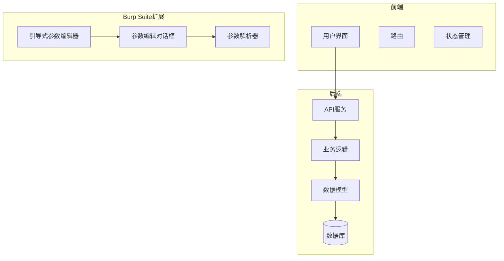
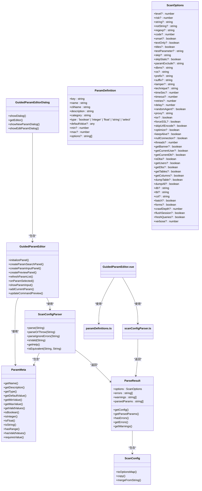
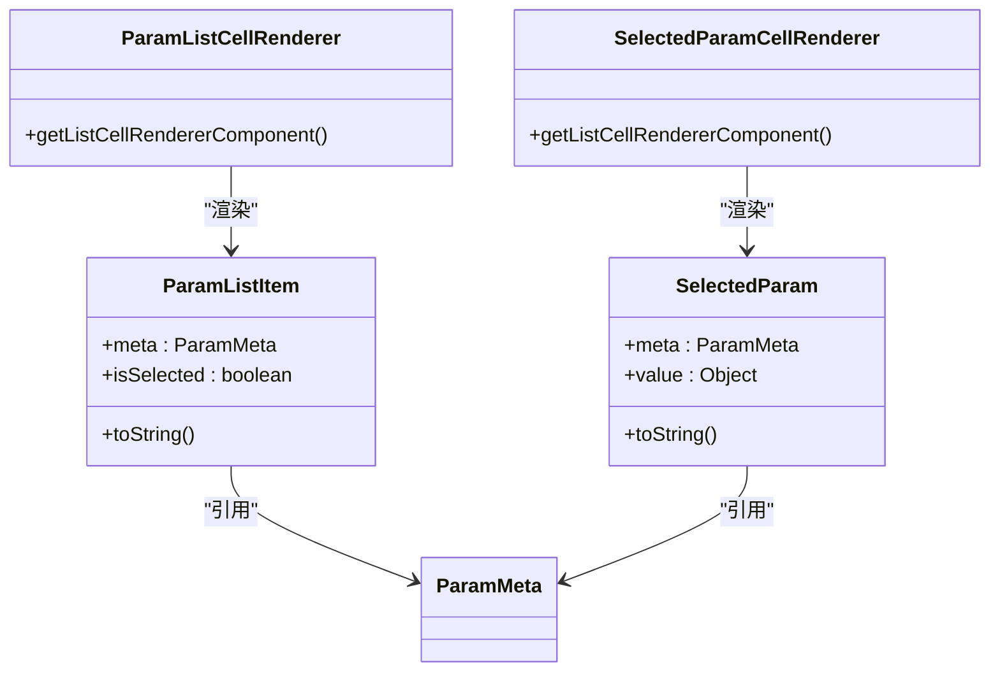
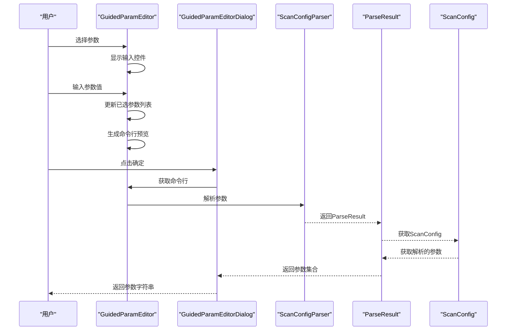
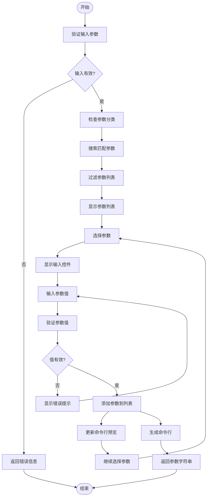
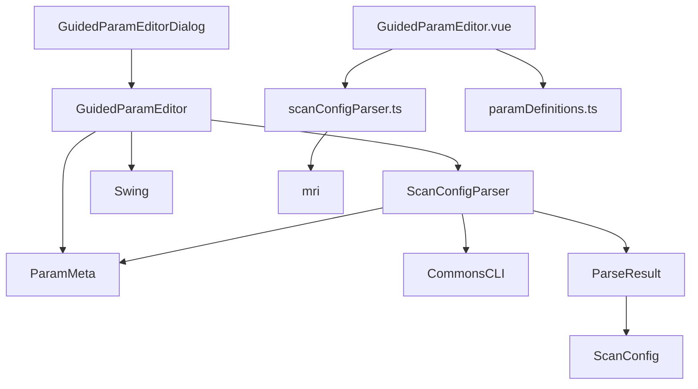

# 引导式参数编辑器

<cite>
**本文档引用的文件**   
- [GuidedParamEditor.java](file://src/burpEx/montoya-api/src/main/java/com/sqlmapwebui/burp/panels/GuidedParamEditor.java)
- [GuidedParamEditorDialog.java](file://src/burpEx/montoya-api/src/main/java/com/sqlmapwebui/burp/panels/GuidedParamEditorDialog.java)
- [ParamMeta.java](file://src/burpEx/montoya-api/src/main/java/com/sqlmapwebui/burp/ParamMeta.java)
- [ScanConfigParser.java](file://src/burpEx/montoya-api/src/main/java/com/sqlmapwebui/burp/ScanConfigParser.java)
- [ParseResult.java](file://src/burpEx/montoya-api/src/main/java/com/sqlmapwebui/burp/ParseResult.java)
- [ScanConfig.java](file://src/burpEx/montoya-api/src/main/java/com/sqlmapwebui/burp/ScanConfig.java)
- [TaskRequest.py](file://src/backEnd/model/requestModel/TaskRequest.py)
- [header_processor.py](file://src/backEnd/utils/header_processor.py)
- [taskService.py](file://src/backEnd/service/taskService.py)
- [GuidedParamEditor.vue](file://src/frontEnd/src/components/GuidedParamEditor.vue)
- [GuidedParamEditorDialog.vue](file://src/frontEnd/src/components/GuidedParamEditorDialog.vue)
- [paramDefinitions.ts](file://src/frontEnd/src/utils/paramDefinitions.ts)
- [scanConfigParser.ts](file://src/frontEnd/src/utils/scanConfigParser.ts)
- [TaskOptions.vue](file://src/frontEnd/src/views/TaskDetail/components/TaskOptions.vue)
- [task.ts](file://src/frontEnd/src/stores/task.ts)
</cite>

## 更新摘要
**已修改内容**   
- 新增参数定义文件 `paramDefinitions.ts` 和解析器 `scanConfigParser.ts`，支持参数搜索、分类筛选、动态输入和实时命令行预览
- 新增 Vue 组件 `GuidedParamEditor.vue` 和 `GuidedParamEditorDialog.vue`，实现前端引导式参数配置界面
- 更新架构概述和详细组件分析部分，反映新增的前端组件和参数定义机制
- 增强了参数类型识别和值范围验证逻辑，提升参数配置的易用性和准确性

## 目录
1. [引言](#引言)
2. [项目结构](#项目结构)
3. [核心组件](#核心组件)
4. [架构概述](#架构概述)
5. [详细组件分析](#详细组件分析)
6. [依赖分析](#依赖分析)
7. [性能考虑](#性能考虑)
8. [故障排除指南](#故障排除指南)
9. [结论](#结论)

## 引言
引导式参数编辑器是SQLMap Web UI项目中的一个关键功能组件，旨在为用户提供一种直观、高效的方式来配置SQLMap扫描参数。该组件通过图形化界面引导用户选择和配置各种扫描选项，包括检测级别、注入技术、请求方法等，极大地简化了复杂命令行参数的配置过程。本文档将深入分析该组件的设计、实现和集成方式，为开发者和用户提供全面的技术参考。

## 项目结构
项目采用前后端分离的架构，前端使用Vue 3和PrimeVue构建用户界面，后端使用Python FastAPI提供API服务。引导式参数编辑器主要在Burp Suite扩展中实现，作为Java Swing组件集成到Burp Suite的UI中。该组件通过对话框形式展示，允许用户通过分类筛选、搜索和实时预览来配置扫描参数。

**Diagram sources**
- [src/frontEnd/src/views/TaskDetail/index.vue](file://src/frontEnd/src/views/TaskDetail/index.vue)
- [src/backEnd/service/taskService.py](file://src/backEnd/service/taskService.py)
- [src/burpEx/montoya-api/src/main/java/com/sqlmapwebui/burp/panels/GuidedParamEditor.java](file://src/burpEx/montoya-api/src/main/java/com/sqlmapwebui/burp/panels/GuidedParamEditor.java)

**Section sources**
- [src/frontEnd/src/views/TaskDetail/index.vue](file://src/frontEnd/src/views/TaskDetail/index.vue)
- [src/backEnd/service/taskService.py](file://src/backEnd/service/taskService.py)
- [src/burpEx/montoya-api/src/main/java/com/sqlmapwebui/burp/panels/GuidedParamEditor.java](file://src/burpEx/montoya-api/src/main/java/com/sqlmapwebui/burp/panels/GuidedParamEditor.java)

## 核心组件
引导式参数编辑器的核心由多个组件构成：`GuidedParamEditor`、`GuidedParamEditorDialog`、`ScanConfigParser`、`paramDefinitions.ts` 和 `scanConfigParser.ts`。`GuidedParamEditor`负责提供参数选择、输入和预览的UI功能；`GuidedParamEditorDialog`将其封装为模态对话框；`ScanConfigParser`负责解析和验证参数字符串；`paramDefinitions.ts`定义了所有参数的元数据；`scanConfigParser.ts`实现了前端参数解析和生成。这些组件协同工作，为用户提供完整的参数配置体验。

**Section sources**
- [src/burpEx/montoya-api/src/main/java/com/sqlmapwebui/burp/panels/GuidedParamEditor.java](file://src/burpEx/montoya-api/src/main/java/com/sqlmapwebui/burp/panels/GuidedParamEditor.java)
- [src/burpEx/montoya-api/src/main/java/com/sqlmapwebui/burp/panels/GuidedParamEditorDialog.java](file://src/burpEx/montoya-api/src/main/java/com/sqlmapwebui/burp/panels/GuidedParamEditorDialog.java)
- [src/burpEx/montoya-api/src/main/java/com/sqlmapwebui/burp/ScanConfigParser.java](file://src/burpEx/montoya-api/src/main/java/com/sqlmapwebui/burp/ScanConfigParser.java)
- [src/frontEnd/src/utils/paramDefinitions.ts](file://src/frontEnd/src/utils/paramDefinitions.ts)
- [src/frontEnd/src/utils/scanConfigParser.ts](file://src/frontEnd/src/utils/scanConfigParser.ts)

## 架构概述
引导式参数编辑器采用分层架构设计，从下到上分别为数据层、逻辑层和表现层。数据层由`ParamMeta`类和`paramDefinitions.ts`定义参数元数据，逻辑层由`ScanConfigParser`和`scanConfigParser.ts`处理参数解析和验证，表现层由`GuidedParamEditor`和`GuidedParamEditor.vue`提供用户交互界面。这种分层设计确保了组件的可维护性和可扩展性。

**Diagram sources**
- [src/burpEx/montoya-api/src/main/java/com/sqlmapwebui/burp/panels/GuidedParamEditor.java](file://src/burpEx/montoya-api/src/main/java/com/sqlmapwebui/burp/panels/GuidedParamEditor.java)
- [src/burpEx/montoya-api/src/main/java/com/sqlmapwebui/burp/panels/GuidedParamEditorDialog.java](file://src/burpEx/montoya-api/src/main/java/com/sqlmapwebui/burp/panels/GuidedParamEditorDialog.java)
- [src/burpEx/montoya-api/src/main/java/com/sqlmapwebui/burp/ScanConfigParser.java](file://src/burpEx/montoya-api/src/main/java/com/sqlmapwebui/burp/ScanConfigParser.java)
- [src/burpEx/montoya-api/src/main/java/com/sqlmapwebui/burp/ParamMeta.java](file://src/burpEx/montoya-api/src/main/java/com/sqlmapwebui/burp/ParamMeta.java)
- [src/burpEx/montoya-api/src/main/java/com/sqlmapwebui/burp/ParseResult.java](file://src/burpEx/montoya-api/src/main/java/com/sqlmapwebui/burp/ParseResult.java)
- [src/burpEx/montoya-api/src/main/java/com/sqlmapwebui/burp/ScanConfig.java](file://src/burpEx/montoya-api/src/main/java/com/sqlmapwebui/burp/ScanConfig.java)
- [src/frontEnd/src/utils/paramDefinitions.ts](file://src/frontEnd/src/utils/paramDefinitions.ts)
- [src/frontEnd/src/utils/scanConfigParser.ts](file://src/frontEnd/src/utils/scanConfigParser.ts)

## 详细组件分析
### 引导式参数编辑器分析
引导式参数编辑器组件提供了完整的参数配置功能，包括参数搜索、分类筛选、输入控件动态生成和命令行预览。用户可以通过正则表达式、大小写敏感或反转搜索来快速定位所需参数。组件根据参数类型动态显示相应的输入控件，如复选框、下拉列表、数值输入框等，并实时生成命令行预览。

#### 对象导向组件

**Diagram sources**
- [src/burpEx/montoya-api/src/main/java/com/sqlmapwebui/burp/panels/GuidedParamEditor.java](file://src/burpEx/montoya-api/src/main/java/com/sqlmapwebui/burp/panels/GuidedParamEditor.java)
- [src/burpEx/montoya-api/src/main/java/com/sqlmapwebui/burp/ParamMeta.java](file://src/burpEx/montoya-api/src/main/java/com/sqlmapwebui/burp/ParamMeta.java)

#### API/服务组件

**Diagram sources**
- [src/burpEx/montoya-api/src/main/java/com/sqlmapwebui/burp/panels/GuidedParamEditor.java](file://src/burpEx/montoya-api/src/main/java/com/sqlmapwebui/burp/panels/GuidedParamEditor.java)
- [src/burpEx/montoya-api/src/main/java/com/sqlmapwebui/burp/panels/GuidedParamEditorDialog.java](file://src/burpEx/montoya-api/src/main/java/com/sqlmapwebui/burp/panels/GuidedParamEditorDialog.java)
- [src/burpEx/montoya-api/src/main/java/com/sqlmapwebui/burp/ScanConfigParser.java](file://src/burpEx/montoya-api/src/main/java/com/sqlmapwebui/burp/ScanConfigParser.java)
- [src/burpEx/montoya-api/src/main/java/com/sqlmapwebui/burp/ParseResult.java](file://src/burpEx/montoya-api/src/main/java/com/sqlmapwebui/burp/ParseResult.java)
- [src/burpEx/montoya-api/src/main/java/com/sqlmapwebui/burp/ScanConfig.java](file://src/burpEx/montoya-api/src/main/java/com/sqlmapwebui/burp/ScanConfig.java)

**Section sources**
- [src/burpEx/montoya-api/src/main/java/com/sqlmapwebui/burp/panels/GuidedParamEditor.java](file://src/burpEx/montoya-api/src/main/java/com/sqlmapwebui/burp/panels/GuidedParamEditor.java)
- [src/burpEx/montoya-api/src/main/java/com/sqlmapwebui/burp/panels/GuidedParamEditorDialog.java](file://src/burpEx/montoya-api/src/main/java/com/sqlmapwebui/burp/panels/GuidedParamEditorDialog.java)
- [src/burpEx/montoya-api/src/main/java/com/sqlmapwebui/burp/ScanConfigParser.java](file://src/burpEx/montoya-api/src/main/java/com/sqlmapwebui/burp/ScanConfigParser.java)
- [src/burpEx/montoya-api/src/main/java/com/sqlmapwebui/burp/ParseResult.java](file://src/burpEx/montoya-api/src/main/java/com/sqlmapwebui/burp/ParseResult.java)
- [src/burpEx/montoya-api/src/main/java/com/sqlmapwebui/burp/ScanConfig.java](file://src/burpEx/montoya-api/src/main/java/com/sqlmapwebui/burp/ScanConfig.java)

### 复杂逻辑组件
引导式参数编辑器实现了复杂的参数处理逻辑，包括参数类型识别、值范围验证、枚举值匹配和特殊参数处理。例如，`technique`参数被特殊处理为多选框，允许用户选择B(布尔盲注)、E(报错注入)、U(联合查询)、S(堆叠查询)、T(时间盲注)、Q(内联查询)等技术组合。

**Diagram sources**
- [src/burpEx/montoya-api/src/main/java/com/sqlmapwebui/burp/panels/GuidedParamEditor.java](file://src/burpEx/montoya-api/src/main/java/com/sqlmapwebui/burp/panels/GuidedParamEditor.java)
- [src/burpEx/montoya-api/src/main/java/com/sqlmapwebui/burp/ScanConfigParser.java](file://src/burpEx/montoya-api/src/main/java/com/sqlmapwebui/burp/ScanConfigParser.java)

## 依赖分析
引导式参数编辑器依赖于多个核心组件和库。主要依赖包括Apache Commons CLI用于命令行参数解析，Swing用于UI组件，以及项目内部的`ParamMeta`、`ScanConfig`和`ParseResult`类。此外，前端组件依赖Vue 3、PrimeVue和mri库。这些依赖关系确保了组件的功能完整性和稳定性。

**Diagram sources**
- [src/burpEx/montoya-api/src/main/java/com/sqlmapwebui/burp/panels/GuidedParamEditor.java](file://src/burpEx/montoya-api/src/main/java/com/sqlmapwebui/burp/panels/GuidedParamEditor.java)
- [src/burpEx/montoya-api/src/main/java/com/sqlmapwebui/burp/ScanConfigParser.java](file://src/burpEx/montoya-api/src/main/java/com/sqlmapwebui/burp/ScanConfigParser.java)
- [src/burpEx/montoya-api/src/main/java/com/sqlmapwebui/burp/ParamMeta.java](file://src/burpEx/montoya-api/src/main/java/com/sqlmapwebui/burp/ParamMeta.java)
- [src/burpEx/montoya-api/src/main/java/com/sqlmapwebui/burp/ParseResult.java](file://src/burpEx/montoya-api/src/main/java/com/sqlmapwebui/burp/ParseResult.java)
- [src/burpEx/montoya-api/src/main/java/com/sqlmapwebui/burp/ScanConfig.java](file://src/burpEx/montoya-api/src/main/java/com/sqlmapwebui/burp/ScanConfig.java)
- [src/frontEnd/src/components/GuidedParamEditor.vue](file://src/frontEnd/src/components/GuidedParamEditor.vue)
- [src/frontEnd/src/utils/scanConfigParser.ts](file://src/frontEnd/src/utils/scanConfigParser.ts)
- [src/frontEnd/src/utils/paramDefinitions.ts](file://src/frontEnd/src/utils/paramDefinitions.ts)

**Section sources**
- [src/burpEx/montoya-api/src/main/java/com/sqlmapwebui/burp/panels/GuidedParamEditor.java](file://src/burpEx/montoya-api/src/main/java/com/sqlmapwebui/burp/panels/GuidedParamEditor.java)
- [src/burpEx/montoya-api/src/main/java/com/sqlmapwebui/burp/ScanConfigParser.java](file://src/burpEx/montoya-api/src/main/java/com/sqlmapwebui/burp/ScanConfigParser.java)
- [src/burpEx/montoya-api/src/main/java/com/sqlmapwebui/burp/ParamMeta.java](file://src/burpEx/montoya-api/src/main/java/com/sqlmapwebui/burp/ParamMeta.java)
- [src/burpEx/montoya-api/src/main/java/com/sqlmapwebui/burp/ParseResult.java](file://src/burpEx/montoya-api/src/main/java/com/sqlmapwebui/burp/ParseResult.java)
- [src/burpEx/montoya-api/src/main/java/com/sqlmapwebui/burp/ScanConfig.java](file://src/burpEx/montoya-api/src/main/java/com/sqlmapwebui/burp/ScanConfig.java)
- [src/frontEnd/src/components/GuidedParamEditor.vue](file://src/frontEnd/src/components/GuidedParamEditor.vue)
- [src/frontEnd/src/utils/scanConfigParser.ts](file://src/frontEnd/src/utils/scanConfigParser.ts)
- [src/frontEnd/src/utils/paramDefinitions.ts](file://src/frontEnd/src/utils/paramDefinitions.ts)

## 性能考虑
引导式参数编辑器在设计时考虑了性能因素。参数列表的搜索和过滤操作采用实时更新机制，但通过事件去抖和后台线程处理来避免UI卡顿。命令行预览的生成也经过优化，只在参数发生变化时重新生成，减少了不必要的计算开销。

## 故障排除指南
当引导式参数编辑器出现问题时，可以按照以下步骤进行排查：首先检查参数字符串是否符合SQLMap命令行格式；其次验证参数名称和值是否在允许范围内；最后查看日志输出以获取详细的错误信息。对于复杂问题，可以使用编辑器的"帮助"功能获取参数说明。

**Section sources**
- [src/burpEx/montoya-api/src/main/java/com/sqlmapwebui/burp/ScanConfigParser.java](file://src/burpEx/montoya-api/src/main/java/com/sqlmapwebui/burp/ScanConfigParser.java)
- [src/burpEx/montoya-api/src/main/java/com/sqlmapwebui/burp/panels/GuidedParamEditor.java](file://src/burpEx/montoya-api/src/main/java/com/sqlmapwebui/burp/panels/GuidedParamEditor.java)
- [src/burpEx/montoya-api/src/main/java/com/sqlmapwebui/burp/ParseResult.java](file://src/burpEx/montoya-api/src/main/java/com/sqlmapwebui/burp/ParseResult.java)

## 结论
引导式参数编辑器是SQLMap Web UI项目中一个功能强大且用户友好的组件，它通过图形化界面简化了复杂的命令行参数配置过程。该组件的设计充分考虑了用户体验、代码可维护性和系统性能，为安全测试人员提供了高效、可靠的参数配置工具。通过深入理解其架构和实现细节，开发者可以更好地利用和扩展这一功能。