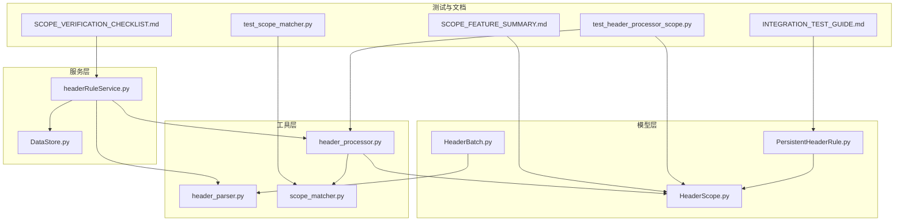
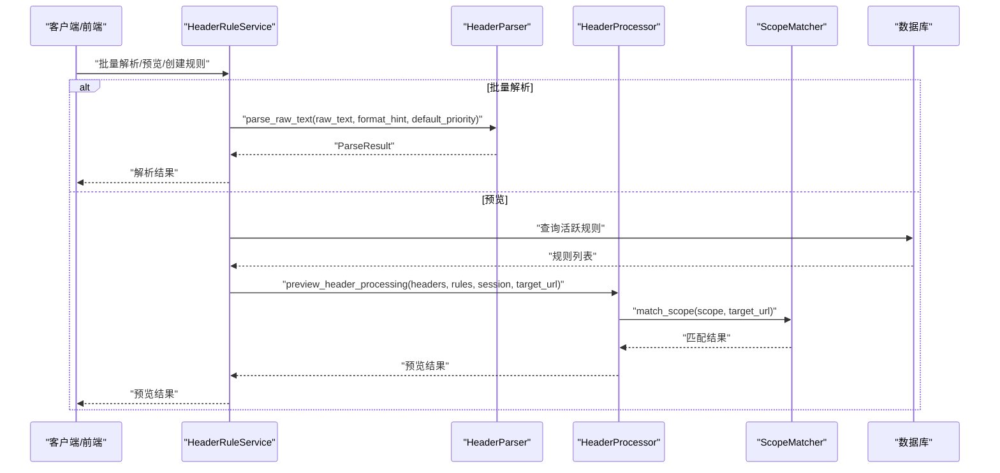
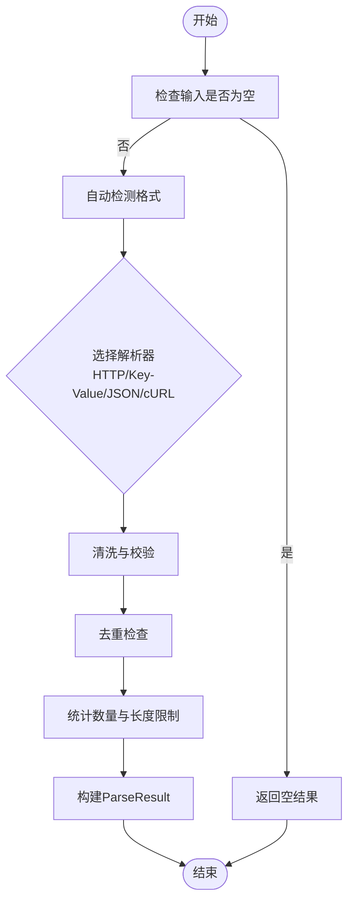
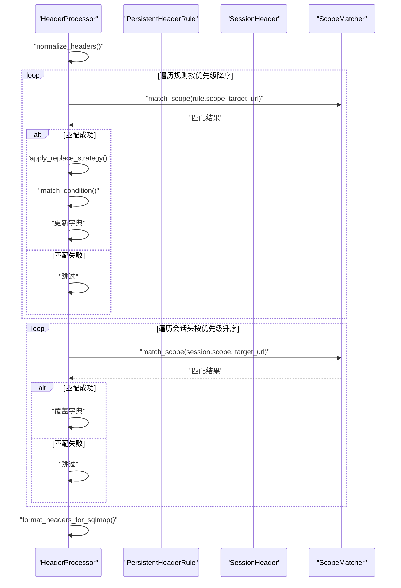
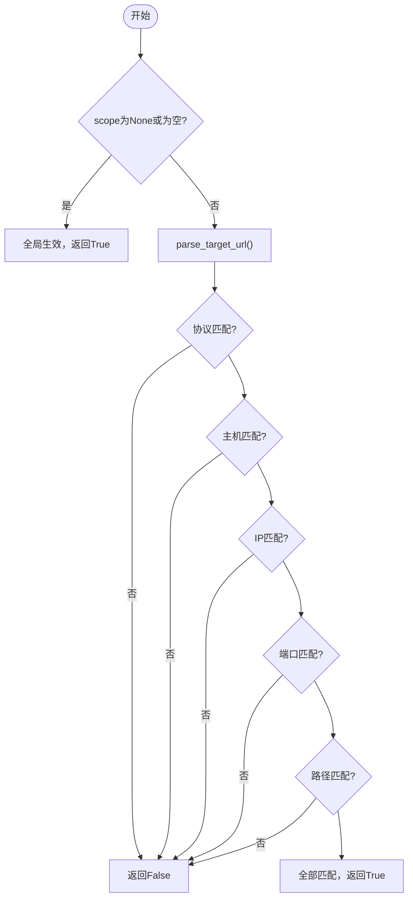
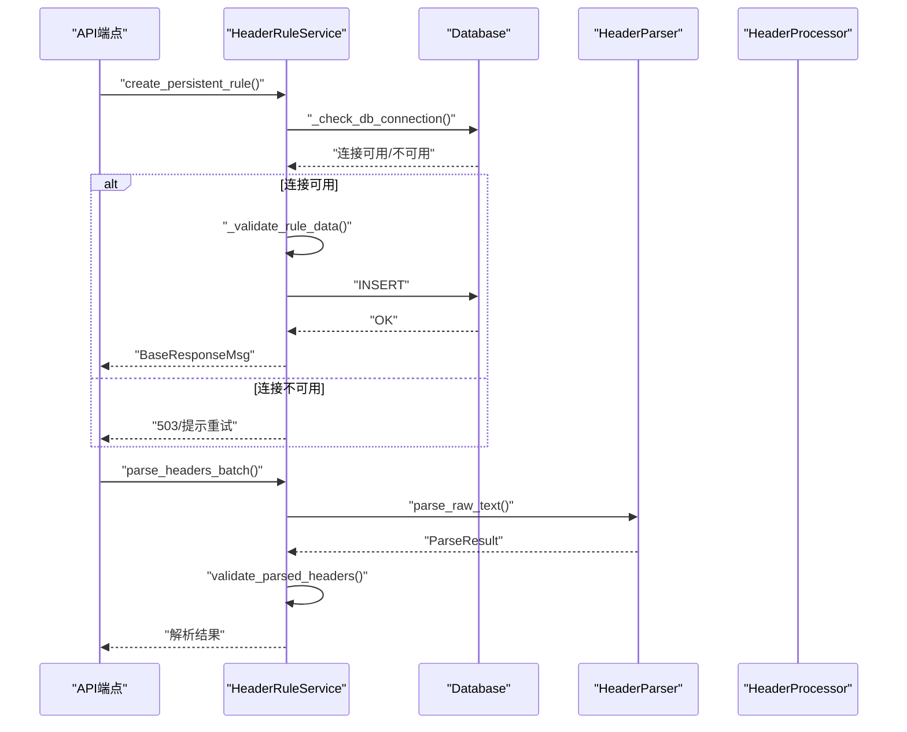
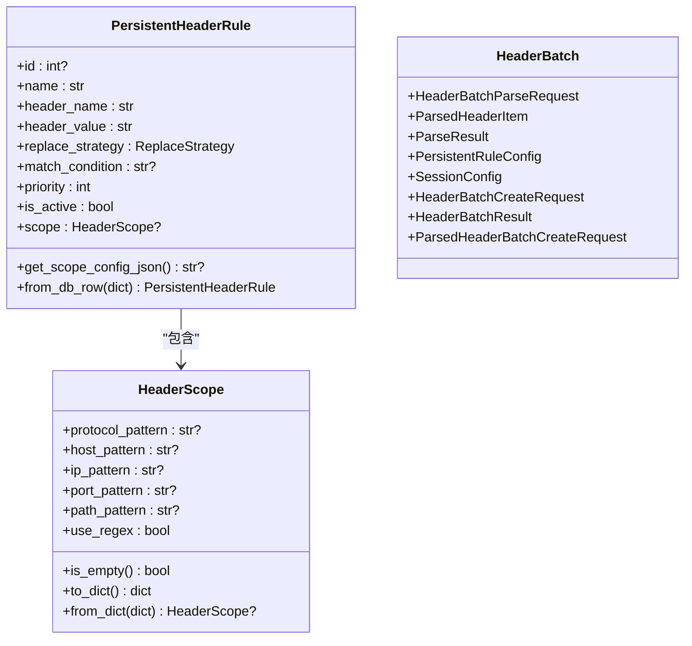
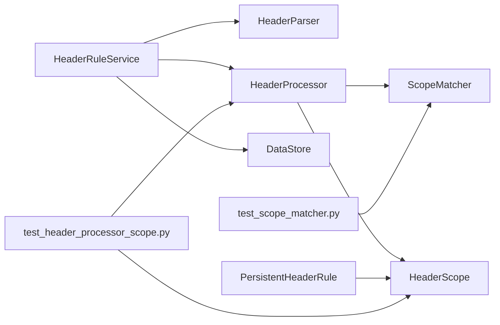

# 扫描配置解析器

<cite>
**本文引用的文件**
- [header_parser.py](file://src/backEnd/utils/header_parser.py)
- [header_processor.py](file://src/backEnd/utils/header_processor.py)
- [scope_matcher.py](file://src/backEnd/utils/scope_matcher.py)
- [HeaderScope.py](file://src/backEnd/model/HeaderScope.py)
- [PersistentHeaderRule.py](file://src/backEnd/model/PersistentHeaderRule.py)
- [HeaderBatch.py](file://src/backEnd/model/HeaderBatch.py)
- [headerRuleService.py](file://src/backEnd/service/headerRuleService.py)
- [DataStore.py](file://src/backEnd/model/DataStore.py)
- [test_header_processor_scope.py](file://src/backEnd/tests/test_header_processor_scope.py)
- [test_scope_matcher.py](file://src/backEnd/tests/test_scope_matcher.py)
- [SCOPE_FEATURE_SUMMARY.md](file://src/backEnd/doc/SCOPE_FEATURE_SUMMARY.md)
- [INTEGRATION_TEST_GUIDE.md](file://src/backEnd/doc/INTEGRATION_TEST_GUIDE.md)
- [SCOPE_VERIFICATION_CHECKLIST.md](file://src/backEnd/doc/SCOPE_VERIFICATION_CHECKLIST.md)
</cite>

## 目录
1. [简介](#简介)
2. [项目结构](#项目结构)
3. [核心组件](#核心组件)
4. [架构总览](#架构总览)
5. [详细组件分析](#详细组件分析)
6. [依赖关系分析](#依赖关系分析)
7. [性能考量](#性能考量)
8. [故障排查指南](#故障排查指南)
9. [结论](#结论)
10. [附录](#附录)

## 简介
本文件聚焦“扫描配置解析器”的实现与使用，系统性梳理后端请求头解析与处理链路，涵盖以下能力：
- 多格式请求头文本解析（HTTP、键值对、JSON、cURL）
- 请求头规则持久化与会话性请求头应用
- 作用域匹配（协议、主机、IP、端口、路径），支持关键字与正则
- 预览与批量导入流程
- 与前端任务执行的衔接

该解析器服务于 Web UI 的“请求头规则”与“扫描任务”两大场景，既保证向后兼容，又提供细粒度的作用域控制与高性能匹配。

## 项目结构
后端采用“模型-工具-服务-测试-文档”的分层组织，扫描配置解析器主要涉及如下模块：
- 模型层：HeaderScope、PersistentHeaderRule、HeaderBatch
- 工具层：HeaderParser、HeaderProcessor、ScopeMatcher
- 服务层：HeaderRuleService（封装规则 CRUD、批量解析与预览）
- 测试与文档：单元测试与集成验证清单

图表来源
- [header_parser.py](file://src/backEnd/utils/header_parser.py#L1-L343)
- [header_processor.py](file://src/backEnd/utils/header_processor.py#L1-L292)
- [scope_matcher.py](file://src/backEnd/utils/scope_matcher.py#L1-L346)
- [HeaderScope.py](file://src/backEnd/model/HeaderScope.py#L1-L187)
- [PersistentHeaderRule.py](file://src/backEnd/model/PersistentHeaderRule.py#L1-L104)
- [HeaderBatch.py](file://src/backEnd/model/HeaderBatch.py#L1-L86)
- [headerRuleService.py](file://src/backEnd/service/headerRuleService.py#L1-L976)
- [DataStore.py](file://src/backEnd/model/DataStore.py#L1-L34)
- [test_header_processor_scope.py](file://src/backEnd/tests/test_header_processor_scope.py#L1-L341)
- [test_scope_matcher.py](file://src/backEnd/tests/test_scope_matcher.py#L1-L286)
- [SCOPE_FEATURE_SUMMARY.md](file://src/backEnd/doc/SCOPE_FEATURE_SUMMARY.md#L1-L48)
- [INTEGRATION_TEST_GUIDE.md](file://src/backEnd/doc/INTEGRATION_TEST_GUIDE.md#L184-L209)
- [SCOPE_VERIFICATION_CHECKLIST.md](file://src/backEnd/doc/SCOPE_VERIFICATION_CHECKLIST.md#L1-L59)

章节来源
- [header_parser.py](file://src/backEnd/utils/header_parser.py#L1-L343)
- [header_processor.py](file://src/backEnd/utils/header_processor.py#L1-L292)
- [scope_matcher.py](file://src/backEnd/utils/scope_matcher.py#L1-L346)
- [HeaderScope.py](file://src/backEnd/model/HeaderScope.py#L1-L187)
- [PersistentHeaderRule.py](file://src/backEnd/model/PersistentHeaderRule.py#L1-L104)
- [HeaderBatch.py](file://src/backEnd/model/HeaderBatch.py#L1-L86)
- [headerRuleService.py](file://src/backEnd/service/headerRuleService.py#L1-L976)
- [DataStore.py](file://src/backEnd/model/DataStore.py#L1-L34)
- [test_header_processor_scope.py](file://src/backEnd/tests/test_header_processor_scope.py#L1-L341)
- [test_scope_matcher.py](file://src/backEnd/tests/test_scope_matcher.py#L1-L286)
- [SCOPE_FEATURE_SUMMARY.md](file://src/backEnd/doc/SCOPE_FEATURE_SUMMARY.md#L1-L48)
- [INTEGRATION_TEST_GUIDE.md](file://src/backEnd/doc/INTEGRATION_TEST_GUIDE.md#L184-L209)
- [SCOPE_VERIFICATION_CHECKLIST.md](file://src/backEnd/doc/SCOPE_VERIFICATION_CHECKLIST.md#L1-L59)

## 核心组件
- HeaderParser：多格式请求头文本解析器，支持自动格式检测、清洗与校验，并输出结构化结果。
- HeaderProcessor：请求头处理引擎，负责将持久化规则与会话性请求头应用到原始请求头集合，支持作用域匹配与预览。
- ScopeMatcher：作用域匹配器，按协议、主机、IP、端口、路径五维匹配，支持关键字与正则，内置缓存优化。
- HeaderScope：作用域数据模型，定义各维度的匹配模式与正则开关。
- PersistentHeaderRule：持久化请求头规则模型，支持替换策略、优先级、作用域、启用状态等。
- HeaderBatch：批量解析与创建的请求/响应模型，统一格式提示与默认参数。
- HeaderRuleService：服务层入口，封装规则 CRUD、批量解析、预览、数据库交互与错误处理。
- DataStore：全局数据存储，提供会话头管理器单例访问。

章节来源
- [header_parser.py](file://src/backEnd/utils/header_parser.py#L1-L343)
- [header_processor.py](file://src/backEnd/utils/header_processor.py#L1-L292)
- [scope_matcher.py](file://src/backEnd/utils/scope_matcher.py#L1-L346)
- [HeaderScope.py](file://src/backEnd/model/HeaderScope.py#L1-L187)
- [PersistentHeaderRule.py](file://src/backEnd/model/PersistentHeaderRule.py#L1-L104)
- [HeaderBatch.py](file://src/backEnd/model/HeaderBatch.py#L1-L86)
- [headerRuleService.py](file://src/backEnd/service/headerRuleService.py#L1-L976)
- [DataStore.py](file://src/backEnd/model/DataStore.py#L1-L34)

## 架构总览
扫描配置解析器的整体流程如下：
- 输入：原始请求头文本或原始请求头列表
- 解析：HeaderParser 解析并校验，得到结构化列表
- 应用：HeaderProcessor 应用持久化规则与会话性请求头，支持作用域匹配
- 输出：最终请求头列表与应用规则摘要；或批量结果与预览信息

图表来源
- [headerRuleService.py](file://src/backEnd/service/headerRuleService.py#L584-L623)
- [header_parser.py](file://src/backEnd/utils/header_parser.py#L226-L305)
- [header_processor.py](file://src/backEnd/utils/header_processor.py#L214-L292)
- [scope_matcher.py](file://src/backEnd/utils/scope_matcher.py#L35-L141)

## 详细组件分析

### 组件A：HeaderParser（请求头解析器）
职责
- 支持多种输入格式：HTTP 报文、键值对、JSON、cURL 命令
- 自动格式检测与清洗
- 结构化输出与错误/警告收集

关键流程
- 自动检测：根据内容特征判定格式（JSON、cURL、键值对优先于HTTP）
- 解析：按格式分别提取键值对，清洗值，校验头名合法性
- 校验：统计重复头、数量上限、值长度限制
- 输出：ParseResult，包含成功标志、解析项、计数与诊断信息

图表来源
- [header_parser.py](file://src/backEnd/utils/header_parser.py#L198-L305)

章节来源
- [header_parser.py](file://src/backEnd/utils/header_parser.py#L1-L343)
- [HeaderBatch.py](file://src/backEnd/model/HeaderBatch.py#L1-L86)

### 组件B：HeaderProcessor（请求头处理器）
职责
- 将原始请求头列表标准化为字典，再应用持久化规则与会话性请求头
- 支持替换策略（替换、追加、前置、条件性、UPSERT）
- 支持匹配条件（正则）与作用域匹配（协议、主机、IP、端口、路径）

关键流程
- 标准化：将 "K: V" 列表转为字典
- 应用持久化规则：按优先级排序，逐条应用替换策略，支持作用域匹配与条件匹配
- 应用会话性请求头：过滤过期，按优先级排序，覆盖已有值
- 格式化：转回 "K: V" 列表
- 预览：不实际应用，返回处理前后对比与应用规则描述

图表来源
- [header_processor.py](file://src/backEnd/utils/header_processor.py#L12-L258)
- [scope_matcher.py](file://src/backEnd/utils/scope_matcher.py#L35-L141)

章节来源
- [header_processor.py](file://src/backEnd/utils/header_processor.py#L1-L292)
- [PersistentHeaderRule.py](file://src/backEnd/model/PersistentHeaderRule.py#L1-L104)
- [HeaderScope.py](file://src/backEnd/model/HeaderScope.py#L1-L187)

### 组件C：ScopeMatcher（作用域匹配器）
职责
- 多维度匹配：协议、主机、IP、端口、路径
- 支持关键字与正则两种模式
- 内置 URL 解析与正则编译缓存，提升性能

关键流程
- URL 解析：解析 scheme/host/port/path，必要时解析 IP
- 维度匹配：协议/主机/IP/端口/路径逐一匹配，任一不匹配即返回失败
- 缓存：正则编译缓存与 URL 解析缓存，限制最大容量并定期清理

图表来源
- [scope_matcher.py](file://src/backEnd/utils/scope_matcher.py#L35-L141)
- [scope_matcher.py](file://src/backEnd/utils/scope_matcher.py#L143-L215)
- [scope_matcher.py](file://src/backEnd/utils/scope_matcher.py#L227-L346)

章节来源
- [scope_matcher.py](file://src/backEnd/utils/scope_matcher.py#L1-L346)
- [HeaderScope.py](file://src/backEnd/model/HeaderScope.py#L1-L187)

### 组件D：HeaderRuleService（规则服务）
职责
- 规则 CRUD：创建、查询、更新、删除
- 批量解析：将原始文本解析为结构化请求头
- 预览：在不实际应用的情况下展示处理结果
- 数据库交互：连接检查、序列化/反序列化 scope、事务安全

关键流程
- 创建规则：校验数据、去重、序列化 scope、入库
- 查询规则：支持按启用状态筛选，反序列化 scope
- 更新规则：字段级更新、名称冲突检查、序列化 scope
- 预览：获取活跃规则与会话头，调用 HeaderProcessor 预览
- 批量解析：委托 HeaderParser，二次校验并返回结果

图表来源
- [headerRuleService.py](file://src/backEnd/service/headerRuleService.py#L74-L176)
- [headerRuleService.py](file://src/backEnd/service/headerRuleService.py#L177-L260)
- [headerRuleService.py](file://src/backEnd/service/headerRuleService.py#L584-L623)
- [headerRuleService.py](file://src/backEnd/service/headerRuleService.py#L629-L676)

章节来源
- [headerRuleService.py](file://src/backEnd/service/headerRuleService.py#L1-L976)
- [DataStore.py](file://src/backEnd/model/DataStore.py#L1-L34)

### 组件E：模型与数据流
- HeaderScope：定义协议、主机、IP、端口、路径的匹配模式与正则开关
- PersistentHeaderRule：规则名称、头名、头值、替换策略、匹配条件、优先级、启用状态、作用域
- HeaderBatch：批量解析/创建的请求/响应模型，统一格式提示与默认参数

图表来源
- [HeaderScope.py](file://src/backEnd/model/HeaderScope.py#L1-L187)
- [PersistentHeaderRule.py](file://src/backEnd/model/PersistentHeaderRule.py#L1-L104)
- [HeaderBatch.py](file://src/backEnd/model/HeaderBatch.py#L1-L86)

章节来源
- [HeaderScope.py](file://src/backEnd/model/HeaderScope.py#L1-L187)
- [PersistentHeaderRule.py](file://src/backEnd/model/PersistentHeaderRule.py#L1-L104)
- [HeaderBatch.py](file://src/backEnd/model/HeaderBatch.py#L1-L86)

## 依赖关系分析
- HeaderRuleService 依赖 HeaderParser、HeaderProcessor、DataStore、数据库
- HeaderProcessor 依赖 ScopeMatcher、HeaderScope、PersistentHeaderRule
- ScopeMatcher 依赖 HeaderScope
- 测试用例覆盖 ScopeMatcher 与 HeaderProcessor 的作用域匹配逻辑

图表来源
- [headerRuleService.py](file://src/backEnd/service/headerRuleService.py#L1-L976)
- [header_processor.py](file://src/backEnd/utils/header_processor.py#L1-L292)
- [scope_matcher.py](file://src/backEnd/utils/scope_matcher.py#L1-L346)
- [HeaderScope.py](file://src/backEnd/model/HeaderScope.py#L1-L187)
- [PersistentHeaderRule.py](file://src/backEnd/model/PersistentHeaderRule.py#L1-L104)
- [test_header_processor_scope.py](file://src/backEnd/tests/test_header_processor_scope.py#L1-L341)
- [test_scope_matcher.py](file://src/backEnd/tests/test_scope_matcher.py#L1-L286)

章节来源
- [headerRuleService.py](file://src/backEnd/service/headerRuleService.py#L1-L976)
- [header_processor.py](file://src/backEnd/utils/header_processor.py#L1-L292)
- [scope_matcher.py](file://src/backEnd/utils/scope_matcher.py#L1-L346)
- [HeaderScope.py](file://src/backEnd/model/HeaderScope.py#L1-L187)
- [PersistentHeaderRule.py](file://src/backEnd/model/PersistentHeaderRule.py#L1-L104)
- [test_header_processor_scope.py](file://src/backEnd/tests/test_header_processor_scope.py#L1-L341)
- [test_scope_matcher.py](file://src/backEnd/tests/test_scope_matcher.py#L1-L286)

## 性能考量
- 缓存策略
  - URL 解析缓存：最多 50 条，命中直接返回
  - 正则编译缓存：最多 100 条，命中直接复用
- 早期退出：任一维度不匹配立即返回，减少后续计算
- 优先级排序：规则按优先级降序，会话头按优先级升序，避免多次遍历
- 日志与诊断：解析器与处理器均输出详细日志，便于定位性能瓶颈与问题

章节来源
- [scope_matcher.py](file://src/backEnd/utils/scope_matcher.py#L27-L41)
- [scope_matcher.py](file://src/backEnd/utils/scope_matcher.py#L143-L191)
- [scope_matcher.py](file://src/backEnd/utils/scope_matcher.py#L255-L293)
- [header_processor.py](file://src/backEnd/utils/header_processor.py#L90-L151)
- [header_processor.py](file://src/backEnd/utils/header_processor.py#L153-L211)

## 故障排查指南
常见问题与定位建议
- 解析失败
  - 检查输入是否为空或格式不匹配
  - 查看解析器返回的错误列表与警告
  - 使用预览接口确认规则与会话头应用效果
- 作用域不生效
  - 确认规则/会话头的 scope 配置是否正确
  - 确认 target_url 是否传入，否则作用域检查不会生效
  - 使用单元测试用例验证匹配逻辑
- 数据库连接异常
  - 检查服务层连接检查与错误码
  - 确认数据库表结构包含 scope_config 列
- 预览与实际应用差异
  - 预览不实际应用，仅展示结果；实际应用时会覆盖已有值

章节来源
- [headerRuleService.py](file://src/backEnd/service/headerRuleService.py#L44-L60)
- [headerRuleService.py](file://src/backEnd/service/headerRuleService.py#L584-L623)
- [INTEGRATION_TEST_GUIDE.md](file://src/backEnd/doc/INTEGRATION_TEST_GUIDE.md#L184-L209)
- [test_header_processor_scope.py](file://src/backEnd/tests/test_header_processor_scope.py#L1-L341)
- [test_scope_matcher.py](file://src/backEnd/tests/test_scope_matcher.py#L1-L286)

## 结论
扫描配置解析器以“多格式解析 + 作用域匹配 + 规则应用”为核心，实现了灵活、可控、高性能的请求头处理链路。通过完善的模型设计、工具层解耦与服务层封装，既能满足复杂扫描任务的精细化配置需求，又能保持良好的可维护性与可扩展性。配合测试与文档，确保功能稳定与回归可控。

## 附录
- 验证清单与集成测试参考
  - 作用域功能实施总结
  - API 端点与 scope 字段 CRUD 验证
  - 数据库表结构与数据存储验证

章节来源
- [SCOPE_FEATURE_SUMMARY.md](file://src/backEnd/doc/SCOPE_FEATURE_SUMMARY.md#L1-L48)
- [SCOPE_VERIFICATION_CHECKLIST.md](file://src/backEnd/doc/SCOPE_VERIFICATION_CHECKLIST.md#L1-L59)
- [INTEGRATION_TEST_GUIDE.md](file://src/backEnd/doc/INTEGRATION_TEST_GUIDE.md#L184-L209)