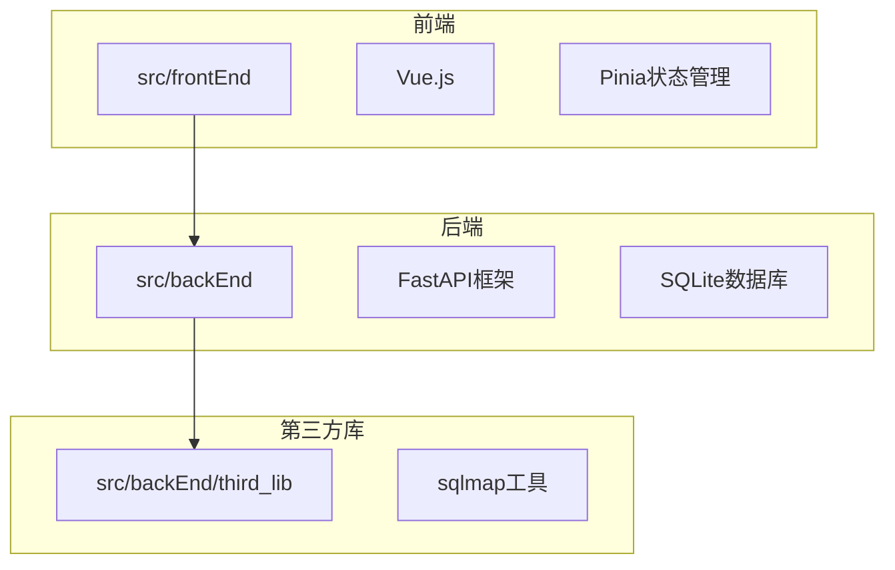
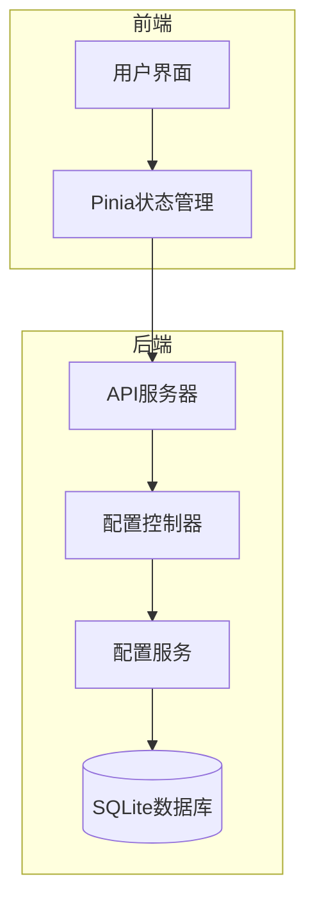
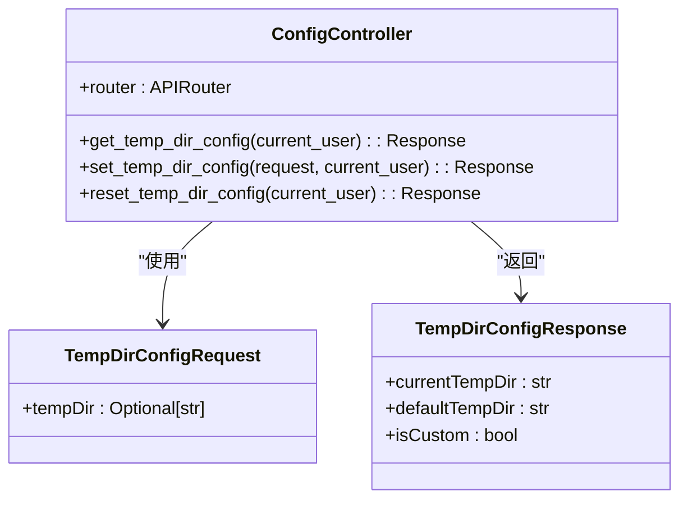
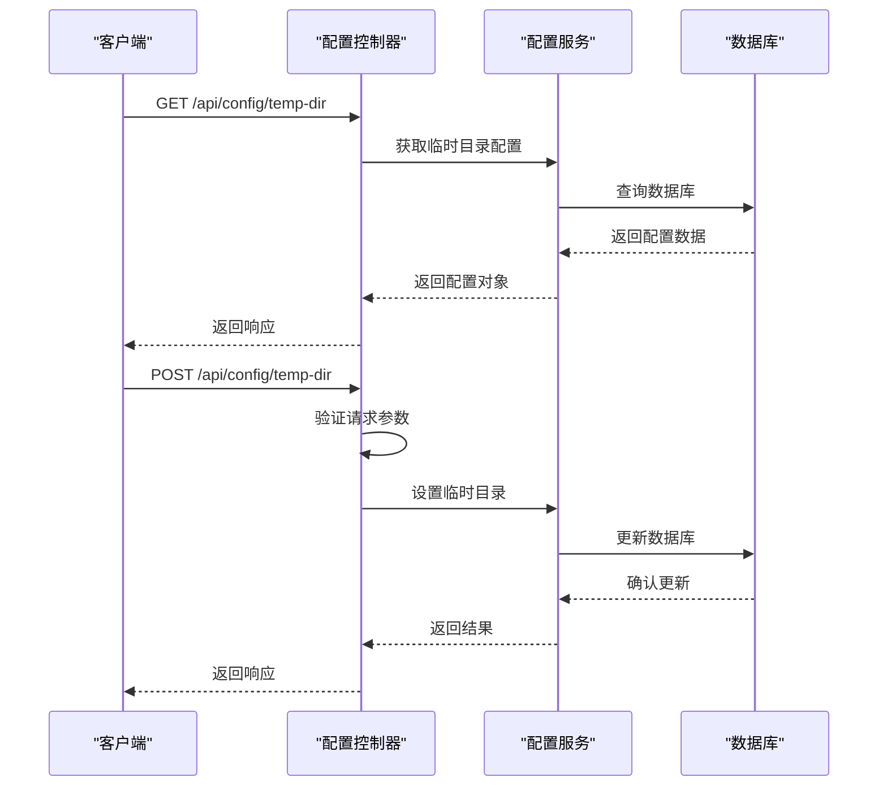
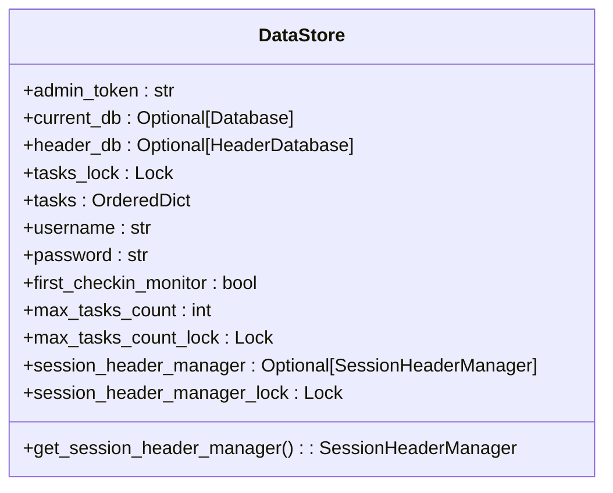
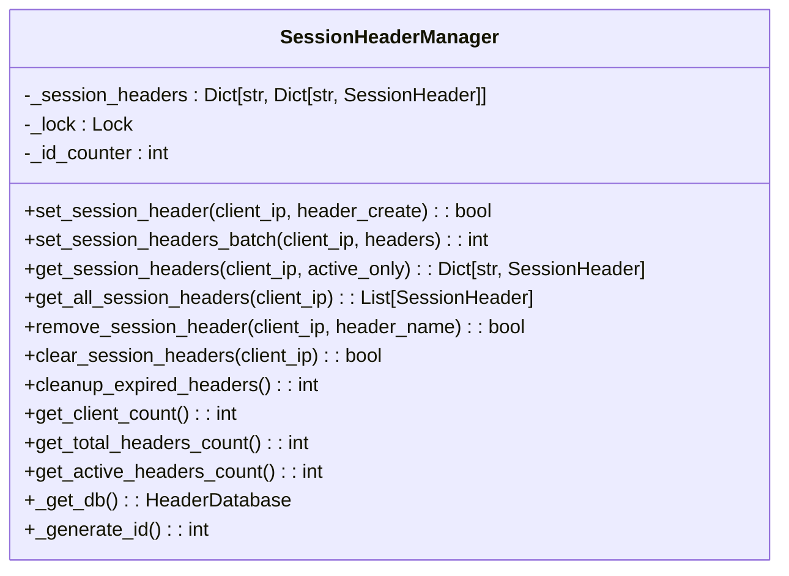
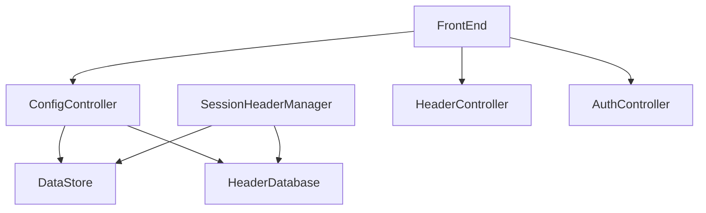

# 配置管理

<cite>
**本文档中引用的文件**  
- [app.py](file://src/backEnd/app.py)
- [config.py](file://src/backEnd/config.py)
- [main.py](file://src/backEnd/main.py)
- [configController.py](file://src/backEnd/api/commonApi/configController.py)
- [DataStore.py](file://src/backEnd/model/DataStore.py)
- [task_monitor.py](file://src/backEnd/utils/task_monitor.py)
- [session_header_manager.py](file://src/backEnd/utils/session_header_manager.py)
- [HeaderDatabase.py](file://src/backEnd/model/HeaderDatabase.py)
- [PersistentHeaderRule.py](file://src/backEnd/model/PersistentHeaderRule.py)
- [config.ts](file://src/frontEnd/src/stores/config.ts)
- [ServerConfigPanel.java](file://src/burpEx/montoya-api/src/main/java/com/sqlmapwebui/burp/panels/ServerConfigPanel.java)
</cite>

## 目录
1. [简介](#简介)
2. [项目结构](#项目结构)
3. [核心组件](#核心组件)
4. [架构概述](#架构概述)
5. [详细组件分析](#详细组件分析)
6. [依赖分析](#依赖分析)
7. [性能考虑](#性能考虑)
8. [故障排除指南](#故障排除指南)
9. [结论](#结论)

## 简介
本项目是一个基于Python的Web安全测试工具，提供了一个用户友好的前端界面来管理SQL注入测试任务。系统采用前后端分离架构，后端使用FastAPI框架，前端使用Vue.js框架。配置管理是系统的核心功能之一，负责管理各种配置参数，包括临时文件目录、请求头规则、会话管理等。系统通过RESTful API提供配置管理功能，支持持久化存储和动态更新。

## 项目结构
项目采用分层架构，主要分为前端、后端和第三方库三个部分。后端代码位于src/backEnd目录下，包含API接口、模型、服务和工具类。前端代码位于src/frontEnd目录下，使用Vue.js框架构建用户界面。第三方库位于src/backEnd/third_lib目录下，包含sqlmap等核心工具。

**图源**
- [app.py](file://src/backEnd/app.py#L1-L76)
- [main.py](file://src/backEnd/main.py#L1-L163)

**章节源**
- [app.py](file://src/backEnd/app.py#L1-L76)
- [main.py](file://src/backEnd/main.py#L1-L163)

## 核心组件
配置管理的核心组件包括配置控制器、数据存储、会话管理器和数据库管理。配置控制器负责处理API请求，数据存储负责全局状态管理，会话管理器负责管理临时会话头，数据库管理负责持久化存储。

**章节源**
- [configController.py](file://src/backEnd/api/commonApi/configController.py#L1-L173)
- [DataStore.py](file://src/backEnd/model/DataStore.py#L1-L34)

## 架构概述
系统采用微服务架构，配置管理作为独立的服务模块运行。后端提供RESTful API接口，前端通过HTTP请求与后端交互。配置数据存储在SQLite数据库中，支持持久化和动态更新。系统使用Pinia进行前端状态管理，使用DataStore进行后端全局状态管理。

**图源**
- [app.py](file://src/backEnd/app.py#L1-L76)
- [configController.py](file://src/backEnd/api/commonApi/configController.py#L1-L173)

## 详细组件分析

### 配置控制器分析
配置控制器是系统配置管理的核心组件，负责处理所有与配置相关的API请求。控制器提供了获取、设置和重置临时文件目录的功能。

#### 配置控制器类图

**图源**
- [configController.py](file://src/backEnd/api/commonApi/configController.py#L1-L173)

#### 配置控制器序列图

**图源**
- [configController.py](file://src/backEnd/api/commonApi/configController.py#L1-L173)

**章节源**
- [configController.py](file://src/backEnd/api/commonApi/configController.py#L1-L173)

### 数据存储分析
DataStore类是系统的全局数据存储中心，负责管理所有共享状态，包括数据库连接、任务列表、最大任务数等。

#### DataStore类图

**图源**
- [DataStore.py](file://src/backEnd/model/DataStore.py#L1-L34)

**章节源**
- [DataStore.py](file://src/backEnd/model/DataStore.py#L1-L34)

### 会话管理器分析
SessionHeaderManager类负责管理会话性请求头，支持设置、获取、删除和批量操作会话头。

#### 会话管理器类图

**图源**
- [session_header_manager.py](file://src/backEnd/utils/session_header_manager.py#L1-L313)

**章节源**
- [session_header_manager.py](file://src/backEnd/utils/session_header_manager.py#L1-L313)

## 依赖分析
系统各组件之间存在明确的依赖关系。配置控制器依赖于数据存储和数据库管理，会话管理器依赖于数据存储和头部数据库。前端通过API与后端交互，依赖于后端提供的RESTful接口。

**图源**
- [app.py](file://src/backEnd/app.py#L1-L76)
- [configController.py](file://src/backEnd/api/commonApi/configController.py#L1-L173)

**章节源**
- [app.py](file://src/backEnd/app.py#L1-L76)
- [configController.py](file://src/backEnd/api/commonApi/configController.py#L1-L173)

## 性能考虑
系统在配置管理方面进行了多项性能优化。使用SQLite数据库进行持久化存储，支持快速读写操作。通过线程锁保护共享资源，确保多线程环境下的数据一致性。使用OrderedDict存储任务列表，保持插入顺序。定期清理过期的会话头，减少内存占用。

## 故障排除指南
配置管理相关的常见问题包括：
1. 临时目录无法创建：检查目录权限和路径有效性
2. 配置更新失败：检查数据库连接和SQL语句
3. 会话头丢失：检查内存管理和清理机制
4. API调用超时：检查网络连接和服务器负载

**章节源**
- [configController.py](file://src/backEnd/api/commonApi/configController.py#L1-L173)
- [session_header_manager.py](file://src/backEnd/utils/session_header_manager.py#L1-L313)

## 结论
本系统的配置管理模块设计合理，功能完整，支持持久化存储和动态更新。通过RESTful API提供配置管理功能，便于前后端分离架构的集成。系统使用SQLite数据库进行持久化存储，确保数据的可靠性和一致性。会话管理器支持临时会话头的管理，满足了Web安全测试的特殊需求。整体架构清晰，组件职责明确，便于维护和扩展。