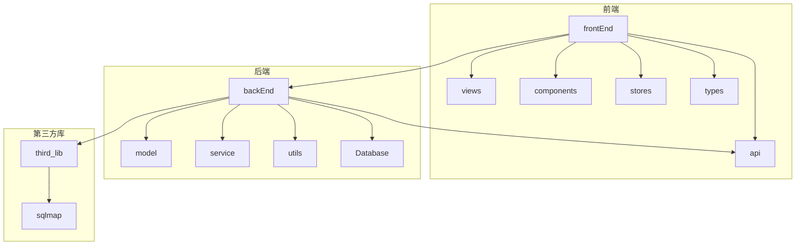
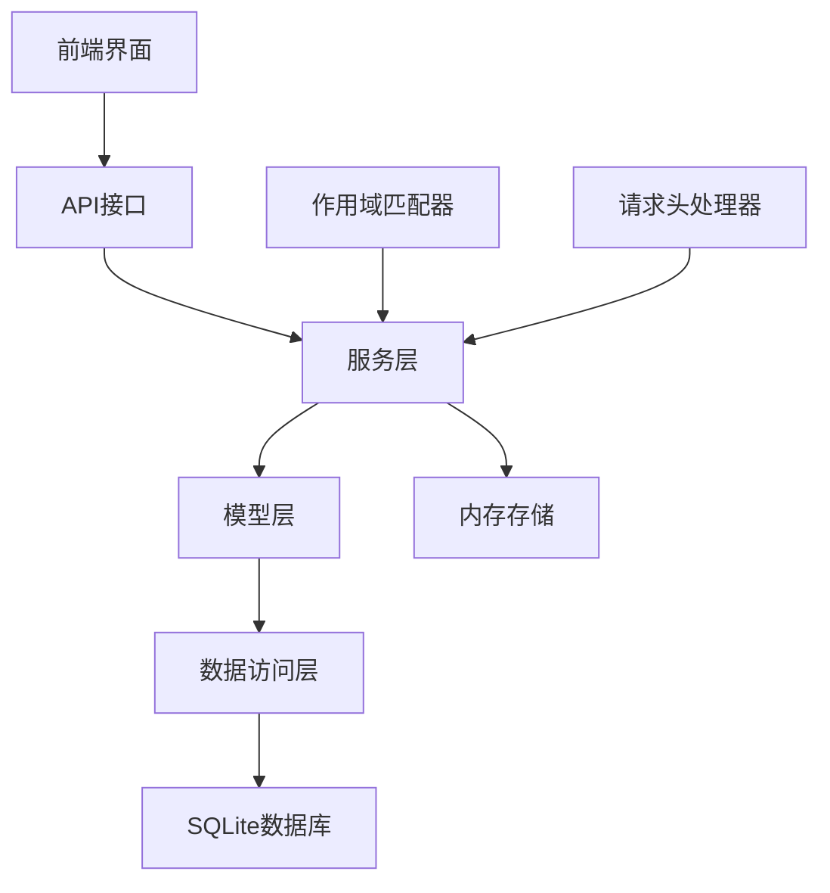
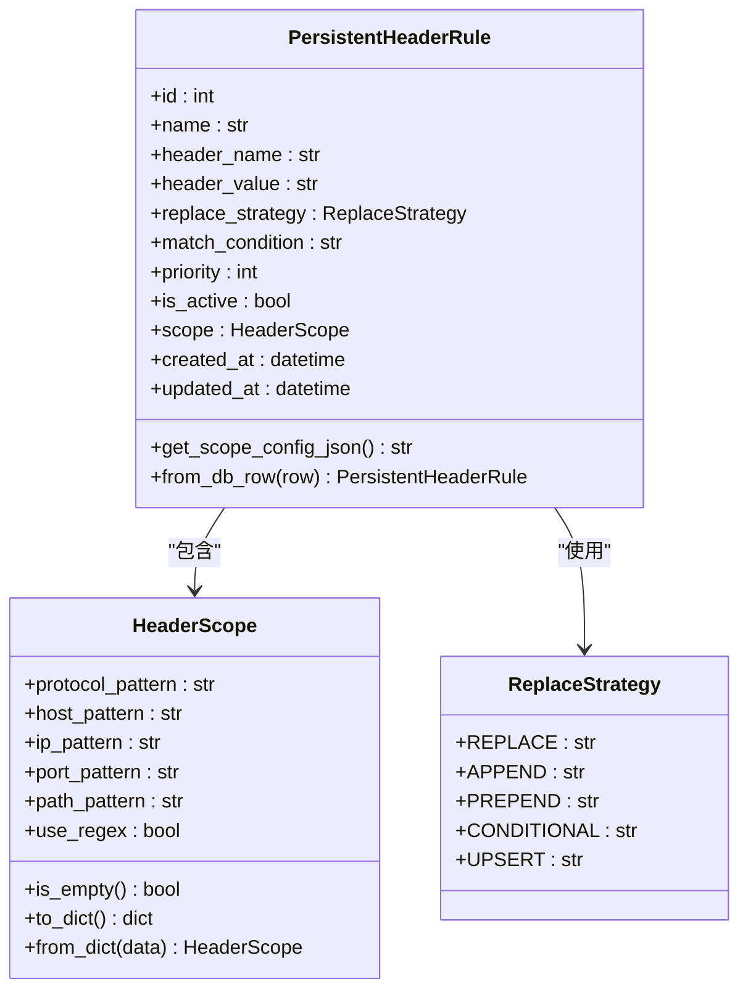
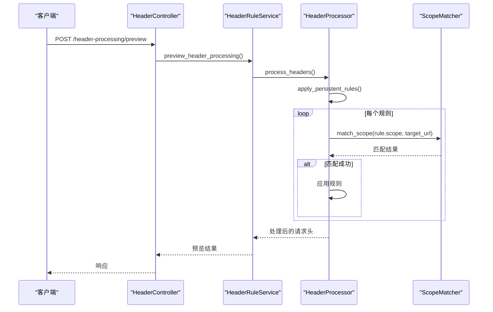
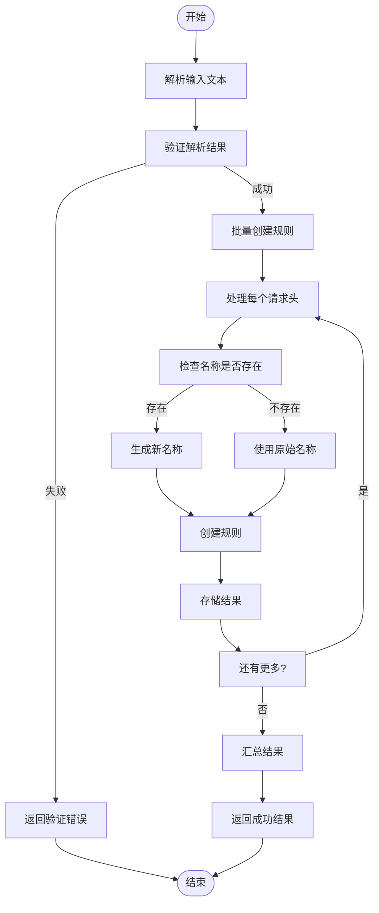
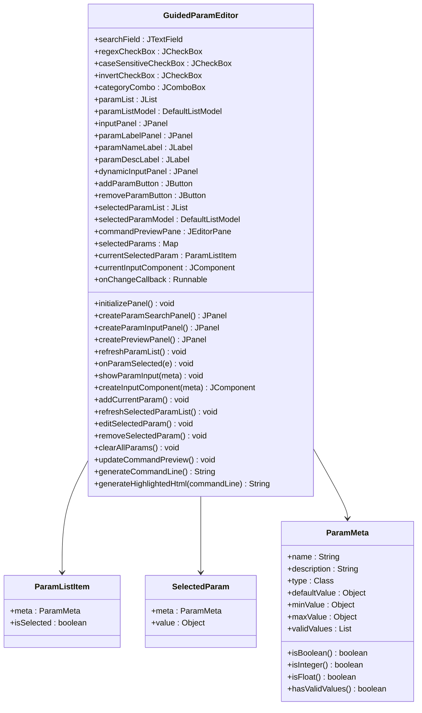
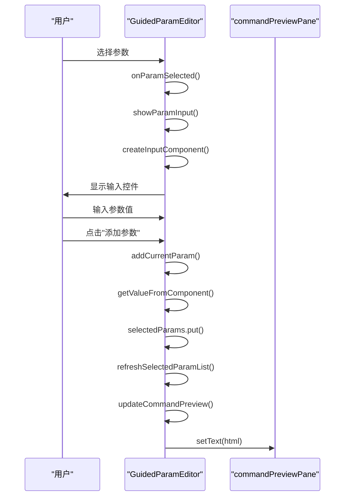
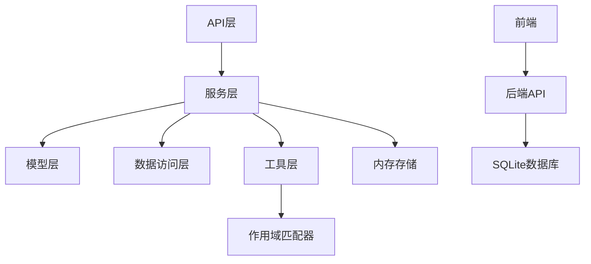

# 预设配置管理

<cite>
**本文档引用文件**   
- [app.py](file://src/backEnd/app.py)
- [headerController.py](file://src/backEnd/api/commonApi/headerController.py)
- [headerRuleService.py](file://src/backEnd/service/headerRuleService.py)
- [PersistentHeaderRule.py](file://src/backEnd/model/PersistentHeaderRule.py)
- [HeaderScope.py](file://src/backEnd/model/HeaderScope.py)
- [HeaderDatabase.py](file://src/backEnd/model/HeaderDatabase.py)
- [header_processor.py](file://src/backEnd/utils/header_processor.py)
- [headerRule.ts](file://src/frontEnd/src/api/headerRule.ts)
- [config.ts](file://src/frontEnd/src/stores/config.ts)
- [index.vue](file://src/frontEnd/src/views/Config/index.vue)
- [PresetConfigPanel.java](file://src/burpEx/legacy-api/src/main/java/com/sqlmapwebui/burp/panels/PresetConfigPanel.java)
- [PresetConfigPanel.java](file://src/burpEx/montoya-api/src/main/java/com/sqlmapwebui/burp/panels/PresetConfigPanel.java)
- [GuidedParamEditor.java](file://src/burpEx/legacy-api/src/main/java/com/sqlmapwebui/burp/panels/GuidedParamEditor.java)
- [GuidedParamEditor.java](file://src/burpEx/montoya-api/src/main/java/com/sqlmapwebui/burp/panels/GuidedParamEditor.java)
</cite>

## 更新摘要
**变更内容**   
- 在预设配置管理界面中增加了'引导式编辑'功能按钮，允许用户直接从预设配置界面启动引导式参数编辑器
- 更新了参数输入标签为'命令行参数 *:'，并添加了内联'引导式编辑'按钮
- 新增了引导式参数编辑器组件的详细说明
- 更新了相关代码文件的引用

## 目录
1. [简介](#简介)
2. [项目结构](#项目结构)
3. [核心组件](#核心组件)
4. [架构概述](#架构概述)
5. [详细组件分析](#详细组件分析)
6. [依赖分析](#依赖分析)
7. [性能考虑](#性能考虑)
8. [故障排除指南](#故障排除指南)
9. [结论](#结论)

## 简介
本项目是一个基于Web的SQLMap前端管理界面，专注于预设配置管理功能。系统允许用户通过Web界面管理持久化请求头规则和会话性请求头，支持作用域匹配、批量操作和预览功能。核心功能包括持久化请求头规则的CRUD操作、会话性请求头管理、作用域配置、批量导入和处理预览。系统采用前后端分离架构，后端使用FastAPI框架，前端使用Vue3和PrimeVue组件库。

在最新版本中，系统增加了'引导式编辑'功能，允许用户通过可视化界面编辑SQLMap命令行参数。用户可以直接在预设配置界面中点击'引导式编辑'按钮，启动引导式参数编辑器，通过图形化界面选择和配置各种扫描参数，而无需手动输入复杂的命令行参数。这一改进显著提升了用户体验和功能可访问性。

## 项目结构
项目采用典型的前后端分离架构，包含后端API服务、前端Web界面和第三方库。后端使用Python的FastAPI框架，前端使用Vue3和Vite构建。系统通过SQLite数据库存储持久化请求头规则，并在内存中管理会话性请求头。

**Diagram sources**
- [app.py](file://src/backEnd/app.py#L1-L74)
- [index.vue](file://src/frontEnd/src/views/Config/index.vue#L1-L588)

**Section sources**
- [app.py](file://src/backEnd/app.py#L1-L74)
- [index.vue](file://src/frontEnd/src/views/Config/index.vue#L1-L588)

## 核心组件
系统的核心组件包括持久化请求头规则管理、会话性请求头管理、作用域匹配和批量操作功能。持久化请求头规则存储在SQLite数据库中，支持作用域配置、优先级设置和多种替换策略。会话性请求头存储在内存中，具有生存时间(TTL)机制。作用域匹配支持协议、主机名、IP、端口和路径的多维度匹配。系统还提供批量导入和预览功能，提高配置效率。

新增的引导式参数编辑器是系统的重要功能组件，它提供了一个可视化界面，帮助用户配置SQLMap的命令行参数。编辑器支持参数搜索、分类筛选、实时预览等功能，用户可以通过勾选、输入、选择等方式配置各种扫描参数，如检测级别、风险级别、注入技术等。配置完成后，系统会自动生成相应的命令行参数字符串。

**Section sources**
- [PersistentHeaderRule.py](file://src/backEnd/model/PersistentHeaderRule.py#L1-L104)
- [HeaderScope.py](file://src/backEnd/model/HeaderScope.py#L1-L187)
- [header_processor.py](file://src/backEnd/utils/header_processor.py#L1-L292)
- [PresetConfigPanel.java](file://src/burpEx/legacy-api/src/main/java/com/sqlmapwebui/burp/panels/PresetConfigPanel.java#L1044-L1054)
- [PresetConfigPanel.java](file://src/burpEx/montoya-api/src/main/java/com/sqlmapwebui/burp/panels/PresetConfigPanel.java#L1044-L1054)

## 架构概述
系统采用分层架构设计，包括API层、服务层、模型层和数据访问层。API层处理HTTP请求和响应，服务层实现业务逻辑，模型层定义数据结构，数据访问层负责数据库操作。前端通过REST API与后端交互，使用Pinia进行状态管理。系统支持作用域匹配，允许规则根据目标URL的协议、主机名、IP、端口和路径进行条件性应用。

**Diagram sources**
- [headerController.py](file://src/backEnd/api/commonApi/headerController.py#L1-L463)
- [headerRuleService.py](file://src/backEnd/service/headerRuleService.py#L1-L976)
- [header_processor.py](file://src/backEnd/utils/header_processor.py#L1-L292)

## 详细组件分析

### 持久化请求头规则分析
持久化请求头规则是系统的核心功能，允许用户创建、读取、更新和删除请求头规则。每个规则包含名称、请求头名称、值、替换策略、匹配条件、优先级、启用状态和作用域配置。规则存储在SQLite数据库中，支持全局或特定作用域应用。

#### 持久化请求头规则类图

**Diagram sources**
- [PersistentHeaderRule.py](file://src/backEnd/model/PersistentHeaderRule.py#L1-L104)
- [HeaderScope.py](file://src/backEnd/model/HeaderScope.py#L1-L187)

### 作用域匹配分析
作用域匹配功能允许请求头规则根据目标URL的多个维度进行条件性应用。系统支持协议、主机名、IP、端口和路径的匹配，可以使用通配符或正则表达式。当规则配置了作用域且提供了目标URL时，系统会检查是否匹配，只有匹配的规则才会被应用。

#### 作用域匹配序列图

**Diagram sources**
- [headerController.py](file://src/backEnd/api/commonApi/headerController.py#L337-L365)
- [headerRuleService.py](file://src/backEnd/service/headerRuleService.py#L584-L623)
- [header_processor.py](file://src/backEnd/utils/header_processor.py#L89-L151)

### 批量操作分析
批量操作功能允许用户一次性导入多个请求头规则，提高配置效率。系统支持从原始文本解析请求头，然后批量创建持久化规则或会话性请求头。批量操作包括解析、验证、创建和结果反馈等步骤。

#### 批量操作流程图

**Diagram sources**
- [headerRuleService.py](file://src/backEnd/service/headerRuleService.py#L629-L800)
- [headerController.py](file://src/backEnd/api/commonApi/headerController.py#L410-L434)

### 引导式参数编辑器分析
引导式参数编辑器是系统新增的重要功能组件，它提供了一个可视化界面，帮助用户配置SQLMap的命令行参数。编辑器支持参数搜索、分类筛选、实时预览等功能。

#### 引导式参数编辑器类图

**Diagram sources**
- [GuidedParamEditor.java](file://src/burpEx/legacy-api/src/main/java/com/sqlmapwebui/burp/panels/GuidedParamEditor.java#L31-L722)
- [GuidedParamEditor.java](file://src/burpEx/montoya-api/src/main/java/com/sqlmapwebui/burp/panels/GuidedParamEditor.java#L31-L722)

#### 引导式参数编辑器序列图

**Diagram sources**
- [GuidedParamEditor.java](file://src/burpEx/legacy-api/src/main/java/com/sqlmapwebui/burp/panels/GuidedParamEditor.java#L567-L593)
- [GuidedParamEditor.java](file://src/burpEx/montoya-api/src/main/java/com/sqlmapwebui/burp/panels/GuidedParamEditor.java#L567-L593)

## 依赖分析
系统各组件之间存在清晰的依赖关系。API层依赖服务层实现业务逻辑，服务层依赖模型层和数据访问层。前端API依赖后端REST接口，状态管理依赖Pinia。系统使用SQLite作为持久化存储，内存存储用于会话性请求头。各组件耦合度适中，便于维护和扩展。

**Diagram sources**
- [app.py](file://src/backEnd/app.py#L10-L13)
- [headerController.py](file://src/backEnd/api/commonApi/headerController.py#L15)
- [headerRuleService.py](file://src/backEnd/service/headerRuleService.py#L9-L27)

**Section sources**
- [app.py](file://src/backEnd/app.py#L1-L74)
- [headerController.py](file://src/backEnd/api/commonApi/headerController.py#L1-L463)
- [headerRuleService.py](file://src/backEnd/service/headerRuleService.py#L1-L976)

## 性能考虑
系统在性能方面进行了多项优化。数据库操作使用连接池和索引优化查询性能，对持久化规则表的is_active、priority和header_name字段创建了索引。内存中的会话性请求头管理使用字典结构，确保O(1)的查找性能。请求头处理过程按优先级排序规则，确保高优先级规则先应用。系统还实现了健康检查和版本信息接口，便于监控服务状态。

## 故障排除指南
常见问题包括数据库连接失败、规则名称冲突、请求头名称格式无效等。系统在创建规则时会验证数据完整性，返回详细的错误信息。对于作用域匹配问题，建议检查目标URL格式和作用域配置的匹配模式。批量操作失败时，系统会返回每个项目的处理结果，便于定位具体问题。日志记录功能帮助追踪请求处理过程，便于调试和问题分析。

**Section sources**
- [headerRuleService.py](file://src/backEnd/service/headerRuleService.py#L74-L85)
- [headerRuleService.py](file://src/backEnd/service/headerRuleService.py#L109-L111)
- [headerRuleService.py](file://src/backEnd/service/headerRuleService.py#L388-L394)

## 结论
本预设配置管理系统提供了一套完整的请求头管理解决方案，支持持久化规则、会话性请求头、作用域匹配和批量操作。系统架构清晰，组件职责明确，易于维护和扩展。通过作用域配置，用户可以精确控制规则的应用范围，提高安全性和灵活性。系统界面友好，操作便捷，适合各种规模的安全测试需求。

新增的引导式参数编辑器功能显著提升了用户体验，使用户能够通过图形化界面轻松配置复杂的SQLMap命令行参数，而无需记忆各种参数的语法和选项。这一功能的加入使得系统更加易用，降低了用户的学习成本，提高了配置效率。