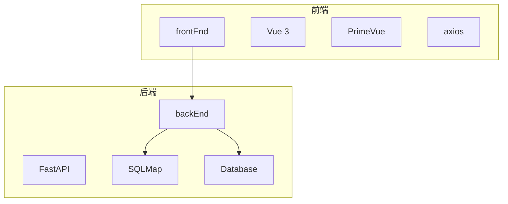
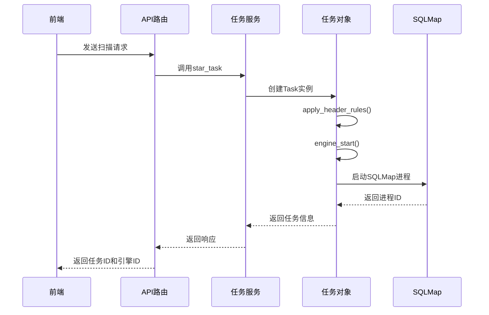
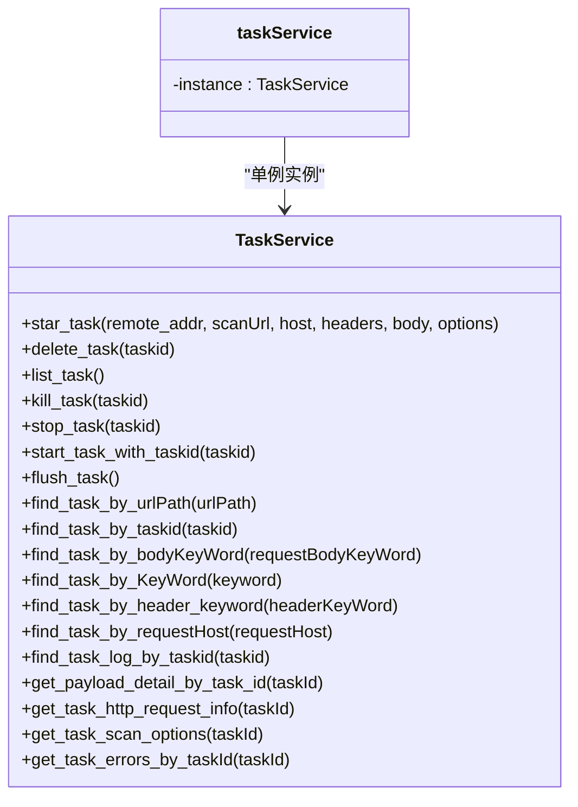
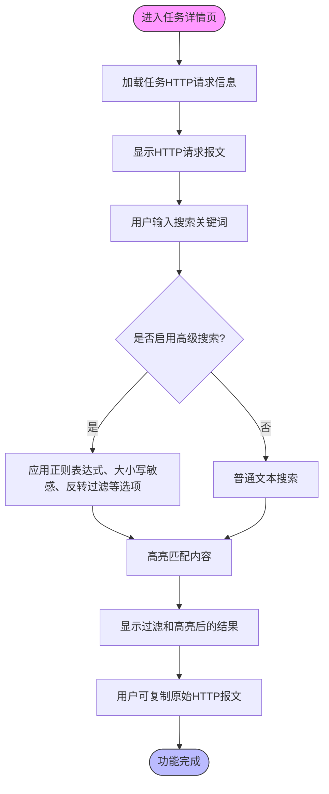
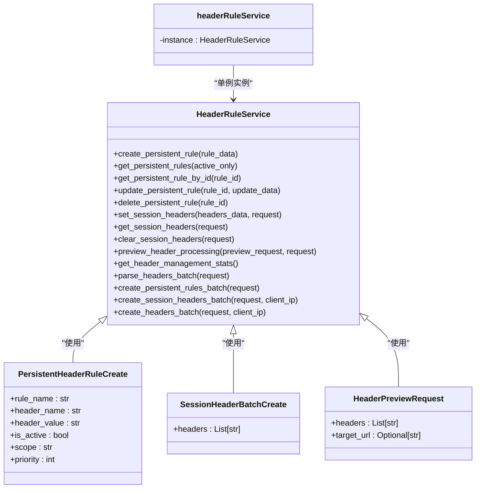
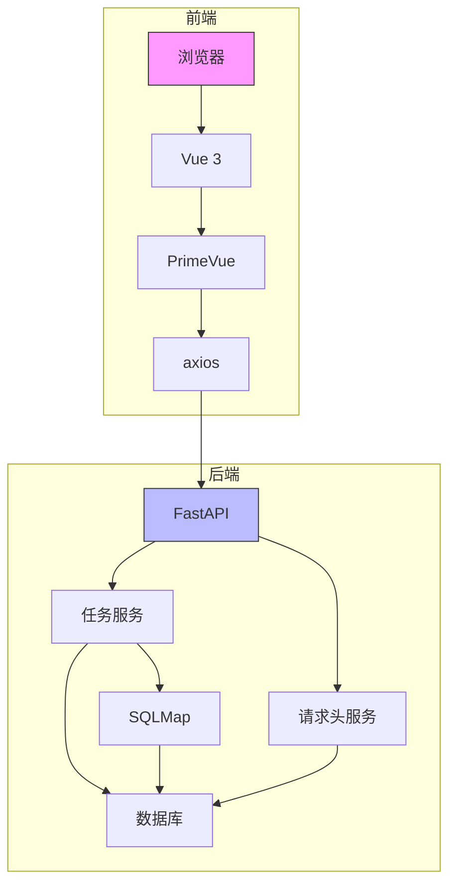

# 任务HTTP请求查看

<cite>
**本文档引用的文件**   
- [app.py](file://src/backEnd/app.py)
- [main.py](file://src/backEnd/main.py)
- [config.py](file://src/backEnd/config.py)
- [TaskRequest.py](file://src/backEnd/model/requestModel/TaskRequest.py)
- [taskService.py](file://src/backEnd/service/taskService.py)
- [Task.py](file://src/backEnd/model/Task.py)
- [headerController.py](file://src/backEnd/api/commonApi/headerController.py)
- [admin.py](file://src/backEnd/api/chromeExApi/admin.py)
- [admin.py](file://src/backEnd/api/burpSuiteExApi/admin.py)
- [request.ts](file://src/frontEnd/src/api/request.ts)
- [TaskDetail.vue](file://src/frontEnd/src/views/TaskDetail/index.vue)
- [TaskHttpRequest.vue](file://src/frontEnd/src/views/TaskDetail/components/TaskHttpRequest.vue)
- [task.ts](file://src/frontEnd/src/types/task.ts)
</cite>

## 目录
1. [项目结构](#项目结构)
2. [核心组件](#核心组件)
3. [HTTP请求处理流程](#http请求处理流程)
4. [任务管理服务](#任务管理服务)
5. [前端HTTP请求查看实现](#前端http请求查看实现)
6. [请求头管理功能](#请求头管理功能)
7. [系统架构](#系统架构)

## 项目结构

该项目是一个基于FastAPI后端和Vue前端的SQLMap Web UI系统，主要分为前后端两个部分。后端位于`src/backEnd`目录，使用FastAPI框架构建RESTful API服务，前端位于`src/frontEnd`目录，使用Vue 3和PrimeVue构建用户界面。

**图源**
- [app.py](file://src/backEnd/app.py#L1-L67)
- [main.py](file://src/backEnd/main.py#L1-L163)

**节源**
- [app.py](file://src/backEnd/app.py#L1-L67)
- [main.py](file://src/backEnd/main.py#L1-L163)

## 核心组件

系统的核心组件包括任务管理、请求头处理、API路由和前端界面。任务管理负责创建、查询和控制SQLMap扫描任务，请求头处理负责管理和应用HTTP请求头规则，API路由提供RESTful接口供前端调用，前端界面提供用户友好的操作界面。

**节源**
- [config.py](file://src/backEnd/config.py#L1-L8)
- [TaskRequest.py](file://src/backEnd/model/requestModel/TaskRequest.py#L1-L57)

## HTTP请求处理流程

HTTP请求处理流程从用户发起扫描请求开始，经过API路由、任务服务、任务对象，最终调用SQLMap执行扫描。整个流程确保了请求头的正确应用和任务状态的准确管理。

**图源**
- [admin.py](file://src/backEnd/api/burpSuiteExApi/admin.py#L18-L37)
- [taskService.py](file://src/backEnd/service/taskService.py#L58-L87)
- [Task.py](file://src/backEnd/model/Task.py#L139-L171)

**节源**
- [admin.py](file://src/backEnd/api/burpSuiteExApi/admin.py#L18-L37)
- [taskService.py](file://src/backEnd/service/taskService.py#L58-L87)
- [Task.py](file://src/backEnd/model/Task.py#L139-L171)

## 任务管理服务

任务管理服务是系统的核心业务逻辑层，负责处理所有与任务相关的操作，包括任务的创建、删除、查询、停止等。服务通过`TaskService`类实现，提供了异步方法来处理各种任务操作。

**图源**
- [taskService.py](file://src/backEnd/service/taskService.py#L46-L531)

**节源**
- [taskService.py](file://src/backEnd/service/taskService.py#L46-L531)

## 前端HTTP请求查看实现

前端通过`TaskDetail`页面的`TaskHttpRequest`组件实现HTTP请求查看功能。该组件提供了搜索、高亮、过滤和复制等功能，使用户能够方便地查看和分析HTTP请求信息。

**图源**
- [TaskHttpRequest.vue](file://src/frontEnd/src/views/TaskDetail/components/TaskHttpRequest.vue#L1-L444)
- [request.ts](file://src/frontEnd/src/api/request.ts#L207-L223)

**节源**
- [TaskHttpRequest.vue](file://src/frontEnd/src/views/TaskDetail/components/TaskHttpRequest.vue#L1-L444)
- [request.ts](file://src/frontEnd/src/api/request.ts#L207-L223)

## 请求头管理功能

系统提供了完整的请求头管理功能，包括持久化请求头规则和会话性请求头管理。这些功能通过`headerController.py`中的API接口实现，支持创建、查询、更新和删除请求头规则。

**图源**
- [headerController.py](file://src/backEnd/api/commonApi/headerController.py#L68-L371)

**节源**
- [headerController.py](file://src/backEnd/api/commonApi/headerController.py#L68-L371)

## 系统架构

整个系统采用前后端分离的架构，前端通过Vue 3构建用户界面，后端使用FastAPI提供RESTful API服务。系统集成了SQLMap作为漏洞扫描引擎，通过IPC机制与SQLMap进行通信。

**图源**
- [app.py](file://src/backEnd/app.py#L1-L67)
- [main.py](file://src/backEnd/main.py#L1-L163)
- [taskService.py](file://src/backEnd/service/taskService.py#L46-L531)

**节源**
- [app.py](file://src/backEnd/app.py#L1-L67)
- [main.py](file://src/backEnd/main.py#L1-L163)
- [taskService.py](file://src/backEnd/service/taskService.py#L46-L531)