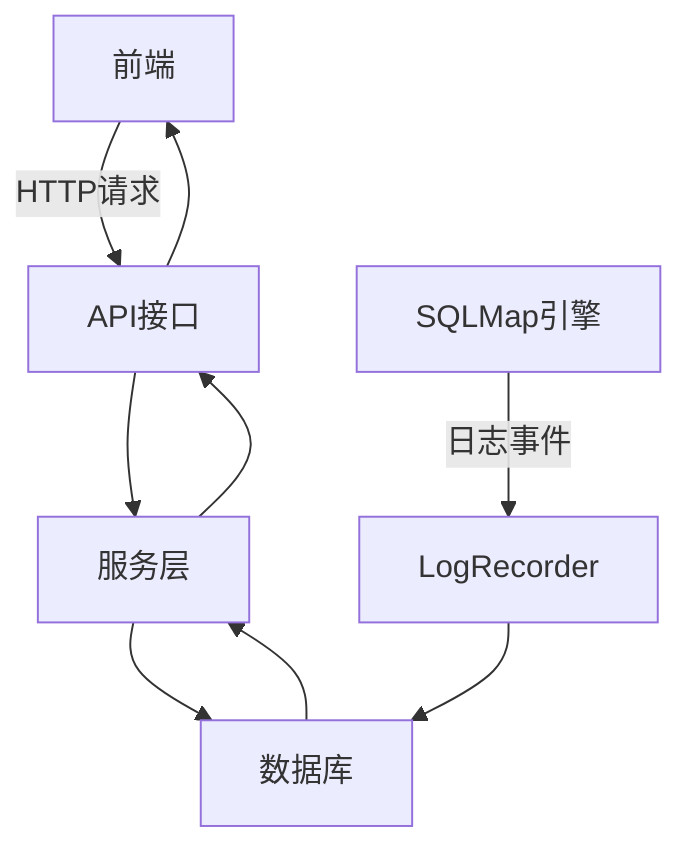
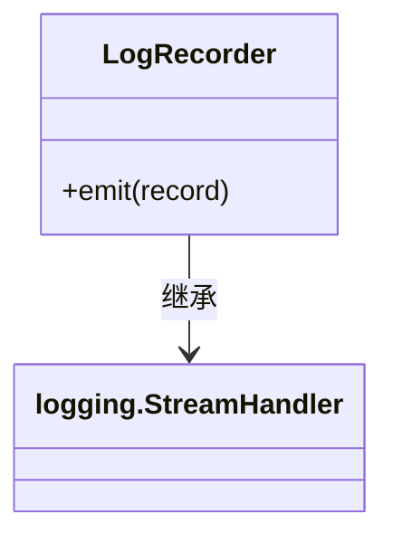
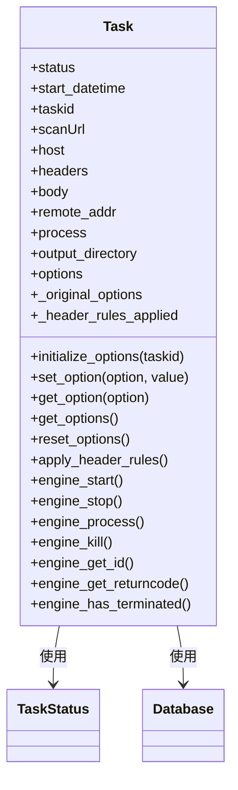
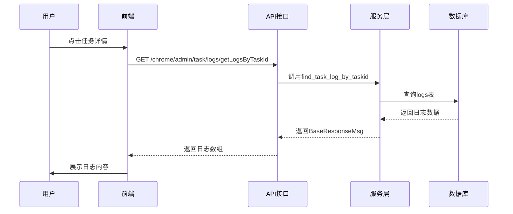
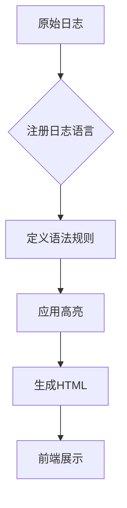
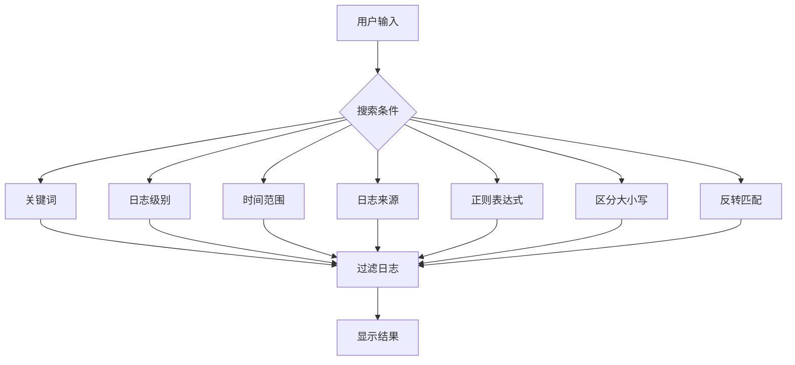
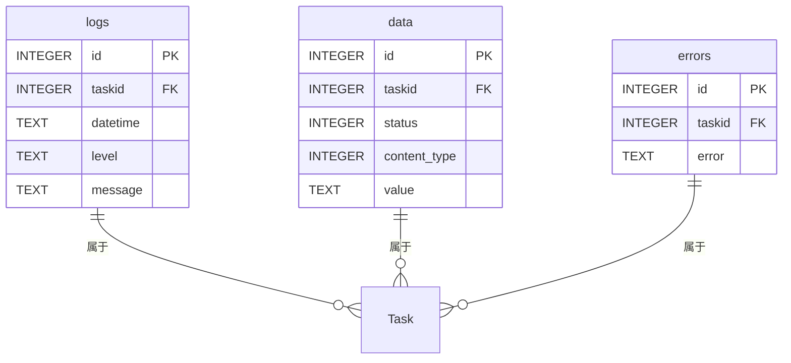
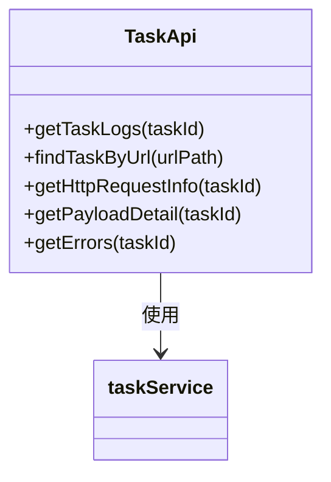
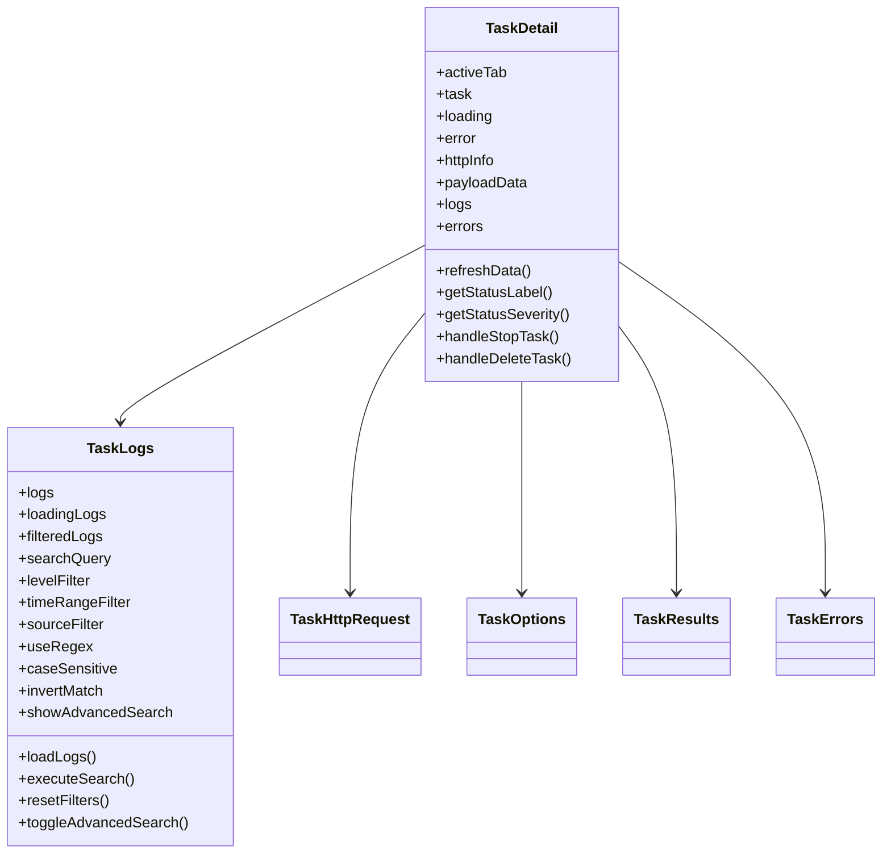

# 任务日志查看

<cite>
**本文档引用的文件**
- [LogRecorder.py](file://src/backEnd/model/LogRecorder.py)
- [Task.py](file://src/backEnd/model/Task.py)
- [taskService.py](file://src/backEnd/service/taskService.py)
- [TaskLogs.vue](file://src/frontEnd/src/views/TaskDetail/components/TaskLogs.vue)
- [useTaskDetail.ts](file://src/frontEnd/src/views/TaskDetail/composables/useTaskDetail.ts)
- [task.ts](file://src/frontEnd/src/api/task.ts)
- [Database.py](file://src/backEnd/model/Database.py)
- [logHighlighter.ts](file://src/frontEnd/src/utils/logHighlighter.ts)
- [log-highlight.css](file://src/frontEnd/src/assets/styles/log-highlight.css)
</cite>

## 目录
1. [简介](#简介)
2. [系统架构](#系统架构)
3. [核心组件分析](#核心组件分析)
4. [任务日志查看流程](#任务日志查看流程)
5. [日志高亮与搜索功能](#日志高亮与搜索功能)
6. [数据库设计](#数据库设计)
7. [API接口](#api接口)
8. [前端组件](#前端组件)
9. [总结](#总结)

## 简介
本系统是一个基于SQLMap的WebUI应用，提供了任务管理、日志查看、扫描配置等功能。本文档重点介绍任务日志查看功能的实现机制，包括后端日志记录、数据库存储、API接口、前端展示等各个环节。

## 系统架构
系统采用前后端分离架构，后端使用Python FastAPI框架，前端使用Vue 3 + PrimeVue。任务日志查看功能涉及多个组件的协作，包括日志记录器、数据库、服务层、API接口和前端组件。

**图源**
- [LogRecorder.py](file://src/backEnd/model/LogRecorder.py)
- [taskService.py](file://src/backEnd/service/taskService.py)
- [Database.py](file://src/backEnd/model/Database.py)
- [TaskLogs.vue](file://src/frontEnd/src/views/TaskDetail/components/TaskLogs.vue)

## 核心组件分析

### 日志记录器 (LogRecorder)
日志记录器负责将SQLMap引擎产生的日志事件记录到IPC数据库中，实现异步I/O通信。

**组件源**
- [LogRecorder.py](file://src/backEnd/model/LogRecorder.py)

### 任务模型 (Task)
任务模型封装了任务的完整信息，包括任务状态、扫描URL、请求头、请求体等。

**组件源**
- [Task.py](file://src/backEnd/model/Task.py)
- [TaskStatus.py](file://src/backEnd/model/TaskStatus.py)
- [Database.py](file://src/backEnd/model/Database.py)

## 任务日志查看流程
任务日志查看功能的完整流程如下：

1. 用户在前端界面点击任务详情
2. 前端通过API接口请求任务日志
3. 后端服务层查询数据库获取日志数据
4. 数据库返回日志记录
5. 服务层将数据封装为响应
6. API接口返回数据给前端
7. 前端组件展示日志内容

**流程源**
- [taskService.py](file://src/backEnd/service/taskService.py)
- [task.ts](file://src/frontEnd/src/api/task.ts)
- [TaskLogs.vue](file://src/frontEnd/src/views/TaskDetail/components/TaskLogs.vue)

## 日志高亮与搜索功能
系统提供了强大的日志高亮和搜索功能，提升用户体验。

### 日志高亮
日志高亮功能使用highlight.js库，支持多种语法高亮：

- 日志级别：INFO、DEBUG、WARNING、ERROR等
- 时间戳：ISO 8601格式、日期时间格式等
- HTTP方法：GET、POST、PUT、DELETE等
- URL：HTTP/HTTPS链接
- 文件路径：常见文件扩展名
- IP地址：IPv4地址
- SQL关键词：SELECT、INSERT、UPDATE等

**高亮源**
- [logHighlighter.ts](file://src/frontEnd/src/utils/logHighlighter.ts)
- [log-highlight.css](file://src/frontEnd/src/assets/styles/log-highlight.css)

### 搜索功能
搜索功能支持多种过滤条件：

- 关键词搜索
- 日志级别过滤
- 时间范围过滤
- 日志来源过滤
- 正则表达式
- 区分大小写
- 反转匹配

**搜索源**
- [TaskLogs.vue](file://src/frontEnd/src/views/TaskDetail/components/TaskLogs.vue)
- [useTaskDetail.ts](file://src/frontEnd/src/views/TaskDetail/composables/useTaskDetail.ts)

## 数据库设计
系统使用SQLite数据库存储任务和日志信息。

### 表结构
- **logs表**：存储任务日志
  - id：主键
  - taskid：任务ID
  - datetime：时间戳
  - level：日志级别
  - message：日志消息

- **data表**：存储扫描结果
- **errors表**：存储错误信息

**数据库源**
- [Database.py](file://src/backEnd/model/Database.py)

## API接口
API接口提供了任务日志查看的相关功能。

### 接口列表
- **GET /chrome/admin/task/logs/getLogsByTaskId**：获取任务日志
- **POST /chrome/admin/task/findByUrlPath**：根据URL查找任务
- **GET /chrome/admin/task/getHttpRequestInfo**：获取HTTP请求信息
- **GET /chrome/admin/task/getPayloadDetailByTaskId**：获取载荷详情
- **GET /chrome/admin/task/getErrorsByTaskId**：获取错误记录

**接口源**
- [taskService.py](file://src/backEnd/service/taskService.py)
- [task.ts](file://src/frontEnd/src/api/task.ts)

## 前端组件
前端组件实现了任务日志的展示和交互功能。

### 组件结构
- **TaskDetail**：任务详情页面
  - **TaskLogs**：日志展示组件
  - **TaskHttpRequest**：HTTP请求信息组件
  - **TaskOptions**：扫描配置组件
  - **TaskResults**：扫描结果组件
  - **TaskErrors**：错误记录组件

**组件源**
- [TaskDetail/index.vue](file://src/frontEnd/src/views/TaskDetail/index.vue)
- [TaskLogs.vue](file://src/frontEnd/src/views/TaskDetail/components/TaskLogs.vue)

## 总结
任务日志查看功能是本系统的重要组成部分，实现了从日志产生、存储、查询到展示的完整流程。系统采用了现代化的技术栈，前后端分离架构，提供了丰富的日志高亮和搜索功能，提升了用户体验。通过合理的数据库设计和API接口，保证了系统的性能和可扩展性。