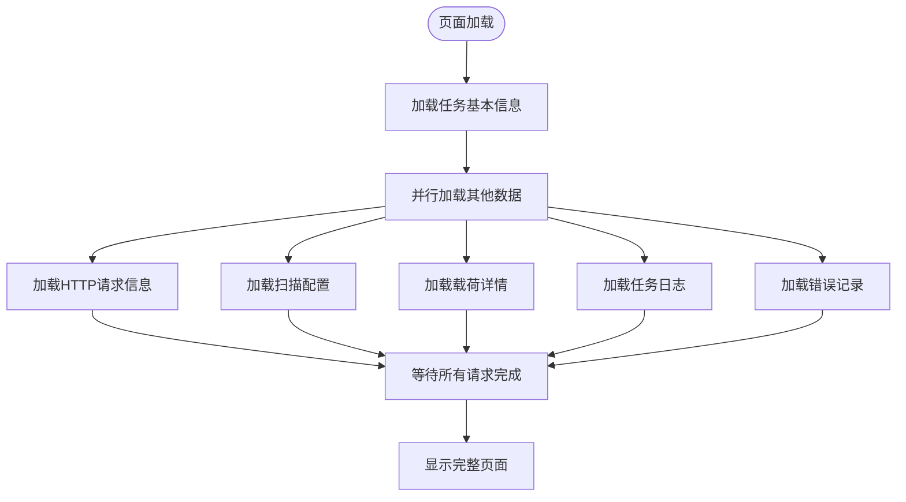
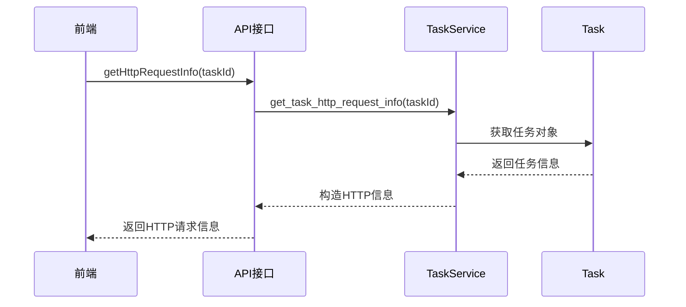
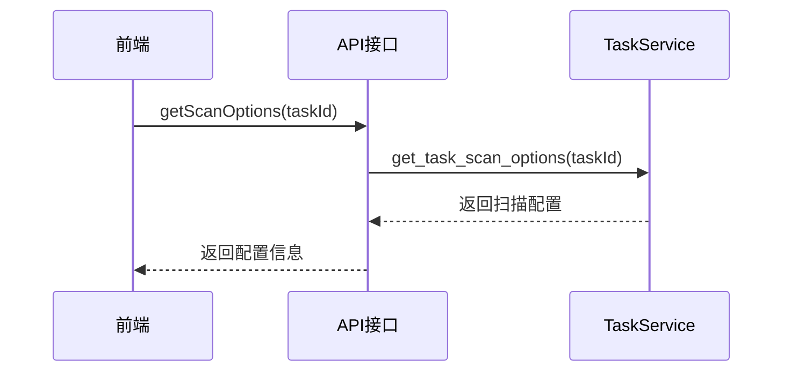
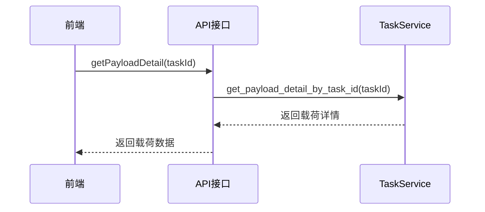
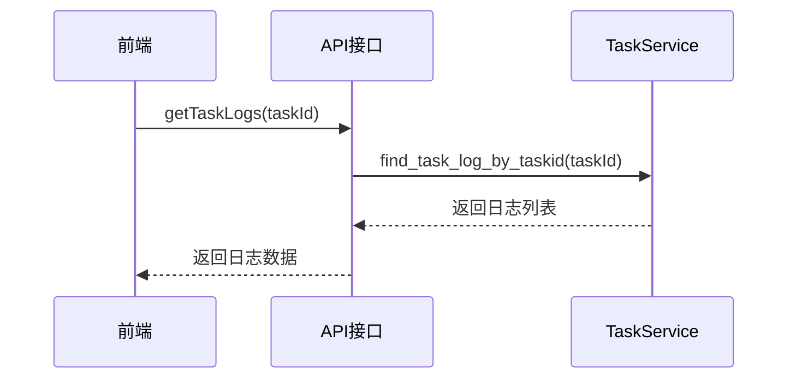
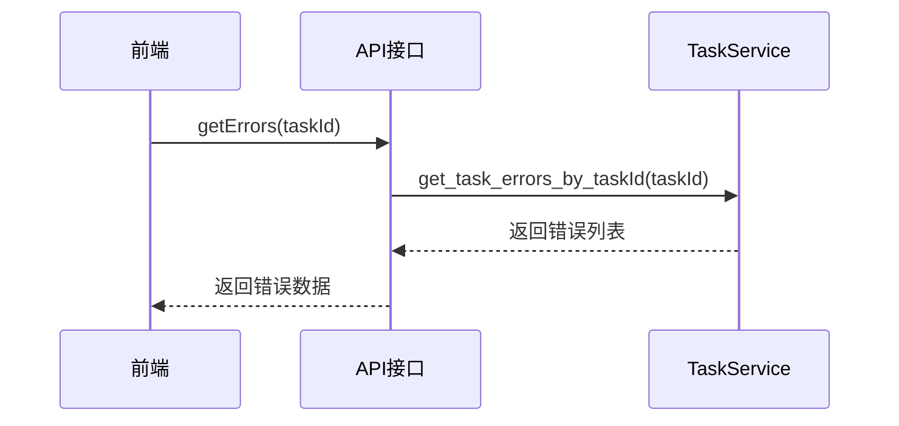
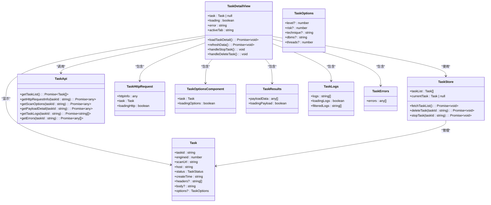
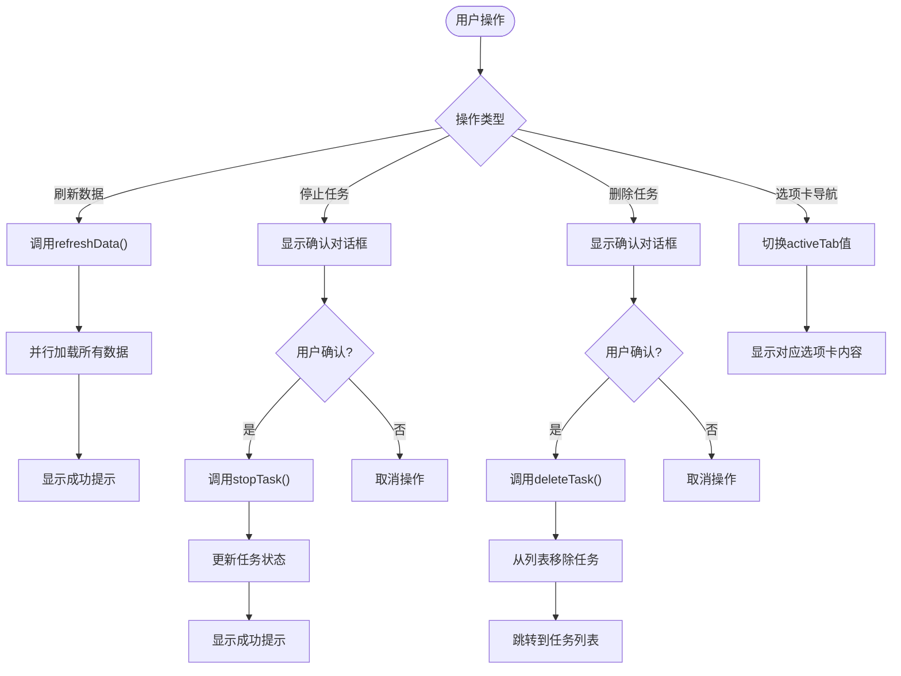

# 任务详情页

<cite>
**本文档引用的文件**
- [TaskDetail/index.vue](file://src/frontEnd/src/views/TaskDetail/index.vue)
- [task.ts](file://src/frontEnd/src/api/task.ts)
- [taskService.py](file://src/backEnd/service/taskService.py)
- [Task.py](file://src/backEnd/model/Task.py)
- [TaskStatus.py](file://src/backEnd/model/TaskStatus.py)
- [taskStore.ts](file://src/frontEnd/src/stores/task.ts)
- [task.ts](file://src/frontEnd/src/types/task.ts)
- [TaskHttpRequest.vue](file://src/frontEnd/src/views/TaskDetail/components/TaskHttpRequest.vue)
- [TaskOptions.vue](file://src/frontEnd/src/views/TaskDetail/components/TaskOptions.vue)
- [TaskResults.vue](file://src/frontEnd/src/views/TaskDetail/components/TaskResults.vue)
- [TaskLogs.vue](file://src/frontEnd/src/views/TaskDetail/components/TaskLogs.vue)
- [TaskErrors.vue](file://src/frontEnd/src/views/TaskDetail/components/TaskErrors.vue)
</cite>

## 更新摘要
**变更内容**
- 将页面布局从原有卡片式结构更新为选项卡式界面
- 新增HTTP请求信息、扫描结果、任务日志和错误记录等信息模块的详细说明
- 更新数据并行加载策略以反映新的模块结构
- 重构前端组件结构以匹配新的选项卡式设计
- 更新用户交互设计以包含新的选项卡导航功能

## 目录
1. [简介](#简介)
2. [页面布局](#页面布局)
3. [数据并行加载策略](#数据并行加载策略)
4. [信息模块数据获取API](#信息模块数据获取api)
5. [前端组件结构](#前端组件结构)
6. [用户交互设计](#用户交互设计)

## 简介
任务详情页是SQLMapWebUI系统中的核心功能模块，用于展示单个扫描任务的详细信息。该页面提供了全面的任务信息视图，包括基础信息、HTTP请求信息、扫描配置、扫描结果、任务日志和错误记录等关键模块。通过该页面，用户可以深入了解任务的执行状态、配置参数和扫描结果，为安全测试提供决策支持。

**Section sources**
- [TaskDetail/index.vue](file://src/frontEnd/src/views/TaskDetail/index.vue)

## 页面布局
任务详情页采用响应式设计，主要由页面头部和详情内容两大部分组成。页面头部包含返回列表按钮和操作按钮组，详情内容部分通过选项卡式布局展示各个信息模块。

页面采用Flexbox和Grid布局技术，确保在不同屏幕尺寸下的良好显示效果。在桌面端，信息模块采用多列网格布局；在移动端，自动切换为单列布局。每个信息模块都以选项卡形式呈现，包含图标、标题和内容区域，通过CSS变量实现主题化设计。

主要布局组件包括：
- 页面头部（page-header）：包含导航和操作按钮
- 选项卡容器（detail-tabs）：用于组织各个信息模块
- 选项卡列表（TabList）：显示可切换的选项卡
- 选项卡面板（TabPanels）：包含各个选项卡的具体内容
- 加载容器（loading-container）：显示加载状态
- 内容区域（detail-content）：包含所有信息模块

任务详情页已重构为选项卡式界面，包含以下六个主要选项卡：
1. **基础信息**：显示任务的基本属性和状态
2. **HTTP请求信息**：展示任务的HTTP请求详情，包括请求方法、URL、请求头和请求体
3. **扫描配置**：显示任务的扫描参数配置，如检测级别、风险级别、注入技术等
4. **扫描结果**：展示扫描发现的载荷详情，仅在有扫描结果时显示
5. **任务日志**：显示任务执行过程中的详细日志记录
6. **错误记录**：展示任务执行过程中发生的错误信息，仅在有错误时显示

**Section sources**
- [TaskDetail/index.vue](file://src/frontEnd/src/views/TaskDetail/index.vue#L70-L180)

## 数据并行加载策略
任务详情页采用并行加载策略来提高数据获取效率。当页面加载时，系统会同时发起多个异步请求来获取不同模块的数据，而不是按顺序逐个加载。

在`useTaskDetail`组合式函数中，通过`Promise.all`方法并行加载HTTP请求信息、扫描配置、载荷详情、任务日志和错误记录等数据。这种并行加载方式显著减少了页面的总体加载时间，提升了用户体验。

**Diagram sources**
- [TaskDetail/index.vue](file://src/frontEnd/src/views/TaskDetail/index.vue#L206-L247)

**Section sources**
- [TaskDetail/index.vue](file://src/frontEnd/src/views/TaskDetail/index.vue#L206-L247)

## 信息模块数据获取API
任务详情页通过多个API端点获取不同信息模块的数据。这些API由后端服务提供，前端通过封装的API函数进行调用。

### HTTP请求信息获取
获取任务的HTTP请求信息，包括请求方法、请求头和请求体。

**Diagram sources**
- [task.ts](file://src/frontEnd/src/api/task.ts)
- [taskService.py](file://src/backEnd/service/taskService.py)

### 扫描配置获取
获取任务的扫描配置参数，如检测级别、风险级别、注入技术等。

**Diagram sources**
- [task.ts](file://src/frontEnd/src/api/task.ts)
- [taskService.py](file://src/backEnd/service/taskService.py)

### 载荷详情获取
获取任务的扫描载荷详情，包括状态、内容类型和载荷内容。

**Diagram sources**
- [task.ts](file://src/frontEnd/src/api/task.ts)
- [taskService.py](file://src/backEnd/service/taskService.py)

### 任务日志获取
获取任务的执行日志，用于跟踪任务的执行过程。

**Diagram sources**
- [task.ts](file://src/frontEnd/src/api/task.ts)
- [taskService.py](file://src/backEnd/service/taskService.py)

### 错误记录获取
获取任务的错误记录，帮助用户诊断问题。

**Diagram sources**
- [task.ts](file://src/frontEnd/src/api/task.ts)
- [taskService.py](file://src/backEnd/service/taskService.py)

**Section sources**
- [task.ts](file://src/frontEnd/src/api/task.ts)
- [taskService.py](file://src/backEnd/service/taskService.py)

## 前端组件结构
任务详情页的前端组件基于Vue 3和TypeScript构建，采用组合式API（Composition API）设计模式。组件结构清晰，职责分明，便于维护和扩展。

### 主要组件构成
- **页面容器组件**：负责整体布局和导航
- **选项卡组件**：使用PrimeVue的Tabs组件实现选项卡式界面
- **信息模块组件**：封装各个信息模块的显示逻辑
- **数据加载组件**：处理异步数据获取和状态管理
- **交互按钮组件**：提供用户操作接口

### 组件依赖关系

**Diagram sources**
- [TaskDetail/index.vue](file://src/frontEnd/src/views/TaskDetail/index.vue)
- [TaskHttpRequest.vue](file://src/frontEnd/src/views/TaskDetail/components/TaskHttpRequest.vue)
- [TaskOptions.vue](file://src/frontEnd/src/views/TaskDetail/components/TaskOptions.vue)
- [TaskResults.vue](file://src/frontEnd/src/views/TaskDetail/components/TaskResults.vue)
- [TaskLogs.vue](file://src/frontEnd/src/views/TaskDetail/components/TaskLogs.vue)
- [TaskErrors.vue](file://src/frontEnd/src/views/TaskDetail/components/TaskErrors.vue)

**Section sources**
- [TaskDetail/index.vue](file://src/frontEnd/src/views/TaskDetail/index.vue)
- [taskStore.ts](file://src/frontEnd/src/stores/task.ts)

## 用户交互设计
任务详情页提供了丰富的用户交互功能，包括数据刷新、任务停止、任务删除和选项卡导航等操作。所有交互操作都配有确认对话框，防止误操作。

### 主要交互功能
1. **返回列表**：点击返回按钮可导航回任务列表页面
2. **刷新数据**：点击刷新按钮重新加载任务详情
3. **停止任务**：对于正在运行的任务，可点击停止按钮终止扫描
4. **删除任务**：可删除已完成或已停止的任务
5. **选项卡导航**：通过点击不同选项卡查看各个信息模块的内容

### 交互流程

**Diagram sources**
- [TaskDetail/index.vue](file://src/frontEnd/src/views/TaskDetail/index.vue#L203-L247)

**Section sources**
- [TaskDetail/index.vue](file://src/frontEnd/src/views/TaskDetail/index.vue#L203-L247)