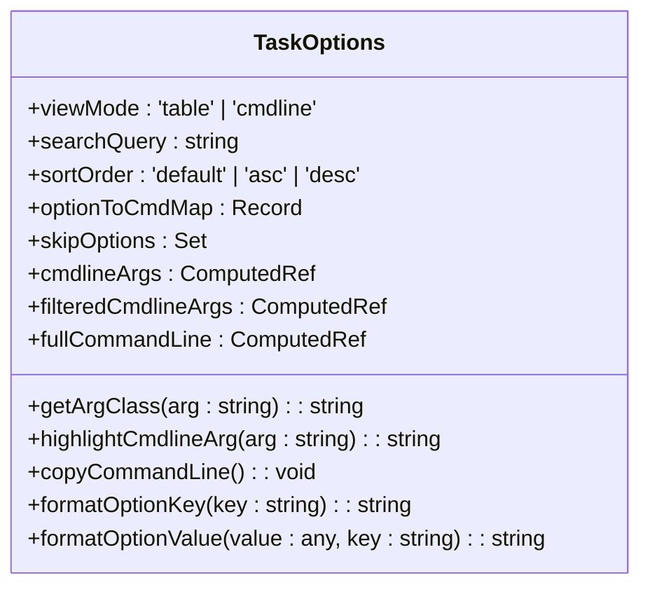
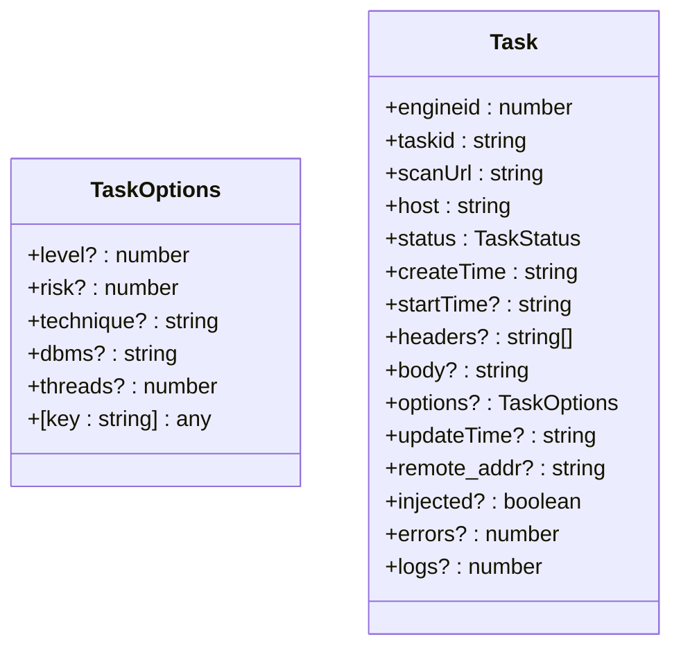
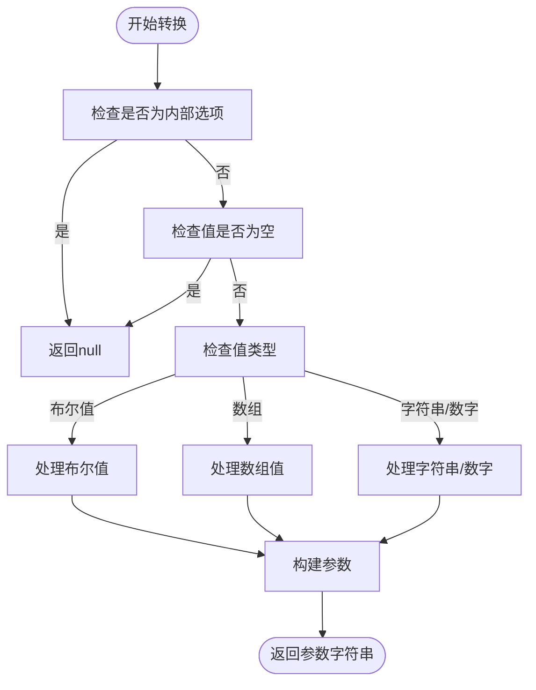
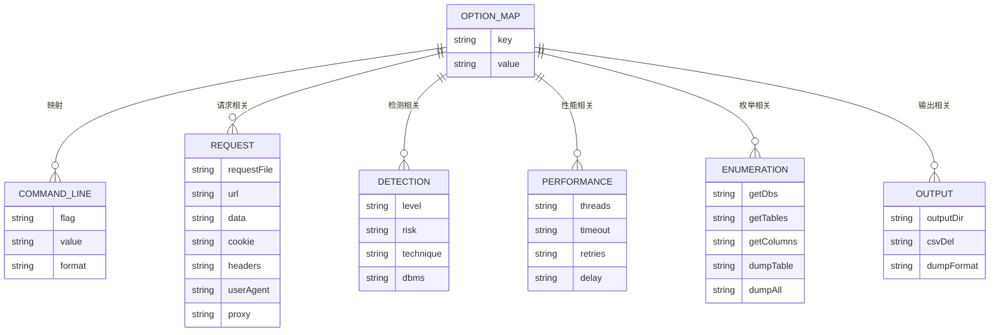
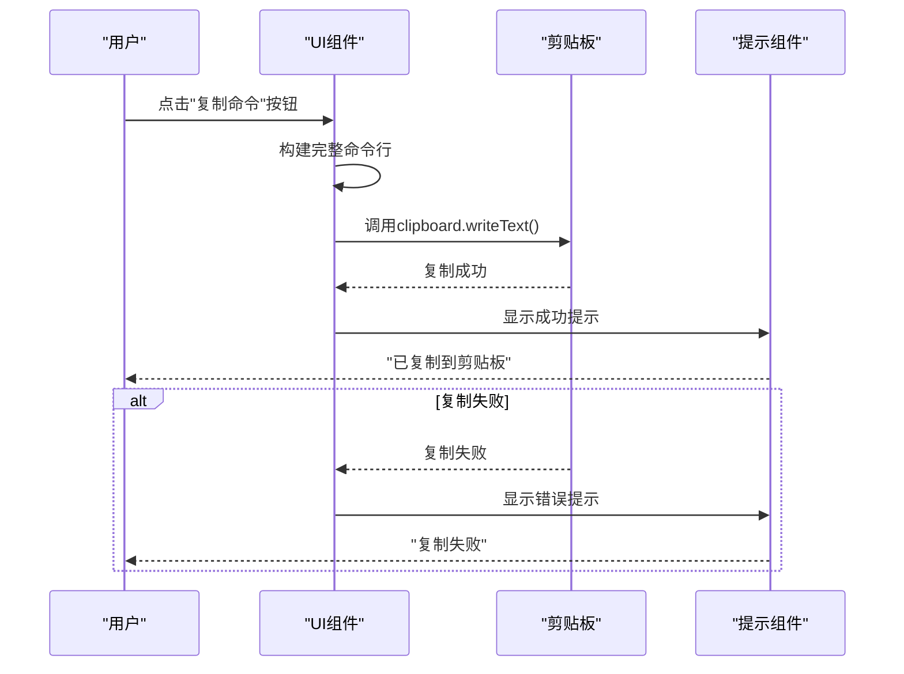
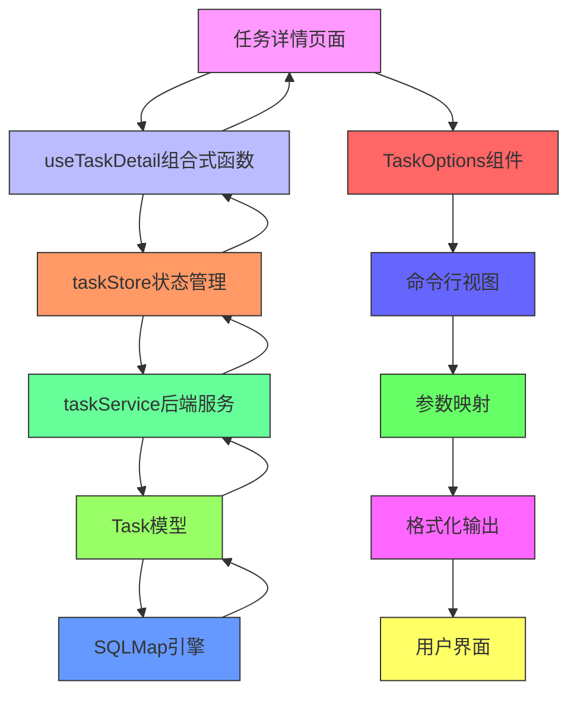

# 任务选项命令行视图

<cite>
**本文档引用的文件**
- [TaskOptions.vue](file://src/frontEnd/src/views/TaskDetail/components/TaskOptions.vue)
- [task.ts](file://src/frontEnd/src/types/task.ts)
- [taskService.py](file://src/backEnd/service/taskService.py)
- [Task.py](file://src/backEnd/model/Task.py)
- [useTaskDetail.ts](file://src/frontEnd/src/views/TaskDetail/composables/useTaskDetail.ts)
- [task.ts](file://src/frontEnd/src/stores/task.ts)
- [TaskDetail.vue](file://src/frontEnd/src/views/TaskDetail/index.vue)
</cite>

## 目录
1. [简介](#简介)
2. [功能概述](#功能概述)
3. [核心组件分析](#核心组件分析)
4. [命令行视图实现](#命令行视图实现)
5. [参数映射与转换](#参数映射与转换)
6. [用户交互功能](#用户交互功能)
7. [数据流分析](#数据流分析)

## 简介
任务选项命令行视图是SQLMapWebUI系统中的一个重要功能模块，它为用户提供了一种直观的方式查看和理解SQLMap扫描任务的配置参数。该视图允许用户在表格视图和命令行视图之间切换，特别地，命令行视图将任务配置参数转换为标准的SQLMap命令行格式，便于用户理解和复用。

## 功能概述
任务选项命令行视图主要提供以下功能：
- 在表格视图和命令行视图之间切换显示模式
- 将任务配置参数转换为SQLMap命令行格式
- 支持搜索和过滤功能
- 提供复制完整命令行的功能
- 显示参数统计信息

该功能位于任务详情页面的"扫描配置"标签页中，是用户了解和分析扫描任务配置的重要工具。

## 核心组件分析

### 任务选项组件 (TaskOptions.vue)
任务选项组件是实现命令行视图的核心，它负责渲染和管理任务配置的显示。该组件提供了两种视图模式：表格视图和命令行视图。

**组件来源**
- [TaskOptions.vue](file://src/frontEnd/src/views/TaskDetail/components/TaskOptions.vue)

### 任务数据模型 (task.ts)
任务数据模型定义了任务配置选项的接口，为前端组件提供了类型定义。

**模型来源**
- [task.ts](file://src/frontEnd/src/types/task.ts)

## 命令行视图实现
命令行视图的实现主要依赖于`TaskOptions.vue`组件中的计算属性和方法。当用户切换到命令行视图时，系统会将任务配置参数转换为标准的SQLMap命令行格式。

### 命令行参数转换
系统通过`optionToArg`函数将任务配置选项转换为命令行参数。该函数处理了不同类型的值（布尔值、数组、字符串等）的转换逻辑。

**实现来源**
- [TaskOptions.vue](file://src/frontEnd/src/views/TaskDetail/components/TaskOptions.vue#L275-L311)

## 参数映射与转换
系统通过`optionToCmdMap`对象定义了任务配置选项与SQLMap命令行参数之间的映射关系。

**映射来源**
- [TaskOptions.vue](file://src/frontEnd/src/views/TaskDetail/components/TaskOptions.vue#L204-L269)

## 用户交互功能
命令行视图提供了丰富的用户交互功能，包括搜索、复制和统计信息显示。

### 复制命令行功能
用户可以一键复制完整的命令行参数，便于在其他环境中使用。

**交互来源**
- [TaskOptions.vue](file://src/frontEnd/src/views/TaskDetail/components/TaskOptions.vue#L434-L452)

## 数据流分析
任务选项命令行视图的数据流涉及前端组件、API服务和后端服务的交互。

**数据流来源**
- [TaskDetail.vue](file://src/frontEnd/src/views/TaskDetail/index.vue)
- [useTaskDetail.ts](file://src/frontEnd/src/views/TaskDetail/composables/useTaskDetail.ts)
- [task.ts](file://src/frontEnd/src/stores/task.ts)
- [taskService.py](file://src/backEnd/service/taskService.py)
- [Task.py](file://src/backEnd/model/Task.py)