# API调用

<cite>
**本文档引用的文件**   
- [request.ts](file://src/frontEnd/src/api/request.ts)
- [auth.ts](file://src/frontEnd/src/api/auth.ts)
- [task.ts](file://src/frontEnd/src/api/task.ts)
- [headerRule.ts](file://src/frontEnd/src/api/headerRule.ts)
- [scanPreset.ts](file://src/frontEnd/src/api/scanPreset.ts)
- [api.ts](file://src/frontEnd/src/types/api.ts)
- [common.ts](file://src/frontEnd/src/types/common.ts)
- [task.ts](file://src/frontEnd/src/types/task.ts)
- [authController.py](file://src/backEnd/api/commonApi/authController.py)
- [webTaskController.py](file://src/backEnd/api/commonApi/webTaskController.py)
- [useSmartPolling.ts](file://src/frontEnd/src/utils/useSmartPolling.ts)
- [auth.ts](file://src/frontEnd/src/stores/auth.ts)
</cite>

## 目录
1. [简介](#简介)
2. [API请求封装与拦截器](#api请求封装与拦截器)
3. [API服务模块组织](#api服务模块组织)
4. [类型安全实现](#类型安全实现)
5. [认证令牌管理](#认证令牌管理)
6. [错误处理机制](#错误处理机制)
7. [重试机制](#重试机制)
8. [特殊场景处理](#特殊场景处理)
9. [API调用流程图](#api调用流程图)
10. [最佳实践](#最佳实践)

## 简介

sqlmapWebUI项目实现了前后端分离的架构，前端通过HTTP客户端与后端API进行交互。本项目采用TypeScript和Vue 3构建前端，使用axios作为HTTP客户端库，并通过Pinia进行状态管理。API调用机制设计考虑了本地访问和远程访问两种模式，提供了完善的请求封装、拦截器、错误处理和类型安全机制。

前端API调用主要通过`src/frontEnd/src/api`目录下的模块实现，包括`auth.ts`、`task.ts`、`headerRule.ts`和`scanPreset.ts`等专门的API服务文件。这些文件封装了与后端的交互逻辑，提供了类型安全的接口调用。后端API基于FastAPI框架实现，位于`src/backEnd/api`目录下。

本项目支持本地单机模式和远程访问模式。在本地模式下，由于访问的是本地服务，不需要复杂的认证机制；而在远程模式下，则需要通过认证令牌进行访问控制。这种双模式设计使得开发者可以方便地在本地进行开发和测试，同时支持生产环境的远程访问。

**Section sources**
- [request.ts](file://src/frontEnd/src/api/request.ts#L1-L231)
- [authController.py](file://src/backEnd/api/commonApi/authController.py#L1-L150)

## API请求封装与拦截器

### 请求封装

项目通过`request.ts`文件对axios进行了封装，创建了一个统一的HTTP客户端实例。该实例配置了基础URL、超时时间和默认请求头，为所有API调用提供了统一的配置基础。

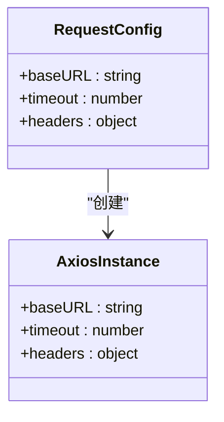

**Diagram sources**
- [request.ts](file://src/frontEnd/src/api/request.ts#L48-L55)

### 请求拦截器

请求拦截器负责在请求发送前添加必要的认证信息和通用请求头。拦截器会根据访问模式决定是否添加认证令牌：

- **本地访问模式**：不添加认证令牌，因为本地服务不需要认证
- **远程访问模式**：从本地存储中获取认证令牌并添加到请求头中

此外，拦截器还会添加`X-Requested-With: XMLHttpRequest`头，用于标识请求来源。

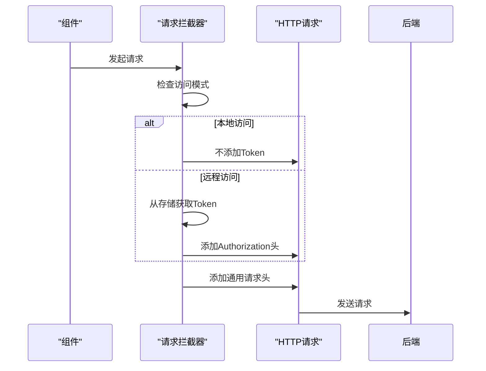

**Diagram sources**
- [request.ts](file://src/frontEnd/src/api/request.ts#L99-L119)

### 响应拦截器

响应拦截器负责处理服务器响应，包括业务状态码检查、错误处理和重试机制。拦截器会检查响应数据中的`success`字段和`code`范围来判断请求是否成功。

对于失败的请求，拦截器会根据HTTP状态码进行分类处理：
- **401未授权**：清除认证信息并提示用户重新登录
- **网络错误或超时**：显示相应的错误提示
- **其他HTTP错误**：显示错误消息

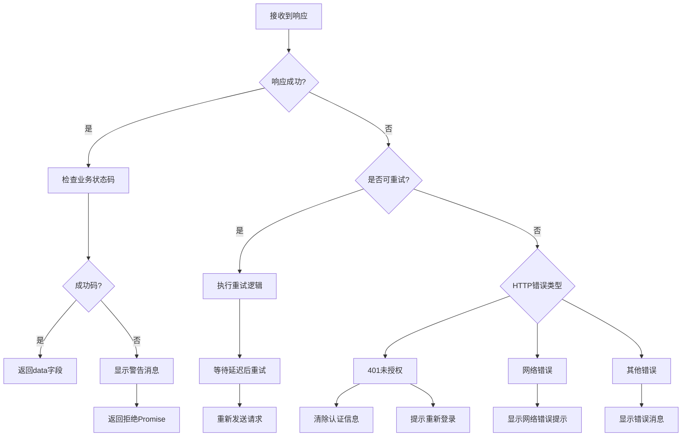

**Diagram sources**
- [request.ts](file://src/frontEnd/src/api/request.ts#L123-L204)

## API服务模块组织

项目采用模块化的方式组织API服务，每个功能模块都有独立的API服务文件，便于维护和使用。

### 认证API模块

`auth.ts`文件封装了与用户认证相关的API调用，包括登录、刷新令牌和版本检查等功能。该模块提供了类型安全的接口定义，确保调用时参数和返回值的正确性。

```mermaid
classDiagram
class AuthAPI {
+login(data : LoginRequest) : Promise<LoginResponse>
+refreshToken() : Promise<{token : string}>
+getVersion() : Promise<{version : string}>
+checkAuthRequired() : Promise<{required : boolean}>
}
class LoginRequest {
+username : string
+password : string
}
class LoginResponse {
+token : string
+userInfo : UserInfo
}
AuthAPI --> LoginRequest
AuthAPI --> LoginResponse
```

**Diagram sources**
- [auth.ts](file://src/frontEnd/src/api/auth.ts#L1-L34)
- [common.ts](file://src/frontEnd/src/types/common.ts#L1-L23)

### 任务API模块

`task.ts`文件封装了与扫描任务管理相关的API调用，包括任务列表获取、任务创建、删除、停止等操作。该模块还提供了获取任务日志、HTTP请求信息和载荷详情等高级功能。

```mermaid
classDiagram
class TaskAPI {
+getTaskList() : Promise<Task[]>
+addTask(taskData : Partial<Task>) : Promise<{engineid : number, taskid : string}>
+deleteTask(taskId : string) : Promise<void>
+stopTask(taskId : string) : Promise<void>
+getTaskLogs(taskId : string) : Promise<string[]>
+getHttpRequestInfo(taskId : string) : Promise<any>
+getPayloadDetail(taskId : string) : Promise<PayloadEntry[]>
}
class Task {
+engineid : number
+taskid : string
+scanUrl : string
+host : string
+status : TaskStatus
+createTime : string
+startTime : string
}
TaskAPI --> Task
```

**Diagram sources**
- [task.ts](file://src/frontEnd/src/api/task.ts#L1-L800)
- [task.ts](file://src/frontEnd/src/types/task.ts#L1-L122)

### 请求头规则API模块

`headerRule.ts`文件封装了与请求头规则管理相关的API调用，包括持久化规则和会话性请求头的CRUD操作。该模块支持规则的创建、更新、删除和查询，以及会话头的设置和清除。

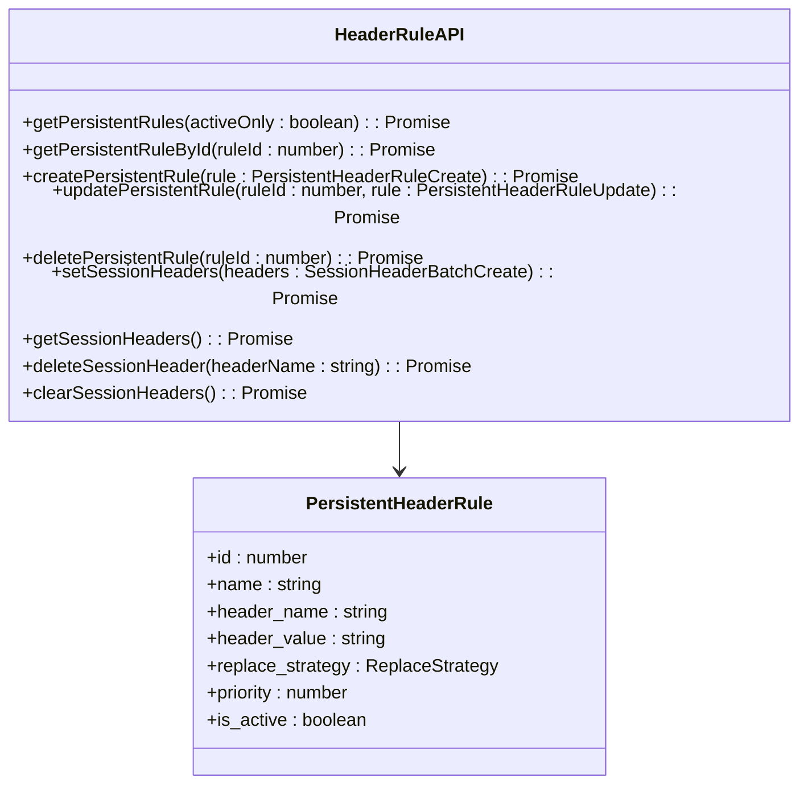

**Diagram sources**
- [headerRule.ts](file://src/frontEnd/src/api/headerRule.ts#L1-L421)

### 扫描预设API模块

`scanPreset.ts`文件封装了与扫描配置预设管理相关的API调用，包括预设配置的创建、更新、删除和应用。该模块支持获取默认配置、常用配置和历史配置列表。

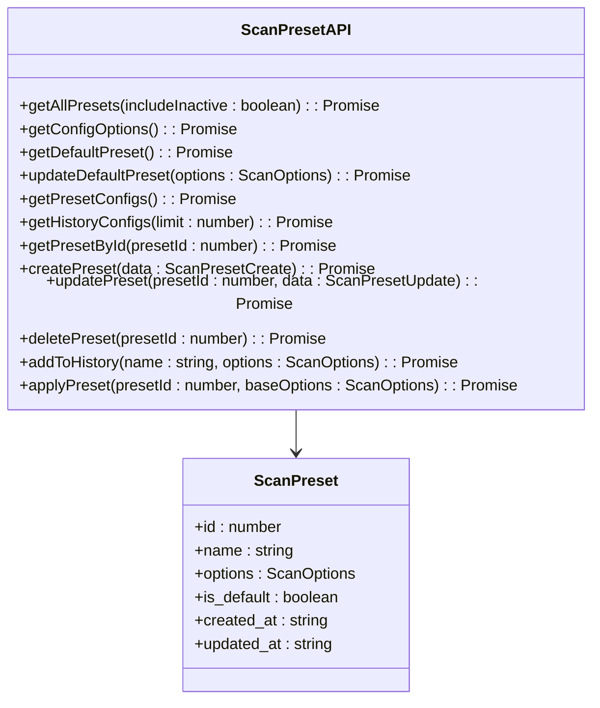

**Diagram sources**
- [scanPreset.ts](file://src/frontEnd/src/api/scanPreset.ts#L1-L145)

## 类型安全实现

项目通过TypeScript接口定义了请求和响应的数据结构，实现了完整的类型安全。所有API调用都基于这些类型定义，确保了开发过程中的类型检查和代码提示。

### 基础响应结构

所有API响应都遵循统一的基础结构，包含状态码、成功标志、消息和数据字段：

```typescript
interface BaseResponse<T = any> {
  code: number
  success: boolean
  message: string
  data: T
}
```

这种统一的响应格式使得响应拦截器可以一致地处理所有API响应，简化了错误处理逻辑。

### 请求和响应类型

每个API模块都定义了相应的请求和响应类型，确保类型安全：

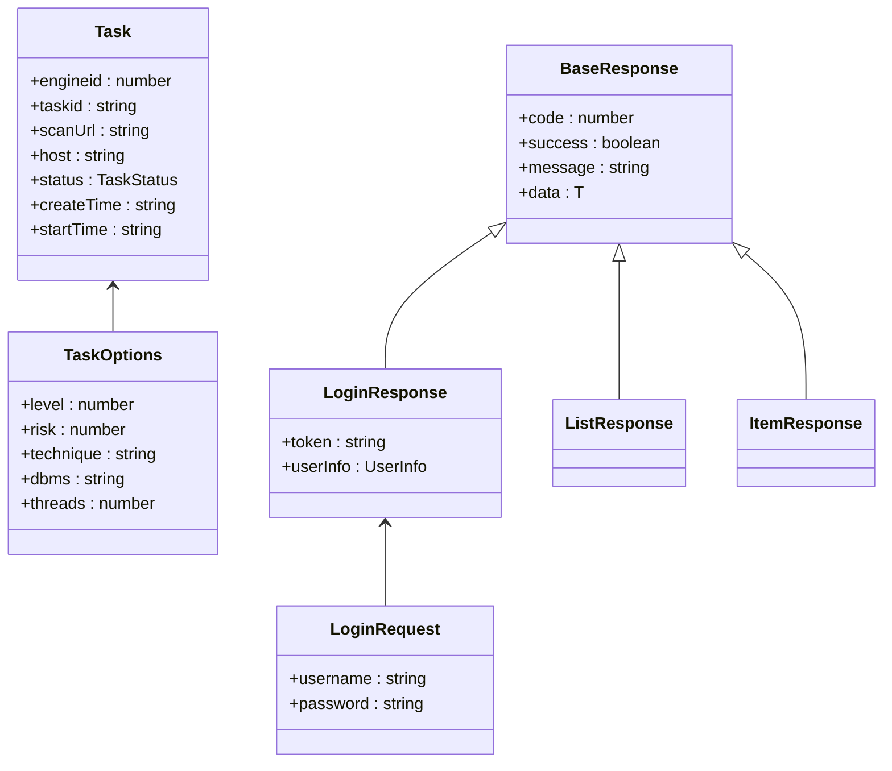

**Diagram sources**
- [api.ts](file://src/frontEnd/src/types/api.ts#L1-L28)
- [common.ts](file://src/frontEnd/src/types/common.ts#L1-L23)
- [task.ts](file://src/frontEnd/src/types/task.ts#L1-L122)

### 枚举类型

项目使用枚举类型定义了任务状态等固定值，提高了代码的可读性和类型安全性：

```typescript
enum TaskStatus {
  PENDING = 0,
  RUNNING = 1,
  SUCCESS = 2,
  FAILED = 3,
  STOPPED = 4,
  TERMINATED = 5,
}
```

这些枚举类型在前端和后端之间建立了明确的契约，确保了状态值的一致性。

**Section sources**
- [api.ts](file://src/frontEnd/src/types/api.ts#L1-L28)
- [common.ts](file://src/frontEnd/src/types/common.ts#L1-L23)
- [task.ts](file://src/frontEnd/src/types/task.ts#L1-L122)

## 认证令牌管理

项目实现了基于JWT的认证令牌管理机制，支持本地和远程两种访问模式。

### 本地模式

在本地访问模式下（访问localhost或127.0.0.1），系统会自动跳过认证流程。这种设计使得开发者可以在本地环境中无需登录即可使用所有功能。

```typescript
function isLocalAccess(): boolean {
  const hostname = getHostname()
  return (
    hostname === 'localhost' ||
    hostname === '127.0.0.1' ||
    hostname === '::1' ||
    hostname.startsWith('127.')
  )
}
```

### 远程模式

在远程访问模式下，系统需要通过认证令牌进行访问控制。认证信息存储在浏览器的本地存储中，包括令牌和用户信息。

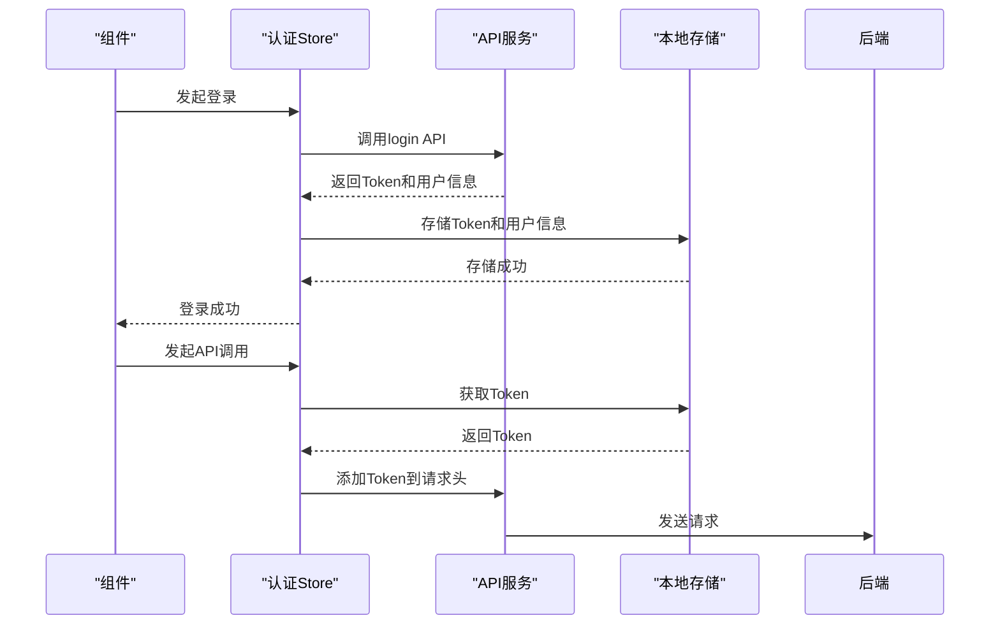

**Diagram sources**
- [auth.ts](file://src/frontEnd/src/stores/auth.ts#L1-L175)
- [auth.ts](file://src/frontEnd/src/utils/auth.ts#L1-L45)

### 认证状态管理

认证状态通过Pinia store进行管理，提供了统一的认证状态接口：

```typescript
const useAuthStore = defineStore('auth', () => {
  const token = ref<string | null>(getStorage<string>('token'))
  const userInfo = ref<UserInfo | null>(getStorage<UserInfo>('userInfo'))
  const isLocalMode = ref<boolean>(isLocalAccess())
  const authRequired = ref<boolean>(checkAuthRequired())
  
  const isLoggedIn = computed(() => {
    if (isLocalMode.value) {
      return true
    }
    return !!token.value
  })
  
  // ... 其他状态和方法
})
```

这种状态管理模式使得认证状态在整个应用中保持一致，并且可以响应式地更新UI。

**Section sources**
- [auth.ts](file://src/frontEnd/src/stores/auth.ts#L1-L175)
- [auth.ts](file://src/frontEnd/src/utils/auth.ts#L1-L45)

## 错误处理机制

项目实现了全面的错误处理机制，包括全局错误处理、特定错误处理和用户友好的错误提示。

### 全局错误处理

通过axios响应拦截器实现全局错误处理，捕获所有API调用的错误并进行统一处理：

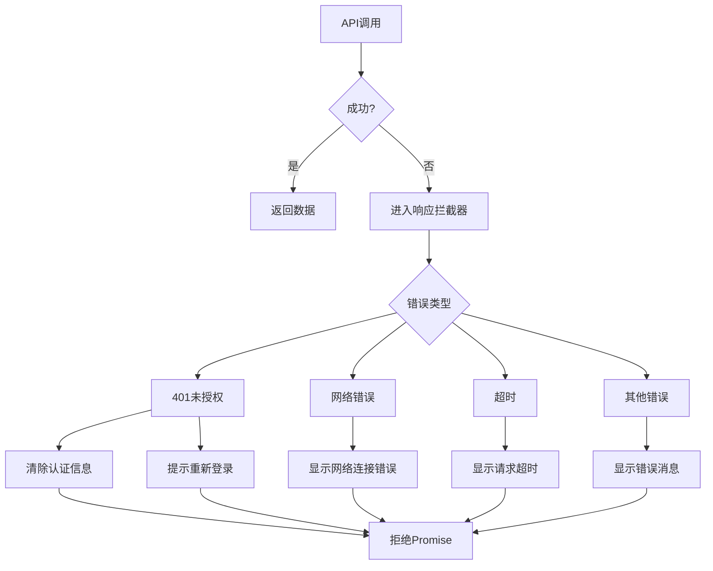

**Diagram sources**
- [request.ts](file://src/frontEnd/src/api/request.ts#L160-L204)

### 特定错误处理

针对不同类型的错误，系统提供了特定的处理逻辑：

- **401未授权错误**：在远程模式下，清除本地存储的认证信息并提示用户重新登录；在本地模式下，忽略此错误
- **网络错误**：提示用户检查网络连接或后端服务是否启动
- **请求超时**：提示用户请求超时，建议稍后重试

### 用户友好的错误提示

系统使用PrimeVue的Toast组件显示用户友好的错误提示，确保用户能够清楚地了解问题所在：

```typescript
function showError(message: string, life: number = 5000) {
  if (toastInstance) {
    toastInstance.add({
      severity: 'error',
      summary: '错误',
      detail: message,
      life
    })
  } else {
    console.error(message)
  }
}
```

错误提示的显示时间可以根据错误的严重程度进行调整，例如401错误会永久显示直到用户操作。

**Section sources**
- [request.ts](file://src/frontEnd/src/api/request.ts#L20-L32)
- [request.ts](file://src/frontEnd/src/api/request.ts#L160-L204)

## 重试机制

项目实现了智能的重试机制，针对特定的HTTP状态码和网络错误进行自动重试，提高了系统的健壮性。

### 重试配置

重试机制配置了以下参数：

```typescript
const RETRY_CONFIG = {
  maxRetries: 3,        // 最大重试次数
  initialDelay: 1000,   // 初始延迟（毫秒）
  delayMultiplier: 2,   // 延迟倍数（指数退避）
  maxDelay: 10000,      // 最大延迟（毫秒）
  retryableStatusCodes: [408, 500, 502, 503, 504], // 可重试的HTTP状态码
}
```

### 重试策略

重试机制遵循以下策略：

1. **仅对GET请求重试**：由于GET请求是幂等的，重试不会产生副作用
2. **指数退避**：每次重试的延迟时间呈指数增长，避免对服务器造成过大压力
3. **最大延迟限制**：防止重试间隔过长影响用户体验

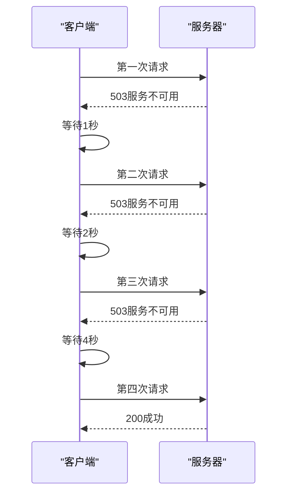

**Diagram sources**
- [request.ts](file://src/frontEnd/src/api/request.ts#L57-L92)

### 重试条件判断

系统通过`shouldRetry`函数判断是否应该重试：

```typescript
function shouldRetry(error: AxiosError, retryCount: number): boolean {
  // 超过最大重试次数
  if (retryCount >= RETRY_CONFIG.maxRetries) {
    return false
  }
  
  // 只重试GET请求（幂等性）
  if (error.config?.method?.toUpperCase() !== 'GET') {
    return false
  }
  
  // 网络错误或超时
  if (!error.response) {
    return true
  }
  
  // 特定的HTTP状态码
  const status = error.response.status
  return RETRY_CONFIG.retryableStatusCodes.includes(status)
}
```

这种精细化的重试策略确保了系统在面对临时性故障时能够自动恢复，同时避免了对非幂等操作的不当重试。

**Section sources**
- [request.ts](file://src/frontEnd/src/api/request.ts#L66-L86)

## 特殊场景处理

### 分页处理

虽然当前API实现中没有显式的分页参数，但任务列表等大量数据的场景可以通过前端过滤和排序来实现类似分页的效果。未来可以扩展API支持分页参数：

```typescript
interface PaginationParams {
  page: number
  pageSize: number
}

interface PaginatedData<T> {
  items: T[]
  total: number
  page: number
  pageSize: number
}
```

### 文件上传

项目目前没有涉及文件上传功能，但可以通过扩展axios配置来支持：

```typescript
// 上传文件示例
function uploadFile(file: File): Promise<any> {
  const formData = new FormData()
  formData.append('file', file)
  
  return instance.post('/upload', formData, {
    headers: {
      'Content-Type': 'multipart/form-data'
    }
  })
}
```

### 长轮询

项目通过`useSmartPolling` Hook实现了智能轮询机制，支持页面可见性监听和网络状态监听：

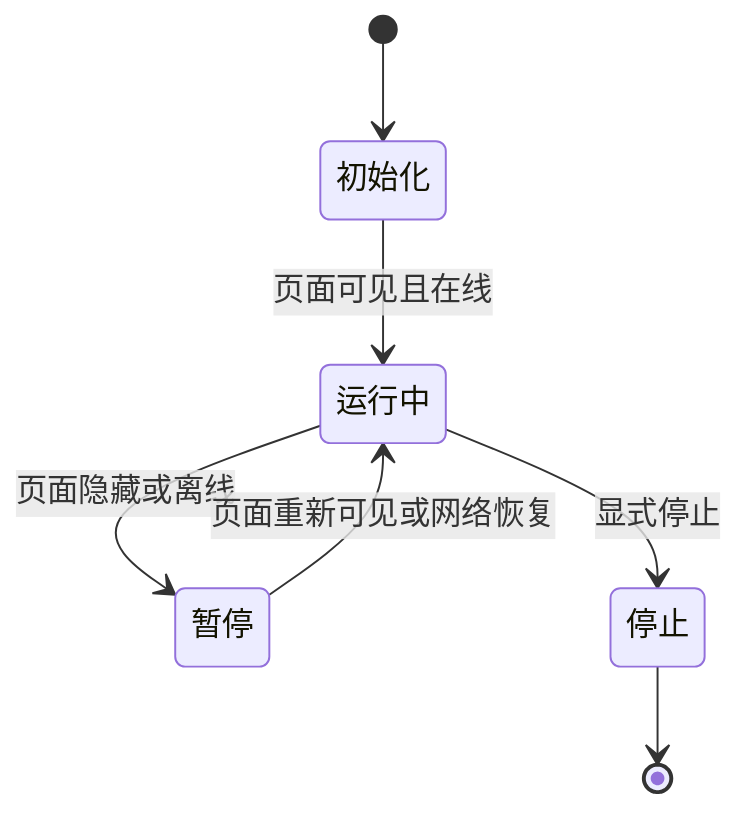

**Diagram sources**
- [useSmartPolling.ts](file://src/frontEnd/src/utils/useSmartPolling.ts#L1-L210)

智能轮询机制根据页面可见性调整轮询频率：
- **页面可见时**：使用较短的轮询间隔（默认5秒）
- **页面隐藏时**：使用较长的轮询间隔（默认30秒）
- **网络离线时**：暂停轮询

```typescript
export function useSmartPolling(options: SmartPollingOptions) {
  // ... 其他代码
  
  function getCurrentInterval(): number {
    // 页面隐藏时使用较长的间隔
    if (!isPageVisible.value) {
      return resolveInterval(backgroundInterval)
    }
    return resolveInterval(interval)
  }
  
  // ... 其他代码
}
```

这种设计既保证了用户体验，又减少了不必要的网络请求。

**Section sources**
- [useSmartPolling.ts](file://src/frontEnd/src/utils/useSmartPolling.ts#L1-L210)

## API调用流程图

以下是API调用的完整流程图，展示了从组件发起请求到数据更新的全过程：

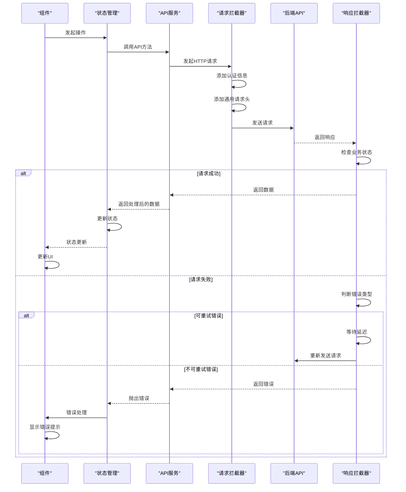

**Diagram sources**
- [request.ts](file://src/frontEnd/src/api/request.ts#L99-L204)
- [auth.ts](file://src/frontEnd/src/api/auth.ts#L1-L34)
- [task.ts](file://src/frontEnd/src/api/task.ts#L1-L800)
- [stores](file://src/frontEnd/src/stores)

## 最佳实践

### 统一的API入口

项目通过`index.ts`文件统一导出所有API服务，提供了简洁的导入方式：

```typescript
// src/frontEnd/src/api/index.ts
export * from './auth'
export * from './task'
export * from './headerRule'
export { request } from './request'
```

这种设计使得组件可以方便地导入所需的API服务：

```typescript
import { login, getVersion } from '@/api/auth'
import { getTaskList, addTask } from '@/api/task'
```

### Mock数据支持

项目内置了Mock数据支持，便于开发和测试：

```typescript
// 在task.ts中
const USE_MOCK_DATA = false

export async function getTaskList(): Promise<Task[]> {
  if (USE_MOCK_DATA) {
    await delay(MOCK_CONFIG.delay)
    return generateMockTasks(MOCK_CONFIG.count, MOCK_CONFIG.mode)
  }
  
  // 真实API调用
  const result = await request.get<{ tasks: BackendTask[]; tasks_num: number }>('/chrome/admin/task/list')
  return (result.tasks || []).map(transformBackendTask)
}
```

开发者可以通过切换`USE_MOCK_DATA`开关来使用Mock数据，无需启动后端服务即可进行前端开发。

### 环境配置

项目通过环境变量配置API基础URL，支持不同环境的部署：

```typescript
// 在request.ts中
baseURL: import.meta.env.VITE_API_BASE_URL || '/api'
```

开发者可以在`.env`文件中配置不同的API地址：

```env
# 开发环境
VITE_API_BASE_URL=http://localhost:8000/api

# 生产环境
VITE_API_BASE_URL=https://api.example.com
```

### 错误边界

在组件中使用API时，建议使用try-catch处理可能的错误：

```typescript
async function loadTasks() {
  try {
    const tasks = await getTaskList()
    // 处理成功结果
  } catch (error) {
    // 错误已在全局拦截器中处理
    // 这里可以进行额外的错误处理
    console.error('Failed to load tasks:', error)
  }
}
```

### 类型守卫

对于复杂的响应数据，建议使用类型守卫确保类型安全：

```typescript
function isTask(data: any): data is Task {
  return data && typeof data.taskid === 'string' && typeof data.scanUrl === 'string'
}

// 使用示例
const result = await getTaskList()
if (Array.isArray(result) && result.every(isTask)) {
  // 类型安全地使用result
}
```

这些最佳实践确保了API调用的可靠性、可维护性和类型安全性，为开发者提供了良好的开发体验。

**Section sources**
- [index.ts](file://src/frontEnd/src/api/index.ts#L1-L8)
- [task.ts](file://src/frontEnd/src/api/task.ts#L1-L800)
- [request.ts](file://src/frontEnd/src/api/request.ts#L50-L51)