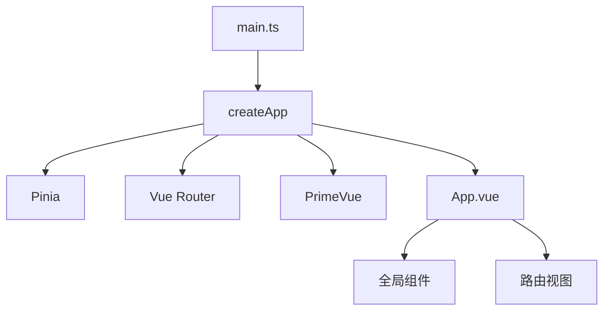
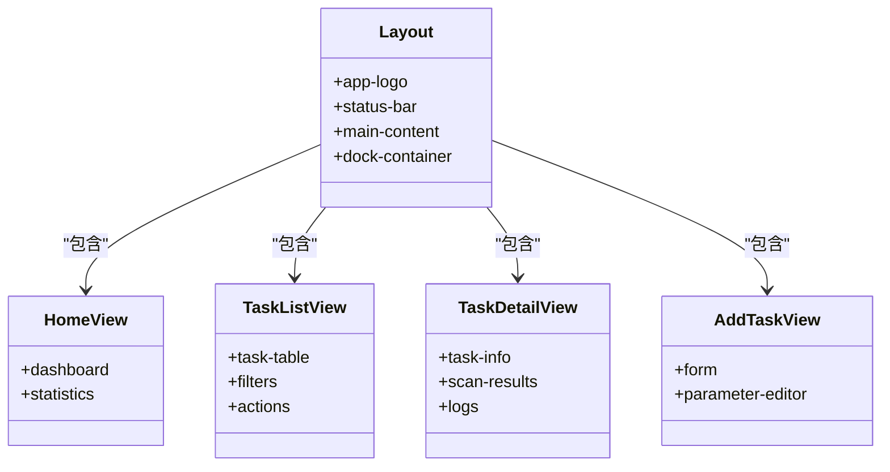
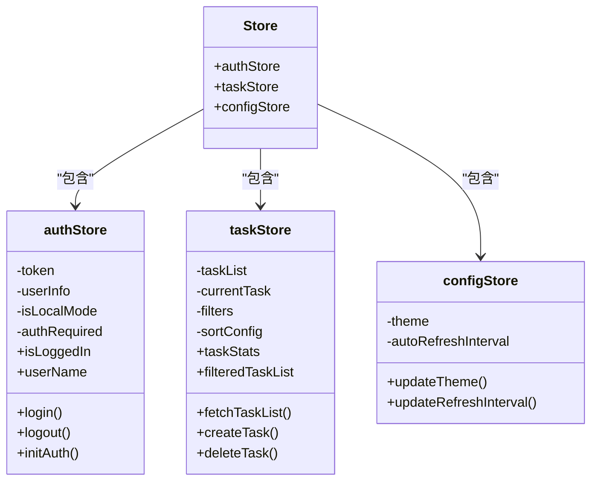
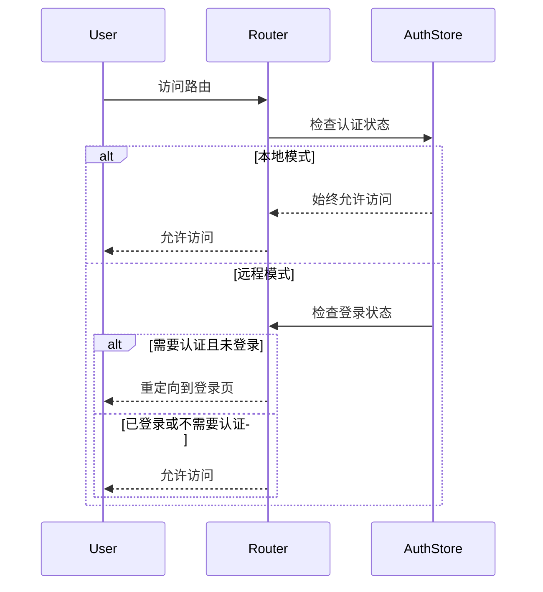
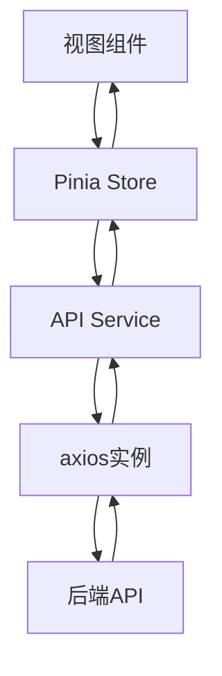
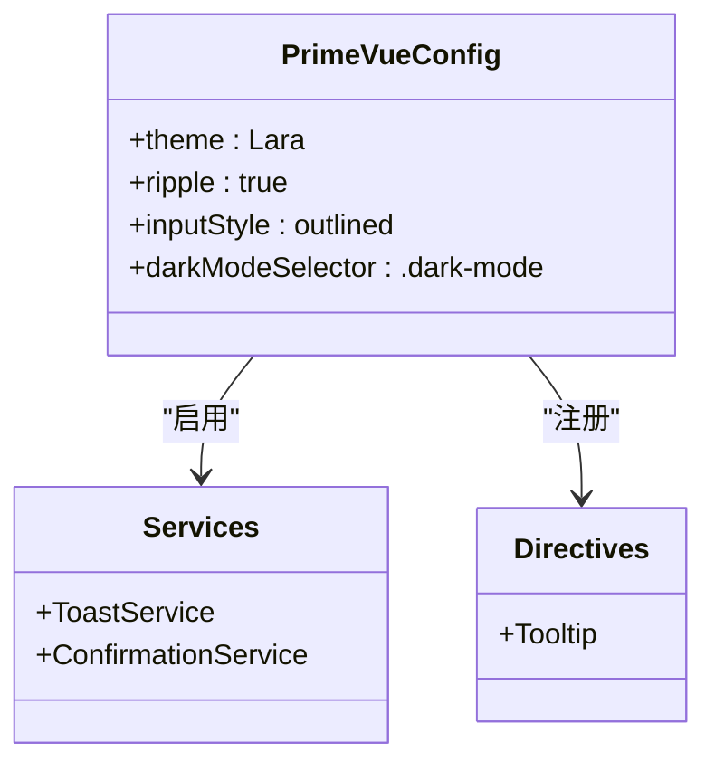
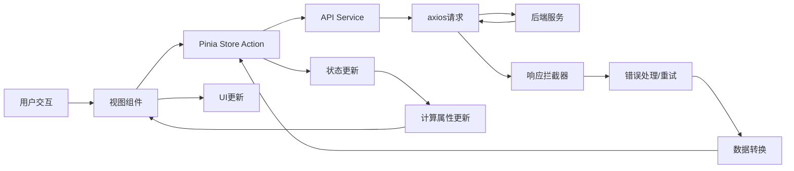

# 前端架构

<cite>
**本文档引用的文件**  
- [package.json](file://src/frontEnd/package.json)
- [vite.config.ts](file://src/frontEnd/vite.config.ts)
- [main.ts](file://src/frontEnd/src/main.ts)
- [App.vue](file://src/frontEnd/src/App.vue)
- [Layout.vue](file://src/frontEnd/src/views/Layout.vue)
- [router/index.ts](file://src/frontEnd/src/router/index.ts)
- [router/guards.ts](file://src/frontEnd/src/router/guards.ts)
- [stores/index.ts](file://src/frontEnd/src/stores/index.ts)
- [stores/auth.ts](file://src/frontEnd/src/stores/auth.ts)
- [stores/task.ts](file://src/frontEnd/src/stores/task.ts)
- [primevue.ts](file://src/frontEnd/src/primevue.ts)
- [api/request.ts](file://src/frontEnd/src/api/request.ts)
- [api/auth.ts](file://src/frontEnd/src/api/auth.ts)
- [api/task.ts](file://src/frontEnd/src/api/task.ts)
- [types/common.ts](file://src/frontEnd/src/types/common.ts)
- [utils/auth.ts](file://src/frontEnd/src/utils/auth.ts)
- [utils/storage.ts](file://src/frontEnd/src/utils/storage.ts)
</cite>

## 目录
1. [项目结构](#项目结构)
2. [核心架构](#核心架构)
3. [组件化设计](#组件化设计)
4. [状态管理](#状态管理)
5. [路由系统](#路由系统)
6. [API与数据流](#api与数据流)
7. [UI组件库集成](#ui组件库集成)
8. [构建工具配置](#构建工具配置)
9. [数据流图](#数据流图)

## 项目结构

sqlmapWebUI前端应用采用标准的Vue 3 + TypeScript项目结构，遵循模块化和组件化设计原则。项目位于`src/frontEnd`目录下，主要结构如下：

```
src/frontEnd/
├── src/
│   ├── api/              # API接口定义
│   ├── assets/           # 静态资源
│   ├── components/       # 可复用组件
│   ├── router/           # 路由配置
│   ├── stores/           # Pinia状态管理
│   ├── types/            # TypeScript类型定义
│   ├── utils/            # 工具函数
│   ├── views/            # 视图组件
│   ├── App.vue           # 根组件
│   ├── main.ts           # 应用入口
│   └── primevue.ts       # PrimeVue配置
├── vite.config.ts        # Vite构建配置
└── package.json          # 依赖管理
```

**Section sources**
- [package.json](file://src/frontEnd/package.json)
- [vite.config.ts](file://src/frontEnd/vite.config.ts)

## 核心架构

sqlmapWebUI前端采用Vue 3组合式API（Composition API）和TypeScript构建，实现了现代化的前端架构。应用通过Vite作为构建工具，利用其快速的开发服务器和高效的生产构建能力。

应用入口`main.ts`初始化Vue应用，集成Pinia状态管理、Vue Router路由系统和PrimeVue UI组件库。`App.vue`作为根组件，负责全局状态初始化和全局组件注册。



**Diagram sources**
- [main.ts](file://src/frontEnd/src/main.ts)
- [App.vue](file://src/frontEnd/src/App.vue)

## 组件化设计

前端应用采用组件化架构，将UI分解为可复用的独立组件。组件分为三类：视图组件、可复用组件和基础组件。

### 视图组件

视图组件位于`views/`目录，对应不同的路由页面，包括：
- Home: 首页
- TaskList: 任务列表
- TaskDetail: 任务详情
- AddTask: 添加任务
- Config: 配置管理
- Login: 登录页面

### 可复用组件

可复用组件位于`components/`目录，可在多个视图中复用，包括：
- GuidedParamEditor: 引导式参数编辑器
- HttpCodeEditor: HTTP代码编辑器
- TaskFilter: 任务过滤器
- TaskSummary: 任务摘要

### 布局组件

`Layout.vue`是核心布局组件，提供应用的整体布局结构，包括：
- 顶部状态栏：显示应用logo、用户信息和主题切换
- 主内容区域：动态渲染当前路由视图
- 底部Dock导航栏：提供主要功能导航



**Diagram sources**
- [Layout.vue](file://src/frontEnd/src/views/Layout.vue)
- [views/](file://src/frontEnd/src/views/)

## 状态管理

应用使用Pinia进行状态管理，实现了集中式状态存储和管理。状态管理模块位于`stores/`目录，采用模块化设计。

### Store模块



**Diagram sources**
- [stores/index.ts](file://src/frontEnd/src/stores/index.ts)
- [stores/auth.ts](file://src/frontEnd/src/stores/auth.ts)
- [stores/task.ts](file://src/frontEnd/src/stores/task.ts)

### 认证状态管理

`authStore`管理用户认证状态，支持本地模式和远程模式双模式认证：

- **本地模式**：当访问地址为localhost或127.0.0.1时自动启用，无需登录
- **远程模式**：需要通过用户名密码认证，使用JWT令牌

状态包括：
- token: JWT认证令牌
- userInfo: 用户信息
- isLocalMode: 是否为本地访问模式
- authRequired: 是否需要认证

计算属性：
- isLoggedIn: 是否已登录
- userName: 用户名显示

### 任务状态管理

`taskStore`管理任务相关状态，包括：
- taskList: 任务列表
- currentTask: 当前任务
- filters: 过滤条件
- sortConfig: 排序配置
- selectedTaskIds: 选中的任务ID

计算属性：
- taskStats: 任务统计信息
- filteredTaskList: 过滤后的任务列表
- sortedTaskList: 排序后的任务列表

## 路由系统

应用使用Vue Router进行路由管理，配置了完整的路由系统和导航守卫。

### 路由配置

```mermaid
graph TD
A[/] --> B[/home]
A --> C[/tasks]
A --> D[/tasks/:id]
A --> E[/add-task]
A --> F[/config]
A --> G[/about]
H[/login] --> I
```

**Diagram sources**
- [router/index.ts](file://src/frontEnd/src/router/index.ts)

### 路由守卫

路由守卫实现双模式认证控制：



**Diagram sources**
- [router/guards.ts](file://src/frontEnd/src/router/guards.ts)

## API与数据流

应用通过axios封装API请求，实现统一的请求处理和错误管理。

### API架构



**Diagram sources**
- [api/request.ts](file://src/frontEnd/src/api/request.ts)

### 请求拦截器

- 本地模式：不添加认证头
- 远程模式：添加Bearer Token
- 添加通用请求头X-Requested-With

### 响应拦截器

- 统一处理业务状态码
- 错误提示通过PrimeVue Toast组件显示
- 实现请求重试机制（指数退避）
- 特殊错误处理（401未授权、网络错误等）

## UI组件库集成

应用集成PrimeVue作为UI组件库，提供丰富的UI组件和主题支持。

### PrimeVue配置



**Diagram sources**
- [primevue.ts](file://src/frontEnd/src/primevue.ts)

### 主题管理

- 使用Lara主题作为基础
- 支持亮色和暗色主题切换
- 通过CSS类控制主题
- 主题状态存储在Pinia store中

## 构建工具配置

应用使用Vite作为构建工具，配置了优化的开发和生产环境。

### Vite配置要点

```mermaid
flowchart TD
A[Vite配置] --> B[插件系统]
A --> C[别名配置]
A --> D[代理配置]
A --> E[构建优化]
B --> F[Vue插件]
B --> G[自动导入]
B --> H[组件自动注册]
B --> I[代码压缩]
C --> J[@别名指向src目录]
D --> K[/api代理到http://localhost:8775]
E --> L[代码分割]
E --> M[资源压缩]
E --> N[输出目录配置]
```

**Diagram sources**
- [vite.config.ts](file://src/frontEnd/vite.config.ts)

### 主要配置

- **插件**：
  - @vitejs/plugin-vue：Vue支持
  - unplugin-auto-import：自动导入Vue API
  - unplugin-vue-components：组件自动注册
  - vite-plugin-compression：构建压缩

- **别名**：`@`指向`src`目录

- **代理**：`/api`代理到`http://localhost:8775`，解决跨域问题

- **构建优化**：
  - 代码分割：vendor、primevue、utils
  - 输出目录：`../backEnd/static`
  - 资源压缩：gzip

## 数据流图



**Diagram sources**
- [stores/auth.ts](file://src/frontEnd/src/stores/auth.ts)
- [stores/task.ts](file://src/frontEnd/src/stores/task.ts)
- [api/request.ts](file://src/frontEnd/src/api/request.ts)