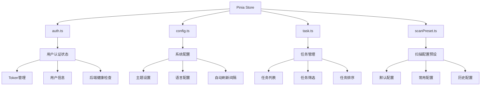
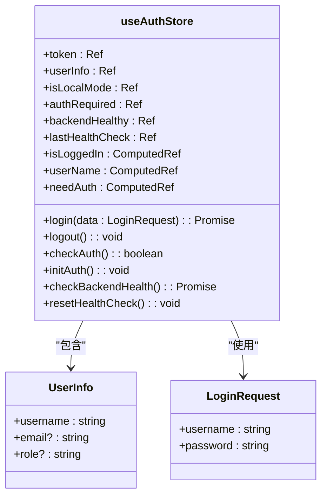
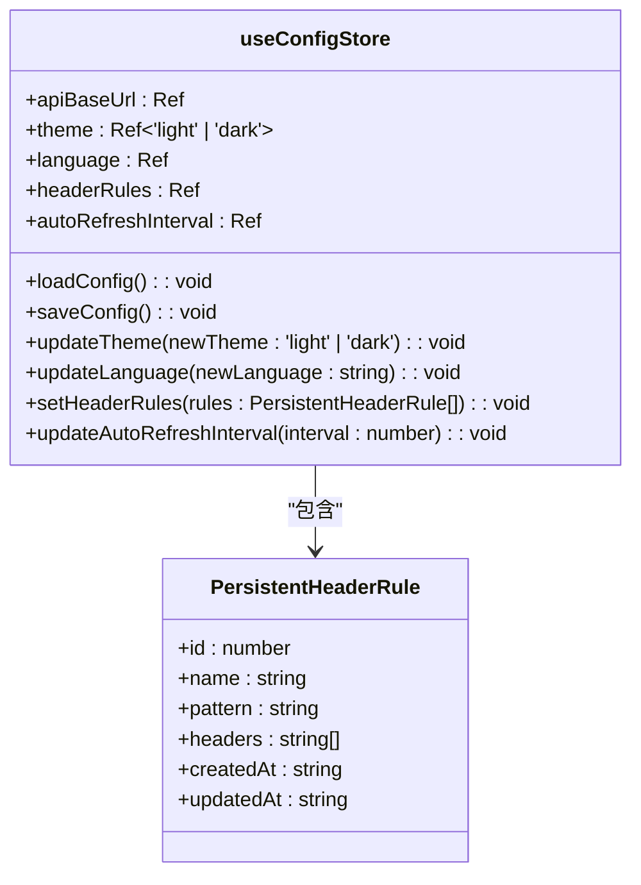
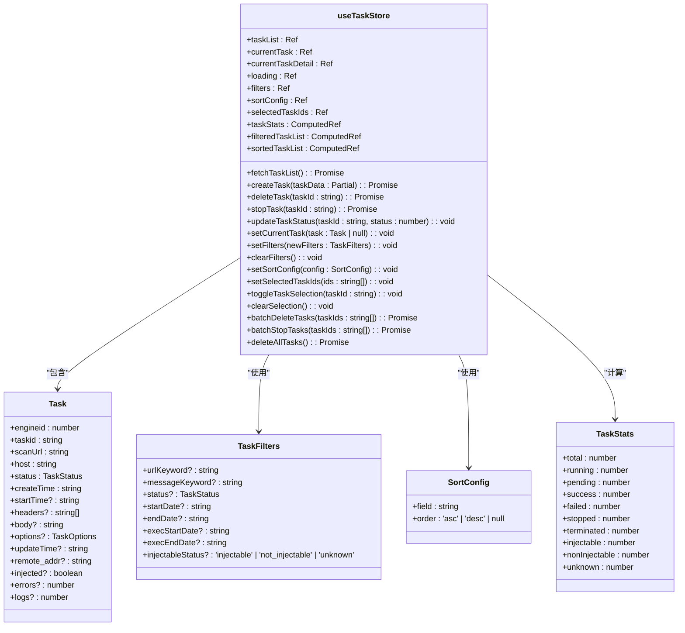
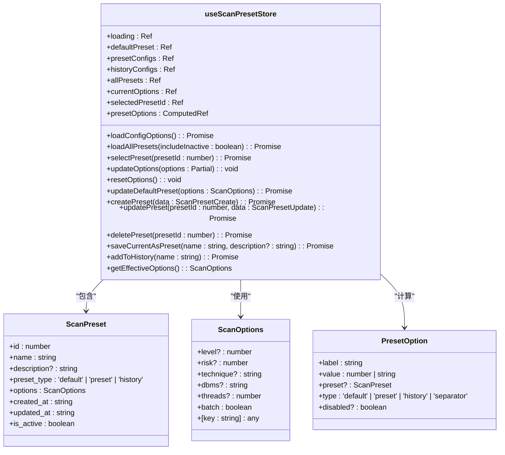
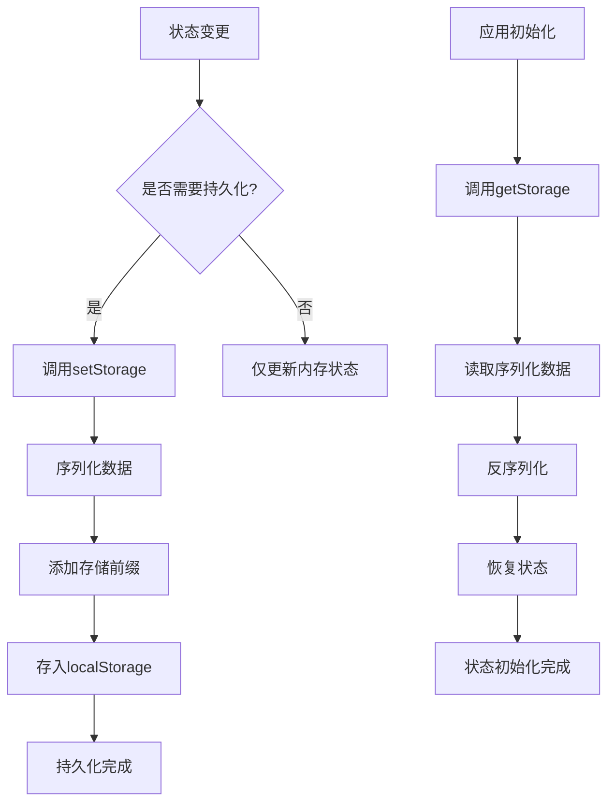
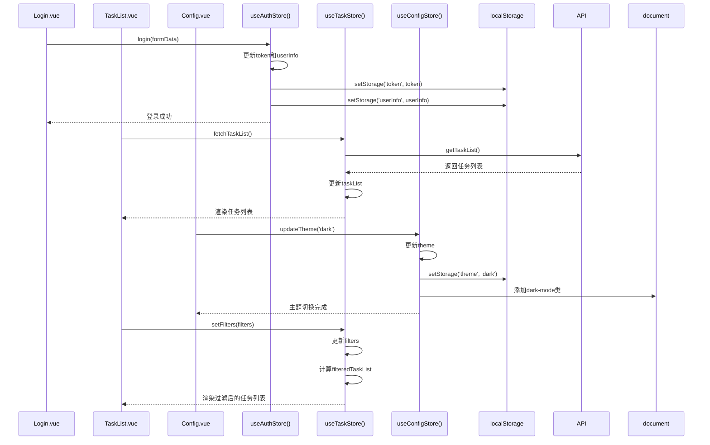
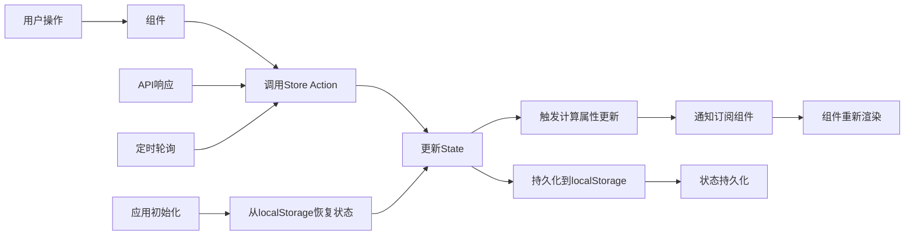
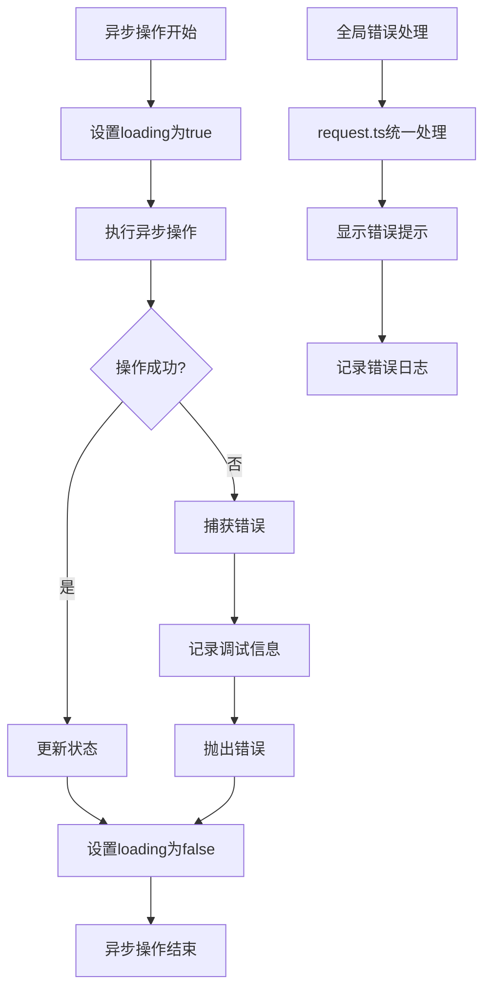
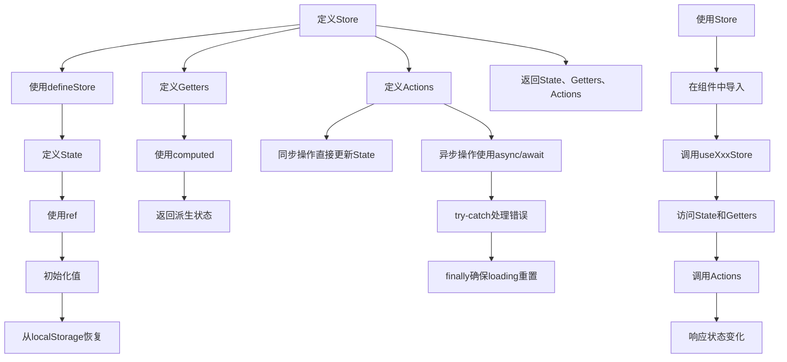

# 状态管理

<cite>
**本文档引用的文件**   
- [auth.ts](file://src/frontEnd/src/stores/auth.ts)
- [config.ts](file://src/frontEnd/src/stores/config.ts)
- [task.ts](file://src/frontEnd/src/stores/task.ts)
- [scanPreset.ts](file://src/frontEnd/src/stores/scanPreset.ts)
- [index.ts](file://src/frontEnd/src/stores/index.ts)
- [storage.ts](file://src/frontEnd/src/utils/storage.ts)
- [task.ts](file://src/frontEnd/src/types/task.ts)
- [common.ts](file://src/frontEnd/src/types/common.ts)
- [auth.ts](file://src/frontEnd/src/api/auth.ts)
- [task.ts](file://src/frontEnd/src/api/task.ts)
- [Login/index.vue](file://src/frontEnd/src/views/Login/index.vue)
- [TaskList/index.vue](file://src/frontEnd/src/views/TaskList/index.vue)
- [Config/index.vue](file://src/frontEnd/src/views/Config/index.vue)
- [guards.ts](file://src/frontEnd/src/router/guards.ts)
- [main.ts](file://src/frontEnd/src/main.ts)
</cite>

## 目录
1. [引言](#引言)
2. [状态管理架构](#状态管理架构)
3. [核心状态模块](#核心状态模块)
4. [状态持久化策略](#状态持久化策略)
5. [跨组件状态共享](#跨组件状态共享)
6. [状态流图](#状态流图)
7. [错误处理与异步操作](#错误处理与异步操作)
8. [最佳实践](#最佳实践)
9. [结论](#结论)

## 引言
sqlmapWebUI项目采用Pinia作为状态管理解决方案，实现了模块化、可维护的状态管理架构。本项目通过多个独立的store模块（如auth、config、task、scanPreset等）来组织应用状态，每个模块负责特定领域的状态管理。这种设计模式不仅提高了代码的可读性和可维护性，还支持状态的持久化存储和跨组件共享。本文档将详细介绍Pinia状态管理的实现细节，包括store的组织结构、state、getters和actions的使用方式、状态持久化策略以及跨组件状态共享的实现机制。

**状态管理架构**
- 采用模块化store设计，每个功能领域有独立的store
- 支持本地和远程双模式访问
- 实现了状态持久化，用户配置可跨会话保存
- 提供了丰富的计算属性和动作方法
- 支持异步操作和错误处理

## 状态管理架构

**图示来源**
- [auth.ts](file://src/frontEnd/src/stores/auth.ts)
- [config.ts](file://src/frontEnd/src/stores/config.ts)
- [task.ts](file://src/frontEnd/src/stores/task.ts)
- [scanPreset.ts](file://src/frontEnd/src/stores/scanPreset.ts)

**状态管理架构**
- 采用Pinia作为状态管理库，提供响应式状态管理
- 每个store模块独立，职责单一
- 通过index.ts统一导出所有store
- 支持TypeScript类型安全
- 与Vue 3的Composition API完美集成

## 核心状态模块

### 认证状态管理 (auth.ts)

**图示来源**
- [auth.ts](file://src/frontEnd/src/stores/auth.ts)
- [common.ts](file://src/frontEnd/src/types/common.ts)

**认证状态管理**
- 管理用户认证相关状态，包括Token、用户信息等
- 支持本地和远程双模式访问
- 提供登录、登出、认证检查等操作
- 实现后端服务健康检查
- 状态通过localStorage持久化存储

### 配置状态管理 (config.ts)

**图示来源**
- [config.ts](file://src/frontEnd/src/stores/config.ts)
- [headerRule.ts](file://src/frontEnd/src/types/headerRule.ts)

**配置状态管理**
- 管理系统配置信息，如API基础URL、主题、语言等
- 支持用户自定义Header规则
- 自动刷新间隔可配置
- 配置信息持久化存储
- 主题切换时自动应用到DOM

### 任务状态管理 (task.ts)

**图示来源**
- [task.ts](file://src/frontEnd/src/stores/task.ts)
- [task.ts](file://src/frontEnd/src/types/task.ts)

**任务状态管理**
- 管理所有任务相关状态，包括任务列表、筛选条件、排序配置等
- 提供丰富的计算属性，如任务统计、过滤后的任务列表等
- 支持批量操作，如批量删除、批量停止等
- 实现任务的增删改查操作
- 支持复杂的筛选和排序功能

### 扫描配置预设管理 (scanPreset.ts)

**图示来源**
- [scanPreset.ts](file://src/frontEnd/src/stores/scanPreset.ts)
- [scanPreset.ts](file://src/frontEnd/src/types/scanPreset.ts)

**扫描配置预设管理**
- 管理扫描配置预设，包括默认配置、常用配置、历史配置等
- 提供下拉菜单选项生成
- 支持预设的增删改查操作
- 可将当前配置保存为新预设或添加到历史记录
- 提供有效的扫描选项获取方法

## 状态持久化策略

**图示来源**
- [storage.ts](file://src/frontEnd/src/utils/storage.ts)
- [auth.ts](file://src/frontEnd/src/stores/auth.ts)
- [config.ts](file://src/frontEnd/src/stores/config.ts)

**状态持久化策略**
- 使用localStorage实现状态持久化
- 定义统一的存储工具函数setStorage、getStorage、removeStorage
- 为所有存储项添加统一前缀'sqlmap_webui_'，避免命名冲突
- 支持JSON序列化和反序列化
- 在状态变更时自动持久化，如用户登录、配置更改等
- 应用初始化时从localStorage恢复状态
- 提供错误处理，防止存储操作失败影响应用运行

## 跨组件状态共享

**图示来源**
- [Login/index.vue](file://src/frontEnd/src/views/Login/index.vue)
- [TaskList/index.vue](file://src/frontEnd/src/views/TaskList/index.vue)
- [Config/index.vue](file://src/frontEnd/src/views/Config/index.vue)
- [auth.ts](file://src/frontEnd/src/stores/auth.ts)
- [task.ts](file://src/frontEnd/src/stores/task.ts)
- [config.ts](file://src/frontEnd/src/stores/config.ts)

**跨组件状态共享**
- 通过Pinia store实现全局状态共享
- 多个组件可以访问和修改同一状态
- 状态变更自动通知所有订阅者
- 支持复杂的状态交互，如任务筛选、排序等
- 状态变更与UI更新解耦，提高应用性能
- 通过计算属性实现派生状态，减少重复计算

## 状态流图

**图示来源**
- [main.ts](file://src/frontEnd/src/main.ts)
- [auth.ts](file://src/frontEnd/src/stores/auth.ts)
- [config.ts](file://src/frontEnd/src/stores/config.ts)
- [task.ts](file://src/frontEnd/src/stores/task.ts)
- [storage.ts](file://src/frontEnd/src/utils/storage.ts)

**状态流图说明**
- 用户操作触发组件中的方法调用
- 组件调用Store的Action方法
- Action方法更新Store的State
- State变更触发计算属性重新计算
- 订阅了状态变化的组件收到通知
- 组件根据新的状态重新渲染UI
- 需要持久化的状态同时保存到localStorage
- API响应和定时轮询也会触发状态更新
- 应用初始化时从localStorage恢复状态

## 错误处理与异步操作

**图示来源**
- [task.ts](file://src/frontEnd/src/stores/task.ts)
- [auth.ts](file://src/frontEnd/src/stores/auth.ts)
- [request.ts](file://src/frontEnd/src/api/request.ts)

**错误处理与异步操作**
- 所有异步操作都使用async/await语法
- 操作开始时设置loading状态，显示加载指示器
- 使用try-catch捕获异步操作中的错误
- 错误信息在控制台记录，便于调试
- 错误向上抛出，由调用者处理
- 操作完成后（无论成功或失败）都设置loading为false
- API请求的错误在request.ts中统一处理
- 提供用户友好的错误提示
- 支持网络超时和连接失败的处理

## 最佳实践

**图示来源**
- [auth.ts](file://src/frontEnd/src/stores/auth.ts)
- [config.ts](file://src/frontEnd/src/stores/config.ts)
- [task.ts](file://src/frontEnd/src/stores/task.ts)
- [scanPreset.ts](file://src/frontEnd/src/stores/scanPreset.ts)

**最佳实践**
- 使用defineStore定义store，支持TypeScript类型推断
- State使用ref定义，确保响应式
- State初始化时从localStorage恢复持久化状态
- Getters使用computed定义，返回派生状态
- Actions中同步操作直接更新State
- Actions中异步操作使用async/await语法
- 使用try-catch处理异步操作中的错误
- 在finally块中重置loading状态，确保状态一致性
- 返回State、Getters和Actions，供组件使用
- 在组件中通过useXxxStore使用store
- 访问State和Getters，调用Actions
- 组件自动响应状态变化，重新渲染

## 结论
sqlmapWebUI项目通过Pinia实现了高效、可维护的状态管理。项目采用模块化设计，将不同领域的状态分离到独立的store中，提高了代码的可读性和可维护性。状态持久化策略确保用户配置能够跨会话保存，提升了用户体验。跨组件状态共享机制使得多个组件可以方便地访问和修改全局状态，实现了复杂的状态交互。错误处理和异步操作的规范化处理保证了应用的稳定性和可靠性。整体状态管理架构设计合理，遵循了最佳实践，为项目的持续发展奠定了坚实的基础。