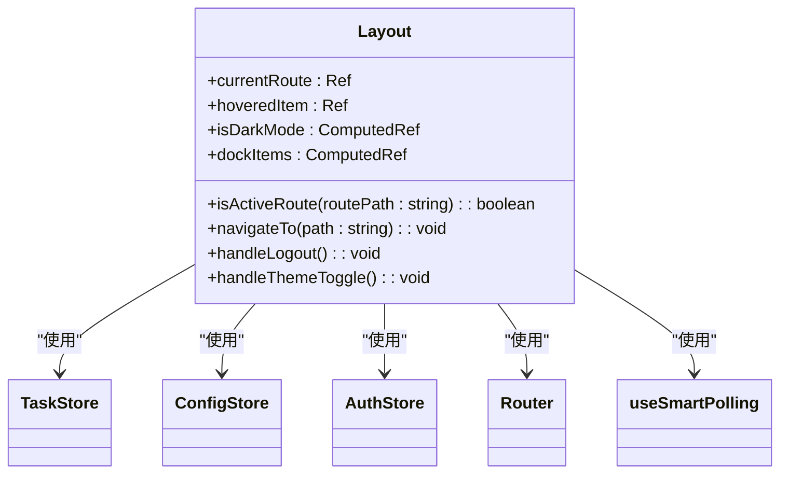
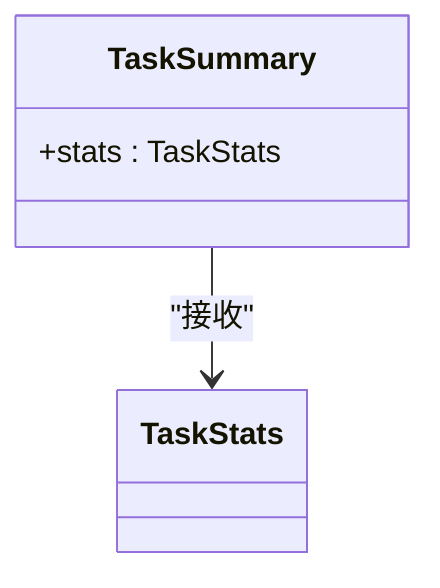
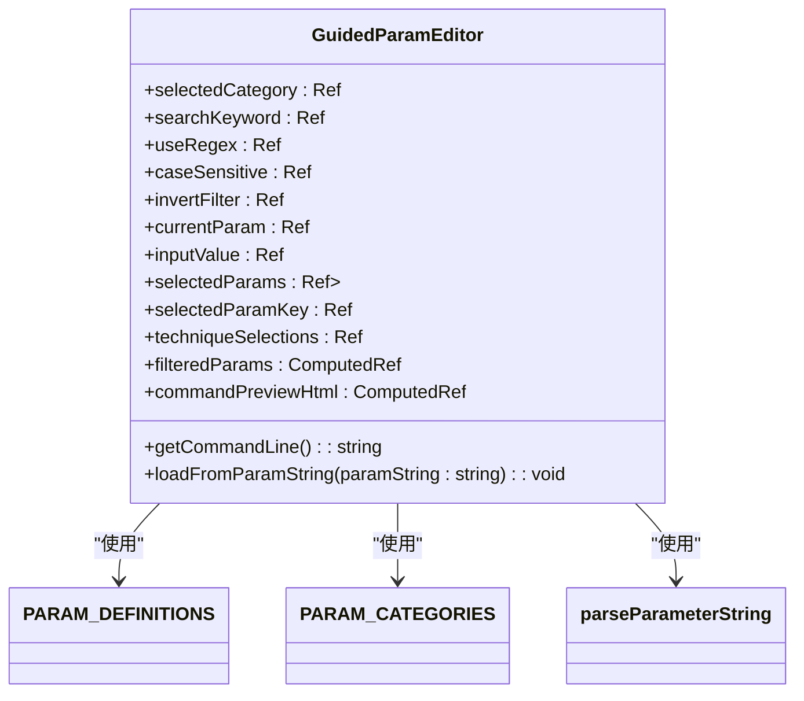
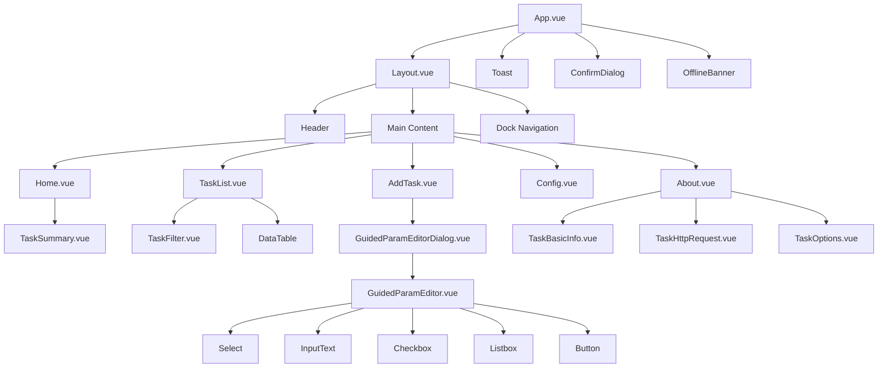

# 组件结构

<cite>
**本文档引用的文件**   
- [App.vue](file://src/frontEnd/src/App.vue)
- [Layout.vue](file://src/frontEnd/src/views/Layout.vue)
- [TaskSummary.vue](file://src/frontEnd/src/components/TaskSummary.vue)
- [GuidedParamEditor.vue](file://src/frontEnd/src/components/GuidedParamEditor.vue)
- [GuidedParamEditorDialog.vue](file://src/frontEnd/src/components/GuidedParamEditorDialog.vue)
- [TaskFilter.vue](file://src/frontEnd/src/components/TaskFilter.vue)
- [Home/index.vue](file://src/frontEnd/src/views/Home/index.vue)
- [TaskList/index.vue](file://src/frontEnd/src/views/TaskList/index.vue)
- [TaskDetail/index.vue](file://src/frontEnd/src/views/TaskDetail/index.vue)
- [TaskBasicInfo.vue](file://src/frontEnd/src/views/TaskDetail/components/TaskBasicInfo.vue)
- [main.ts](file://src/frontEnd/src/main.ts)
- [router/index.ts](file://src/frontEnd/src/router/index.ts)
- [stores/task.ts](file://src/frontEnd/src/stores/task.ts)
- [types/task.ts](file://src/frontEnd/src/types/task.ts)
- [utils/paramDefinitions.ts](file://src/frontEnd/src/utils/paramDefinitions.ts)
- [assets/styles/index.scss](file://src/frontEnd/src/assets/styles/index.scss)
</cite>

## 目录
1. [项目结构概述](#项目结构概述)
2. [核心组件架构](#核心组件架构)
3. [视图组件分析](#视图组件分析)
4. [可复用组件分析](#可复用组件分析)
5. [组件通信机制](#组件通信机制)
6. [组件层次结构图](#组件层次结构图)
7. [生命周期与响应式数据](#生命周期与响应式数据)
8. [样式与作用域](#样式与作用域)

## 项目结构概述

sqlmapWebUI前端项目采用Vue 3框架，结合TypeScript和Pinia状态管理，构建了一个现代化的Web用户界面。项目结构清晰，遵循了Vue应用的标准组织方式。

前端代码位于`src/frontEnd/src`目录下，主要包含以下几个核心部分：
- `views`目录存放视图组件，是应用的主要页面。
- `components`目录存放可复用的UI组件。
- `stores`目录存放Pinia状态管理模块。
- `router`目录存放路由配置。
- `api`目录存放与后端API交互的接口定义。
- `types`目录存放TypeScript类型定义。
- `utils`目录存放工具函数和共享逻辑。

应用的入口文件是`main.ts`，它负责创建Vue应用实例、配置Pinia和Vue Router，并挂载根组件`App.vue`。`App.vue`作为应用的最外层容器，引入了全局的Toast、ConfirmDialog等PrimeVue组件，并通过`<router-view />`渲染当前路由对应的视图组件。

**Section sources**
- [main.ts](file://src/frontEnd/src/main.ts#L1-L16)
- [App.vue](file://src/frontEnd/src/App.vue#L1-L33)

## 核心组件架构

sqlmapWebUI的前端组件架构采用分层设计，以`Layout.vue`作为应用的主布局组件，统一管理应用的全局UI元素，如顶部状态栏、底部Dock导航栏和主内容区域。这种设计确保了应用在不同页面间切换时，核心布局保持一致，提供了良好的用户体验。

应用的路由系统由Vue Router驱动，定义了多个嵌套路由。`Layout.vue`作为父路由组件，其`children`属性中包含了`Home`、`TaskList`、`AddTask`、`Config`和`About`等子路由。这种嵌套路由结构使得子视图组件可以无缝地嵌入到主布局中，实现了页面内容的动态切换。

状态管理采用Pinia，定义了`auth`、`task`和`config`等多个store模块，用于集中管理应用的全局状态。例如，`taskStore`管理所有任务相关的数据和逻辑，包括任务列表、过滤条件、排序配置和统计数据。这种集中式状态管理使得组件间的数据共享变得简单高效，避免了复杂的prop传递链。

**Section sources**
- [Layout.vue](file://src/frontEnd/src/views/Layout.vue#L1-L985)
- [router/index.ts](file://src/frontEnd/src/router/index.ts#L1-L77)
- [stores/task.ts](file://src/frontEnd/src/stores/task.ts#L1-L390)

## 视图组件分析

视图组件（Views）是应用的顶级页面，直接与路由关联。它们负责组织和协调多个可复用组件，构建完整的用户界面。

### Layout.vue 布局设计

`Layout.vue`是整个应用的骨架，其设计极具特色。它采用了现代化的Dock导航栏设计，位于页面底部，包含“首页”、“任务”、“添加任务”和“配置”四个导航项。每个导航项都是一个3D增强的圆形按钮，带有悬停和点击动画效果，提升了交互体验。

顶部状态栏包含应用Logo、名称、主题切换开关、用户信息和登出按钮。主题切换通过`ToggleSwitch`组件实现，与`configStore`中的`theme`状态双向绑定，实现了亮色和暗色主题的即时切换。

主内容区域使用`<router-view>`动态渲染子路由组件，并应用了`fade`过渡动画，使页面切换更加平滑。`Layout.vue`还通过`useSmartPolling` Hook实现了智能轮询，根据用户配置的刷新间隔自动获取最新的任务列表，确保了数据的实时性。



**Diagram sources**
- [Layout.vue](file://src/frontEnd/src/views/Layout.vue#L98-L247)

**Section sources**
- [Layout.vue](file://src/frontEnd/src/views/Layout.vue#L1-L985)

### TaskList.vue 任务列表

`TaskList.vue`是任务管理的核心视图，它使用PrimeVue的`DataTable`组件展示任务列表。该组件支持分页、排序、筛选和行选择等高级功能。

页面顶部的`TaskFilter`组件提供了强大的过滤功能，包括URL关键字、报文关键字、任务状态、注入状态和时间范围筛选。过滤条件通过`v-model:filters`与父组件双向绑定，实现了数据的实时同步。

`DataTable`的每一列都经过精心设计，例如“扫描URL”列支持点击跳转到任务详情，“是否存在注入”列使用`Tag`组件直观地显示状态。表格底部的汇总行展示了任务的统计信息，增强了数据的可读性。

### TaskDetail.vue 任务详情

`TaskDetail.vue`使用`Tabs`组件将任务的详细信息分为多个标签页，包括“基础信息”、“HTTP请求信息”、“扫描配置”、“扫描结果”、“任务日志”和“错误记录”。这种标签页设计有效地组织了大量信息，避免了页面过于冗长。

该组件通过组合式函数`useTaskDetail`封装了复杂的业务逻辑，如数据获取、状态管理和事件处理。这使得组件的`setup`部分非常简洁，易于维护。

## 可复用组件分析

可复用组件（Components）是构建视图的基础单元，它们封装了特定的UI功能和交互逻辑。

### TaskSummary.vue 任务概览

`TaskSummary.vue`是一个数据可视化组件，用于展示任务的汇总统计信息。它将统计数据分为“总任务数”、“任务状态”和“SQL注入检测”三个部分，每个部分使用一个`summary-item`卡片进行展示。

组件通过`props`接收一个`stats`对象，该对象的类型为`TaskStats`，定义在`types/task.ts`中。组件内部使用`v-for`循环渲染状态卡片，并根据不同的状态应用不同的颜色和图标，使信息一目了然。



**Diagram sources**
- [TaskSummary.vue](file://src/frontEnd/src/components/TaskSummary.vue#L131-L139)

**Section sources**
- [TaskSummary.vue](file://src/frontEnd/src/components/TaskSummary.vue#L1-L392)
- [types/task.ts](file://src/frontEnd/src/types/task.ts#L52-L64)

### GuidedParamEditor.vue 引导式参数编辑器

`GuidedParamEditor.vue`是应用中最复杂的可复用组件之一，它提供了一个图形化的界面来构建SQLMap命令行参数。

组件采用左右布局：
- **左侧**：参数选择面板，包含分类筛选、关键字搜索和参数列表。用户可以通过下拉框选择分类，输入关键字进行搜索，并从列表中选择要配置的参数。
- **右侧**：参数设置面板，包含参数设置区域和已选参数列表。当用户在左侧选择一个参数时，右侧会动态生成相应的输入控件（如`InputText`、`InputNumber`或`Checkbox`）。

该组件的核心是`getInputComponent()`和`getInputProps()`方法，它们根据当前选中参数的`type`属性动态决定渲染哪个PrimeVue组件以及传递哪些属性。例如，`technique`参数会渲染为一组复选框，而`level`参数会渲染为一个数字输入框。

组件通过`$emit('change')`事件将生成的命令行字符串传递给父组件，实现了数据的向上流动。



**Diagram sources**
- [GuidedParamEditor.vue](file://src/frontEnd/src/components/GuidedParamEditor.vue#L131-L161)

**Section sources**
- [GuidedParamEditor.vue](file://src/frontEnd/src/components/GuidedParamEditor.vue#L1-L706)
- [utils/paramDefinitions.ts](file://src/frontEnd/src/utils/paramDefinitions.ts#L6-L132)

### GuidedParamEditorDialog.vue 弹窗包装器

`GuidedParamEditorDialog.vue`是一个典型的“容器组件”，它将`GuidedParamEditor.vue`包装在一个`Dialog`弹窗中，并添加了保存和取消按钮。

该组件通过`props`接收`initialParams`、`presetName`和`presetDescription`等初始数据，并通过`v-model:visible`控制弹窗的显示和隐藏。当用户点击“保存”按钮时，它会调用`GuidedParamEditor`实例的`getCommandLine()`方法获取最终的参数字符串，并通过`confirm`事件将其与表单数据一起发送给父组件。

这种设计模式将复杂的表单逻辑与弹窗的显示逻辑分离，提高了代码的可复用性和可维护性。

## 组件通信机制

组件间的通信是Vue应用的核心，sqlmapWebUI采用了多种通信方式。

### Props传递

`props`是父子组件通信的主要方式。父组件通过属性将数据传递给子组件。例如，`TaskList.vue`将`taskStore.filters`作为`filters` prop传递给`TaskFilter.vue`，同时将`taskStore.sortedTaskList`作为`value` prop传递给`DataTable`。

```vue
<TaskFilter 
  :filters="taskStore.filters"
  :filteredCount="taskStore.sortedTaskList.length"
  :totalCount="taskStore.taskList.length"
  @update:filters="handleFilterChange"
/>
```

### 事件发射

子组件通过`$emit`触发事件，将数据或状态变化通知给父组件。`TaskFilter.vue`在过滤条件变化时，会通过`@update:filters`事件将新的过滤条件发送回`TaskList.vue`。

```vue
<InputText 
  v-model="localFilters.urlKeyword" 
  @input="onFilterChange"
/>
```

```typescript
function onFilterChange() {
  emit('update:filters', { ...localFilters.value })
}
```

### 插槽使用

虽然在当前项目中插槽的使用不多，但`Layout.vue`中的`<router-view>`本质上是`<slot>`的一种高级形式，它允许子路由组件的内容被插入到父组件的指定位置。

## 组件层次结构图

以下是sqlmapWebUI前端应用的组件层次结构图，展示了主要组件之间的嵌套关系。



**Diagram sources**
- [App.vue](file://src/frontEnd/src/App.vue#L20-L25)
- [Layout.vue](file://src/frontEnd/src/views/Layout.vue#L59-L64)
- [Home/index.vue](file://src/frontEnd/src/views/Home/index.vue#L2)
- [TaskList/index.vue](file://src/frontEnd/src/views/TaskList/index.vue#L2)
- [AddTask/index.vue](file://src/frontEnd/src/views/AddTask/index.vue#L2)
- [Config/index.vue](file://src/frontEnd/src/views/Config/index.vue#L2)
- [About/index.vue](file://src/frontEnd/src/views/About/index.vue#L2)
- [TaskSummary.vue](file://src/frontEnd/src/components/TaskSummary.vue#L2)
- [TaskFilter.vue](file://src/frontEnd/src/components/TaskFilter.vue#L2)
- [GuidedParamEditorDialog.vue](file://src/frontEnd/src/components/GuidedParamEditorDialog.vue#L2)
- [GuidedParamEditor.vue](file://src/frontEnd/src/components/GuidedParamEditor.vue#L2)
- [TaskBasicInfo.vue](file://src/frontEnd/src/views/TaskDetail/components/TaskBasicInfo.vue#L2)

## 生命周期与响应式数据

Vue 3的组合式API（Composition API）是本项目的核心。组件的逻辑主要在`<script setup>`标签中定义。

### 响应式数据

项目广泛使用`ref`和`computed`来创建响应式数据。`ref`用于定义基本类型的响应式变量，而`computed`用于定义基于其他响应式数据计算得出的值。

例如，在`TaskSummary.vue`中，`stats`是一个`props`，它本身是响应式的。组件内部没有定义额外的响应式数据。

在`GuidedParamEditor.vue`中，`selectedParams`是一个`ref`对象，用于存储用户选择的所有参数。`commandPreviewHtml`是一个`computed`属性，它根据`selectedParams`的内容动态生成命令行预览的HTML字符串。

### 生命周期钩子

`onMounted`钩子被频繁使用，用于在组件挂载后执行初始化操作。例如，`Home.vue`在`onMounted`中调用`refreshData`来获取初始的任务列表数据。

`onUnmounted`钩子用于清理资源，如在`Layout.vue`中移除键盘快捷键的事件监听器。

```typescript
onMounted(() => {
  currentRoute.value = route.path
  
  useSmartPolling({
    callback: async () => {
      await taskStore.fetchTaskList()
    },
    interval: getRefreshInterval,
    backgroundInterval: getBackgroundInterval,
    pauseOnUnhealthy: true,
    immediate: true,
  })
  
  window.addEventListener('keydown', handleKeyboardShortcut)
})

onUnmounted(() => {
  window.removeEventListener('keydown', handleKeyboardShortcut)
})
```

## 样式与作用域

项目采用了SCSS作为CSS预处理器，并通过`scoped`样式实现了样式作用域，防止样式污染。

### 样式作用域

所有组件的`<style>`标签都带有`scoped`属性，这意味着组件内的CSS规则只会应用到该组件的模板上。Vue通过在元素上添加唯一的`data-v-*`属性来实现这一点。

```vue
<style scoped lang="scss">
.task-summary {
  padding: 24px;
  background: linear-gradient(135deg, rgba(255, 255, 255, 0.95) 0%, rgba(248, 250, 252, 0.9) 100%);
  border-radius: 16px;
}
</style>
```

### 全局样式

全局样式定义在`src/frontEnd/src/assets/styles/index.scss`中。该文件导入了`variables.scss`（定义颜色、字体、间距等变量）和`reset.scss`（重置浏览器默认样式），并定义了一系列mixin（如`card-3d`、`gradient-button`）和工具类（如`.flex-between`、`.mt-md`）。

这些全局样式和mixin被各个组件引用，确保了整个应用的视觉风格统一。

```scss
@use '@/assets/styles/variables.scss' as *;
@use '@/assets/styles/index.scss' as *;
```