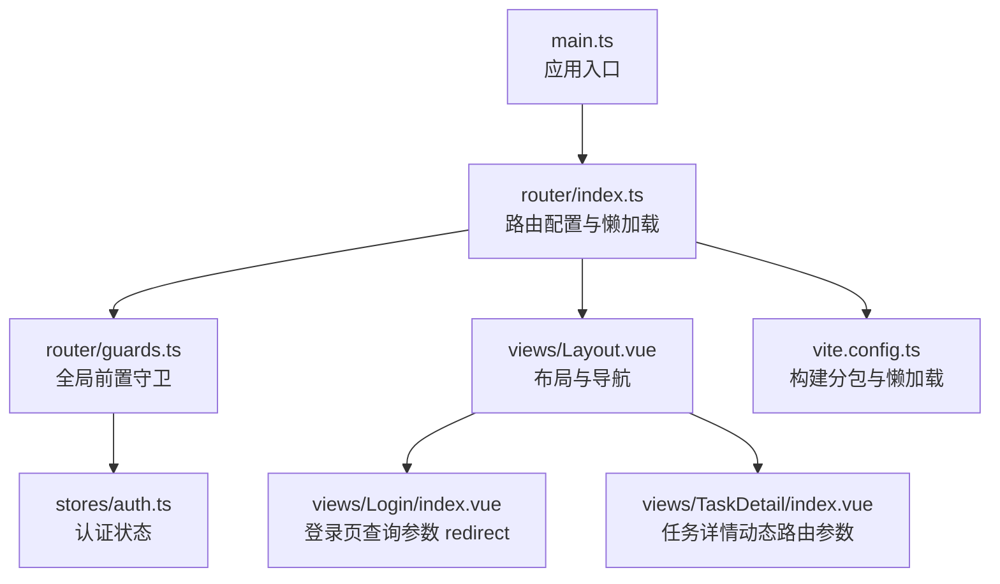
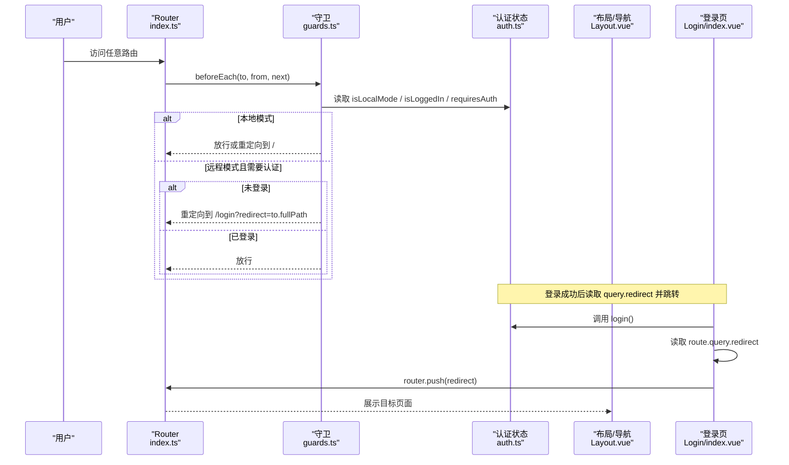
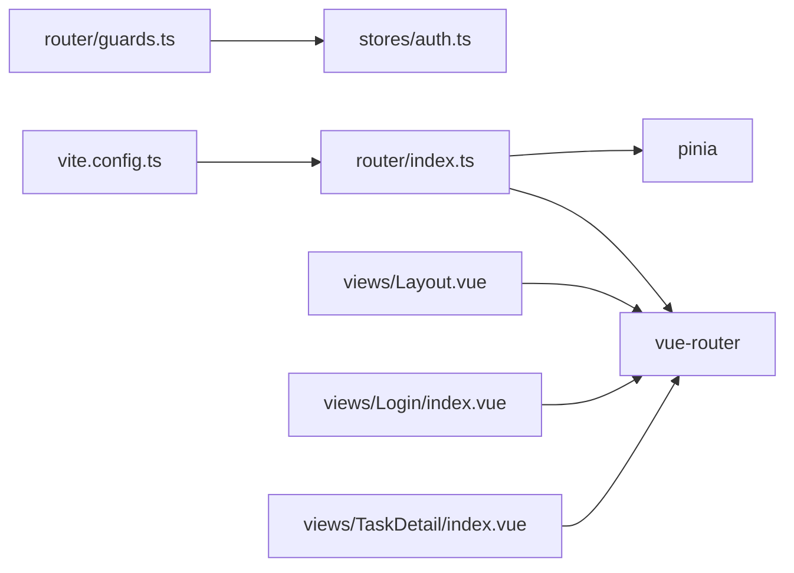

# 路由系统

<cite>
**本文引用的文件**
- [src/frontEnd/src/router/index.ts](file://src/frontEnd/src/router/index.ts)
- [src/frontEnd/src/router/guards.ts](file://src/frontEnd/src/router/guards.ts)
- [src/frontEnd/src/main.ts](file://src/frontEnd/src/main.ts)
- [src/frontEnd/src/stores/auth.ts](file://src/frontEnd/src/stores/auth.ts)
- [src/frontEnd/src/views/Layout.vue](file://src/frontEnd/src/views/Layout.vue)
- [src/frontEnd/src/views/Login/index.vue](file://src/frontEnd/src/views/Login/index.vue)
- [src/frontEnd/src/views/TaskDetail/index.vue](file://src/frontEnd/src/views/TaskDetail/index.vue)
- [src/frontEnd/vite.config.ts](file://src/frontEnd/vite.config.ts)
</cite>

## 目录
1. [简介](#简介)
2. [项目结构](#项目结构)
3. [核心组件](#核心组件)
4. [架构总览](#架构总览)
5. [详细组件分析](#详细组件分析)
6. [依赖分析](#依赖分析)
7. [性能考虑](#性能考虑)
8. [故障排查指南](#故障排查指南)
9. [结论](#结论)

## 简介
本文件聚焦 sqlmapWebUI 的前端路由系统，围绕 Vue Router 的配置与导航控制展开，系统性阐述：
- 路由定义、嵌套路由与动态路由的实现方式
- 路由守卫（全局前置守卫）的使用与权限控制逻辑
- 路由懒加载策略与打包分包优化
- 路由与身份验证的集成（通过 Pinia Store 与守卫联动）
- 路由参数处理、查询参数管理与编程式导航最佳实践
- 路由结构图与导航关系示意

## 项目结构
前端路由相关的关键位置如下：
- 路由入口与配置：src/frontEnd/src/router/index.ts
- 路由守卫：src/frontEnd/src/router/guards.ts
- 应用入口注册路由：src/frontEnd/src/main.ts
- 认证状态管理（与守卫联动）：src/frontEnd/src/stores/auth.ts
- 布局与导航（编程式导航示例）：src/frontEnd/src/views/Layout.vue
- 登录页（查询参数 redirect 的使用）：src/frontEnd/src/views/Login/index.vue
- 任务详情页（动态路由参数与编程式导航）：src/frontEnd/src/views/TaskDetail/index.vue
- 构建与懒加载优化：src/frontEnd/vite.config.ts



图表来源
- [src/frontEnd/src/main.ts](file://src/frontEnd/src/main.ts#L1-L16)
- [src/frontEnd/src/router/index.ts](file://src/frontEnd/src/router/index.ts#L1-L77)
- [src/frontEnd/src/router/guards.ts](file://src/frontEnd/src/router/guards.ts#L1-L47)
- [src/frontEnd/src/stores/auth.ts](file://src/frontEnd/src/stores/auth.ts#L1-L175)
- [src/frontEnd/src/views/Layout.vue](file://src/frontEnd/src/views/Layout.vue#L1-L247)
- [src/frontEnd/src/views/Login/index.vue](file://src/frontEnd/src/views/Login/index.vue#L1-L94)
- [src/frontEnd/src/views/TaskDetail/index.vue](file://src/frontEnd/src/views/TaskDetail/index.vue#L1-L200)
- [src/frontEnd/vite.config.ts](file://src/frontEnd/vite.config.ts#L1-L74)

章节来源
- [src/frontEnd/src/router/index.ts](file://src/frontEnd/src/router/index.ts#L1-L77)
- [src/frontEnd/src/router/guards.ts](file://src/frontEnd/src/router/guards.ts#L1-L47)
- [src/frontEnd/src/main.ts](file://src/frontEnd/src/main.ts#L1-L16)
- [src/frontEnd/vite.config.ts](file://src/frontEnd/vite.config.ts#L1-L74)

## 核心组件
- 路由配置与懒加载
  - 使用 createRouter 与 createWebHistory
  - 所有页面组件均采用动态导入实现懒加载
  - 嵌套路由通过 children 实现，根路由为 Layout
- 全局前置守卫
  - 在 beforeEach 中根据 requiresAuth 与认证状态决定放行或重定向
  - 支持本地/远程双模式：本地模式直接放行；远程模式需要登录
- 认证状态管理
  - 通过 Pinia store 提供 isLoggedIn、isLocalMode、authRequired 等状态
  - 登录成功后持久化 token 与用户信息
- 编程式导航
  - 布局组件通过 useRouter.push 实现导航
  - 登录组件读取 query.redirect 并跳转回原路径
  - 任务详情页使用 router.back 返回上一页

章节来源
- [src/frontEnd/src/router/index.ts](file://src/frontEnd/src/router/index.ts#L1-L77)
- [src/frontEnd/src/router/guards.ts](file://src/frontEnd/src/router/guards.ts#L1-L47)
- [src/frontEnd/src/stores/auth.ts](file://src/frontEnd/src/stores/auth.ts#L1-L175)
- [src/frontEnd/src/views/Layout.vue](file://src/frontEnd/src/views/Layout.vue#L160-L186)
- [src/frontEnd/src/views/Login/index.vue](file://src/frontEnd/src/views/Login/index.vue#L43-L54)
- [src/frontEnd/src/views/TaskDetail/index.vue](file://src/frontEnd/src/views/TaskDetail/index.vue#L9-L16)

## 架构总览
路由系统围绕“配置—守卫—状态—导航”四要素协同工作：
- 配置层：定义路由表、嵌套关系与懒加载
- 守卫层：统一拦截导航，按需重定向至登录页或首页
- 状态层：认证状态与访问模式（本地/远程）驱动守卫逻辑
- 导航层：组件内使用编程式导航完成页面跳转与返回



图表来源
- [src/frontEnd/src/router/index.ts](file://src/frontEnd/src/router/index.ts#L1-L77)
- [src/frontEnd/src/router/guards.ts](file://src/frontEnd/src/router/guards.ts#L1-L47)
- [src/frontEnd/src/stores/auth.ts](file://src/frontEnd/src/stores/auth.ts#L1-L175)
- [src/frontEnd/src/views/Layout.vue](file://src/frontEnd/src/views/Layout.vue#L160-L186)
- [src/frontEnd/src/views/Login/index.vue](file://src/frontEnd/src/views/Login/index.vue#L43-L54)

## 详细组件分析

### 路由定义与嵌套路由
- 根路由为 Layout，children 包含首页、任务列表、任务详情、配置、添加任务、关于等子路由
- 子路由均使用动态导入，实现按需加载
- 未匹配路由重定向到 /home
- 顶层登录路由不进入 Layout，独立存在

章节来源
- [src/frontEnd/src/router/index.ts](file://src/frontEnd/src/router/index.ts#L9-L65)

### 动态路由与参数处理
- 任务详情路由使用动态段 :id，便于在组件内通过路由参数获取任务标识
- 组件内可使用 useRouter 和 useRoute 获取当前路由信息，实现编程式导航与返回

章节来源
- [src/frontEnd/src/router/index.ts](file://src/frontEnd/src/router/index.ts#L29-L34)
- [src/frontEnd/src/views/TaskDetail/index.vue](file://src/frontEnd/src/views/TaskDetail/index.vue#L9-L16)

### 路由守卫（全局前置守卫）
- 本地模式：直接放行；若访问 /login 则重定向到 /
- 远程模式：requiresAuth 为 true 且未登录时，重定向到 /login，并携带 query.redirect=原始路径
- 已登录用户访问 /login 时，重定向到 /
- 守卫逻辑基于 Pinia store 的 isLocalMode 与 isLoggedIn

章节来源
- [src/frontEnd/src/router/guards.ts](file://src/frontEnd/src/router/guards.ts#L1-L47)
- [src/frontEnd/src/stores/auth.ts](file://src/frontEnd/src/stores/auth.ts#L33-L52)

### 路由懒加载与构建优化
- 所有页面组件均通过动态导入实现懒加载
- Vite 构建配置中通过 manualChunks 将 vue、vue-router、pinia、axios 等拆分为 vendor 包，提升缓存命中率
- primevue、lodash-es、dayjs 等第三方库单独分包，降低主包体积

章节来源
- [src/frontEnd/src/router/index.ts](file://src/frontEnd/src/router/index.ts#L10-L20)
- [src/frontEnd/src/router/index.ts](file://src/frontEnd/src/router/index.ts#L56-L59)
- [src/frontEnd/vite.config.ts](file://src/frontEnd/vite.config.ts#L65-L71)

### 编程式导航最佳实践
- 布局组件通过 router.push 实现导航，避免硬编码路径
- 登录组件读取 query.redirect 并跳转回原路径，保证用户体验
- 任务详情页使用 router.back 返回上一页，保持导航一致性

章节来源
- [src/frontEnd/src/views/Layout.vue](file://src/frontEnd/src/views/Layout.vue#L169-L186)
- [src/frontEnd/src/views/Login/index.vue](file://src/frontEnd/src/views/Login/index.vue#L43-L54)
- [src/frontEnd/src/views/TaskDetail/index.vue](file://src/frontEnd/src/views/TaskDetail/index.vue#L9-L16)

### 查询参数管理
- 登录页通过 route.query.redirect 保存原始目标路径，登录后跳转回去
- 守卫在需要认证时将原始路径作为查询参数传入 /login，形成闭环

章节来源
- [src/frontEnd/src/views/Login/index.vue](file://src/frontEnd/src/views/Login/index.vue#L43-L54)
- [src/frontEnd/src/router/guards.ts](file://src/frontEnd/src/router/guards.ts#L33-L44)

### 路由与身份验证的集成
- 守卫读取 isLocalMode 与 isLoggedIn，决定是否放行
- 认证状态来自 Pinia store，登录成功后持久化 token 与用户信息
- 远程模式下，后端健康检查与认证状态共同影响导航行为

章节来源
- [src/frontEnd/src/router/guards.ts](file://src/frontEnd/src/router/guards.ts#L1-L47)
- [src/frontEnd/src/stores/auth.ts](file://src/frontEnd/src/stores/auth.ts#L1-L175)

### 路由结构图（页面间导航关系）
```mermaid
graph TB
subgraph "根路由"
L["Layout.vue"]
end
subgraph "Layout 子路由"
H["首页 /home"]
TL["任务列表 /tasks"]
TD["任务详情 /tasks/:id"]
C["配置 /config"]
AT["添加任务 /add-task"]
A["关于 /about"]
end
subgraph "独立路由"
LG["登录 /login"]
end
subgraph "未匹配"
ANY["/:pathMatch(.*)* -> /home"]
end
"/" --> L
L --> H
L --> TL
L --> TD
L --> C
L --> AT
L --> A
"/login" --> LG
ANY --> H
```

图表来源
- [src/frontEnd/src/router/index.ts](file://src/frontEnd/src/router/index.ts#L9-L65)

## 依赖分析
- 路由配置依赖 Vue Router 与 Pinia
- 守卫依赖认证状态 store
- 组件内导航依赖 vue-router 的 useRouter/useRoute
- 构建阶段通过 Vite 的 manualChunks 与动态导入实现懒加载与分包



图表来源
- [src/frontEnd/src/router/index.ts](file://src/frontEnd/src/router/index.ts#L1-L77)
- [src/frontEnd/src/router/guards.ts](file://src/frontEnd/src/router/guards.ts#L1-L47)
- [src/frontEnd/src/stores/auth.ts](file://src/frontEnd/src/stores/auth.ts#L1-L175)
- [src/frontEnd/src/views/Layout.vue](file://src/frontEnd/src/views/Layout.vue#L160-L186)
- [src/frontEnd/src/views/Login/index.vue](file://src/frontEnd/src/views/Login/index.vue#L27-L54)
- [src/frontEnd/src/views/TaskDetail/index.vue](file://src/frontEnd/src/views/TaskDetail/index.vue#L9-L16)
- [src/frontEnd/vite.config.ts](file://src/frontEnd/vite.config.ts#L65-L71)

章节来源
- [src/frontEnd/src/router/index.ts](file://src/frontEnd/src/router/index.ts#L1-L77)
- [src/frontEnd/src/router/guards.ts](file://src/frontEnd/src/router/guards.ts#L1-L47)
- [src/frontEnd/src/stores/auth.ts](file://src/frontEnd/src/stores/auth.ts#L1-L175)
- [src/frontEnd/src/views/Layout.vue](file://src/frontEnd/src/views/Layout.vue#L160-L186)
- [src/frontEnd/src/views/Login/index.vue](file://src/frontEnd/src/views/Login/index.vue#L27-L54)
- [src/frontEnd/src/views/TaskDetail/index.vue](file://src/frontEnd/src/views/TaskDetail/index.vue#L9-L16)
- [src/frontEnd/vite.config.ts](file://src/frontEnd/vite.config.ts#L65-L71)

## 性能考虑
- 懒加载：所有页面组件均采用动态导入，减少首屏加载体积
- 分包策略：通过 manualChunks 将核心依赖拆分为 vendor 包，提升缓存复用
- 构建优化：开启 gzip 压缩，合理设置 chunkSizeWarningLimit
- 交互体验：布局组件使用过渡动画与智能轮询，兼顾性能与可用性

章节来源
- [src/frontEnd/src/router/index.ts](file://src/frontEnd/src/router/index.ts#L10-L20)
- [src/frontEnd/src/router/index.ts](file://src/frontEnd/src/router/index.ts#L56-L59)
- [src/frontEnd/vite.config.ts](file://src/frontEnd/vite.config.ts#L27-L33)
- [src/frontEnd/vite.config.ts](file://src/frontEnd/vite.config.ts#L65-L71)
- [src/frontEnd/src/views/Layout.vue](file://src/frontEnd/src/views/Layout.vue#L59-L65)

## 故障排查指南
- 登录后无法回到原页面
  - 检查登录页是否正确读取 query.redirect 并调用 router.push
  - 参考路径：[src/frontEnd/src/views/Login/index.vue](file://src/frontEnd/src/views/Login/index.vue#L43-L54)
- 已登录仍被重定向到登录页
  - 检查守卫逻辑与认证状态 store 的 isLoggedIn/isLocalMode
  - 参考路径：[src/frontEnd/src/router/guards.ts](file://src/frontEnd/src/router/guards.ts#L1-L47)，[src/frontEnd/src/stores/auth.ts](file://src/frontEnd/src/stores/auth.ts#L33-L52)
- 任务详情页参数缺失
  - 确认路由定义中包含 :id 动态段，并在组件内通过路由参数获取
  - 参考路径：[src/frontEnd/src/router/index.ts](file://src/frontEnd/src/router/index.ts#L29-L34)，[src/frontEnd/src/views/TaskDetail/index.vue](file://src/frontEnd/src/views/TaskDetail/index.vue#L9-L16)
- 首次加载缓慢
  - 检查 manualChunks 与动态导入是否生效
  - 参考路径：[src/frontEnd/vite.config.ts](file://src/frontEnd/vite.config.ts#L65-L71)，[src/frontEnd/src/router/index.ts](file://src/frontEnd/src/router/index.ts#L10-L20)

章节来源
- [src/frontEnd/src/views/Login/index.vue](file://src/frontEnd/src/views/Login/index.vue#L43-L54)
- [src/frontEnd/src/router/guards.ts](file://src/frontEnd/src/router/guards.ts#L1-L47)
- [src/frontEnd/src/stores/auth.ts](file://src/frontEnd/src/stores/auth.ts#L33-L52)
- [src/frontEnd/src/router/index.ts](file://src/frontEnd/src/router/index.ts#L29-L34)
- [src/frontEnd/vite.config.ts](file://src/frontEnd/vite.config.ts#L65-L71)

## 结论
sqlmapWebUI 的路由系统以 Vue Router 为核心，结合 Pinia 认证状态与全局前置守卫，实现了清晰的导航控制与权限管理。通过嵌套路由与动态导入，既保证了页面功能的模块化组织，又提升了首屏性能。登录页与布局组件的编程式导航实践，体现了查询参数与路由跳转的最佳实践。整体设计具备良好的扩展性与维护性，适合在后续迭代中继续完善权限细分与导航体验。