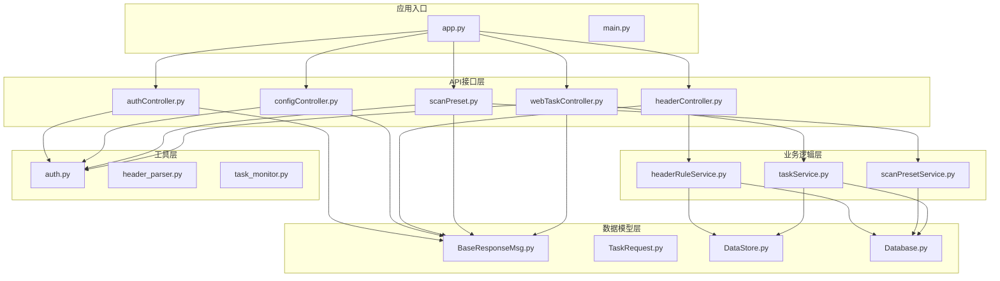
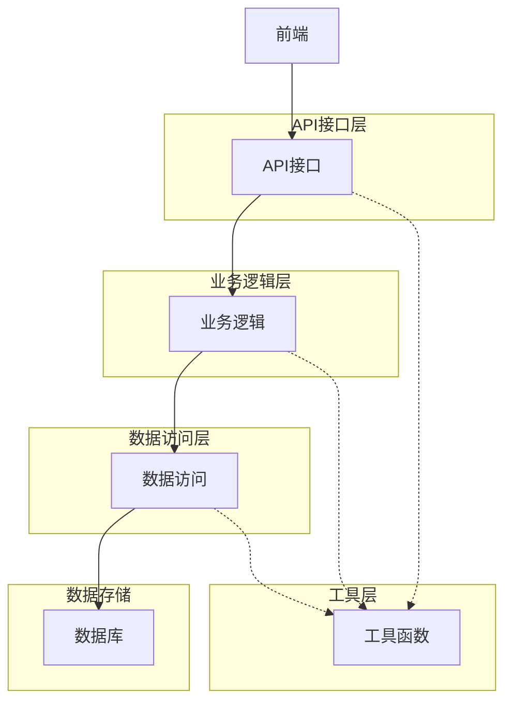
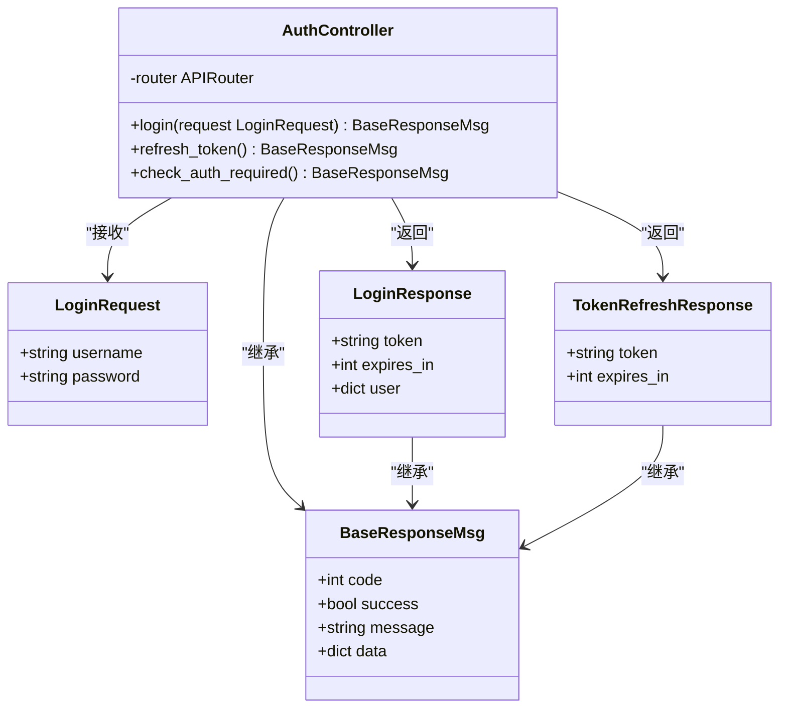
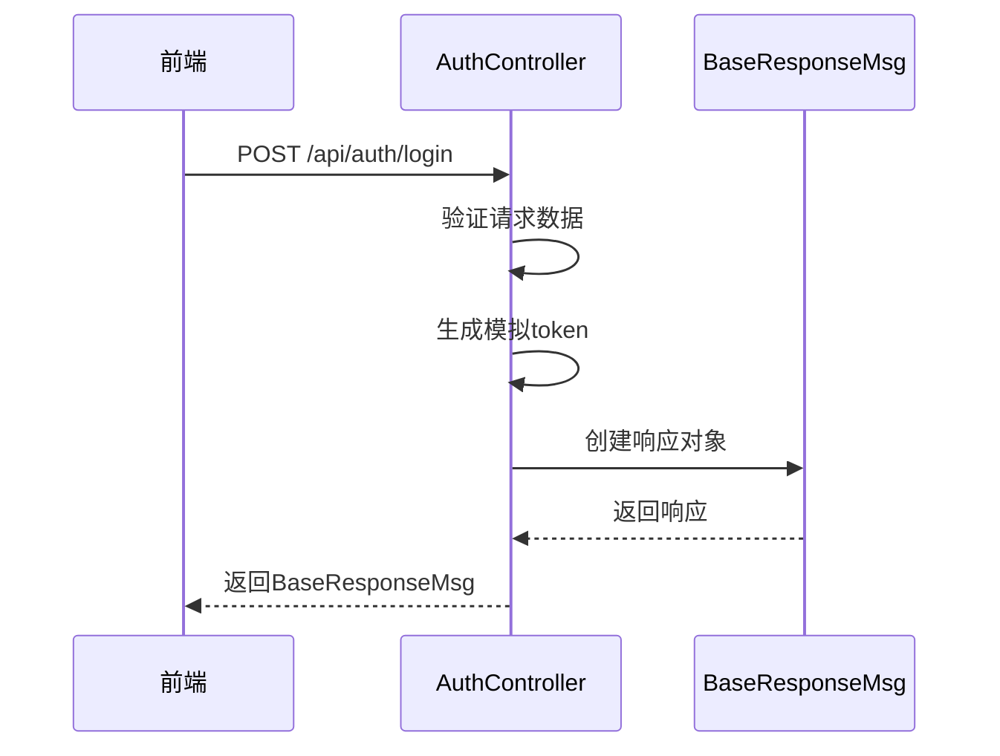
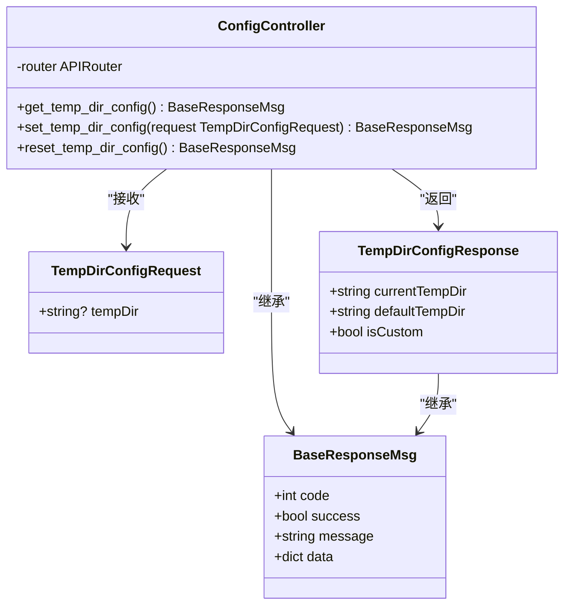
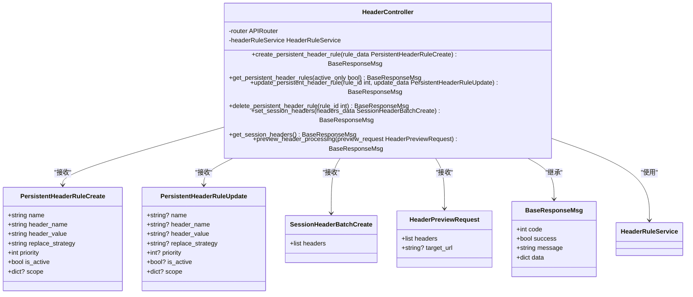
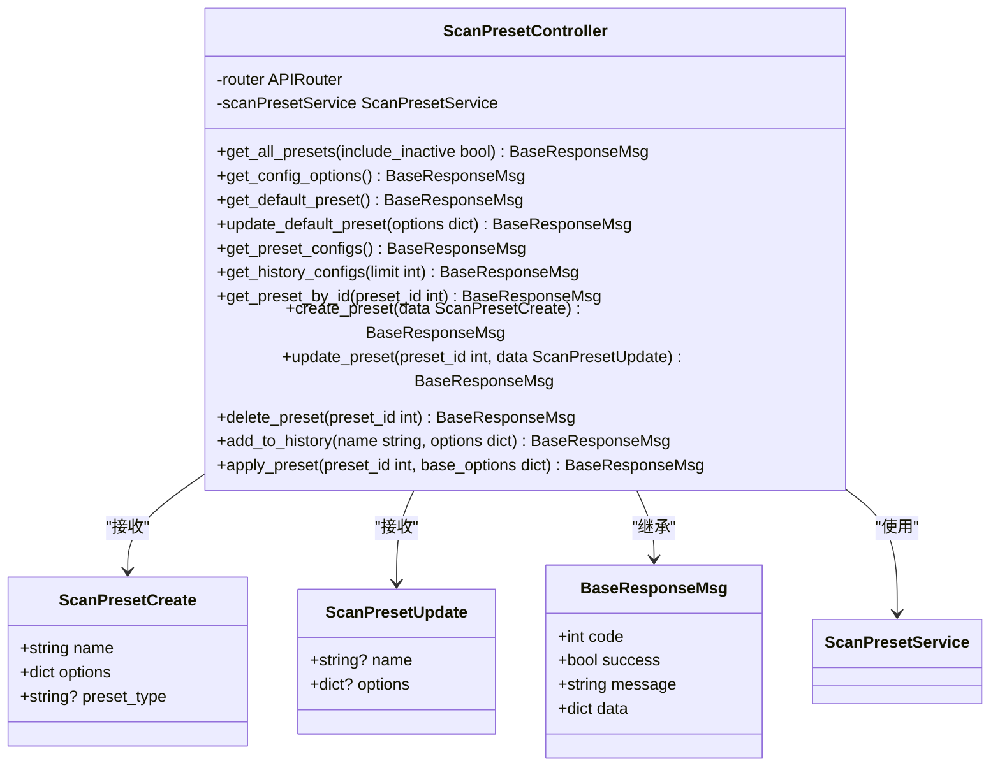
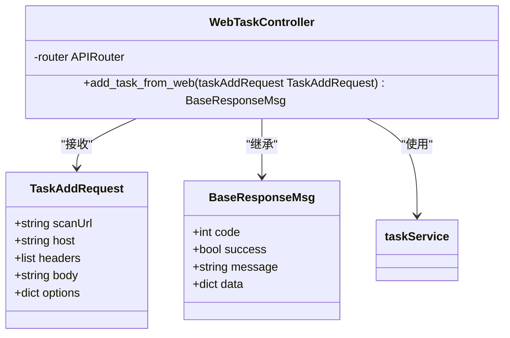
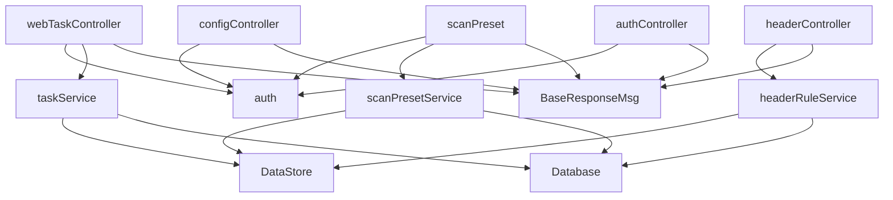

# API接口

<cite>
**本文档引用的文件**   
- [app.py](file://src/backEnd/app.py)
- [main.py](file://src/backEnd/main.py)
- [BaseResponseMsg.py](file://src/backEnd/model/BaseResponseMsg.py)
- [authController.py](file://src/backEnd/api/commonApi/authController.py)
- [configController.py](file://src/backEnd/api/commonApi/configController.py)
- [headerController.py](file://src/backEnd/api/commonApi/headerController.py)
- [scanPreset.py](file://src/backEnd/api/commonApi/scanPreset.py)
- [webTaskController.py](file://src/backEnd/api/commonApi/webTaskController.py)
- [headerRuleService.py](file://src/backEnd/service/headerRuleService.py)
- [scanPresetService.py](file://src/backEnd/service/scanPresetService.py)
- [taskService.py](file://src/backEnd/service/taskService.py)
- [auth.py](file://src/backEnd/utils/auth.py)
- [TaskRequest.py](file://src/backEnd/model/requestModel/TaskRequest.py)
- [config.py](file://src/backEnd/config.py)
</cite>

## 目录
1. [简介](#简介)
2. [项目结构](#项目结构)
3. [核心组件](#核心组件)
4. [架构概述](#架构概述)
5. [详细组件分析](#详细组件分析)
6. [依赖分析](#依赖分析)
7. [性能考虑](#性能考虑)
8. [故障排除指南](#故障排除指南)
9. [结论](#结论)

## 简介
sqlmapWebUI后端是一个基于FastAPI构建的RESTful API服务，为前端Web界面和浏览器扩展提供后端支持。该系统实现了完整的API设计，包括认证、配置管理、请求头规则、扫描预设和任务控制等功能。API采用模块化设计，通过统一的响应结构BaseResponseMsg封装所有响应，确保了接口的一致性和可预测性。系统支持本地单机模式运行，通过CORS配置允许前端跨域访问，同时提供了健康检查和版本信息等基础服务端点。

## 项目结构
sqlmapWebUI后端项目采用清晰的分层架构，将API接口、业务逻辑、数据模型和工具函数分离。核心API控制器位于`src/backEnd/api/commonApi/`目录下，包括认证、配置、请求头、扫描预设和任务控制等模块。业务逻辑服务位于`src/backEnd/service/`目录，数据模型定义在`src/backEnd/model/`目录，工具函数则在`src/backEnd/utils/`目录。主应用入口在`app.py`中定义，通过FastAPI的路由机制将各个API模块注册到统一的服务中。

**图源**
- [app.py](file://src/backEnd/app.py#L10-L16)
- [authController.py](file://src/backEnd/api/commonApi/authController.py#L14)
- [configController.py](file://src/backEnd/api/commonApi/configController.py#L19)
- [headerController.py](file://src/backEnd/api/commonApi/headerController.py#L19)
- [scanPreset.py](file://src/backEnd/api/commonApi/scanPreset.py#L20)
- [webTaskController.py](file://src/backEnd/api/commonApi/webTaskController.py#L16)

## 核心组件

### 统一响应结构
BaseResponseMsg是所有API响应的基类，继承自FastAPI的JSONResponse。它定义了统一的响应格式，包括code、success、message和data四个字段，确保了所有API接口返回数据的一致性。这种设计简化了前端对API响应的处理逻辑，提高了系统的可维护性。

**组件源**
- [BaseResponseMsg.py](file://src/backEnd/model/BaseResponseMsg.py#L5-L20)

### 路由注册机制
app.py文件是API的入口点，负责注册所有API路由。通过FastAPI的include_router方法，将各个功能模块的路由器注册到应用中，并统一添加/api前缀。这种模块化的设计使得API的组织更加清晰，便于维护和扩展。

**组件源**
- [app.py](file://src/backEnd/app.py#L36-L42)

## 架构概述

### API架构
sqlmapWebUI后端采用典型的分层架构，从上到下分为API接口层、业务逻辑层、数据访问层和工具层。API接口层负责处理HTTP请求和响应，业务逻辑层实现核心功能，数据访问层管理数据库操作，工具层提供通用功能支持。这种分层设计遵循了关注点分离原则，提高了代码的可测试性和可维护性。

**图源**
- [app.py](file://src/backEnd/app.py)
- [service目录](file://src/backEnd/service/)
- [model目录](file://src/backEnd/model/)

## 详细组件分析

### 认证接口分析
认证接口(authController)提供了用户登录、令牌刷新和认证检查功能。在本地单机模式下，认证逻辑被简化，主要通过检查客户端IP地址来判断是否为本地访问。系统提供了三个主要端点：/api/auth/login用于用户登录，/api/auth/refresh用于刷新访问令牌，/api/auth/check-required用于检查当前访问是否需要认证。

#### 认证接口类图

**图源**
- [authController.py](file://src/backEnd/api/commonApi/authController.py#L19-L36)

#### 认证流程序列图

**图源**
- [authController.py](file://src/backEnd/api/commonApi/authController.py#L40-L69)

### 配置管理接口分析
配置管理接口(configController)负责管理HTTP请求临时文件目录的配置。它提供了获取、设置和重置临时目录的功能。系统通过依赖注入机制使用get_current_user函数进行访问控制，确保只有授权用户才能修改配置。

#### 配置管理接口类图

**图源**
- [configController.py](file://src/backEnd/api/commonApi/configController.py#L22-L32)

### 请求头规则接口分析
请求头规则接口(headerController)是系统的核心功能之一，提供了持久化请求头规则和会话性请求头的管理。它支持创建、读取、更新和删除操作，以及批量处理和预览功能。服务通过HeaderRuleService实现业务逻辑，确保了代码的可重用性和可测试性。

#### 请求头规则接口类图

**图源**
- [headerController.py](file://src/backEnd/api/commonApi/headerController.py#L69-L481)
- [headerRuleService.py](file://src/backEnd/service/headerRuleService.py#L32-L800)

### 扫描预设接口分析
扫描预设接口(scanPreset)提供了Web端扫描配置预设的管理功能。它支持获取所有预设配置、创建新预设、更新预设、删除预设和应用预设到选项等操作。服务通过scanPresetService实现业务逻辑，确保了数据的一致性和完整性。

#### 扫描预设接口类图

**图源**
- [scanPreset.py](file://src/backEnd/api/commonApi/scanPreset.py#L23-L325)
- [scanPresetService.py](file://src/backEnd/service/scanPresetService.py#L17-L182)

### 任务控制接口分析
任务控制接口(webTaskController)负责处理Web端提交的扫描任务。它复用了与BurpSuite插件相同的业务逻辑，但通过独立的接口区分日志来源，便于维护和调试。接口通过TaskAddRequest模型接收任务参数，并使用taskService处理任务创建逻辑。

#### 任务控制接口类图

**图源**
- [webTaskController.py](file://src/backEnd/api/commonApi/webTaskController.py#L19-L91)
- [taskService.py](file://src/backEnd/service/taskService.py#L46-L535)

## 依赖分析

### 模块依赖关系
sqlmapWebUI后端的模块依赖关系清晰，遵循了依赖倒置原则。高层模块依赖于抽象，而不是具体实现。API控制器依赖于业务服务，业务服务依赖于数据模型和数据库，形成了稳定的依赖链。

**图源**
- [app.py](file://src/backEnd/app.py)
- [api目录](file://src/backEnd/api/commonApi/)
- [service目录](file://src/backEnd/service/)

### 外部依赖
项目的主要外部依赖包括FastAPI（用于构建RESTful API）、APScheduler（用于后台任务调度）和Uvicorn（用于ASGI服务器）。这些依赖通过pyproject.toml文件管理，确保了依赖版本的一致性。

**组件源**
- [pyproject.toml](file://src/backEnd/pyproject.toml)

## 性能考虑
sqlmapWebUI后端在性能方面做了多项优化。首先，通过BackgroundScheduler启动后台任务监控器，每3秒执行一次任务状态检查，确保了任务状态的实时性。其次，使用线程锁（tasks_lock）保护共享资源，避免了多线程环境下的数据竞争问题。此外，数据库操作通过连接池管理，提高了数据库访问效率。系统还实现了输入验证和错误处理机制，防止无效请求消耗系统资源。

## 故障排除指南

### 常见问题及解决方案
1. **API无法访问**：检查后端服务是否正常运行，确认端口8775是否被占用。
2. **跨域问题**：确认app.py中的CORS配置是否正确，特别是allow_origin_regex的正则表达式。
3. **数据库连接失败**：检查DataStore中的数据库连接是否正确初始化，确认数据库文件路径是否可写。
4. **任务创建失败**：检查TaskAddRequest中的options参数是否为空，确认是否包含不支持的选项。
5. **请求头规则不生效**：确认规则的is_active字段是否为True，检查优先级设置是否正确。

**组件源**
- [app.py](file://src/backEnd/app.py#L26-L34)
- [main.py](file://src/backEnd/main.py#L135-L144)
- [taskService.py](file://src/backEnd/service/taskService.py#L58-L61)
- [headerRuleService.py](file://src/backEnd/service/headerRuleService.py#L77-L85)

## 结论
sqlmapWebUI后端的API设计遵循了RESTful原则，通过模块化的方式组织了各个功能接口。系统采用了统一的响应结构BaseResponseMsg，提高了API的一致性和可预测性。业务逻辑与接口分离，通过服务层实现代码复用和可测试性。认证、配置管理、请求头规则、扫描预设和任务控制等核心功能都得到了完善的实现，为前端提供了稳定可靠的后端支持。整体架构清晰，易于维护和扩展，是一个高质量的FastAPI应用示例。