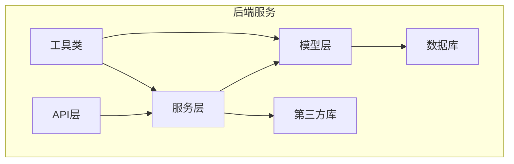
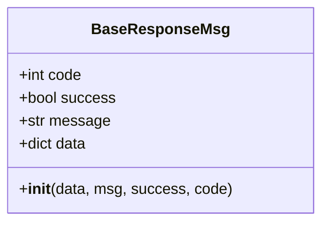
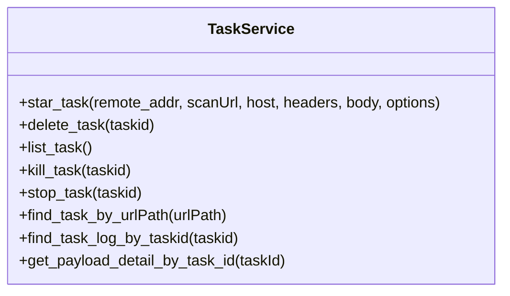
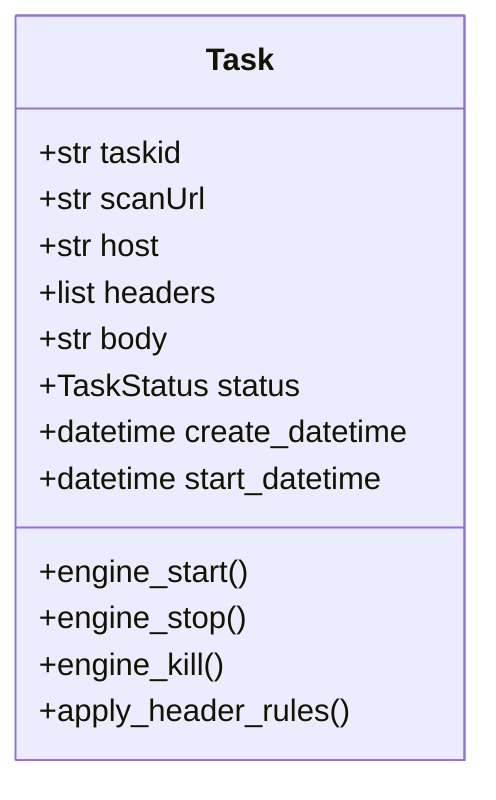
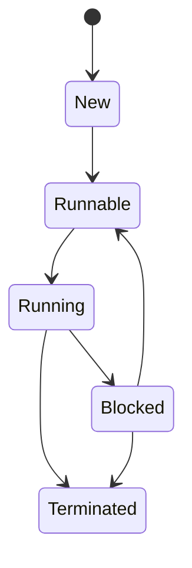
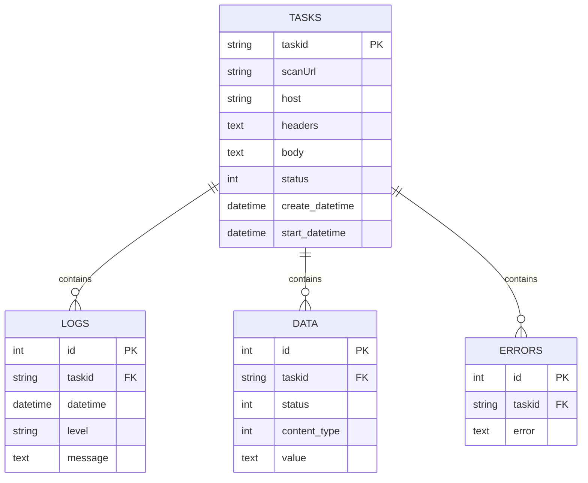
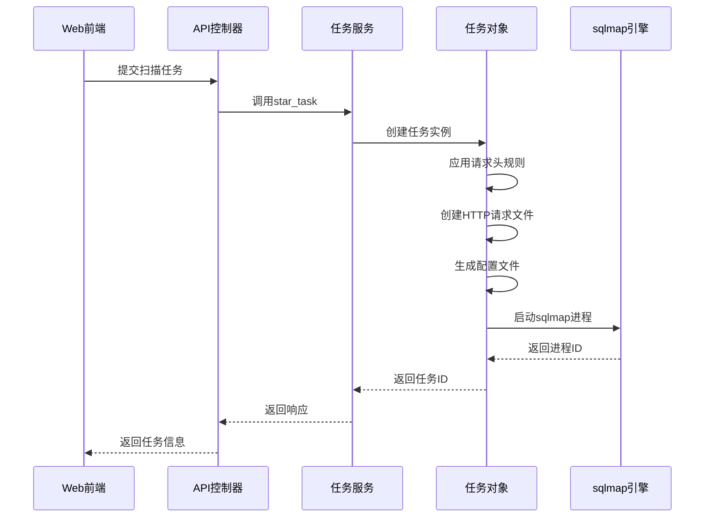
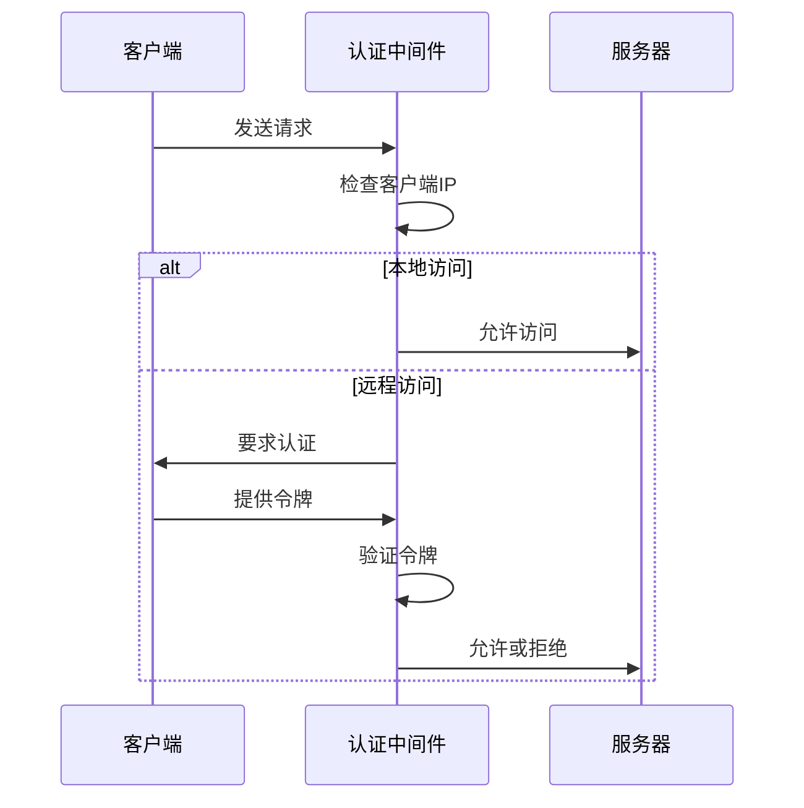
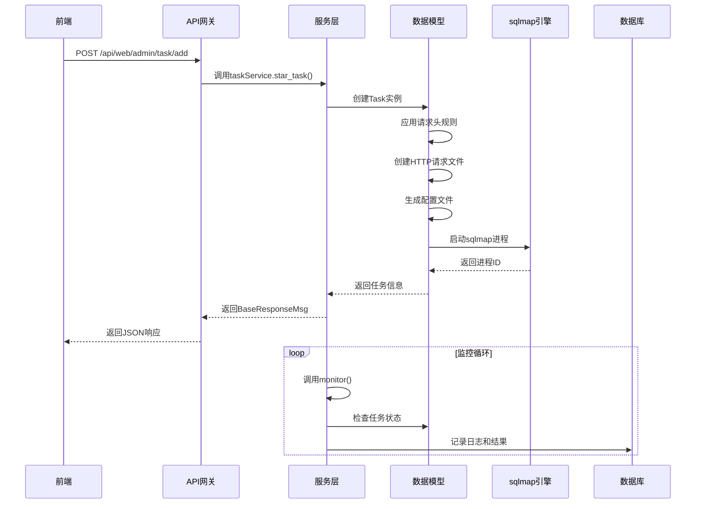
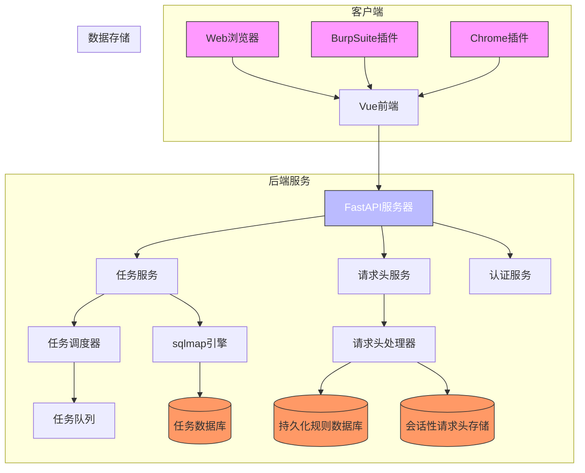

# 后端架构

<cite>
**本文档引用的文件**   
- [app.py](file://src/backEnd/app.py)
- [main.py](file://src/backEnd/main.py)
- [config.py](file://src/backEnd/config.py)
- [webTaskController.py](file://src/backEnd/api/commonApi/webTaskController.py)
- [taskService.py](file://src/backEnd/service/taskService.py)
- [DataStore.py](file://src/backEnd/model/DataStore.py)
- [Task.py](file://src/backEnd/model/Task.py)
- [Database.py](file://src/backEnd/model/Database.py)
- [BaseResponseMsg.py](file://src/backEnd/model/BaseResponseMsg.py)
- [headerController.py](file://src/backEnd/api/commonApi/headerController.py)
- [headerRuleService.py](file://src/backEnd/service/headerRuleService.py)
- [header_processor.py](file://src/backEnd/utils/header_processor.py)
- [task_monitor.py](file://src/backEnd/utils/task_monitor.py)
- [authController.py](file://src/backEnd/api/commonApi/authController.py)
- [auth.py](file://src/backEnd/utils/auth.py)
</cite>

## 目录
1. [项目结构](#项目结构)
2. [RESTful API 架构](#restful-api-架构)
3. [服务层设计](#服务层设计)
4. [数据模型与数据库](#数据模型与数据库)
5. [sqlmap引擎集成](#sqlmap引擎集成)
6. [中间件与安全](#中间件与安全)
7. [日志与监控](#日志与监控)
8. [API调用流程图](#api调用流程图)
9. [服务器架构图](#服务器架构图)

## 项目结构

sqlmapWebUI后端服务采用分层架构设计，主要分为以下几个模块：

- **api**: 包含所有RESTful API控制器，分为通用API和特定扩展API
- **model**: 定义数据模型、数据库操作和响应消息格式
- **service**: 实现核心业务逻辑的服务层
- **utils**: 工具类和辅助功能
- **third_lib**: 第三方库，包含sqlmap核心引擎



**图源**
- [app.py](file://src/backEnd/app.py#L1-L80)
- [main.py](file://src/backEnd/main.py#L1-L168)

## RESTful API 架构

后端服务基于FastAPI框架构建RESTful API，采用模块化路由设计。

### 路由定义

API路由通过`app.py`文件中的`include_router`方法注册，所有API均以`/api`为前缀：

```python
app.include_router(web_task_router, prefix="/api", tags=["web-task"])
app.include_router(auth_router, prefix="/api", tags=["auth"])
```

主要API模块包括：
- `/api/web/admin/task/add`: Web端扫描任务提交
- `/api/auth/login`: 用户认证
- `/api/commonApi/header`: 请求头管理
- `/api/version`: 版本信息
- `/api/health`: 健康检查

### 请求处理

API控制器采用标准的FastAPI依赖注入模式，例如`webTaskController.py`中的任务提交接口：

```python
@router.post('/task/add')
async def add_task_from_web(
    taskAddRequest: TaskAddRequest, 
    request: Request, 
    current_user: dict = Depends(get_current_user)
):
```

### 响应格式

统一使用`BaseResponseMsg`类作为响应格式，包含标准字段：



**图源**
- [app.py](file://src/backEnd/app.py#L1-L80)
- [webTaskController.py](file://src/backEnd/api/commonApi/webTaskController.py#L1-L91)
- [BaseResponseMsg.py](file://src/backEnd/model/BaseResponseMsg.py#L1-L21)

## 服务层设计

服务层采用分层设计模式，实现业务逻辑与API接口的分离。

### 任务服务

`taskService.py`实现了核心任务管理功能，包括：

- 任务创建与启动
- 任务状态管理
- 任务查询与删除
- 扫描结果获取



### 请求头规则服务

`headerRuleService.py`处理请求头规则的CRUD操作和应用逻辑：

- 持久化请求头规则管理
- 会话性请求头管理
- 批量操作支持
- 作用域匹配

**图源**
- [taskService.py](file://src/backEnd/service/taskService.py#L1-L535)
- [headerRuleService.py](file://src/backEnd/service/headerRuleService.py#L1-L800)

## 数据模型与数据库

### 核心数据模型

#### 任务模型

`Task`类封装了扫描任务的所有信息：



#### 状态枚举

`TaskStatus`定义了任务的生命周期状态：



### 数据库设计

使用SQLite数据库存储任务状态和结果，主要表结构：



**图源**
- [Task.py](file://src/backEnd/model/Task.py#L1-L333)
- [Database.py](file://src/backEnd/model/Database.py#L1-L99)
- [DataStore.py](file://src/backEnd/model/DataStore.py#L1-L38)

## sqlmap引擎集成

### 任务执行流程

通过`Task`类的`engine_start()`方法启动sqlmap引擎：

1. 应用请求头规则
2. 创建HTTP请求文件
3. 生成配置文件
4. 启动sqlmap进程

### 进程管理



### 任务调度

`task_monitor.py`实现任务调度器，基于APScheduler库：

- 监控任务状态
- 控制并发任务数量
- 动态调整最大任务数

```python
def monitor(max_tasks_count=None):
    with DataStore.tasks_lock:
        # 计算运行中任务数
        running_task_cnt = sum(1 for task in DataStore.tasks.values() 
                              if task.status == TaskStatus.Running)
        
        # 启动可运行任务
        for task in runnable_list:
            if running_task_cnt >= local_max_tasks_count:
                break
            task.engine_start()
            task.status = TaskStatus.Running
            running_task_cnt += 1
```

**图源**
- [Task.py](file://src/backEnd/model/Task.py#L1-L333)
- [task_monitor.py](file://src/backEnd/utils/task_monitor.py#L1-L94)
- [main.py](file://src/backEnd/main.py#L1-L168)

## 中间件与安全

### CORS配置

在`app.py`中配置跨域资源共享：

```python
app.add_middleware(
    CORSMiddleware,
    allow_origin_regex=r"http://(localhost|127\.0\.0\.1):(517[3-6]|8775)",
    allow_credentials=True,
    allow_methods=["*"],
    allow_headers=["*"]
)
```

### 认证机制

实现基于IP的简单认证：



### 异常处理

全局异常处理通过FastAPI的HTTPException实现：

```python
@router.post('/task/add')
async def add_task_from_web():
    try:
        # 业务逻辑
        return BaseResponseMsg(success=True, data=result)
    except Exception as e:
        logger.error(f"[Web] Task add error: {e}", exc_info=True)
        raise HTTPException(status_code=500, detail=f"Failed to create scan task: {str(e)}")
```

**图源**
- [app.py](file://src/backEnd/app.py#L1-L80)
- [auth.py](file://src/backEnd/utils/auth.py#L1-L23)
- [authController.py](file://src/backEnd/api/commonApi/authController.py#L1-L150)

## 日志与监控

### 日志记录

采用Python标准logging模块，配置详细日志格式：

```python
FORMATTER = logging.Formatter("[%(asctime)s] [%(levelname)s] [%(module)s] [%(filename)s] [Line: %(lineno)d] %(message)s", "%Y-%m-%d %H:%M:%S")
```

日志级别包括：
- DEBUG: 详细调试信息
- INFO: 一般信息
- WARNING: 警告信息
- ERROR: 错误信息

### 健康检查

提供健康检查端点`/api/health`：

```python
@app.get("/api/health")
def health_check():
    current_time = time.time()
    uptime = int(current_time - START_TIME)
    
    return {
        "code": 200,
        "success": True,
        "message": "success",
        "data": {
            "status": "healthy",
            "timestamp": int(current_time * 1000),
            "version": VERSION,
            "uptime": uptime
        }
    }
```

### 性能监控

通过`task_monitor`定期检查系统状态：

- CPU使用率
- 任务并发数
- 内存使用情况

**图源**
- [main.py](file://src/backEnd/main.py#L1-L168)
- [app.py](file://src/backEnd/app.py#L1-L80)
- [task_monitor.py](file://src/backEnd/utils/task_monitor.py#L1-L94)

## API调用流程图



**图源**
- [webTaskController.py](file://src/backEnd/api/commonApi/webTaskController.py#L1-L91)
- [taskService.py](file://src/backEnd/service/taskService.py#L1-L535)
- [Task.py](file://src/backEnd/model/Task.py#L1-L333)

## 服务器架构图



**图源**
- [main.py](file://src/backEnd/main.py#L1-L168)
- [app.py](file://src/backEnd/app.py#L1-L80)
- [taskService.py](file://src/backEnd/service/taskService.py#L1-L535)
- [headerRuleService.py](file://src/backEnd/service/headerRuleService.py#L1-L800)