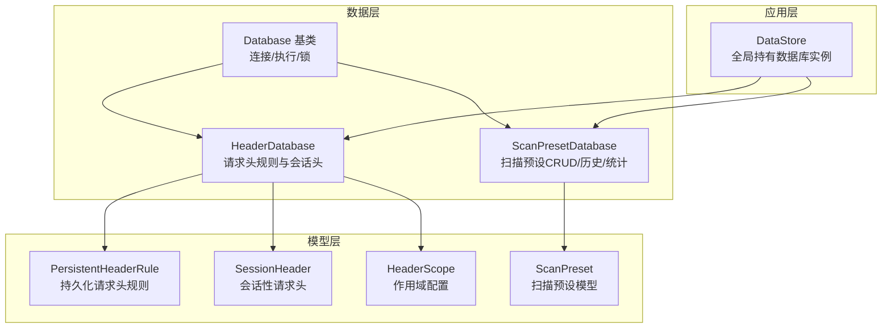
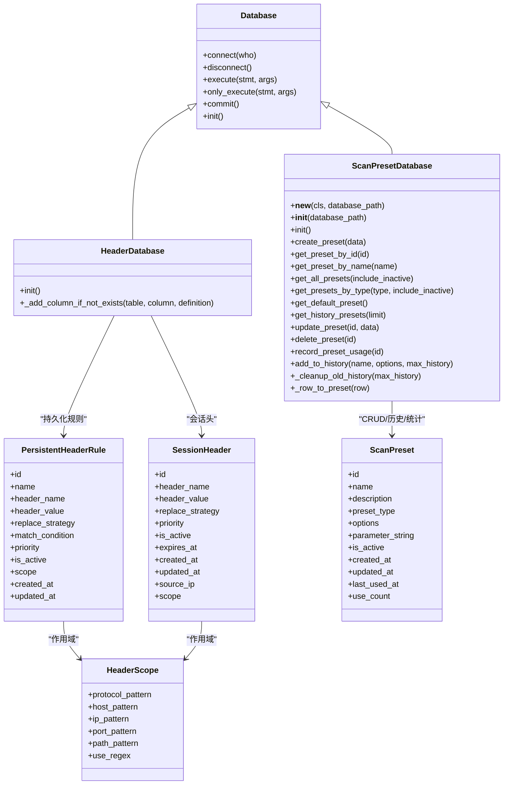
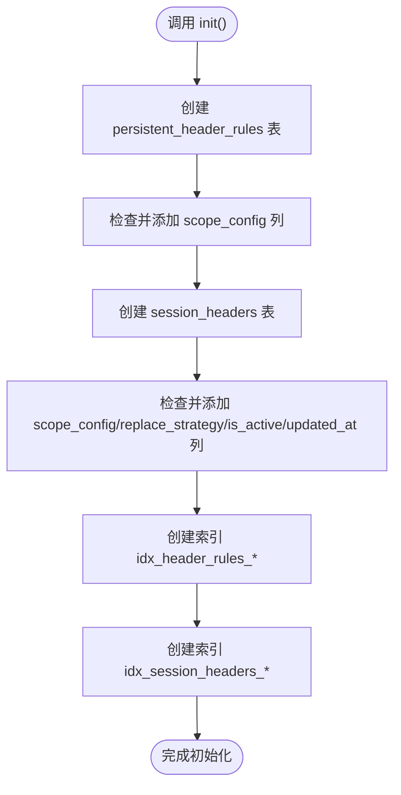
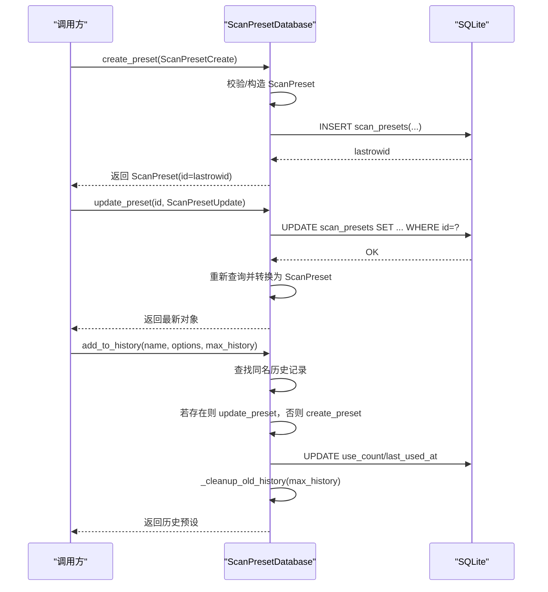
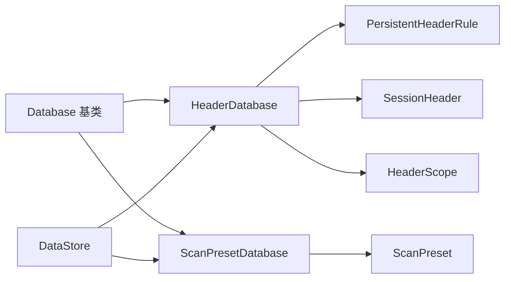
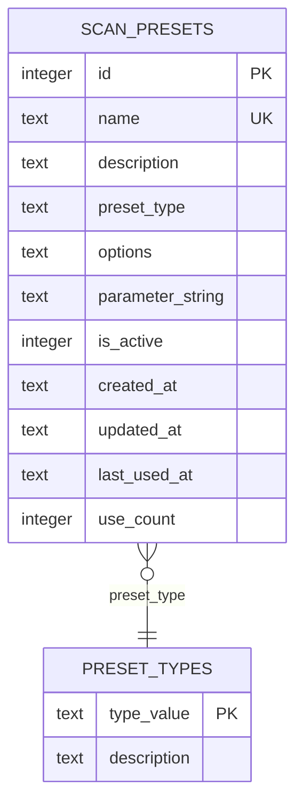

# 具体数据存储实现

<cite>
**本文引用的文件**
- [HeaderDatabase.py](file://src/backEnd/model/HeaderDatabase.py)
- [ScanPresetDatabase.py](file://src/backEnd/model/ScanPresetDatabase.py)
- [Database.py](file://src/backEnd/model/Database.py)
- [DataStore.py](file://src/backEnd/model/DataStore.py)
- [ScanPreset.py](file://src/backEnd/model/ScanPreset.py)
- [PersistentHeaderRule.py](file://src/backEnd/model/PersistentHeaderRule.py)
- [SessionHeader.py](file://src/backEnd/model/SessionHeader.py)
- [HeaderScope.py](file://src/backEnd/model/HeaderScope.py)
</cite>

## 目录
1. [简介](#简介)
2. [项目结构](#项目结构)
3. [核心组件](#核心组件)
4. [架构总览](#架构总览)
5. [详细组件分析](#详细组件分析)
6. [依赖分析](#依赖分析)
7. [性能考量](#性能考量)
8. [故障排查指南](#故障排查指南)
9. [结论](#结论)
10. [附录](#附录)

## 简介
本文件聚焦于两个具体的数据访问对象：HeaderDatabase 和 ScanPresetDatabase 的设计与实现，涵盖：
- HeaderDatabase 如何管理持久化请求头规则与会话性请求头，init() 中创建的 persistent_header_rules 与 session_headers 表结构、字段含义、约束与索引设计，以及数据库版本迁移中的列添加机制。
- ScanPresetDatabase 的单例模式实现（__new__ 与延迟初始化）、扫描配置预设的 CRUD 操作（create_preset、get_preset_by_id、update_preset、delete_preset），历史记录管理（add_to_history、_cleanup_old_history），使用统计（record_preset_usage）与默认预设初始化流程。

## 项目结构
与数据存储相关的核心文件组织如下：
- 数据库基类：Database.py
- 请求头数据库：HeaderDatabase.py
- 扫描预设数据库：ScanPresetDatabase.py
- 预设模型：ScanPreset.py
- 请求头规则模型：PersistentHeaderRule.py、SessionHeader.py、HeaderScope.py
- 全局数据存储容器：DataStore.py

图表来源
- [Database.py](file://src/backEnd/model/Database.py#L1-L99)
- [HeaderDatabase.py](file://src/backEnd/model/HeaderDatabase.py#L1-L126)
- [ScanPresetDatabase.py](file://src/backEnd/model/ScanPresetDatabase.py#L1-L514)
- [PersistentHeaderRule.py](file://src/backEnd/model/PersistentHeaderRule.py#L1-L104)
- [SessionHeader.py](file://src/backEnd/model/SessionHeader.py#L1-L97)
- [HeaderScope.py](file://src/backEnd/model/HeaderScope.py#L1-L187)
- [DataStore.py](file://src/backEnd/model/DataStore.py#L1-L38)

章节来源
- [Database.py](file://src/backEnd/model/Database.py#L1-L99)
- [HeaderDatabase.py](file://src/backEnd/model/HeaderDatabase.py#L1-L126)
- [ScanPresetDatabase.py](file://src/backEnd/model/ScanPresetDatabase.py#L1-L514)
- [DataStore.py](file://src/backEnd/model/DataStore.py#L1-L38)

## 核心组件
- HeaderDatabase：负责请求头规则与会话性请求头的持久化存储，提供初始化、列迁移与索引维护能力。
- ScanPresetDatabase：负责扫描配置预设的持久化存储，提供单例模式、CRUD、历史记录与使用统计，并在初始化时创建默认预设。

章节来源
- [HeaderDatabase.py](file://src/backEnd/model/HeaderDatabase.py#L1-L126)
- [ScanPresetDatabase.py](file://src/backEnd/model/ScanPresetDatabase.py#L1-L514)

## 架构总览
下图展示了两类数据库对象与其模型的关系，以及全局 DataStore 的持有关系。

图表来源
- [Database.py](file://src/backEnd/model/Database.py#L1-L99)
- [HeaderDatabase.py](file://src/backEnd/model/HeaderDatabase.py#L1-L126)
- [ScanPresetDatabase.py](file://src/backEnd/model/ScanPresetDatabase.py#L1-L514)
- [PersistentHeaderRule.py](file://src/backEnd/model/PersistentHeaderRule.py#L1-L104)
- [SessionHeader.py](file://src/backEnd/model/SessionHeader.py#L1-L97)
- [HeaderScope.py](file://src/backEnd/model/HeaderScope.py#L1-L187)
- [ScanPreset.py](file://src/backEnd/model/ScanPreset.py#L1-L231)

## 详细组件分析

### HeaderDatabase 组件分析
- 设计定位：独立的请求头管理数据库，负责持久化请求头规则与会话性请求头的存储与查询。
- 初始化流程（init）：
  - 创建 persistent_header_rules 表，包含规则名称、请求头键值、替换策略、匹配条件、优先级、启用状态、作用域配置、时间戳等字段；并建立索引以提升查询性能。
  - 创建 session_headers 表，包含客户端IP、请求头键值、替换策略、优先级、启用状态、作用域配置、过期时间、时间戳等字段；并建立索引。
  - 使用 _add_column_if_not_exists() 方法进行列迁移，确保新增字段（如 scope_config、replace_strategy、is_active、updated_at）在旧版本数据库中也能被安全添加。
- 数据库版本迁移：
  - _add_column_if_not_exists(table, column, definition)：通过 PRAGMA table_info 查询表结构，若列不存在则执行 ALTER TABLE 添加列，日志记录添加过程与异常。
- 表结构与字段说明（来自 init 中的 SQL 定义与迁移逻辑）：
  - persistent_header_rules
    - id：自增主键
    - name：规则名称，唯一
    - header_name：请求头键
    - header_value：请求头值
    - replace_strategy：替换策略，默认 REPLACE
    - match_condition：可选匹配条件
    - priority：优先级，默认 0
    - is_active：启用状态，默认 1
    - scope_config：可选作用域配置（JSON 字符串）
    - created_at、updated_at：时间戳
    - 索引：按 is_active、priority、header_name
  - session_headers
    - id：自增主键
    - client_ip：客户端IP
    - header_name：请求头键
    - header_value：请求头值
    - replace_strategy：替换策略，默认 REPLACE
    - priority：优先级，默认 0
    - is_active：启用状态，默认 1
    - scope_config：可选作用域配置（JSON 字符串）
    - expires_at：过期时间
    - created_at、updated_at：时间戳
    - 索引：按 client_ip、expires_at
    - 唯一约束：client_ip + header_name
- 锁与并发：
  - 继承自 Database，使用线程锁保护执行，自动重试“locked”错误，保证 SQLite 并发安全。

图表来源
- [HeaderDatabase.py](file://src/backEnd/model/HeaderDatabase.py#L26-L102)

章节来源
- [HeaderDatabase.py](file://src/backEnd/model/HeaderDatabase.py#L1-L126)
- [Database.py](file://src/backEnd/model/Database.py#L1-L99)

### ScanPresetDatabase 组件分析
- 单例模式与延迟初始化：
  - __new__(cls, database_path)：实现单例，首次调用时创建实例并标记未初始化。
  - __init__(self, database_path)：若未初始化则设置数据库路径、连接数据库并标记已初始化，避免重复初始化。
  - init()：创建 scan_presets 表，添加 parameter_string 列（迁移），建立索引，初始化默认预设。
- 表结构与字段说明（来自 init 中的 SQL 定义与迁移逻辑）：
  - scan_presets
    - id：自增主键
    - name：预设名称，唯一
    - description：描述
    - preset_type：预设类型，默认 preset
    - options：JSON 存储的扫描选项
    - parameter_string：命令行参数字符串（与 BurpSuite 兼容）
    - is_active：启用状态，默认 1
    - created_at、updated_at：时间戳
    - last_used_at：最后使用时间
    - use_count：使用次数，默认 0
    - 索引：按 preset_type、is_active、name
- CRUD 操作：
  - create_preset(data)：校验并构造 ScanPreset，插入数据库，返回带 id 的对象。
  - get_preset_by_id(id) / get_preset_by_name(name)：按 id 或 name 查询，转换为 ScanPreset。
  - get_all_presets(include_inactive)/get_presets_by_type(type, include_inactive)：支持过滤启用状态与按类型排序。
  - update_preset(id, data)：动态构建更新字段，更新时间戳，返回最新对象。
  - delete_preset(id)：禁止删除默认预设，其余删除成功返回真。
- 历史记录与使用统计：
  - add_to_history(name, options, max_history)：若同名历史记录存在则更新，否则新建；记录使用次数并清理超出上限的历史记录。
  - _cleanup_old_history(max_history)：保留最近使用的若干条历史记录，删除超出数量的部分。
  - record_preset_usage(id)：递增 use_count 并更新 last_used_at。
- 默认预设初始化：
  - _init_default_presets()：若无默认预设则创建默认、快速、深度、安全四种预设并插入数据库。
- 行转对象：
  - _row_to_preset(row)：将数据库行转换为 ScanPreset，安全处理 JSON、布尔、时间与数值字段。

图表来源
- [ScanPresetDatabase.py](file://src/backEnd/model/ScanPresetDatabase.py#L156-L408)

章节来源
- [ScanPresetDatabase.py](file://src/backEnd/model/ScanPresetDatabase.py#L1-L514)
- [ScanPreset.py](file://src/backEnd/model/ScanPreset.py#L1-L231)

### 数据模型与作用域
- PersistentHeaderRule：持久化请求头规则，支持替换策略、优先级、启用状态、可选作用域配置（HeaderScope）与时间戳。
- SessionHeader：会话性请求头，支持 TTL 控制过期时间、替换策略、优先级、启用状态、来源 IP 与作用域配置。
- HeaderScope：多维匹配的作用域配置，支持协议、主机名、IP、端口、路径与正则开关，空配置表示全局生效。

章节来源
- [PersistentHeaderRule.py](file://src/backEnd/model/PersistentHeaderRule.py#L1-L104)
- [SessionHeader.py](file://src/backEnd/model/SessionHeader.py#L1-L97)
- [HeaderScope.py](file://src/backEnd/model/HeaderScope.py#L1-L187)

## 依赖分析
- HeaderDatabase 与 ScanPresetDatabase 均继承自 Database，共享连接、执行、锁与重试机制。
- HeaderDatabase 依赖 PersistentHeaderRule 与 SessionHeader 的模型定义，用于规则与会话头的序列化/反序列化。
- ScanPresetDatabase 依赖 ScanPreset 模型与预定义工厂函数（默认/快速/深度/安全预设）。
- DataStore 提供全局持有 HeaderDatabase 与 ScanPresetDatabase 的能力，便于应用层统一访问。

图表来源
- [Database.py](file://src/backEnd/model/Database.py#L1-L99)
- [HeaderDatabase.py](file://src/backEnd/model/HeaderDatabase.py#L1-L126)
- [ScanPresetDatabase.py](file://src/backEnd/model/ScanPresetDatabase.py#L1-L514)
- [PersistentHeaderRule.py](file://src/backEnd/model/PersistentHeaderRule.py#L1-L104)
- [SessionHeader.py](file://src/backEnd/model/SessionHeader.py#L1-L97)
- [HeaderScope.py](file://src/backEnd/model/HeaderScope.py#L1-L187)
- [ScanPreset.py](file://src/backEnd/model/ScanPreset.py#L1-L231)
- [DataStore.py](file://src/backEnd/model/DataStore.py#L1-L38)

章节来源
- [DataStore.py](file://src/backEnd/model/DataStore.py#L1-L38)

## 性能考量
- 索引设计：
  - HeaderDatabase 在 persistent_header_rules 上建立按 is_active、priority、header_name 的索引；在 session_headers 上建立按 client_ip、expires_at 的索引，有助于高频查询与清理。
- 并发与锁：
  - Database 使用线程锁与“locked”重试机制，降低 SQLite 并发写入冲突。
- 查询优化：
  - ScanPresetDatabase 的查询使用明确的索引列（preset_type、is_active、name）进行过滤与排序，减少全表扫描。
- 数据迁移：
  - 通过 _add_column_if_not_exists() 与 _migrate_add_parameter_string_column() 实现平滑升级，避免强制重建表。

[本节为通用建议，无需列出具体文件来源]

## 故障排查指南
- 初始化失败或列缺失：
  - 检查 HeaderDatabase.init() 与 ScanPresetDatabase.init() 的日志输出，确认是否触发了列迁移逻辑。
  - 若出现“locked”异常，确认 Database 的重试机制是否正常工作。
- 数据库路径问题：
  - HeaderDatabase 与 ScanPresetDatabase 均会在未指定路径时使用项目根目录下的 headers.db 与 scan_presets.db，请确认文件权限与路径正确。
- 历史记录清理异常：
  - 检查 _cleanup_old_history() 的 SQL 语句与参数绑定，确认 preset_type 与 LIMIT 参数正确。
- 预设删除受限：
  - 默认预设不可删除，这是设计上的保护措施，避免误删系统默认配置。

章节来源
- [HeaderDatabase.py](file://src/backEnd/model/HeaderDatabase.py#L103-L126)
- [ScanPresetDatabase.py](file://src/backEnd/model/ScanPresetDatabase.py#L350-L432)
- [Database.py](file://src/backEnd/model/Database.py#L35-L71)

## 结论
- HeaderDatabase 通过清晰的表结构与索引设计，有效支撑持久化请求头规则与会话性请求头的管理，并通过列迁移机制保障数据库演进的平滑性。
- ScanPresetDatabase 采用单例与延迟初始化，提供完整的 CRUD、历史记录与使用统计能力，并内置默认预设初始化，满足日常扫描配置的快速使用需求。
- 两者均基于 Database 基类提供的并发安全与执行封装，确保在高并发场景下的稳定性。

[本节为总结性内容，无需列出具体文件来源]

## 附录

### 表结构 ER 图
以下 ER 图展示 scan_presets 表与其他相关实体的关系（基于模型定义与数据库初始化逻辑）。

图表来源
- [ScanPresetDatabase.py](file://src/backEnd/model/ScanPresetDatabase.py#L54-L84)
- [ScanPreset.py](file://src/backEnd/model/ScanPreset.py#L12-L23)

### 关键实现路径参考
- HeaderDatabase 初始化与列迁移
  - [init()](file://src/backEnd/model/HeaderDatabase.py#L26-L102)
  - [_add_column_if_not_exists()](file://src/backEnd/model/HeaderDatabase.py#L103-L126)
- ScanPresetDatabase 单例与延迟初始化
  - [__new__()](file://src/backEnd/model/ScanPresetDatabase.py#L30-L34)
  - [__init__()](file://src/backEnd/model/ScanPresetDatabase.py#L36-L53)
  - [init()](file://src/backEnd/model/ScanPresetDatabase.py#L54-L84)
- CRUD 与历史记录
  - [create_preset()](file://src/backEnd/model/ScanPresetDatabase.py#L156-L182)
  - [get_preset_by_id()](file://src/backEnd/model/ScanPresetDatabase.py#L183-L199)
  - [update_preset()](file://src/backEnd/model/ScanPresetDatabase.py#L297-L349)
  - [delete_preset()](file://src/backEnd/model/ScanPresetDatabase.py#L350-L365)
  - [add_to_history()](file://src/backEnd/model/ScanPresetDatabase.py#L377-L408)
  - [_cleanup_old_history()](file://src/backEnd/model/ScanPresetDatabase.py#L409-L432)
  - [record_preset_usage()](file://src/backEnd/model/ScanPresetDatabase.py#L366-L376)
- 默认预设初始化
  - [_init_default_presets()](file://src/backEnd/model/ScanPresetDatabase.py#L99-L127)
  - [预定义工厂函数](file://src/backEnd/model/ScanPreset.py#L170-L231)