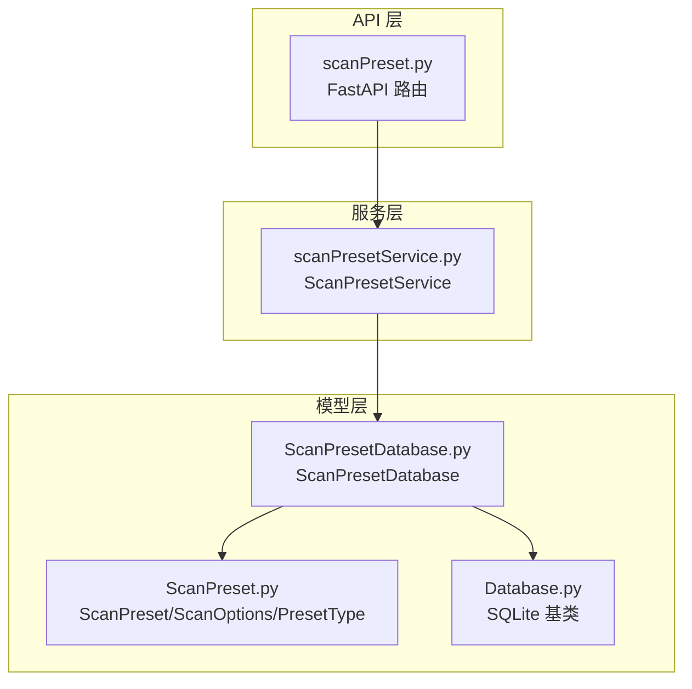
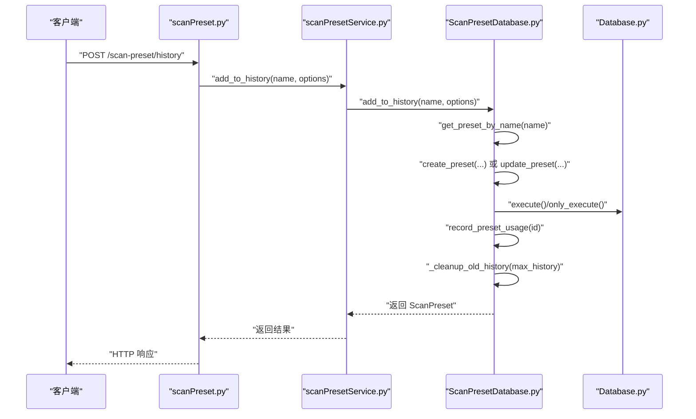
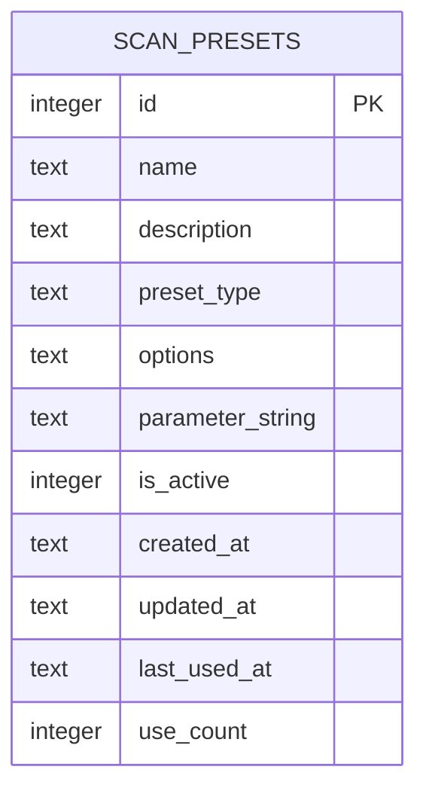
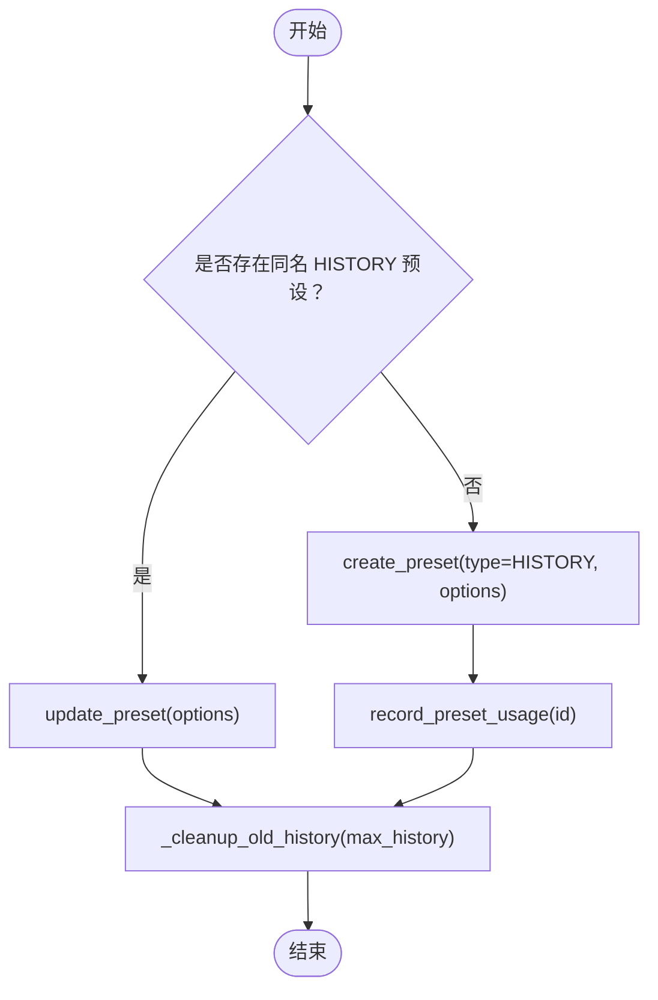
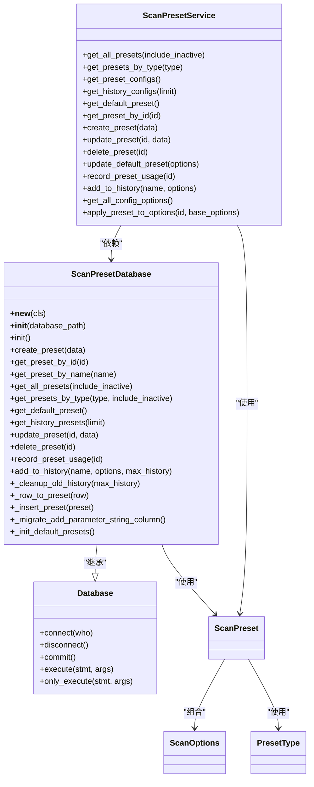

# 扫描配置数据库

<cite>
**本文引用的文件**
- [ScanPresetDatabase.py](file://src/backEnd/model/ScanPresetDatabase.py)
- [ScanPreset.py](file://src/backEnd/model/ScanPreset.py)
- [Database.py](file://src/backEnd/model/Database.py)
- [scanPresetService.py](file://src/backEnd/service/scanPresetService.py)
- [scanPreset.py](file://src/backEnd/api/commonApi/scanPreset.py)
</cite>

## 目录
1. [简介](#简介)
2. [项目结构](#项目结构)
3. [核心组件](#核心组件)
4. [架构总览](#架构总览)
5. [详细组件分析](#详细组件分析)
6. [依赖关系分析](#依赖关系分析)
7. [性能考量](#性能考量)
8. [故障排查指南](#故障排查指南)
9. [结论](#结论)
10. [附录](#附录)

## 简介
本文件聚焦于扫描配置数据库模块，系统性梳理 ScanPresetDatabase 类的设计与实现，涵盖：
- 单例模式与延迟初始化机制（__new__ 与 _instance/_initialized 的作用）
- 扫描配置预设的 CRUD 操作（create_preset、get_preset_by_id、update_preset、delete_preset）的 SQL 构造、参数绑定与异常处理
- 历史记录管理（add_to_history、_cleanup_old_history）按时间排序保留最近 N 条记录的策略
- 使用统计（record_preset_usage）对 preset_usage_count 字段的更新逻辑
- 数据库表结构图，展示 presets、preset_history 和 preset_usage 的关系

## 项目结构
该模块位于后端 Python 代码中，采用分层设计：
- API 层：提供 REST 接口，负责请求解析与响应封装
- 服务层：封装业务逻辑，协调数据库访问
- 模型层：定义数据模型与数据库访问类
- 数据库基类：提供 SQLite 连接、并发锁与执行封装

图表来源
- [scanPreset.py](file://src/backEnd/api/commonApi/scanPreset.py#L1-L325)
- [scanPresetService.py](file://src/backEnd/service/scanPresetService.py#L1-L182)
- [ScanPresetDatabase.py](file://src/backEnd/model/ScanPresetDatabase.py#L1-L514)
- [Database.py](file://src/backEnd/model/Database.py#L1-L99)
- [ScanPreset.py](file://src/backEnd/model/ScanPreset.py#L1-L231)

章节来源
- [scanPreset.py](file://src/backEnd/api/commonApi/scanPreset.py#L1-L325)
- [scanPresetService.py](file://src/backEnd/service/scanPresetService.py#L1-L182)
- [ScanPresetDatabase.py](file://src/backEnd/model/ScanPresetDatabase.py#L1-L514)
- [Database.py](file://src/backEnd/model/Database.py#L1-L99)
- [ScanPreset.py](file://src/backEnd/model/ScanPreset.py#L1-L231)

## 核心组件
- ScanPresetDatabase：继承自 Database，负责扫描配置预设的持久化，包含单例、延迟初始化、CRUD、历史记录与使用统计等能力
- ScanPreset/ScanOptions/PresetType：定义预设的数据结构、枚举类型与序列化行为
- ScanPresetService：服务层封装，协调 API 与数据库层，提供业务规则与校验
- Database：SQLite 基类，提供连接、并发锁、执行与只读游标封装

章节来源
- [ScanPresetDatabase.py](file://src/backEnd/model/ScanPresetDatabase.py#L1-L514)
- [ScanPreset.py](file://src/backEnd/model/ScanPreset.py#L1-L231)
- [scanPresetService.py](file://src/backEnd/service/scanPresetService.py#L1-L182)
- [Database.py](file://src/backEnd/model/Database.py#L1-L99)

## 架构总览
从调用链看，API 层接收请求，服务层进行业务校验与合并，数据库层完成数据持久化与查询。

图表来源
- [scanPreset.py](file://src/backEnd/api/commonApi/scanPreset.py#L270-L298)
- [scanPresetService.py](file://src/backEnd/service/scanPresetService.py#L130-L137)
- [ScanPresetDatabase.py](file://src/backEnd/model/ScanPresetDatabase.py#L377-L408)
- [Database.py](file://src/backEnd/model/Database.py#L35-L71)

## 详细组件分析

### 单例模式与延迟初始化
- 单例实现
  - 使用类变量 _instance 存储唯一实例；__new__ 在首次调用时创建实例并设置 _initialized=False
  - __init__ 中通过 _initialized 避免重复初始化
- 延迟初始化
  - get_scan_preset_db() 在首次调用时创建实例并执行 init()，完成表初始化、索引创建与默认预设初始化
- 关键点
  - _instance：保存类的唯一实例
  - _initialized：标记实例是否已完成初始化，避免重复初始化

章节来源
- [ScanPresetDatabase.py](file://src/backEnd/model/ScanPresetDatabase.py#L25-L53)
- [ScanPresetDatabase.py](file://src/backEnd/model/ScanPresetDatabase.py#L507-L514)

### 数据库表结构与关系
- 表：scan_presets
  - 字段：id、name、description、preset_type、options、parameter_string、is_active、created_at、updated_at、last_used_at、use_count
  - 索引：按 preset_type、is_active、name 建立索引
- 预设类型
  - DEFAULT：系统默认配置
  - PRESET：常用配置
  - HISTORY：历史配置
- 关系
  - HISTORY 类型的记录用于保存用户历史使用过的配置快照
  - 使用统计字段 use_count 与 last_used_at 用于排序与清理

图表来源
- [ScanPresetDatabase.py](file://src/backEnd/model/ScanPresetDatabase.py#L57-L71)
- [ScanPreset.py](file://src/backEnd/model/ScanPreset.py#L12-L17)

章节来源
- [ScanPresetDatabase.py](file://src/backEnd/model/ScanPresetDatabase.py#L57-L84)
- [ScanPreset.py](file://src/backEnd/model/ScanPreset.py#L12-L17)

### CRUD 操作实现细节

#### create_preset
- 流程
  - 校验输入 options 并构建 ScanOptions
  - 构造 ScanPreset，填充时间戳与默认字段
  - 调用 _insert_preset 插入数据库
  - 返回新创建的 ScanPreset
- SQL 与参数
  - INSERT 语句包含 name、description、preset_type、options、parameter_string、is_active、created_at、updated_at、use_count
  - 参数绑定顺序与列顺序一致
- 异常处理
  - 捕获异常并记录错误日志，返回 None

章节来源
- [ScanPresetDatabase.py](file://src/backEnd/model/ScanPresetDatabase.py#L156-L182)
- [ScanPresetDatabase.py](file://src/backEnd/model/ScanPresetDatabase.py#L128-L151)

#### get_preset_by_id / get_preset_by_name / get_all_presets / get_presets_by_type / get_default_preset / get_history_presets
- 查询策略
  - 使用 only_execute 获取游标，再 fetchone()/fetchall() 读取结果
  - _row_to_preset 将行转为 ScanPreset 对象，包含 JSON 解析与字段类型安全转换
- 排序与过滤
  - get_all_presets/get_presets_by_type：支持按 use_count 降序与 name 排序
  - get_history_presets：按 last_used_at 降序并限制数量
- 异常处理
  - 捕获异常并记录错误日志，返回空集合或 None

章节来源
- [ScanPresetDatabase.py](file://src/backEnd/model/ScanPresetDatabase.py#L183-L216)
- [ScanPresetDatabase.py](file://src/backEnd/model/ScanPresetDatabase.py#L217-L268)
- [ScanPresetDatabase.py](file://src/backEnd/model/ScanPresetDatabase.py#L269-L296)
- [ScanPresetDatabase.py](file://src/backEnd/model/ScanPresetDatabase.py#L433-L501)

#### update_preset
- 流程
  - 读取现有预设，若不存在返回 None
  - 动态构建更新字段列表与参数列表（name/description/options/parameter_string/is_active）
  - 统一追加 updated_at
  - 执行 UPDATE 语句并返回最新预设
- 异常处理
  - 捕获异常并记录错误日志，返回 None

章节来源
- [ScanPresetDatabase.py](file://src/backEnd/model/ScanPresetDatabase.py#L297-L349)

#### delete_preset
- 限制
  - 不允许删除 DEFAULT 类型的预设
- 异常处理
  - 捕获异常并记录错误日志，返回 False

章节来源
- [ScanPresetDatabase.py](file://src/backEnd/model/ScanPresetDatabase.py#L350-L365)

### 历史记录管理
- add_to_history
  - 若存在同名 HISTORY 预设，则更新其 options
  - 否则创建新的 HISTORY 预设，并记录使用（use_count+1、last_used_at）
  - 调用 _cleanup_old_history 保留最近 N 条记录
- _cleanup_old_history
  - 按 last_used_at 降序取前 N 名 ID
  - 使用 NOT IN 删除超出保留范围的历史记录

图表来源
- [ScanPresetDatabase.py](file://src/backEnd/model/ScanPresetDatabase.py#L377-L408)
- [ScanPresetDatabase.py](file://src/backEnd/model/ScanPresetDatabase.py#L409-L432)

章节来源
- [ScanPresetDatabase.py](file://src/backEnd/model/ScanPresetDatabase.py#L377-L432)

### 使用统计
- record_preset_usage
  - 将 use_count 自增 1，并更新 last_used_at 为当前时间
  - 用于排序与清理策略

章节来源
- [ScanPresetDatabase.py](file://src/backEnd/model/ScanPresetDatabase.py#L366-L376)

### 数据库初始化与迁移
- init
  - 创建 scan_presets 表，含唯一约束 name、默认字段、时间戳与计数字段
  - 建立索引：preset_type、is_active、name
  - 初始化默认预设（DEFAULT/QUICK/DEEP/SAFE）
- 迁移
  - _migrate_add_parameter_string_column：检查并添加 parameter_string 列

章节来源
- [ScanPresetDatabase.py](file://src/backEnd/model/ScanPresetDatabase.py#L54-L84)
- [ScanPresetDatabase.py](file://src/backEnd/model/ScanPresetDatabase.py#L86-L98)

### 服务层与 API 层协作
- 服务层
  - 提供业务规则：名称唯一性、默认预设不可删除、默认预设名称不可变更等
  - 统一调用数据库层方法
- API 层
  - FastAPI 路由定义，统一响应封装 BaseResponseMsg
  - apply_preset 接口在应用预设后记录使用

章节来源
- [scanPresetService.py](file://src/backEnd/service/scanPresetService.py#L1-L182)
- [scanPreset.py](file://src/backEnd/api/commonApi/scanPreset.py#L1-L325)

## 依赖关系分析

图表来源
- [Database.py](file://src/backEnd/model/Database.py#L1-L99)
- [ScanPresetDatabase.py](file://src/backEnd/model/ScanPresetDatabase.py#L1-L514)
- [scanPresetService.py](file://src/backEnd/service/scanPresetService.py#L1-L182)
- [ScanPreset.py](file://src/backEnd/model/ScanPreset.py#L1-L231)

章节来源
- [Database.py](file://src/backEnd/model/Database.py#L1-L99)
- [ScanPresetDatabase.py](file://src/backEnd/model/ScanPresetDatabase.py#L1-L514)
- [scanPresetService.py](file://src/backEnd/service/scanPresetService.py#L1-L182)
- [ScanPreset.py](file://src/backEnd/model/ScanPreset.py#L1-L231)

## 性能考量
- 并发与锁
  - Database.execute/only_execute 使用线程锁与重试机制，避免数据库锁定导致的 OperationalError
- 索引
  - 为 preset_type、is_active、name 建立索引，提升查询性能
- 查询优化
  - 使用 only_execute 获取游标，减少不必要的 fetchall
  - 历史记录清理采用 LIMIT 与 NOT IN，控制删除范围
- JSON 序列化
  - options 字段以 JSON 文本存储，避免复杂关系表设计，便于扩展但需注意查询条件限制

[本节为通用性能建议，无需特定文件引用]

## 故障排查指南
- 数据库锁定
  - 若出现 OperationalError 锁定，Database 层会自动重试；如持续失败，检查并发写入量与事务粒度
- 历史记录清理失败
  - 检查 _cleanup_old_history 的 SQL 构造与参数绑定，确认类型与占位符数量一致
- 默认预设不可删除
  - 删除接口会拒绝 DEFAULT 类型预设；请先切换默认配置或创建新默认预设
- 预设名称冲突
  - 创建/更新时若名称已存在，服务层会拒绝并记录警告

章节来源
- [Database.py](file://src/backEnd/model/Database.py#L35-L71)
- [ScanPresetDatabase.py](file://src/backEnd/model/ScanPresetDatabase.py#L350-L365)
- [scanPresetService.py](file://src/backEnd/service/scanPresetService.py#L76-L105)

## 结论
ScanPresetDatabase 通过单例与延迟初始化确保资源可控，结合 SQLite 基类提供的并发安全与执行封装，实现了扫描配置预设的完整生命周期管理。历史记录与使用统计功能完善，配合服务层的业务规则，保证了系统的可用性与一致性。建议在高并发场景下关注数据库锁重试与索引策略，同时对 options 字段的查询与更新保持谨慎。

[本节为总结性内容，无需特定文件引用]

## 附录

### API 端点概览（与扫描配置数据库相关）
- GET /scan-preset/list：获取所有预设（含默认、常用、历史）
- GET /scan-preset/config-options：获取默认、常用、历史三类配置
- GET /scan-preset/default：获取默认配置
- PUT /scan-preset/default：更新默认配置
- GET /scan-preset/presets：获取常用配置列表
- GET /scan-preset/history：获取历史配置列表（支持 limit）
- GET /scan-preset/{preset_id}：按 ID 获取预设
- POST /scan-preset：创建新预设
- PUT /scan-preset/{preset_id}：更新预设
- DELETE /scan-preset/{preset_id}：删除预设
- POST /scan-preset/history：添加到历史记录
- POST /scan-preset/{preset_id}/apply：应用预设并返回合并后的选项

章节来源
- [scanPreset.py](file://src/backEnd/api/commonApi/scanPreset.py#L23-L325)