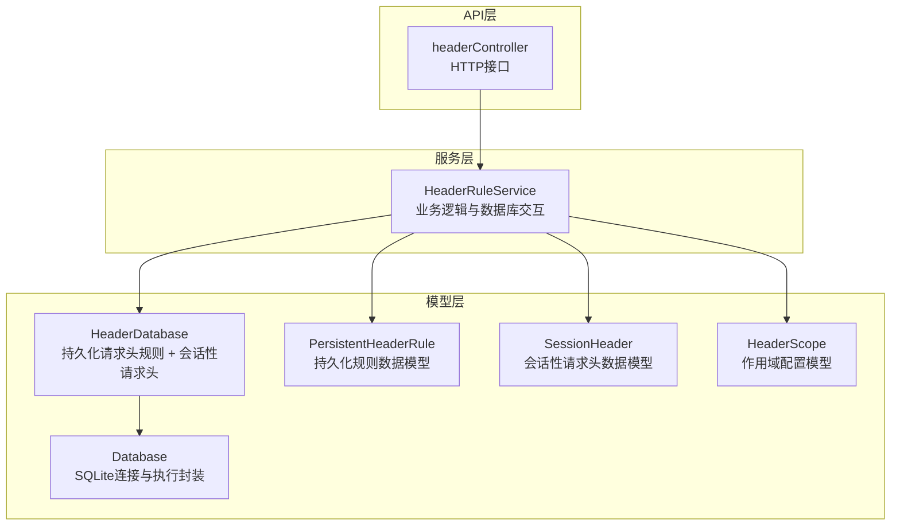
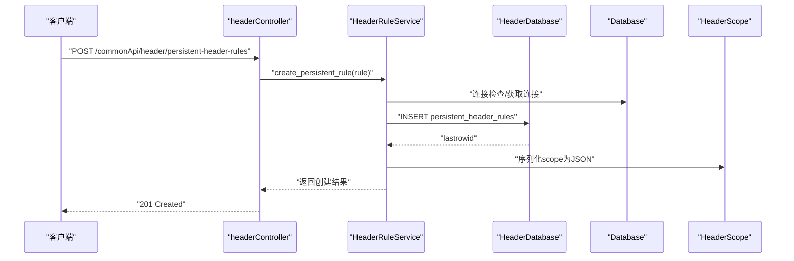
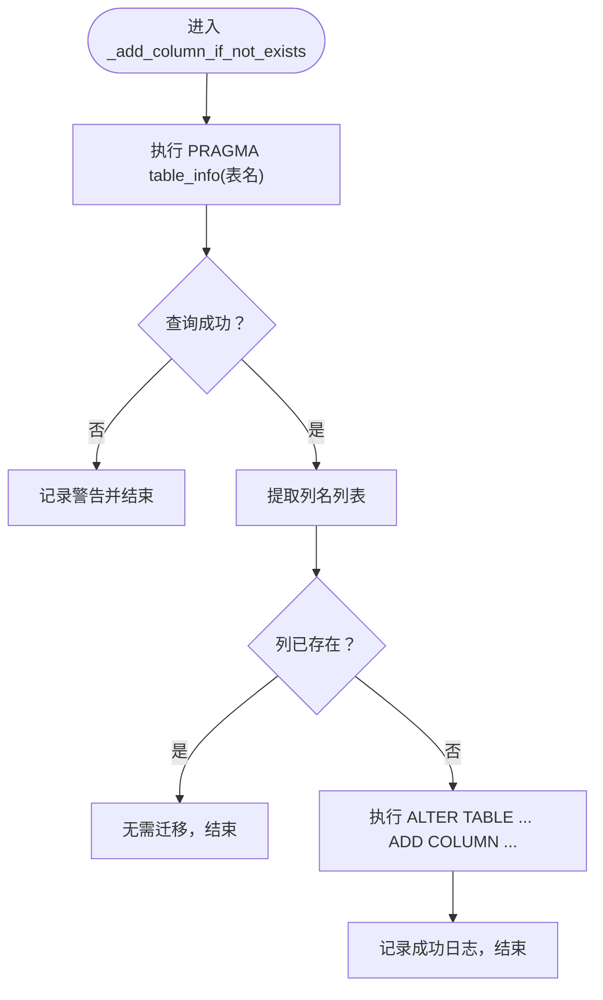
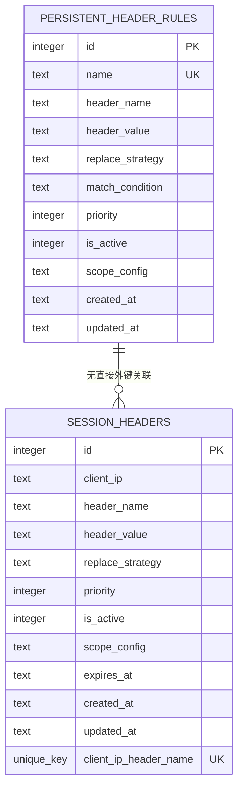
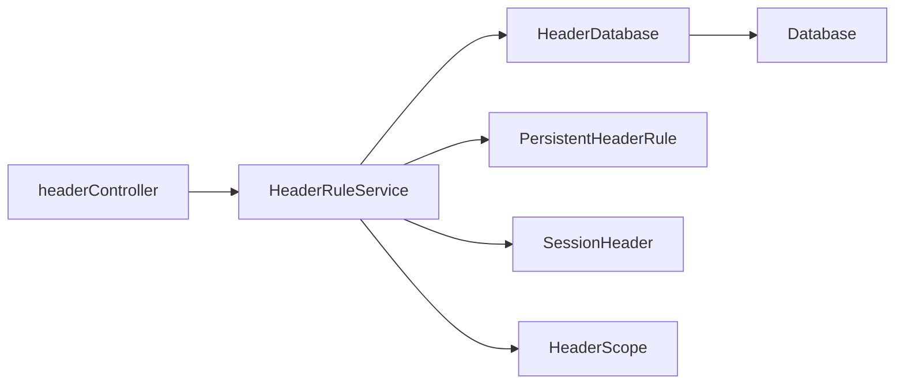

# 请求头数据库

<cite>
**本文引用的文件**
- [HeaderDatabase.py](file://src/backEnd/model/HeaderDatabase.py)
- [Database.py](file://src/backEnd/model/Database.py)
- [PersistentHeaderRule.py](file://src/backEnd/model/PersistentHeaderRule.py)
- [SessionHeader.py](file://src/backEnd/model/SessionHeader.py)
- [HeaderScope.py](file://src/backEnd/model/HeaderScope.py)
- [headerController.py](file://src/backEnd/api/commonApi/headerController.py)
- [headerRuleService.py](file://src/backEnd/service/headerRuleService.py)
- [INTEGRATION_TEST_GUIDE.md](file://src/backEnd/tests/INTEGRATION_TEST_GUIDE.md)
</cite>

## 目录
1. [简介](#简介)
2. [项目结构](#项目结构)
3. [核心组件](#核心组件)
4. [架构总览](#架构总览)
5. [详细组件分析](#详细组件分析)
6. [依赖分析](#依赖分析)
7. [性能考虑](#性能考虑)
8. [故障排查指南](#故障排查指南)
9. [结论](#结论)
10. [附录](#附录)

## 简介
本文件聚焦于请求头数据库模块，系统性梳理 HeaderDatabase 类的设计与功能，解释其如何管理“持久化请求头规则”和“会话性请求头”，并深入解析 init() 中创建的两个核心表 persistent_header_rules 与 session_headers 的结构、字段语义、约束与索引设计；同时阐明 _add_column_if_not_exists() 方法在数据库版本迁移中的作用，以及通过 PRAGMA 获取表信息并对比字段列表的实现机制。最后给出数据库连接管理（self.conn）与游标操作的最佳实践，并提供表结构 ER 图，展示两表字段关系。

## 项目结构
请求头数据库相关代码位于后端模型层，围绕 HeaderDatabase 类展开，配合服务层与 API 控制器完成规则的增删改查与预览等功能。

图表来源
- [HeaderDatabase.py](file://src/backEnd/model/HeaderDatabase.py#L1-L126)
- [Database.py](file://src/backEnd/model/Database.py#L1-L99)
- [PersistentHeaderRule.py](file://src/backEnd/model/PersistentHeaderRule.py#L1-L104)
- [SessionHeader.py](file://src/backEnd/model/SessionHeader.py#L1-L97)
- [HeaderScope.py](file://src/backEnd/model/HeaderScope.py#L1-L187)
- [headerController.py](file://src/backEnd/api/commonApi/headerController.py#L1-L481)
- [headerRuleService.py](file://src/backEnd/service/headerRuleService.py#L1-L800)

章节来源
- [HeaderDatabase.py](file://src/backEnd/model/HeaderDatabase.py#L1-L126)
- [Database.py](file://src/backEnd/model/Database.py#L1-L99)
- [headerController.py](file://src/backEnd/api/commonApi/headerController.py#L1-L481)
- [headerRuleService.py](file://src/backEnd/service/headerRuleService.py#L1-L800)

## 核心组件
- HeaderDatabase：继承自 Database，负责创建并维护持久化请求头规则表与会话性请求头表，提供数据库初始化与列迁移能力。
- Database：提供 SQLite 连接、线程安全的执行封装、锁与重试机制，以及仅执行语句的游标返回。
- PersistentHeaderRule：持久化规则的数据模型，包含替换策略、优先级、是否启用、作用域配置等字段。
- SessionHeader：会话性请求头的数据模型，包含过期时间、优先级、是否启用、作用域配置等字段。
- HeaderScope：作用域配置模型，支持协议、主机、IP、端口、路径等多维匹配，支持正则或通配符。
- HeaderRuleService：服务层，封装数据库操作、规则校验、批量导入、预览处理等业务逻辑。
- headerController：API 控制器，暴露规则与会话头的 CRUD、预览与统计接口。

章节来源
- [HeaderDatabase.py](file://src/backEnd/model/HeaderDatabase.py#L1-L126)
- [Database.py](file://src/backEnd/model/Database.py#L1-L99)
- [PersistentHeaderRule.py](file://src/backEnd/model/PersistentHeaderRule.py#L1-L104)
- [SessionHeader.py](file://src/backEnd/model/SessionHeader.py#L1-L97)
- [HeaderScope.py](file://src/backEnd/model/HeaderScope.py#L1-L187)
- [headerRuleService.py](file://src/backEnd/service/headerRuleService.py#L1-L800)
- [headerController.py](file://src/backEnd/api/commonApi/headerController.py#L1-L481)

## 架构总览
下图展示了请求头数据库在整体系统中的位置与交互关系。

图表来源
- [headerController.py](file://src/backEnd/api/commonApi/headerController.py#L68-L133)
- [headerRuleService.py](file://src/backEnd/service/headerRuleService.py#L74-L176)
- [HeaderDatabase.py](file://src/backEnd/model/HeaderDatabase.py#L26-L102)
- [Database.py](file://src/backEnd/model/Database.py#L18-L71)
- [PersistentHeaderRule.py](file://src/backEnd/model/PersistentHeaderRule.py#L19-L66)
- [HeaderScope.py](file://src/backEnd/model/HeaderScope.py#L14-L187)

## 详细组件分析

### HeaderDatabase 类设计与功能
- 继承关系：HeaderDatabase 继承自 Database，复用连接与执行封装。
- 初始化行为：init() 负责创建并维护两张核心表，同时进行列迁移与索引优化。
- 表结构：
  - persistent_header_rules：持久化请求头规则，支持作用域配置、替换策略、优先级、启用状态等。
  - session_headers：会话性请求头，按客户端 IP 与请求头名称唯一，支持过期时间与作用域配置。
- 版本迁移：通过 _add_column_if_not_exists() 检测并添加缺失列，保证数据库演进兼容性。
- 索引设计：针对活跃状态、优先级、名称、客户端 IP、过期时间等常用查询字段建立索引，提升查询性能。

章节来源
- [HeaderDatabase.py](file://src/backEnd/model/HeaderDatabase.py#L11-L126)

#### 表结构与字段说明（persistent_header_rules）
- 字段
  - id：主键，自增。
  - name：规则名称，非空且唯一。
  - header_name：请求头名称，非空。
  - header_value：请求头值，非空。
  - replace_strategy：替换策略，默认“REPLACE”，支持多种策略。
  - match_condition：匹配条件（可选）。
  - priority：优先级，默认 0，数值越大越靠前。
  - is_active：是否启用，默认 1。
  - scope_config：作用域配置的 JSON 字符串（可选）。
  - created_at / updated_at：创建与更新时间。
- 约束与索引
  - 唯一性：name 唯一。
  - 索引：is_active、priority、header_name。
- 设计意图
  - 通过 replace_strategy 与 priority 实现灵活的请求头注入顺序与覆盖策略。
  - scope_config 与 HeaderScope 模型配合，实现基于协议、主机、IP、端口、路径的多维匹配。

章节来源
- [HeaderDatabase.py](file://src/backEnd/model/HeaderDatabase.py#L26-L102)
- [PersistentHeaderRule.py](file://src/backEnd/model/PersistentHeaderRule.py#L19-L66)
- [HeaderScope.py](file://src/backEnd/model/HeaderScope.py#L14-L187)

#### 表结构与字段说明（session_headers）
- 字段
  - id：主键，自增。
  - client_ip：客户端 IP，非空。
  - header_name：请求头名称，非空。
  - header_value：请求头值，非空。
  - replace_strategy：替换策略，默认“REPLACE”。
  - priority：优先级，默认 0。
  - is_active：是否启用，默认 1。
  - scope_config：作用域配置的 JSON 字符串（可选）。
  - expires_at：过期时间，非空。
  - created_at / updated_at：创建与更新时间。
  - 唯一性：UNIQUE(client_ip, header_name)。
- 约束与索引
  - 唯一性：同一客户端 IP 下，请求头名称唯一。
  - 索引：client_ip、expires_at。
- 设计意图
  - 会话性请求头按客户端隔离，支持 TTL 过期控制，适合临时性、短期有效的请求头注入。

章节来源
- [HeaderDatabase.py](file://src/backEnd/model/HeaderDatabase.py#L52-L100)
- [SessionHeader.py](file://src/backEnd/model/SessionHeader.py#L19-L97)
- [HeaderScope.py](file://src/backEnd/model/HeaderScope.py#L14-L187)

#### _add_column_if_not_exists() 方法与数据库迁移
- 功能：在表已存在但缺少某列时，动态添加该列，避免破坏现有数据。
- 实现机制：
  - 使用 PRAGMA table_info(table_name) 查询表结构，提取列名列表。
  - 若列不存在，则执行 ALTER TABLE ... ADD COLUMN 完成迁移。
- 迁移场景：
  - persistent_header_rules 新增 scope_config 列。
  - session_headers 新增 scope_config、replace_strategy、is_active、updated_at 等列，以兼容旧版本数据库。

图表来源
- [HeaderDatabase.py](file://src/backEnd/model/HeaderDatabase.py#L103-L126)

章节来源
- [HeaderDatabase.py](file://src/backEnd/model/HeaderDatabase.py#L103-L126)

#### 数据库连接管理与游标操作最佳实践
- 连接与锁
  - Database.connect() 建立 SQLite 连接，设置 check_same_thread=False 以支持多线程。
  - 使用 threading.Lock() 包裹执行逻辑，避免并发冲突。
- 执行封装
  - execute()：自动重试“locked”错误，适用于 DML/DDL 与 SELECT。
  - only_execute()：返回游标，便于获取 lastrowid 等信息，常用于 INSERT/UPDATE。
- 错误处理
  - 捕获 OperationalError 并区分“locked”与其它错误，非锁定错误直接抛出。
- 建议
  - 对需要 lastrowid 的写操作使用 only_execute()，再读取 lastrowid。
  - 对只读查询使用 execute()，统一返回结果集。
  - 在事务边界明确的场景，结合 commit() 使用。

章节来源
- [Database.py](file://src/backEnd/model/Database.py#L18-L71)

#### 表结构 ER 图

图表来源
- [HeaderDatabase.py](file://src/backEnd/model/HeaderDatabase.py#L26-L100)
- [PersistentHeaderRule.py](file://src/backEnd/model/PersistentHeaderRule.py#L19-L66)
- [SessionHeader.py](file://src/backEnd/model/SessionHeader.py#L19-L60)

## 依赖分析
- HeaderDatabase 依赖 Database 提供的连接与执行能力。
- HeaderRuleService 依赖 HeaderDatabase 进行持久化规则的 CRUD，依赖 HeaderScope 进行作用域序列化/反序列化。
- headerController 作为入口，调用 HeaderRuleService 完成业务处理，并返回标准化响应。
- 测试指南中提供了 PRAGMA 验证表结构与 scope_config 存储的建议，便于回归验证。

图表来源
- [headerController.py](file://src/backEnd/api/commonApi/headerController.py#L1-L481)
- [headerRuleService.py](file://src/backEnd/service/headerRuleService.py#L1-L800)
- [HeaderDatabase.py](file://src/backEnd/model/HeaderDatabase.py#L1-L126)
- [Database.py](file://src/backEnd/model/Database.py#L1-L99)
- [PersistentHeaderRule.py](file://src/backEnd/model/PersistentHeaderRule.py#L1-L104)
- [SessionHeader.py](file://src/backEnd/model/SessionHeader.py#L1-L97)
- [HeaderScope.py](file://src/backEnd/model/HeaderScope.py#L1-L187)

章节来源
- [headerController.py](file://src/backEnd/api/commonApi/headerController.py#L1-L481)
- [headerRuleService.py](file://src/backEnd/service/headerRuleService.py#L1-L800)
- [HeaderDatabase.py](file://src/backEnd/model/HeaderDatabase.py#L1-L126)
- [Database.py](file://src/backEnd/model/Database.py#L1-L99)
- [PersistentHeaderRule.py](file://src/backEnd/model/PersistentHeaderRule.py#L1-L104)
- [SessionHeader.py](file://src/backEnd/model/SessionHeader.py#L1-L97)
- [HeaderScope.py](file://src/backEnd/model/HeaderScope.py#L1-L187)

## 性能考虑
- 索引策略
  - persistent_header_rules：is_active、priority、header_name 索引，有利于筛选活跃规则、按优先级排序与按头名过滤。
  - session_headers：client_ip、expires_at 索引，有利于快速定位某客户端的会话头与过期清理。
- 查询优化
  - 仅选择必要字段，避免 SELECT *。
  - 对高频过滤条件（如 is_active、expires_at）使用索引。
- 写入优化
  - 使用 only_execute() 获取 lastrowid，减少一次查询往返。
  - 合理批量插入，避免频繁提交。
- 并发与锁
  - Database 的锁与重试机制可降低“locked”错误概率，但应尽量缩短事务时间，避免长事务阻塞。

[本节为通用指导，不直接分析具体文件]

## 故障排查指南
- 数据库初始化失败
  - 检查数据库文件路径与权限。
  - 查看日志输出，确认 PRAGMA 查询与 ALTER TABLE 执行是否成功。
- 列迁移失败
  - 确认表名与列名拼写一致。
  - 检查 PRAGMA 结果是否返回，避免空结果导致误判。
- 查询性能问题
  - 确认索引是否存在，必要时重建索引。
  - 使用 EXPLAIN QUERY PLAN 分析慢查询。
- API 返回异常
  - 检查 headerController 与 HeaderRuleService 的错误分支与日志。
  - 验证作用域配置 JSON 的序列化/反序列化是否成功。

章节来源
- [HeaderDatabase.py](file://src/backEnd/model/HeaderDatabase.py#L103-L126)
- [Database.py](file://src/backEnd/model/Database.py#L35-L71)
- [headerController.py](file://src/backEnd/api/commonApi/headerController.py#L1-L481)
- [headerRuleService.py](file://src/backEnd/service/headerRuleService.py#L1-L800)
- [INTEGRATION_TEST_GUIDE.md](file://src/backEnd/tests/INTEGRATION_TEST_GUIDE.md#L184-L209)

## 结论
HeaderDatabase 通过清晰的表结构设计与完善的列迁移机制，实现了持久化请求头规则与会话性请求头的稳定管理。配合 Database 的线程安全封装与 HeaderRuleService 的业务逻辑，系统在可扩展性、兼容性与性能方面均具备良好表现。建议在后续迭代中持续关注索引命中率与作用域匹配效率，并完善自动化迁移脚本与回归测试。

[本节为总结，不直接分析具体文件]

## 附录
- 作用域配置 JSON 存储与解析
  - 持久化规则：scope_config 为 JSON 字符串，服务层在读取时反序列化为 HeaderScope 对象。
  - 会话性请求头：scope 字段同样支持 JSON 序列化，便于跨进程/会话共享。
- API 使用参考
  - 规则 CRUD：POST/GET/PUT/DELETE /commonApi/header/persistent-header-rules
  - 会话头管理：POST/GET/PUT/DELETE /commonApi/header/session-headers
  - 预览处理：POST /commonApi/header/header-processing/preview

章节来源
- [PersistentHeaderRule.py](file://src/backEnd/model/PersistentHeaderRule.py#L33-L66)
- [SessionHeader.py](file://src/backEnd/model/SessionHeader.py#L33-L61)
- [headerController.py](file://src/backEnd/api/commonApi/headerController.py#L68-L481)
- [INTEGRATION_TEST_GUIDE.md](file://src/backEnd/tests/INTEGRATION_TEST_GUIDE.md#L184-L209)