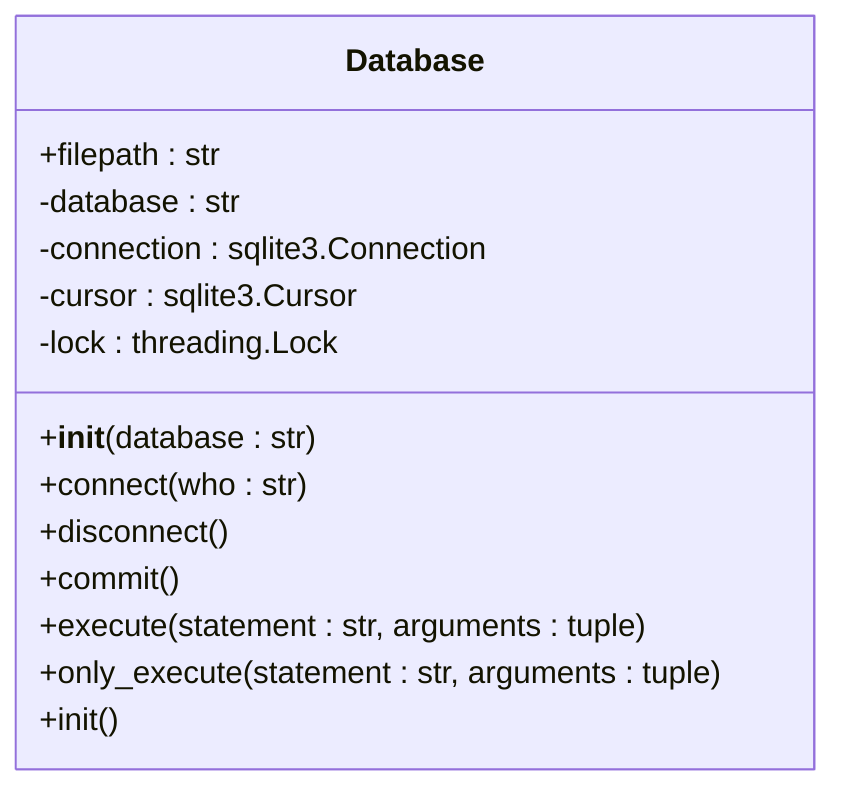
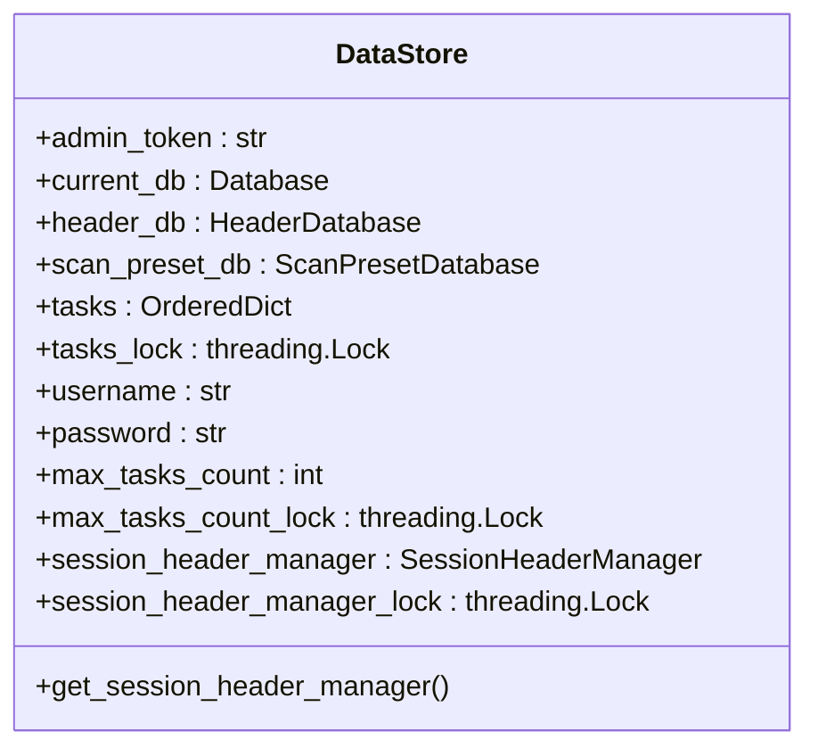
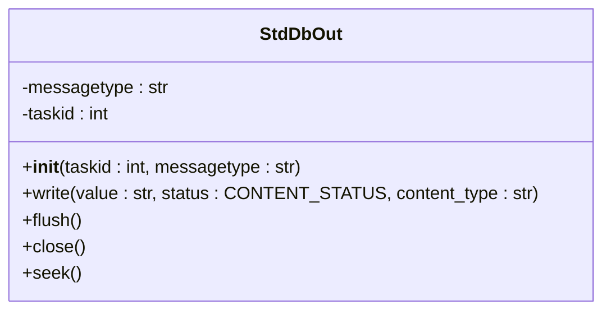
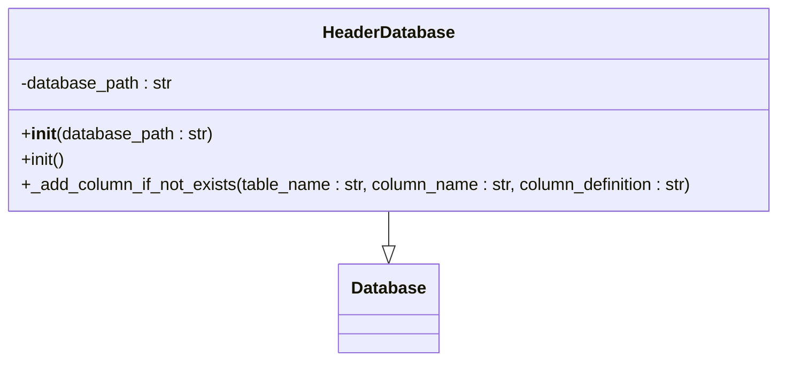
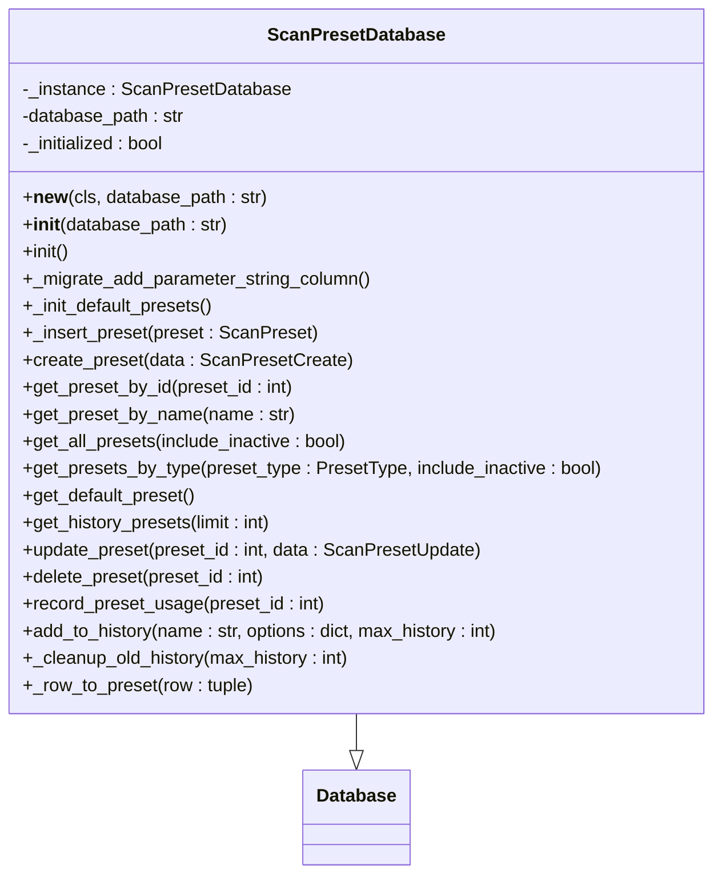

# 数据库设计

<cite>
**本文档引用的文件**
- [Database.py](file://src/backEnd/model/Database.py)
- [DataStore.py](file://src/backEnd/model/DataStore.py)
- [HeaderDatabase.py](file://src/backEnd/model/HeaderDatabase.py)
- [ScanPresetDatabase.py](file://src/backEnd/model/ScanPresetDatabase.py)
- [StdDbOut.py](file://src/backEnd/model/StdDbOut.py)
- [PersistentHeaderRule.py](file://src/backEnd/model/PersistentHeaderRule.py)
- [ScanPreset.py](file://src/backEnd/model/ScanPreset.py)
- [SessionHeader.py](file://src/backEnd/model/SessionHeader.py)
- [HeaderBatch.py](file://src/backEnd/model/HeaderBatch.py)
</cite>

## 目录
1. [引言](#引言)
2. [数据库选型与连接管理](#数据库选型与连接管理)
3. [DataStore抽象层设计](#datastore抽象层设计)
4. [StdDbOut标准数据库输出模块](#std-db-out标准数据库输出模块)
5. [具体数据访问对象实现](#具体数据访问对象实现)
6. [数据库表结构设计](#数据库表结构设计)
7. [数据迁移与备份恢复](#数据迁移与备份恢复)
8. [性能优化建议](#性能优化建议)
9. [结论](#结论)

## 引言
sqlmapWebUI是一个基于Web的SQL注入测试工具，其数据持久化方案采用SQLite数据库，通过精心设计的分层架构来管理各种配置和状态数据。本设计文档详细阐述了系统的数据持久化方案，包括数据库选型原因、连接管理机制、抽象层设计、具体数据访问对象的实现以及表结构设计。系统通过DataStore类作为全局数据存储中心，协调多个专用数据库实例，实现了对扫描配置、请求头规则等不同数据实体的统一访问和管理。

## 数据库选型与连接管理

### SQLite选型原因
sqlmapWebUI选择SQLite作为数据持久化方案主要基于以下几个关键因素：
1. **轻量级与嵌入式**：SQLite是一个无服务器的嵌入式数据库，不需要独立的数据库服务器进程，非常适合桌面应用和小型Web应用。
2. **零配置**：SQLite数据库以单个文件形式存储，无需复杂的安装和配置过程，降低了部署复杂性。
3. **跨平台兼容性**：SQLite在各种操作系统上都有良好的支持，确保了应用的可移植性。
4. **ACID事务支持**：SQLite提供完整的ACID（原子性、一致性、隔离性、持久性）事务支持，保证了数据的完整性和可靠性。
5. **Python原生支持**：Python标准库中包含sqlite3模块，提供了对SQLite的原生支持，无需额外依赖。

### Database连接管理机制
系统通过`Database.py`文件中的`Database`类实现数据库连接管理，其核心特性包括：
- **线程安全**：使用`threading.Lock()`确保多线程环境下的操作安全。
- **自动重试**：在执行SQL语句时，如果遇到"locked"异常，会自动休眠1秒后重试，提高了在高并发场景下的稳定性。
- **连接池简化**：虽然没有实现复杂的连接池，但通过`connect()`和`disconnect()`方法管理连接生命周期，避免了连接泄漏。
- **超时设置**：在连接数据库时设置了3秒的超时时间，防止长时间阻塞。



**图表来源**
- [Database.py](file://src/backEnd/model/Database.py#L10-L99)

**本节来源**
- [Database.py](file://src/backEnd/model/Database.py#L1-L99)

## DataStore抽象层设计

### 设计理念
DataStore抽象层是整个系统数据管理的核心，其设计理念包括：
1. **全局单例模式**：通过类变量实现全局唯一的存储中心，确保数据的一致性和共享性。
2. **分层管理**：将不同类型的数据（如请求头规则、扫描配置）分配给专门的数据库实例管理，实现了关注点分离。
3. **懒加载**：数据库实例在首次使用时才进行初始化，优化了启动性能。
4. **线程安全**：关键数据结构使用`threading.Lock()`保护，防止多线程竞争条件。

### 统一访问接口
DataStore通过以下方式提供对不同数据实体的统一访问：
- **集中式管理**：所有数据访问对象（如`header_db`、`scan_preset_db`）都作为DataStore的类属性进行管理。
- **延迟初始化**：数据访问对象在首次使用时才创建，避免了不必要的资源消耗。
- **单例模式**：通过`get_session_header_manager()`等方法确保特定组件的单例性。



**图表来源**
- [DataStore.py](file://src/backEnd/model/DataStore.py#L12-L38)

**本节来源**
- [DataStore.py](file://src/backEnd/model/DataStore.py#L1-L38)

## StdDbOut标准数据库输出模块

### 功能概述
StdDbOut模块（`StdDbOut.py`）是系统与数据库交互的关键组件，其主要功能包括：
1. **标准流重定向**：将Python的标准输出（stdout）和标准错误（stderr）重定向到数据库，实现了日志和错误信息的持久化。
2. **任务关联**：通过`taskid`参数将输出信息与特定任务关联，便于后续查询和分析。
3. **状态管理**：支持`IN_PROGRESS`和`COMPLETE`两种状态，能够处理部分输出和完整输出。
4. **内容类型区分**：通过`content_type`参数区分不同类型的内容，支持灵活的数据组织。

### 使用方式
StdDbOut的使用方式如下：
1. 创建实例时指定`taskid`和`messagetype`（"stdout"或"stderr"）。
2. 调用`write()`方法写入数据，可指定状态和内容类型。
3. 系统自动处理数据的插入、更新和删除操作。



**图表来源**
- [StdDbOut.py](file://src/backEnd/model/StdDbOut.py#L13-L62)

**本节来源**
- [StdDbOut.py](file://src/backEnd/model/StdDbOut.py#L1-L62)

## 具体数据访问对象实现

### HeaderDatabase实现
`HeaderDatabase`类专门管理请求头规则，其核心特性包括：
- **独立数据库文件**：使用独立的`headers.db`文件存储请求头规则，与主数据库分离。
- **数据迁移支持**：通过`_add_column_if_not_exists()`方法支持数据库模式的平滑升级。
- **索引优化**：为常用查询字段（如`is_active`、`priority`）创建索引，提高查询性能。
- **表结构**：包含`persistent_header_rules`（持久化规则）和`session_headers`（会话性头）两个表。



**图表来源**
- [HeaderDatabase.py](file://src/backEnd/model/HeaderDatabase.py#L11-L126)

**本节来源**
- [HeaderDatabase.py](file://src/backEnd/model/HeaderDatabase.py#L1-L126)

### ScanPresetDatabase实现
`ScanPresetDatabase`类管理扫描配置预设，其核心特性包括：
- **单例模式**：通过`__new__`方法确保全局唯一实例。
- **预设类型**：支持`DEFAULT`、`PRESET`和`HISTORY`三种预设类型。
- **自动初始化**：首次使用时自动创建默认预设配置。
- **历史管理**：支持历史配置的自动清理，保持数据库整洁。



**图表来源**
- [ScanPresetDatabase.py](file://src/backEnd/model/ScanPresetDatabase.py#L25-L514)

**本节来源**
- [ScanPresetDatabase.py](file://src/backEnd/model/ScanPresetDatabase.py#L1-L514)

## 数据库表结构设计

### 表结构概览
系统使用多个SQLite数据库文件，每个文件包含一个或多个表，具体结构如下：

```mermaid
erDiagram
persistent_header_rules {
int id PK
string name UK
string header_name
string header_value
string replace_strategy
string match_condition
int priority
int is_active
string scope_config
string created_at
string updated_at
}
session_headers {
int id PK
string client_ip
string header_name
string header_value
string replace_strategy
int priority
int is_active
string scope_config
string expires_at
string created_at
string updated_at
string client_ip + header_name UK
}
scan_presets {
int id PK
string name UK
string description
string preset_type
string options
string parameter_string
int is_active
string created_at
string updated_at
string last_used_at
int use_count
}
logs {
int id PK
int taskid
string datetime
string level
string message
}
data {
int id PK
int taskid
int status
int content_type
string value
}
errors {
int id PK
int taskid
string error
}
persistent_header_rules ||--o{ session_headers : "作用域关联"
scan_presets ||--o{ data : "任务关联"
scan_presets ||--o{ logs : "任务关联"
scan_presets ||--o{ errors : "任务关联"
```

### 字段说明
| 表名 | 字段名 | 数据类型 | 约束 | 说明 |
|------|-------|---------|------|------|
| persistent_header_rules | id | INTEGER | PRIMARY KEY, AUTOINCREMENT | 主键 |
| persistent_header_rules | name | TEXT | NOT NULL, UNIQUE | 规则名称 |
| persistent_header_rules | header_name | TEXT | NOT NULL | 请求头名称 |
| persistent_header_rules | header_value | TEXT | NOT NULL | 请求头值 |
| persistent_header_rules | replace_strategy | TEXT | NOT NULL, DEFAULT 'REPLACE' | 替换策略 |
| persistent_header_rules | priority | INTEGER | DEFAULT 0 | 优先级 |
| persistent_header_rules | is_active | INTEGER | DEFAULT 1 | 是否启用 |
| persistent_header_rules | created_at | TEXT | NOT NULL | 创建时间 |
| persistent_header_rules | updated_at | TEXT | NOT NULL | 更新时间 |
| session_headers | id | INTEGER | PRIMARY KEY, AUTOINCREMENT | 主键 |
| session_headers | client_ip | TEXT | NOT NULL | 客户端IP |
| session_headers | header_name | TEXT | NOT NULL | 请求头名称 |
| session_headers | header_value | TEXT | NOT NULL | 请求头值 |
| session_headers | expires_at | TEXT | NOT NULL | 过期时间 |
| session_headers | created_at | TEXT | NOT NULL | 创建时间 |
| scan_presets | id | INTEGER | PRIMARY KEY, AUTOINCREMENT | 主键 |
| scan_presets | name | TEXT | NOT NULL, UNIQUE | 预设名称 |
| scan_presets | preset_type | TEXT | NOT NULL, DEFAULT 'preset' | 预设类型 |
| scan_presets | options | TEXT | NOT NULL, DEFAULT '{}' | 扫描选项 |
| scan_presets | is_active | INTEGER | DEFAULT 1 | 是否启用 |
| scan_presets | created_at | TEXT | NOT NULL | 创建时间 |
| scan_presets | updated_at | TEXT | NOT NULL | 更新时间 |
| scan_presets | last_used_at | TEXT | | 最后使用时间 |
| scan_presets | use_count | INTEGER | DEFAULT 0 | 使用次数 |
| logs | id | INTEGER | PRIMARY KEY, AUTOINCREMENT | 主键 |
| logs | taskid | INTEGER | | 任务ID |
| logs | datetime | TEXT | | 时间戳 |
| logs | level | TEXT | | 日志级别 |
| logs | message | TEXT | | 日志消息 |
| data | id | INTEGER | PRIMARY KEY, AUTOINCREMENT | 主键 |
| data | taskid | INTEGER | | 任务ID |
| data | status | INTEGER | | 状态 |
| data | content_type | INTEGER | | 内容类型 |
| data | value | TEXT | | 值 |
| errors | id | INTEGER | PRIMARY KEY, AUTOINCREMENT | 主键 |
| errors | taskid | INTEGER | | 任务ID |
| errors | error | TEXT | | 错误信息 |

**图表来源**
- [HeaderDatabase.py](file://src/backEnd/model/HeaderDatabase.py#L29-L68)
- [ScanPresetDatabase.py](file://src/backEnd/model/ScanPresetDatabase.py#L58-L70)
- [Database.py](file://src/backEnd/model/Database.py#L74-L78)

**本节来源**
- [HeaderDatabase.py](file://src/backEnd/model/HeaderDatabase.py#L1-L126)
- [ScanPresetDatabase.py](file://src/backEnd/model/ScanPresetDatabase.py#L1-L514)
- [Database.py](file://src/backEnd/model/Database.py#L1-L99)

## 数据迁移与备份恢复

### 数据迁移策略
系统采用渐进式数据迁移策略，确保版本升级时的数据兼容性：
1. **列添加检测**：通过`PRAGMA table_info()`检查表结构，动态添加缺失的列。
2. **向后兼容**：旧版本的数据在新版本中仍可正常读取和使用。
3. **自动初始化**：新版本首次启动时自动创建默认配置和必要的表结构。

### 备份恢复机制
虽然系统未提供显式的备份恢复功能，但得益于SQLite的文件存储特性，可以轻松实现：
1. **文件备份**：直接复制`.db`文件即可完成备份。
2. **文件恢复**：将备份的`.db`文件复制回原位置即可恢复数据。
3. **版本控制**：建议将数据库文件纳入版本控制系统进行管理。

**本节来源**
- [HeaderDatabase.py](file://src/backEnd/model/HeaderDatabase.py#L103-L126)
- [ScanPresetDatabase.py](file://src/backEnd/model/ScanPresetDatabase.py#L86-L98)

## 性能优化建议

### 查询优化
1. **索引使用**：为常用查询字段（如`is_active`、`priority`、`name`）创建索引。
2. **批量操作**：尽量使用批量插入和更新操作，减少数据库交互次数。
3. **连接复用**：保持数据库连接的长生命周期，避免频繁的连接和断开。

### 事务处理
1. **显式事务**：对于多个相关操作，使用显式事务确保数据一致性。
2. **合理提交**：避免过于频繁的`commit()`调用，减少I/O开销。
3. **错误回滚**：在发生异常时及时回滚事务，防止数据不一致。

### 其他建议
1. **定期维护**：定期执行`VACUUM`命令，回收未使用的空间。
2. **连接池**：在高并发场景下，考虑使用连接池管理数据库连接。
3. **监控分析**：使用`EXPLAIN QUERY PLAN`分析慢查询，优化SQL语句。

**本节来源**
- [HeaderDatabase.py](file://src/backEnd/model/HeaderDatabase.py#L94-L99)
- [ScanPresetDatabase.py](file://src/backEnd/model/ScanPresetDatabase.py#L76-L79)

## 结论
sqlmapWebUI的数据库设计体现了良好的分层架构和关注点分离原则。通过选择SQLite作为持久化方案，系统实现了轻量级、易部署的数据管理。DataStore抽象层作为全局数据管理中心，协调多个专用数据库实例，提供了统一的访问接口。HeaderDatabase和ScanPresetDatabase等具体数据访问对象实现了对不同类型数据的精细化管理，支持CRUD操作、查询优化和事务处理。整体设计既满足了功能需求，又考虑了性能和可维护性，为系统的稳定运行提供了坚实的基础。