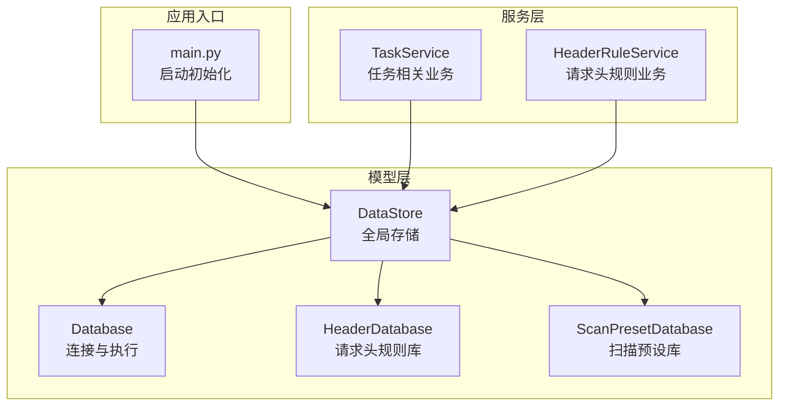
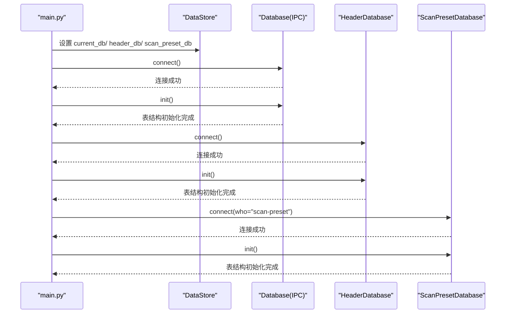
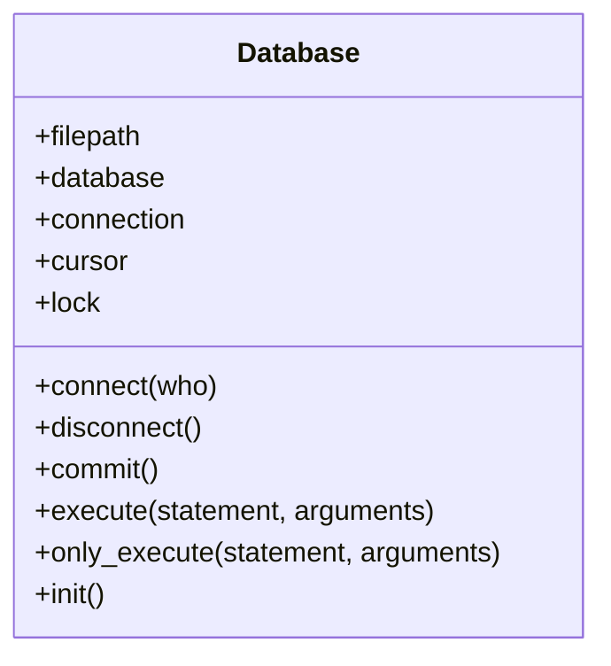
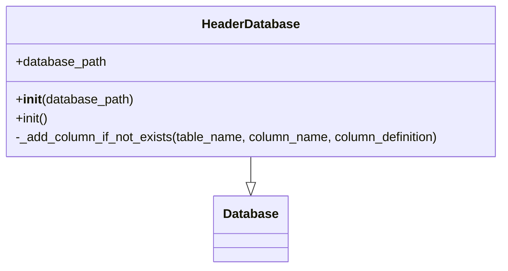
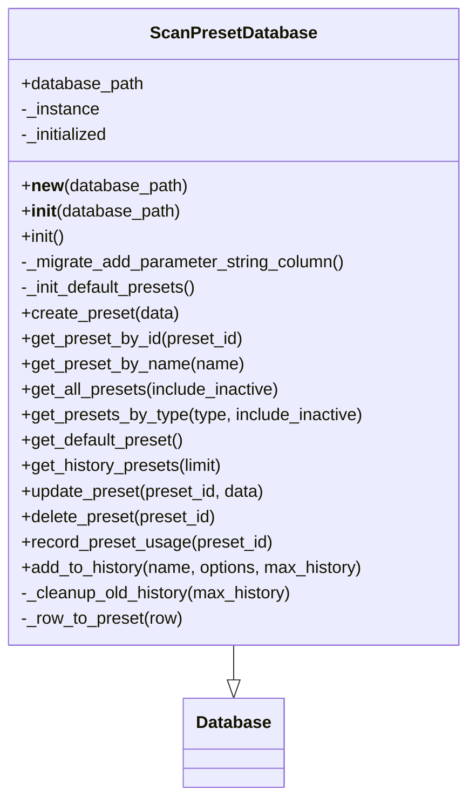
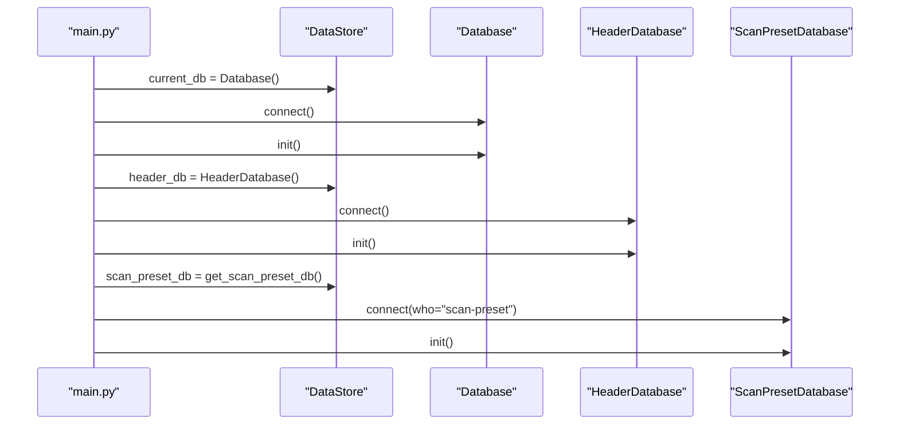
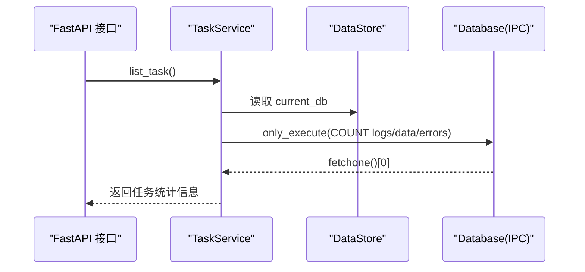
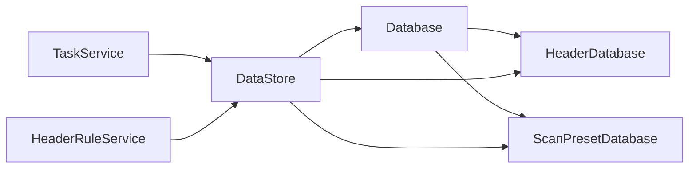
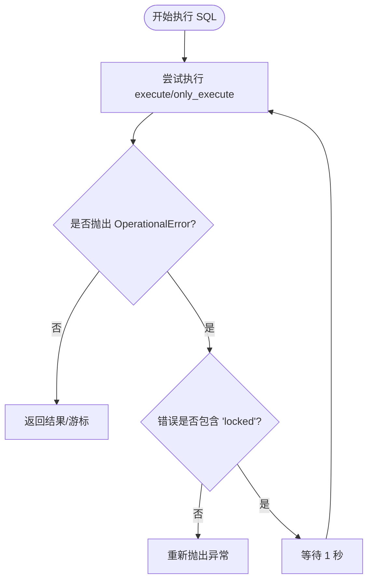

# 数据库连接管理

<cite>
**本文引用的文件**
- [src/backEnd/model/Database.py](file://src/backEnd/model/Database.py)
- [src/backEnd/model/HeaderDatabase.py](file://src/backEnd/model/HeaderDatabase.py)
- [src/backEnd/model/ScanPresetDatabase.py](file://src/backEnd/model/ScanPresetDatabase.py)
- [src/backEnd/model/DataStore.py](file://src/backEnd/model/DataStore.py)
- [src/backEnd/main.py](file://src/backEnd/main.py)
- [src/backEnd/service/taskService.py](file://src/backEnd/service/taskService.py)
- [src/backEnd/service/headerRuleService.py](file://src/backEnd/service/headerRuleService.py)
- [src/backEnd/third_lib/sqlmap/plugins/dbms/sqlite/connector.py](file://src/backEnd/third_lib/sqlmap/plugins/dbms/sqlite/connector.py)
</cite>

## 目录
1. [简介](#简介)
2. [项目结构](#项目结构)
3. [核心组件](#核心组件)
4. [架构总览](#架构总览)
5. [详细组件分析](#详细组件分析)
6. [依赖关系分析](#依赖关系分析)
7. [性能考量](#性能考量)
8. [故障排查指南](#故障排查指南)
9. [结论](#结论)

## 简介
本文档系统化梳理 sqlmapWebUI 的数据库连接管理机制，重点围绕 Database 类的设计与实现，解释其线程安全的连接管理（使用 threading.Lock）、SQLite 连接参数（timeout=3、isolation_level=None、check_same_thread=False）的配置意义，并结合实际使用场景说明 connect()、disconnect()、commit()、execute()、only_execute() 等核心方法的实现细节与调用时机。同时，文档阐述 filepath 类变量的作用与数据库文件路径管理策略，给出数据库连接生命周期管理的最佳实践（含异常处理与资源释放），并讨论多线程环境下的安全性问题与解决方案。

## 项目结构
sqlmapWebUI 后端采用“模型-服务-应用入口”的分层组织方式：
- 模型层：负责数据库连接与表结构初始化，如 Database、HeaderDatabase、ScanPresetDatabase、DataStore。
- 服务层：封装业务逻辑，通过 DataStore 中的全局数据库实例进行读写，如 taskService、headerRuleService。
- 应用入口：在启动阶段初始化各数据库实例并完成表结构初始化，如 main.py。

图表来源
- [src/backEnd/model/Database.py](file://src/backEnd/model/Database.py#L1-L99)
- [src/backEnd/model/HeaderDatabase.py](file://src/backEnd/model/HeaderDatabase.py#L1-L126)
- [src/backEnd/model/ScanPresetDatabase.py](file://src/backEnd/model/ScanPresetDatabase.py#L1-L120)
- [src/backEnd/model/DataStore.py](file://src/backEnd/model/DataStore.py#L1-L38)
- [src/backEnd/main.py](file://src/backEnd/main.py#L135-L168)
- [src/backEnd/service/taskService.py](file://src/backEnd/service/taskService.py#L100-L176)
- [src/backEnd/service/headerRuleService.py](file://src/backEnd/service/headerRuleService.py#L32-L60)

章节来源
- [src/backEnd/main.py](file://src/backEnd/main.py#L135-L168)
- [src/backEnd/model/DataStore.py](file://src/backEnd/model/DataStore.py#L1-L38)

## 核心组件
- Database：通用 SQLite 连接封装，提供线程安全的执行接口、连接生命周期管理与初始化表结构能力。
- HeaderDatabase：继承自 Database，专门管理请求头规则与会话性请求头的数据库，负责表结构初始化与列迁移。
- ScanPresetDatabase：继承自 Database，提供扫描预设的增删改查与默认预设初始化，采用单例模式管理连接。
- DataStore：全局状态容器，持有当前数据库实例、请求头规则库实例、扫描预设库实例以及任务相关锁，确保多线程访问安全。

章节来源
- [src/backEnd/model/Database.py](file://src/backEnd/model/Database.py#L1-L99)
- [src/backEnd/model/HeaderDatabase.py](file://src/backEnd/model/HeaderDatabase.py#L1-L126)
- [src/backEnd/model/ScanPresetDatabase.py](file://src/backEnd/model/ScanPresetDatabase.py#L1-L120)
- [src/backEnd/model/DataStore.py](file://src/backEnd/model/DataStore.py#L1-L38)

## 架构总览
下图展示了数据库连接在系统中的位置与交互关系，以及启动阶段的初始化流程。

图表来源
- [src/backEnd/main.py](file://src/backEnd/main.py#L135-L168)
- [src/backEnd/model/Database.py](file://src/backEnd/model/Database.py#L18-L34)
- [src/backEnd/model/HeaderDatabase.py](file://src/backEnd/model/HeaderDatabase.py#L14-L24)
- [src/backEnd/model/ScanPresetDatabase.py](file://src/backEnd/model/ScanPresetDatabase.py#L36-L53)

## 详细组件分析

### Database 类设计与实现
Database 是整个系统的数据库抽象基类，提供以下关键能力：
- 线程安全：通过实例级锁 self.lock，保证同一连接上的并发执行互斥。
- 连接参数：connect() 内部使用 sqlite3.connect(..., timeout=3, isolation_level=None, check_same_thread=False)，其中：
  - timeout=3：设置数据库锁定超时等待时间，避免长时间阻塞。
  - isolation_level=None：禁用自动事务，便于手动控制提交。
  - check_same_thread=False：允许多线程共享连接，配合 Lock 实现线程安全。
- 生命周期管理：connect()/disconnect()/commit() 提供显式的连接建立、关闭与提交。
- 执行接口：
  - execute(stmt, args)：带重试的执行器，对 sqlite3.OperationalError 中“locked”错误进行退避重试；若为 SELECT 语句，返回 fetchall() 结果。
  - only_execute(stmt, args)：带重试的执行器，返回 cursor 本身，便于外部自行 fetch。
- 初始化：init() 负责创建日志、数据、错误表以及持久化请求头规则表等核心表结构。

图表来源
- [src/backEnd/model/Database.py](file://src/backEnd/model/Database.py#L1-L99)

章节来源
- [src/backEnd/model/Database.py](file://src/backEnd/model/Database.py#L1-L99)

### HeaderDatabase 类设计与实现
HeaderDatabase 继承自 Database，专注于请求头规则与会话性请求头的数据库管理：
- 路径策略：若未显式传入数据库路径，则在构造函数中计算项目根目录下的 headers.db 文件路径，并将其作为 database_path 保存。
- 初始化：init() 负责创建持久化请求头规则表与会话性请求头表，并在必要时添加列（如 scope_config），同时创建索引提升查询性能。
- 列迁移：_add_column_if_not_exists() 方法通过 PRAGMA table_info(...) 检测列是否存在，不存在则执行 ALTER TABLE 添加列，兼容旧版本数据库。

图表来源
- [src/backEnd/model/HeaderDatabase.py](file://src/backEnd/model/HeaderDatabase.py#L1-L126)

章节来源
- [src/backEnd/model/HeaderDatabase.py](file://src/backEnd/model/HeaderDatabase.py#L1-L126)

### ScanPresetDatabase 类设计与实现
ScanPresetDatabase 继承自 Database，提供扫描预设的持久化存储与管理：
- 单例模式：通过 __new__/__init__ 双重检查实现单例，避免重复连接。
- 路径策略：若未显式传入数据库路径，则在构造函数中计算项目根目录下的 scan_presets.db 文件路径，并保存为 database_path。
- 初始化：init() 负责创建 scan_presets 表、索引与默认预设初始化；_migrate_add_parameter_string_column() 支持列迁移。
- 业务接口：提供创建、查询、更新、删除、历史记录维护、使用计数与最近使用时间等完整 CRUD 能力。

图表来源
- [src/backEnd/model/ScanPresetDatabase.py](file://src/backEnd/model/ScanPresetDatabase.py#L1-L120)

章节来源
- [src/backEnd/model/ScanPresetDatabase.py](file://src/backEnd/model/ScanPresetDatabase.py#L1-L120)

### DataStore 全局状态与线程安全
DataStore 提供全局共享状态，包含：
- current_db：当前 IPC 数据库实例（任务日志、数据、错误等）。
- header_db：请求头规则数据库实例。
- scan_preset_db：扫描预设数据库实例。
- tasks_lock：任务集合的全局锁，保护 DataStore.tasks 的并发访问。
- session_header_manager_lock：会话性请求头管理器的单例锁。

这些锁与实例共同保障了多线程环境下的数据一致性与可见性。

章节来源
- [src/backEnd/model/DataStore.py](file://src/backEnd/model/DataStore.py#L1-L38)

### 启动阶段的数据库初始化流程
应用启动时，main.py 会按顺序初始化三类数据库：
- IPC 数据库（Database）：创建临时 IPC 文件，connect() 并 init()。
- 请求头规则数据库（HeaderDatabase）：connect() 并 init()。
- 扫描预设数据库（ScanPresetDatabase）：connect(who="scan-preset") 并 init()。

图表来源
- [src/backEnd/main.py](file://src/backEnd/main.py#L135-L168)
- [src/backEnd/model/ScanPresetDatabase.py](file://src/backEnd/model/ScanPresetDatabase.py#L504-L514)

章节来源
- [src/backEnd/main.py](file://src/backEnd/main.py#L135-L168)

### 业务层对数据库的使用
- TaskService：在列举任务、查询日志、获取 payload 详情、获取任务错误等场景中，通过 DataStore.current_db 调用 only_execute()/execute()，并基于 SQL COUNT/ORDER BY 等语句统计与排序。
- HeaderRuleService：在创建/查询/更新/删除持久化请求头规则时，通过 DataStore.header_db 调用 execute()/only_execute()，并在需要时进行连接有效性检查。

图表来源
- [src/backEnd/service/taskService.py](file://src/backEnd/service/taskService.py#L102-L176)

章节来源
- [src/backEnd/service/taskService.py](file://src/backEnd/service/taskService.py#L102-L176)
- [src/backEnd/service/headerRuleService.py](file://src/backEnd/service/headerRuleService.py#L32-L60)

## 依赖关系分析
- Database 作为基类被 HeaderDatabase 与 ScanPresetDatabase 继承，统一了连接参数、执行重试与初始化流程。
- DataStore 将 Database 的实例作为全局共享资源，配合 tasks_lock 与 session_header_manager_lock 实现多线程安全。
- 业务层（TaskService、HeaderRuleService）通过 DataStore 访问数据库，避免直接耦合具体数据库实现。

图表来源
- [src/backEnd/model/Database.py](file://src/backEnd/model/Database.py#L1-L99)
- [src/backEnd/model/HeaderDatabase.py](file://src/backEnd/model/HeaderDatabase.py#L1-L126)
- [src/backEnd/model/ScanPresetDatabase.py](file://src/backEnd/model/ScanPresetDatabase.py#L1-L120)
- [src/backEnd/model/DataStore.py](file://src/backEnd/model/DataStore.py#L1-L38)
- [src/backEnd/service/taskService.py](file://src/backEnd/service/taskService.py#L102-L176)
- [src/backEnd/service/headerRuleService.py](file://src/backEnd/service/headerRuleService.py#L32-L60)

## 性能考量
- 连接参数优化：
  - timeout=3：在高并发写入场景下，适度缩短等待时间，避免长尾阻塞。
  - isolation_level=None：手动控制事务，减少自动事务带来的开销。
  - check_same_thread=False：允许多线程共享连接，降低连接创建成本。
- 执行重试策略：
  - execute()/only_execute() 对 sqlite3.OperationalError 中“locked”错误进行退避重试，提升稳定性。
- 索引与查询：
  - HeaderDatabase 与 ScanPresetDatabase 在初始化时创建常用索引，有助于 COUNT/ORDER BY 等查询性能。
- 单例与复用：
  - ScanPresetDatabase 采用单例，避免重复连接；业务层通过 DataStore 共享连接，减少资源消耗。

章节来源
- [src/backEnd/model/Database.py](file://src/backEnd/model/Database.py#L18-L34)
- [src/backEnd/model/HeaderDatabase.py](file://src/backEnd/model/HeaderDatabase.py#L94-L101)
- [src/backEnd/model/ScanPresetDatabase.py](file://src/backEnd/model/ScanPresetDatabase.py#L76-L84)

## 故障排查指南
- sqlite3.OperationalError 锁定重试：
  - 当执行过程中出现“locked”错误时，execute()/only_execute() 会捕获异常并休眠后重试，直至成功或抛出非“locked”异常。
  - 若持续失败，建议检查是否存在长时间事务未提交、写入竞争过于激烈或磁盘 I/O 抖动。
- 连接有效性检查：
  - HeaderRuleService 提供 _check_db_connection()，通过执行简单查询验证连接可用性，失败时返回服务不可用状态码。
- 资源释放最佳实践：
  - 使用 disconnect() 关闭 cursor 与 connection，避免句柄泄漏。
  - 在业务层异常处理中确保 commit() 或回滚（如需）与资源释放的成对出现。
- 多线程安全：
  - Database 内部使用 self.lock 保证同一连接上的互斥执行；业务层应避免跨连接共享状态。
  - DataStore.tasks_lock 保护任务集合的并发访问，防止竞态条件。

图表来源
- [src/backEnd/model/Database.py](file://src/backEnd/model/Database.py#L35-L71)

章节来源
- [src/backEnd/model/Database.py](file://src/backEnd/model/Database.py#L35-L71)
- [src/backEnd/service/headerRuleService.py](file://src/backEnd/service/headerRuleService.py#L44-L56)

## 结论
sqlmapWebUI 的数据库连接管理以 Database 为核心，通过统一的连接参数、线程安全的执行锁与健壮的异常重试机制，实现了稳定高效的 SQLite 数据访问。HeaderDatabase 与 ScanPresetDatabase 在此基础上分别承担请求头规则与扫描预设的专用职责，并通过 DataStore 提供全局共享与多线程安全保障。启动阶段的有序初始化与业务层对 DataStore 的统一访问，构成了清晰、可维护的数据库连接生命周期管理模式。