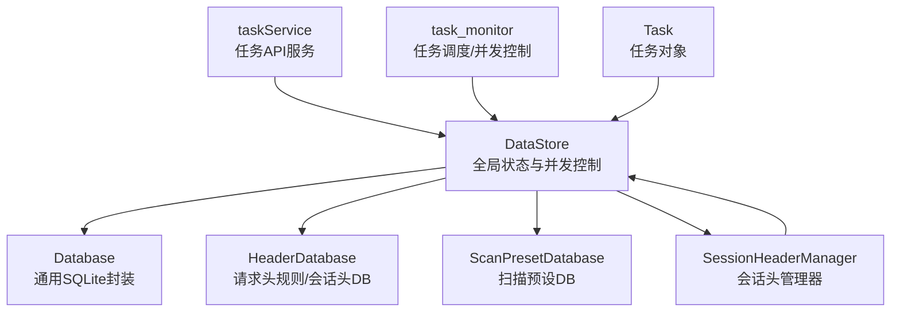
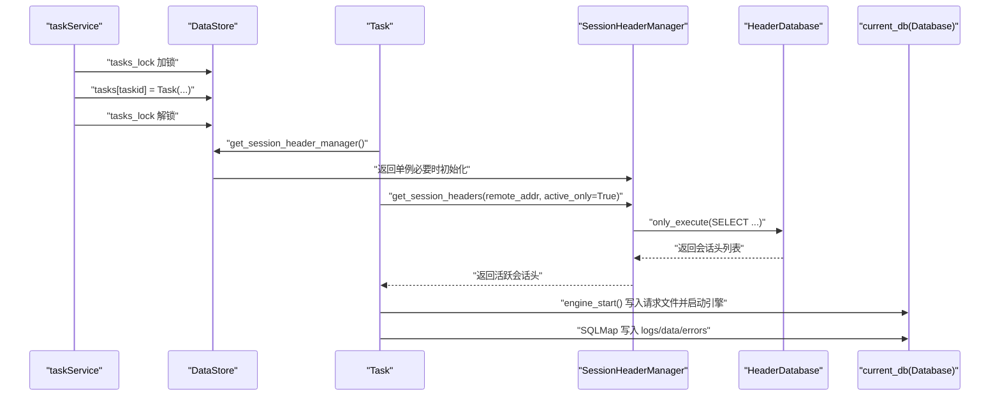
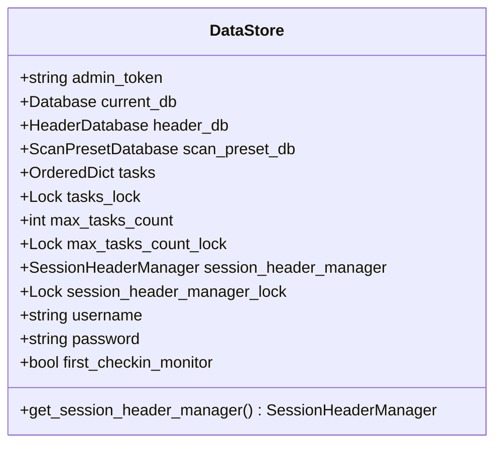
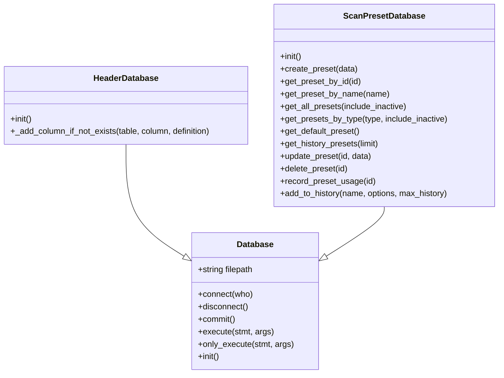
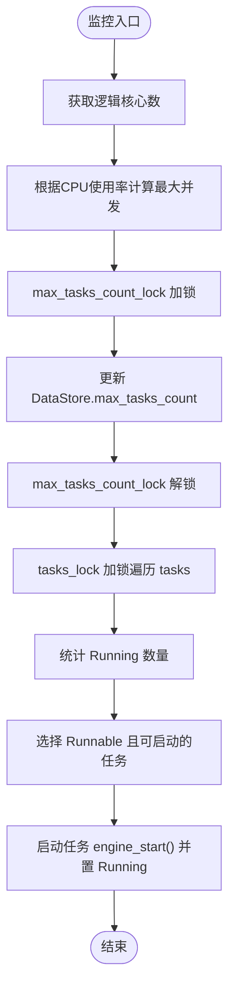
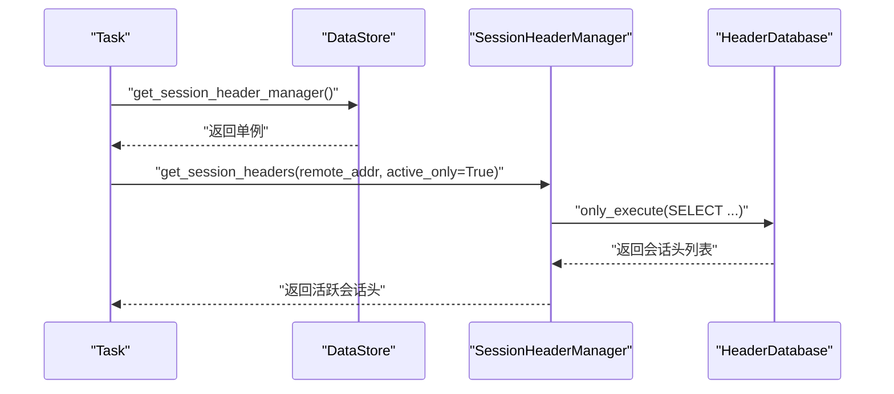
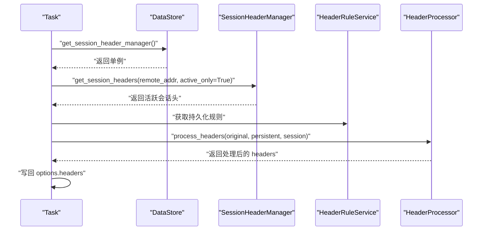
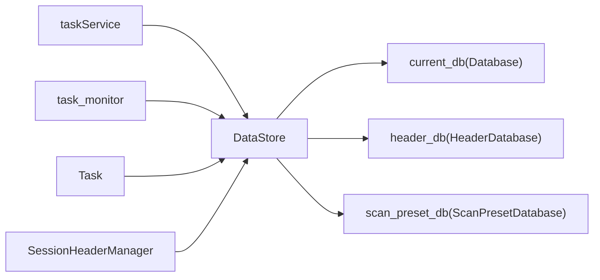

# 全局数据存储

<cite>
**本文引用的文件**
- [DataStore.py](file://src/backEnd/model/DataStore.py)
- [Database.py](file://src/backEnd/model/Database.py)
- [HeaderDatabase.py](file://src/backEnd/model/HeaderDatabase.py)
- [ScanPresetDatabase.py](file://src/backEnd/model/ScanPresetDatabase.py)
- [Task.py](file://src/backEnd/model/Task.py)
- [taskService.py](file://src/backEnd/service/taskService.py)
- [task_monitor.py](file://src/backEnd/utils/task_monitor.py)
- [session_header_manager.py](file://src/backEnd/utils/session_header_manager.py)
</cite>

## 目录
1. [简介](#简介)
2. [项目结构](#项目结构)
3. [核心组件](#核心组件)
4. [架构总览](#架构总览)
5. [详细组件分析](#详细组件分析)
6. [依赖关系分析](#依赖关系分析)
7. [性能考量](#性能考量)
8. [故障排查指南](#故障排查指南)
9. [结论](#结论)

## 简介
本文件围绕系统全局状态管理中心 DataStore 的设计与实现进行深入解析。DataStore 是一个全局单例风格的类，承担以下职责：
- 数据库连接管理：维护任务日志与结果数据的主数据库连接 current_db；维护请求头规则与会话头的独立数据库 header_db；维护扫描配置预设的数据库 scan_preset_db。
- 运行时状态维护：集中存放当前任务集合 tasks（有序字典），以及并发控制锁 tasks_lock；维护最大并发任务数 max_tasks_count 及其并发控制锁 max_tasks_count_lock；提供会话性请求头管理器的延迟初始化与并发保护。
- 配置与认证：保存管理员令牌 admin_token、用户名 username、密码 password 等系统级配置项；提供首次登录检查开关 first_checkin_monitor。
- 会话性请求头管理：通过 DataStore.get_session_header_manager 提供线程安全的会话性请求头管理器单例，用于按客户端 IP 动态注入与持久化临时请求头。

DataStore 在系统中扮演“中枢”角色：任务服务通过它读取/写入数据库、管理任务集合与并发；监控器通过它动态调整并发上限；任务对象在启动前通过它应用请求头规则；会话头管理器通过它访问 header_db 实现持久化。

## 项目结构
与 DataStore 直接相关的关键文件与职责如下：
- DataStore：全局状态与并发控制中心
- Database：通用 SQLite 数据库封装（current_db 基类）
- HeaderDatabase：请求头规则与会话头专用数据库（header_db）
- ScanPresetDatabase：扫描配置预设数据库（scan_preset_db）
- Task：任务生命周期与请求头应用
- taskService：任务 API 服务层，大量使用 DataStore 的 tasks 与 current_db
- task_monitor：任务调度与并发控制，使用 DataStore 的 tasks 与 max_tasks_count
- session_header_manager：会话性请求头管理器，通过 DataStore.header_db 持久化

图表来源
- [DataStore.py](file://src/backEnd/model/DataStore.py#L1-L38)
- [Database.py](file://src/backEnd/model/Database.py#L1-L99)
- [HeaderDatabase.py](file://src/backEnd/model/HeaderDatabase.py#L1-L126)
- [ScanPresetDatabase.py](file://src/backEnd/model/ScanPresetDatabase.py#L1-L514)
- [Task.py](file://src/backEnd/model/Task.py#L1-L333)
- [taskService.py](file://src/backEnd/service/taskService.py#L1-L200)
- [task_monitor.py](file://src/backEnd/utils/task_monitor.py#L1-L94)
- [session_header_manager.py](file://src/backEnd/utils/session_header_manager.py#L1-L313)

章节来源
- [DataStore.py](file://src/backEnd/model/DataStore.py#L1-L38)
- [Database.py](file://src/backEnd/model/Database.py#L1-L99)
- [HeaderDatabase.py](file://src/backEnd/model/HeaderDatabase.py#L1-L126)
- [ScanPresetDatabase.py](file://src/backEnd/model/ScanPresetDatabase.py#L1-L514)
- [Task.py](file://src/backEnd/model/Task.py#L1-L333)
- [taskService.py](file://src/backEnd/service/taskService.py#L1-L200)
- [task_monitor.py](file://src/backEnd/utils/task_monitor.py#L1-L94)
- [session_header_manager.py](file://src/backEnd/utils/session_header_manager.py#L1-L313)

## 核心组件
- DataStore 属性与职责
  - current_db：任务日志、结果数据、错误信息等的主数据库连接（Database 子类实例）
  - header_db：请求头规则与会话头专用数据库（HeaderDatabase 实例）
  - scan_preset_db：扫描配置预设数据库（ScanPresetDatabase 实例）
  - tasks：有序字典，键为任务 ID，值为 Task 实例
  - tasks_lock：线程锁，保护 tasks 的并发访问
  - max_tasks_count：最大并发任务数
  - max_tasks_count_lock：线程锁，保护 max_tasks_count 的并发修改
  - session_header_manager：会话性请求头管理器单例
  - session_header_manager_lock：线程锁，保护单例初始化
  - admin_token、username、password：系统级配置
  - first_checkin_monitor：首次登录检查开关
- 并发控制
  - tasks_lock：在任务增删改查、状态变更、日志/数据查询等场景广泛使用
  - max_tasks_count_lock：在动态调整最大并发任务数时使用
  - Database/SessionHeaderManager 内部也各自持有锁，保证数据库操作与内存结构的原子性

章节来源
- [DataStore.py](file://src/backEnd/model/DataStore.py#L1-L38)
- [Database.py](file://src/backEnd/model/Database.py#L1-L99)
- [session_header_manager.py](file://src/backEnd/utils/session_header_manager.py#L1-L313)

## 架构总览
DataStore 作为系统中枢，贯穿任务生命周期、请求头处理、并发调度与数据库持久化：
- 任务创建：taskService 在 DataStore.tasks 中登记 Task，并设置初始状态
- 请求头应用：Task 在启动前调用 DataStore.get_session_header_manager 获取会话头管理器，合并持久化规则与会话头
- 并发调度：task_monitor 依据 DataStore.max_tasks_count 与 DataStore.tasks_lock 控制任务启动
- 数据持久化：Task 启动时将 Database.filepath 注入 SQLMap，SQLMap 日志/数据写入 current_db；会话头管理器写入 header_db

图表来源
- [taskService.py](file://src/backEnd/service/taskService.py#L58-L88)
- [DataStore.py](file://src/backEnd/model/DataStore.py#L29-L38)
- [Task.py](file://src/backEnd/model/Task.py#L109-L170)
- [session_header_manager.py](file://src/backEnd/utils/session_header_manager.py#L151-L171)
- [HeaderDatabase.py](file://src/backEnd/model/HeaderDatabase.py#L1-L126)
- [Database.py](file://src/backEnd/model/Database.py#L1-L99)

## 详细组件分析

### DataStore 类设计与并发控制
- 设计要点
  - 全局状态：集中存放数据库连接、任务集合、系统配置与并发控制锁
  - 延迟初始化：通过 get_session_header_manager 提供单例，避免无用开销
  - 线程安全：在任务管理、并发上限调整、会话头管理等关键路径使用锁
- 关键属性与用途
  - current_db：任务日志、结果数据、错误信息的主数据库
  - header_db：请求头规则与会话头的持久化存储
  - scan_preset_db：扫描配置预设的持久化存储
  - tasks：任务集合，有序字典便于遍历与统计
  - tasks_lock：保护 tasks 的并发访问
  - max_tasks_count：最大并发任务数
  - max_tasks_count_lock：保护 max_tasks_count 的并发修改
  - session_header_manager / session_header_manager_lock：会话头管理器单例及其锁
  - admin_token/username/password：系统级配置
  - first_checkin_monitor：首次登录检查开关
- 并发控制策略
  - 任务服务在增删改查任务、状态变更、日志/数据查询时使用 tasks_lock
  - 任务监控在调整 max_tasks_count 时使用 max_tasks_count_lock
  - 会话头管理器内部使用 _lock 保护内存结构，同时通过 header_db 执行持久化

图表来源
- [DataStore.py](file://src/backEnd/model/DataStore.py#L1-L38)

章节来源
- [DataStore.py](file://src/backEnd/model/DataStore.py#L1-L38)

### 数据库连接管理
- current_db（Database）
  - 负责任务日志、结果数据、错误信息的持久化
  - 内置锁与重试机制，自动处理数据库“被锁定”的瞬时异常
- header_db（HeaderDatabase）
  - 专门用于请求头规则与会话头的持久化
  - 支持列迁移（新增列时自动添加），并建立索引优化查询
- scan_preset_db（ScanPresetDatabase）
  - 专门用于扫描配置预设的持久化
  - 单例模式，懒加载初始化，内置默认预设初始化与历史预设清理

图表来源
- [Database.py](file://src/backEnd/model/Database.py#L1-L99)
- [HeaderDatabase.py](file://src/backEnd/model/HeaderDatabase.py#L1-L126)
- [ScanPresetDatabase.py](file://src/backEnd/model/ScanPresetDatabase.py#L1-L514)

章节来源
- [Database.py](file://src/backEnd/model/Database.py#L1-L99)
- [HeaderDatabase.py](file://src/backEnd/model/HeaderDatabase.py#L1-L126)
- [ScanPresetDatabase.py](file://src/backEnd/model/ScanPresetDatabase.py#L1-L514)

### 任务状态与并发控制
- 任务集合与锁
  - 任务服务在创建、删除、停止、终止任务时使用 tasks_lock
  - 任务服务在查询日志/数据/错误时使用 current_db（由 DataStore.current_db 提供）
- 并发上限与调度
  - 任务监控器根据 CPU 使用率动态计算最大并发任务数
  - 使用 max_tasks_count_lock 保护 max_tasks_count 的更新
  - 使用 tasks_lock 遍历任务，将 Runnable 的任务启动为 Running，维持并发上限

图表来源
- [task_monitor.py](file://src/backEnd/utils/task_monitor.py#L36-L94)
- [taskService.py](file://src/backEnd/service/taskService.py#L89-L117)

章节来源
- [taskService.py](file://src/backEnd/service/taskService.py#L89-L117)
- [task_monitor.py](file://src/backEnd/utils/task_monitor.py#L36-L94)

### 会话性请求头管理器
- 单例与延迟初始化
  - 通过 DataStore.get_session_header_manager 提供线程安全的单例
  - 首次访问时才创建 SessionHeaderManager 实例
- 内存与持久化双层结构
  - 内存：按客户端 IP 维护活跃会话头字典，带过期时间与替换策略
  - 持久化：通过 DataStore.header_db 将会话头写入 session_headers 表
- 并发控制
  - 内部使用 _lock 保护内存结构
  - 持久化操作通过 header_db 的锁与重试机制保证一致性

图表来源
- [DataStore.py](file://src/backEnd/model/DataStore.py#L29-L38)
- [session_header_manager.py](file://src/backEnd/utils/session_header_manager.py#L151-L171)
- [HeaderDatabase.py](file://src/backEnd/model/HeaderDatabase.py#L1-L126)

章节来源
- [session_header_manager.py](file://src/backEnd/utils/session_header_manager.py#L1-L313)
- [DataStore.py](file://src/backEnd/model/DataStore.py#L29-L38)

### 任务对象与请求头应用流程
- 初始化与选项
  - Task 初始化时设置默认选项，注入 Database.filepath 与 taskid
- 请求头应用
  - Task 在启动前调用 apply_header_rules，动态导入 HeaderRuleService 与 HeaderProcessor
  - 通过 DataStore.get_session_header_manager 获取会话头管理器，合并持久化规则与会话头
  - 将处理后的请求头写回 Task.options.headers，供 SQLMap 使用
- 引擎启动
  - Task 创建 HTTP 请求文件，保存 SQLMap 配置，启动子进程执行 SQLMap

图表来源
- [Task.py](file://src/backEnd/model/Task.py#L109-L170)
- [DataStore.py](file://src/backEnd/model/DataStore.py#L29-L38)
- [session_header_manager.py](file://src/backEnd/utils/session_header_manager.py#L151-L171)

章节来源
- [Task.py](file://src/backEnd/model/Task.py#L109-L170)

## 依赖关系分析
- 组件耦合
  - taskService 与 task_monitor 高度依赖 DataStore 的 tasks 与并发控制
  - Task 依赖 DataStore 的会话头管理器与数据库连接
  - SessionHeaderManager 依赖 DataStore 的 header_db
  - ScanPresetDatabase 与 HeaderDatabase 均继承自 Database，共享锁与重试机制
- 外部依赖
  - SQLite：通过 Database/SessionHeaderManager 的 execute/only_execute 实现
  - psutil：任务监控器用于 CPU 使用率检测
  - 第三方 SQLMap：Task 启动子进程执行扫描

图表来源
- [taskService.py](file://src/backEnd/service/taskService.py#L1-L200)
- [task_monitor.py](file://src/backEnd/utils/task_monitor.py#L1-L94)
- [Task.py](file://src/backEnd/model/Task.py#L1-L333)
- [DataStore.py](file://src/backEnd/model/DataStore.py#L1-L38)
- [Database.py](file://src/backEnd/model/Database.py#L1-L99)
- [HeaderDatabase.py](file://src/backEnd/model/HeaderDatabase.py#L1-L126)
- [ScanPresetDatabase.py](file://src/backEnd/model/ScanPresetDatabase.py#L1-L514)

章节来源
- [taskService.py](file://src/backEnd/service/taskService.py#L1-L200)
- [task_monitor.py](file://src/backEnd/utils/task_monitor.py#L1-L94)
- [Task.py](file://src/backEnd/model/Task.py#L1-L333)
- [DataStore.py](file://src/backEnd/model/DataStore.py#L1-L38)
- [Database.py](file://src/backEnd/model/Database.py#L1-L99)
- [HeaderDatabase.py](file://src/backEnd/model/HeaderDatabase.py#L1-L126)
- [ScanPresetDatabase.py](file://src/backEnd/model/ScanPresetDatabase.py#L1-L514)

## 性能考量
- 数据库并发
  - Database 的 execute/only_execute 内置锁与“被锁定”重试，避免瞬时锁竞争导致的失败
  - HeaderDatabase/ScanPresetDatabase 建立索引，提升查询效率
- 任务并发
  - 通过 max_tasks_count_lock 与 tasks_lock 严格控制并发，避免过度竞争
  - 任务监控器根据 CPU 使用率动态调整并发上限，平衡吞吐与稳定性
- 内存与持久化
  - 会话头管理器采用内存+持久化双层结构，降低频繁 IO 开销，同时保证重启后可恢复
- I/O 与磁盘
  - 任务启动时写入临时请求文件，建议确保临时目录磁盘空间充足与权限正确

[本节为通用指导，无需列出具体文件来源]

## 故障排查指南
- 数据库连接未初始化
  - 现象：任务列表/日志/数据查询时报“数据库连接未初始化”
  - 排查：确认 DataStore.current_db 是否已初始化；查看 taskService 中对 current_db 的校验与错误返回
  - 参考
    - [taskService.py](file://src/backEnd/service/taskService.py#L102-L117)
- 任务无法启动/并发不足
  - 现象：Runnable 任务长时间未变为 Running
  - 排查：检查 max_tasks_count 与 CPU 使用率；确认 task_monitor 的并发上限计算逻辑；查看 tasks_lock 是否被长时间占用
  - 参考
    - [task_monitor.py](file://src/backEnd/utils/task_monitor.py#L36-L94)
- 会话头未生效
  - 现象：请求头未按预期注入
  - 排查：确认 DataStore.header_db 是否可用；检查 SessionHeaderManager 的 get/set/remove 流程；核对持久化写入与查询
  - 参考
    - [session_header_manager.py](file://src/backEnd/utils/session_header_manager.py#L151-L171)
    - [HeaderDatabase.py](file://src/backEnd/model/HeaderDatabase.py#L1-L126)
- 请求头规则冲突
  - 现象：多个规则同时作用于同一头部
  - 排查：检查 HeaderProcessor 的合并策略与优先级；核对持久化规则与会话头的替换策略
  - 参考
    - [Task.py](file://src/backEnd/model/Task.py#L109-L170)

章节来源
- [taskService.py](file://src/backEnd/service/taskService.py#L102-L117)
- [task_monitor.py](file://src/backEnd/utils/task_monitor.py#L36-L94)
- [session_header_manager.py](file://src/backEnd/utils/session_header_manager.py#L151-L171)
- [HeaderDatabase.py](file://src/backEnd/model/HeaderDatabase.py#L1-L126)
- [Task.py](file://src/backEnd/model/Task.py#L109-L170)

## 结论
DataStore 通过集中化的数据库连接、任务集合与并发控制，成为系统全局状态管理的中枢。它与 Database/HeaderDatabase/ScanPresetDatabase 形成清晰的数据层分工，与 Task、taskService、task_monitor、SessionHeaderManager 等组件形成稳定的协作关系。在多线程环境下，通过细粒度的锁与重试机制保障数据一致性与系统稳定性。对于使用者而言，理解 DataStore 的职责边界与并发控制点，有助于更高效地扩展任务管理、请求头处理与配置持久化能力。