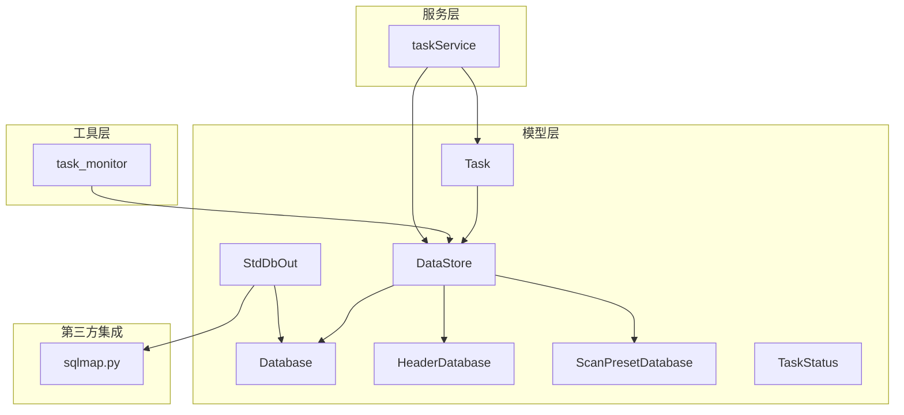
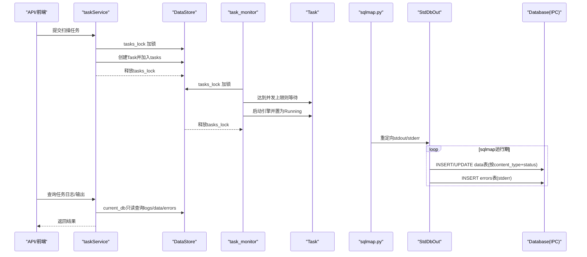
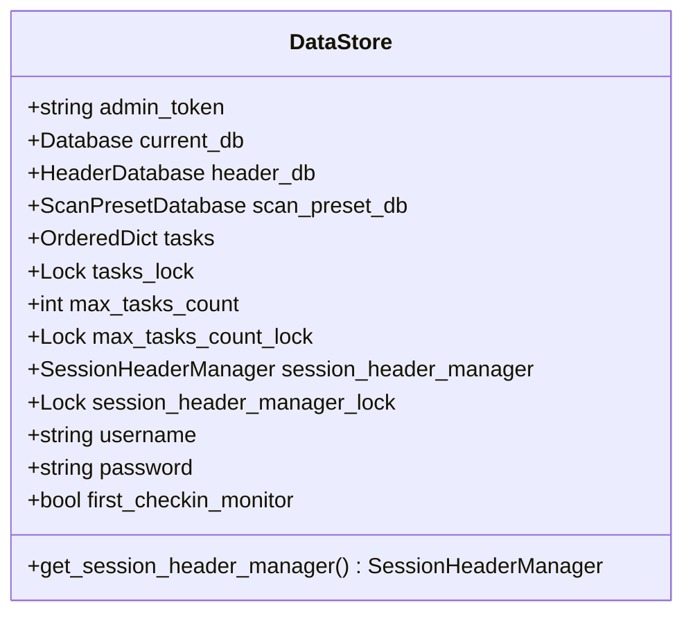
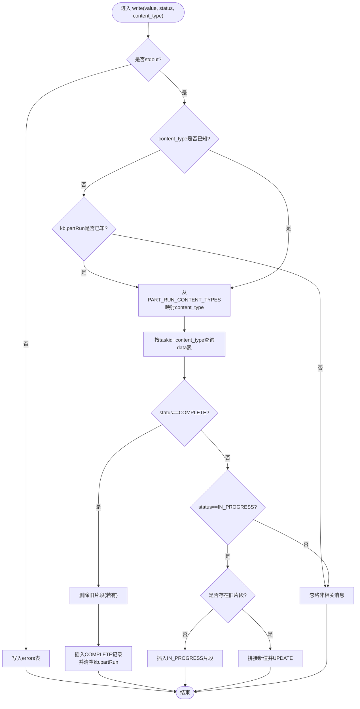
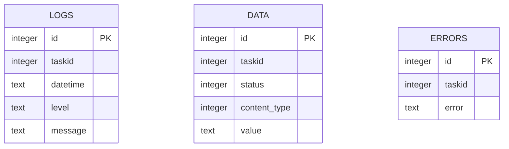
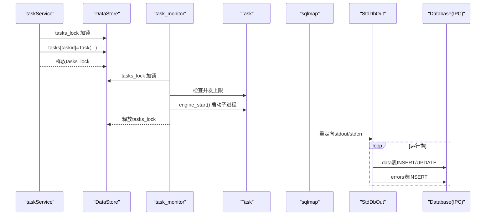
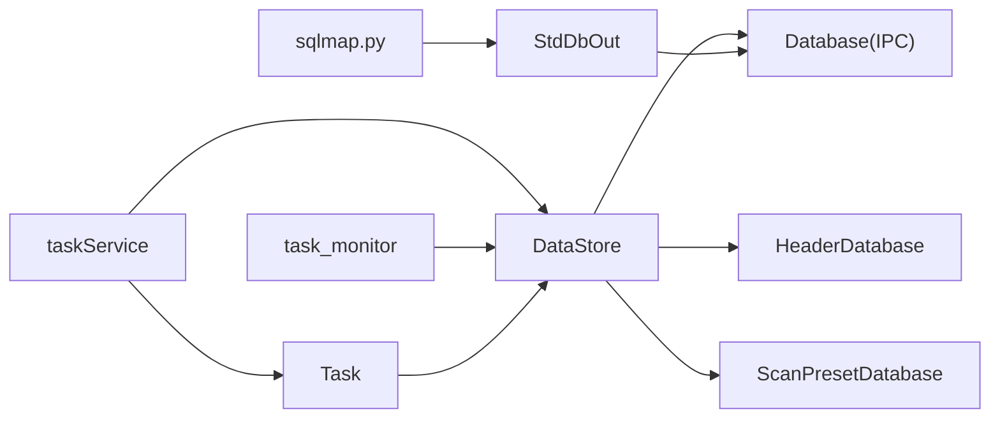

# 数据访问抽象层

<cite>
**本文引用的文件**
- [DataStore.py](file://src/backEnd/model/DataStore.py)
- [StdDbOut.py](file://src/backEnd/model/StdDbOut.py)
- [Database.py](file://src/backEnd/model/Database.py)
- [HeaderDatabase.py](file://src/backEnd/model/HeaderDatabase.py)
- [ScanPresetDatabase.py](file://src/backEnd/model/ScanPresetDatabase.py)
- [Task.py](file://src/backEnd/model/Task.py)
- [TaskStatus.py](file://src/backEnd/model/TaskStatus.py)
- [taskService.py](file://src/backEnd/service/taskService.py)
- [task_monitor.py](file://src/backEnd/utils/task_monitor.py)
- [sqlmap.py](file://src/backEnd/third_lib/sqlmap/sqlmap.py)
</cite>

## 目录
1. [简介](#简介)
2. [项目结构](#项目结构)
3. [核心组件](#核心组件)
4. [架构总览](#架构总览)
5. [详细组件分析](#详细组件分析)
6. [依赖关系分析](#依赖关系分析)
7. [性能考量](#性能考量)
8. [故障排查指南](#故障排查指南)
9. [结论](#结论)

## 简介
本文件聚焦于数据访问抽象层中的两个关键组件：DataStore（全局数据存储中心）与 StdDbOut（sqlmap 引擎输出重定向写库器）。前者负责管理数据库连接实例与运行时状态（任务集合、并发锁、会话性请求头管理器等），后者通过重定向标准输出/错误流，将 sqlmap 的日志、进度与错误实时写入 IPC 数据库，供前端或 API 查询展示。本文将系统阐述两者的职责边界、并发控制策略、数据序列化与持久化流程，并给出它们在任务执行过程中的协同工作时序图。

## 项目结构
围绕数据访问抽象层的关键文件组织如下：
- 模型层（model）：DataStore、StdDbOut、Database、HeaderDatabase、ScanPresetDatabase、Task、TaskStatus
- 服务层（service）：taskService（任务生命周期与状态管理）
- 工具层（utils）：task_monitor（任务调度与并发上限控制）
- 第三方集成（third_lib/sqlmap）：sqlmap 主入口，负责在 API 模式下重定向 stdout/stderr

图表来源
- [DataStore.py](file://src/backEnd/model/DataStore.py#L1-L38)
- [StdDbOut.py](file://src/backEnd/model/StdDbOut.py#L1-L62)
- [Database.py](file://src/backEnd/model/Database.py#L1-L99)
- [HeaderDatabase.py](file://src/backEnd/model/HeaderDatabase.py#L1-L126)
- [ScanPresetDatabase.py](file://src/backEnd/model/ScanPresetDatabase.py#L1-L514)
- [Task.py](file://src/backEnd/model/Task.py#L1-L333)
- [TaskStatus.py](file://src/backEnd/model/TaskStatus.py#L1-L9)
- [taskService.py](file://src/backEnd/service/taskService.py#L1-L200)
- [task_monitor.py](file://src/backEnd/utils/task_monitor.py#L39-L93)
- [sqlmap.py](file://src/backEnd/third_lib/sqlmap/sqlmap.py#L138-L177)

章节来源
- [DataStore.py](file://src/backEnd/model/DataStore.py#L1-L38)
- [Database.py](file://src/backEnd/model/Database.py#L1-L99)
- [StdDbOut.py](file://src/backEnd/model/StdDbOut.py#L1-L62)
- [Task.py](file://src/backEnd/model/Task.py#L1-L333)
- [taskService.py](file://src/backEnd/service/taskService.py#L1-L200)
- [task_monitor.py](file://src/backEnd/utils/task_monitor.py#L39-L93)
- [sqlmap.py](file://src/backEnd/third_lib/sqlmap/sqlmap.py#L138-L177)

## 核心组件
- DataStore（全局数据存储中心）
  - 职责：集中持有数据库连接实例（current_db、header_db、scan_preset_db）、运行时任务集合与并发控制锁；提供会话性请求头管理器单例获取。
  - 关键字段：admin_token、current_db、header_db、scan_preset_db、tasks、tasks_lock、max_tasks_count、max_tasks_count_lock、session_header_manager、session_header_manager_lock。
  - 并发控制：tasks_lock 保护 tasks 字典的读写；max_tasks_count_lock 保护最大并发任务数的更新；session_header_manager_lock 保护单例初始化。
- StdDbOut（sqlmap 输出重定向写库器）
  - 职责：重定向 sys.stdout/sys.stderr，将 sqlmap 输出按内容类型与状态（IN_PROGRESS/COMPLETE）写入 IPC 数据库 data 表；同时将 stderr 写入 errors 表。
  - 关键行为：write() 方法根据状态与内容类型合并/覆盖数据；jsonize/dejsonize 序列化/反序列化文本；在 COMPLETE 时清理同任务同类型的未完成片段。

章节来源
- [DataStore.py](file://src/backEnd/model/DataStore.py#L1-L38)
- [StdDbOut.py](file://src/backEnd/model/StdDbOut.py#L1-L62)

## 架构总览
DataStore 作为全局中枢，贯穿任务生命周期：服务层创建任务并放入 DataStore.tasks，监控器根据并发上限调度启动，sqlmap 在 API 模式下重定向输出至 StdDbOut，StdDbOut 通过 conf.databaseCursor 将数据写入 Database 实例的 IPC 数据库。API 层通过 DataStore.current_db 查询 logs/data/errors 表，向客户端返回任务状态与输出。

图表来源
- [taskService.py](file://src/backEnd/service/taskService.py#L58-L88)
- [task_monitor.py](file://src/backEnd/utils/task_monitor.py#L39-L93)
- [Task.py](file://src/backEnd/model/Task.py#L258-L297)
- [sqlmap.py](file://src/backEnd/third_lib/sqlmap/sqlmap.py#L161-L170)
- [StdDbOut.py](file://src/backEnd/model/StdDbOut.py#L25-L54)
- [Database.py](file://src/backEnd/model/Database.py#L35-L71)

## 详细组件分析

### DataStore 组件分析
- 角色定位
  - 全局数据存储中心：统一管理数据库连接实例（current_db、header_db、scan_preset_db），维护任务集合与并发控制锁，提供会话性请求头管理器单例。
- 数据结构与并发控制
  - tasks：有序字典，保存任务实例；通过 tasks_lock 保护读写。
  - max_tasks_count：最大并发任务数；通过 max_tasks_count_lock 保护更新。
  - session_header_manager：会话性请求头管理器单例；通过 session_header_manager_lock 保护惰性初始化。
- 运行时状态
  - admin_token、username/password：认证相关字段。
  - first_checkin_monitor：监控器首次检查标志，影响并发上限计算。
- 使用场景
  - 服务层在创建任务时加锁写入 tasks；监控器在调度任务时加锁遍历 tasks 并启动引擎。
  - 服务层在查询任务统计时加锁读取 tasks 并通过 current_db 只读查询数据库。

图表来源
- [DataStore.py](file://src/backEnd/model/DataStore.py#L1-L38)

章节来源
- [DataStore.py](file://src/backEnd/model/DataStore.py#L1-L38)
- [taskService.py](file://src/backEnd/service/taskService.py#L89-L101)
- [task_monitor.py](file://src/backEnd/utils/task_monitor.py#L39-L93)

### StdDbOut 组件分析
- 角色定位
  - 重定向器：在 sqlmap API 模式下替换 sys.stdout/sys.stderr，将输出写入 IPC 数据库。
- 写入逻辑（write）
  - stdout 分支：
    - 若 content_type 为空且 kb.partRun 未知，则忽略非相关消息。
    - 依据 taskid 与 content_type 查询 data 表，若状态为 COMPLETE：
      - 删除同任务同类型的未完成片段；
      - 插入一条 COMPLETE 记录，并清空 kb.partRun。
    - 若状态为 IN_PROGRESS：
      - 若无历史片段则插入新片段；
      - 若有历史片段则拼接新值并更新。
  - stderr 分支：直接插入 errors 表。
- 序列化与反序列化
  - 使用 jsonize/dejsonize 对输出文本进行序列化/反序列化，保证存储与读取一致性。
- 与 sqlmap 集成
  - 在 sqlmap 主入口中，当启用 API 模式时，重定向 stdout/stderr 到 StdDbOut，使引擎输出被写入数据库。

图表来源
- [StdDbOut.py](file://src/backEnd/model/StdDbOut.py#L25-L54)
- [sqlmap.py](file://src/backEnd/third_lib/sqlmap/sqlmap.py#L161-L170)

章节来源
- [StdDbOut.py](file://src/backEnd/model/StdDbOut.py#L1-L62)
- [sqlmap.py](file://src/backEnd/third_lib/sqlmap/sqlmap.py#L138-L177)

### Database/IPC 数据模型
- 表结构
  - logs：任务日志（id, taskid, datetime, level, message）
  - data：任务输出（id, taskid, status, content_type, value）
  - errors：任务错误（id, taskid, error）
- 并发与锁
  - Database.execute/only_execute 使用内部锁，自动重试“locked”异常，保障多进程/多线程安全。
  - DataStore.current_db 作为 IPC 数据库连接，被服务层与监控器共同使用。

图表来源
- [Database.py](file://src/backEnd/model/Database.py#L72-L99)

章节来源
- [Database.py](file://src/backEnd/model/Database.py#L1-L99)

### 任务执行与并发控制流程
- 任务创建与状态流转
  - 服务层创建 Task 并放入 DataStore.tasks，初始状态为 Runnable。
  - 监控器根据并发上限（max_tasks_count）与任务状态（New/Runnable/Running/Blocked/Terminated）调度启动。
- 引擎启动与输出捕获
  - Task.engine_start() 保存配置并启动 sqlmap 子进程。
  - sqlmap 在 API 模式下重定向 stdout/stderr 到 StdDbOut，StdDbOut 写入 IPC 数据库。
- 查询与展示
  - 服务层通过 DataStore.current_db 查询 logs/data/errors 表，返回给 API/前端。

图表来源
- [taskService.py](file://src/backEnd/service/taskService.py#L58-L88)
- [task_monitor.py](file://src/backEnd/utils/task_monitor.py#L39-L93)
- [Task.py](file://src/backEnd/model/Task.py#L258-L297)
- [StdDbOut.py](file://src/backEnd/model/StdDbOut.py#L25-L54)
- [Database.py](file://src/backEnd/model/Database.py#L35-L71)

章节来源
- [taskService.py](file://src/backEnd/service/taskService.py#L1-L200)
- [task_monitor.py](file://src/backEnd/utils/task_monitor.py#L39-L93)
- [Task.py](file://src/backEnd/model/Task.py#L1-L333)
- [TaskStatus.py](file://src/backEnd/model/TaskStatus.py#L1-L9)

## 依赖关系分析
- 组件耦合
  - DataStore 与 Database/HeaderDatabase/ScanPresetDatabase：作为全局连接持有者，被服务层与监控器共享。
  - Task 与 DataStore：Task 在构造与启动阶段依赖 DataStore 的会话性请求头管理器与并发控制。
  - StdDbOut 与 Database：StdDbOut 通过 conf.databaseCursor 写入 Database 实例的 IPC 数据库。
  - taskService 与 DataStore：服务层通过 DataStore.tasks 与 current_db 进行任务管理与查询。
  - task_monitor 与 DataStore：监控器通过 DataStore.tasks_lock 与 max_tasks_count_lock 控制并发。
- 外部集成
  - sqlmap 主入口在 API 模式下重定向 stdout/stderr，与 StdDbOut 协作。

图表来源
- [DataStore.py](file://src/backEnd/model/DataStore.py#L1-L38)
- [Database.py](file://src/backEnd/model/Database.py#L1-L99)
- [HeaderDatabase.py](file://src/backEnd/model/HeaderDatabase.py#L1-L126)
- [ScanPresetDatabase.py](file://src/backEnd/model/ScanPresetDatabase.py#L1-L514)
- [taskService.py](file://src/backEnd/service/taskService.py#L1-L200)
- [task_monitor.py](file://src/backEnd/utils/task_monitor.py#L39-L93)
- [Task.py](file://src/backEnd/model/Task.py#L1-L333)
- [StdDbOut.py](file://src/backEnd/model/StdDbOut.py#L1-L62)
- [sqlmap.py](file://src/backEnd/third_lib/sqlmap/sqlmap.py#L138-L177)

章节来源
- [DataStore.py](file://src/backEnd/model/DataStore.py#L1-L38)
- [Database.py](file://src/backEnd/model/Database.py#L1-L99)
- [StdDbOut.py](file://src/backEnd/model/StdDbOut.py#L1-L62)
- [taskService.py](file://src/backEnd/service/taskService.py#L1-L200)
- [task_monitor.py](file://src/backEnd/utils/task_monitor.py#L39-L93)
- [sqlmap.py](file://src/backEnd/third_lib/sqlmap/sqlmap.py#L138-L177)

## 性能考量
- 数据库并发
  - Database.execute/only_execute 内部使用锁，并在“locked”异常时自动重试，降低竞争冲突带来的失败率。
- 输出写入
  - StdDbOut 在 IN_PROGRESS 时采用追加/更新策略，避免频繁插入导致的碎片化；在 COMPLETE 时清理旧片段，减少冗余数据。
- 并发上限
  - 通过 max_tasks_count_lock 与 max_tasks_count 控制并发，结合 CPU 核心数动态调整，避免资源争用。
- I/O 与序列化
  - jsonize/dejsonize 仅在必要时进行，减少额外开销；stderr 错误单独写入 errors 表，便于快速检索。

[本节为通用指导，无需列出具体文件来源]

## 故障排查指南
- 无法连接数据库
  - 检查 Database.connect 是否成功；确认 IPC 数据库文件存在且可写。
  - 查看 Database.execute 的“locked”异常重试逻辑是否触发频繁。
- 输出未入库
  - 确认 sqlmap 在 API 模式下已重定向 stdout/stderr（参考 sqlmap 主入口）。
  - 检查 StdDbOut.write 的 content_type 推断与 status 分支逻辑。
- 任务未启动或并发受限
  - 检查 task_monitor 中并发上限计算与 tasks_lock 保护范围。
  - 确认 Task.engine_start() 已正确调用并传入正确的 taskid 与 database 路径。
- 日志/错误查询异常
  - 确认 taskService 使用 current_db.only_execute 进行只读查询，避免写锁阻塞。

章节来源
- [Database.py](file://src/backEnd/model/Database.py#L35-L71)
- [StdDbOut.py](file://src/backEnd/model/StdDbOut.py#L25-L54)
- [task_monitor.py](file://src/backEnd/utils/task_monitor.py#L39-L93)
- [Task.py](file://src/backEnd/model/Task.py#L258-L297)
- [sqlmap.py](file://src/backEnd/third_lib/sqlmap/sqlmap.py#L161-L170)
- [taskService.py](file://src/backEnd/service/taskService.py#L102-L176)

## 结论
DataStore 与 StdDbOut 分别承担“全局状态与连接管理”和“引擎输出捕获与持久化”的职责。DataStore 通过细粒度的锁保护任务集合与并发上限，确保多任务并发安全；StdDbOut 则通过重定向与状态机化的写入策略，将 sqlmap 的输出可靠地写入 IPC 数据库。二者配合 taskService 与 task_monitor，形成完整的任务生命周期闭环：从创建、调度、执行到查询展示，均以数据库为中心的数据通道串联，具备良好的可维护性与扩展性。