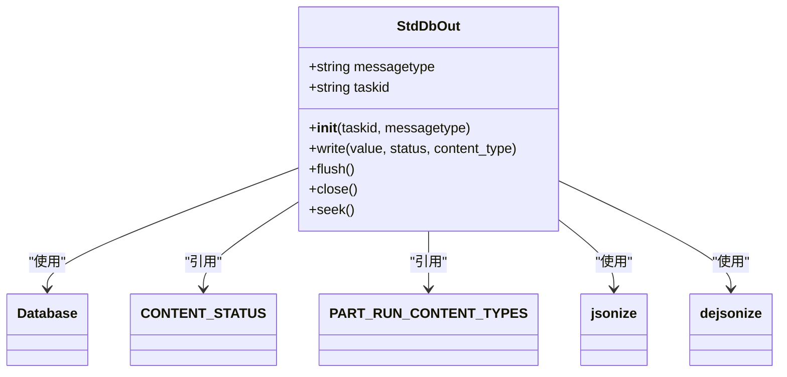
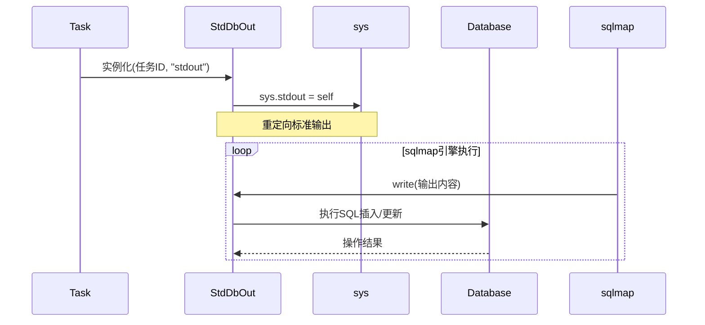
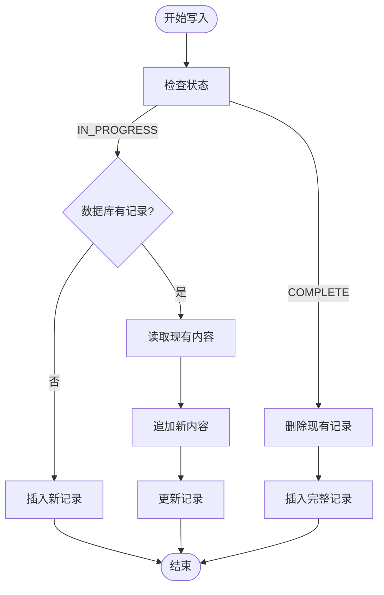
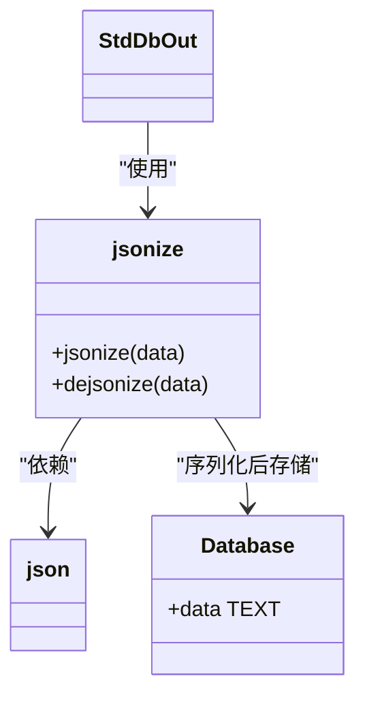
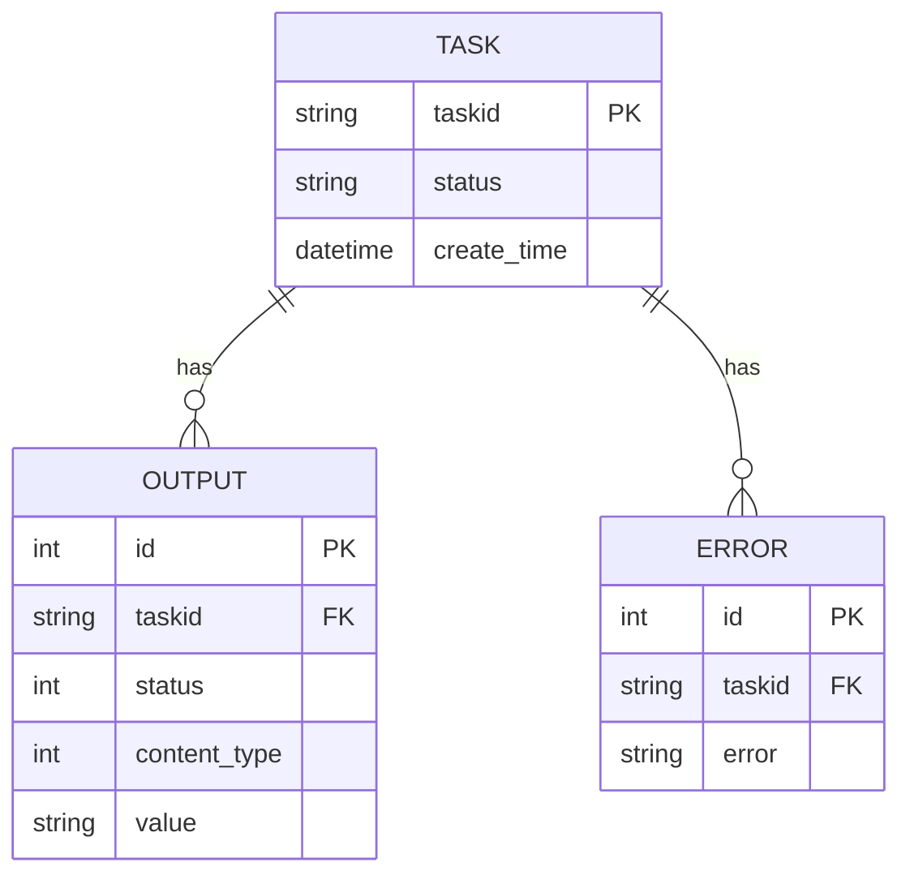

# 标准输出重定向

<cite>
**本文档引用的文件**
- [StdDbOut.py](file://src/backEnd/model/StdDbOut.py)
- [Database.py](file://src/backEnd/model/Database.py)
- [Task.py](file://src/backEnd/model/Task.py)
- [TaskStatus.py](file://src/backEnd/model/TaskStatus.py)
- [enums.py](file://src/backEnd/third_lib/sqlmap/lib/core/enums.py)
- [convert.py](file://src/backEnd/third_lib/sqlmap/lib/core/convert.py)
- [dicts.py](file://src/backEnd/third_lib/sqlmap/lib/core/dicts.py)
</cite>

## 目录
1. [引言](#引言)
2. [核心组件分析](#核心组件分析)
3. [技术原理详解](#技术原理详解)
4. [写入策略分析](#写入策略分析)
5. [数据序列化机制](#数据序列化机制)
6. [实际应用场景](#实际应用场景)
7. [结论](#结论)

## 引言
标准输出重定向机制是sqlmapWebUI系统中的关键组件，负责捕获sqlmap引擎的输出并将其持久化到数据库中。该机制通过重定向sys.stdout和sys.stderr来实现对sqlmap引擎输出的拦截，为任务监控和结果分析提供了基础支持。本文档将深入分析StdDbOut类的实现原理、技术细节和实际应用。

## 核心组件分析

StdDbOut类是标准输出重定向机制的核心实现，位于`src/backEnd/model/StdDbOut.py`文件中。该类通过重写Python的sys.stdout和sys.stderr来捕获sqlmap引擎的输出，并将其写入IPC数据库。

**图表来源**
- [StdDbOut.py](file://src/backEnd/model/StdDbOut.py#L13-L62)
- [Database.py](file://src/backEnd/model/Database.py#L10-L99)

**本节来源**
- [StdDbOut.py](file://src/backEnd/model/StdDbOut.py#L13-L62)

## 技术原理详解

标准输出重定向机制通过重定向Python的sys.stdout和sys.stderr来捕获sqlmap引擎的输出。当StdDbOut类被实例化时，根据messagetype参数决定是重定向标准输出还是标准错误。

**图表来源**
- [StdDbOut.py](file://src/backEnd/model/StdDbOut.py#L14-L23)
- [Task.py](file://src/backEnd/model/Task.py#L258-L296)

**本节来源**
- [StdDbOut.py](file://src/backEnd/model/StdDbOut.py#L14-L23)

## 写入策略分析

StdDbOut类的write()方法实现了智能的写入策略，根据任务状态决定数据的写入方式。该方法支持两种状态：IN_PROGRESS（进行中）和COMPLETE（已完成）。

对于进行中的任务，采用追加模式写入日志：
- 如果数据库中没有对应记录，则插入新记录
- 如果已有记录，则读取现有内容，追加新内容后更新记录

对于已完成的任务，采用覆盖模式写入结果：
- 删除数据库中已有的部分输出记录
- 插入完整的最终输出记录

**图表来源**
- [StdDbOut.py](file://src/backEnd/model/StdDbOut.py#L25-L52)
- [enums.py](file://src/backEnd/third_lib/sqlmap/lib/core/enums.py#L1-L200)

**本节来源**
- [StdDbOut.py](file://src/backEnd/model/StdDbOut.py#L25-L52)

## 数据序列化机制

标准输出重定向机制使用jsonize/dejsonize工具函数处理数据序列化。这些函数位于`src/backEnd/third_lib/sqlmap/lib/core/convert.py`文件中，负责将Python对象转换为JSON字符串存储，以及从JSON字符串还原为Python对象。

**图表来源**
- [convert.py](file://src/backEnd/third_lib/sqlmap/lib/core/convert.py#L118-L137)
- [StdDbOut.py](file://src/backEnd/model/StdDbOut.py#L8-L9)

**本节来源**
- [convert.py](file://src/backEnd/third_lib/sqlmap/lib/core/convert.py#L118-L137)

## 实际应用场景

标准输出重定向机制在任务监控和结果分析中发挥着关键作用。通过将sqlmap引擎的输出持久化到数据库，系统能够实时监控任务进度，分析扫描结果，并提供详细的日志信息。

**图表来源**
- [Database.py](file://src/backEnd/model/Database.py#L74-L78)
- [Task.py](file://src/backEnd/model/Task.py#L49-L66)

**本节来源**
- [Task.py](file://src/backEnd/model/Task.py#L49-L66)

## 结论
标准输出重定向机制通过StdDbOut类实现了对sqlmap引擎输出的高效捕获和持久化。该机制利用Python的sys模块重定向功能，结合智能的写入策略和JSON序列化技术，为系统提供了可靠的日志记录和结果存储能力。通过与数据库的紧密集成，该机制支持实时任务监控、结果分析和故障排查，是sqlmapWebUI系统不可或缺的核心组件。