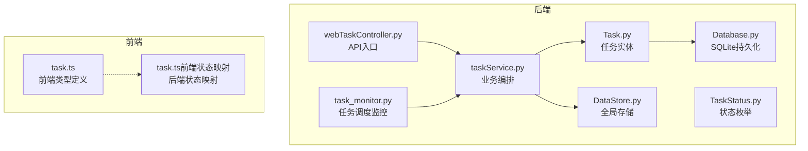
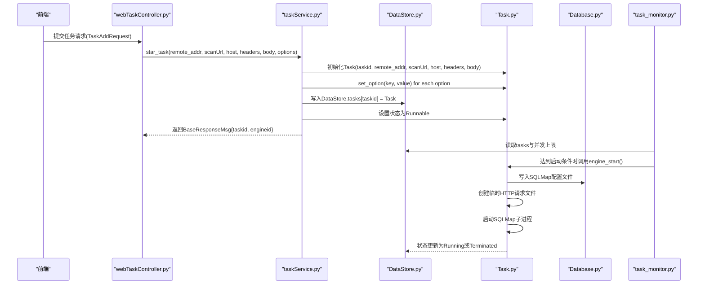
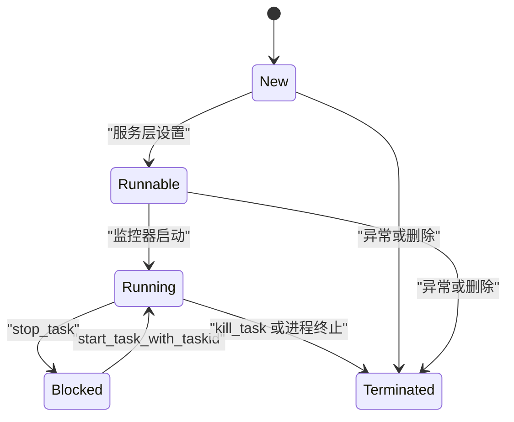
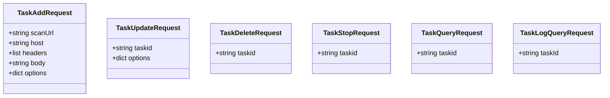
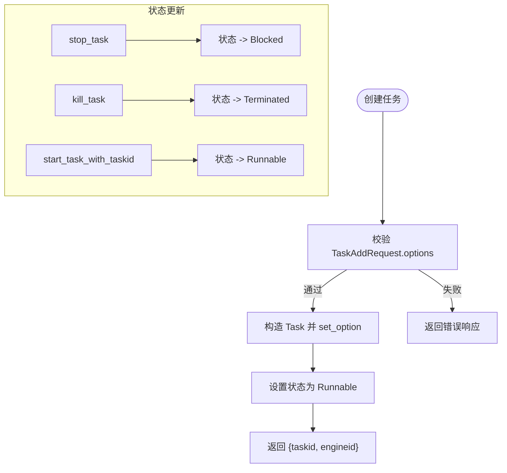
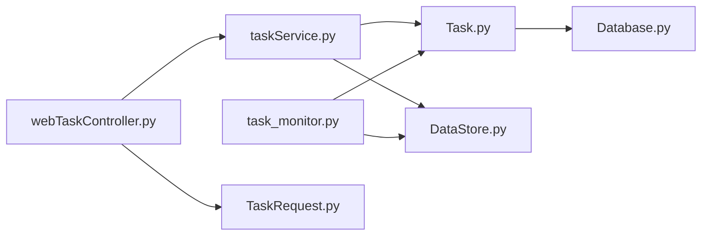

# 任务模型

<cite>
**本文引用的文件**
- [Task.py](file://src/backEnd/model/Task.py)
- [TaskStatus.py](file://src/backEnd/model/TaskStatus.py)
- [TaskRequest.py](file://src/backEnd/model/requestModel/TaskRequest.py)
- [webTaskController.py](file://src/backEnd/api/commonApi/webTaskController.py)
- [taskService.py](file://src/backEnd/service/taskService.py)
- [DataStore.py](file://src/backEnd/model/DataStore.py)
- [Database.py](file://src/backEnd/model/Database.py)
- [task_monitor.py](file://src/backEnd/utils/task_monitor.py)
- [task.ts](file://src/frontEnd/src/types/task.ts)
- [task.ts（前端状态映射）](file://src/frontEnd/src/api/task.ts)
</cite>

## 目录
1. [简介](#简介)
2. [项目结构](#项目结构)
3. [核心组件](#核心组件)
4. [架构总览](#架构总览)
5. [详细组件分析](#详细组件分析)
6. [依赖关系分析](#依赖关系分析)
7. [性能考量](#性能考量)
8. [故障排查指南](#故障排查指南)
9. [结论](#结论)
10. [附录](#附录)

## 简介
本文件围绕任务模型进行系统化文档化，覆盖以下方面：
- Task 实体的完整属性集：任务ID、目标URL、扫描参数、创建时间、更新时间等字段的数据类型与业务含义
- TaskStatus 枚举的状态值及状态转换逻辑
- TaskRequest 请求模型的结构设计与参数校验
- 任务模型与扫描预设、扫描结果、持久化存储之间的关系
- Pydantic 在请求验证与响应序列化中的应用
- 任务创建、状态更新、查询的实际实现路径与流程图

## 项目结构
后端采用“模型-服务-控制器”三层结构，任务模型位于 model 层，服务层负责业务编排，控制器负责 API 入口与请求参数校验，持久化通过 SQLite 数据库完成。

图表来源
- [webTaskController.py](file://src/backEnd/api/commonApi/webTaskController.py#L1-L91)
- [taskService.py](file://src/backEnd/service/taskService.py#L1-L120)
- [Task.py](file://src/backEnd/model/Task.py#L1-L120)
- [TaskStatus.py](file://src/backEnd/model/TaskStatus.py#L1-L9)
- [DataStore.py](file://src/backEnd/model/DataStore.py#L1-L38)
- [Database.py](file://src/backEnd/model/Database.py#L1-L99)
- [task_monitor.py](file://src/backEnd/utils/task_monitor.py#L1-L94)
- [task.ts](file://src/frontEnd/src/types/task.ts#L1-L122)
- [task.ts（前端状态映射）](file://src/frontEnd/src/api/task.ts#L63-L101)

章节来源
- [webTaskController.py](file://src/backEnd/api/commonApi/webTaskController.py#L1-L91)
- [taskService.py](file://src/backEnd/service/taskService.py#L1-L120)
- [Task.py](file://src/backEnd/model/Task.py#L1-L120)
- [TaskStatus.py](file://src/backEnd/model/TaskStatus.py#L1-L9)
- [DataStore.py](file://src/backEnd/model/DataStore.py#L1-L38)
- [Database.py](file://src/backEnd/model/Database.py#L1-L99)
- [task_monitor.py](file://src/backEnd/utils/task_monitor.py#L1-L94)
- [task.ts](file://src/frontEnd/src/types/task.ts#L1-L122)
- [task.ts（前端状态映射）](file://src/frontEnd/src/api/task.ts#L63-L101)

## 核心组件
- Task 实体：封装一次扫描任务的生命周期与运行时状态，负责参数初始化、请求头规则应用、SQLMap 引擎进程控制、临时请求文件生成与持久化配置写入。
- TaskStatus 枚举：定义任务状态集合，用于服务层与监控器的状态流转判断。
- TaskRequest 请求模型：使用 Pydantic 定义任务创建与查询的输入参数，包含字段约束与描述。
- taskService：统一编排任务创建、状态变更、查询与清理，负责与 DataStore、Task、Database 的交互。
- DataStore：全局共享的内存存储与锁，维护任务集合、数据库连接、会话头管理器等。
- Database：SQLite 数据库封装，提供并发安全的执行与初始化能力，并维护 logs/data/errors 表。
- task_monitor：任务调度监控器，依据 CPU 使用率与核心数动态限制并发任务数，驱动任务从 Runnable 到 Running 的启动。

章节来源
- [Task.py](file://src/backEnd/model/Task.py#L1-L120)
- [TaskStatus.py](file://src/backEnd/model/TaskStatus.py#L1-L9)
- [TaskRequest.py](file://src/backEnd/model/requestModel/TaskRequest.py#L1-L57)
- [taskService.py](file://src/backEnd/service/taskService.py#L1-L120)
- [DataStore.py](file://src/backEnd/model/DataStore.py#L1-L38)
- [Database.py](file://src/backEnd/model/Database.py#L1-L99)
- [task_monitor.py](file://src/backEnd/utils/task_monitor.py#L1-L94)

## 架构总览
下图展示了从 Web 控制器到服务层、任务实体、数据库与监控器的整体调用链路。

图表来源
- [webTaskController.py](file://src/backEnd/api/commonApi/webTaskController.py#L1-L91)
- [taskService.py](file://src/backEnd/service/taskService.py#L58-L120)
- [Task.py](file://src/backEnd/model/Task.py#L258-L333)
- [DataStore.py](file://src/backEnd/model/DataStore.py#L1-L38)
- [Database.py](file://src/backEnd/model/Database.py#L1-L99)
- [task_monitor.py](file://src/backEnd/utils/task_monitor.py#L36-L94)

## 详细组件分析

### Task 实体与属性
- 关键属性
  - taskid: 任务唯一标识符（字符串）
  - scanUrl: 目标URL（字符串）
  - host: 目标主机（字符串）
  - headers: 请求头列表（字符串数组）
  - body: 请求体（字符串）
  - remote_addr: 客户端IP（字符串）
  - status: 任务状态（TaskStatus 枚举）
  - create_datetime: 任务创建时间（datetime）
  - start_datetime: 任务开始执行时间（datetime）
  - options: 扫描参数字典（AttribDict，来源于 SQLMap 的 optDict）
  - process: SQLMap 子进程对象
  - output_directory: 输出目录路径
  - _original_options: 原始参数快照
  - _header_rules_applied: 是否已应用请求头规则
  - _request_file_path: 临时HTTP请求文件路径
- 初始化与参数
  - initialize_options: 基于 SQLMap 的 optDict 与默认值初始化 options，并设置 api、taskid、database、batch、disableColoring、eta 等关键选项
  - set_option/get_option/get_options/reset_options: 参数的增删改查与重置
- 请求头规则应用
  - apply_header_rules: 动态导入 HeaderRuleService、HeaderProcessor、DataStore，获取持久化规则与会话头，合并处理后写回 options.headers
- HTTP请求文件生成
  - _build_raw_http_request: 根据 headers/body/host 生成标准HTTP报文
  - _create_request_file: 写入临时文件，返回文件路径
- SQLMap 引擎控制
  - engine_start/engine_stop/engine_kill/engine_process/engine_get_id/engine_get_returncode/engine_has_terminated: 子进程生命周期管理
- 临时文件目录
  - get_http_request_temp_dir/set_http_request_temp_dir/get_default_http_request_temp_dir: 支持自定义临时目录

章节来源
- [Task.py](file://src/backEnd/model/Task.py#L1-L120)
- [Task.py](file://src/backEnd/model/Task.py#L121-L257)
- [Task.py](file://src/backEnd/model/Task.py#L258-L333)

### TaskStatus 枚举与状态转换
- 状态定义
  - New: 新建
  - Runnable: 可运行（等待调度）
  - Running: 运行中
  - Blocked: 已阻塞
  - Terminated: 已终止
- 转换逻辑
  - 创建任务：初始化为 New；随后由服务层设置为 Runnable
  - 启动任务：监控器在满足并发与时间窗口后，调用 Task.engine_start，状态切换为 Running
  - 结束任务：stop_task 将 Running/New/Runnable 设置为 Blocked；kill_task 将 Running 设置为 Terminated
  - 清理任务：delete_task 若处于 Running，先 kill，再移除任务
  - 列表查询：对于 Running/New/Runnable/Bloked 状态直接使用原值；否则根据 engine_has_terminated 判定为 Running 或 Terminated

图表来源
- [TaskStatus.py](file://src/backEnd/model/TaskStatus.py#L1-L9)
- [taskService.py](file://src/backEnd/service/taskService.py#L181-L229)
- [taskService.py](file://src/backEnd/service/taskService.py#L230-L239)
- [taskService.py](file://src/backEnd/service/taskService.py#L89-L101)
- [task_monitor.py](file://src/backEnd/utils/task_monitor.py#L36-L94)

章节来源
- [TaskStatus.py](file://src/backEnd/model/TaskStatus.py#L1-L9)
- [taskService.py](file://src/backEnd/service/taskService.py#L181-L239)
- [task_monitor.py](file://src/backEnd/utils/task_monitor.py#L36-L94)

### TaskRequest 请求模型与参数校验
- TaskAddRequest
  - 字段：scanUrl、host、headers、body、options
  - 校验：options 必填且为字典；headers 为列表；body 为字符串
- TaskUpdateRequest
  - 字段：taskid、options
- TaskDeleteRequest/TaskStopRequest
  - 字段：taskid（长度约束）
- TaskQueryRequest/TaskLogQueryRequest
  - 字段：taskid（长度约束）

图表来源
- [TaskRequest.py](file://src/backEnd/model/requestModel/TaskRequest.py#L1-L57)

章节来源
- [TaskRequest.py](file://src/backEnd/model/requestModel/TaskRequest.py#L1-L57)

### 任务创建、状态更新与查询流程
- 任务创建
  - Web 控制器接收 TaskAddRequest，调用 taskService.star_task
  - 服务层校验 options，生成 taskid，构造 Task，逐项 set_option，设置状态为 Runnable，返回包含 taskid 与 engineid 的响应
- 状态更新
  - stop_task：Running/New/Runnable -> Blocked
  - kill_task：Running -> Terminated
  - start_task_with_taskid：Blocked -> Runnable
  - delete_task：若 Running 先 kill，再移除
- 查询
  - list_task：遍历 DataStore.tasks，统计 errors/logs/data 数量，按状态映射返回
  - find_task_by_*：按 URL、Host、Header 关键词、Body 关键词检索
  - get_task_scan_options：返回任务实际生效的非空选项
  - get_task_errors_by_taskId/get_task_http_request_info：从数据库与 Task 对象读取

图表来源
- [webTaskController.py](file://src/backEnd/api/commonApi/webTaskController.py#L19-L91)
- [taskService.py](file://src/backEnd/service/taskService.py#L58-L120)
- [taskService.py](file://src/backEnd/service/taskService.py#L181-L239)

章节来源
- [webTaskController.py](file://src/backEnd/api/commonApi/webTaskController.py#L19-L91)
- [taskService.py](file://src/backEnd/service/taskService.py#L58-L120)
- [taskService.py](file://src/backEnd/service/taskService.py#L181-L239)

### 任务模型与其他模型的关系
- 与扫描预设（ScanPreset）的关系
  - 任务本身不直接持有 preset_id；扫描参数 options 由 TaskAddRequest.options 提供，与预设的 ScanOptions 字段一一对应（名称与范围一致），可通过预设服务在前端选择后转化为 options 传递给任务
- 与扫描结果的连接
  - 任务运行期间产生的日志、载荷、错误分别持久化到 logs、data、errors 表；服务层提供查询接口
- 与持久化存储
  - Database 负责 SQLite 初始化与并发安全执行；Task 在启动时将 options 写入 SQLMap 配置文件，供子进程使用

章节来源
- [ScanPreset.py](file://src/backEnd/model/ScanPreset.py#L1-L120)
- [Database.py](file://src/backEnd/model/Database.py#L72-L99)
- [Task.py](file://src/backEnd/model/Task.py#L271-L297)

### Pydantic 在请求验证与响应序列化中的应用
- 请求验证
  - TaskRequest 中使用 Pydantic 的 BaseModel 与 Field 定义字段约束（如最小/最大长度、必填、类型），在控制器层自动进行参数校验
- 响应序列化
  - 服务层返回 BaseResponseMsg，前端通过 task.ts 类型定义与 task.ts（前端状态映射）进行消费与状态转换

章节来源
- [TaskRequest.py](file://src/backEnd/model/requestModel/TaskRequest.py#L1-L57)
- [webTaskController.py](file://src/backEnd/api/commonApi/webTaskController.py#L19-L91)
- [task.ts](file://src/frontEnd/src/types/task.ts#L1-L122)
- [task.ts（前端状态映射）](file://src/frontEnd/src/api/task.ts#L63-L101)

### 任务数据的持久化存储
- 数据库表
  - logs：记录任务日志（datetime、level、message）
  - data：记录扫描载荷（status、content_type、value）
  - errors：记录错误信息（error）
- 写入与读取
  - Task.engine_start 时保存 SQLMap 配置文件；服务层在查询任务列表时统计各表计数
  - 服务层提供 get_task_errors_by_taskId、get_payload_detail_by_task_id、get_task_scan_options 等接口

章节来源
- [Database.py](file://src/backEnd/model/Database.py#L72-L99)
- [taskService.py](file://src/backEnd/service/taskService.py#L102-L177)
- [taskService.py](file://src/backEnd/service/taskService.py#L396-L443)
- [taskService.py](file://src/backEnd/service/taskService.py#L444-L485)

## 依赖关系分析
- 组件耦合
  - Task 依赖 TaskStatus、Database、第三方 SQLMap 库
  - taskService 依赖 Task、DataStore、TaskStatus、RESTAPI_UNSUPPORTED_OPTIONS
  - webTaskController 依赖 TaskAddRequest、taskService、BaseResponseMsg
  - task_monitor 依赖 DataStore、TaskStatus、psutil、os
- 外部依赖
  - SQLite（Database）
  - SQLMap（third_lib/sqlmap）
  - psutil（任务并发监控）

图表来源
- [webTaskController.py](file://src/backEnd/api/commonApi/webTaskController.py#L1-L91)
- [taskService.py](file://src/backEnd/service/taskService.py#L1-L120)
- [Task.py](file://src/backEnd/model/Task.py#L1-L120)
- [Database.py](file://src/backEnd/model/Database.py#L1-L99)
- [DataStore.py](file://src/backEnd/model/DataStore.py#L1-L38)
- [task_monitor.py](file://src/backEnd/utils/task_monitor.py#L1-L94)
- [TaskRequest.py](file://src/backEnd/model/requestModel/TaskRequest.py#L1-L57)

章节来源
- [webTaskController.py](file://src/backEnd/api/commonApi/webTaskController.py#L1-L91)
- [taskService.py](file://src/backEnd/service/taskService.py#L1-L120)
- [Task.py](file://src/backEnd/model/Task.py#L1-L120)
- [Database.py](file://src/backEnd/model/Database.py#L1-L99)
- [DataStore.py](file://src/backEnd/model/DataStore.py#L1-L38)
- [task_monitor.py](file://src/backEnd/utils/task_monitor.py#L1-L94)
- [TaskRequest.py](file://src/backEnd/model/requestModel/TaskRequest.py#L1-L57)

## 性能考量
- 并发控制
  - 通过 task_monitor 动态计算最大并发任务数，结合 CPU 使用率与逻辑核心数，避免资源争用导致的性能抖动
- I/O 与锁
  - Database 使用线程锁与重试机制处理 SQLite 锁竞争；DataStore.tasks_lock 保护任务集合的并发访问
- 临时文件与进程
  - 任务启动前生成临时 HTTP 请求文件，避免重复解析；SQLMap 子进程通过 Popen 管理，支持 terminate/kill

章节来源
- [task_monitor.py](file://src/backEnd/utils/task_monitor.py#L1-L35)
- [Database.py](file://src/backEnd/model/Database.py#L35-L71)
- [DataStore.py](file://src/backEnd/model/DataStore.py#L1-L38)
- [Task.py](file://src/backEnd/model/Task.py#L271-L333)

## 故障排查指南
- 任务创建失败
  - 检查 TaskAddRequest.options 是否缺失或类型不符；查看 webTaskController 的日志与返回
- 任务无法启动
  - 查看 task_monitor 是否达到并发上限；确认 Task.engine_start 是否成功写入配置文件与创建请求文件
- 任务状态异常
  - 使用 list_task 检查状态映射逻辑；若 engine_has_terminated 为真，状态会被归类为 Terminated
- 日志与错误查询
  - 使用 get_task_errors_by_taskId、get_task_scan_options、get_task_http_request_info 排查问题

章节来源
- [webTaskController.py](file://src/backEnd/api/commonApi/webTaskController.py#L42-L91)
- [taskService.py](file://src/backEnd/service/taskService.py#L102-L177)
- [taskService.py](file://src/backEnd/service/taskService.py#L396-L485)
- [task_monitor.py](file://src/backEnd/utils/task_monitor.py#L36-L94)

## 结论
该任务模型以 Task 为核心，结合 TaskStatus 枚举与 taskService 的编排能力，实现了从请求参数校验、任务创建、状态流转到持久化查询的完整闭环。通过 Pydantic 的强类型约束与前端类型定义，保证了前后端契约清晰；借助 task_monitor 的动态并发控制与 Database 的并发安全封装，提升了整体系统的稳定性与可扩展性。

## 附录
- 前端类型与状态映射
  - 前端定义 TaskStatus 枚举与 Task 接口，后端状态字符串通过 task.ts（前端状态映射）转换为前端枚举，便于 UI 展示与交互

章节来源
- [task.ts](file://src/frontEnd/src/types/task.ts#L1-L122)
- [task.ts（前端状态映射）](file://src/frontEnd/src/api/task.ts#L63-L101)