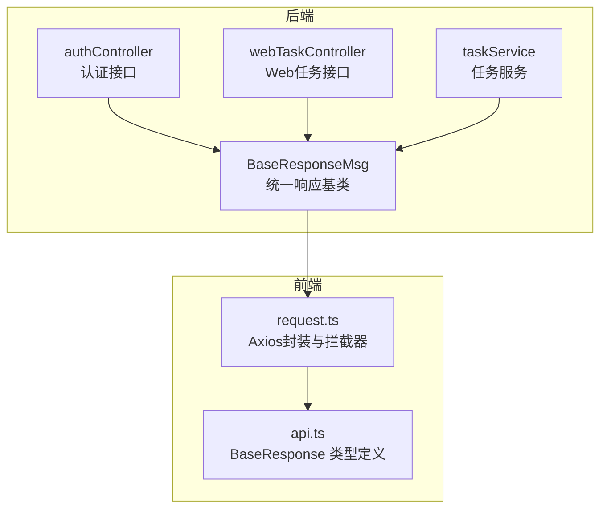
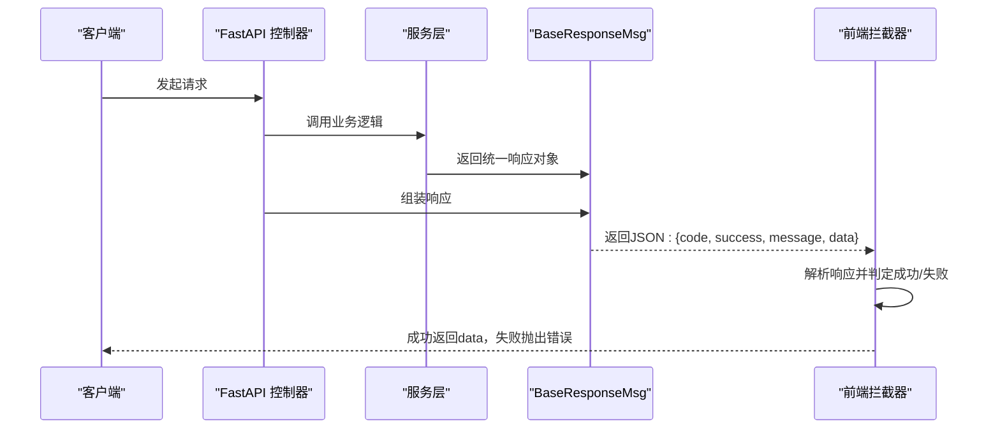
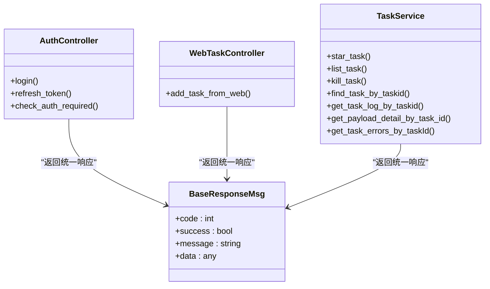

# 基础模型

<cite>
**本文引用的文件**
- [BaseResponseMsg.py](file://src/backEnd/model/BaseResponseMsg.py)
- [authController.py](file://src/backEnd/api/commonApi/authController.py)
- [webTaskController.py](file://src/backEnd/api/commonApi/webTaskController.py)
- [taskService.py](file://src/backEnd/service/taskService.py)
- [request.ts](file://src/frontEnd/src/api/request.ts)
- [api.ts](file://src/frontEnd/src/types/api.ts)
- [AGENTS.md](file://AGENTS.md)
</cite>

## 目录
1. [简介](#简介)
2. [项目结构](#项目结构)
3. [核心组件](#核心组件)
4. [架构总览](#架构总览)
5. [详细组件分析](#详细组件分析)
6. [依赖关系分析](#依赖关系分析)
7. [性能考量](#性能考量)
8. [故障排查指南](#故障排查指南)
9. [结论](#结论)

## 简介
本文件聚焦于后端基础响应模型 BaseResponseMsg 的设计理念与结构组成，系统阐述 code、message、data 三字段的语义与使用规范，并说明统一响应格式在前后端交互中的重要性。文档进一步解释该模型如何被具体业务响应模型复用与扩展，确保 API 响应的一致性与可预测性；并通过真实 API 调用示例展示成功与错误响应的 JSON 结构；最后讨论错误码设计规范与分类体系，以及该模型在异常处理与错误传播机制中的作用。

## 项目结构
- 后端基础模型位于 src/backEnd/model，其中包含统一响应基类 BaseResponseMsg。
- 控制器层（FastAPI）在 src/backEnd/api/commonApi 下，广泛使用 BaseResponseMsg 返回统一格式。
- 服务层（taskService）在 src/backEnd/service 下，内部也大量返回 BaseResponseMsg，便于上层控制器复用。
- 前端类型定义位于 src/frontEnd/src/types，声明了与后端一致的响应结构 BaseResponse<T>，并在请求封装中按统一格式解析与处理。

图表来源
- [BaseResponseMsg.py](file://src/backEnd/model/BaseResponseMsg.py#L1-L21)
- [authController.py](file://src/backEnd/api/commonApi/authController.py#L1-L150)
- [webTaskController.py](file://src/backEnd/api/commonApi/webTaskController.py#L1-L91)
- [taskService.py](file://src/backEnd/service/taskService.py#L1-L535)
- [request.ts](file://src/frontEnd/src/api/request.ts#L1-L231)
- [api.ts](file://src/frontEnd/src/types/api.ts#L1-L28)

章节来源
- [BaseResponseMsg.py](file://src/backEnd/model/BaseResponseMsg.py#L1-L21)
- [authController.py](file://src/backEnd/api/commonApi/authController.py#L1-L150)
- [webTaskController.py](file://src/backEnd/api/commonApi/webTaskController.py#L1-L91)
- [taskService.py](file://src/backEnd/service/taskService.py#L1-L535)
- [request.ts](file://src/frontEnd/src/api/request.ts#L1-L231)
- [api.ts](file://src/frontEnd/src/types/api.ts#L1-L28)

## 核心组件
- BaseResponseMsg：继承 FastAPI JSONResponse，统一输出 code、success、message、data 四字段，便于前后端约定一致的响应结构。
- 控制器层：在各业务接口中构造 BaseResponseMsg 并返回，保证响应格式一致。
- 服务层：在复杂业务逻辑中返回 BaseResponseMsg，便于控制器复用与统一处理。
- 前端拦截器：基于 BaseResponse<T> 类型定义，对响应进行统一解析与错误处理。

章节来源
- [BaseResponseMsg.py](file://src/backEnd/model/BaseResponseMsg.py#L1-L21)
- [authController.py](file://src/backEnd/api/commonApi/authController.py#L1-L150)
- [webTaskController.py](file://src/backEnd/api/commonApi/webTaskController.py#L1-L91)
- [taskService.py](file://src/backEnd/service/taskService.py#L1-L535)
- [request.ts](file://src/frontEnd/src/api/request.ts#L1-L231)
- [api.ts](file://src/frontEnd/src/types/api.ts#L1-L28)

## 架构总览
统一响应模型贯穿“控制器 -> 服务 -> 基类 -> 前端拦截器”的链路，形成前后端一致的契约，降低联调成本，提升可维护性与可观测性。

图表来源
- [authController.py](file://src/backEnd/api/commonApi/authController.py#L1-L150)
- [webTaskController.py](file://src/backEnd/api/commonApi/webTaskController.py#L1-L91)
- [taskService.py](file://src/backEnd/service/taskService.py#L1-L535)
- [BaseResponseMsg.py](file://src/backEnd/model/BaseResponseMsg.py#L1-L21)
- [request.ts](file://src/frontEnd/src/api/request.ts#L1-L231)

## 详细组件分析

### BaseResponseMsg 设计与字段规范
- 字段定义
  - code：业务状态码，建议采用 HTTP 状态码区间划分：2xx 表示成功，4xx 表示客户端错误，5xx 表示服务端错误；也可自定义非 HTTP 码，但需保持一致性。
  - success：布尔标志，指示本次请求是否成功。
  - message：人类可读的提示信息，用于错误说明或成功反馈。
  - data：承载业务数据，可为空对象或空数组，表示无数据。
- 设计要点
  - 统一输出结构，便于前端拦截器按约定解析。
  - 保留 Python 属性 self.code/self.success/self.msg/self.data，便于在代码中直接访问。
  - status_code 在构造时固定为 200，因为 HTTP 状态码与业务状态码分离，避免混淆。

章节来源
- [BaseResponseMsg.py](file://src/backEnd/model/BaseResponseMsg.py#L1-L21)

### 控制器层的使用范式
- 认证接口（authController）
  - 登录、刷新令牌、检查认证需求等接口均返回 BaseResponseMsg，成功时 success=true，失败时 success=false 并设置合适的 code 与 message。
- Web 任务接口（webTaskController）
  - 对输入参数进行校验（如 options 必填），校验失败返回 400 对应的 code 与 message；业务异常通过异常捕获返回 500 对应的 code 与 message。

章节来源
- [authController.py](file://src/backEnd/api/commonApi/authController.py#L1-L150)
- [webTaskController.py](file://src/backEnd/api/commonApi/webTaskController.py#L1-L91)

### 服务层的统一返回
- 任务服务（taskService）
  - 在多种业务场景中返回 BaseResponseMsg，涵盖数据库连接异常、任务不存在、日志获取失败等情形，确保上层控制器无需重复封装。
  - 通过 validate_options 等前置校验，提前返回错误响应，减少无效调用。

章节来源
- [taskService.py](file://src/backEnd/service/taskService.py#L1-L535)

### 前端拦截器与类型约束
- 类型定义（api.ts）
  - BaseResponse<T> 明确四字段语义，与后端保持一致。
- 请求封装（request.ts）
  - 响应拦截器依据 code 与 success 判定成功/失败，成功时返回 data，失败时统一提示 message 并 reject。
  - 对 401、网络错误、超时等进行差异化处理，增强健壮性。

章节来源
- [api.ts](file://src/frontEnd/src/types/api.ts#L1-L28)
- [request.ts](file://src/frontEnd/src/api/request.ts#L1-L231)

### 错误码设计规范与分类体系
- 建议采用如下分类：
  - 2xx：成功（如 200、201、204 等）
  - 4xx：客户端错误（如 400 参数错误、401 未认证、403 权限不足、404 资源不存在、409 冲突等）
  - 5xx：服务端错误（如 500 内部错误、502 网关错误、503 服务不可用、504 网关超时等）
- 自定义业务错误码
  - 可在 1000+ 区间内细分业务错误（例如 1001 参数缺失、1002 数据库连接失败等），并与 message 协同，便于前端精准提示与定位问题。
- 与 HTTP 状态码的关系
  - 建议将 HTTP 状态码与业务状态码解耦：HTTP 仍遵循标准，业务 code 用于更细粒度的业务语义。

章节来源
- [taskService.py](file://src/backEnd/service/taskService.py#L1-L535)
- [webTaskController.py](file://src/backEnd/api/commonApi/webTaskController.py#L1-L91)
- [authController.py](file://src/backEnd/api/commonApi/authController.py#L1-L150)

### 异常处理与错误传播机制
- 后端
  - 控制器层捕获异常并返回统一错误响应；服务层在早期校验失败时直接返回 BaseResponseMsg，避免异常冒泡。
- 前端
  - 拦截器统一处理业务错误与 HTTP 错误，结合 message 提示用户；对 401 在远程模式下触发登出流程，在本地模式下可选择忽略。
  - 对 GET 请求在网络错误或特定 5xx 状态码时进行有限重试，提升鲁棒性。

章节来源
- [taskService.py](file://src/backEnd/service/taskService.py#L1-L535)
- [webTaskController.py](file://src/backEnd/api/commonApi/webTaskController.py#L1-L91)
- [request.ts](file://src/frontEnd/src/api/request.ts#L1-L231)

### 统一响应格式在前后端交互中的重要性
- 规范化契约：前后端共享同一响应结构，减少解析歧义与联调成本。
- 可预测性：无论成功还是失败，字段结构一致，便于前端统一处理。
- 可维护性：集中定义与修改响应格式，一处变更影响全链路。
- 可观测性：统一的 code 与 message 便于日志采集与监控告警。

章节来源
- [api.ts](file://src/frontEnd/src/types/api.ts#L1-L28)
- [request.ts](file://src/frontEnd/src/api/request.ts#L1-L231)
- [AGENTS.md](file://AGENTS.md#L191-L231)

### 实际 API 调用示例（JSON 结构）
以下示例展示成功与错误响应的典型 JSON 结构（字段名与后端一致）。注意：以下为结构示意，非具体代码片段。

- 成功响应（code 在 2xx 区间，success 为 true）
  - {
      "code": 200,
      "success": true,
      "message": "登录成功",
      "data": {
        "token": "local_token_YYYYMMDDHHMMSS",
        "userInfo": {
          "username": "admin",
          "email": "admin@local",
          "role": "admin"
        }
      }
    }

- 错误响应（code 为 4xx/5xx 或自定义业务错误码，success 为 false）
  - {
      "code": 400,
      "success": false,
      "message": "options is required",
      "data": null
    }

- 成功响应（任务创建）
  - {
      "code": 200,
      "success": true,
      "message": "success",
      "data": {
        "engineid": "xxxx",
        "taskid": "yyyy"
      }
    }

- 错误响应（任务不存在）
  - {
      "code": 404,
      "success": false,
      "message": "taskId not found",
      "data": null
    }

章节来源
- [authController.py](file://src/backEnd/api/commonApi/authController.py#L1-L150)
- [webTaskController.py](file://src/backEnd/api/commonApi/webTaskController.py#L1-L91)
- [taskService.py](file://src/backEnd/service/taskService.py#L1-L535)

## 依赖关系分析
- 控制器依赖 BaseResponseMsg 生成统一响应。
- 服务层同样依赖 BaseResponseMsg，向上层控制器复用。
- 前端类型定义与拦截器依赖后端响应结构，形成闭环。

图表来源
- [BaseResponseMsg.py](file://src/backEnd/model/BaseResponseMsg.py#L1-L21)
- [authController.py](file://src/backEnd/api/commonApi/authController.py#L1-L150)
- [webTaskController.py](file://src/backEnd/api/commonApi/webTaskController.py#L1-L91)
- [taskService.py](file://src/backEnd/service/taskService.py#L1-L535)

## 性能考量
- 统一响应模型本身开销极低，主要收益在于减少解析与分支判断的复杂度。
- 前端拦截器对 GET 请求进行有限重试，有助于缓解瞬时网络抖动带来的失败率。
- 建议在高频接口中避免在 data 中传输超大数据，必要时采用分页或流式传输策略。

## 故障排查指南
- 前端提示 message 但 data 为空
  - 检查后端是否返回 success=false 或 code 不在 2xx 区间；确认拦截器逻辑是否正确处理。
- 401 未授权
  - 远程模式下会清除本地认证信息并提示重新登录；本地模式可选择忽略。
- 网络错误/超时
  - 检查后端服务状态与网络连通性；确认前端重试策略是否生效。
- 业务错误码不一致
  - 统一在服务层与控制器层使用 BaseResponseMsg 并核对 code 与 message 的映射关系。

章节来源
- [request.ts](file://src/frontEnd/src/api/request.ts#L1-L231)
- [taskService.py](file://src/backEnd/service/taskService.py#L1-L535)

## 结论
BaseResponseMsg 作为统一响应基类，通过标准化的 code、success、message、data 字段，实现了前后端一致的契约与可预测的交互体验。控制器与服务层广泛使用该模型，既简化了业务实现，又提升了系统的可观测性与可维护性。配合前端拦截器的统一解析与错误处理，整体链路更加稳健。建议在后续迭代中持续完善错误码分类与 message 的国际化与本地化，进一步提升用户体验与运维效率。