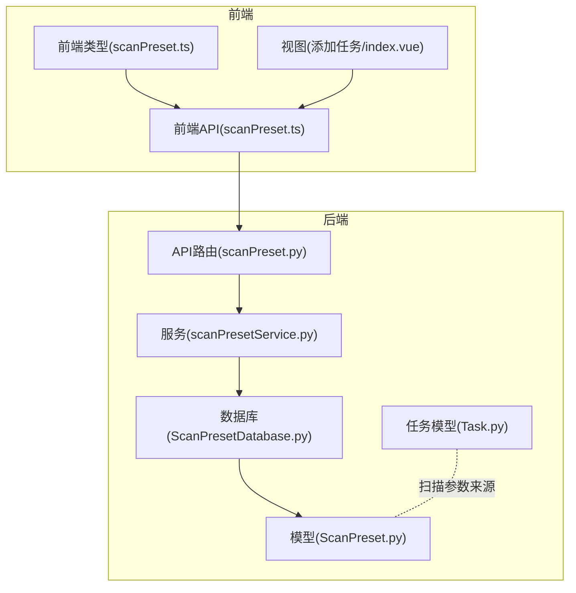
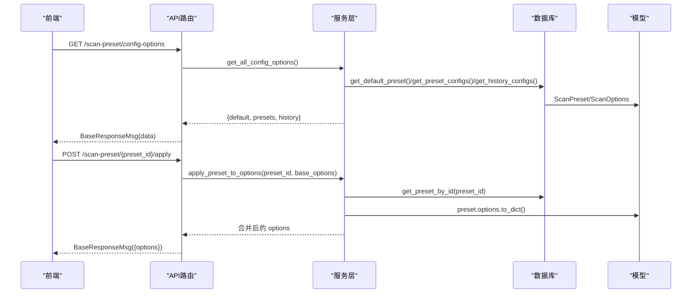
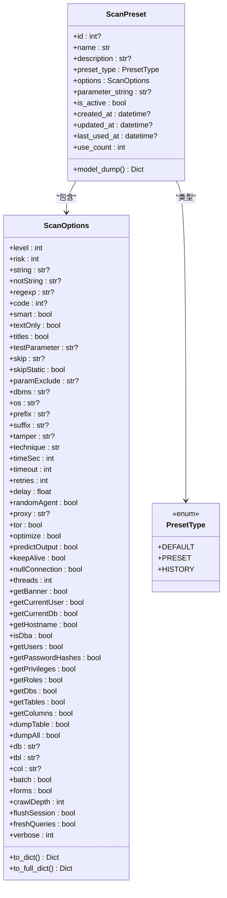
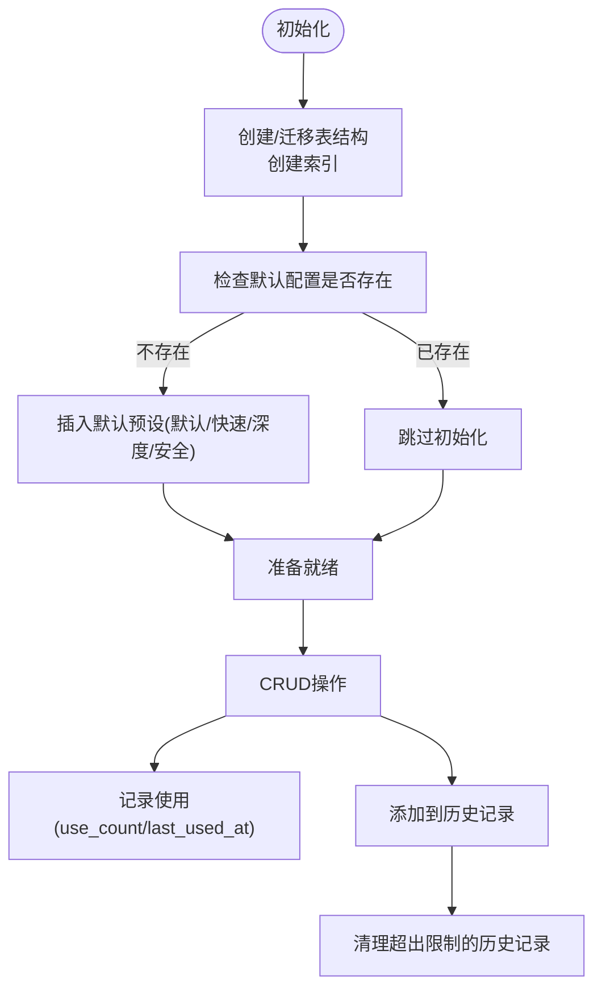
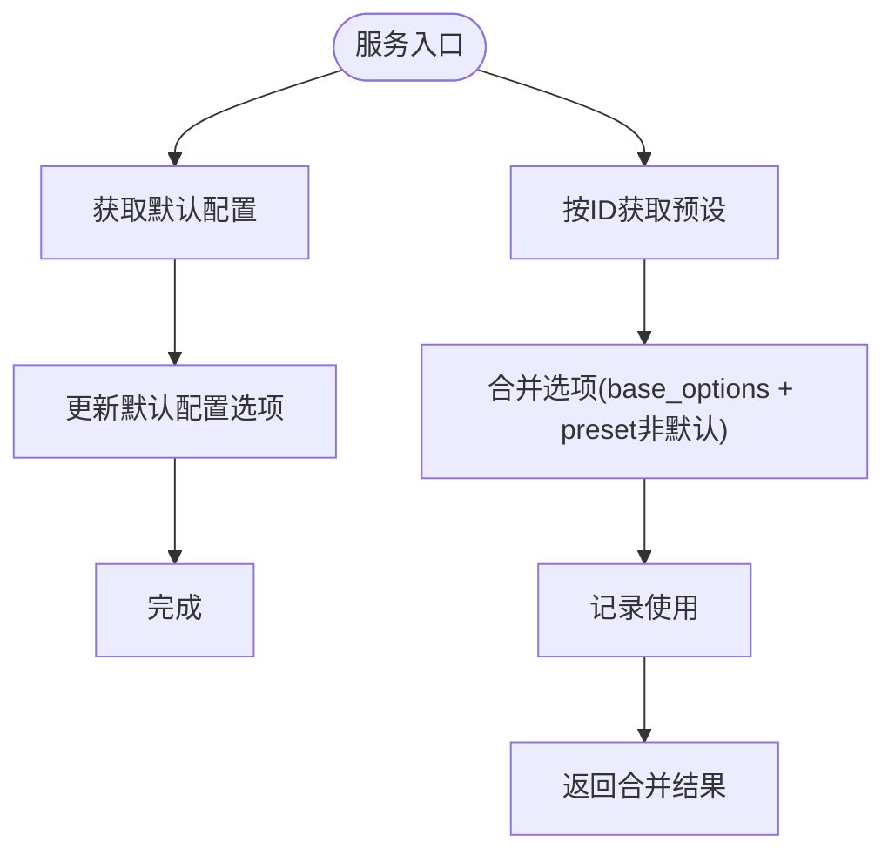
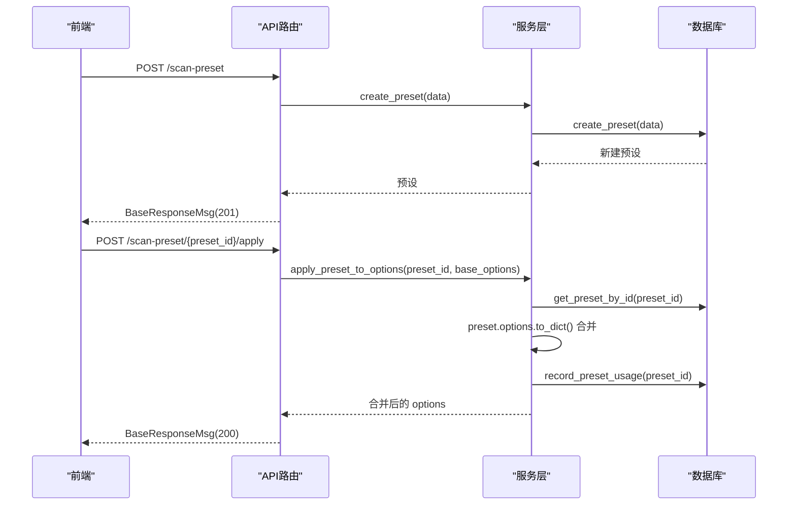
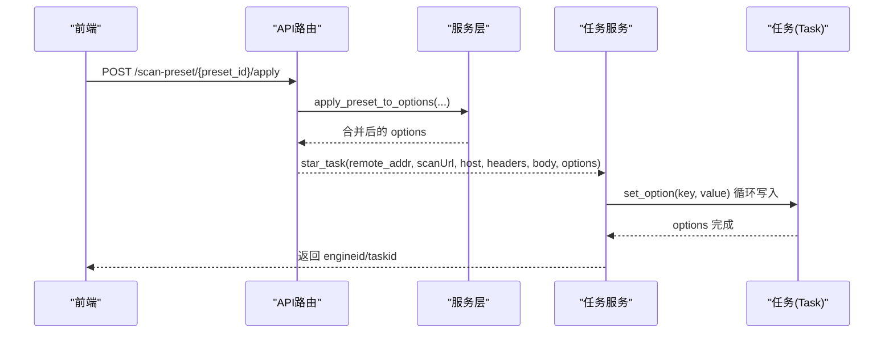
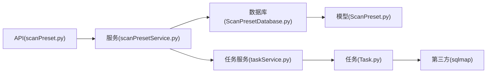

# 扫描配置模型

<cite>
**本文引用的文件**
- [ScanPreset.py](file://src/backEnd/model/ScanPreset.py)
- [ScanPresetDatabase.py](file://src/backEnd/model/ScanPresetDatabase.py)
- [scanPresetService.py](file://src/backEnd/service/scanPresetService.py)
- [scanPreset.py](file://src/backEnd/api/commonApi/scanPreset.py)
- [Task.py](file://src/backEnd/model/Task.py)
- [TaskRequest.py](file://src/backEnd/model/requestModel/TaskRequest.py)
- [taskService.py](file://src/backEnd/service/taskService.py)
- [scanPreset.ts](file://src/frontEnd/src/types/scanPreset.ts)
- [scanPreset.ts(api)](file://src/frontEnd/src/api/scanPreset.ts)
- [index.vue(添加任务)](file://src/frontEnd/src/views/AddTask/index.vue)
</cite>

## 目录
1. [简介](#简介)
2. [项目结构](#项目结构)
3. [核心组件](#核心组件)
4. [架构总览](#架构总览)
5. [详细组件分析](#详细组件分析)
6. [依赖关系分析](#依赖关系分析)
7. [性能考量](#性能考量)
8. [故障排查指南](#故障排查指南)
9. [结论](#结论)
10. [附录](#附录)

## 简介
本文件系统化梳理“扫描配置模型”，围绕 ScanPreset 实体的属性结构、默认值、配置存储仓库设计模式与 CRUD 实现、与任务模型的关联关系、配置继承与优先级策略，以及前后端协作流程进行深入说明，并提供典型用例帮助读者快速落地。

## 项目结构
后端采用三层架构：
- 模型层：定义数据模型与数据库访问（ScanPreset、ScanPresetDatabase）
- 服务层：封装业务逻辑（scanPresetService）
- API 层：FastAPI 路由与响应封装（scanPreset）

前端提供类型定义与 API 调用封装，用于与后端交互。

图表来源
- [scanPreset.py](file://src/backEnd/api/commonApi/scanPreset.py#L1-L325)
- [scanPresetService.py](file://src/backEnd/service/scanPresetService.py#L1-L182)
- [ScanPresetDatabase.py](file://src/backEnd/model/ScanPresetDatabase.py#L1-L514)
- [ScanPreset.py](file://src/backEnd/model/ScanPreset.py#L1-L231)
- [Task.py](file://src/backEnd/model/Task.py#L1-L333)
- [scanPreset.ts](file://src/frontEnd/src/types/scanPreset.ts#L1-L199)
- [scanPreset.ts(api)](file://src/frontEnd/src/api/scanPreset.ts#L1-L145)
- [index.vue(添加任务)](file://src/frontEnd/src/views/AddTask/index.vue#L765-L835)

章节来源
- [scanPreset.py](file://src/backEnd/api/commonApi/scanPreset.py#L1-L325)
- [scanPresetService.py](file://src/backEnd/service/scanPresetService.py#L1-L182)
- [ScanPresetDatabase.py](file://src/backEnd/model/ScanPresetDatabase.py#L1-L514)
- [ScanPreset.py](file://src/backEnd/model/ScanPreset.py#L1-L231)
- [Task.py](file://src/backEnd/model/Task.py#L1-L333)
- [scanPreset.ts](file://src/frontEnd/src/types/scanPreset.ts#L1-L199)
- [scanPreset.ts(api)](file://src/frontEnd/src/api/scanPreset.ts#L1-L145)
- [index.vue(添加任务)](file://src/frontEnd/src/views/AddTask/index.vue#L765-L835)

## 核心组件
- ScanPreset 实体：包含配置名称、描述、类型、扫描选项、命令行参数串、启用状态、时间戳与使用统计等字段；提供 to_dict 与 to_full_dict 以控制默认值序列化行为。
- ScanOptions：与 sqlmap 的 optiondict 保持字段对齐，覆盖 Detection、Injection、Techniques、Request、Optimization、Enumeration、General 等类别。
- ScanPresetDatabase：单例数据库访问层，负责初始化表结构、默认配置、CRUD、历史记录与使用统计。
- scanPresetService：业务服务层，封装校验、默认配置更新、历史记录、配置合并等。
- API 层：提供列表、默认配置、常用/历史配置、增删改查、应用预设等接口。
- 前端类型与 API：定义配置类型、默认选项、API 方法与调用封装。

章节来源
- [ScanPreset.py](file://src/backEnd/model/ScanPreset.py#L1-L231)
- [ScanPresetDatabase.py](file://src/backEnd/model/ScanPresetDatabase.py#L1-L514)
- [scanPresetService.py](file://src/backEnd/service/scanPresetService.py#L1-L182)
- [scanPreset.py](file://src/backEnd/api/commonApi/scanPreset.py#L1-L325)
- [scanPreset.ts](file://src/frontEnd/src/types/scanPreset.ts#L1-L199)
- [scanPreset.ts(api)](file://src/frontEnd/src/api/scanPreset.ts#L1-L145)

## 架构总览
后端通过 FastAPI 提供 REST 接口，服务层统一处理业务规则，数据库层负责持久化与迁移，模型层定义数据结构与默认值策略。前端通过类型与 API 封装与后端交互，最终将配置应用于任务扫描参数。

图表来源
- [scanPreset.py](file://src/backEnd/api/commonApi/scanPreset.py#L46-L120)
- [scanPresetService.py](file://src/backEnd/service/scanPresetService.py#L138-L178)
- [ScanPresetDatabase.py](file://src/backEnd/model/ScanPresetDatabase.py#L183-L216)
- [ScanPreset.py](file://src/backEnd/model/ScanPreset.py#L92-L105)

## 详细组件分析

### ScanPreset 实体与默认值
- 关键字段
  - id/name/description/preset_type/is_active/created_at/updated_at/last_used_at/use_count
  - options: ScanOptions（含 Detection/Injection/Techniques/Request/Optimization/Enumeration/General）
- 默认值策略
  - to_dict：仅返回与默认值不同的字段，便于精简传输与存储
  - to_full_dict：返回完整字典，包含默认值
  - model_dump：将 datetime 字段转为 ISO 字符串
- 预定义配置
  - 默认配置、快速扫描、深度扫描、安全扫描，用于初始化与演示

图表来源
- [ScanPreset.py](file://src/backEnd/model/ScanPreset.py#L12-L231)

章节来源
- [ScanPreset.py](file://src/backEnd/model/ScanPreset.py#L12-L231)

### ScanPresetDatabase 设计模式与 CRUD
- 单例模式：保证全局唯一实例，避免重复初始化
- 初始化与迁移
  - 初始化表结构（含索引）
  - 迁移添加 parameter_string 列
  - 初始化默认预设（默认、快速、深度、安全）
- CRUD 与辅助能力
  - create_preset/get_preset_by_id/get_preset_by_name/get_all_presets/get_presets_by_type/get_default_preset/get_history_presets/update_preset/delete_preset
  - record_preset_usage/add_to_history/_cleanup_old_history
  - _row_to_preset：安全反序列化，处理时间、布尔、整数等类型
- 默认值与 JSON 存储
  - options 以 JSON 文本存储，读取时反序列化为 ScanOptions

图表来源
- [ScanPresetDatabase.py](file://src/backEnd/model/ScanPresetDatabase.py#L54-L127)
- [ScanPresetDatabase.py](file://src/backEnd/model/ScanPresetDatabase.py#L128-L206)
- [ScanPresetDatabase.py](file://src/backEnd/model/ScanPresetDatabase.py#L269-L408)

章节来源
- [ScanPresetDatabase.py](file://src/backEnd/model/ScanPresetDatabase.py#L1-L514)

### scanPresetService 业务逻辑
- 校验与约束
  - 创建：名称非空且唯一
  - 更新：默认配置仅允许修改选项，名称变更需唯一
  - 删除：禁止删除默认配置
- 默认配置更新
  - 通过 get_default_preset + update_preset 实现
- 历史记录
  - add_to_history：同名历史记录则更新，否则新建
- 配置合并
  - apply_preset_to_options：将 preset 的非默认选项与 base_options 合并，优先 base_options

图表来源
- [scanPresetService.py](file://src/backEnd/service/scanPresetService.py#L121-L178)
- [ScanPresetDatabase.py](file://src/backEnd/model/ScanPresetDatabase.py#L366-L376)

章节来源
- [scanPresetService.py](file://src/backEnd/service/scanPresetService.py#L1-L182)

### API 接口与响应
- 列表与选项
  - GET /scan-preset/list
  - GET /scan-preset/config-options
  - GET /scan-preset/default
  - PUT /scan-preset/default
- 预设管理
  - GET /scan-preset/presets
  - GET /scan-preset/history
  - GET /scan-preset/{preset_id}
  - POST /scan-preset
  - PUT /scan-preset/{preset_id}
  - DELETE /scan-preset/{preset_id}
- 历史记录
  - POST /scan-preset/history
- 应用预设
  - POST /scan-preset/{preset_id}/apply

章节来源
- [scanPreset.py](file://src/backEnd/api/commonApi/scanPreset.py#L23-L325)

### 前后端协作与用例
- 前端类型与默认值
  - 前端类型定义与默认扫描选项 DEFAULT_SCAN_OPTIONS 与后端默认值保持一致
- 前端 API
  - getAllPresets/getConfigOptions/getDefaultPreset/updateDefaultPreset/getPresetConfigs/getHistoryConfigs/getPresetById/createPreset/updatePreset/deletePreset/addToHistory/applyPreset
- 用例示例
  - 创建常用配置：前端调用 createPreset，后端服务层校验名称唯一性，数据库层插入记录
  - 应用预设到任务：前端调用 applyPreset，后端服务层合并选项并记录使用，返回合并后的 options
  - 添加到历史：前端调用 addToHistory，后端服务层更新或新增历史记录并清理旧历史

图表来源
- [scanPreset.ts(api)](file://src/frontEnd/src/api/scanPreset.ts#L1-L145)
- [scanPreset.py](file://src/backEnd/api/commonApi/scanPreset.py#L191-L325)
- [scanPresetService.py](file://src/backEnd/service/scanPresetService.py#L156-L178)
- [ScanPresetDatabase.py](file://src/backEnd/model/ScanPresetDatabase.py#L366-L376)

章节来源
- [scanPreset.ts](file://src/frontEnd/src/types/scanPreset.ts#L1-L199)
- [scanPreset.ts(api)](file://src/frontEnd/src/api/scanPreset.ts#L1-L145)
- [scanPreset.py](file://src/backEnd/api/commonApi/scanPreset.py#L191-L325)
- [scanPresetService.py](file://src/backEnd/service/scanPresetService.py#L156-L178)

### 与任务模型的关联关系
- 任务参数来源
  - 任务模型 Task 在初始化时从 sqlmap 的 optDict 与 defaults 中生成默认选项，后端服务层在启动任务时将前端传入的 options 逐项写入 Task.options
  - 前端通过 applyPreset 将预设合并后的 options 传给后端，再由后端写入 Task.options
- 关键点
  - 任务启动前会应用请求头规则，但与扫描配置无直接耦合
  - 扫描参数完全由 options 字典驱动，预设的作用是生成该字典

图表来源
- [taskService.py](file://src/backEnd/service/taskService.py#L58-L88)
- [Task.py](file://src/backEnd/model/Task.py#L75-L108)
- [scanPreset.py](file://src/backEnd/api/commonApi/scanPreset.py#L300-L325)

章节来源
- [taskService.py](file://src/backEnd/service/taskService.py#L58-L88)
- [Task.py](file://src/backEnd/model/Task.py#L75-L108)

### 配置继承与优先级
- 继承机制
  - 默认配置：系统内置，不可删除，可通过更新默认配置选项调整全局默认行为
  - 用户自定义配置：preset 类型，可创建、编辑、删除
  - 历史配置：自动维护最近使用的若干条，支持清理上限
- 优先级策略
  - 应用预设时，若 base_options 与 preset 非默认选项存在冲突，以 base_options 为准（后端合并逻辑为浅合并，后者覆盖前者）
  - 默认配置与用户自定义配置在合并阶段遵循同一优先级规则

章节来源
- [scanPresetService.py](file://src/backEnd/service/scanPresetService.py#L156-L178)
- [ScanPresetDatabase.py](file://src/backEnd/model/ScanPresetDatabase.py#L377-L408)

## 依赖关系分析
- 模块耦合
  - API 层依赖服务层；服务层依赖数据库层；数据库层依赖模型层
  - 任务服务与任务模型解耦，通过 options 字典传递扫描参数
- 外部依赖
  - 第三方 sqlmap 库提供 option 字典与引擎调用
- 潜在循环依赖
  - 任务模型在应用请求头规则时动态导入服务模块，避免循环引用

图表来源
- [scanPreset.py](file://src/backEnd/api/commonApi/scanPreset.py#L1-L325)
- [scanPresetService.py](file://src/backEnd/service/scanPresetService.py#L1-L182)
- [ScanPresetDatabase.py](file://src/backEnd/model/ScanPresetDatabase.py#L1-L514)
- [ScanPreset.py](file://src/backEnd/model/ScanPreset.py#L1-L231)
- [taskService.py](file://src/backEnd/service/taskService.py#L1-L200)
- [Task.py](file://src/backEnd/model/Task.py#L1-L333)

章节来源
- [scanPreset.py](file://src/backEnd/api/commonApi/scanPreset.py#L1-L325)
- [scanPresetService.py](file://src/backEnd/service/scanPresetService.py#L1-L182)
- [ScanPresetDatabase.py](file://src/backEnd/model/ScanPresetDatabase.py#L1-L514)
- [Task.py](file://src/backEnd/model/Task.py#L1-L333)

## 性能考量
- 数据库层
  - 初始化时创建索引，提升按类型、启用状态、名称的查询效率
  - 历史记录清理采用 LIMIT 与 IN 子句，避免全表扫描
- 序列化与传输
  - to_dict 仅传输非默认值，减少网络传输与存储开销
  - model_dump 将 datetime 转为字符串，便于前端处理
- 并发与锁
  - 任务服务使用全局锁保护任务集合，避免并发问题

[本节为通用指导，无需列出章节来源]

## 故障排查指南
- 创建/更新失败
  - 名称为空或重复：服务层会拒绝并记录告警
  - 默认配置名称被修改：服务层会拦截并回退
- 删除失败
  - 默认配置不可删除：服务层会拒绝
- 应用预设无效
  - 检查 base_options 是否覆盖了 preset 的对应字段
  - 确认 preset_id 存在且 is_active
- 历史记录异常
  - 检查历史上限与清理逻辑是否触发
  - 确认数据库列迁移是否完成（parameter_string）

章节来源
- [scanPresetService.py](file://src/backEnd/service/scanPresetService.py#L67-L119)
- [ScanPresetDatabase.py](file://src/backEnd/model/ScanPresetDatabase.py#L350-L408)

## 结论
扫描配置模型通过清晰的数据模型、稳健的服务层与数据库层、完善的 API 接口与前端协作，实现了“默认配置 + 用户自定义 + 历史记录”的完整生命周期管理。其继承与优先级策略简单明确，便于在任务启动前将预设参数高效注入到扫描引擎。

[本节为总结性内容，无需列出章节来源]

## 附录

### 常用配置用例
- 创建快速扫描配置
  - 前端：调用 createPreset，preset_type 为 preset，options 包含 level/risk/technique/batch 等
  - 后端：服务层校验名称唯一，数据库层插入记录
- 应用预设到任务
  - 前端：调用 applyPreset，传入 base_options（如用户手动调整的参数），后端返回合并后的 options
  - 后端：服务层合并并记录使用，任务服务接收 options 并写入 Task
- 更新默认配置
  - 前端：调用 updateDefaultPreset，传入 options
  - 后端：服务层定位默认配置并更新，不影响用户自定义配置

章节来源
- [scanPreset.ts(api)](file://src/frontEnd/src/api/scanPreset.ts#L1-L145)
- [scanPreset.py](file://src/backEnd/api/commonApi/scanPreset.py#L96-L120)
- [scanPresetService.py](file://src/backEnd/service/scanPresetService.py#L121-L137)
- [taskService.py](file://src/backEnd/service/taskService.py#L58-L88)