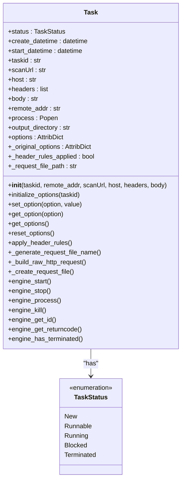
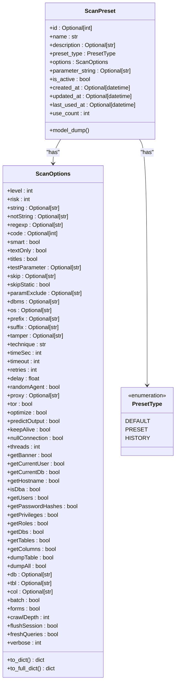
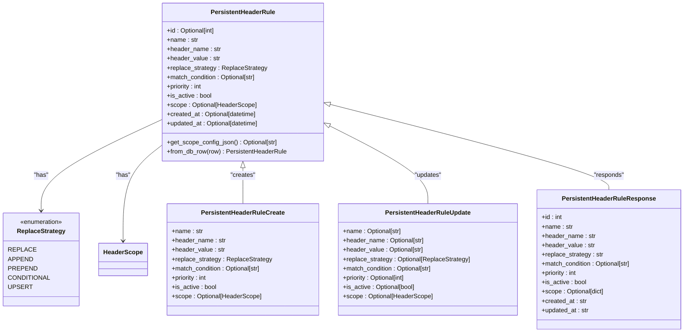
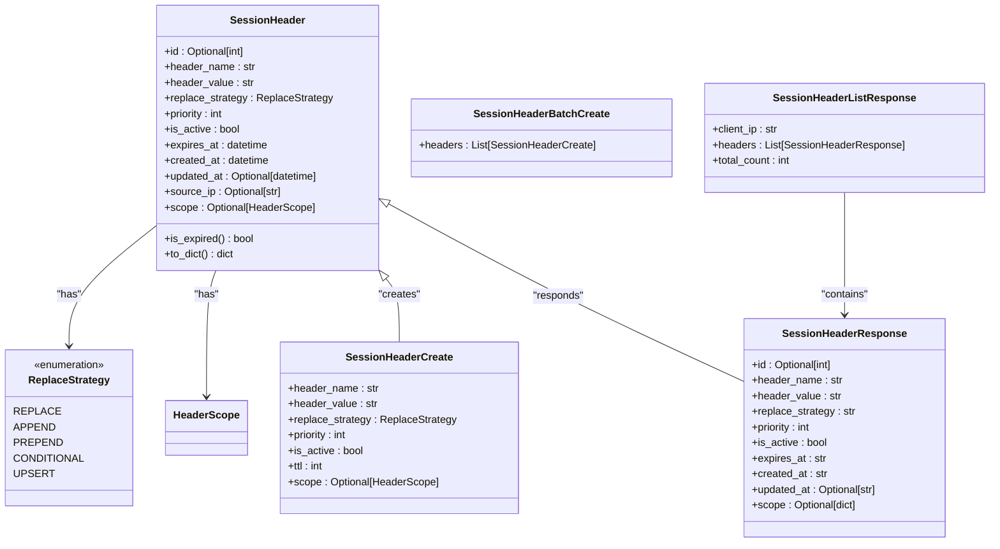
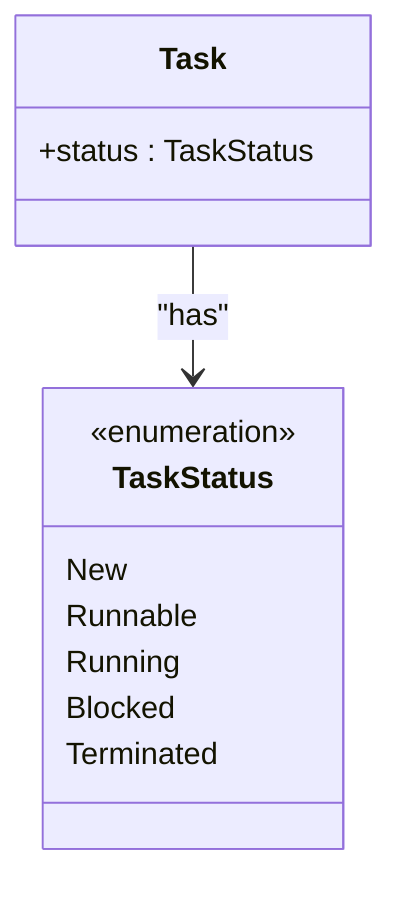
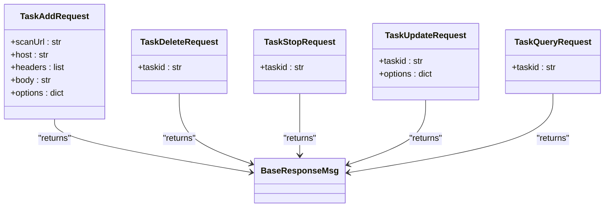
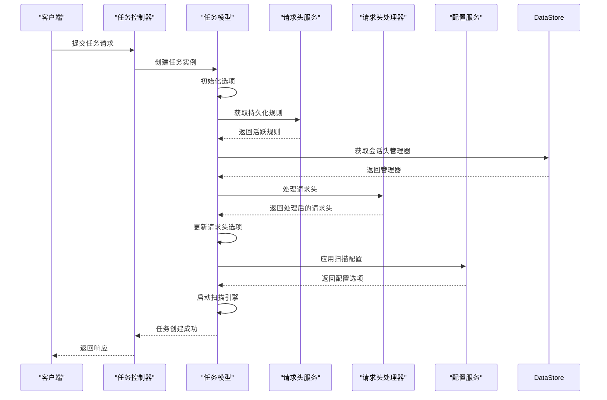
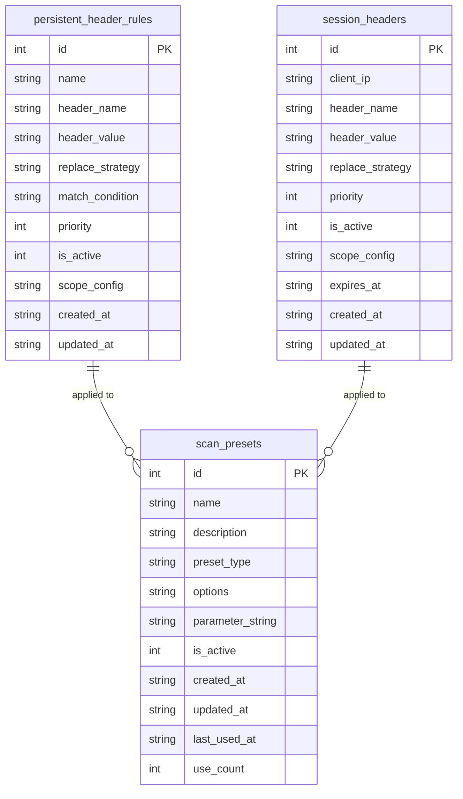
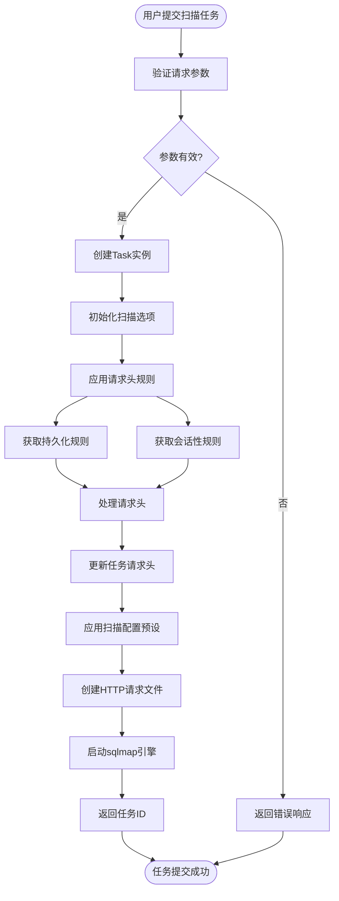

# 数据模型

<cite>
**本文档引用的文件**   
- [Task.py](file://src/backEnd/model/Task.py)
- [ScanPreset.py](file://src/backEnd/model/ScanPreset.py)
- [HeaderScope.py](file://src/backEnd/model/HeaderScope.py)
- [PersistentHeaderRule.py](file://src/backEnd/model/PersistentHeaderRule.py)
- [SessionHeader.py](file://src/backEnd/model/SessionHeader.py)
- [TaskStatus.py](file://src/backEnd/model/TaskStatus.py)
- [BaseResponseMsg.py](file://src/backEnd/model/BaseResponseMsg.py)
- [TaskRequest.py](file://src/backEnd/model/requestModel/TaskRequest.py)
- [DataStore.py](file://src/backEnd/model/DataStore.py)
- [Database.py](file://src/backEnd/model/Database.py)
- [HeaderDatabase.py](file://src/backEnd/model/HeaderDatabase.py)
- [ScanPresetDatabase.py](file://src/backEnd/model/ScanPresetDatabase.py)
- [webTaskController.py](file://src/backEnd/api/commonApi/webTaskController.py)
- [scanPreset.py](file://src/backEnd/api/commonApi/scanPreset.py)
- [headerController.py](file://src/backEnd/api/commonApi/headerController.py)
</cite>

## 目录
1. [引言](#引言)
2. [核心领域模型](#核心领域模型)
3. [任务模型](#任务模型)
4. [扫描配置预设模型](#扫描配置预设模型)
5. [请求头作用域模型](#请求头作用域模型)
6. [持久化请求头规则模型](#持久化请求头规则模型)
7. [会话性请求头模型](#会话性请求头模型)
8. [任务状态模型](#任务状态模型)
9. [响应消息模型](#响应消息模型)
10. [请求参数模型](#请求参数模型)
11. [模型关系与交互](#模型关系与交互)
12. [数据持久化设计](#数据持久化设计)
13. [实际用例分析](#实际用例分析)
14. [结论](#结论)

## 引言

sqlmapWebUI是一个基于Web的SQL注入检测工具，其后端系统设计了一套完整的数据模型来管理扫描任务、配置预设和请求头规则。本数据模型文档旨在系统化地描述这些核心领域模型，包括Task、ScanPreset、HeaderScope、PersistentHeaderRule、SessionHeader和TaskStatus等实体的属性、数据类型和业务含义。

该系统采用Pydantic模型进行请求验证和响应序列化，确保了数据的一致性和完整性。模型设计遵循清晰的职责分离原则，将任务管理、配置管理和请求头处理等不同领域的功能解耦。通过定义明确的模型关系，系统能够高效地处理复杂的扫描任务，并支持灵活的请求头规则配置。

本文档将详细阐述各模型的结构设计、相互关系以及在实际业务场景中的应用，为开发者和用户提供一个全面的理解框架。

**文档来源**
- [Task.py](file://src/backEnd/model/Task.py)
- [ScanPreset.py](file://src/backEnd/model/ScanPreset.py)
- [HeaderScope.py](file://src/backEnd/model/HeaderScope.py)

## 核心领域模型

sqlmapWebUI后端的核心领域模型围绕三个主要领域构建：任务管理、配置管理和请求头处理。任务管理领域以Task模型为核心，负责表示和管理SQL注入扫描任务的整个生命周期。每个任务都关联一个TaskStatus，用于跟踪任务的当前状态，从创建到执行再到终止。

配置管理领域由ScanPreset模型主导，它允许用户保存和复用常用的扫描配置。ScanPreset包含一个ScanOptions子模型，该模型定义了与sqlmap工具兼容的丰富扫描选项。这些预设配置分为不同类型，如默认配置、常用配置和历史配置，以满足不同的使用场景。

请求头处理领域最为复杂，涉及多个相互关联的模型。HeaderScope定义了请求头规则的作用范围，支持基于协议、主机名、IP地址、端口和路径的多维度匹配。PersistentHeaderRule和SessionHeader分别代表持久化和会话性的请求头规则，它们都引用HeaderScope来确定其应用范围。这种设计使得请求头规则既具有全局一致性，又能适应临时的会话需求。

**文档来源**
- [Task.py](file://src/backEnd/model/Task.py)
- [ScanPreset.py](file://src/backEnd/model/ScanPreset.py)
- [HeaderScope.py](file://src/backEnd/model/HeaderScope.py)
- [PersistentHeaderRule.py](file://src/backEnd/model/PersistentHeaderRule.py)
- [SessionHeader.py](file://src/backEnd/model/SessionHeader.py)

## 任务模型

Task模型是sqlmapWebUI系统的核心，代表一个SQL注入扫描任务。该模型在创建时接收任务ID、远程地址、扫描URL、主机名、请求头和请求体等关键参数。任务的状态由TaskStatus枚举管理，包括New、Runnable、Running、Blocked和Terminated五种状态，反映了任务从创建到完成的完整生命周期。

任务模型不仅存储基本的扫描信息，还负责管理与sqlmap引擎的交互。它通过initialize_options方法初始化一个与sqlmap兼容的选项字典，并在任务启动前通过apply_header_rules方法应用请求头规则。任务在执行过程中会生成一个HTTP原始报文文件，该文件的路径由_task_file_path属性记录，并通过requestFile选项传递给sqlmap引擎。

Task模型的设计体现了对资源管理和错误处理的关注。它使用全局的_http_request_temp_dir来管理HTTP请求文件的存储位置，并在任务初始化时就处理请求头，确保规则立即生效。此外，模型提供了完整的进程控制接口，包括engine_start、engine_stop、engine_kill等方法，允许对底层sqlmap进程进行精细控制。



**模型来源**
- [Task.py](file://src/backEnd/model/Task.py#L49-L333)
- [TaskStatus.py](file://src/backEnd/model/TaskStatus.py#L4-L9)

## 扫描配置预设模型

ScanPreset模型用于存储和管理SQL注入扫描的配置预设，支持常用配置、默认配置和历史配置等多种类型。该模型的核心是ScanOptions子模型，它定义了与sqlmap工具完全兼容的扫描选项，涵盖了检测、注入、技术、请求、优化和枚举等多个方面的参数。

ScanOptions模型通过Pydantic的Field验证器对每个字段进行严格的约束。例如，level字段的取值范围为1-5，risk字段为1-3，threads字段为1-10。这种设计确保了配置的有效性，防止了无效或危险的参数组合。模型还提供了to_dict和to_full_dict方法，用于将配置转换为字典格式，便于与sqlmap引擎进行交互。

ScanPreset模型本身包含丰富的元数据，如名称、描述、创建时间、更新时间和使用次数。这些信息有助于用户管理和选择配置。系统预定义了多种标准配置，如快速扫描、深度扫描和安全扫描，用户可以根据需要选择合适的预设。此外，模型支持将配置导出为命令行参数字符串，与BurpSuite等工具保持兼容性。



**模型来源**
- [ScanPreset.py](file://src/backEnd/model/ScanPreset.py#L107-L231)
- [ScanPreset.py](file://src/backEnd/model/ScanPreset.py#L19-L105)

## 请求头作用域模型

HeaderScope模型定义了请求头规则的作用范围，支持基于协议、主机名、IP地址、端口和路径的多维度匹配。该模型的设计非常灵活，scope字段可以为空，表示规则全局生效。当scope字段存在时，所有非空字段必须同时匹配（AND逻辑），而空字段则表示不限制该维度。

模型的每个匹配模式都支持通配符和正则表达式。protocol_pattern支持http和https协议的匹配，host_pattern支持如"*.example.com"的通配符模式，ip_pattern支持如"192.168.*"的IP范围匹配，port_pattern支持逗号分隔的多个端口，path_pattern支持如"/api/*"的路径匹配。use_regex字段控制是否使用正则表达式进行匹配，为高级用户提供更精确的控制能力。

HeaderScope模型提供了完整的验证逻辑，确保配置的有效性。例如，validate_protocol方法验证协议值必须是http或https，validate_port方法确保端口号在1-65535之间。模型还提供了is_empty方法来判断作用域是否为空，以及to_dict和from_dict方法用于在对象和字典格式之间转换，便于持久化存储和API交互。

```mermaid
classDiagram
class HeaderScope {
+protocol_pattern : Optional[str]
+host_pattern : Optional[str]
+ip_pattern : Optional[str]
+port_pattern : Optional[str]
+path_pattern : Optional[str]
+use_regex : bool
+validate_protocol(v)
+validate_port(v)
+validate_pattern_length(v)
+is_empty() bool
+to_dict() dict
+from_dict(data) HeaderScope
}
HeaderScope : """
示例 :
{
"protocol_pattern" : "https",
"host_pattern" : "*.example.com",
"port_pattern" : "443",
"path_pattern" : "/api/*",
"use_regex" : false
}
"""
```

**模型来源**
- [HeaderScope.py](file://src/backEnd/model/HeaderScope.py#L14-L187)

## 持久化请求头规则模型

PersistentHeaderRule模型代表持久化存储的请求头规则，这些规则在系统重启后仍然有效。每个规则包含名称、请求头名称、请求头值、替换策略、匹配条件、优先级和是否启用等属性。规则的核心是replace_strategy字段，它定义了如何应用请求头值，支持REPLACE（完全替换）、APPEND（追加）、PREPEND（前置）、CONDITIONAL（条件性替换）和UPSERT（存在则替换，不存在则新增）五种策略。

该模型与HeaderScope紧密集成，通过scope字段定义规则的应用范围。这使得规则可以精确地应用于特定的协议、主机、IP、端口或路径组合。模型提供了get_scope_config_json方法，将scope对象序列化为JSON字符串用于数据库存储，以及from_db_row类方法，从数据库行创建对象并处理scope_config的反序列化。

为了支持数据库持久化，模型定义了PersistentHeaderRuleCreate、PersistentHeaderRuleUpdate和PersistentHeaderRuleResponse等辅助模型。这些模型分别用于创建、更新和响应场景，确保了API接口的类型安全和数据完整性。Response模型将scope字段返回为字典格式，便于前端直接使用。



**模型来源**
- [PersistentHeaderRule.py](file://src/backEnd/model/PersistentHeaderRule.py#L19-L104)

## 会话性请求头模型

SessionHeader模型代表会话性的请求头规则，这些规则在内存中存储并具有过期时间，适用于临时的测试需求。与持久化规则不同，会话性规则与特定的客户端IP地址关联，通过source_ip字段标识。每个规则都有一个expires_at字段，定义了规则的生存时间，系统会定期清理过期的规则。

该模型同样支持多种替换策略，包括REPLACE、APPEND、PREPEND、CONDITIONAL和UPSERT，与持久化规则保持一致。优先级和作用域配置也与持久化规则相同，确保了规则处理逻辑的一致性。模型提供了is_expired方法来检查规则是否已过期，以及to_dict方法用于序列化。

为了支持批量操作，模型定义了SessionHeaderBatchCreate、SessionHeaderResponse和SessionHeaderListResponse等辅助模型。BatchCreate模型允许一次性创建多个会话性请求头，提高了API的效率。ListResponse模型返回特定客户端IP的所有会话性请求头，便于前端展示和管理。



**模型来源**
- [SessionHeader.py](file://src/backEnd/model/SessionHeader.py#L19-L97)

## 任务状态模型

TaskStatus模型是一个简单的枚举类型，定义了SQL注入扫描任务的五种可能状态：New（新建）、Runnable（可运行）、Running（运行中）、Blocked（阻塞）和Terminated（已终止）。这个模型是Task模型的核心组成部分，用于跟踪任务的生命周期。

状态转换遵循严格的业务逻辑。任务创建时为New状态，准备就绪后变为Runnable状态，启动后进入Running状态。如果任务因资源竞争而无法立即执行，则可能进入Blocked状态。任务完成或被终止后，状态变为Terminated。这种状态机设计确保了任务管理的清晰性和可预测性。

尽管模型本身非常简单，但它在系统中扮演着关键角色。API接口和前端UI都依赖于任务状态来决定显示内容和可用操作。例如，只有处于Runnable或Running状态的任务才允许被停止或终止。状态信息也用于日志记录和监控，帮助用户了解任务的执行情况。



**模型来源**
- [TaskStatus.py](file://src/backEnd/model/TaskStatus.py#L4-L9)
- [Task.py](file://src/backEnd/model/Task.py#L51-L54)

## 响应消息模型

BaseResponseMsg模型是系统统一的响应消息格式，继承自FastAPI的JSONResponse。该模型定义了四个核心字段：code（HTTP状态码）、success（操作是否成功）、message（消息描述）和data（返回数据）。这种标准化的响应格式简化了前端的错误处理和数据解析。

模型的构造函数接受这些参数并将其封装为JSON响应体。同时，它将这些属性保存为实例变量，便于在代码中直接访问。这种设计既满足了HTTP响应的要求，又提供了编程便利性。所有API接口都使用这个模型来生成响应，确保了前后端交互的一致性。

BaseResponseMsg的应用贯穿整个系统。无论是任务创建、配置查询还是请求头管理，所有API接口都返回这种格式的响应。前端可以统一处理这些响应，根据success字段决定后续操作，根据code字段显示适当的错误信息，根据data字段获取实际数据。

```mermaid
classDiagram
class BaseResponseMsg {
+code : int
+success : bool
+msg : str
+data : Any
+__init__(data, msg, success, code)
}
BaseResponseMsg : """
示例响应 :
{
"code" : 200,
"success" : true,
"message" : "获取成功",
"data" : { ... }
}
"""
```

**模型来源**
- [BaseResponseMsg.py](file://src/backEnd/model/BaseResponseMsg.py#L5-L21)

## 请求参数模型

TaskRequest模块定义了各种API接口的请求参数模型，使用Pydantic进行类型验证。这些模型包括TaskAddRequest、TaskDeleteRequest、TaskStopRequest等，分别对应不同的操作。TaskAddRequest是最复杂的模型，包含scanUrl、host、headers、body和options等字段，用于提交新的扫描任务。

这些请求模型的设计体现了对输入验证的重视。例如，taskid字段有严格的长度限制（16位），确保了任务ID的有效性。options字段要求非空，防止了无效的扫描请求。通过使用Pydantic的Field验证器，系统可以在请求到达业务逻辑之前就捕获和处理错误。

请求模型与响应模型形成完整的API契约。前端发送符合请求模型的JSON数据，后端验证后执行业务逻辑，并返回符合BaseResponseMsg格式的响应。这种设计模式提高了系统的健壮性和可维护性，减少了因数据格式错误导致的运行时异常。



**模型来源**
- [TaskRequest.py](file://src/backEnd/model/requestModel/TaskRequest.py#L31-L57)
- [TaskRequest.py](file://src/backEnd/model/requestModel/TaskRequest.py#L10-L25)

## 模型关系与交互

sqlmapWebUI的模型之间存在复杂的交互关系，形成了一个完整的任务处理流水线。最核心的交互发生在Task模型和请求头规则模型之间。当创建一个新任务时，Task的__init__方法会立即调用apply_header_rules，该方法会从HeaderRuleService获取持久化规则和会话性规则，并使用HeaderProcessor处理请求头。

请求头处理的逻辑依赖于HeaderScope模型。系统会检查每个规则的scope是否与任务的远程地址、主机名等信息匹配。只有匹配的规则才会被应用，并根据replace_strategy策略修改请求头。处理后的请求头会被设置到Task的options中，最终传递给sqlmap引擎。

扫描配置预设通过ScanPresetService与任务创建流程集成。当用户提交任务时，可以选择一个ScanPreset，其options会被合并到任务的配置中。ScanPresetDatabase负责管理这些预设的持久化存储，确保配置在系统重启后仍然可用。



**模型来源**
- [Task.py](file://src/backEnd/model/Task.py#L109-L165)
- [webTaskController.py](file://src/backEnd/api/commonApi/webTaskController.py#L65-L72)
- [headerController.py](file://src/backEnd/api/commonApi/headerController.py#L28)

## 数据持久化设计

系统的数据持久化设计采用了SQLite数据库，通过Database基类和多个专用数据库类实现。Database类提供了基本的数据库连接、执行和事务管理功能，支持线程安全和自动重试。HeaderDatabase和ScanPresetDatabase继承自Database，分别管理请求头规则和扫描配置预设。

HeaderDatabase管理两个表：persistent_header_rules和session_headers。前者存储持久化请求头规则，后者存储会话性请求头。表结构设计考虑了查询性能，为常用查询字段创建了索引。系统还实现了表迁移机制，通过_add_column_if_not_exists方法安全地添加新列，确保数据库版本的兼容性。

ScanPresetDatabase管理scan_presets表，存储各种类型的扫描配置预设。该表包含丰富的元数据字段，如使用次数和最后使用时间，支持基于这些字段的排序和筛选。系统在初始化时会创建默认配置，并提供add_to_history方法自动管理历史配置，保持列表的整洁。



**模型来源**
- [Database.py](file://src/backEnd/model/Database.py#L10-L99)
- [HeaderDatabase.py](file://src/backEnd/model/HeaderDatabase.py#L11-L126)
- [ScanPresetDatabase.py](file://src/backEnd/model/ScanPresetDatabase.py#L25-L514)

## 实际用例分析

在实际使用中，当用户通过Web界面提交一个扫描任务时，系统会经历一系列模型交互。首先，webTaskController接收到TaskAddRequest，验证输入参数后调用taskService.star_task。这个方法会创建一个新的Task实例，并初始化其状态为New。

在任务初始化过程中，系统会应用请求头规则。HeaderRuleService从HeaderDatabase查询所有活跃的持久化规则，同时从内存中的SessionHeaderManager获取与客户端IP关联的会话性规则。HeaderProcessor根据HeaderScope的匹配逻辑，决定哪些规则适用于当前任务，并按优先级顺序应用它们。

如果用户选择了特定的扫描配置预设，ScanPresetService会从ScanPresetDatabase加载对应的ScanPreset，并将其options合并到任务配置中。最终，任务会生成一个HTTP原始报文文件，启动sqlmap引擎，并将任务ID返回给客户端。整个过程体现了各模型的协同工作，确保了扫描任务的正确执行。



**模型来源**
- [webTaskController.py](file://src/backEnd/api/commonApi/webTaskController.py#L19-L91)
- [Task.py](file://src/backEnd/model/Task.py#L258-L297)
- [scanPreset.py](file://src/backEnd/api/commonApi/scanPreset.py#L23-L200)

## 结论

sqlmapWebUI后端的数据模型设计体现了良好的软件工程实践。通过使用Pydantic模型，系统实现了严格的输入验证和类型安全，提高了代码的可靠性和可维护性。各模型职责清晰，通过合理的关联和交互，共同支持了复杂的扫描任务管理功能。

核心模型如Task、ScanPreset和请求头规则系列，不仅定义了数据结构，还封装了相关的业务逻辑。这种设计使得代码更加模块化，便于测试和扩展。数据持久化层的设计考虑了实际使用场景，提供了高效的查询和安全的迁移机制。

总体而言，这套数据模型成功地平衡了灵活性和严谨性，既支持丰富的功能配置，又保证了系统的稳定运行。对于开发者来说，清晰的模型定义和文档降低了理解和维护系统的难度；对于用户来说，一致的API设计和可靠的执行保证了良好的使用体验。

**文档来源**
- [Task.py](file://src/backEnd/model/Task.py)
- [ScanPreset.py](file://src/backEnd/model/ScanPreset.py)
- [HeaderScope.py](file://src/backEnd/model/HeaderScope.py)
- [PersistentHeaderRule.py](file://src/backEnd/model/PersistentHeaderRule.py)
- [SessionHeader.py](file://src/backEnd/model/SessionHeader.py)
- [TaskStatus.py](file://src/backEnd/model/TaskStatus.py)
- [BaseResponseMsg.py](file://src/backEnd/model/BaseResponseMsg.py)
- [TaskRequest.py](file://src/backEnd/model/requestModel/TaskRequest.py)
- [DataStore.py](file://src/backEnd/model/DataStore.py)
- [Database.py](file://src/backEnd/model/Database.py)
- [HeaderDatabase.py](file://src/backEnd/model/HeaderDatabase.py)
- [ScanPresetDatabase.py](file://src/backEnd/model/ScanPresetDatabase.py)
- [webTaskController.py](file://src/backEnd/api/commonApi/webTaskController.py)
- [scanPreset.py](file://src/backEnd/api/commonApi/scanPreset.py)
- [headerController.py](file://src/backEnd/api/commonApi/headerController.py)