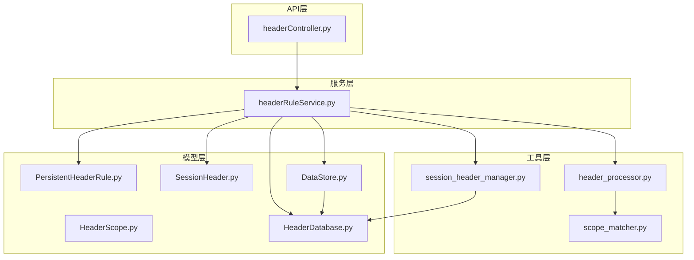
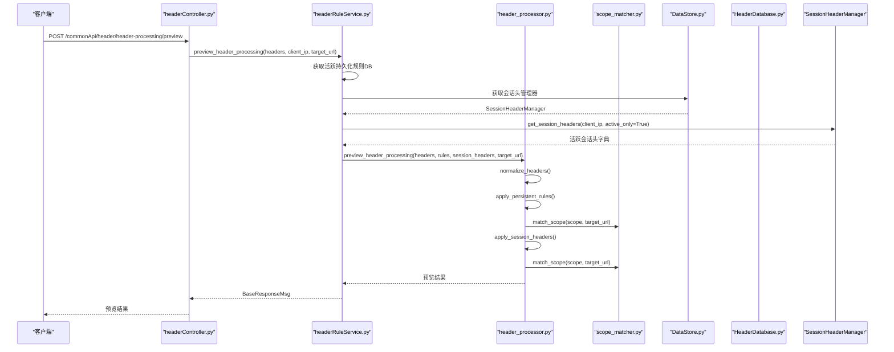
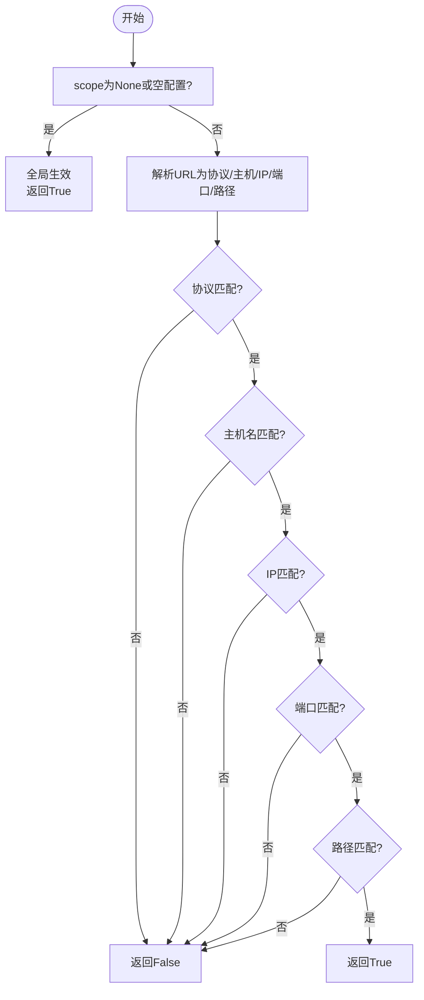
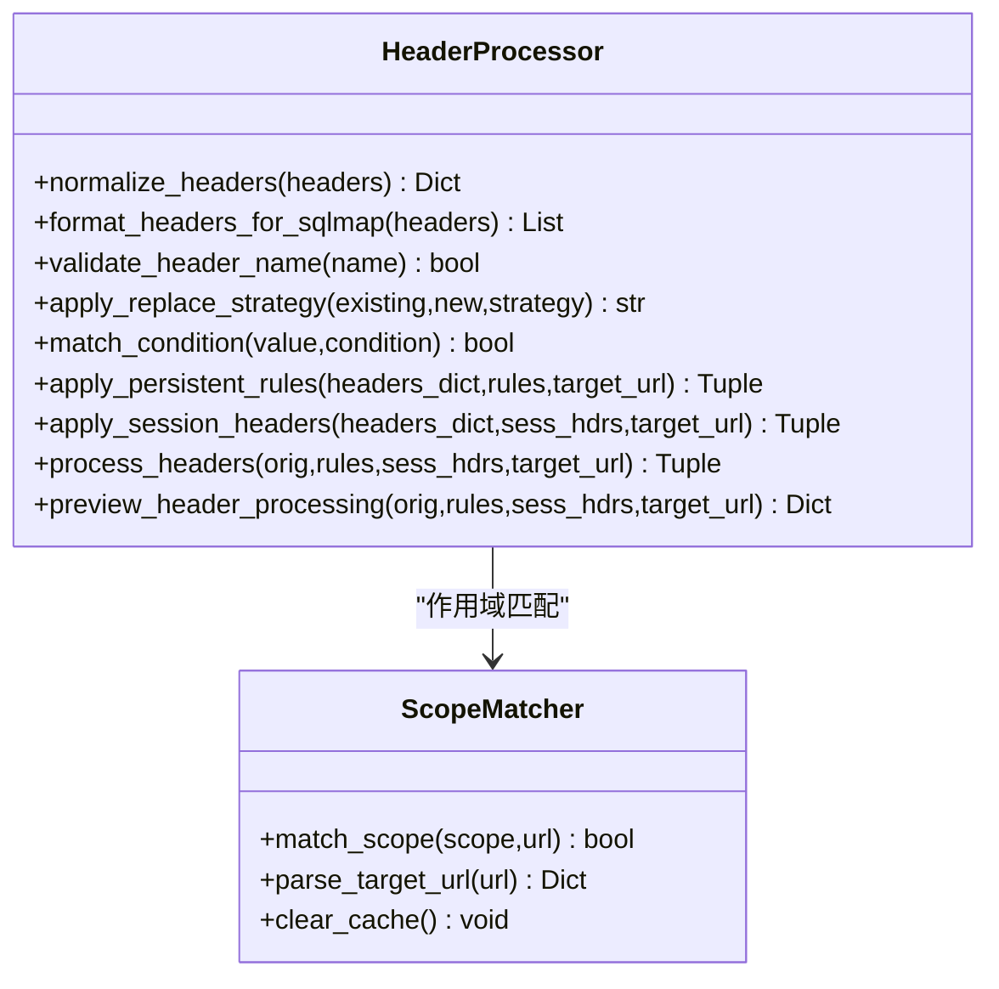
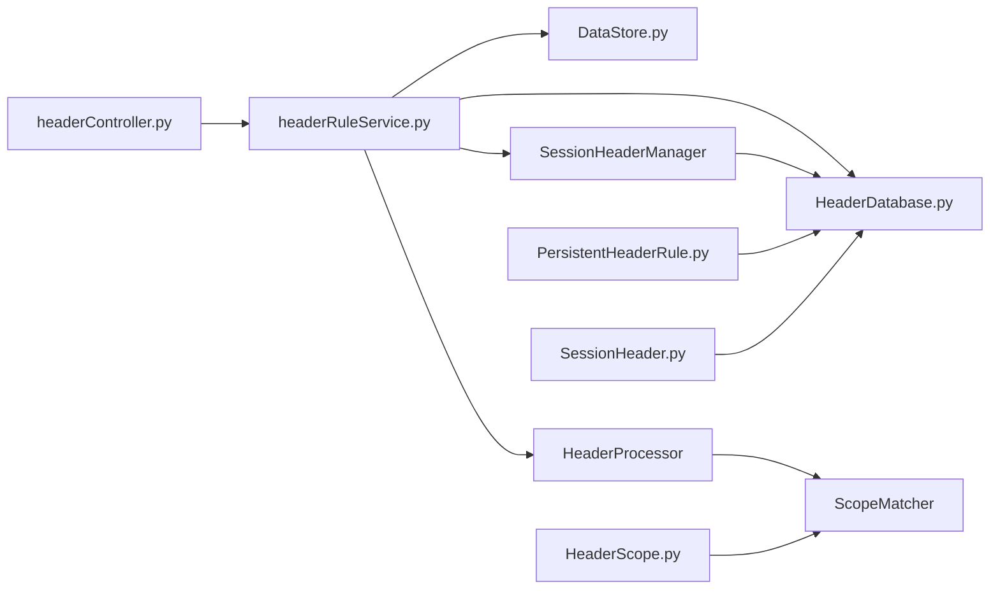

# 请求头规则模型

<cite>
**本文引用的文件**
- [HeaderDatabase.py](file://src/backEnd/model/HeaderDatabase.py)
- [PersistentHeaderRule.py](file://src/backEnd/model/PersistentHeaderRule.py)
- [SessionHeader.py](file://src/backEnd/model/SessionHeader.py)
- [HeaderScope.py](file://src/backEnd/model/HeaderScope.py)
- [header_processor.py](file://src/backEnd/utils/header_processor.py)
- [scope_matcher.py](file://src/backEnd/utils/scope_matcher.py)
- [headerRuleService.py](file://src/backEnd/service/headerRuleService.py)
- [headerController.py](file://src/backEnd/api/commonApi/headerController.py)
- [session_header_manager.py](file://src/backEnd/utils/session_header_manager.py)
- [DataStore.py](file://src/backEnd/model/DataStore.py)
- [test_header_processor_scope.py](file://src/backEnd/tests/test_header_processor_scope.py)
- [test_scope_matcher.py](file://src/backEnd/tests/test_scope_matcher.py)
</cite>

## 目录
1. [简介](#简介)
2. [项目结构](#项目结构)
3. [核心组件](#核心组件)
4. [架构总览](#架构总览)
5. [详细组件分析](#详细组件分析)
6. [依赖关系分析](#依赖关系分析)
7. [性能考量](#性能考量)
8. [故障排查指南](#故障排查指南)
9. [结论](#结论)
10. [附录](#附录)

## 简介
本文件围绕“请求头规则模型”展开，系统性阐述三类核心实体：持久化规则（PersistentHeaderRule）、会话级规则（SessionHeader）与作用域模型（HeaderScope）。文档重点说明：
- 持久化规则与会话级规则的区别与联系：前者持久存储、全局或按作用域生效；后者内存存储、临时会话生效。
- HeaderScope作用域模型的设计与匹配机制（协议、主机、IP、端口、路径，支持通配符与正则）。
- HeaderDatabase作为请求头存储仓库的管理策略与持久化方案。
- 规则优先级与冲突处理逻辑。
- 在HTTP请求处理流程中注入请求头的完整链路与示例路径。

## 项目结构
后端采用分层设计：API路由层（FastAPI）、服务层（业务逻辑）、工具层（匹配与处理）、模型层（数据模型与数据库）。

图表来源
- [headerController.py](file://src/backEnd/api/commonApi/headerController.py#L1-L120)
- [headerRuleService.py](file://src/backEnd/service/headerRuleService.py#L1-L120)
- [header_processor.py](file://src/backEnd/utils/header_processor.py#L1-L120)
- [scope_matcher.py](file://src/backEnd/utils/scope_matcher.py#L1-L120)
- [session_header_manager.py](file://src/backEnd/utils/session_header_manager.py#L1-L120)
- [PersistentHeaderRule.py](file://src/backEnd/model/PersistentHeaderRule.py#L1-L60)
- [SessionHeader.py](file://src/backEnd/model/SessionHeader.py#L1-L60)
- [HeaderScope.py](file://src/backEnd/model/HeaderScope.py#L1-L60)
- [HeaderDatabase.py](file://src/backEnd/model/HeaderDatabase.py#L1-L60)
- [DataStore.py](file://src/backEnd/model/DataStore.py#L1-L38)

章节来源
- [headerController.py](file://src/backEnd/api/commonApi/headerController.py#L1-L120)
- [headerRuleService.py](file://src/backEnd/service/headerRuleService.py#L1-L120)
- [header_processor.py](file://src/backEnd/utils/header_processor.py#L1-L120)
- [scope_matcher.py](file://src/backEnd/utils/scope_matcher.py#L1-L120)
- [session_header_manager.py](file://src/backEnd/utils/session_header_manager.py#L1-L120)
- [PersistentHeaderRule.py](file://src/backEnd/model/PersistentHeaderRule.py#L1-L60)
- [SessionHeader.py](file://src/backEnd/model/SessionHeader.py#L1-L60)
- [HeaderScope.py](file://src/backEnd/model/HeaderScope.py#L1-L60)
- [HeaderDatabase.py](file://src/backEnd/model/HeaderDatabase.py#L1-L60)
- [DataStore.py](file://src/backEnd/model/DataStore.py#L1-L38)

## 核心组件
- 持久化规则（PersistentHeaderRule）
  - 数据模型：包含规则名称、请求头名称与值、替换策略、匹配条件、优先级、启用状态、作用域配置等。
  - 存储：通过HeaderDatabase持久化至SQLite，字段包含scope_config JSON串。
  - 用途：全局或按作用域生效，按优先级排序后应用。
- 会话级规则（SessionHeader）
  - 数据模型：内存存储，包含过期时间、优先级、启用状态、来源IP、作用域配置等。
  - 存储：内存字典结构，同时持久化到session_headers表（带过期时间与索引）。
  - 用途：临时会话生效，自动清理过期项。
- 作用域模型（HeaderScope）
  - 字段：协议、主机、IP、端口、路径、是否使用正则。
  - 匹配：AND逻辑，支持通配符与正则；空配置等同全局生效。
- 请求头处理器（HeaderProcessor）
  - 功能：规范化请求头、应用持久化规则与会话头、生成预览结果。
  - 优先级：持久化规则按优先级降序；会话头按优先级升序（高优先级后执行以覆盖低优先级）。
- 作用域匹配器（ScopeMatcher）
  - 功能：解析URL并按维度匹配；支持正则与关键字（通配符）两种模式；带缓存优化。
- 会话头管理器（SessionHeaderManager）
  - 功能：内存管理、过期清理、批量操作、与数据库同步。
- 请求头数据库（HeaderDatabase）
  - 功能：初始化表结构、迁移列、建立索引、提供CRUD能力。
- 服务层（HeaderRuleService）
  - 功能：规则增删改查、批量导入、预览处理、与数据库交互。
- API控制器（headerController）
  - 功能：对外暴露REST接口，调用服务层完成业务。

章节来源
- [PersistentHeaderRule.py](file://src/backEnd/model/PersistentHeaderRule.py#L1-L104)
- [SessionHeader.py](file://src/backEnd/model/SessionHeader.py#L1-L97)
- [HeaderScope.py](file://src/backEnd/model/HeaderScope.py#L1-L187)
- [header_processor.py](file://src/backEnd/utils/header_processor.py#L1-L292)
- [scope_matcher.py](file://src/backEnd/utils/scope_matcher.py#L1-L346)
- [session_header_manager.py](file://src/backEnd/utils/session_header_manager.py#L1-L313)
- [HeaderDatabase.py](file://src/backEnd/model/HeaderDatabase.py#L1-L126)
- [headerRuleService.py](file://src/backEnd/service/headerRuleService.py#L1-L200)
- [headerController.py](file://src/backEnd/api/commonApi/headerController.py#L1-L120)

## 架构总览
请求头处理的端到端流程如下：

图表来源
- [headerController.py](file://src/backEnd/api/commonApi/headerController.py#L354-L422)
- [headerRuleService.py](file://src/backEnd/service/headerRuleService.py#L584-L623)
- [header_processor.py](file://src/backEnd/utils/header_processor.py#L213-L292)
- [scope_matcher.py](file://src/backEnd/utils/scope_matcher.py#L35-L141)
- [DataStore.py](file://src/backEnd/model/DataStore.py#L25-L38)
- [HeaderDatabase.py](file://src/backEnd/model/HeaderDatabase.py#L26-L101)
- [session_header_manager.py](file://src/backEnd/utils/session_header_manager.py#L151-L171)

## 详细组件分析

### 持久化规则（PersistentHeaderRule）
- 数据模型要点
  - 替换策略：REPLACE、APPEND、PREPEND、CONDITIONAL、UPSERT。
  - 作用域：可选，序列化为JSON存储于scope_config字段。
  - 优先级：0-100，数值越大优先级越高。
- 生命周期
  - 创建：校验名称、请求头名称合法性、值非空；写入数据库并返回响应。
  - 查询：支持按活跃状态查询，按优先级与创建时间排序。
  - 更新：逐字段更新，支持scope_config反序列化与序列化。
  - 删除：按ID删除。
- 应用流程
  - 读取活跃规则，按优先级降序排序。
  - 若规则配置了作用域且提供target_url，则进行作用域匹配，否则跳过匹配。
  - 校验请求头名称合法性，检查匹配条件（正则），按策略应用替换。
  - 总是写入目标请求头字典，保证用户意图得到满足。

章节来源
- [PersistentHeaderRule.py](file://src/backEnd/model/PersistentHeaderRule.py#L1-L104)
- [headerRuleService.py](file://src/backEnd/service/headerRuleService.py#L74-L176)
- [headerRuleService.py](file://src/backEnd/service/headerRuleService.py#L177-L260)
- [headerRuleService.py](file://src/backEnd/service/headerRuleService.py#L338-L480)
- [headerRuleService.py](file://src/backEnd/service/headerRuleService.py#L533-L583)
- [header_processor.py](file://src/backEnd/utils/header_processor.py#L90-L151)

### 会话级规则（SessionHeader）
- 数据模型要点
  - 内存存储，包含过期时间、优先级、启用状态、来源IP、作用域配置。
  - TTL控制生命周期，到期自动失效。
- 生命周期
  - 设置：支持单条与批量设置；若存在则复用ID并更新数据库。
  - 查询：支持仅返回活跃项；可返回全部（含过期）。
  - 删除：按名称删除或清空客户端所有会话头；同步删除数据库。
  - 清理：清理内存与数据库中的过期项。
- 应用流程
  - 读取活跃会话头，按优先级升序排序（高优先级后执行以覆盖低优先级）。
  - 若会话头配置了作用域且提供target_url，则进行作用域匹配，否则跳过匹配。
  - 总是写入目标请求头字典，实现UPSERT效果。

章节来源
- [SessionHeader.py](file://src/backEnd/model/SessionHeader.py#L1-L97)
- [session_header_manager.py](file://src/backEnd/utils/session_header_manager.py#L34-L149)
- [session_header_manager.py](file://src/backEnd/utils/session_header_manager.py#L151-L214)
- [session_header_manager.py](file://src/backEnd/utils/session_header_manager.py#L215-L313)
- [header_processor.py](file://src/backEnd/utils/header_processor.py#L153-L211)

### 作用域模型（HeaderScope）与匹配器（ScopeMatcher）
- HeaderScope设计
  - 字段：protocol_pattern、host_pattern、ip_pattern、port_pattern、path_pattern、use_regex。
  - 空配置等同全局生效；字段为空表示不限制该维度。
  - 验证：协议仅允许http/https；端口支持多值与范围；模式长度限制。
- 匹配逻辑
  - AND逻辑：scope不为空且非空配置时，所有配置维度必须同时匹配。
  - 通配符：支持“*”，转换为正则进行完整匹配。
  - 正则：支持use_regex开关；内置缓存与容量控制。
  - URL解析：默认端口处理（http:80、https:443）；IP解析失败时返回空字符串。
- 关键实现路径
  - 匹配入口：match_scope(scope, target_url)。
  - URL解析缓存：parse_target_url(url)。
  - 维度匹配：_match_dimension(value, pattern, use_regex, dimension_name)。
  - 正则匹配：_match_regex(value, pattern, dimension_name)。
  - 关键字匹配：_match_keyword(value, pattern)。

图表来源
- [scope_matcher.py](file://src/backEnd/utils/scope_matcher.py#L35-L141)
- [scope_matcher.py](file://src/backEnd/utils/scope_matcher.py#L143-L192)
- [scope_matcher.py](file://src/backEnd/utils/scope_matcher.py#L227-L340)

章节来源
- [HeaderScope.py](file://src/backEnd/model/HeaderScope.py#L1-L187)
- [scope_matcher.py](file://src/backEnd/utils/scope_matcher.py#L1-L346)

### 请求头处理器（HeaderProcessor）
- 功能清单
  - 规范化：将原始请求头列表转为字典，再转回列表。
  - 名称校验：请求头名称合法性检查。
  - 替换策略：REPLACE、APPEND、PREPEND、CONDITIONAL、UPSERT。
  - 条件匹配：基于正则的匹配条件。
  - 应用持久化规则：按优先级降序排序，作用域匹配后应用。
  - 应用会话头：过滤过期项，按优先级升序排序，作用域匹配后应用。
  - 预览：不实际应用，返回处理前后对比与应用描述。
- 关键实现路径
  - process_headers：串联规范化、应用持久化规则、应用会话头、格式化输出。
  - apply_persistent_rules：排序、作用域匹配、名称校验、条件匹配、策略应用。
  - apply_session_headers：过期过滤、排序、作用域匹配、策略应用。

图表来源
- [header_processor.py](file://src/backEnd/utils/header_processor.py#L1-L292)
- [scope_matcher.py](file://src/backEnd/utils/scope_matcher.py#L1-L120)

章节来源
- [header_processor.py](file://src/backEnd/utils/header_processor.py#L1-L292)

### 会话头管理器（SessionHeaderManager）
- 内存结构：{client_ip: {header_name: SessionHeader}}
- 操作：设置、批量设置、查询（活跃/全部）、删除、清空、清理过期。
- 数据库同步：UPSERT（先尝试UPDATE，未命中则INSERT），并持久化scope_config。
- 统计：客户端数量、总数、活跃数。

章节来源
- [session_header_manager.py](file://src/backEnd/utils/session_header_manager.py#L1-L313)

### 请求头数据库（HeaderDatabase）
- 初始化：创建persistent_header_rules与session_headers表，添加索引。
- 迁移：动态添加列（如scope_config、replace_strategy、is_active、updated_at）。
- 索引：按is_active、priority、header_name、client_ip、expires_at建立索引。

章节来源
- [HeaderDatabase.py](file://src/backEnd/model/HeaderDatabase.py#L26-L126)

### 服务层（HeaderRuleService）
- 规则管理：创建、查询、更新、删除、批量创建。
- 预览：结合持久化规则与会话头，返回预览结果。
- 数据库交互：检查连接、序列化/反序列化scope_config、构建响应。

章节来源
- [headerRuleService.py](file://src/backEnd/service/headerRuleService.py#L1-L200)
- [headerRuleService.py](file://src/backEnd/service/headerRuleService.py#L584-L623)

### API控制器（headerController）
- 接口：持久化规则CRUD、会话头CRUD、批量导入、预览、统计。
- 调用链：接收请求→调用服务层→返回统一响应体。

章节来源
- [headerController.py](file://src/backEnd/api/commonApi/headerController.py#L1-L200)

## 依赖关系分析

图表来源
- [headerController.py](file://src/backEnd/api/commonApi/headerController.py#L1-L120)
- [headerRuleService.py](file://src/backEnd/service/headerRuleService.py#L1-L120)
- [HeaderDatabase.py](file://src/backEnd/model/HeaderDatabase.py#L1-L60)
- [DataStore.py](file://src/backEnd/model/DataStore.py#L1-L38)
- [session_header_manager.py](file://src/backEnd/utils/session_header_manager.py#L1-L120)
- [header_processor.py](file://src/backEnd/utils/header_processor.py#L1-L120)
- [scope_matcher.py](file://src/backEnd/utils/scope_matcher.py#L1-L120)
- [PersistentHeaderRule.py](file://src/backEnd/model/PersistentHeaderRule.py#L1-L60)
- [SessionHeader.py](file://src/backEnd/model/SessionHeader.py#L1-L60)
- [HeaderScope.py](file://src/backEnd/model/HeaderScope.py#L1-L60)

章节来源
- [headerController.py](file://src/backEnd/api/commonApi/headerController.py#L1-L120)
- [headerRuleService.py](file://src/backEnd/service/headerRuleService.py#L1-L120)
- [HeaderDatabase.py](file://src/backEnd/model/HeaderDatabase.py#L1-L60)
- [DataStore.py](file://src/backEnd/model/DataStore.py#L1-L38)
- [session_header_manager.py](file://src/backEnd/utils/session_header_manager.py#L1-L120)
- [header_processor.py](file://src/backEnd/utils/header_processor.py#L1-L120)
- [scope_matcher.py](file://src/backEnd/utils/scope_matcher.py#L1-L120)
- [PersistentHeaderRule.py](file://src/backEnd/model/PersistentHeaderRule.py#L1-L60)
- [SessionHeader.py](file://src/backEnd/model/SessionHeader.py#L1-L60)
- [HeaderScope.py](file://src/backEnd/model/HeaderScope.py#L1-L60)

## 性能考量
- 缓存优化
  - ScopeMatcher对URL解析与正则表达式分别维护缓存，并限制最大容量，避免频繁解析与编译。
- 索引优化
  - HeaderDatabase为规则表建立is_active、priority、header_name索引；为会话表建立client_ip、expires_at索引，提升查询效率。
- 排序策略
  - 持久化规则按优先级降序，会话头按优先级升序，减少冲突与覆盖成本。
- 内存与磁盘协同
  - 会话头内存优先，定期清理过期项；同时持久化到数据库，保障重启后一致性。

[本节为通用指导，无需具体文件引用]

## 故障排查指南
- 规则未生效
  - 检查是否提供target_url：若未提供，作用域匹配不会进行；若提供且scope不匹配，规则不会应用。
  - 检查请求头名称合法性：名称不合法会被跳过。
  - 检查匹配条件：正则非法时会记录警告并跳过匹配。
- 会话头未生效
  - 检查是否过期：过期会话头会被过滤。
  - 检查作用域匹配：与持久化规则一致。
- 数据库问题
  - 检查数据库连接可用性；确认表结构与索引存在；关注scope_config字段的序列化/反序列化。
- 预览结果异常
  - 使用预览接口查看应用规则描述与变更数量，定位具体原因。

章节来源
- [header_processor.py](file://src/backEnd/utils/header_processor.py#L1-L292)
- [scope_matcher.py](file://src/backEnd/utils/scope_matcher.py#L1-L120)
- [session_header_manager.py](file://src/backEnd/utils/session_header_manager.py#L1-L120)
- [headerRuleService.py](file://src/backEnd/service/headerRuleService.py#L1-L120)

## 结论
本请求头规则模型通过“持久化规则 + 会话级规则 + 作用域匹配”的组合，实现了灵活、可控、可审计的请求头注入能力。持久化规则适合长期策略，会话级规则适合临时场景，二者通过优先级与作用域共同协作，确保在不同URL与客户端环境下精准生效。数据库层提供可靠的持久化与迁移能力，工具层通过缓存与索引保障性能。

[本节为总结性内容，无需具体文件引用]

## 附录

### 规则优先级与冲突处理
- 持久化规则
  - 优先级越高越先应用；作用域不匹配则跳过。
- 会话级规则
  - 优先级低的先应用，高优先级的后应用，以覆盖低优先级。
- 冲突策略
  - 替换策略：REPLACE、APPEND、PREPEND、CONDITIONAL、UPSERT。
  - 处理器总是写入目标请求头字典，确保用户意图得到满足。

章节来源
- [header_processor.py](file://src/backEnd/utils/header_processor.py#L90-L211)
- [PersistentHeaderRule.py](file://src/backEnd/model/PersistentHeaderRule.py#L1-L60)
- [SessionHeader.py](file://src/backEnd/model/SessionHeader.py#L1-L60)

### 实际代码示例（路径）
- 创建持久化规则
  - [headerRuleService.create_persistent_rule](file://src/backEnd/service/headerRuleService.py#L74-L176)
  - [headerController.create_persistent_header_rule](file://src/backEnd/api/commonApi/headerController.py#L68-L133)
- 获取持久化规则
  - [headerRuleService.get_persistent_rules](file://src/backEnd/service/headerRuleService.py#L177-L260)
  - [headerController.get_persistent_header_rules](file://src/backEnd/api/commonApi/headerController.py#L82-L106)
- 更新持久化规则
  - [headerRuleService.update_persistent_rule](file://src/backEnd/service/headerRuleService.py#L338-L480)
  - [headerController.update_persistent_header_rule](file://src/backEnd/api/commonApi/headerController.py#L108-L133)
- 删除持久化规则
  - [headerRuleService.delete_persistent_rule](file://src/backEnd/service/headerRuleService.py#L481-L531)
  - [headerController.delete_persistent_header_rule](file://src/backEnd/api/commonApi/headerController.py#L122-L133)
- 设置会话头
  - [headerController.set_session_headers](file://src/backEnd/api/commonApi/headerController.py#L135-L172)
  - [session_header_manager.set_session_header](file://src/backEnd/utils/session_header_manager.py#L34-L149)
- 获取会话头
  - [headerController.get_session_headers](file://src/backEnd/api/commonApi/headerController.py#L174-L206)
  - [session_header_manager.get_session_headers](file://src/backEnd/utils/session_header_manager.py#L151-L171)
- 预览请求头处理
  - [headerController.preview_header_processing](file://src/backEnd/api/commonApi/headerController.py#L354-L383)
  - [headerRuleService.preview_header_processing](file://src/backEnd/service/headerRuleService.py#L584-L623)
  - [header_processor.preview_header_processing](file://src/backEnd/utils/header_processor.py#L260-L292)

### 测试参考
- 作用域匹配测试
  - [test_scope_matcher.py](file://src/backEnd/tests/test_scope_matcher.py#L1-L286)
- 处理器与作用域联用测试
  - [test_header_processor_scope.py](file://src/backEnd/tests/test_header_processor_scope.py#L1-L341)