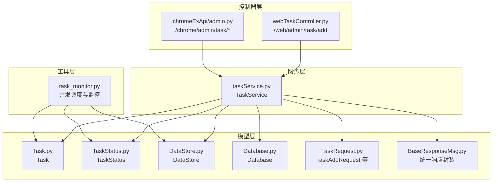
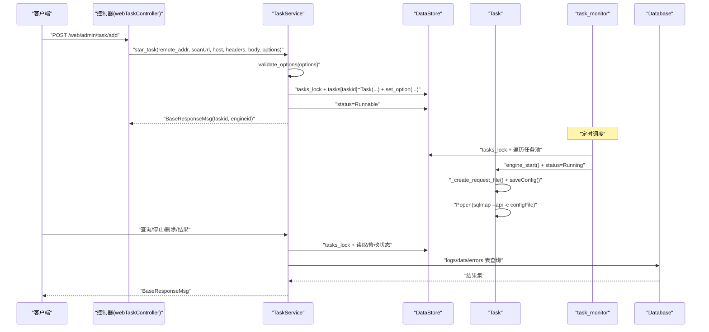
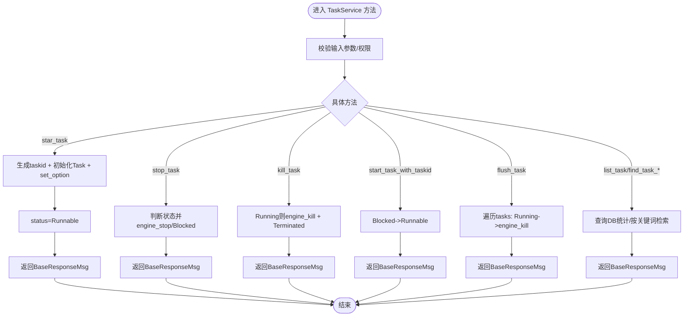
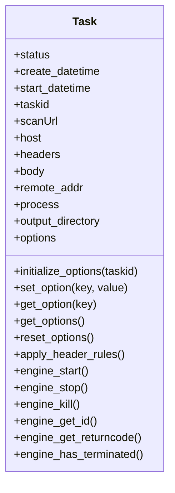
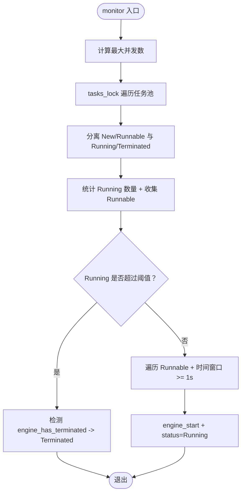
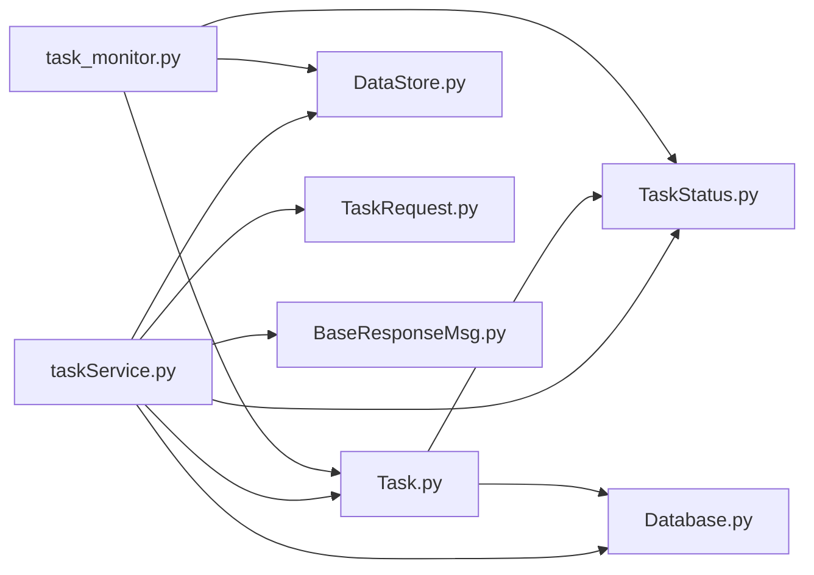

# 任务服务

<cite>
**本文引用的文件**
- [taskService.py](file://src/backEnd/service/taskService.py)
- [Task.py](file://src/backEnd/model/Task.py)
- [TaskStatus.py](file://src/backEnd/model/TaskStatus.py)
- [DataStore.py](file://src/backEnd/model/DataStore.py)
- [Database.py](file://src/backEnd/model/Database.py)
- [task_monitor.py](file://src/backEnd/utils/task_monitor.py)
- [webTaskController.py](file://src/backEnd/api/commonApi/webTaskController.py)
- [TaskRequest.py](file://src/backEnd/model/requestModel/TaskRequest.py)
- [BaseResponseMsg.py](file://src/backEnd/model/BaseResponseMsg.py)
- [admin.py](file://src/backEnd/api/chromeExApi/admin.py)
</cite>

## 目录
1. [简介](#简介)
2. [项目结构](#项目结构)
3. [核心组件](#核心组件)
4. [架构总览](#架构总览)
5. [详细组件分析](#详细组件分析)
6. [依赖关系分析](#依赖关系分析)
7. [性能考量](#性能考量)
8. [故障排查指南](#故障排查指南)
9. [结论](#结论)
10. [附录](#附录)

## 简介
本文件围绕后端服务中的任务服务展开，系统性解析 taskService.py 的核心实现，涵盖任务全生命周期管理（创建、启动、暂停、停止、删除、查询、结果获取）、Task 数据模型的状态转换机制、TaskStatus 枚举的语义、服务层与 DataStore 的协作、task_monitor 的并发调度与资源控制，以及参数校验、配置合并、命令行生成、错误恢复与资源清理等关键细节。文档同时提供可视化图示帮助理解各模块交互与数据流，并给出面向非技术读者的可读性说明。

## 项目结构
后端采用“模型-服务-工具-控制器”分层组织：
- 模型层：Task、TaskStatus、DataStore、Database、请求模型与响应封装
- 服务层：taskService.py 提供任务生命周期管理与查询能力
- 工具层：task_monitor.py 实现并发调度与运行时监控
- 控制器层：webTaskController.py 与 chromeExApi/admin.py 提供对外 API 接口

图表来源
- [taskService.py](file://src/backEnd/service/taskService.py#L1-L535)
- [Task.py](file://src/backEnd/model/Task.py#L1-L333)
- [TaskStatus.py](file://src/backEnd/model/TaskStatus.py#L1-L9)
- [DataStore.py](file://src/backEnd/model/DataStore.py#L1-L38)
- [Database.py](file://src/backEnd/model/Database.py#L1-L99)
- [task_monitor.py](file://src/backEnd/utils/task_monitor.py#L1-L94)
- [webTaskController.py](file://src/backEnd/api/commonApi/webTaskController.py#L1-L91)
- [TaskRequest.py](file://src/backEnd/model/requestModel/TaskRequest.py#L1-L57)
- [BaseResponseMsg.py](file://src/backEnd/model/BaseResponseMsg.py#L1-L21)
- [admin.py](file://src/backEnd/api/chromeExApi/admin.py#L64-L123)

章节来源
- [taskService.py](file://src/backEnd/service/taskService.py#L1-L535)
- [Task.py](file://src/backEnd/model/Task.py#L1-L333)
- [TaskStatus.py](file://src/backEnd/model/TaskStatus.py#L1-L9)
- [DataStore.py](file://src/backEnd/model/DataStore.py#L1-L38)
- [Database.py](file://src/backEnd/model/Database.py#L1-L99)
- [task_monitor.py](file://src/backEnd/utils/task_monitor.py#L1-L94)
- [webTaskController.py](file://src/backEnd/api/commonApi/webTaskController.py#L1-L91)
- [TaskRequest.py](file://src/backEnd/model/requestModel/TaskRequest.py#L1-L57)
- [BaseResponseMsg.py](file://src/backEnd/model/BaseResponseMsg.py#L1-L21)
- [admin.py](file://src/backEnd/api/chromeExApi/admin.py#L64-L123)

## 核心组件
- TaskService：任务生命周期与查询的业务入口，负责参数校验、状态变更、引擎进程控制、结果查询与错误统计。
- Task：任务实体，包含状态、时间戳、引擎进程句柄、输出目录、选项字典、原始请求文件路径、请求头规则应用标记等；提供引擎启动/停止/终止/进程信息查询与请求文件生成。
- TaskStatus：任务状态枚举，覆盖 New、Runnable、Running、Blocked、Terminated。
- DataStore：全局共享存储，维护任务集合、数据库连接、并发锁、最大并发数等。
- Database：SQLite 连接与并发安全封装，提供日志、载荷、错误三张表的读写。
- task_monitor：基于 CPU 负载与逻辑核心数动态计算最大并发任务数，遍历任务池，按策略启动或回收任务。
- 控制器：webTaskController 与 chromeExApi/admin 提供对外 REST 接口，调用 TaskService 完成业务处理。

章节来源
- [taskService.py](file://src/backEnd/service/taskService.py#L1-L535)
- [Task.py](file://src/backEnd/model/Task.py#L1-L333)
- [TaskStatus.py](file://src/backEnd/model/TaskStatus.py#L1-L9)
- [DataStore.py](file://src/backEnd/model/DataStore.py#L1-L38)
- [Database.py](file://src/backEnd/model/Database.py#L1-L99)
- [task_monitor.py](file://src/backEnd/utils/task_monitor.py#L1-L94)
- [webTaskController.py](file://src/backEnd/api/commonApi/webTaskController.py#L1-L91)
- [admin.py](file://src/backEnd/api/chromeExApi/admin.py#L64-L123)

## 架构总览
任务服务的整体工作流如下：
- 控制器接收请求，构造 TaskAddRequest 参数，调用 TaskService.star_task
- TaskService.validate_options 校验 options，合并用户选项到 Task.options
- TaskService 将 Task 放入 DataStore.tasks，设置状态为 Runnable
- task_monitor 定期扫描任务池，依据并发配额与时间窗口触发 Task.engine_start
- Task.engine_start 生成请求文件、写入配置、启动 sqlmap 子进程
- 服务层通过 Task.engine_stop/engine_kill 控制任务生命周期
- 服务层通过 Database 查询日志、载荷、错误等结果

图表来源
- [webTaskController.py](file://src/backEnd/api/commonApi/webTaskController.py#L1-L91)
- [taskService.py](file://src/backEnd/service/taskService.py#L1-L535)
- [Task.py](file://src/backEnd/model/Task.py#L1-L333)
- [task_monitor.py](file://src/backEnd/utils/task_monitor.py#L1-L94)
- [Database.py](file://src/backEnd/model/Database.py#L1-L99)

## 详细组件分析

### TaskService：任务生命周期与查询
- 参数校验
  - validate_options 对 options 类型与不支持字段进行检查，返回统一响应封装 BaseResponseMsg
- 任务创建
  - 生成随机 taskid，创建 Task 实例，逐项 set_option 合并用户选项，设置状态为 Runnable
  - 异常时置状态为 Terminated 并抛出 HTTPException
- 任务控制
  - stop_task：将 Running 状态的任务调用 engine_stop 并置为 Blocked；New/Runnable 置为 Blocked；Blocked/Terminated 返回相应提示
  - kill_task：若 Running 则 engine_kill，最终置为 Terminated
  - start_task_with_taskid：仅允许将 Blocked 变为 Runnable
  - flush_task：清空任务池，Running 任务先 engine_kill
- 查询与结果
  - list_task：遍历 tasks，统计 errors/logs/data 数量，根据 engine_has_terminated 判断 Running/Terminated
  - find_task_*：按 URL、Host、Header 关键词、Body 关键词检索
  - find_task_log_by_taskid：按 taskid 查询 logs 表
  - get_payload_detail_by_task_id：查询 data 表载荷详情
  - get_task_http_request_info：返回任务的 scanUrl、headers、body
  - get_task_scan_options：返回任务已设置的非空选项
  - get_task_errors_by_taskId：查询 errors 表

图表来源
- [taskService.py](file://src/backEnd/service/taskService.py#L1-L535)
- [BaseResponseMsg.py](file://src/backEnd/model/BaseResponseMsg.py#L1-L21)

章节来源
- [taskService.py](file://src/backEnd/service/taskService.py#L1-L535)
- [BaseResponseMsg.py](file://src/backEnd/model/BaseResponseMsg.py#L1-L21)

### Task：任务实体与引擎交互
- 初始化与选项
  - initialize_options 从 sqlmap 的 optDict/_defaults 生成初始选项，强制 batch/disableColoring/eta，注入 api/taskid/database
  - reset_options 恢复到初始选项快照
- 请求头规则应用
  - apply_header_rules 在引擎启动前应用持久化规则与会话头，更新 Task.options.headers
- 请求文件生成与引擎启动
  - _create_request_file 生成 request_YYYYMMDD_HHMMSS_XXXXXX.txt，写入 HTTP 原始报文
  - engine_start 保存配置文件、选择 sqlmap 可执行路径、Popen 启动子进程
- 进程控制
  - engine_stop/kill/get_id/get_returncode/has_terminated 提供进程生命周期管理

图表来源
- [Task.py](file://src/backEnd/model/Task.py#L1-L333)

章节来源
- [Task.py](file://src/backEnd/model/Task.py#L1-L333)

### TaskStatus：状态枚举与转换
- 枚举值：New、Runnable、Running、Blocked、Terminated
- 转换规则
  - 创建后：New -> Runnable（由 TaskService 设置）
  - 调度后：Runnable -> Running（由 task_monitor 触发 engine_start）
  - 停止：Running -> Blocked（stop_task）
  - 杀死：Running -> Terminated（kill_task）
  - 列表查询时：非 New/Runnable/Blocked 的任务根据 engine_has_terminated 判定 Running/Terminated

章节来源
- [TaskStatus.py](file://src/backEnd/model/TaskStatus.py#L1-L9)
- [taskService.py](file://src/backEnd/service/taskService.py#L1-L535)
- [task_monitor.py](file://src/backEnd/utils/task_monitor.py#L1-L94)

### DataStore：全局共享与并发控制
- 维护 tasks(OrderedDict)、current_db、并发锁 tasks_lock/max_tasks_count_lock
- 提供会话头管理器单例获取方法
- 作为任务池与数据库连接的集中入口

章节来源
- [DataStore.py](file://src/backEnd/model/DataStore.py#L1-L38)

### Database：SQLite 并发安全与表结构
- 连接与执行：带锁的 execute/only_execute，自动重试“locked”异常
- 表结构：logs、data、errors 三表，用于记录日志、载荷与错误
- 初始化：创建三表及索引

章节来源
- [Database.py](file://src/backEnd/model/Database.py#L1-L99)

### task_monitor：并发调度与运行时监控
- 最大并发数计算：基于 CPU 核心数与 CPU 使用率动态调整
- 调度策略：
  - 统计 Running 数量与 Runnable 列表
  - 若 Running < 最大并发：对 Runnable 任务按时间窗口（至少 1 秒）触发 engine_start
  - 对非 Running 任务：若 engine_has_terminated 则置为 Terminated
- 作用：平衡系统负载，避免过度并发导致资源争用

图表来源
- [task_monitor.py](file://src/backEnd/utils/task_monitor.py#L1-L94)
- [DataStore.py](file://src/backEnd/model/DataStore.py#L1-L38)
- [Task.py](file://src/backEnd/model/Task.py#L1-L333)

章节来源
- [task_monitor.py](file://src/backEnd/utils/task_monitor.py#L1-L94)
- [DataStore.py](file://src/backEnd/model/DataStore.py#L1-L38)
- [Task.py](file://src/backEnd/model/Task.py#L1-L333)

### 控制器：对外 API 与参数绑定
- webTaskController：/web/admin/task/add 接收 TaskAddRequest，调用 TaskService.star_task
- chromeExApi/admin：提供 /chrome/admin/task/* 系列接口，如 stop、flush、findByUrlPath、logs、payload、http info、tasksByKeyWord 等
- 统一响应：BaseResponseMsg 封装 code/success/message/data

章节来源
- [webTaskController.py](file://src/backEnd/api/commonApi/webTaskController.py#L1-L91)
- [admin.py](file://src/backEnd/api/chromeExApi/admin.py#L64-L123)
- [TaskRequest.py](file://src/backEnd/model/requestModel/TaskRequest.py#L1-L57)
- [BaseResponseMsg.py](file://src/backEnd/model/BaseResponseMsg.py#L1-L21)

## 依赖关系分析
- TaskService 依赖 Task、TaskStatus、DataStore、Database、BaseResponseMsg、TaskAddRequest
- Task 依赖 TaskStatus、Database、第三方 sqlmap 库的选项与进程管理
- task_monitor 依赖 DataStore、TaskStatus、Task、psutil、os
- 控制器依赖 TaskAddRequest、TaskService、BaseResponseMsg

图表来源
- [taskService.py](file://src/backEnd/service/taskService.py#L1-L535)
- [Task.py](file://src/backEnd/model/Task.py#L1-L333)
- [TaskStatus.py](file://src/backEnd/model/TaskStatus.py#L1-L9)
- [DataStore.py](file://src/backEnd/model/DataStore.py#L1-L38)
- [Database.py](file://src/backEnd/model/Database.py#L1-L99)
- [TaskRequest.py](file://src/backEnd/model/requestModel/TaskRequest.py#L1-L57)
- [BaseResponseMsg.py](file://src/backEnd/model/BaseResponseMsg.py#L1-L21)
- [task_monitor.py](file://src/backEnd/utils/task_monitor.py#L1-L94)

章节来源
- [taskService.py](file://src/backEnd/service/taskService.py#L1-L535)
- [Task.py](file://src/backEnd/model/Task.py#L1-L333)
- [TaskStatus.py](file://src/backEnd/model/TaskStatus.py#L1-L9)
- [DataStore.py](file://src/backEnd/model/DataStore.py#L1-L38)
- [Database.py](file://src/backEnd/model/Database.py#L1-L99)
- [TaskRequest.py](file://src/backEnd/model/requestModel/TaskRequest.py#L1-L57)
- [BaseResponseMsg.py](file://src/backEnd/model/BaseResponseMsg.py#L1-L21)
- [task_monitor.py](file://src/backEnd/utils/task_monitor.py#L1-L94)

## 性能考量
- 并发配额动态调整
  - task_monitor 基于 CPU 使用率与逻辑核心数计算最大并发，避免 CPU 过载
- 时间窗口控制
  - 新建任务在 1 秒内不立即启动，降低瞬时并发峰值
- 数据库并发
  - Database.execute/only_execute 使用锁与重试，避免 SQLite 锁竞争
- 选项合并与最小化
  - Task.initialize_options 仅设置必要选项，避免冗余参数影响性能
- 资源回收
  - flush_task 与 kill_task 在异常或关闭时回收进程与内存

章节来源
- [task_monitor.py](file://src/backEnd/utils/task_monitor.py#L1-L94)
- [Database.py](file://src/backEnd/model/Database.py#L1-L99)
- [taskService.py](file://src/backEnd/service/taskService.py#L1-L535)

## 故障排查指南
- 任务创建失败
  - 检查 validate_options 返回值与异常日志
  - 确认 options 类型与不支持字段
- 任务无法启动
  - 查看 task_monitor 是否达到最大并发
  - 检查 Task.engine_start 的配置文件与请求文件生成
- 任务卡住或无响应
  - stop_task -> Blocked；kill_task -> Terminated
  - 检查 engine_has_terminated 与进程 PID
- 结果查询为空
  - 确认 Database 连接初始化与表结构
  - 检查 taskid 是否正确
- 日志与错误
  - 使用 find_task_log_by_taskid 与 get_task_errors_by_taskId 排查

章节来源
- [taskService.py](file://src/backEnd/service/taskService.py#L1-L535)
- [Task.py](file://src/backEnd/model/Task.py#L1-L333)
- [Database.py](file://src/backEnd/model/Database.py#L1-L99)

## 结论
taskService.py 通过清晰的职责划分与严格的并发控制，实现了对 sqlmap 扫描任务的全生命周期管理。Task 与 TaskStatus 的设计使状态转换明确可控；DataStore 与 Database 提供了稳定的共享存储与并发安全；task_monitor 则在运行时动态平衡系统负载。整体架构具备良好的扩展性与可维护性，适合在多场景下部署与演进。

## 附录
- API 示例（路径与行为）
  - /web/admin/task/add：创建任务（参数 TaskAddRequest）
  - /chrome/admin/task/stop：停止任务（参数 TaskStopRequest）
  - /chrome/admin/task/flush：清空任务池
  - /chrome/admin/task/findByUrlPath：按 URL 片段检索
  - /chrome/admin/task/logs/getLogsByTaskId：按任务查询日志
  - /chrome/admin/task/getPayloadDetailByTaskId：按任务查询载荷
  - /chrome/admin/task/getTaskHttpRequestInfoByTaskId：按任务查询原始请求
  - /chrome/admin/task/getTasksByKeyWord：按关键字聚合检索

章节来源
- [webTaskController.py](file://src/backEnd/api/commonApi/webTaskController.py#L1-L91)
- [admin.py](file://src/backEnd/api/chromeExApi/admin.py#L64-L123)
- [TaskRequest.py](file://src/backEnd/model/requestModel/TaskRequest.py#L1-L57)