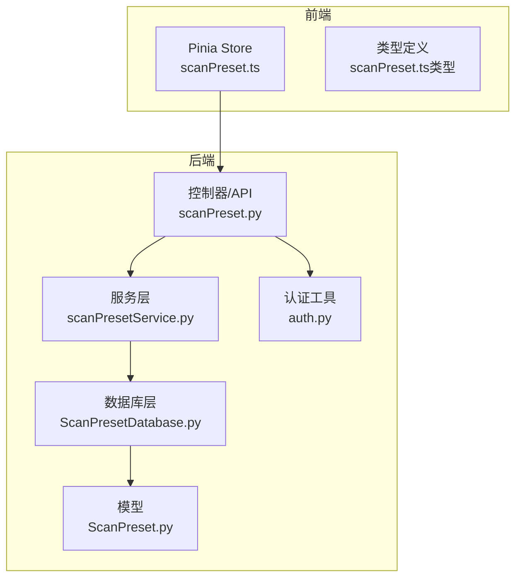
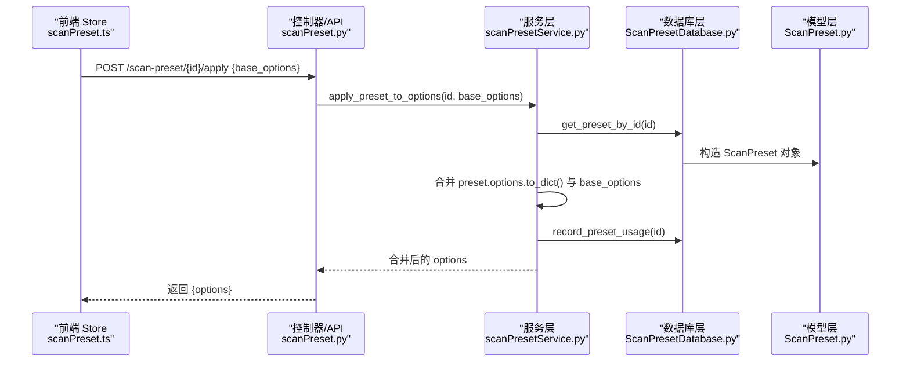
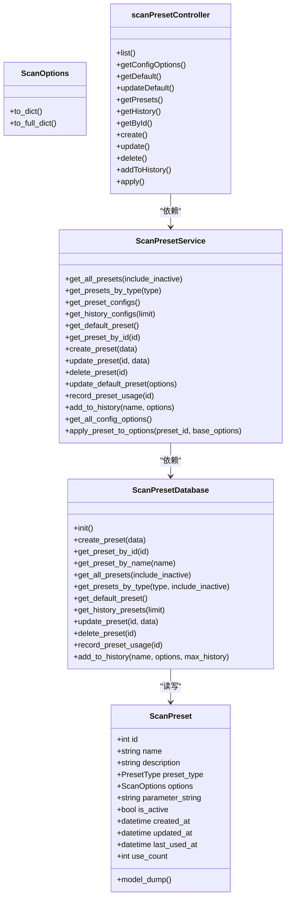

# 扫描配置服务

<cite>
**本文引用的文件**
- [ScanPreset.py](file://src/backEnd/model/ScanPreset.py)
- [ScanPresetDatabase.py](file://src/backEnd/model/ScanPresetDatabase.py)
- [scanPresetService.py](file://src/backEnd/service/scanPresetService.py)
- [scanPreset.py](file://src/backEnd/api/commonApi/scanPreset.py)
- [auth.py](file://src/backEnd/utils/auth.py)
- [scanPreset.ts](file://src/frontEnd/src/stores/scanPreset.ts)
- [scanPreset.ts（类型定义）](file://src/frontEnd/src/types/scanPreset.ts)
- [AGENTS.md](file://AGENTS.md)
</cite>

## 目录
1. [简介](#简介)
2. [项目结构](#项目结构)
3. [核心组件](#核心组件)
4. [架构总览](#架构总览)
5. [详细组件分析](#详细组件分析)
6. [依赖关系分析](#依赖关系分析)
7. [性能考虑](#性能考虑)
8. [故障排查指南](#故障排查指南)
9. [结论](#结论)
10. [附录](#附录)

## 简介
本文件围绕扫描配置服务展开，重点解析 scanPresetService.py 的实现机制，涵盖：
- 常用扫描配置的增删改查（CRUD）
- 配置的导入、导出与版本控制思路
- ScanPreset 数据模型设计与兼容性校验
- ScanPresetDatabase 的持久化存储实现
- 服务层对参数合法性的验证策略
- 配置创建、克隆与批量操作的业务流程
- 将预设配置应用于新任务以实现快速启动
- 服务层与 scanPresetController 的交互模式
- 配置共享与权限管理的实现策略

## 项目结构
扫描配置服务位于后端 Python 层，采用“模型-服务-控制器”三层结构，并与前端 Pinia Store 协作完成用户交互与任务启动。

图表来源
- [scanPreset.py](file://src/backEnd/api/commonApi/scanPreset.py#L1-L325)
- [scanPresetService.py](file://src/backEnd/service/scanPresetService.py#L1-L182)
- [ScanPresetDatabase.py](file://src/backEnd/model/ScanPresetDatabase.py#L1-L514)
- [ScanPreset.py](file://src/backEnd/model/ScanPreset.py#L1-L231)
- [auth.py](file://src/backEnd/utils/auth.py#L1-L23)
- [scanPreset.ts](file://src/frontEnd/src/stores/scanPreset.ts#L1-L296)
- [scanPreset.ts（类型定义）](file://src/frontEnd/src/types/scanPreset.ts#L1-L199)

章节来源
- [scanPreset.py](file://src/backEnd/api/commonApi/scanPreset.py#L1-L325)
- [scanPresetService.py](file://src/backEnd/service/scanPresetService.py#L1-L182)
- [ScanPresetDatabase.py](file://src/backEnd/model/ScanPresetDatabase.py#L1-L514)
- [ScanPreset.py](file://src/backEnd/model/ScanPreset.py#L1-L231)
- [auth.py](file://src/backEnd/utils/auth.py#L1-L23)
- [scanPreset.ts](file://src/frontEnd/src/stores/scanPreset.ts#L1-L296)
- [scanPreset.ts（类型定义）](file://src/frontEnd/src/types/scanPreset.ts#L1-L199)

## 核心组件
- 数据模型层：ScanPreset、ScanOptions、PresetType；提供字段约束、默认值与序列化策略，确保与 sqlmap 的 optiondict.py 字段保持一致。
- 数据库层：ScanPresetDatabase，负责 SQLite 表结构、索引、迁移、CRUD、默认配置初始化、历史记录维护与使用计数。
- 服务层：ScanPresetService，封装业务规则（如默认配置保护、名称唯一性、合并选项等），协调数据库层。
- 控制器/API：scanPreset.py，暴露 REST 接口，处理鉴权、参数校验与响应包装。
- 前端：Pinia Store 提供配置加载、选择、应用、保存为新预设、历史记录等功能；类型定义与默认选项保证 UI 一致性。

章节来源
- [ScanPreset.py](file://src/backEnd/model/ScanPreset.py#L1-L231)
- [ScanPresetDatabase.py](file://src/backEnd/model/ScanPresetDatabase.py#L1-L514)
- [scanPresetService.py](file://src/backEnd/service/scanPresetService.py#L1-L182)
- [scanPreset.py](file://src/backEnd/api/commonApi/scanPreset.py#L1-L325)
- [scanPreset.ts](file://src/frontEnd/src/stores/scanPreset.ts#L1-L296)
- [scanPreset.ts（类型定义）](file://src/frontEnd/src/types/scanPreset.ts#L1-L199)

## 架构总览
下面的序列图展示了从前端到后端再到数据库的典型调用链路，以“应用预设配置”为例。

图表来源
- [scanPreset.ts](file://src/frontEnd/src/stores/scanPreset.ts#L120-L130)
- [scanPreset.py](file://src/backEnd/api/commonApi/scanPreset.py#L300-L325)
- [scanPresetService.py](file://src/backEnd/service/scanPresetService.py#L156-L178)
- [ScanPresetDatabase.py](file://src/backEnd/model/ScanPresetDatabase.py#L183-L216)
- [ScanPreset.py](file://src/backEnd/model/ScanPreset.py#L92-L105)

章节来源
- [scanPreset.ts](file://src/frontEnd/src/stores/scanPreset.ts#L120-L130)
- [scanPreset.py](file://src/backEnd/api/commonApi/scanPreset.py#L300-L325)
- [scanPresetService.py](file://src/backEnd/service/scanPresetService.py#L156-L178)
- [ScanPresetDatabase.py](file://src/backEnd/model/ScanPresetDatabase.py#L183-L216)
- [ScanPreset.py](file://src/backEnd/model/ScanPreset.py#L92-L105)

## 详细组件分析

### 数据模型：ScanPreset 与 ScanOptions
- 设计要点
  - 字段与 sqlmap 的 optiondict.py 保持一致，确保与 sqlmap 引擎兼容。
  - 使用 Pydantic BaseModel 进行字段约束（范围、类型、必填等），并在序列化时将 datetime 转换为 ISO 字符串。
  - ScanOptions 提供 to_dict() 与 to_full_dict()，前者仅输出非默认值，后者输出完整字典，便于最小化存储与传输。
  - 预定义默认配置、快速扫描、深度扫描、安全扫描等快捷模板，便于快速启动。
- 关键字段类别
  - Detection、Injection、Techniques、Request、Optimization、Enumeration、General 等，覆盖 sqlmap 主要扫描维度。
- 版本控制与兼容性
  - 通过 to_full_dict() 输出完整选项，便于后续迁移与兼容性判断。
  - 字段命名与枚举值与 sqlmap 保持一致，减少参数映射成本。

章节来源
- [ScanPreset.py](file://src/backEnd/model/ScanPreset.py#L1-L231)

### 数据库层：ScanPresetDatabase
- 表结构与索引
  - 表 scan_presets 包含 id、name、description、preset_type、options、parameter_string、is_active、created_at、updated_at、last_used_at、use_count。
  - 为 preset_type、is_active、name 建立索引，提升查询效率。
- 初始化与迁移
  - init() 中创建表、添加 parameter_string 列（迁移）、初始化默认预设（默认、快速、深度、安全）。
- CRUD 实现
  - create_preset：构造 ScanPreset 对象，序列化 options 为 JSON 存储，返回自增 id。
  - get_preset_by_id/name/type/history：支持按类型过滤、是否激活过滤、历史记录按 last_used_at 排序。
  - update_preset：动态构建更新字段，支持部分字段更新；对 options 进行校验与序列化。
  - delete_preset：禁止删除默认配置。
  - record_preset_usage：使用计数加一、更新 last_used_at。
  - add_to_history：去重更新或新建历史记录，并清理超出上限的历史条目。
- 安全与健壮性
  - _row_to_preset() 对列类型进行安全转换（字符串转 datetime、布尔、整数），避免脏数据导致异常。
  - 日志记录错误信息，便于定位问题。

章节来源
- [ScanPresetDatabase.py](file://src/backEnd/model/ScanPresetDatabase.py#L1-L514)

### 服务层：ScanPresetService
- 业务规则
  - get_all_presets/get_presets_by_type/get_preset_configs/get_history_configs/get_default_preset：聚合查询结果与默认配置。
  - create_preset：校验名称非空且唯一，再委托数据库层创建。
  - update_preset：校验存在性、默认配置保护（不可改名）、名称冲突检查，再委托数据库层更新。
  - delete_preset：校验存在性与默认配置保护。
  - update_default_preset：仅允许更新默认配置的 options。
  - record_preset_usage/add_to_history：记录使用与历史维护。
  - get_all_config_options：返回默认、常用、历史三类配置，供前端下拉菜单使用。
  - apply_preset_to_options：将预设选项与基础选项合并，优先使用预设中的非默认值；同时记录使用。
- 单例与依赖注入
  - 通过 get_scan_preset_db() 获取数据库实例，避免重复初始化。

章节来源
- [scanPresetService.py](file://src/backEnd/service/scanPresetService.py#L1-L182)

### 控制器/API：scanPreset.py
- 接口清单
  - GET /scan-preset/list：获取所有预设（可选包含未激活）。
  - GET /scan-preset/config-options：获取默认、常用、历史三类配置。
  - GET /scan-preset/default：获取默认配置。
  - PUT /scan-preset/default：更新默认配置。
  - GET /scan-preset/presets：获取常用配置列表。
  - GET /scan-preset/history：获取历史配置列表（支持 limit）。
  - GET /scan-preset/{id}：按 ID 获取预设。
  - POST /scan-preset：创建预设。
  - PUT /scan-preset/{id}：更新预设。
  - DELETE /scan-preset/{id}：删除预设。
  - POST /scan-preset/history：将当前配置加入历史记录。
  - POST /scan-preset/{id}/apply：应用预设到基础选项并返回合并结果。
- 鉴权
  - 通过 get_current_user() 进行简单鉴权（本地回环地址放行，其他需 token）。
- 响应包装
  - 统一使用 BaseResponseMsg 包裹成功/失败、状态码与数据。

章节来源
- [scanPreset.py](file://src/backEnd/api/commonApi/scanPreset.py#L1-L325)
- [auth.py](file://src/backEnd/utils/auth.py#L1-L23)
- [AGENTS.md](file://AGENTS.md#L230-L236)

### 前端集成：Pinia Store 与类型定义
- Store 功能
  - 加载配置选项（默认、常用、历史）、加载所有预设、选择并应用预设、更新当前选项、重置为默认、更新默认配置、创建/更新/删除预设、保存当前为新预设、添加到历史、计算有效选项（非默认值）。
- 类型与默认值
  - DEFAULT_SCAN_OPTIONS 提供默认扫描选项，TECHNIQUE_OPTIONS、LEVEL_OPTIONS、RISK_OPTIONS 等为 UI 下拉提供选项。
- 与后端协作
  - 通过 scanPresetApi 调用后端接口，统一处理 loading、错误与刷新列表。

章节来源
- [scanPreset.ts](file://src/frontEnd/src/stores/scanPreset.ts#L1-L296)
- [scanPreset.ts（类型定义）](file://src/frontEnd/src/types/scanPreset.ts#L1-L199)

### 预设配置的导入、导出与版本控制
- 导入
  - 通过 POST /scan-preset 接口传入 options 与可选 parameter_string，即可将外部配置导入为常用预设。
- 导出
  - 通过 GET /scan-preset/{id} 或 GET /scan-preset/config-options 获取预设的 options 结构，前端可将其序列化为 JSON 文件。
- 版本控制
  - 历史记录通过 add_to_history 自动维护，最多保留最近 N 条（默认 20），超出部分自动清理。
  - 使用 created_at/updated_at/last_used_at 与 use_count 辅助追踪与审计。

章节来源
- [ScanPresetDatabase.py](file://src/backEnd/model/ScanPresetDatabase.py#L377-L432)
- [scanPreset.py](file://src/backEnd/api/commonApi/scanPreset.py#L270-L298)

### 参数合法性验证与 sqlmap 兼容性
- 服务层验证
  - 名称非空且唯一；默认配置不可删除；默认配置名称不可更改；更新时检查名称冲突。
- 数据库层验证
  - options 字段通过 ScanOptions 校验（范围、类型、默认值），JSON 序列化存储，读取时反序列化并做类型安全转换。
- 兼容性策略
  - 字段名与 sqlmap optiondict.py 保持一致；to_dict() 仅输出非默认值，减少冗余；to_full_dict() 输出完整字典，便于迁移与兼容。

章节来源
- [scanPresetService.py](file://src/backEnd/service/scanPresetService.py#L63-L120)
- [ScanPresetDatabase.py](file://src/backEnd/model/ScanPresetDatabase.py#L156-L181)
- [ScanPreset.py](file://src/backEnd/model/ScanPreset.py#L92-L105)

### 配置创建、克隆与批量操作流程
- 创建
  - 前端调用 POST /scan-preset，携带 name、description、preset_type、options；服务层校验名称唯一性后创建。
- 克隆
  - 前端可将当前 options 作为新预设创建，或调用“保存当前为新预设”逻辑。
- 批量操作
  - 通过 API 列表接口批量获取常用/历史配置，前端可进行批量应用、删除、更新等操作。

章节来源
- [scanPreset.ts](file://src/frontEnd/src/stores/scanPreset.ts#L170-L214)
- [scanPreset.py](file://src/backEnd/api/commonApi/scanPreset.py#L191-L215)

### 快速启动新任务：预设配置的应用
- 应用流程
  - 前端选择预设后，调用 POST /scan-preset/{id}/apply，后端返回合并后的 options，前端据此启动任务。
- 选项合并策略
  - 优先使用预设中的非默认值；若前端提供 base_options，则以 base 为基础，再叠加预设差异。

章节来源
- [scanPreset.ts](file://src/frontEnd/src/stores/scanPreset.ts#L121-L129)
- [scanPreset.py](file://src/backEnd/api/commonApi/scanPreset.py#L300-L325)
- [scanPresetService.py](file://src/backEnd/service/scanPresetService.py#L156-L178)

### 服务层与 scanPresetController 的交互模式
- 控制器负责：
  - 路由注册、鉴权、请求体解析、响应包装。
- 服务层负责：
  - 业务规则、参数校验、调用数据库层执行具体操作。
- 交互模式
  - 控制器接收请求 -> 调用服务层方法 -> 服务层访问数据库层 -> 返回结果给控制器 -> 控制器返回响应。

章节来源
- [scanPreset.py](file://src/backEnd/api/commonApi/scanPreset.py#L1-L325)
- [scanPresetService.py](file://src/backEnd/service/scanPresetService.py#L1-L182)

### 配置共享与权限管理
- 权限策略
  - 本地回环地址（127.0.0.1/localhost）免鉴权；其他来源需提供 token。
- 共享策略
  - 默认配置、常用配置、历史配置三类集合对用户可见；前端通过下拉菜单选择并应用。
  - 历史记录自动维护，便于团队复用最近使用的配置。

章节来源
- [auth.py](file://src/backEnd/utils/auth.py#L1-L23)
- [scanPreset.py](file://src/backEnd/api/commonApi/scanPreset.py#L1-L325)
- [ScanPresetDatabase.py](file://src/backEnd/model/ScanPresetDatabase.py#L377-L432)

## 依赖关系分析

图表来源
- [ScanPreset.py](file://src/backEnd/model/ScanPreset.py#L1-L231)
- [ScanPresetDatabase.py](file://src/backEnd/model/ScanPresetDatabase.py#L1-L514)
- [scanPresetService.py](file://src/backEnd/service/scanPresetService.py#L1-L182)
- [scanPreset.py](file://src/backEnd/api/commonApi/scanPreset.py#L1-L325)

章节来源
- [ScanPreset.py](file://src/backEnd/model/ScanPreset.py#L1-L231)
- [ScanPresetDatabase.py](file://src/backEnd/model/ScanPresetDatabase.py#L1-L514)
- [scanPresetService.py](file://src/backEnd/service/scanPresetService.py#L1-L182)
- [scanPreset.py](file://src/backEnd/api/commonApi/scanPreset.py#L1-L325)

## 性能考虑
- 查询优化
  - 为 preset_type、is_active、name 建立索引，提升按类型与激活状态筛选的性能。
- 写入优化
  - 使用批量插入与参数化查询，避免拼接 SQL。
- 序列化开销
  - to_dict() 仅输出非默认值，减少存储与网络传输体积。
- 历史记录清理
  - add_to_history 后自动清理超出上限的历史记录，避免表膨胀。

章节来源
- [ScanPresetDatabase.py](file://src/backEnd/model/ScanPresetDatabase.py#L73-L80)
- [ScanPresetDatabase.py](file://src/backEnd/model/ScanPresetDatabase.py#L377-L432)
- [ScanPreset.py](file://src/backEnd/model/ScanPreset.py#L92-L105)

## 故障排查指南
- 常见错误与日志
  - 创建失败：名称已存在或数据库异常，查看服务层与数据库层的日志输出。
  - 更新失败：预设不存在或名称冲突，检查 ID 与名称唯一性。
  - 删除失败：尝试删除默认配置，服务层会拒绝并记录警告。
  - 应用失败：预设不存在或请求体解析异常，检查请求参数与 ID。
- 排查步骤
  - 检查控制器日志与 HTTP 状态码。
  - 在服务层断点或日志中确认参数校验与调用链。
  - 在数据库层确认表结构、索引与迁移是否成功。
- 建议
  - 使用 GET /scan-preset/config-options 与 GET /scan-preset/list 核对配置状态。
  - 通过 GET /scan-preset/default 验证默认配置是否正确初始化。

章节来源
- [scanPreset.py](file://src/backEnd/api/commonApi/scanPreset.py#L191-L215)
- [scanPresetService.py](file://src/backEnd/service/scanPresetService.py#L63-L120)
- [ScanPresetDatabase.py](file://src/backEnd/model/ScanPresetDatabase.py#L156-L181)

## 结论
扫描配置服务通过清晰的三层架构实现了对常用扫描配置的全生命周期管理。数据模型与数据库层确保了与 sqlmap 的兼容性与持久化可靠性；服务层提供了完善的业务规则与参数校验；控制器/API 提供了标准化的接口；前端 Store 则将这些能力无缝整合到用户工作流中。历史记录与使用计数为配置复用与审计提供了支撑，权限与共享策略保障了多用户环境下的可用性与安全性。

## 附录
- API 接口清单（节选）
  - GET /scan-preset/list
  - GET /scan-preset/config-options
  - GET /scan-preset/default
  - PUT /scan-preset/default
  - GET /scan-preset/presets
  - GET /scan-preset/history
  - GET /scan-preset/{id}
  - POST /scan-preset
  - PUT /scan-preset/{id}
  - DELETE /scan-preset/{id}
  - POST /scan-preset/history
  - POST /scan-preset/{id}/apply

章节来源
- [AGENTS.md](file://AGENTS.md#L230-L236)
- [scanPreset.py](file://src/backEnd/api/commonApi/scanPreset.py#L1-L325)