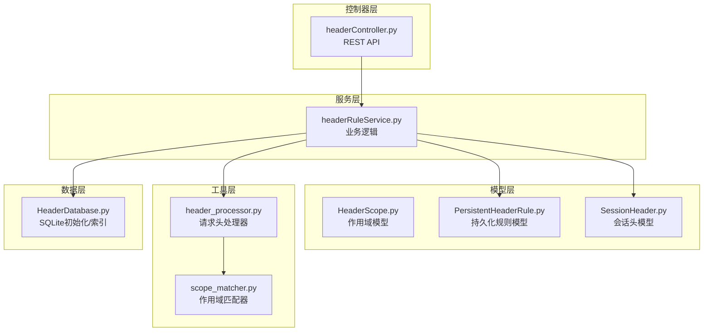
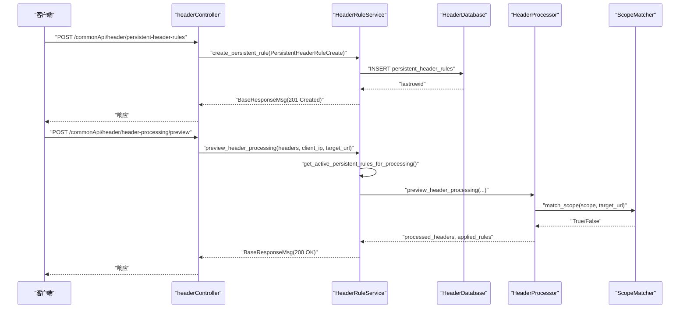
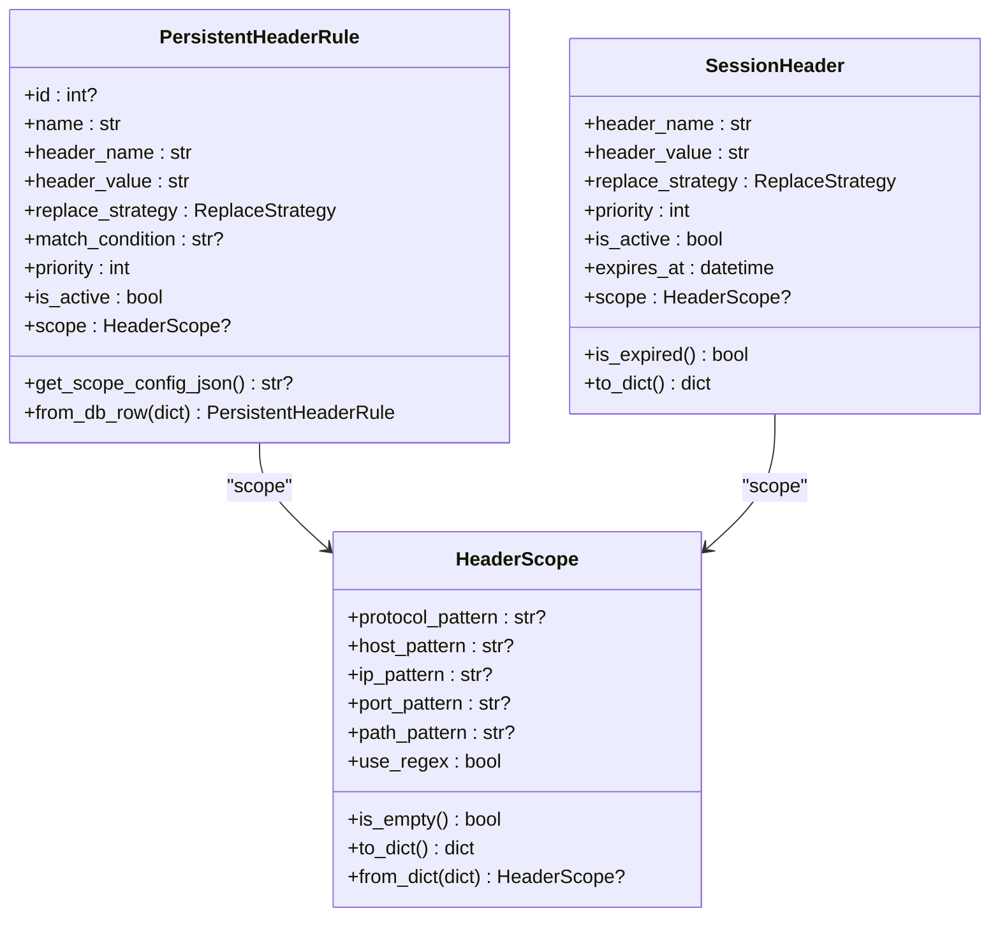
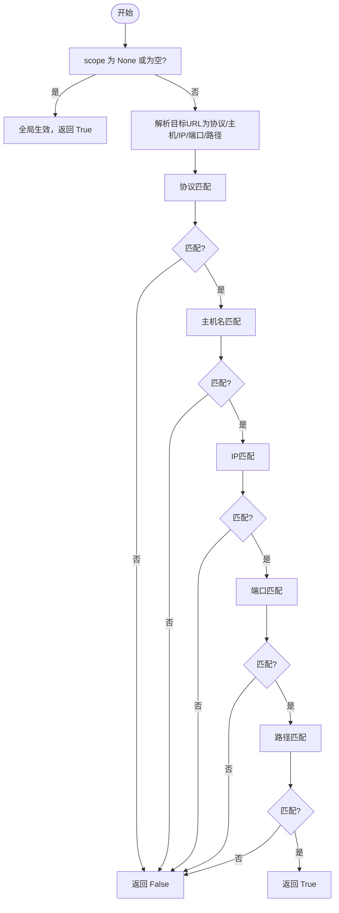
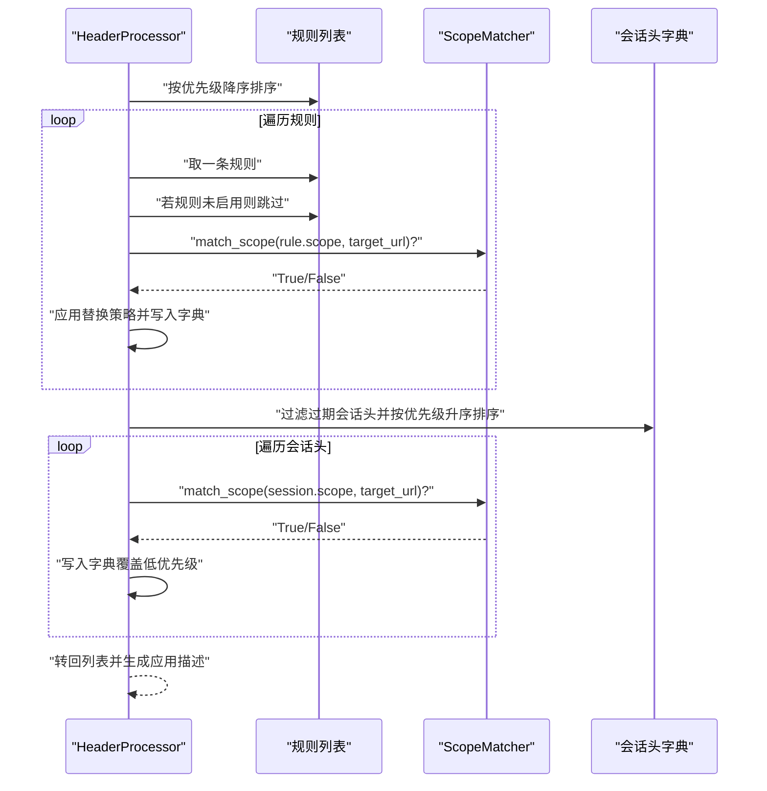
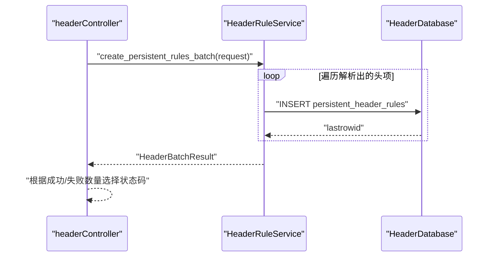
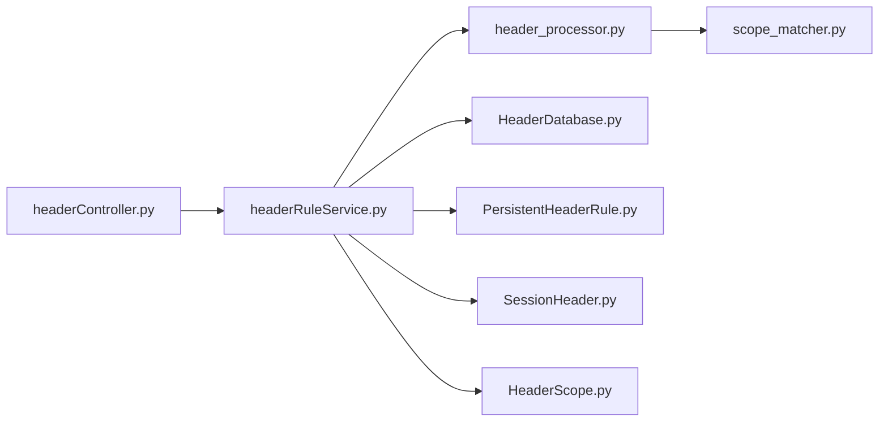

# 请求头规则服务

<cite>
**本文引用的文件**
- [headerRuleService.py](file://src/backEnd/service/headerRuleService.py)
- [headerController.py](file://src/backEnd/api/commonApi/headerController.py)
- [HeaderScope.py](file://src/backEnd/model/HeaderScope.py)
- [PersistentHeaderRule.py](file://src/backEnd/model/PersistentHeaderRule.py)
- [SessionHeader.py](file://src/backEnd/model/SessionHeader.py)
- [scope_matcher.py](file://src/backEnd/utils/scope_matcher.py)
- [header_processor.py](file://src/backEnd/utils/header_processor.py)
- [HeaderDatabase.py](file://src/backEnd/model/HeaderDatabase.py)
- [test_header_processor_scope.py](file://src/backEnd/tests/test_header_processor_scope.py)
- [test_scope_matcher.py](file://src/backEnd/tests/test_scope_matcher.py)
</cite>

## 目录
1. [简介](#简介)
2. [项目结构](#项目结构)
3. [核心组件](#核心组件)
4. [架构总览](#架构总览)
5. [详细组件分析](#详细组件分析)
6. [依赖分析](#依赖分析)
7. [性能考虑](#性能考虑)
8. [故障排查指南](#故障排查指南)
9. [结论](#结论)
10. [附录](#附录)

## 简介
本文件围绕请求头规则服务展开，系统性解析 headerRuleService 的实现细节，涵盖：
- 持久化请求头规则的 CRUD 与批量操作
- 会话级请求头的管理与作用域匹配
- HeaderScope 与 PersistentHeaderRule 数据模型的关系
- scope_matcher 的 URL 作用域匹配算法
- 规则优先级、冲突解决与作用域继承的业务规则
- 规则创建/更新/删除的完整流程与扫描任务配置生成
- 服务层与 headerController 的接口契约
- 高并发场景下的数据一致性保障机制

## 项目结构
请求头规则服务位于后端模块 src/backEnd 下，采用“控制器-服务-模型-工具”的分层设计：
- 控制器层：headerController 提供 REST API，调用服务层
- 服务层：headerRuleService 实现业务逻辑与数据访问
- 模型层：HeaderScope、PersistentHeaderRule、SessionHeader 定义数据结构与校验
- 工具层：scope_matcher 负责作用域匹配；header_processor 负责规则应用与预览
- 数据层：HeaderDatabase 负责 SQLite 初始化与索引

图表来源
- [headerController.py](file://src/backEnd/api/commonApi/headerController.py#L1-L120)
- [headerRuleService.py](file://src/backEnd/service/headerRuleService.py#L1-L120)
- [HeaderScope.py](file://src/backEnd/model/HeaderScope.py#L1-L60)
- [PersistentHeaderRule.py](file://src/backEnd/model/PersistentHeaderRule.py#L1-L40)
- [SessionHeader.py](file://src/backEnd/model/SessionHeader.py#L1-L40)
- [scope_matcher.py](file://src/backEnd/utils/scope_matcher.py#L1-L60)
- [header_processor.py](file://src/backEnd/utils/header_processor.py#L1-L40)
- [HeaderDatabase.py](file://src/backEnd/model/HeaderDatabase.py#L1-L40)

章节来源
- [headerController.py](file://src/backEnd/api/commonApi/headerController.py#L1-L120)
- [headerRuleService.py](file://src/backEnd/service/headerRuleService.py#L1-L120)
- [HeaderDatabase.py](file://src/backEnd/model/HeaderDatabase.py#L1-L40)

## 核心组件
- HeaderRuleService：提供持久化规则的创建、查询、更新、删除、批量导入与预览能力，并协调会话头与规则的应用。
- HeaderScope：定义协议、主机、IP、端口、路径等多维作用域匹配规则，支持关键字与正则两种模式。
- PersistentHeaderRule：持久化规则数据模型，包含名称、请求头名、值、替换策略、匹配条件、优先级、启用状态、作用域等。
- SessionHeader：会话级请求头模型，支持 TTL、优先级、作用域与过期检测。
- ScopeMatcher：作用域匹配器，负责将 URL 解析为协议/主机/IP/端口/路径五维，按 AND 逻辑匹配。
- HeaderProcessor：请求头处理器，负责将原始请求头转换为字典、应用持久化规则与会话头、生成预览结果。

章节来源
- [headerRuleService.py](file://src/backEnd/service/headerRuleService.py#L1-L120)
- [HeaderScope.py](file://src/backEnd/model/HeaderScope.py#L1-L60)
- [PersistentHeaderRule.py](file://src/backEnd/model/PersistentHeaderRule.py#L1-L40)
- [SessionHeader.py](file://src/backEnd/model/SessionHeader.py#L1-L40)
- [scope_matcher.py](file://src/backEnd/utils/scope_matcher.py#L1-L60)
- [header_processor.py](file://src/backEnd/utils/header_processor.py#L1-L40)

## 架构总览
服务层通过 DataStore 访问 HeaderDatabase，持久化规则与会话头分别存储在独立表中。控制器层接收请求，调用服务层完成业务处理，最终返回统一响应体。

图表来源
- [headerController.py](file://src/backEnd/api/commonApi/headerController.py#L60-L120)
- [headerRuleService.py](file://src/backEnd/service/headerRuleService.py#L74-L176)
- [header_processor.py](file://src/backEnd/utils/header_processor.py#L214-L258)
- [scope_matcher.py](file://src/backEnd/utils/scope_matcher.py#L35-L141)

## 详细组件分析

### 数据模型关系与职责
- HeaderScope：定义作用域配置，支持协议、主机、IP、端口、路径与正则开关；提供 is_empty 判定与 to_dict/from_dict 序列化。
- PersistentHeaderRule：封装规则字段与 scope_config 的序列化/反序列化；提供 from_db_row 从数据库行构建对象。
- SessionHeader：封装会话头字段与 TTL、过期检测；支持 scope 配置。
- HeaderDatabase：初始化表结构、索引与列迁移，保证历史数据库兼容。

图表来源
- [HeaderScope.py](file://src/backEnd/model/HeaderScope.py#L1-L187)
- [PersistentHeaderRule.py](file://src/backEnd/model/PersistentHeaderRule.py#L1-L104)
- [SessionHeader.py](file://src/backEnd/model/SessionHeader.py#L1-L97)

章节来源
- [HeaderScope.py](file://src/backEnd/model/HeaderScope.py#L1-L187)
- [PersistentHeaderRule.py](file://src/backEnd/model/PersistentHeaderRule.py#L1-L104)
- [SessionHeader.py](file://src/backEnd/model/SessionHeader.py#L1-L97)

### 作用域匹配算法（ScopeMatcher）
- 全局生效：scope 为 None 或 is_empty() 为真时，直接返回 True。
- URL 解析：解析协议、主机、IP、端口、路径；默认端口依据协议自动推断。
- 维度匹配：逐维检查，全部配置维度均需满足（AND 逻辑）。
- 匹配模式：支持关键字（通配符与多值 OR）、正则两种；正则表达式与 URL 解析结果均带缓存优化。

图表来源
- [scope_matcher.py](file://src/backEnd/utils/scope_matcher.py#L35-L141)
- [scope_matcher.py](file://src/backEnd/utils/scope_matcher.py#L143-L215)
- [scope_matcher.py](file://src/backEnd/utils/scope_matcher.py#L227-L346)

章节来源
- [scope_matcher.py](file://src/backEnd/utils/scope_matcher.py#L1-L346)

### 规则应用与预览（HeaderProcessor）
- 规则应用顺序：按优先级降序执行；仅对启用规则生效。
- 作用域控制：若规则配置了 scope 且提供 target_url，则先进行作用域匹配再应用。
- 替换策略：REPLACE、APPEND、PREPEND、CONDITIONAL、UPSERT；处理器中 CONDITIONAL 与 UPSERT 的行为明确。
- 会话头应用：过滤过期会话头，按优先级升序执行（后执行的覆盖先前的）。
- 预览：不实际应用，返回原始与处理后的请求头列表及应用规则描述。

图表来源
- [header_processor.py](file://src/backEnd/utils/header_processor.py#L90-L152)
- [header_processor.py](file://src/backEnd/utils/header_processor.py#L153-L212)
- [header_processor.py](file://src/backEnd/utils/header_processor.py#L213-L258)

章节来源
- [header_processor.py](file://src/backEnd/utils/header_processor.py#L1-L292)

### 服务层 CRUD 与批量操作
- 创建持久化规则：校验名称唯一性、请求头名称合法性、值非空；序列化 scope_config；插入数据库；构造响应。
- 查询规则：支持仅活跃规则与全部规则；按优先级降序与创建时间倒序排列；解析 scope_config。
- 更新规则：动态构建 SQL，逐字段更新；名称冲突检查；更新时间戳。
- 删除规则：存在性检查后删除。
- 预览处理：获取活跃规则与会话头，调用 HeaderProcessor 预览。
- 批量解析与创建：解析原始文本为请求头项，校验后批量创建持久化规则或会话头；返回汇总结果。
- 一体化批量：先解析再根据目标类型选择持久化或会话头创建。

图表来源
- [headerRuleService.py](file://src/backEnd/service/headerRuleService.py#L629-L824)
- [headerRuleService.py](file://src/backEnd/service/headerRuleService.py#L826-L976)

章节来源
- [headerRuleService.py](file://src/backEnd/service/headerRuleService.py#L74-L531)
- [headerRuleService.py](file://src/backEnd/service/headerRuleService.py#L533-L624)
- [headerRuleService.py](file://src/backEnd/service/headerRuleService.py#L629-L976)

### 与控制器的接口契约
- 持久化规则：POST/GET/GET/{id}/PUT/DELETE 对应创建/列表/详情/更新/删除。
- 会话头：POST/GET/DELETE/DELETE/{name}/PUT/{name} 对应设置/查询/清除/删除单个/更新单个。
- 预览：POST /header-processing/preview，支持 target_url 作用域匹配。
- 统计：GET /header-management/stats，聚合持久化与会话头统计。
- 批量：/headers/parse、/persistent-header-rules/batch、/session-headers/batch、/headers/batch-create。

章节来源
- [headerController.py](file://src/backEnd/api/commonApi/headerController.py#L60-L120)
- [headerController.py](file://src/backEnd/api/commonApi/headerController.py#L135-L237)
- [headerController.py](file://src/backEnd/api/commonApi/headerController.py#L354-L481)

### 高并发与数据一致性
- 数据库连接检查：每次操作前检查连接有效性，失败时返回 503。
- 原子性：单条规则的增删改在单次事务内完成；批量创建使用循环逐条插入，失败项单独记录。
- 并发冲突：
  - 名称唯一性：创建/更新时显式检查 name 冲突。
  - 会话头唯一约束：client_ip + header_name 唯一，避免重复覆盖。
- 缓存与性能：ScopeMatcher 内置正则与 URL 解析缓存，限制缓存大小并定期清理，降低重复计算成本。
- 作用域匹配：预览与实际应用共享同一匹配逻辑，确保一致性。

章节来源
- [headerRuleService.py](file://src/backEnd/service/headerRuleService.py#L44-L73)
- [headerRuleService.py](file://src/backEnd/service/headerRuleService.py#L338-L479)
- [scope_matcher.py](file://src/backEnd/utils/scope_matcher.py#L27-L41)
- [HeaderDatabase.py](file://src/backEnd/model/HeaderDatabase.py#L60-L100)

## 依赖分析
- HeaderRuleService 依赖：
  - DataStore.header_db：数据库连接
  - HeaderDatabase：表初始化与索引
  - HeaderProcessor：规则与会话头应用
  - ScopeMatcher：作用域匹配
  - 模型：PersistentHeaderRule、SessionHeader、HeaderScope
- HeaderController 依赖：
  - HeaderRuleService：业务入口
  - DataStore.get_session_header_manager：会话头管理器

图表来源
- [headerController.py](file://src/backEnd/api/commonApi/headerController.py#L1-L120)
- [headerRuleService.py](file://src/backEnd/service/headerRuleService.py#L1-L120)
- [header_processor.py](file://src/backEnd/utils/header_processor.py#L1-L40)
- [scope_matcher.py](file://src/backEnd/utils/scope_matcher.py#L1-L40)
- [HeaderDatabase.py](file://src/backEnd/model/HeaderDatabase.py#L1-L40)
- [PersistentHeaderRule.py](file://src/backEnd/model/PersistentHeaderRule.py#L1-L40)
- [SessionHeader.py](file://src/backEnd/model/SessionHeader.py#L1-L40)
- [HeaderScope.py](file://src/backEnd/model/HeaderScope.py#L1-L40)

章节来源
- [headerController.py](file://src/backEnd/api/commonApi/headerController.py#L1-L120)
- [headerRuleService.py](file://src/backEnd/service/headerRuleService.py#L1-L120)

## 性能考虑
- 索引优化：持久化规则表按 is_active、priority、name 建立索引；会话头表按 client_ip、expires 建立索引，提升查询效率。
- 缓存策略：ScopeMatcher 对正则与 URL 解析结果做缓存，限制最大容量并周期性清理，避免热点正则重复编译与解析。
- 优先级执行：规则按优先级降序执行，尽早短路；会话头按优先级升序执行，减少覆盖次数。
- 批量处理：批量解析与创建采用逐条插入，失败项单独记录，便于重试与审计。

章节来源
- [HeaderDatabase.py](file://src/backEnd/model/HeaderDatabase.py#L94-L100)
- [scope_matcher.py](file://src/backEnd/utils/scope_matcher.py#L27-L41)
- [header_processor.py](file://src/backEnd/utils/header_processor.py#L90-L152)

## 故障排查指南
- 数据库连接失败：服务层在每次操作前检查连接，失败返回 503；确认数据库文件路径与权限。
- 规则名称冲突：创建/更新时检查 name 是否已存在；更新时排除自身 ID。
- 请求头名称非法：HeaderProcessor.validate_header_name 校验失败；请使用合法的请求头名称格式。
- 作用域不匹配：ScopeMatcher.match_scope 返回 False；检查协议、主机、端口、路径与 use_regex 配置。
- 预览与实际差异：预览不应用规则，实际应用受优先级与替换策略影响；核对 target_url 与 scope 配置。
- 批量导入失败：检查解析结果与每条失败原因；根据返回的 failed_items 重试或修正。

章节来源
- [headerRuleService.py](file://src/backEnd/service/headerRuleService.py#L74-L176)
- [headerRuleService.py](file://src/backEnd/service/headerRuleService.py#L338-L479)
- [header_processor.py](file://src/backEnd/utils/header_processor.py#L48-L75)
- [scope_matcher.py](file://src/backEnd/utils/scope_matcher.py#L35-L141)
- [test_header_processor_scope.py](file://src/backEnd/tests/test_header_processor_scope.py#L1-L120)
- [test_scope_matcher.py](file://src/backEnd/tests/test_scope_matcher.py#L1-L120)

## 结论
请求头规则服务通过清晰的分层设计与严谨的数据模型，实现了对持久化规则与会话头的全生命周期管理。作用域匹配算法支持灵活的关键字与正则模式，配合优先级与替换策略，能够精准地为扫描任务生成符合预期的请求头配置。服务层在高并发场景下通过连接检查、缓存与索引优化保障性能与稳定性，并通过统一响应体与批量处理提升可观测性与可维护性。

## 附录
- 规则创建流程要点
  - 校验名称唯一性与请求头名称合法性
  - 可选序列化 scope_config
  - 插入数据库并返回 201
- 规则更新流程要点
  - 动态构建 SQL，逐字段更新
  - 名称冲突检查
  - 更新时间戳
- 规则删除流程要点
  - 存在性检查后删除
- 预览流程要点
  - 获取活跃规则与会话头
  - 传入 target_url 进行作用域匹配
  - 返回处理前后对比与应用规则描述

章节来源
- [headerRuleService.py](file://src/backEnd/service/headerRuleService.py#L74-L531)
- [headerRuleService.py](file://src/backEnd/service/headerRuleService.py#L533-L624)
- [header_processor.py](file://src/backEnd/utils/header_processor.py#L213-L258)