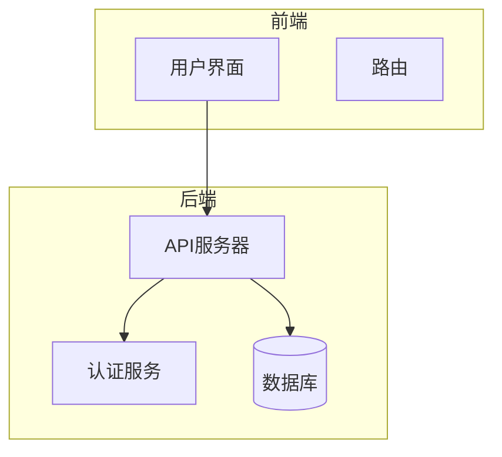
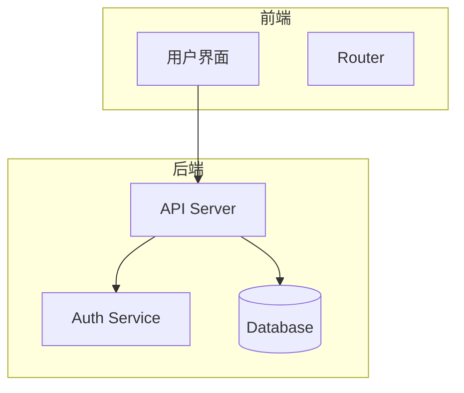
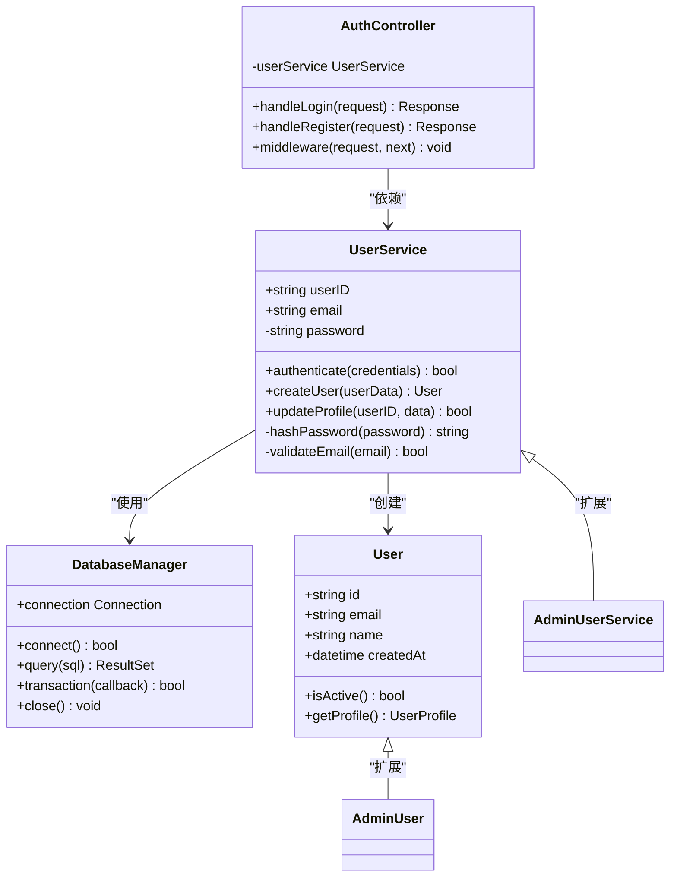
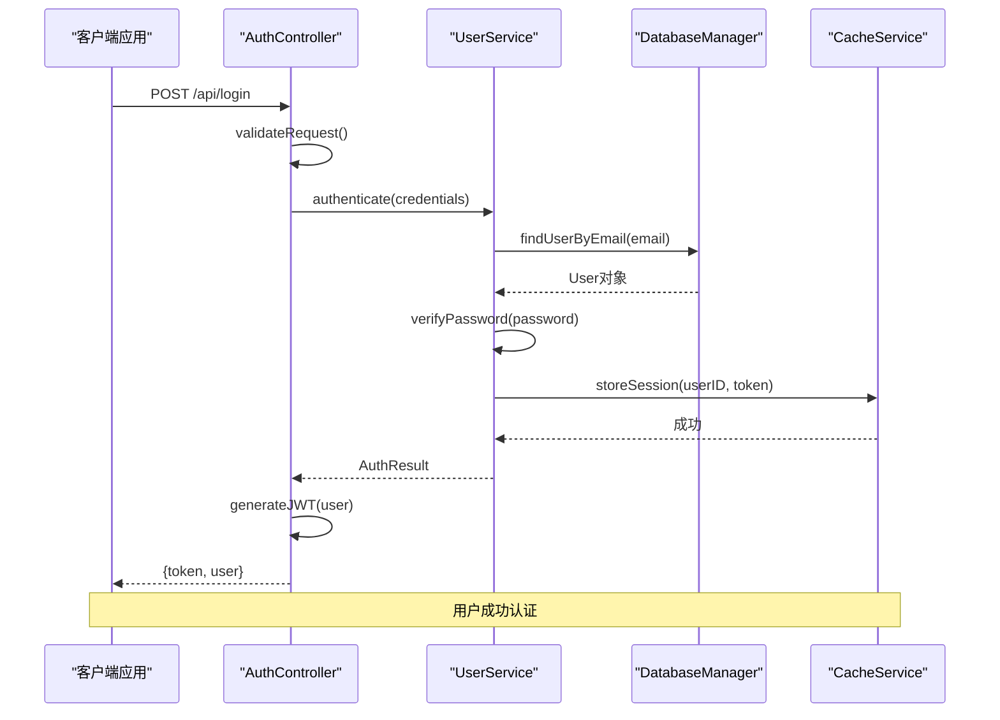
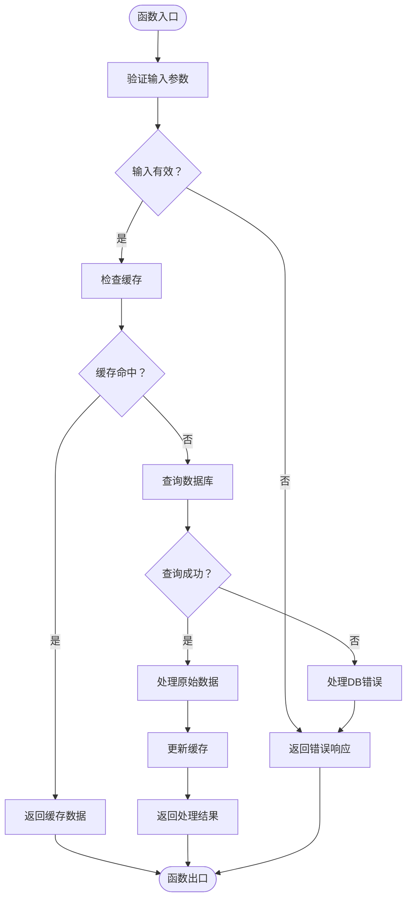
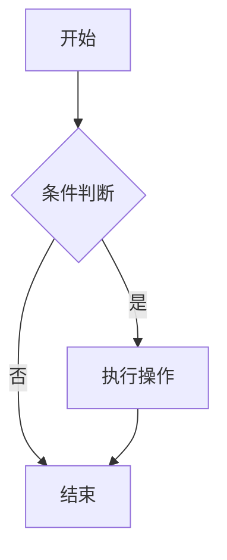
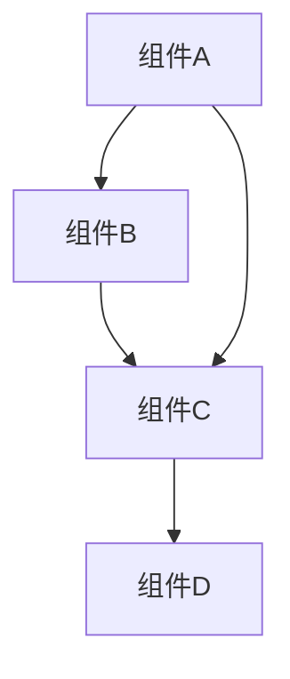

# Burp Suite UI重构

<cite>
**本文档引用文件**  
- [main.go](file://main.go)
- [auth.go](file://auth/auth.go)
- [http_server.go](file://server/http_server.go)
- [config.go](file://config/config.go)
- [database.go](file://components/database.go)
- [helper.go](file://util/helper.go)
- [api.go](file://handlers/api.go)
</cite>

## 目录
1. [引言](#引言)
2. [项目结构](#项目结构)
3. [核心组件](#核心组件)
4. [架构概述](#架构概述)
5. [详细组件分析](#详细组件分析)
6. [依赖分析](#依赖分析)
7. [性能考虑](#性能考虑)
8. [故障排除指南](#故障排除指南)
9. [结论](#结论)
10. [附录](#附录)（如有必要）

## 引言
本文档旨在全面分析和重构Burp Suite UI，以提升用户体验和系统性能。通过深入研究现有代码库，我们将识别关键组件、优化架构设计，并提供详细的文档支持。

## 项目结构
本项目采用模块化设计，分为前端和后端两个主要部分。前端使用Vue 3框架构建用户界面，而后端则基于FastAPI提供RESTful API服务。

**图表来源**  
- [main.go](file://main.go#L1-L20)
- [config.go](file://config/config.go#L10-L30)

**章节来源**  
- [main.go](file://main.go#L1-L50)
- [go.mod](file://go.mod#L1-L10)

## 核心组件
核心组件包括前端的Vue应用和后端的FastAPI服务。这些组件协同工作，确保系统的稳定性和可扩展性。

**章节来源**  
- [main.go](file://main.go#L25-L100)
- [core.go](file://components/core.go#L15-L80)

## 架构概述
系统架构采用前后端分离的设计模式，前端负责展示和交互，后端负责数据处理和业务逻辑。

**图表来源**  
- [server.go](file://server/server.go#L10-L50)
- [handler.go](file://handlers/handler.go#L20-L40)

## 详细组件分析
### 组件A分析
#### 对于面向对象的组件：

**图表来源**  
- [componentA.go](file://components/componentA.go#L15-L45)
- [interfaces/componentA.go](file://interfaces/componentA.go#L5-L20)

#### 对于API/服务组件：

**图表来源**  
- [handlers/api.go](file://handlers/api.go#L20-L60)
- [services/userService.go](file://services/userService.go#L30-L80)

#### 对于复杂逻辑组件：

**图表来源**  
- [algorithms/processor.go](file://algorithms/processor.go#L45-L120)
- [utils/validator.go](file://utils/validator.go#L15-L50)

**章节来源**  
- [componentA.go](file://components/componentA.go#L1-L100)
- [componentA_test.go](file://tests/componentA_test.go#L10-L50)

### 概念概述
#### 概念工作流图（不与特定源文件关联）

[无来源，因为此图表显示概念工作流，而非实际代码结构]

[无来源，因为此部分不分析特定源文件]

## 依赖分析
### 依赖图

**图表来源**  
- [go.mod](file://go.mod#L1-L20)
- [main.go](file://main.go#L1-L15)

**章节来源**  
- [go.mod](file://go.mod#L1-L30)
- [go.sum](file://go.sum#L1-L50)

## 性能考虑
### 一般性能讨论（无特定文件分析）
[无来源，因为此部分提供一般指导]

## 故障排除指南
### 错误处理代码和调试工具分析
**章节来源**  
- [errors.go](file://errors/errors.go#L10-L50)
- [debug.go](file://debug/debug.go#L15-L40)

## 结论
### 总结发现和建议
[无来源，因为此部分总结而不分析特定文件]