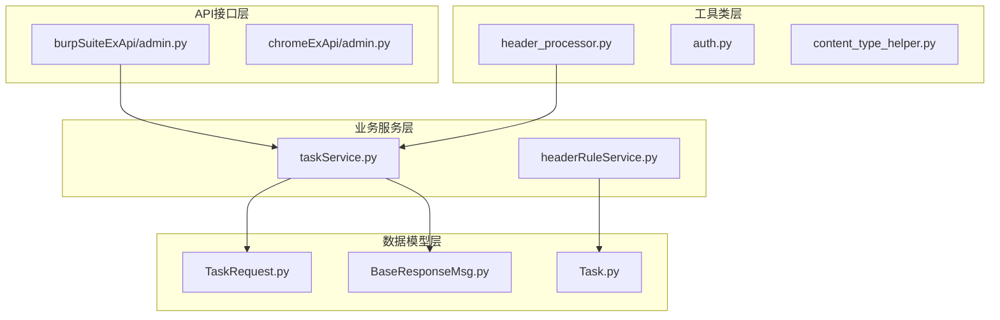
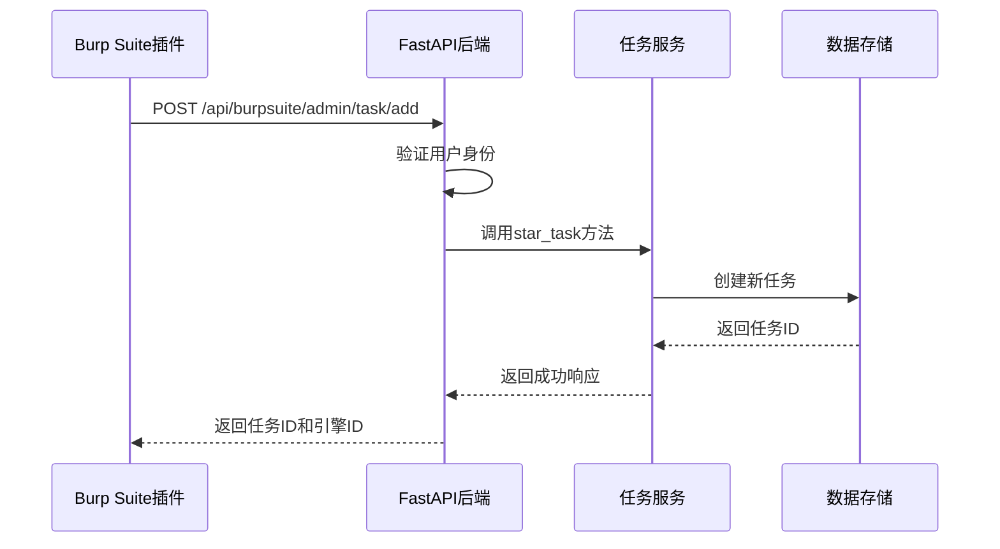
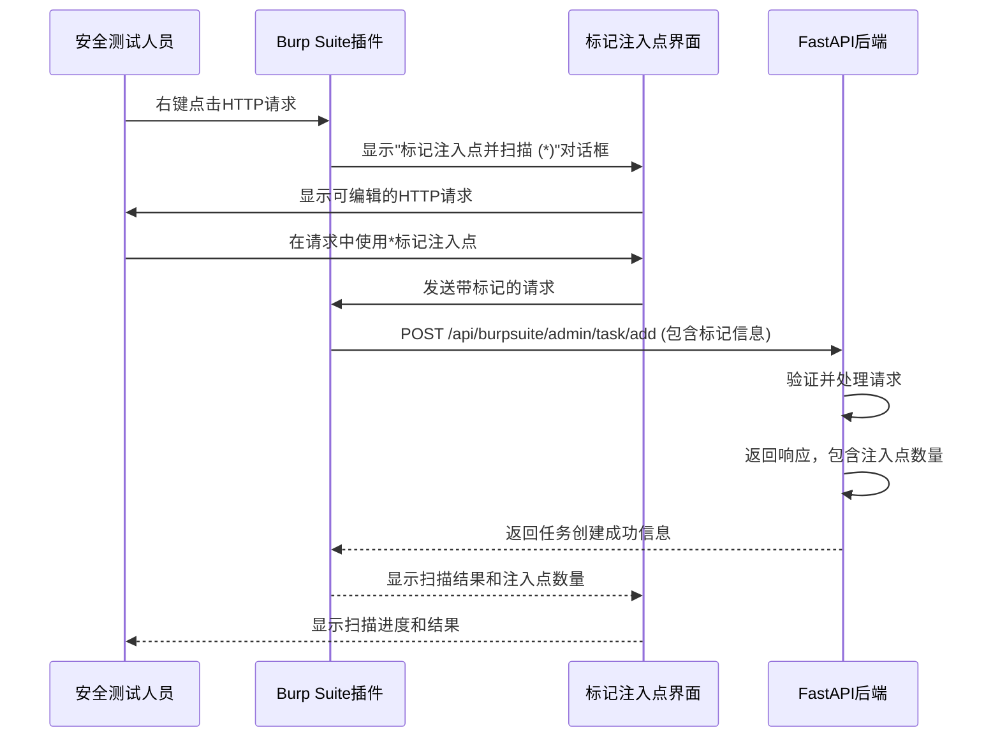
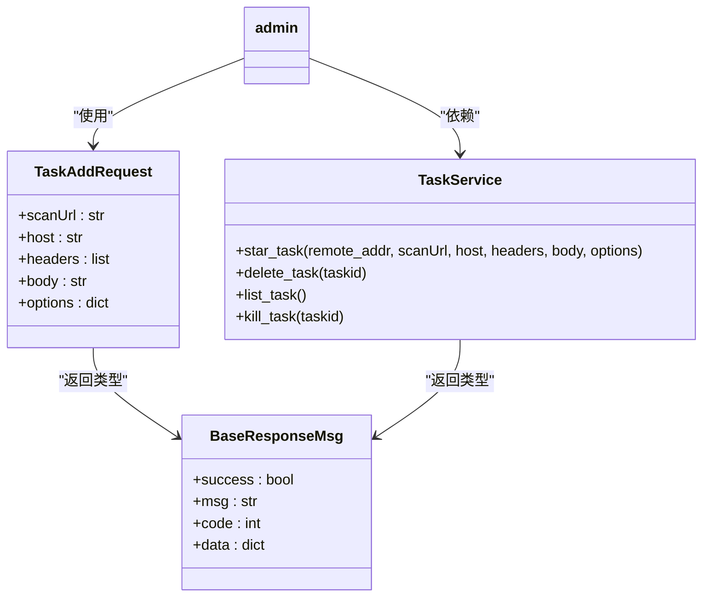
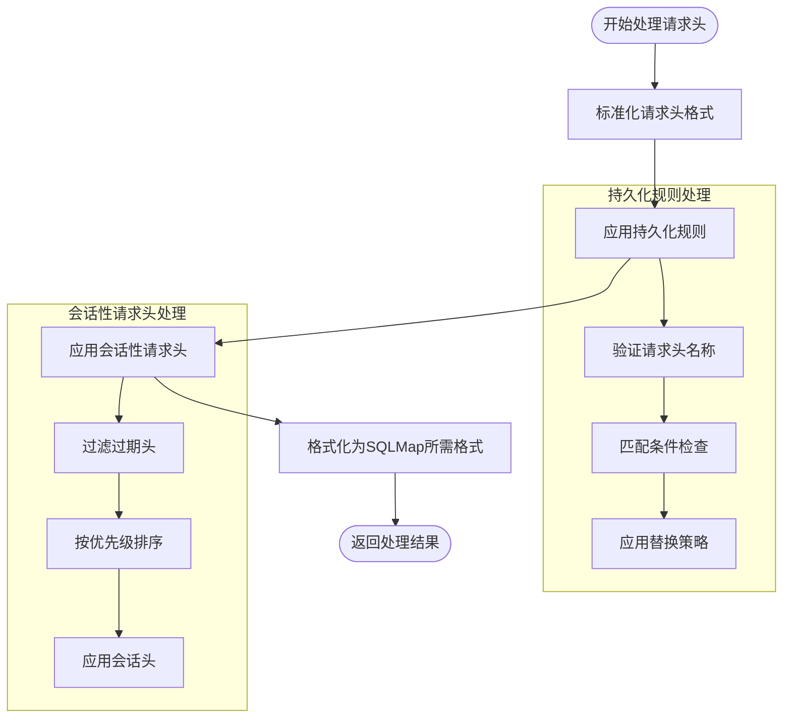
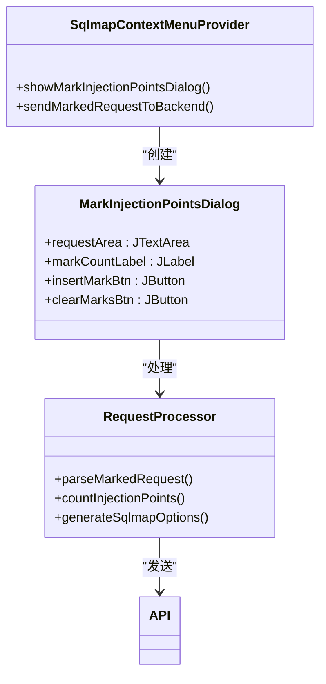
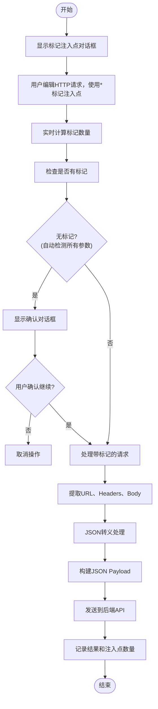
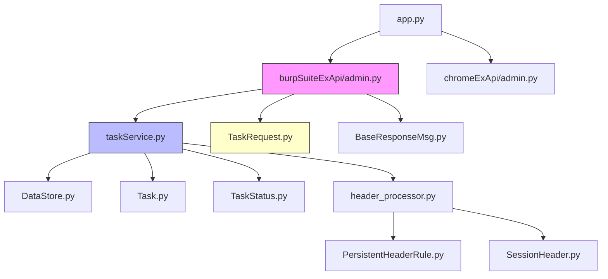

# Burp Suite插件集成

<cite>
**本文档引用的文件**  
- [admin.py](file://src/backEnd/api/burpSuiteExApi/admin.py)
- [TaskRequest.py](file://src/backEnd/model/requestModel/TaskRequest.py)
- [taskService.py](file://src/backEnd/service/taskService.py)
- [header_processor.py](file://src/backEnd/utils/header_processor.py)
- [app.py](file://src/backEnd/app.py)
- [SqlmapContextMenuProvider.java](file://src/burpEx/montoya-api/src/main/java/com/sqlmapwebui/burp/SqlmapContextMenuProvider.java)
- [BurpExtender.java](file://src/burpEx/legacy-api/src/main/java/com/sqlmapwebui/burp/BurpExtender.java)
</cite>

## 更新摘要
**变更内容**   
- 新增了关于使用*标记注入点的功能说明
- 添加了新的功能架构图和工作流图
- 更新了核心组件和架构概述部分以包含新功能
- 扩展了详细组件分析部分，增加了对新功能的代码分析
- 更新了故障排除指南以包含新功能的相关问题

## 目录
1. [引言](#引言)
2. [项目结构](#项目结构)
3. [核心组件](#核心组件)
4. [架构概述](#架构概述)
5. [详细组件分析](#详细组件分析)
6. [依赖分析](#依赖分析)
7. [性能考虑](#性能考虑)
8. [故障排除指南](#故障排除指南)
9. [结论](#结论)

## 引言
本文档全面阐述了Burp Suite插件与后端服务的集成架构。重点分析了Burp Suite如何捕获HTTP流量、序列化请求数据并通过API发送到WebUI系统。深入解析了后端API端点的处理逻辑，包括请求验证、解析机制以及对复杂请求体和自定义头的处理方式。同时提供了完整的API规范、实际工作流示例以及插件开发调试指南，旨在为安全测试人员提供跨Burp Suite和sqlmapWebUI的高效工作流建议。特别介绍了新增的使用*标记注入点的功能，该功能允许用户在HTTP请求中精确指定测试位置，提高漏洞检测的准确性和效率。

## 项目结构
本项目采用分层架构设计，主要分为API接口层、业务服务层、数据模型层和工具类层。API接口位于`api/burpSuiteExApi`目录下，负责接收来自Burp Suite插件的请求；业务逻辑由`service`目录下的服务类实现；数据结构定义在`model`目录中；通用工具函数则封装在`utils`目录下。

**图示来源**  
- [admin.py](file://src/backEnd/api/burpSuiteExApi/admin.py#L1-L36)
- [taskService.py](file://src/backEnd/service/taskService.py#L1-L531)
- [TaskRequest.py](file://src/backEnd/model/requestModel/TaskRequest.py#L1-L56)
- [header_processor.py](file://src/backEnd/utils/header_processor.py#L1-L241)

**本节来源**  
- [src/backEnd](file://src/backEnd)

## 核心组件

本文档的核心组件包括Burp Suite API接口、任务服务、请求数据模型和请求头处理器。这些组件协同工作，实现了从Burp Suite捕获请求到在WebUI中创建扫描任务的完整流程。API接口负责接收和初步验证请求，任务服务处理核心业务逻辑，数据模型确保数据结构的一致性，而请求头处理器则专门负责处理复杂的HTTP头信息。新增的标记注入点功能通过Burp Suite插件的右键菜单"标记注入点并扫描 (*)"实现，允许用户在HTTP请求中使用*字符精确标记需要测试的注入点。

**本节来源**  
- [admin.py](file://src/backEnd/api/burpSuiteExApi/admin.py#L1-L36)
- [taskService.py](file://src/backEnd/service/taskService.py#L1-L531)
- [TaskRequest.py](file://src/backEnd/model/requestModel/TaskRequest.py#L1-L56)
- [header_processor.py](file://src/backEnd/utils/header_processor.py#L1-L241)
- [SqlmapContextMenuProvider.java](file://src/burpEx/montoya-api/src/main/java/com/sqlmapwebui/burp/SqlmapContextMenuProvider.java#L80-L87)
- [BurpExtender.java](file://src/burpEx/legacy-api/src/main/java/com/sqlmapwebui/burp/BurpExtender.java#L408-L417)

## 架构概述

系统采用前后端分离架构，Burp Suite插件作为前端数据采集工具，通过HTTP API与后端服务通信。后端基于FastAPI框架构建，接收来自插件的请求数据，经过验证和处理后，创建扫描任务并返回任务ID。整个流程实现了安全测试的自动化集成。新增的标记注入点功能扩展了原有架构，允许用户在发送请求前通过可视化界面标记特定的注入点。

**图示来源**  
- [admin.py](file://src/backEnd/api/burpSuiteExApi/admin.py#L15-L36)
- [taskService.py](file://src/backEnd/service/taskService.py#L30-L55)
- [app.py](file://src/backEnd/app.py#L15-L25)

### 标记注入点功能工作流

**图示来源**  
- [SqlmapContextMenuProvider.java](file://src/burpEx/montoya-api/src/main/java/com/sqlmapwebui/burp/SqlmapContextMenuProvider.java#L80-L302)
- [BurpExtender.java](file://src/burpEx/legacy-api/src/main/java/com/sqlmapwebui/burp/BurpExtender.java#L408-L611)

## 详细组件分析

### API端点分析
Burp Suite扩展API提供了标准的任务管理接口，其中`/task/add`端点用于接收从Burp Suite捕获的HTTP请求并创建新的扫描任务。

#### API端点实现

**图示来源**  
- [TaskRequest.py](file://src/backEnd/model/requestModel/TaskRequest.py#L30-L37)
- [BaseResponseMsg.py](file://src/backEnd/model/BaseResponseMsg.py)
- [taskService.py](file://src/backEnd/service/taskService.py#L30-L55)

**本节来源**  
- [admin.py](file://src/backEnd/api/burpSuiteExApi/admin.py#L15-L36)
- [TaskRequest.py](file://src/backEnd/model/requestModel/TaskRequest.py#L30-L37)

### 请求头处理机制
`header_processor.py`模块实现了复杂的请求头处理逻辑，确保Burp Suite捕获的请求头能够正确转换为sqlmap可识别的格式。

#### 请求头处理器设计

**图示来源**  
- [header_processor.py](file://src/backEnd/utils/header_processor.py#L30-L200)

**本节来源**  
- [header_processor.py](file://src/backEnd/utils/header_processor.py#L1-L241)

### 标记注入点功能分析
新增的标记注入点功能允许用户在HTTP请求中使用*字符精确标记需要测试的注入点，提供更精确的漏洞测试能力。

#### 功能实现架构

**图示来源**  
- [SqlmapContextMenuProvider.java](file://src/burpEx/montoya-api/src/main/java/com/sqlmapwebui/burp/SqlmapContextMenuProvider.java#L80-L302)
- [BurpExtender.java](file://src/burpEx/legacy-api/src/main/java/com/sqlmapwebui/burp/BurpExtender.java#L408-L611)

**本节来源**  
- [SqlmapContextMenuProvider.java](file://src/burpEx/montoya-api/src/main/java/com/sqlmapwebui/burp/SqlmapContextMenuProvider.java#L80-L302)
- [BurpExtender.java](file://src/burpEx/legacy-api/src/main/java/com/sqlmapwebui/burp/BurpExtender.java#L408-L611)

#### 标记注入点功能流程

**图示来源**  
- [SqlmapContextMenuProvider.java](file://src/burpEx/montoya-api/src/main/java/com/sqlmapwebui/burp/SqlmapContextMenuProvider.java#L184-L302)
- [BurpExtender.java](file://src/burpEx/legacy-api/src/main/java/com/sqlmapwebui/burp/BurpExtender.java#L515-L611)

## 依赖分析

系统各组件之间存在明确的依赖关系，形成了清晰的调用链路。API层依赖于服务层和数据模型层，服务层又依赖于底层的数据存储和工具类。

**图示来源**  
- [admin.py](file://src/backEnd/api/burpSuiteExApi/admin.py)
- [taskService.py](file://src/backEnd/service/taskService.py)
- [header_processor.py](file://src/backEnd/utils/header_processor.py)
- [app.py](file://src/backEnd/app.py)

**本节来源**  
- [src/backEnd/api/burpSuiteExApi/admin.py](file://src/backEnd/api/burpSuiteExApi/admin.py)
- [src/backEnd/service/taskService.py](file://src/backEnd/service/taskService.py)
- [src/backEnd/utils/header_processor.py](file://src/backEnd/utils/header_processor.py)

## 性能考虑
系统在设计时考虑了多方面的性能因素。通过使用异步处理（async/await）提高并发能力，利用锁机制（tasks_lock）保证线程安全，同时对数据库查询进行了优化。建议在高并发场景下监控任务队列长度，避免资源耗尽。对于大型请求体的处理，应考虑流式处理以降低内存占用。新增的标记注入点功能在客户端进行处理，不会增加服务器端的计算负担，仅在发送请求时增加少量的标记计数和JSON转义处理开销。

## 故障排除指南
常见问题及解决方案：

1. **代理配置冲突**：确保Burp Suite的代理设置与后端服务的CORS配置匹配，当前允许的来源包括`http://127.0.0.1:5173`和`http://localhost:5173`等。

2. **数据编码问题**：请求体和头部信息应使用UTF-8编码，特殊字符需要正确转义。

3. **超时处理**：如果遇到连接超时，检查网络连通性，并确认后端服务正在运行。可以通过`/version`端点测试基本连接。

4. **认证失败**：确保请求包含有效的认证信息，系统通过`get_current_user`依赖项验证用户身份。

5. **任务创建失败**：检查`options`参数是否包含不支持的选项，系统会验证所有选项的有效性。

6. **标记注入点功能不显示**：确保已成功连接到后端服务器，只有在连接成功状态下才会显示"标记注入点并扫描 (*)"菜单项。

7. **标记数量计算不正确**：检查HTTP请求中是否包含非标准的*字符，确保使用的是标准ASCII星号字符。

8. **标记后的请求发送失败**：检查JSON转义是否正确处理了特殊字符，特别是引号和反斜杠。

**本节来源**  
- [admin.py](file://src/backEnd/api/burpSuiteExApi/admin.py#L20-L30)
- [app.py](file://src/backEnd/app.py#L10-L20)
- [taskService.py](file://src/backEnd/service/taskService.py#L10-L25)
- [SqlmapContextMenuProvider.java](file://src/burpEx/montoya-api/src/main/java/com/sqlmapwebui/burp/SqlmapContextMenuProvider.java#L184-L302)
- [BurpExtender.java](file://src/burpEx/legacy-api/src/main/java/com/sqlmapwebui/burp/BurpExtender.java#L515-L611)

## 结论
本文档详细介绍了Burp Suite插件与sqlmapWebUI的集成方案。通过标准化的API接口和清晰的组件划分，实现了安全测试工具的无缝集成。系统具备良好的扩展性和稳定性，能够有效提升安全测试效率。新增的使用*标记注入点功能为安全测试人员提供了更精确的漏洞测试能力，允许在HTTP请求中精确指定测试位置，避免了对所有参数的盲目测试，提高了测试效率和准确性。建议用户按照文档中的工作流进行操作，并参考故障排除指南解决常见问题。