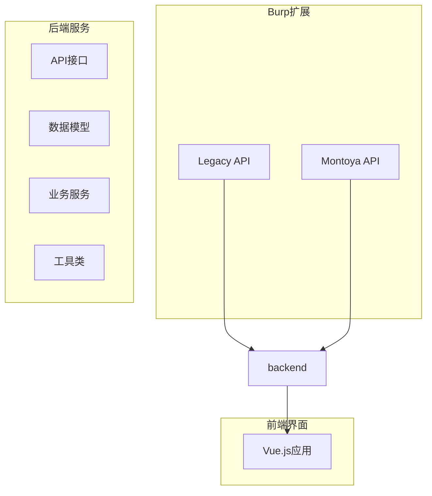
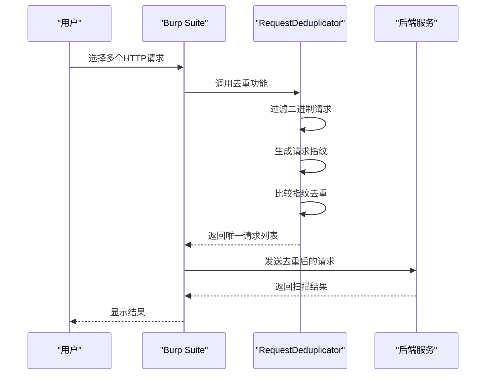
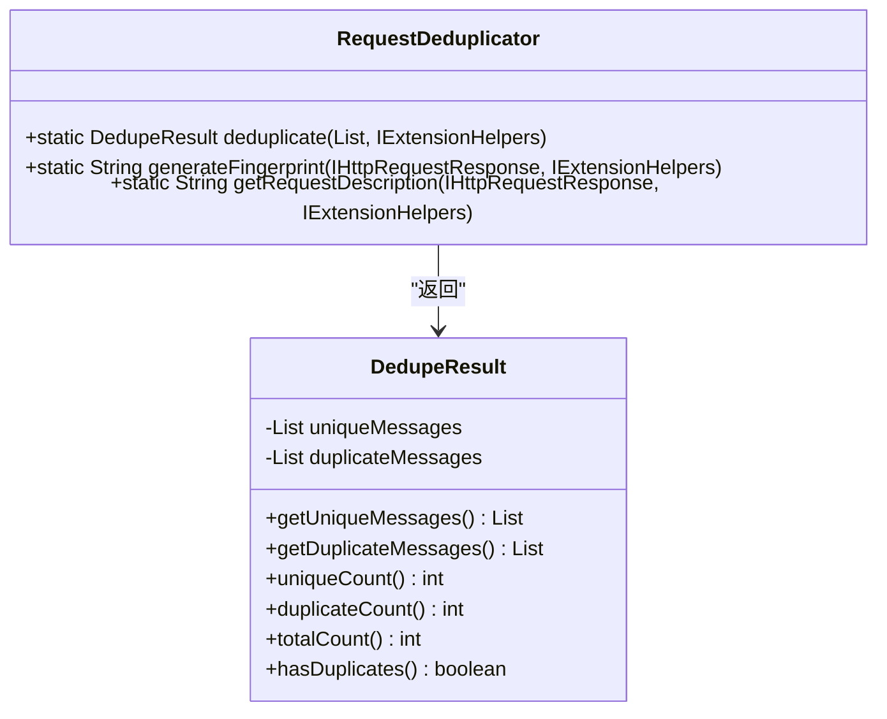
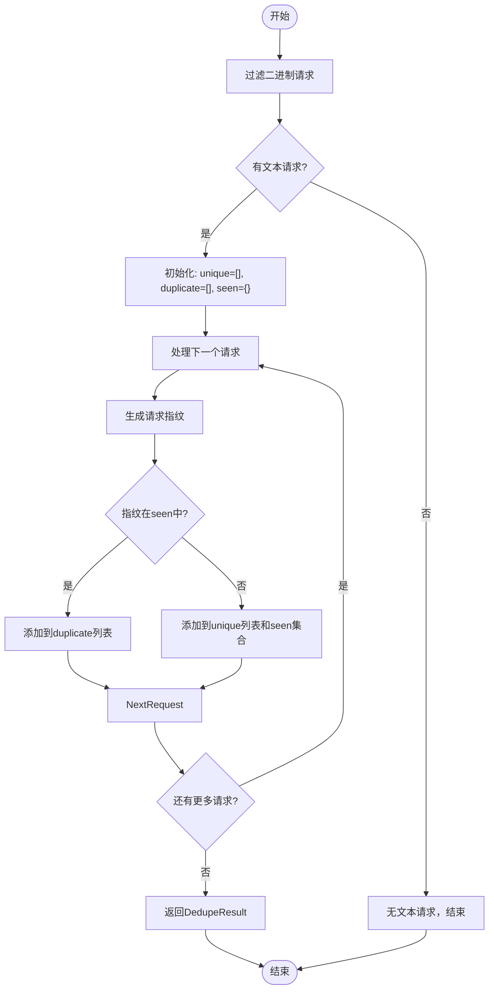
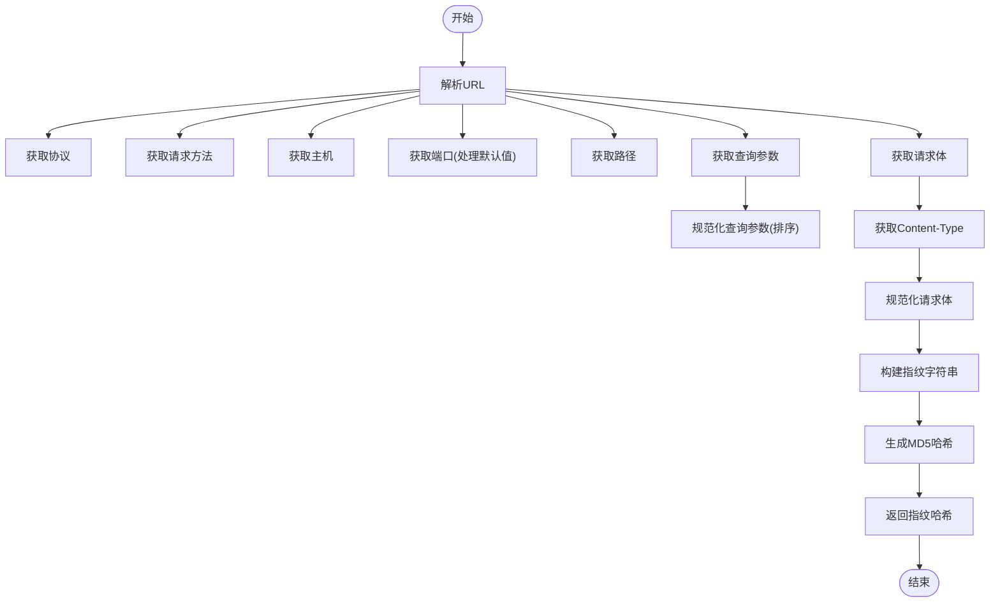

# Burp Suite请求去重

<cite>
**本文档引用的文件**
- [RequestDeduplicator.java](file://src/burpEx/legacy-api/src/main/java/com/sqlmapwebui/burp/RequestDeduplicator.java)
- [RequestDeduplicator.java](file://src/burpEx/montoya-api/src/main/java/com/sqlmapwebui/burp/RequestDeduplicator.java)
- [BurpExtender.java](file://src/burpEx/legacy-api/src/main/java/com/sqlmapwebui/burp/BurpExtender.java)
- [SqlmapContextMenuProvider.java](file://src/burpEx/montoya-api/src/main/java/com/sqlmapwebui/burp/SqlmapContextMenuProvider.java)
- [BinaryContentDetector.java](file://src/burpEx/legacy-api/src/main/java/com/sqlmapwebui/burp/BinaryContentDetector.java)
- [BinaryContentDetector.java](file://src/burpEx/montoya-api/src/main/java/com/sqlmapwebui/burp/BinaryContentDetector.java)
- [TaskRequest.py](file://src/backEnd/model/requestModel/TaskRequest.py)
- [header_processor.py](file://src/backEnd/utils/header_processor.py)
</cite>

## 目录
1. [简介](#简介)
2. [项目结构](#项目结构)
3. [核心组件](#核心组件)
4. [架构概述](#架构概述)
5. [详细组件分析](#详细组件分析)
6. [依赖分析](#依赖分析)
7. [性能考虑](#性能考虑)
8. [故障排除指南](#故障排除指南)
9. [结论](#结论)

## 简介
Burp Suite请求去重功能是SQLMap WebUI扩展中的一个关键特性，旨在在批量发送扫描任务时自动过滤重复的HTTP请求。该功能通过精确的指纹生成算法来识别和去除重复请求，确保每个唯一的请求只被发送一次，从而提高扫描效率并减少不必要的网络流量和服务器负载。

该功能支持两种Burp Suite API版本：Legacy API和Montoya API，为不同版本的Burp Suite提供兼容性。去重判断标准包括协议、请求方法、主机、端口、路径、URL参数和请求体等所有关键要素，只有当所有这些条件都相同时才认为是重复请求。

## 项目结构
该项目是一个完整的Burp Suite扩展与后端服务的集成系统，主要分为前端、后端和Burp扩展三个部分。Burp扩展部分包含了针对不同API版本的实现，确保了良好的向后兼容性。



**图表来源**
- [BurpExtender.java](file://src/burpEx/legacy-api/src/main/java/com/sqlmapwebui/burp/BurpExtender.java)
- [SqlmapUITab.java](file://src/burpEx/legacy-api/src/main/java/com/sqlmapwebui/burp/SqlmapUITab.java)

**章节来源**
- [BurpExtender.java](file://src/burpEx/legacy-api/src/main/java/com/sqlmapwebui/burp/BurpExtender.java#L1-L383)
- [project_structure](file://project_structure)

## 核心组件
Burp Suite请求去重功能的核心组件是`RequestDeduplicator`类，它负责生成请求的唯一指纹并进行去重处理。该类在Legacy API和Montoya API两个版本中都有实现，但核心逻辑保持一致。

去重过程首先对选中的请求进行二进制内容过滤，只保留纯文本请求进行后续处理。然后通过`deduplicate`方法对请求列表进行去重，使用`generateFingerprint`方法为每个请求生成唯一指纹。指纹生成考虑了协议、方法、主机、端口、路径、查询参数和请求体等所有关键要素。

**章节来源**
- [RequestDeduplicator.java](file://src/burpEx/legacy-api/src/main/java/com/sqlmapwebui/burp/RequestDeduplicator.java#L1-L273)
- [RequestDeduplicator.java](file://src/burpEx/montoya-api/src/main/java/com/sqlmapwebui/burp/RequestDeduplicator.java#L1-L252)

## 架构概述
Burp Suite请求去重功能的架构设计遵循了模块化和分层的原则，确保了代码的可维护性和可扩展性。整个流程从用户在Burp Suite中选择请求开始，经过二进制过滤、去重处理，最终将唯一请求发送到后端进行扫描。



**图表来源**
- [BurpExtender.java](file://src/burpEx/legacy-api/src/main/java/com/sqlmapwebui/burp/BurpExtender.java#L270-L314)
- [RequestDeduplicator.java](file://src/burpEx/legacy-api/src/main/java/com/sqlmapwebui/burp/RequestDeduplicator.java#L79-L107)

## 详细组件分析

### RequestDeduplicator类分析
`RequestDeduplicator`类是请求去重功能的核心实现，包含去重结果类`DedupeResult`和主要的去重方法。



**图表来源**
- [RequestDeduplicator.java](file://src/burpEx/legacy-api/src/main/java/com/sqlmapwebui/burp/RequestDeduplicator.java#L32-L70)
- [RequestDeduplicator.java](file://src/burpEx/legacy-api/src/main/java/com/sqlmapwebui/burp/RequestDeduplicator.java#L79-L107)

**章节来源**
- [RequestDeduplicator.java](file://src/burpEx/legacy-api/src/main/java/com/sqlmapwebui/burp/RequestDeduplicator.java#L1-L273)

### 去重流程分析
请求去重的完整流程包括二进制过滤、指纹生成和去重比较三个主要步骤。



**图表来源**
- [BurpExtender.java](file://src/burpEx/legacy-api/src/main/java/com/sqlmapwebui/burp/BurpExtender.java#L271-L290)
- [RequestDeduplicator.java](file://src/burpEx/legacy-api/src/main/java/com/sqlmapwebui/burp/RequestDeduplicator.java#L90-L107)

**章节来源**
- [BurpExtender.java](file://src/burpEx/legacy-api/src/main/java/com/sqlmapwebui/burp/BurpExtender.java#L270-L314)

### 指纹生成算法分析
请求指纹的生成是去重功能的关键，它决定了两个请求是否被认为是重复的。



**图表来源**
- [RequestDeduplicator.java](file://src/burpEx/legacy-api/src/main/java/com/sqlmapwebui/burp/RequestDeduplicator.java#L114-L170)
- [RequestDeduplicator.java](file://src/burpEx/legacy-api/src/main/java/com/sqlmapwebui/burp/RequestDeduplicator.java#L175-L208)

**章节来源**
- [RequestDeduplicator.java](file://src/burpEx/legacy-api/src/main/java/com/sqlmapwebui/burp/RequestDeduplicator.java#L101-L238)

## 依赖分析
Burp Suite请求去重功能与其他组件有明确的依赖关系，确保了功能的完整性和可靠性。

```mermaid
graph TD
RequestDeduplicator --> BinaryContentDetector : "依赖"
RequestDeduplicator --> IExtensionHelpers : "使用"
BurpExtender --> RequestDeduplicator : "调用"
BurpExtender --> BinaryContentDetector : "依赖"
SqlmapContextMenuProvider --> RequestDeduplicator : "调用"
SqlmapContextMenuProvider --> BinaryContentDetector : "依赖"
```

**图表来源**
- [BurpExtender.java](file://src/burpEx/legacy-api/src/main/java/com/sqlmapwebui/burp/BurpExtender.java#L276-L277)
- [SqlmapContextMenuProvider.java](file://src/burpEx/montoya-api/src/main/java/com/sqlmapwebui/burp/SqlmapContextMenuProvider.java#L89-L94)

**章节来源**
- [BurpExtender.java](file://src/burpEx/legacy-api/src/main/java/com/sqlmapwebui/burp/BurpExtender.java#L270-L314)
- [SqlmapContextMenuProvider.java](file://src/burpEx/montoya-api/src/main/java/com/sqlmapwebui/burp/SqlmapContextMenuProvider.java#L89-L113)

## 性能考虑
Burp Suite请求去重功能在设计时充分考虑了性能因素。使用`HashSet`来存储已见过的指纹，确保了O(1)的查找时间复杂度，使得整个去重过程的时间复杂度为O(n)，其中n是请求的数量。

对于大量请求的处理，内存使用是主要考虑因素，因为每个唯一请求的指纹都需要存储在内存中。指纹使用MD5哈希生成，固定长度为32个字符，可以有效控制内存占用。

在实际应用中，建议在发送大量请求前先进行去重，以减少网络传输和后端处理的开销。同时，去重功能只对纯文本请求生效，二进制请求会被自动过滤，这也有助于提高整体性能。

## 故障排除指南
当Burp Suite请求去重功能出现问题时，可以按照以下步骤进行排查：

1. **检查日志输出**：查看Burp Suite的输出日志，确认去重功能是否被正确调用，以及是否有任何错误信息。
2. **验证请求类型**：确保选中的请求是纯文本类型，二进制请求（如图片、视频、文件上传等）会被自动过滤。
3. **检查配置**：确认去重功能是否已启用，某些配置可能允许用户关闭自动去重。
4. **测试简单场景**：使用两个完全相同的请求进行测试，确认去重功能是否正常工作。
5. **检查API版本**：确认使用的Burp Suite版本与扩展的API版本匹配，Legacy API和Montoya API的实现略有不同。

**章节来源**
- [BurpExtender.java](file://src/burpEx/legacy-api/src/main/java/com/sqlmapwebui/burp/BurpExtender.java#L281-L286)
- [RequestDeduplicator.java](file://src/burpEx/legacy-api/src/main/java/com/sqlmapwebui/burp/RequestDeduplicator.java#L144-L148)

## 结论
Burp Suite请求去重功能是一个高效、可靠的组件，能够有效避免重复请求的发送，提高扫描效率。通过精确的指纹生成算法和优化的数据结构，该功能能够在短时间内处理大量请求，同时保持较低的内存占用。

该功能的设计充分考虑了实际使用场景，不仅实现了基本的去重功能，还集成了二进制内容过滤、详细的日志记录和灵活的配置选项。对于安全测试人员来说，这是一个非常有价值的工具，可以帮助他们更高效地进行漏洞扫描工作。

未来可以考虑的改进方向包括支持更复杂的去重策略（如基于特定参数的去重）、提供去重结果的可视化展示，以及优化大规模请求处理的性能表现。