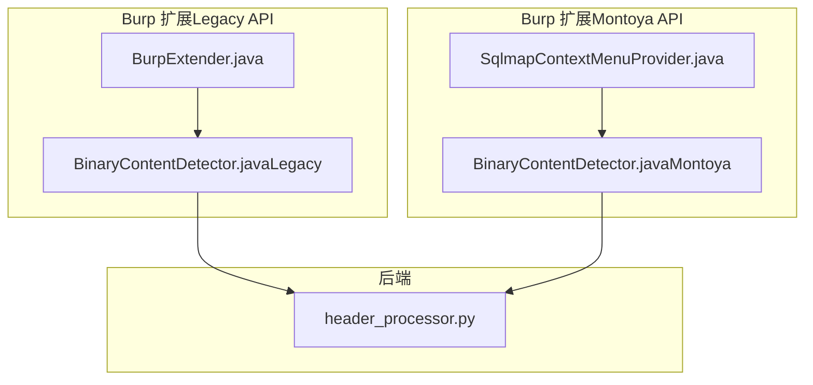
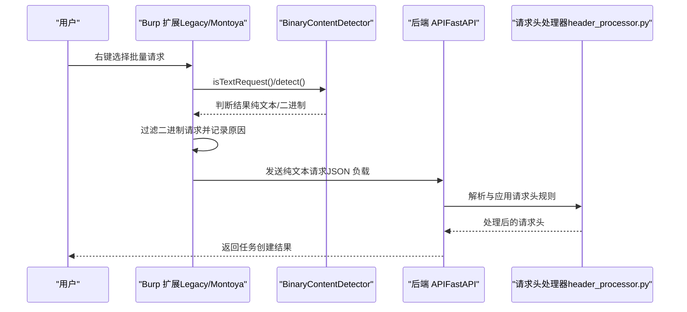
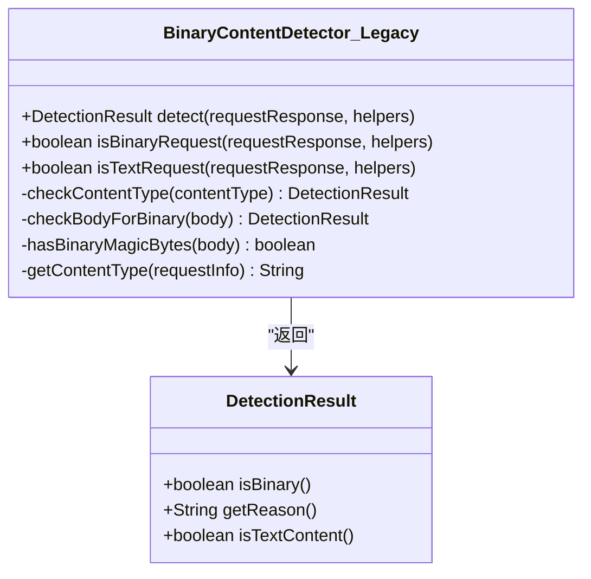
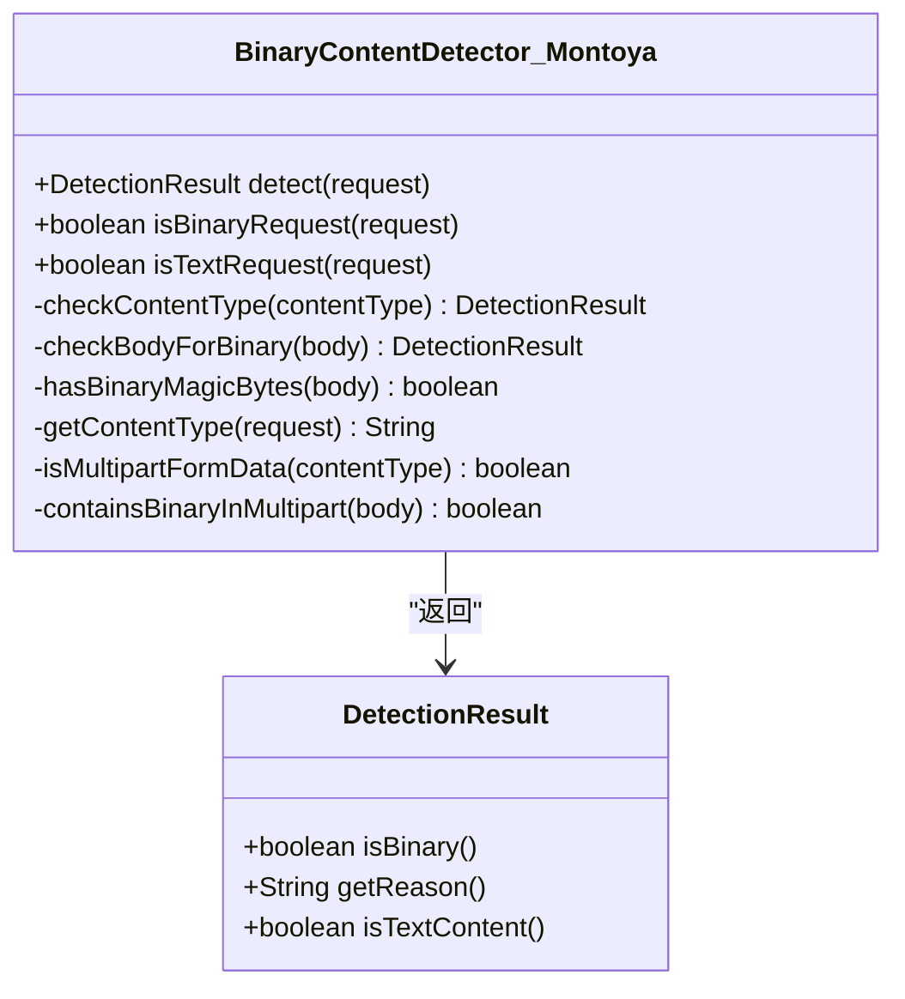
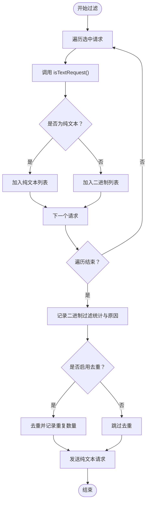
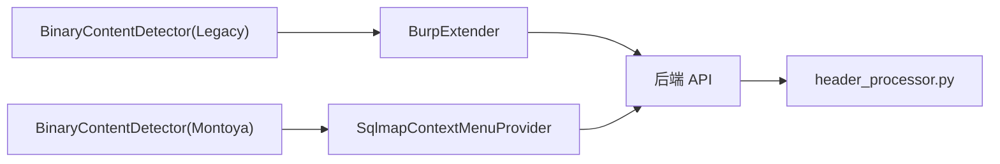

# 二进制内容检测

<cite>
**本文引用的文件**
- [BinaryContentDetector.java（Legacy API）](file://src/burpEx/legacy-api/src/main/java/com/sqlmapwebui/burp/BinaryContentDetector.java)
- [BinaryContentDetector.java（Montoya API）](file://src/burpEx/montoya-api/src/main/java/com/sqlmapwebui/burp/BinaryContentDetector.java)
- [BurpExtender.java](file://src/burpEx/legacy-api/src/main/java/com/sqlmapwebui/burp/BurpExtender.java)
- [SqlmapContextMenuProvider.java](file://src/burpEx/montoya-api/src/main/java/com/sqlmapwebui/burp/SqlmapContextMenuProvider.java)
- [header_processor.py](file://src/backEnd/utils/header_processor.py)
- [README.md](file://README.md)
</cite>

## 目录
1. [简介](#简介)
2. [项目结构](#项目结构)
3. [核心组件](#核心组件)
4. [架构总览](#架构总览)
5. [详细组件分析](#详细组件分析)
6. [依赖关系分析](#依赖关系分析)
7. [性能考量](#性能考量)
8. [故障排查指南](#故障排查指南)
9. [结论](#结论)
10. [附录](#附录)

## 简介
本文件聚焦“二进制内容检测”能力，阐述其在 Burp Suite 扩展中的实现与集成方式，以及在后端请求头处理流程中的影响。二进制内容检测用于识别 HTTP 请求是否包含二进制数据（如图片、视频、压缩包、可执行文件等），从而在批量提交扫描任务时自动过滤掉二进制请求，仅保留纯文本请求，确保后续扫描任务的稳定性与可解析性。

## 项目结构
与二进制内容检测直接相关的代码位于以下位置：
- Burp Suite 扩展（Legacy API 与 Montoya API）均包含独立的二进制内容检测器实现。
- 扩展通过右键菜单在发送扫描任务前进行二进制过滤，并记录过滤统计与原因。
- 后端侧的请求头处理流程与二进制内容检测无直接耦合，但扩展层的过滤保证了后端接收的请求均为纯文本。

图表来源
- [BinaryContentDetector.java（Legacy API）](file://src/burpEx/legacy-api/src/main/java/com/sqlmapwebui/burp/BinaryContentDetector.java#L1-L388)
- [BinaryContentDetector.java（Montoya API）](file://src/burpEx/montoya-api/src/main/java/com/sqlmapwebui/burp/BinaryContentDetector.java#L1-L371)
- [BurpExtender.java](file://src/burpEx/legacy-api/src/main/java/com/sqlmapwebui/burp/BurpExtender.java#L1-L383)
- [SqlmapContextMenuProvider.java](file://src/burpEx/montoya-api/src/main/java/com/sqlmapwebui/burp/SqlmapContextMenuProvider.java#L1-L342)
- [header_processor.py](file://src/backEnd/utils/header_processor.py#L1-L292)

章节来源
- [README.md](file://README.md#L160-L170)

## 核心组件
- 二进制内容检测器（Legacy API 版本）
  - 依据 Content-Type 白名单/黑名单、请求体魔数、NULL 字节、非可打印字符比例等多策略综合判断。
  - 提供便捷方法：判断请求是否为二进制或纯文本。
- 二进制内容检测器（Montoya API 版本）
  - 与 Legacy 版本逻辑一致，但针对 Montoya API 的请求对象与头部访问方式做了适配。
- Burp 扩展（Legacy API）
  - 在右键菜单中对批量选中的请求进行二进制过滤，仅发送纯文本请求；同时记录被过滤的二进制请求及其原因。
- Burp 扩展（Montoya API）
  - 同样在上下文菜单中进行二进制过滤与统计，并将纯文本请求发送至后端。
- 后端请求头处理
  - 与二进制内容检测无直接耦合，但扩展层的过滤保证了后端收到的请求均为纯文本，避免解析异常。

章节来源
- [BinaryContentDetector.java（Legacy API）](file://src/burpEx/legacy-api/src/main/java/com/sqlmapwebui/burp/BinaryContentDetector.java#L1-L388)
- [BinaryContentDetector.java（Montoya API）](file://src/burpEx/montoya-api/src/main/java/com/sqlmapwebui/burp/BinaryContentDetector.java#L1-L371)
- [BurpExtender.java](file://src/burpEx/legacy-api/src/main/java/com/sqlmapwebui/burp/BurpExtender.java#L143-L232)
- [SqlmapContextMenuProvider.java](file://src/burpEx/montoya-api/src/main/java/com/sqlmapwebui/burp/SqlmapContextMenuProvider.java#L86-L197)
- [header_processor.py](file://src/backEnd/utils/header_processor.py#L1-L292)

## 架构总览
二进制内容检测贯穿扩展层与后端层：扩展在发送前进行过滤，后端专注于请求头处理与任务调度。

图表来源
- [BurpExtender.java](file://src/burpEx/legacy-api/src/main/java/com/sqlmapwebui/burp/BurpExtender.java#L234-L302)
- [SqlmapContextMenuProvider.java](file://src/burpEx/montoya-api/src/main/java/com/sqlmapwebui/burp/SqlmapContextMenuProvider.java#L86-L197)
- [BinaryContentDetector.java（Legacy API）](file://src/burpEx/legacy-api/src/main/java/com/sqlmapwebui/burp/BinaryContentDetector.java#L114-L167)
- [BinaryContentDetector.java（Montoya API）](file://src/burpEx/montoya-api/src/main/java/com/sqlmapwebui/burp/BinaryContentDetector.java#L112-L169)
- [header_processor.py](file://src/backEnd/utils/header_processor.py#L214-L258)

## 详细组件分析

### 二进制内容检测器（Legacy API）
- Content-Type 判断
  - 白名单：text/*、application/json、application/xml、application/x-www-form-urlencoded、application/javascript 等。
  - 黑名单前缀：image/、video/、audio/、font/、model/。
  - 已知二进制类型：application/octet-stream、application/pdf、application/zip、application/gzip、application/wasm 等。
- 请求体检测
  - 魔数检测：PNG、JPEG、GIF、PDF、ZIP/RAR/7z、EXE/DLL、GZIP、WebP、BMP、WASM 等。
  - NULL 字节：若出现，直接判定为二进制。
  - 非可打印字符比例：对前 8KB 内容统计，超过阈值（示例中为 10%）判定为二进制。
- 结果封装
  - DetectionResult 包含 isBinary、reason、isTextContent 等字段，便于 UI 展示与日志记录。

图表来源
- [BinaryContentDetector.java（Legacy API）](file://src/burpEx/legacy-api/src/main/java/com/sqlmapwebui/burp/BinaryContentDetector.java#L92-L167)

章节来源
- [BinaryContentDetector.java（Legacy API）](file://src/burpEx/legacy-api/src/main/java/com/sqlmapwebui/burp/BinaryContentDetector.java#L33-L112)
- [BinaryContentDetector.java（Legacy API）](file://src/burpEx/legacy-api/src/main/java/com/sqlmapwebui/burp/BinaryContentDetector.java#L114-L167)
- [BinaryContentDetector.java（Legacy API）](file://src/burpEx/legacy-api/src/main/java/com/sqlmapwebui/burp/BinaryContentDetector.java#L169-L217)
- [BinaryContentDetector.java（Legacy API）](file://src/burpEx/legacy-api/src/main/java/com/sqlmapwebui/burp/BinaryContentDetector.java#L219-L300)
- [BinaryContentDetector.java（Legacy API）](file://src/burpEx/legacy-api/src/main/java/com/sqlmapwebui/burp/BinaryContentDetector.java#L302-L373)
- [BinaryContentDetector.java（Legacy API）](file://src/burpEx/legacy-api/src/main/java/com/sqlmapwebui/burp/BinaryContentDetector.java#L375-L388)

### 二进制内容检测器（Montoya API）
- 与 Legacy 版本逻辑一致，但使用 Montoya API 的 HttpRequest/HttpHeader 访问方式。
- 额外对 multipart/form-data 的简单检查：尝试将请求体转为字符串后检查是否存在二进制类型的 Content-Type 字段，若无法解析则视为可能包含二进制。

图表来源
- [BinaryContentDetector.java（Montoya API）](file://src/burpEx/montoya-api/src/main/java/com/sqlmapwebui/burp/BinaryContentDetector.java#L90-L169)
- [BinaryContentDetector.java（Montoya API）](file://src/burpEx/montoya-api/src/main/java/com/sqlmapwebui/burp/BinaryContentDetector.java#L171-L200)
- [BinaryContentDetector.java（Montoya API）](file://src/burpEx/montoya-api/src/main/java/com/sqlmapwebui/burp/BinaryContentDetector.java#L202-L231)
- [BinaryContentDetector.java（Montoya API）](file://src/burpEx/montoya-api/src/main/java/com/sqlmapwebui/burp/BinaryContentDetector.java#L233-L283)
- [BinaryContentDetector.java（Montoya API）](file://src/burpEx/montoya-api/src/main/java/com/sqlmapwebui/burp/BinaryContentDetector.java#L285-L356)
- [BinaryContentDetector.java（Montoya API）](file://src/burpEx/montoya-api/src/main/java/com/sqlmapwebui/burp/BinaryContentDetector.java#L358-L371)

章节来源
- [BinaryContentDetector.java（Montoya API）](file://src/burpEx/montoya-api/src/main/java/com/sqlmapwebui/burp/BinaryContentDetector.java#L31-L78)
- [BinaryContentDetector.java（Montoya API）](file://src/burpEx/montoya-api/src/main/java/com/sqlmapwebui/burp/BinaryContentDetector.java#L79-L87)
- [BinaryContentDetector.java（Montoya API）](file://src/burpEx/montoya-api/src/main/java/com/sqlmapwebui/burp/BinaryContentDetector.java#L202-L231)
- [BinaryContentDetector.java（Montoya API）](file://src/burpEx/montoya-api/src/main/java/com/sqlmapwebui/burp/BinaryContentDetector.java#L233-L283)

### 扩展层过滤与日志记录（Legacy API）
- 过滤逻辑
  - 遍历选中请求，调用 isTextRequest 进行判断，分别收集纯文本与二进制请求。
- 日志记录
  - 若存在二进制请求，记录被过滤数量与每条请求的 URL 与原因（来自 detect 的 reason）。
- 去重处理
  - 可选的去重逻辑，进一步减少重复请求发送。

图表来源
- [BurpExtender.java](file://src/burpEx/legacy-api/src/main/java/com/sqlmapwebui/burp/BurpExtender.java#L234-L302)
- [BurpExtender.java](file://src/burpEx/legacy-api/src/main/java/com/sqlmapwebui/burp/BurpExtender.java#L252-L302)

章节来源
- [BurpExtender.java](file://src/burpEx/legacy-api/src/main/java/com/sqlmapwebui/burp/BurpExtender.java#L234-L302)

### 扩展层过滤与日志记录（Montoya API）
- 与 Legacy 版本类似，但使用 Montoya API 的上下文菜单接口。
- 对批量选择与消息编辑器中的请求进行统一处理，同样记录二进制过滤统计与原因。

章节来源
- [SqlmapContextMenuProvider.java](file://src/burpEx/montoya-api/src/main/java/com/sqlmapwebui/burp/SqlmapContextMenuProvider.java#L86-L197)
- [SqlmapContextMenuProvider.java](file://src/burpEx/montoya-api/src/main/java/com/sqlmapwebui/burp/SqlmapContextMenuProvider.java#L200-L251)

### 后端请求头处理（与二进制检测的关系）
- 后端的请求头处理流程与二进制内容检测无直接耦合。
- 由于扩展层已过滤二进制请求，后端收到的请求均为纯文本，因此 header_processor.py 的处理逻辑无需考虑二进制场景。

章节来源
- [header_processor.py](file://src/backEnd/utils/header_processor.py#L214-L258)

## 依赖关系分析
- 扩展层依赖二进制内容检测器进行请求过滤。
- 二进制内容检测器内部依赖 Content-Type 解析与请求体分析。
- 后端请求头处理依赖扩展层发送的纯文本请求。

图表来源
- [BurpExtender.java](file://src/burpEx/legacy-api/src/main/java/com/sqlmapwebui/burp/BurpExtender.java#L234-L302)
- [SqlmapContextMenuProvider.java](file://src/burpEx/montoya-api/src/main/java/com/sqlmapwebui/burp/SqlmapContextMenuProvider.java#L86-L197)
- [BinaryContentDetector.java（Legacy API）](file://src/burpEx/legacy-api/src/main/java/com/sqlmapwebui/burp/BinaryContentDetector.java#L114-L167)
- [BinaryContentDetector.java（Montoya API）](file://src/burpEx/montoya-api/src/main/java/com/sqlmapwebui/burp/BinaryContentDetector.java#L112-L169)
- [header_processor.py](file://src/backEnd/utils/header_processor.py#L214-L258)

## 性能考量
- Content-Type 判断与魔数检测均为常量时间复杂度，开销极小。
- 请求体检测对前 8KB 进行统计，时间复杂度 O(k)，k 为检查长度上限。
- 扩展层过滤在 UI 线程中完成，建议批量选择较多时注意 UI 响应，必要时可异步处理或分批处理。
- 后端请求头处理与二进制检测无直接关系，性能瓶颈不在此处。

## 故障排查指南
- 二进制请求被全部过滤
  - 检查 Content-Type 是否为 image/video/audio/font/model 等前缀，或是否包含 application/octet-stream、application/pdf、application/zip 等类型。
  - 检查请求体是否包含 NULL 字节或非可打印字符比例超过阈值。
  - 检查 multipart/form-data 中是否包含二进制类型的子部分。
- 误判为二进制
  - 某些文本内容可能包含少量非可打印字符，导致比例超过阈值。可调整阈值或在扩展层增加例外策略。
- 无法解析 multipart
  - 当请求体无法解析为字符串时，检测器会将其视为可能包含二进制。建议确认边界与编码。
- 日志与统计
  - 扩展层会在 UI 中记录被过滤的二进制请求 URL 与原因，便于定位问题。

章节来源
- [BinaryContentDetector.java（Legacy API）](file://src/burpEx/legacy-api/src/main/java/com/sqlmapwebui/burp/BinaryContentDetector.java#L169-L217)
- [BinaryContentDetector.java（Legacy API）](file://src/burpEx/legacy-api/src/main/java/com/sqlmapwebui/burp/BinaryContentDetector.java#L219-L300)
- [BinaryContentDetector.java（Montoya API）](file://src/burpEx/montoya-api/src/main/java/com/sqlmapwebui/burp/BinaryContentDetector.java#L171-L200)
- [BinaryContentDetector.java（Montoya API）](file://src/burpEx/montoya-api/src/main/java/com/sqlmapwebui/burp/BinaryContentDetector.java#L202-L231)
- [BurpExtender.java](file://src/burpEx/legacy-api/src/main/java/com/sqlmapwebui/burp/BurpExtender.java#L252-L302)
- [SqlmapContextMenuProvider.java](file://src/burpEx/montoya-api/src/main/java/com/sqlmapwebui/burp/SqlmapContextMenuProvider.java#L200-L251)

## 结论
二进制内容检测在扩展层实现了对 HTTP 请求的多策略判断，确保仅向后端发送纯文本请求，从而提升扫描任务的稳定性与可解析性。Legacy API 与 Montoya API 的检测器在逻辑上保持一致，扩展层通过右键菜单与上下文菜单完成过滤与日志记录，后端的请求头处理流程则专注于规则应用与会话头管理，二者职责清晰、耦合度低。

## 附录
- 项目文档与使用说明可参考根目录 README。
- 二进制内容检测器的便捷方法可用于其他场景下的请求预检。

章节来源
- [README.md](file://README.md#L160-L170)