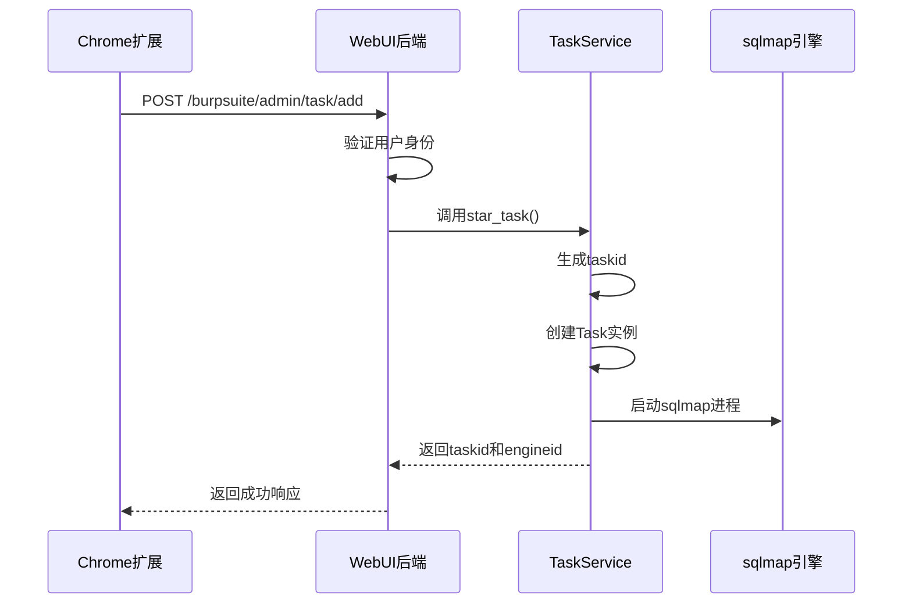
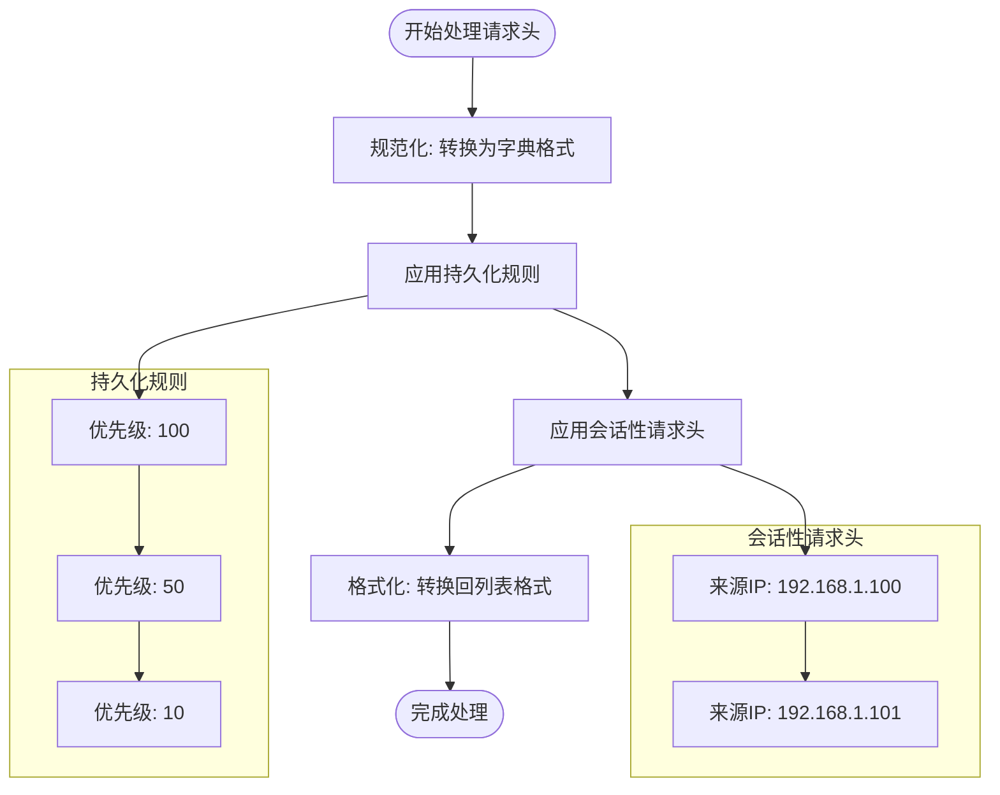

# Chrome扩展集成

<cite>
**本文档引用的文件**
- [admin.py](file://src/backEnd/api/chromeExApi/admin.py)
- [header_processor.py](file://src/backEnd/utils/header_processor.py)
- [TaskRequest.py](file://src/backEnd/model/requestModel/TaskRequest.py)
- [taskService.py](file://src/backEnd/service/taskService.py)
- [Task.py](file://src/backEnd/model/Task.py)
- [PersistentHeaderRule.py](file://src/backEnd/model/PersistentHeaderRule.py)
- [SessionHeader.py](file://src/backEnd/model/SessionHeader.py)
- [headerRuleService.py](file://src/backEnd/service/headerRuleService.py)
- [BaseResponseMsg.py](file://src/backEnd/model/BaseResponseMsg.py)
</cite>

## 目录
1. [介绍](#介绍)
2. [Chrome扩展通信机制](#chrome扩展通信机制)
3. [API端点详解](#api端点详解)
4. [请求头处理流程](#请求头处理流程)
5. [API参考](#api参考)
6. [集成调试指南](#集成调试指南)
7. [最佳实践](#最佳实践)
8. [结论](#结论)

## 介绍

本技术文档详细阐述了Chrome扩展与WebUI之间的集成机制。系统通过Chrome扩展捕获浏览器请求，将请求数据发送到后端API进行处理，并最终转换为sqlmap扫描任务。文档深入解析了消息传递协议、数据序列化格式、安全验证流程以及请求头预处理机制，为扩展开发者提供了完整的集成指南。

**Section sources**
- [admin.py](file://src/backEnd/api/chromeExApi/admin.py#L1-L117)

## Chrome扩展通信机制

Chrome扩展与WebUI之间的通信基于HTTP RESTful API协议。扩展通过捕获浏览器网络请求，提取关键信息（URL、请求头、请求体等），然后通过HTTP POST请求将数据发送到后端指定API端点。通信过程遵循以下流程：

1. **请求捕获**：Chrome扩展使用`chrome.webRequest` API监听网络请求，获取完整的HTTP请求信息。
2. **数据序列化**：捕获的请求数据被序列化为JSON格式，包含扫描URL、主机名、请求头列表、请求体和扫描选项。
3. **安全验证**：每个请求都包含身份验证信息，通过`get_current_user`依赖项进行验证，确保只有授权用户可以提交任务。
4. **消息传递**：序列化后的数据通过`fetch` API发送到后端`/burpsuite/admin/task/add`端点。



**Diagram sources**
- [admin.py](file://src/backEnd/api/chromeExApi/admin.py#L1-L117)
- [taskService.py](file://src/backEnd/service/taskService.py#L45-L527)
- [Task.py](file://src/backEnd/model/Task.py#L0-L206)

**Section sources**
- [admin.py](file://src/backEnd/api/chromeExApi/admin.py#L1-L117)
- [taskService.py](file://src/backEnd/service/taskService.py#L45-L527)

## API端点详解

`admin.py`文件中定义了多个API端点，用于管理Chrome扩展提交的任务。核心端点`/burpsuite/admin/task/add`负责接收扩展发送的请求数据并创建扫描任务。

### 请求数据解析与转换

当后端接收到扩展的请求时，`add_task`函数负责解析和转换HTTP请求数据：

1. **参数提取**：使用Pydantic模型`TaskAddRequest`自动验证和解析请求体中的JSON数据。
2. **客户端信息获取**：通过`request.client`获取客户端IP地址，用于会话管理。
3. **任务创建**：调用`taskService.star_task`方法，将解析后的数据转换为sqlmap任务。

```python
@router.post('/task/add')
async def add_task(taskAddRequest: TaskAddRequest, request: Request, current_user: dict = Depends(get_current_user)):
    try:
        if request.client:
            task_dict = taskAddRequest.model_dump()
            if 'options' not in task_dict or task_dict['options'] is None:
                return BaseResponseMsg(success=False, msg="options is required", code=status.HTTP_400_BAD_REQUEST, data=None)
            remote_ip = request.client.host
            res = await taskService.star_task(remote_addr=remote_ip, scanUrl=taskAddRequest.scanUrl, host=taskAddRequest.host, headers=taskAddRequest.headers, body=taskAddRequest.body, options=taskAddRequest.options)
            return res
    except Exception as e:
        logger.error(f"Error: {e}")
        raise HTTPException(status_code=500, detail="Error accessing request.client")
```

该过程确保了从浏览器扩展捕获的原始HTTP请求能够被正确解析并转换为可执行的sqlmap扫描任务。

**Section sources**
- [admin.py](file://src/backEnd/api/burpSuiteExApi/admin.py#L1-L36)
- [TaskRequest.py](file://src/backEnd/model/requestModel/TaskRequest.py#L0-L56)
- [taskService.py](file://src/backEnd/service/taskService.py#L45-L527)

## 请求头处理流程

`header_processor.py`模块在预处理扩展捕获的请求头中起着关键作用。它负责规范化、过滤和注入请求头，确保扫描请求符合目标系统的安全要求。

### 核心处理步骤

1. **规范化**：`normalize_headers`方法将请求头列表转换为字典格式，便于后续处理。
2. **规则应用**：`apply_persistent_rules`和`apply_session_headers`方法分别应用持久化规则和会话性请求头。
3. **格式转换**：`format_headers_for_sqlmap`方法将处理后的字典格式请求头转换回sqlmap所需的列表格式。



**Diagram sources**
- [header_processor.py](file://src/backEnd/utils/header_processor.py#L10-L241)
- [PersistentHeaderRule.py](file://src/backEnd/model/PersistentHeaderRule.py#L0-L68)
- [SessionHeader.py](file://src/backEnd/model/SessionHeader.py#L0-L61)

**Section sources**
- [header_processor.py](file://src/backEnd/utils/header_processor.py#L10-L241)
- [headerRuleService.py](file://src/backEnd/service/headerRuleService.py#L0-L799)

## API参考

### 支持的端点

| 端点 | HTTP方法 | 描述 |
|------|---------|------|
| `/chrome/admin/task/delete` | DELETE | 删除指定任务 |
| `/chrome/admin/task/kill` | PUT | 终止指定任务 |
| `/chrome/admin/task/list` | GET | 列出所有任务 |
| `/chrome/admin/task/startBlocked` | PUT | 启动被阻塞的任务 |
| `/chrome/admin/task/stop` | PUT | 停止指定任务 |
| `/chrome/admin/task/flush` | PATCH | 清空任务池 |
| `/chrome/admin/task/findByUrlPath` | POST | 根据URL路径查找任务 |
| `/chrome/admin/task/findByBodyKeyWord` | POST | 根据请求体关键词查找任务 |
| `/chrome/admin/task/findByHeaderKeyWord` | POST | 根据请求头关键词查找任务 |
| `/chrome/admin/task/logs/getLogsByTaskId` | GET | 获取指定任务的日志 |
| `/chrome/admin/task/getPayloadDetailByTaskId` | GET | 获取指定任务的有效载荷详情 |
| `/chrome/admin/task/getTaskHttpRequestInfoByTaskId` | GET | 获取指定任务的HTTP请求信息 |
| `/chrome/admin/task/getTasksByKeyWord` | GET | 根据关键词查找任务 |
| `/chrome/admin/task/getTaskScanOptionsByTaskId` | GET | 获取指定任务的扫描选项 |
| `/chrome/admin/task/getTaskErrorsByTaskId` | GET | 获取指定任务的错误信息 |

### 请求/响应格式

所有API端点返回统一的响应格式：

```json
{
  "code": 200,
  "success": true,
  "message": "success",
  "data": {}
}
```

### 状态码

| 状态码 | 描述 |
|-------|------|
| 200 | 成功 |
| 400 | 请求错误 |
| 404 | 未找到 |
| 500 | 服务器内部错误 |

### 错误处理

系统通过`BaseResponseMsg`类统一处理错误响应，确保客户端能够获得清晰的错误信息。

**Section sources**
- [admin.py](file://src/backEnd/api/chromeExApi/admin.py#L1-L117)
- [BaseResponseMsg.py](file://src/backEnd/model/BaseResponseMsg.py#L0-L15)

## 集成调试指南

### Chrome开发者工具使用

1. **网络面板**：监控扩展发送的API请求，检查请求头、请求体和响应状态。
2. **控制台面板**：查看扩展的JavaScript错误和日志输出。
3. **调试器**：设置断点，逐步调试扩展的请求捕获和发送逻辑。

### 常见通信错误诊断

| 错误现象 | 可能原因 | 解决方案 |
|--------|--------|--------|
| 400 Bad Request | 请求体格式错误 | 检查JSON序列化是否正确，确保所有必需字段都存在 |
| 401 Unauthorized | 身份验证失败 | 检查认证令牌是否正确，确保用户已登录 |
| 500 Internal Server Error | 服务器内部错误 | 查看服务器日志，定位具体错误原因 |
| 请求超时 | 网络连接问题 | 检查网络连接，确保服务器可访问 |

**Section sources**
- [admin.py](file://src/backEnd/api/chromeExApi/admin.py#L1-L117)
- [taskService.py](file://src/backEnd/service/taskService.py#L45-L527)

## 最佳实践

### 权限配置

在`manifest.json`中正确配置权限：

```json
{
  "permissions": [
    "webRequest",
    "webRequestBlocking",
    "storage",
    "https://your-webui-domain.com/"
  ],
  "host_permissions": [
    "<all_urls>"
  ]
}
```

### 内容脚本注入时机

选择合适的注入时机以确保脚本能够正确捕获请求：

```javascript
chrome.webRequest.onBeforeSendHeaders.addListener(
  function(details) {
    // 处理请求头
  },
  {urls: ["<all_urls>"]},
  ["requestHeaders", "blocking"]
);
```

### 性能优化

1. **批量处理**：将多个请求合并为一个批次发送，减少网络开销。
2. **缓存机制**：缓存常用的请求头规则，避免重复计算。
3. **异步处理**：使用异步API避免阻塞主线程。

**Section sources**
- [admin.py](file://src/backEnd/api/chromeExApi/admin.py#L1-L117)
- [header_processor.py](file://src/backEnd/utils/header_processor.py#L10-L241)

## 结论

本文档详细介绍了Chrome扩展与WebUI的集成机制，涵盖了通信协议、API端点、请求头处理和调试指南。通过遵循本文档中的最佳实践，开发者可以高效地集成Chrome扩展，实现自动化安全测试。系统的设计确保了灵活性和可扩展性，能够适应各种复杂的测试场景。