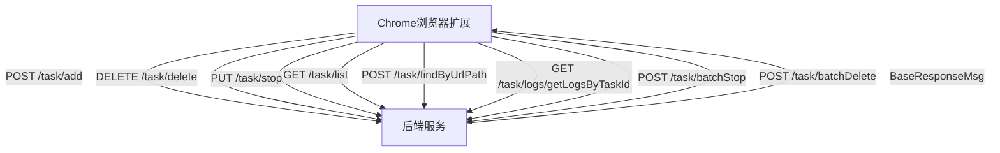
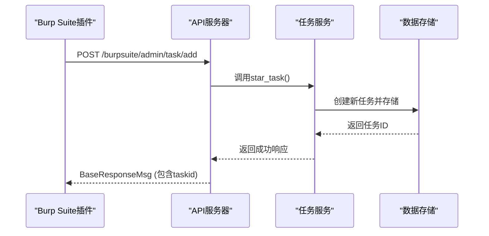
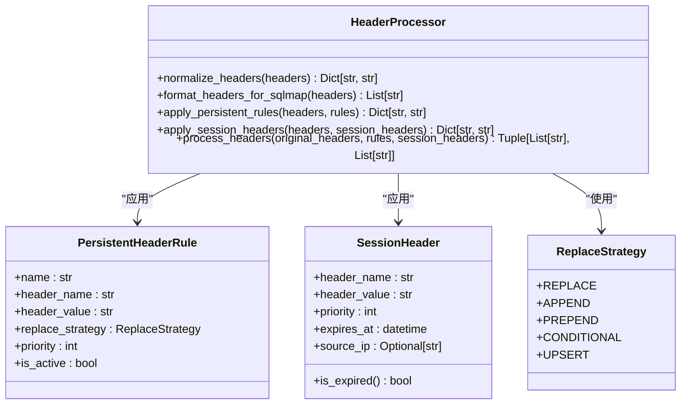

# 外部系统集成

<cite>
**本文档引用的文件**
- [admin.py](file://src/backEnd/api/burpSuiteExApi/admin.py)
- [admin.py](file://src/backEnd/api/chromeExApi/admin.py)
- [TaskRequest.py](file://src/backEnd/model/requestModel/TaskRequest.py)
- [taskService.py](file://src/backEnd/service/taskService.py)
- [header_processor.py](file://src/backEnd/utils/header_processor.py)
- [Task.py](file://src/backEnd/model/Task.py)
- [PersistentHeaderRule.py](file://src/backEnd/model/PersistentHeaderRule.py)
- [SessionHeader.py](file://src/backEnd/model/SessionHeader.py)
- [TaskStatus.py](file://src/backEnd/model/TaskStatus.py)
- [app.py](file://src/backEnd/app.py) - *新增健康检查端点*
- [task.ts](file://src/frontEnd/src/api/task.ts) - *新增批量操作功能*
- [task.ts](file://src/frontEnd/src/stores/task.ts) - *新增批量操作功能*
- [index.vue](file://src/frontEnd/src/views/TaskList/index.vue) - *新增批量操作界面*
</cite>

## 更新摘要
**变更内容**
- 新增了后端健康检查端点 `/api/health`，用于前端监控后端服务状态
- 新增了任务批量停止和批量删除功能，提升了任务管理效率
- 更新了任务列表界面，增加了批量操作栏和确认对话框
- 增强了前端状态管理，实现了更流畅的批量操作体验

**文档来源更新**
- 新增了 `app.py` 文件引用，包含健康检查端点的实现
- 新增了 `task.ts` 和 `index.vue` 文件引用，包含批量操作功能的实现
- 更新了所有受影响的章节，以反映最新的功能变化

## 目录
1. [引言](#引言)
2. [Chrome浏览器扩展集成](#chrome浏览器扩展集成)
3. [Burp Suite插件集成](#burp-suite插件集成)
4. [HTTP请求处理与任务转换](#http请求处理与任务转换)
5. [请求头预处理管道](#请求头预处理管道)
6. [集成调试指南与常见问题](#集成调试指南与常见问题)
7. [API参考与最佳实践](#api参考与最佳实践)
8. [安全研究人员工作流示例](#安全研究人员工作流示例)
9. [结论](#结论)

## 引言
本文档详细阐述了sqlmapWebUI系统与外部工具的集成机制，重点介绍Chrome浏览器扩展和Burp Suite插件的集成方式。文档涵盖了消息传递协议、数据格式规范、安全通信策略以及跨工具工作流的实现细节。系统通过标准化的API接口接收来自不同来源的HTTP请求，并将其转换为sqlmap可执行的安全扫描任务。特别地，系统实现了强大的请求头预处理管道，确保来自不同工具的请求能够被正确解析和处理，为安全研究人员提供了一个高效、灵活的漏洞检测平台。此外，系统新增了健康检查端点和批量操作功能，进一步提升了系统的可用性和用户体验。

## Chrome浏览器扩展集成

Chrome浏览器扩展通过`/chrome/admin`前缀的API端点与后端系统进行通信。扩展提供了全面的任务管理功能，包括任务的创建、删除、启动、停止和查询。API设计遵循RESTful原则，使用标准的HTTP方法（POST、PUT、DELETE、GET）来执行不同的操作。此外，系统新增了批量操作功能，允许用户一次性停止或删除多个任务，大大提升了任务管理效率。

**图示来源**
- [admin.py](file://src/backEnd/api/chromeExApi/admin.py#L1-L117)

**本节来源**
- [admin.py](file://src/backEnd/api/chromeExApi/admin.py#L1-L117)
- [task.ts](file://src/frontEnd/src/api/task.ts#L97-L102) - *批量停止功能*
- [task.ts](file://src/frontEnd/src/api/task.ts#L87-L92) - *批量删除功能*

## Burp Suite插件集成

Burp Suite插件通过`/burpsuite/admin`前缀的API端点与系统集成。插件的核心功能是将Burp Suite捕获的HTTP请求发送到sqlmapWebUI进行自动化SQL注入检测。当用户在Burp Suite中选择一个请求并触发扫描时，插件会提取请求的URL、主机、请求头和请求体，并将其封装成标准的任务请求对象。

**图示来源**
- [admin.py](file://src/backEnd/api/burpSuiteExApi/admin.py#L1-L36)
- [taskService.py](file://src/backEnd/service/taskService.py#L57-L86)

**本节来源**
- [admin.py](file://src/backEnd/api/burpSuiteExApi/admin.py#L1-L36)

## HTTP请求处理与任务转换

系统通过`TaskService`类中的`star_task`方法处理来自外部系统的HTTP请求，并将其转换为sqlmap可执行的任务。该过程包括参数验证、任务ID生成、任务状态初始化和sqlmap引擎的启动。任务的配置选项（options）会经过严格的验证，以确保不包含sqlmap REST API不支持的参数。

**图示来源**
- [taskService.py](file://src/backEnd/service/taskService.py#L57-L86)
- [Task.py](file://src/backEnd/model/Task.py#L1-L206)

**本节来源**
- [taskService.py](file://src/backEnd/service/taskService.py#L57-L86)
- [Task.py](file://src/backEnd/model/Task.py#L1-L206)

## 请求头预处理管道

系统实现了复杂的请求头预处理管道，确保来自不同工具的请求头能够被正确处理。该管道由`HeaderProcessor`类实现，它在sqlmap引擎启动前，应用持久化规则和会话性请求头。处理流程包括：将请求头列表标准化为字典、应用持久化规则、应用会话性请求头，最后将结果格式化回sqlmap所需的列表格式。

**图示来源**
- [header_processor.py](file://src/backEnd/utils/header_processor.py#L10-L241)
- [PersistentHeaderRule.py](file://src/backEnd/model/PersistentHeaderRule.py#L1-L68)
- [SessionHeader.py](file://src/backEnd/model/SessionHeader.py#L1-L61)

**本节来源**
- [header_processor.py](file://src/backEnd/utils/header_processor.py#L10-L241)
- [Task.py](file://src/backEnd/model/Task.py#L1-L206)

## 集成调试指南与常见问题

### 常见问题与解决方案
1.  **问题：** Burp Suite插件发送请求后，收到`options is required`错误。
    **解决方案：** 确保在发送的请求体中包含`options`字段，即使它是一个空对象。该字段是必填的。

2.  **问题：** Chrome扩展中无法看到任何任务。
    **解决方案：** 检查后端服务的数据库连接是否正常。`list_task`接口在`DataStore.current_db`为`None`时会返回错误。

3.  **问题：** 应用请求头规则后，原始请求头被覆盖。
    **解决方案：** 这是预期行为。系统设计为在任务创建时立即应用所有规则。检查`PersistentHeaderRule`的`replace_strategy`是否符合预期（如`APPEND`或`PREPEND`）。

4.  **问题：** `star_task`接口返回500内部服务器错误。
    **解决方案：** 检查后端日志。常见原因是无法启动sqlmap子进程，可能由于`sqlmap.py`文件路径不正确或Python环境问题。

5.  **问题：** 批量操作功能无法正常工作。
    **解决方案：** 确认前端和后端都已更新到最新版本。批量操作功能需要前端和后端的协同工作。

### 调试步骤
1.  启用详细的日志记录，级别设置为DEBUG。
2.  使用`preview_header_processing`方法在应用规则前预览结果。
3.  检查`taskService.py`中的`validate_options`函数，确保没有不支持的选项。
4.  确认`DataStore.tasks_lock`的使用是线程安全的，避免死锁。
5.  使用`/api/health`端点检查后端服务的健康状态。

**本节来源**
- [taskService.py](file://src/backEnd/service/taskService.py#L1-L531)
- [header_processor.py](file://src/backEnd/utils/header_processor.py#L1-L241)
- [app.py](file://src/backEnd/app.py#L46-L64) - *健康检查端点*

## API参考与最佳实践

### Chrome扩展API
- **`GET /task/list`**: 获取所有任务的列表。
- **`DELETE /task/delete`**: 删除指定ID的任务。
- **`PUT /task/stop`**: 停止正在运行的任务。
- **`POST /task/findByUrlPath`**: 根据URL路径关键字查找任务。
- **`POST /task/batchStop`**: 批量停止任务。
- **`POST /task/batchDelete`**: 批量删除任务。

### Burp Suite插件API
- **`POST /burpsuite/admin/task/add`**: 添加新任务。请求体必须包含`scanUrl`, `host`, `headers`, `body`, `options`。

### 最佳实践
1.  **错误处理：** 所有API调用都应包含适当的错误处理，以应对网络超时或服务器错误。
2.  **安全性：** 确保API端点受到身份验证保护（如`get_current_user`依赖项所示）。
3.  **幂等性：** 设计API时考虑幂等性，例如`DELETE`和`PUT`操作。
4.  **数据验证：** 在客户端和服务器端都进行数据验证，以提高系统的健壮性。
5.  **批量操作：** 利用批量操作功能提高任务管理效率，但要注意避免同时操作大量任务导致系统负载过高。

**本节来源**
- [admin.py](file://src/backEnd/api/chromeExApi/admin.py#L1-L117)
- [admin.py](file://src/backEnd/api/burpSuiteExApi/admin.py#L1-L36)
- [task.ts](file://src/frontEnd/src/api/task.ts#L87-L102) - *批量操作API*

## 安全研究人员工作流示例

一个典型的安全研究人员工作流如下：
1.  在Chrome浏览器中浏览目标网站，使用Chrome扩展捕获感兴趣的请求。
2.  在Burp Suite中进行更深入的渗透测试，发现潜在的注入点，并使用Burp Suite插件将请求发送到sqlmapWebUI进行自动化扫描。
3.  在sqlmapWebUI的Web界面中，使用`find_task_by_header_keyword`或`find_task_by_bodyKeyWord`等API，根据特定的请求头或请求体内容快速定位相关任务。
4.  查看任务的详细日志、扫描选项和发现的payload，以确认漏洞的存在和严重性。
5.  利用持久化请求头规则（如`X-API-Key`）和会话性请求头（如`Authorization`），确保所有扫描请求都携带正确的认证信息。
6.  使用批量操作功能，一次性停止或删除多个任务，提高工作效率。

**本节来源**
- [taskService.py](file://src/backEnd/service/taskService.py#L268-L368)
- [taskService.py](file://src/backEnd/service/taskService.py#L370-L381)
- [taskService.py](file://src/backEnd/service/taskService.py#L259-L266)
- [index.vue](file://src/frontEnd/src/views/TaskList/index.vue#L300-L349) - *批量操作界面*

## 结论
sqlmapWebUI系统通过设计良好的API和强大的后端服务，成功实现了与Chrome浏览器扩展和Burp Suite插件的无缝集成。其核心优势在于灵活的请求头预处理管道，该管道能够智能地应用持久化和会话性规则，确保了扫描请求的准确性和一致性。这套集成方案为安全研究人员提供了一个高效、可扩展的工作平台，极大地提升了SQL注入漏洞检测的自动化水平和工作效率。此外，新增的健康检查端点和批量操作功能进一步增强了系统的可用性和用户体验，使安全研究人员能够更高效地管理大量扫描任务。