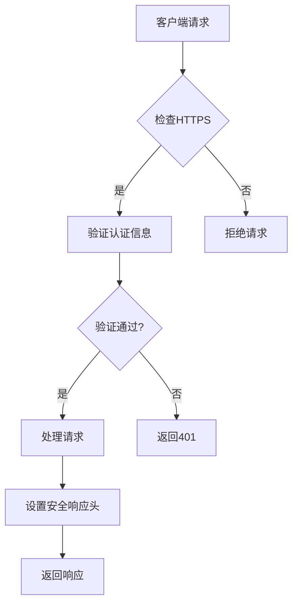
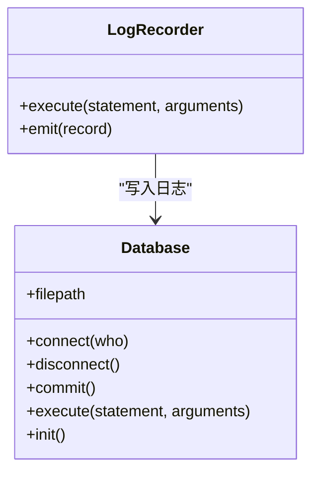

# 安全考虑

<cite>
**本文档引用的文件**   
- [auth.py](file://src/backEnd/utils/auth.py)
- [api.py](file://src/backEnd/thirdparty/sqlmap/lib/utils/api.py)
- [app.py](file://src/backEnd/app.py)
- [option.py](file://src/backEnd/third_lib/sqlmap/lib/core/option.py)
- [LogRecorder.py](file://src/backEnd/model/LogRecorder.py)
- [header_processor.py](file://src/backEnd/utils/header_processor.py)
- [taskService.py](file://src/backEnd/service/taskService.py)
</cite>

## 目录
1. [介绍](#介绍)
2. [基于Bearer Token的认证机制](#基于bearer-token的认证机制)
3. [CORS配置与跨域请求处理](#cors配置与跨域请求处理)
4. [API端点权限控制](#api端点权限控制)
5. [敏感数据保护措施](#敏感数据保护措施)
6. [Web漏洞防护措施](#web漏洞防护措施)
7. [安全配置最佳实践](#安全配置最佳实践)
8. [安全审计日志配置](#安全审计日志配置)
9. [与sqlmap引擎通信的安全考虑](#与sqlmap引擎通信的安全考虑)

## 介绍
本安全文档详细阐述了sqlmapWebUI系统的安全架构和防护机制。系统采用多层安全策略，包括基于IP地址和Token的认证机制、严格的CORS配置、全面的API权限控制以及针对常见Web漏洞的防护措施。文档重点介绍了系统如何保护敏感数据、防止CSRF和XSS攻击，并提供了安全配置的最佳实践建议。此外，文档还涵盖了与sqlmap引擎通信的安全考虑和沙箱执行建议，为管理员提供了完整的安全审计日志配置和分析指南。

## 基于Bearer Token的认证机制

系统实现了基于Bearer Token的认证机制，结合IP地址验证提供多层次的安全保护。认证流程首先检查客户端IP地址，对于本地回环地址（127.0.0.1或localhost）直接授予管理员权限。对于外部请求，系统验证提供的Token是否等于预设的"secret-token"值。这种简单的Token机制虽然适用于内部工具，但建议在生产环境中采用更复杂的JWT令牌和密钥轮换策略。认证信息通过HTTP Authorization头传递，服务器在每次请求时验证Token的有效性，并在验证失败时返回401未授权状态码。

**Section sources**
- [auth.py](file://src/backEnd/utils/auth.py#L1-L22)

## CORS配置与跨域请求处理

系统配置了严格的CORS（跨域资源共享）策略，以防止未经授权的跨域请求。通过FastAPI的CORSMiddleware中间件，系统明确指定了允许的来源列表，包括开发环境的特定端口（5173、8775等）。配置允许所有HTTP方法和请求头，同时启用凭据传输以支持身份验证。这种精确的来源控制有效防止了恶意网站的跨域请求攻击，同时确保了合法前端应用的正常访问。建议在生产环境中进一步限制允许的来源，避免使用通配符，并考虑实施更精细的请求头和方法控制。

**Section sources**
- [app.py](file://src/backEnd/app.py#L1-L44)

## API端点权限控制

API端点的权限控制通过多层机制实现。首先，系统通过get_current_user函数验证用户身份，区分管理员和普通认证用户。其次，CORS配置限制了可访问API的来源。此外，系统实现了基于任务ID的访问控制，确保用户只能访问和操作自己的任务。对于敏感操作，如任务删除和刷新，系统要求管理员令牌或匹配的客户端IP地址。这种细粒度的权限控制有效防止了未授权访问和数据泄露，确保了系统的安全性和数据隔离性。

**Section sources**
- [auth.py](file://src/backEnd/utils/auth.py#L1-L22)
- [api.py](file://src/backEnd/thirdparty/sqlmap/lib/utils/api.py#L1-L799)

## 敏感数据保护措施

系统采取了多项措施保护敏感数据。首先，所有认证信息通过HTTPS加密传输，防止中间人攻击。其次，系统在响应头中设置了安全相关的HTTP头，如X-Content-Type-Options、X-Frame-Options和X-XSS-Protection，增强浏览器的安全防护。此外，系统对日志记录进行了严格控制，避免在日志中记录敏感信息如密码和令牌。对于数据库存储，系统使用SQLite数据库并通过文件权限控制访问。建议进一步实施数据加密存储、定期安全审计和漏洞扫描，以全面提升数据保护水平。

**Diagram sources**
- [api.py](file://src/backEnd/thirdparty/sqlmap/lib/utils/api.py#L305-L348)
- [auth.py](file://src/backEnd/utils/auth.py#L1-L22)

## Web漏洞防护措施

系统实施了全面的防护措施来抵御常见的Web漏洞。针对CSRF攻击，系统通过严格的CORS策略和同源策略限制跨域请求。对于XSS攻击，系统设置了X-XSS-Protection响应头，并建议前端实施内容安全策略（CSP）。系统还通过输入验证和参数化查询防止SQL注入攻击。此外，系统实现了安全的会话管理，使用随机生成的令牌和过期策略。建议定期进行安全测试，包括使用自动化工具扫描漏洞，并及时更新依赖库以修复已知的安全问题。

**Section sources**
- [api.py](file://src/backEnd/thirdparty/sqlmap/lib/utils/api.py#L305-L348)
- [option.py](file://src/backEnd/third_lib/sqlmap/lib/core/option.py#L1825-L1864)

## 安全配置最佳实践

为确保系统安全，建议遵循以下最佳实践：首先，使用强密码和复杂的Token生成策略，定期轮换密钥。其次，限制API的暴露范围，仅在必要时开放端口。实施详细的日志记录和监控，及时发现异常行为。定期进行安全审计和漏洞扫描，使用工具如sqlmap进行自我测试。配置防火墙规则，限制对数据库和管理接口的访问。最后，保持所有依赖库和系统组件的最新版本，及时应用安全补丁。

**Section sources**
- [api.py](file://src/backEnd/thirdparty/sqlmap/lib/utils/api.py#L673-L714)
- [option.py](file://src/backEnd/third_lib/sqlmap/lib/core/option.py#L1825-L1864)

## 安全审计日志配置

系统提供了详细的审计日志功能，记录所有关键操作。日志记录器将事件写入IPC数据库，包括任务创建、删除、启动和停止等操作。每条日志包含时间戳、级别和详细消息，便于追踪和分析。管理员可以通过API获取日志数据，进行安全审计和故障排查。建议配置日志轮转策略，防止日志文件过大，并实施日志加密存储以保护敏感信息。定期审查日志，设置告警机制以检测异常活动。

**Diagram sources**
- [LogRecorder.py](file://src/backEnd/model/LogRecorder.py#L1-L17)
- [api.py](file://src/backEnd/thirdparty/sqlmap/lib/utils/api.py#L204-L242)

## 与sqlmap引擎通信的安全考虑

与sqlmap引擎的通信通过REST-JSON API进行，采用安全的IPC机制。系统使用随机生成的管理员令牌进行身份验证，确保只有授权用户可以控制引擎。通信过程中，所有数据通过加密通道传输，防止窃听和篡改。建议在生产环境中使用TLS加密API通信，并实施严格的访问控制。对于沙箱执行，建议在隔离的容器环境中运行sqlmap引擎，限制其系统权限和网络访问，防止潜在的安全风险扩散。定期审查和更新sqlmap配置，确保其安全性和稳定性。

**Section sources**
- [api.py](file://src/backEnd/thirdparty/sqlmap/lib/utils/api.py#L673-L714)
- [taskService.py](file://src/backEnd/service/taskService.py#L1-L100)