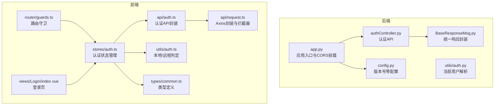
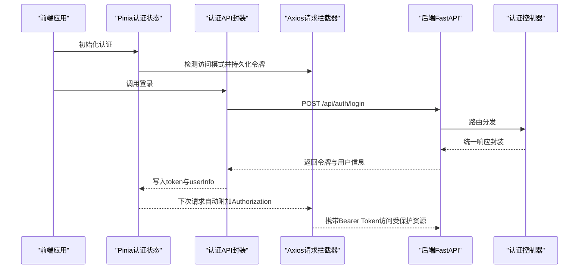
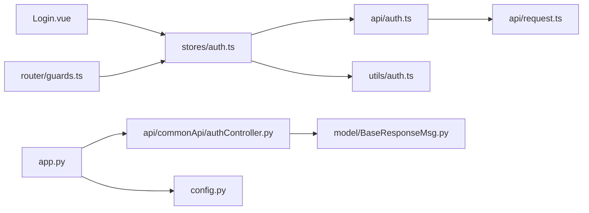
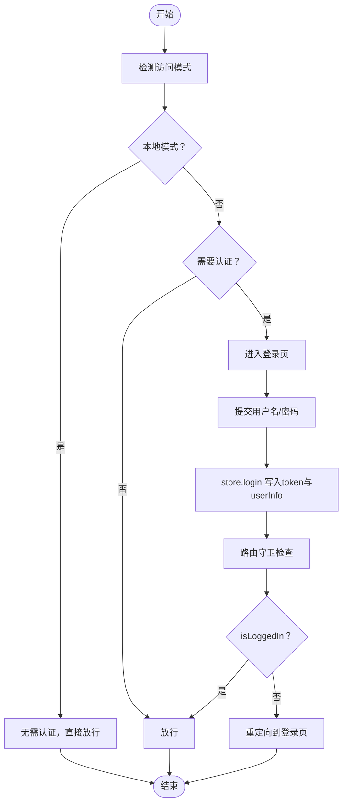

# 认证框架

<cite>
**本文引用的文件**
- [src/backEnd/app.py](file://src/backEnd/app.py)
- [src/backEnd/config.py](file://src/backEnd/config.py)
- [src/backEnd/api/commonApi/authController.py](file://src/backEnd/api/commonApi/authController.py)
- [src/backEnd/utils/auth.py](file://src/backEnd/utils/auth.py)
- [src/backEnd/model/BaseResponseMsg.py](file://src/backEnd/model/BaseResponseMsg.py)
- [src/frontEnd/src/api/auth.ts](file://src/frontEnd/src/api/auth.ts)
- [src/frontEnd/src/api/request.ts](file://src/frontEnd/src/api/request.ts)
- [src/frontEnd/src/stores/auth.ts](file://src/frontEnd/src/stores/auth.ts)
- [src/frontEnd/src/utils/auth.ts](file://src/frontEnd/src/utils/auth.ts)
- [src/frontEnd/src/router/guards.ts](file://src/frontEnd/src/router/guards.ts)
- [src/frontEnd/src/views/Login/index.vue](file://src/frontEnd/src/views/Login/index.vue)
- [src/frontEnd/src/types/common.ts](file://src/frontEnd/src/types/common.ts)
</cite>

## 目录
1. [简介](#简介)
2. [项目结构](#项目结构)
3. [核心组件](#核心组件)
4. [架构总览](#架构总览)
5. [详细组件分析](#详细组件分析)
6. [依赖关系分析](#依赖关系分析)
7. [性能与安全考量](#性能与安全考量)
8. [故障排查指南](#故障排查指南)
9. [结论](#结论)
10. [附录](#附录)

## 简介
本文件系统性梳理了该工程的认证框架，覆盖前后端交互、路由守卫、本地/远程双模式判定、令牌传递与持久化、以及错误处理与健康检查机制。当前实现以“本地单机模式”为主，默认无需认证；同时保留了远程访问所需的认证接口与前端适配，便于后续扩展为真实的企业级认证方案。

## 项目结构
认证相关代码主要分布在后端的 FastAPI 应用与路由、认证控制器、通用响应封装，以及前端的 Pinia 状态管理、Axios 请求封装、路由守卫与登录页面。

图表来源
- [src/backEnd/app.py](file://src/backEnd/app.py#L1-L69)
- [src/backEnd/api/commonApi/authController.py](file://src/backEnd/api/commonApi/authController.py#L1-L150)
- [src/backEnd/utils/auth.py](file://src/backEnd/utils/auth.py#L1-L23)
- [src/backEnd/model/BaseResponseMsg.py](file://src/backEnd/model/BaseResponseMsg.py#L1-L16)
- [src/backEnd/config.py](file://src/backEnd/config.py#L1-L8)
- [src/frontEnd/src/api/auth.ts](file://src/frontEnd/src/api/auth.ts#L1-L34)
- [src/frontEnd/src/api/request.ts](file://src/frontEnd/src/api/request.ts#L1-L230)
- [src/frontEnd/src/stores/auth.ts](file://src/frontEnd/src/stores/auth.ts#L1-L175)
- [src/frontEnd/src/utils/auth.ts](file://src/frontEnd/src/utils/auth.ts#L1-L45)
- [src/frontEnd/src/router/guards.ts](file://src/frontEnd/src/router/guards.ts#L1-L47)
- [src/frontEnd/src/views/Login/index.vue](file://src/frontEnd/src/views/Login/index.vue#L1-L94)
- [src/frontEnd/src/types/common.ts](file://src/frontEnd/src/types/common.ts#L1-L23)

章节来源
- [src/backEnd/app.py](file://src/backEnd/app.py#L1-L69)
- [src/frontEnd/src/api/request.ts](file://src/frontEnd/src/api/request.ts#L1-L230)

## 核心组件
- 后端认证控制器：提供登录、令牌刷新、认证需求检查三个接口，统一响应体封装。
- 前端认证状态管理：负责本地/远程模式识别、登录、登出、令牌持久化、健康检查与路由守卫联动。
- Axios 请求封装：自动注入 Authorization 头、统一错误处理、401 重定向与清理。
- 路由守卫：根据本地/远程模式与登录态控制页面访问。
- 本地/远程判定工具：基于浏览器 hostname 判断访问模式。

章节来源
- [src/backEnd/api/commonApi/authController.py](file://src/backEnd/api/commonApi/authController.py#L1-L150)
- [src/frontEnd/src/stores/auth.ts](file://src/frontEnd/src/stores/auth.ts#L1-L175)
- [src/frontEnd/src/api/request.ts](file://src/frontEnd/src/api/request.ts#L1-L230)
- [src/frontEnd/src/router/guards.ts](file://src/frontEnd/src/router/guards.ts#L1-L47)
- [src/frontEnd/src/utils/auth.ts](file://src/frontEnd/src/utils/auth.ts#L1-L45)

## 架构总览
认证流程分为“本地单机模式”和“远程访问模式”。本地模式默认放行，远程模式则通过登录接口获取令牌并在后续请求中携带 Authorization 头。

图表来源
- [src/frontEnd/src/stores/auth.ts](file://src/frontEnd/src/stores/auth.ts#L1-L175)
- [src/frontEnd/src/api/auth.ts](file://src/frontEnd/src/api/auth.ts#L1-L34)
- [src/frontEnd/src/api/request.ts](file://src/frontEnd/src/api/request.ts#L1-L230)
- [src/backEnd/api/commonApi/authController.py](file://src/backEnd/api/commonApi/authController.py#L1-L150)

## 详细组件分析

### 后端认证控制器（FastAPI）
- 接口职责
  - 登录：生成模拟令牌并返回用户信息，统一响应封装。
  - 刷新令牌：返回新模拟令牌与过期时间。
  - 检查认证需求：返回当前模式与是否需要认证。
- 统一响应
  - 使用统一响应类封装 code/success/message/data 字段，便于前端一致处理。
- 版本信息
  - 通过配置模块提供版本号，供健康检查与认证需求接口返回。

章节来源
- [src/backEnd/api/commonApi/authController.py](file://src/backEnd/api/commonApi/authController.py#L1-L150)
- [src/backEnd/model/BaseResponseMsg.py](file://src/backEnd/model/BaseResponseMsg.py#L1-L16)
- [src/backEnd/config.py](file://src/backEnd/config.py#L1-L8)

### 前端认证状态管理（Pinia）
- 模式与登录态
  - 本地模式：始终视为已登录，无需令牌。
  - 远程模式：依据 token 存在与否判断登录态。
- 登录/登出
  - 登录：调用认证 API，写入 token 与用户信息并持久化。
  - 登出：清空 token 与用户信息并移除本地存储。
- 健康检查
  - 定期轮询后端健康接口，缓存结果并记录变化。
- 计算属性
  - isLoggedIn、userName、needAuth 等，供视图层与守卫使用。

章节来源
- [src/frontEnd/src/stores/auth.ts](file://src/frontEnd/src/stores/auth.ts#L1-L175)

### Axios 请求封装与拦截器
- 自动注入 Authorization
  - 远程模式下从本地存储读取 token 并附加到请求头。
- 错误处理
  - 401 未授权：远程模式清除本地 token 并提示重新登录；本地模式忽略 401。
  - 其他 HTTP 错误与网络错误：统一提示并拒绝。
- 重试机制
  - 对 GET 请求在特定状态码下进行指数退避重试，提升健壮性。

章节来源
- [src/frontEnd/src/api/request.ts](file://src/frontEnd/src/api/request.ts#L1-L230)

### 路由守卫
- 本地模式：直接放行，若访问登录页则重定向至首页。
- 远程模式：根据 meta.requiresAuth 与登录态控制跳转至登录页或放行。
- 与认证状态联动：守卫读取 store 中的 isLocalMode 与 isLoggedIn。

章节来源
- [src/frontEnd/src/router/guards.ts](file://src/frontEnd/src/router/guards.ts#L1-L47)
- [src/frontEnd/src/stores/auth.ts](file://src/frontEnd/src/stores/auth.ts#L1-L175)

### 本地/远程判定工具
- 基于浏览器 hostname 判断是否为本地访问（支持 IPv4/IPv6 回环与 127.x 段）。
- 提供 shouldSkipAuth 与 isAuthRequired 辅助函数。

章节来源
- [src/frontEnd/src/utils/auth.ts](file://src/frontEnd/src/utils/auth.ts#L1-L45)

### 登录页与认证 API 封装
- 登录页：收集用户名/密码，调用认证状态管理完成登录并重定向。
- 认证 API 封装：login、refreshToken、checkAuthRequired、getVersion 等。

章节来源
- [src/frontEnd/src/views/Login/index.vue](file://src/frontEnd/src/views/Login/index.vue#L1-L94)
- [src/frontEnd/src/api/auth.ts](file://src/frontEnd/src/api/auth.ts#L1-L34)
- [src/frontEnd/src/types/common.ts](file://src/frontEnd/src/types/common.ts#L1-L23)

### 后端应用与 CORS
- 应用入口挂载静态资源、CORS 中间件与认证路由。
- 提供 /api/version 与 /api/health 健康检查接口。

章节来源
- [src/backEnd/app.py](file://src/backEnd/app.py#L1-L69)

## 依赖关系分析
- 前端依赖链
  - 登录页依赖认证状态管理。
  - 认证状态管理依赖认证 API 封装与本地/远程判定工具。
  - 认证 API 封装依赖 Axios 请求封装。
  - 路由守卫依赖认证状态管理。
- 后端依赖链
  - 认证控制器依赖统一响应封装与配置模块。
  - 应用入口挂载认证路由与其他业务路由，并配置 CORS。

图表来源
- [src/frontEnd/src/views/Login/index.vue](file://src/frontEnd/src/views/Login/index.vue#L1-L94)
- [src/frontEnd/src/stores/auth.ts](file://src/frontEnd/src/stores/auth.ts#L1-L175)
- [src/frontEnd/src/api/auth.ts](file://src/frontEnd/src/api/auth.ts#L1-L34)
- [src/frontEnd/src/api/request.ts](file://src/frontEnd/src/api/request.ts#L1-L230)
- [src/frontEnd/src/utils/auth.ts](file://src/frontEnd/src/utils/auth.ts#L1-L45)
- [src/frontEnd/src/router/guards.ts](file://src/frontEnd/src/router/guards.ts#L1-L47)
- [src/backEnd/app.py](file://src/backEnd/app.py#L1-L69)
- [src/backEnd/api/commonApi/authController.py](file://src/backEnd/api/commonApi/authController.py#L1-L150)
- [src/backEnd/model/BaseResponseMsg.py](file://src/backEnd/model/BaseResponseMsg.py#L1-L16)
- [src/backEnd/config.py](file://src/backEnd/config.py#L1-L8)

## 性能与安全考量
- 性能
  - Axios 对 GET 请求的指数退避重试可提升弱网环境下的成功率。
  - 前端健康检查采用定时轮询与缓存，避免频繁请求。
- 安全
  - 当前后端未实现严格的身份认证与令牌校验，仅在本地模式下放行。
  - 建议后续引入 JWT 令牌签发与校验、密码哈希、CSRF 防护、CORS 白名单细化等。
- 可扩展性
  - 认证控制器与前端 store 已预留扩展点，便于接入真实用户体系与权限模型。

[本节为通用建议，不直接分析具体文件]

## 故障排查指南
- 登录后仍被重定向到登录页
  - 检查是否处于远程模式且 token 是否正确写入本地存储。
  - 确认路由守卫逻辑与 store 的 isLoggedIn 计算属性。
- 401 未授权错误
  - 远程模式下会清除本地 token 并提示重新登录；确认后端是否返回有效令牌。
  - 本地模式下 401 会被忽略，若出现异常行为需检查拦截器逻辑。
- 健康检查失败
  - 检查 /api/health 接口可达性与返回格式。
  - 关注前端健康检查缓存与日志输出。

章节来源
- [src/frontEnd/src/stores/auth.ts](file://src/frontEnd/src/stores/auth.ts#L1-L175)
- [src/frontEnd/src/api/request.ts](file://src/frontEnd/src/api/request.ts#L1-L230)
- [src/backEnd/app.py](file://src/backEnd/app.py#L1-L69)

## 结论
该认证框架以“本地单机模式”为核心设计，默认无需认证，同时保留远程访问所需的认证接口与前端适配。整体结构清晰、职责分离明确，具备良好的扩展性。建议在后续版本中引入真实的用户认证与令牌校验机制，完善安全与合规要求。

[本节为总结性内容，不直接分析具体文件]

## 附录

### 关键流程图：登录与路由守卫

图表来源
- [src/frontEnd/src/stores/auth.ts](file://src/frontEnd/src/stores/auth.ts#L1-L175)
- [src/frontEnd/src/router/guards.ts](file://src/frontEnd/src/router/guards.ts#L1-L47)
- [src/frontEnd/src/views/Login/index.vue](file://src/frontEnd/src/views/Login/index.vue#L1-L94)