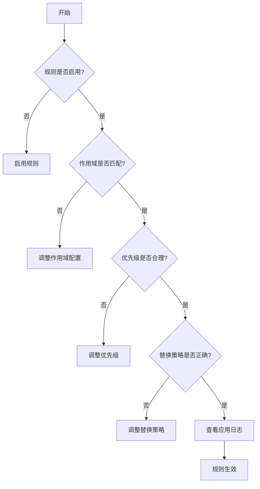
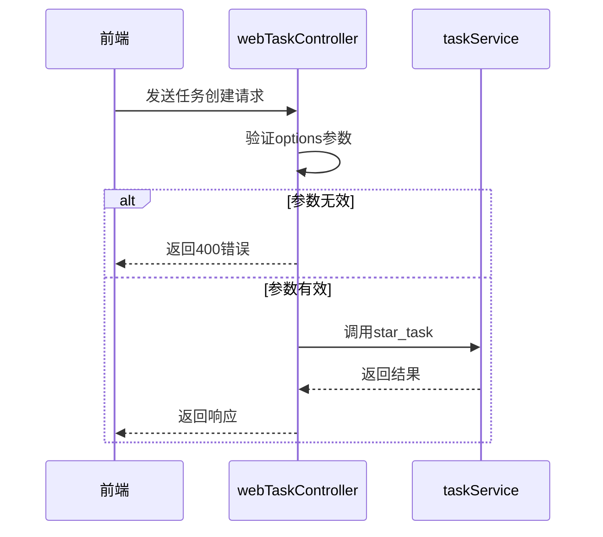
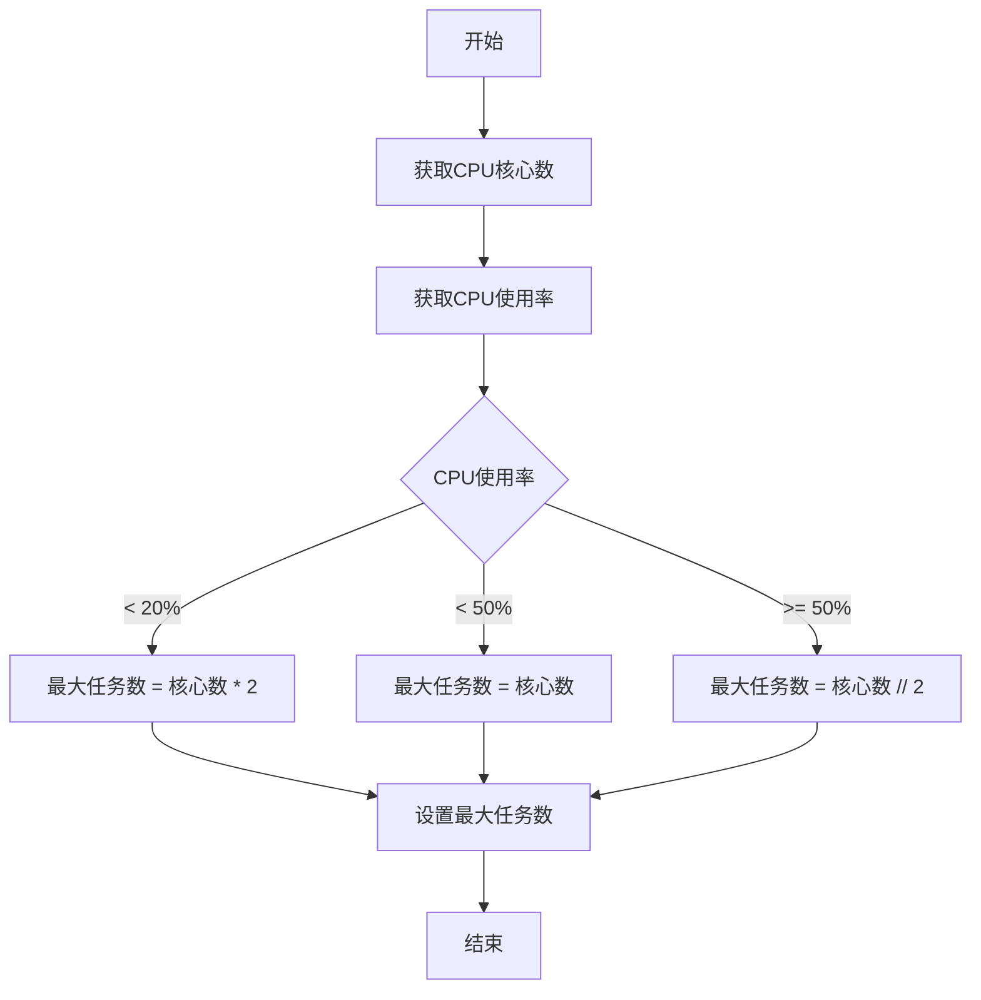
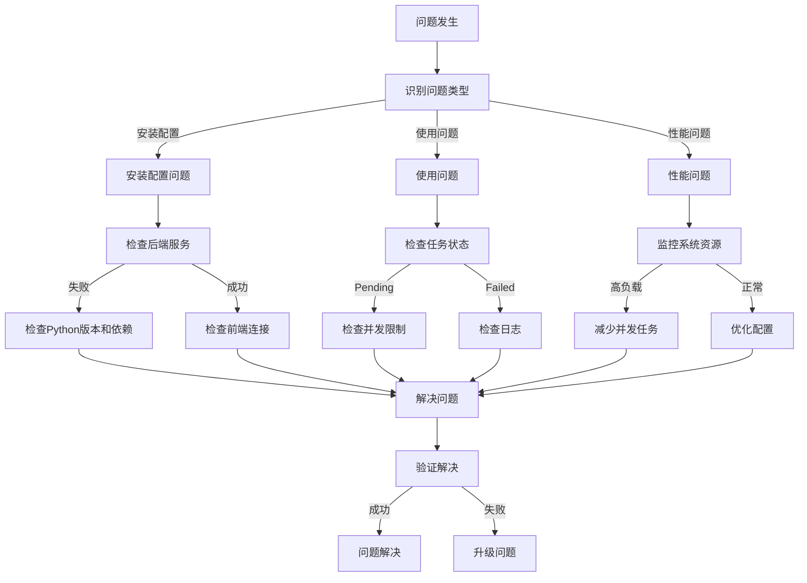

# 常见问题

<cite>
**本文档引用文件**  
- [README.md](file://README.md)
- [DISCLAIMER.md](file://DISCLAIMER.md)
- [USAGE_GUIDE.md](file://doc/USAGE_GUIDE.md)
- [app.py](file://src/backEnd/app.py)
- [main.py](file://src/backEnd/main.py)
- [config.py](file://src/backEnd/config.py)
- [Task.py](file://src/backEnd/model/Task.py)
- [LogRecorder.py](file://src/backEnd/model/LogRecorder.py)
- [webTaskController.py](file://src/backEnd/api/commonApi/webTaskController.py)
- [authController.py](file://src/backEnd/api/commonApi/authController.py)
- [header_processor.py](file://src/backEnd/utils/header_processor.py)
- [task_monitor.py](file://src/backEnd/utils/task_monitor.py)
- [TaskStatus.py](file://src/backEnd/model/TaskStatus.py)
- [PersistentHeaderRule.py](file://src/backEnd/model/PersistentHeaderRule.py)
- [SessionHeader.py](file://src/backEnd/model/SessionHeader.py)
- [scope_matcher.py](file://src/backEnd/utils/scope_matcher.py)
</cite>

## 目录
1. [安装与配置问题](#安装与配置问题)
2. [使用问题](#使用问题)
3. [故障排除](#故障排除)
4. [错误代码与日志分析](#错误代码与日志分析)
5. [性能问题诊断](#性能问题诊断)
6. [已知限制与规避策略](#已知限制与规避策略)
7. [安全警告与免责声明](#安全警告与免责声明)
8. [问题排查流程图](#问题排查流程图)
9. [快速参考指南](#快速参考指南)

## 安装与配置问题

### 后端服务无法启动

**问题**: 启动后端服务时出现错误或服务无法正常运行。

**解决方案**:
1. 确认 Python 版本为 3.13 或更高版本
2. 确保已正确安装依赖包：
   ```bash
   cd src/backEnd
   uv sync --extra thirdparty
   ```
3. 检查 `main.py` 文件中的路径配置是否正确
4. 确认端口 8775 未被其他程序占用
5. 查看日志文件获取详细错误信息

**Section sources**
- [main.py](file://src/backEnd/main.py#L1-L168)
- [app.py](file://src/backEnd/app.py#L1-L80)

### 前端无法连接后端

**问题**: 前端应用无法与后端 API 服务器通信。

**解决方案**:
1. 确认后端服务正在运行且监听在 `127.0.0.1:8775`
2. 检查前端 `.env` 配置文件中的 API 地址设置
3. 确认 CORS 配置允许前端域名访问：
   ```python
   app.add_middleware(
       CORSMiddleware,
       allow_origin_regex=r"http://(localhost|127\.0\.0\.1):(517[3-6]|8775)",
       allow_credentials=True,
       allow_methods=["*"],
       allow_headers=["*"]
   )
   ```
4. 使用浏览器开发者工具检查网络请求状态

**Section sources**
- [app.py](file://src/backEnd/app.py#L27-L34)

### VulnShop 靶场无法访问

**问题**: 无法访问内置的 VulnShop 漏洞测试靶场。

**解决方案**:
1. 确认已安装 Flask 依赖：
   ```bash
   pip install flask
   ```
2. 使用正确的地址访问：`http://127.0.0.1:9527`
3. 检查端口 9527 是否被占用
4. 确认 `server.py` 文件位于正确路径

**Section sources**
- [server.py](file://src/vulnTestServer/server.py)

## 使用问题

### 扫描任务一直处于 Pending 状态

**问题**: 创建的扫描任务长时间处于等待状态，无法开始执行。

**解决方案**:
1. 检查系统最大任务数限制：
   ```python
   MAX_TASKS_COUNT = 3  # 在 config.py 中定义
   ```
2. 确认任务监控器正常运行：
   ```python
   scheduler.add_job(monitor, 'interval', seconds=3)
   ```
3. 检查是否有正在运行的任务占满了并发额度
4. 查看后端日志确认 SQLMap 引擎是否正常初始化

**Section sources**
- [config.py](file://src/backEnd/config.py#L3)
- [task_monitor.py](file://src/backEnd/utils/task_monitor.py#L36-L94)

### 请求头规则不生效

**问题**: 配置的请求头规则没有应用到扫描任务中。

**解决方案**:
1. 确认规则已启用（is_active = True）
2. 检查作用域配置是否与目标 URL 匹配
3. 验证优先级设置是否正确
4. 确认替换策略配置符合预期
5. 查看任务日志确认规则应用情况



**Diagram sources**
- [header_processor.py](file://src/backEnd/utils/header_processor.py#L12-L292)
- [PersistentHeaderRule.py](file://src/backEnd/model/PersistentHeaderRule.py)

**Section sources**
- [header_processor.py](file://src/backEnd/utils/header_processor.py#L90-L151)

### 会话级请求头过期

**问题**: 会话级请求头在一段时间后失效。

**解决方案**:
1. 会话级请求头具有 TTL（生存时间）限制，这是正常行为
2. 可以通过增加 TTL 值延长有效期
3. 对于需要长期生效的请求头，建议使用持久化规则
4. 检查 `SessionHeader` 类的过期判断逻辑

**Section sources**
- [SessionHeader.py](file://src/backEnd/model/SessionHeader.py)
- [header_processor.py](file://src/backEnd/utils/header_processor.py#L154-L211)

## 故障排除

### 任务创建失败

**问题**: 添加扫描任务时返回失败。

**排查步骤**:
1. 检查请求参数是否完整，特别是 `options` 字段
2. 确认客户端地址可获取
3. 查看后端日志中的错误信息
4. 验证任务参数格式是否正确



**Diagram sources**
- [webTaskController.py](file://src/backEnd/api/commonApi/webTaskController.py#L19-L91)
- [taskService.py](file://src/backEnd/service/taskService.py)

**Section sources**
- [webTaskController.py](file://src/backEnd/api/commonApi/webTaskController.py#L46-L54)

### 认证功能异常

**问题**: 认证相关功能无法正常工作。

**说明**: 当前系统为本地单机模式，认证功能为模拟实现。

**解决方案**:
1. 了解当前认证为模拟模式，不进行真实验证
2. 认证检查接口返回 `required=False`
3. 如需真实认证，需实现 JWT 等认证机制

**Section sources**
- [authController.py](file://src/backEnd/api/commonApi/authController.py#L40-L150)

## 错误代码与日志分析

### 日志记录机制

系统使用自定义日志记录器将日志写入 IPC 数据库：

```python
class LogRecorder(logging.StreamHandler):
    def emit(self, record):
        conf.databaseCursor.execute("INSERT INTO logs VALUES(NULL, ?, ?, ?, ?)", 
                            (conf.taskid, time.strftime("%X"), 
                             record.levelname, 
                             str(record.msg % record.args if
                                 record.args else record.msg)))
```

**关键日志信息**:
- 任务创建和状态变更
- 请求头规则应用情况
- 扫描引擎启动和停止
- 错误和异常信息

**日志分析技巧**:
1. 按任务 ID 过滤日志
2. 关注 ERROR 和 WARNING 级别日志
3. 查看任务状态转换日志
4. 分析请求头处理过程

**Section sources**
- [LogRecorder.py](file://src/backEnd/model/LogRecorder.py#L7-L18)
- [Task.py](file://src/backEnd/model/Task.py)

## 性能问题诊断

### 任务并发数动态调整

系统根据 CPU 使用率动态调整最大任务数：



**性能优化建议**:
1. 监控系统资源使用情况
2. 根据实际硬件调整并发策略
3. 避免同时运行过多高负载任务
4. 定期清理已完成的任务

**Diagram sources**
- [task_monitor.py](file://src/backEnd/utils/task_monitor.py#L11-L33)

**Section sources**
- [task_monitor.py](file://src/backEnd/utils/task_monitor.py#L11-L33)

## 已知限制与规避策略

### 最大任务数限制

**限制**: 系统默认限制同时运行的任务数量。

**规避策略**:
1. 调整 `MAX_TASKS_COUNT` 配置值
2. 使用动态任务数调整功能
3. 合理安排扫描任务的执行顺序

### 请求头处理限制

**限制**: 请求头名称只能包含字母、数字、连字符和下划线。

**规避策略**:
1. 避免使用特殊字符作为请求头名称
2. 使用标准的请求头命名规范
3. 在应用规则前进行名称验证

**Section sources**
- [header_processor.py](file://src/backEnd/utils/header_processor.py#L49-L56)

## 安全警告与免责声明

### 法律合规要求

**重要声明**: 本工具仅供授权安全测试使用。

**使用条款**:
1. **授权使用**: 必须在获得目标系统所有者明确书面授权后使用
2. **合法用途**: 仅可用于授权渗透测试、安全研究、教育培训等合法场景
3. **禁止滥用**: 严禁用于未经授权访问、数据窃取等非法活动
4. **风险承担**: 使用者需自行承担所有相关风险
5. **免责条款**: 开发者不对因使用本软件导致的任何损害承担责任

**法律合规**:
- 遵守《中华人民共和国网络安全法》
- 遵守《中华人民共和国刑法》相关规定
- 遵守所在国家/地区的相关法律法规

**Section sources**
- [DISCLAIMER.md](file://DISCLAIMER.md)

## 问题排查流程图



**Diagram sources**
- [config.py](file://src/backEnd/config.py)
- [task_monitor.py](file://src/backEnd/utils/task_monitor.py)
- [LogRecorder.py](file://src/backEnd/model/LogRecorder.py)

## 快速参考指南

### 常用配置参数

| 参数 | 说明 | 默认值 | 范围 |
|------|------|--------|------|
| MAX_TASKS_COUNT | 最大并发任务数 | 3 | 正整数 |
| VERSION | 系统版本 | 1.7.9 | 语义化版本 |
| Level | SQLMap检测级别 | 1 | 1-5 |
| Risk | SQLMap风险级别 | 1 | 1-3 |

### 常见HTTP状态码

| 状态码 | 说明 |
|-------|------|
| 200 | 请求成功 |
| 400 | 请求参数错误 |
| 401 | 未授权 |
| 500 | 服务器内部错误 |

### 快速命令参考

```bash
# 启动后端服务
uv run python main.py

# 启动前端开发服务器
pnpm run dev

# 启动VulnShop靶场
python server.py

# 构建Burp插件
mvn clean package -DskipTests
```

**Section sources**
- [main.py](file://src/backEnd/main.py)
- [config.py](file://src/backEnd/config.py)
- [USAGE_GUIDE.md](file://doc/USAGE_GUIDE.md)