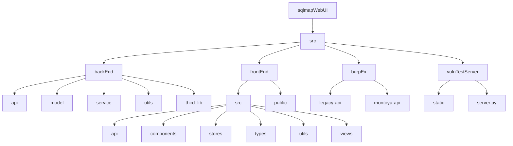
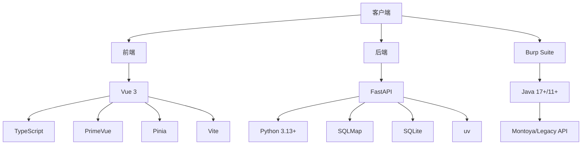
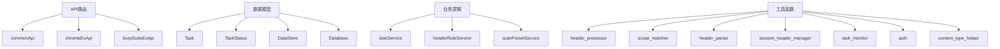
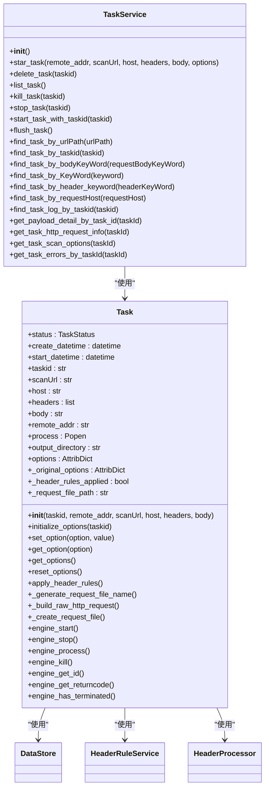
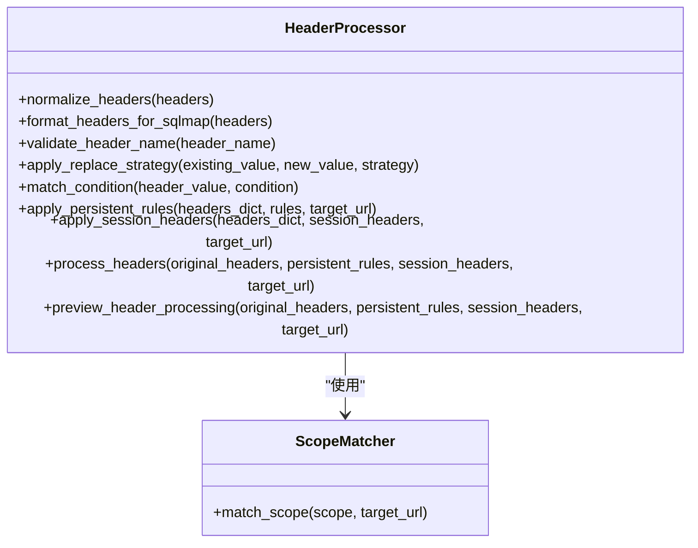
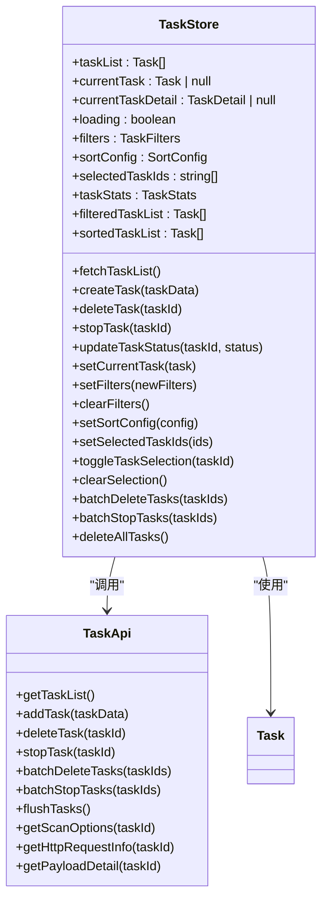
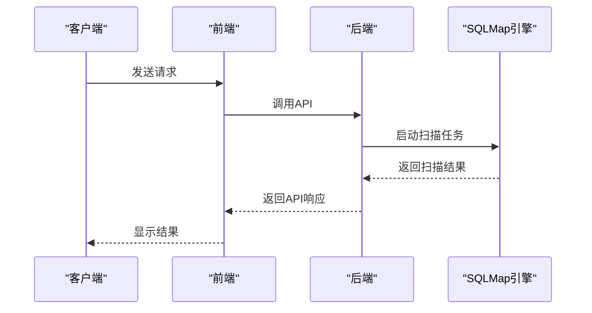

# 开发者指南

<cite>
**本文档引用的文件**   
- [README.md](file://README.md)
- [src/backEnd/README.md](file://src/backEnd/README.md)
- [src/frontEnd/README.md](file://src/frontEnd/README.md)
- [src/backEnd/pyproject.toml](file://src/backEnd/pyproject.toml)
- [src/frontEnd/package.json](file://src/frontEnd/package.json)
- [src/backEnd/app.py](file://src/backEnd/app.py)
- [src/backEnd/main.py](file://src/backEnd/main.py)
- [src/backEnd/config.py](file://src/backEnd/config.py)
- [src/backEnd/model/Task.py](file://src/backEnd/model/Task.py)
- [src/backEnd/service/taskService.py](file://src/backEnd/service/taskService.py)
- [src/backEnd/utils/header_processor.py](file://src/backEnd/utils/header_processor.py)
- [src/frontEnd/vite.config.ts](file://src/frontEnd/vite.config.ts)
- [src/frontEnd/src/api/task.ts](file://src/frontEnd/src/api/task.ts)
- [src/frontEnd/src/stores/task.ts](file://src/frontEnd/src/stores/task.ts)
- [src/frontEnd/src/router/index.ts](file://src/frontEnd/src/router/index.ts)
- [src/backEnd/tests/test_api_endpoints.py](file://src/backEnd/tests/test_api_endpoints.py)
</cite>

## 目录
1. [简介](#简介)
2. [项目结构](#项目结构)
3. [开发环境搭建](#开发环境搭建)
4. [技术栈与架构](#技术栈与架构)
5. [代码库组织与编码规范](#代码库组织与编码规范)
6. [核心组件分析](#核心组件分析)
7. [开发与调试技巧](#开发与调试技巧)
8. [测试方法](#测试方法)
9. [功能开发流程](#功能开发流程)
10. [代码贡献流程](#代码贡献流程)
11. [开发工具配置](#开发工具配置)
12. [持续集成](#持续集成)

## 简介
sqlmapWebUI是一个现代化的SQL注入测试平台，为安全研究人员提供便捷的SQL注入测试功能。项目采用前后端分离架构，后端基于FastAPI框架，前端基于Vue 3 + TypeScript构建。项目内置VulnShop漏洞靶场，支持开箱即用。本开发者指南旨在为贡献者提供全面的开发指导，涵盖环境搭建、代码结构、开发流程和贡献规范。

## 项目结构
项目采用模块化设计，主要分为后端、前端、Burp Suite扩展和漏洞靶场四个部分。后端代码位于`src/backEnd`目录，前端代码位于`src/frontEnd`目录，Burp Suite扩展位于`src/burpEx`目录，漏洞靶场位于`src/vulnTestServer`目录。



**目录来源**
- [README.md](file://README.md#L175-L208)

## 开发环境搭建
### 环境要求
- Python 3.13+
- Node.js 20+
- pnpm 9+
- Java 17+ (Burp Montoya API) 或 Java 11+ (Legacy API)

### 后端安装
```bash
# 进入后端目录
cd src/backEnd

# 使用 uv 安装依赖
uv sync --extra thirdparty

# 启动服务
uv run python main.py
```

### 前端安装
```bash
# 进入前端目录
cd src/frontEnd

# 安装依赖
pnpm install

# 开发模式
pnpm run dev

# 构建生产版本
pnpm run build
```

### 启动漏洞靶场
```bash
# 进入靶场目录
cd src/vulnTestServer

# 安装依赖（如未安装）
pip install flask

# 启动服务
python server.py
```

### 访问应用
| 服务 | 地址 |
|------|------|
| 前端开发服务器 | http://localhost:5173 |
| 后端 API 服务器 | http://localhost:8775 |
| VulnShop 靶场 | http://127.0.0.1:9527 |

**来源**
- [README.md](file://README.md#L116-L174)

## 技术栈与架构
### 后端技术栈
- **FastAPI**: 高性能异步Web框架
- **SQLMap**: SQL注入自动化检测工具
- **Python 3.13+**: 运行环境
- **SQLite**: 数据库存储
- **uv**: 现代Python包管理器

### 前端技术栈
- **Vue 3**: 渐进式JavaScript框架
- **TypeScript**: 类型安全的JavaScript
- **PrimeVue**: 企业级UI组件库
- **Pinia**: Vue状态管理
- **Vite**: 下一代前端构建工具

### 扩展技术栈
- **Burp Suite 插件**
  - Montoya API (Java 17+, Burp 2023.1+)
  - Legacy API (Java 11+)



**来源**
- [README.md](file://README.md#L95-L115)

## 代码库组织与编码规范
### 后端代码组织
后端代码采用分层架构，主要包括API路由、数据模型、业务逻辑和服务工具四个层次。



**来源**
- [src/backEnd/README.md](file://src/backEnd/README.md#L78-L131)

### 前端代码组织
前端代码采用模块化设计，主要包括API接口、组件、状态管理、类型定义、工具函数和页面视图。

```mermaid
graph TD
A[API接口] --> B[task.ts]
A --> C[headerRule.ts]
A --> D[index.ts]
A --> E[request.ts]
A --> F[scanPreset.ts]
A --> G[auth.ts]
H[组件] --> I[TaskFilter.vue]
H --> J[TaskSummary.vue]
H --> K[ScopeConfigPanel.vue]
H --> L[HttpCodeEditor.vue]
H --> M[GuidedParamEditor.vue]
N[状态管理] --> O[task.ts]
N --> P[config.ts]
N --> Q[scanPreset.ts]
N --> R[auth.ts]
S[类型定义] --> T[task.ts]
S --> U[headerRule.ts]
S --> V[scanPreset.ts]
S --> W[common.ts]
X[工具函数] --> Y[httpRequestParser]
X --> Z[auth.ts]
AA[页面视图] --> AB[Home]
AA --> AC[TaskList]
AA --> AD[TaskDetail]
AA --> AE[AddTask]
AA --> AF[Config]
```



**来源**
- [src/frontEnd/README.md](file://src/frontEnd/README.md#L89-L134)

## 核心组件分析
### 任务管理组件
任务管理是系统的核心功能，负责创建、监控和管理SQL注入扫描任务。后端通过`Task`类和`TaskService`类实现任务管理功能。



**来源**
- [src/backEnd/model/Task.py](file://src/backEnd/model/Task.py)
- [src/backEnd/service/taskService.py](file://src/backEnd/service/taskService.py)

### 请求头处理组件
请求头处理组件负责应用持久化规则和会话性请求头，确保在SQLMap扫描前正确处理请求头。



**来源**
- [src/backEnd/utils/header_processor.py](file://src/backEnd/utils/header_processor.py)

### 前端任务管理组件
前端任务管理组件通过Pinia状态管理实现任务列表的获取、过滤、排序和批量操作。



**来源**
- [src/frontEnd/src/stores/task.ts](file://src/frontEnd/src/stores/task.ts)
- [src/frontEnd/src/api/task.ts](file://src/frontEnd/src/api/task.ts)

## 开发与调试技巧
### 后端开发调试
1. 使用`uv run python main.py`启动后端服务
2. 访问`http://localhost:8775/docs`查看API文档
3. 使用`pdb`进行调试，可在`main.py`中取消注释`# import pdb`和`# pdb.set_trace()`
4. 查看日志输出，日志格式为`[时间] [级别] [模块] [文件] [行号] 消息`

### 前端开发调试
1. 使用`pnpm dev`启动前端开发服务器
2. 访问`http://localhost:5173`查看应用
3. 使用浏览器开发者工具进行调试
4. 使用`console.log`或`debugger`语句进行调试

### API调试
1. 使用Postman或curl测试API端点
2. 查看API响应状态码和数据
3. 使用`test_api_endpoints.py`脚本进行API端点测试



**来源**
- [src/backEnd/tests/test_api_endpoints.py](file://src/backEnd/tests/test_api_endpoints.py)

## 测试方法
### 单元测试
项目包含单元测试，位于`src/backEnd/tests`目录。使用pytest运行测试：

```bash
cd src/backEnd
python -m pytest tests/ -v
```

### API测试
使用`test_api_endpoints.py`脚本进行API端点测试，该脚本演示了如何通过HTTP API进行scope字段的CRUD操作。

### 前端测试
前端使用Mock数据进行测试，可在`src/frontEnd/src/utils/mockData.ts`中配置Mock数据模式。

## 功能开发流程
### 添加新API端点
1. 在`api/`对应模块创建路由函数
2. 在`app.py`中注册路由
3. 如需要，在`service/`添加业务逻辑
4. 在`model/`添加数据模型

### 添加新页面
1. 在`src/views/`创建页面组件
2. 在`src/router/index.ts`添加路由配置
3. 在Layout侧边栏菜单添加入口

### 添加新API
1. 在`src/types/`定义类型
2. 在`src/api/`创建API模块
3. 在组件或Store中调用API

### 添加新Store
1. 在`src/stores/`创建Store文件
2. 使用Composition API风格定义状态和动作
3. 在组件中使用`useXxxStore()`

**来源**
- [src/backEnd/README.md](file://src/backEnd/README.md#L221-L227)
- [src/frontEnd/README.md](file://src/frontEnd/README.md#L186-L199)

## 代码贡献流程
1. Fork本仓库
2. 创建特性分支 (`git checkout -b feature/AmazingFeature`)
3. 提交更改 (`git commit -m 'Add some AmazingFeature'`)
4. 推送到分支 (`git push origin feature/AmazingFeature`)
5. 提交Pull Request

**来源**
- [README.md](file://README.md#L305-L313)

## 开发工具配置
### Vite配置
前端使用Vite作为构建工具，配置文件位于`vite.config.ts`。

```mermaid
graph TD
A[Vite配置] --> B[插件]
B --> C[vue()]
B --> D[AutoImport]
B --> E[Components]
B --> F[viteCompression]
A --> G[解析]
G --> H[别名 @ -> src]
A --> I[服务器]
I --> J[端口 5173]
I --> K[代理 /api -> http://localhost:8775]
A --> L[CSS]
L --> M[SCSS]
A --> M[构建]
M --> N[输出目录 ../backEnd/static]
M --> O[代码分割]
O --> P[vendor]
O --> Q[primevue]
O --> R[utils]
```

**来源**
- [src/frontEnd/vite.config.ts](file://src/frontEnd/vite.config.ts)

### 包管理配置
后端使用uv作为包管理器，配置文件位于`pyproject.toml`。前端使用pnpm作为包管理器，配置文件位于`package.json`。

## 持续集成
项目使用GitHub Actions进行持续集成，配置文件位于`.github/workflows`目录。持续集成流程包括：
1. 代码格式化检查
2. 静态代码分析
3. 单元测试
4. 构建前端应用
5. 部署到生产环境