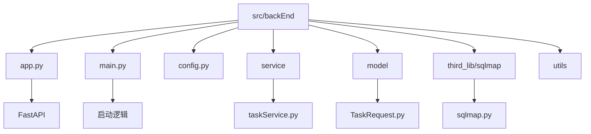

# 快速开始

<cite>
**本文档中引用的文件**  
- [main.py](file://src/backEnd/main.py)
- [app.py](file://src/backEnd/app.py)
- [config.py](file://src/backEnd/config.py)
- [pyproject.toml](file://src/backEnd/pyproject.toml)
- [uvicorn_config.json](file://src/backEnd/uvicorn_config.json)
- [taskService.py](file://src/backEnd/service/taskService.py)
- [TaskRequest.py](file://src/backEnd/model/requestModel/TaskRequest.py)
</cite>

## 目录
1. [简介](#简介)
2. [项目结构](#项目结构)
3. [环境配置](#环境配置)
4. [服务启动](#服务启动)
5. [使用示例：创建扫描任务](#使用示例创建扫描任务)
6. [常见配置选项](#常见配置选项)
7. [故障排除清单](#故障排除清单)
8. [学习路径指引](#学习路径指引)

## 简介
本指南旨在帮助新手用户在15分钟内完成 `sqlmapWebUI` 项目的快速部署与首次使用。通过分步说明，您将学会如何克隆仓库、配置环境、启动服务，并执行第一个SQL注入扫描任务。整个流程设计简洁明了，确保新用户能够快速获得成功体验。

## 项目结构
`sqlmapWebUI` 是一个基于 FastAPI 的 Web 用户界面，用于与 `sqlmap` 工具进行交互。后端位于 `src/backEnd` 目录下，主要包含以下组件：

- `.venv`：Python 虚拟环境
- `api`：提供 Chrome 和 BurpSuite 扩展接口
- `model`：定义数据模型和请求结构
- `service`：核心业务逻辑处理
- `third_lib/sqlmap`：集成的 sqlmap 工具库
- `utils`：辅助工具函数
- `app.py`：FastAPI 应用入口
- `main.py`：主程序启动文件
- `config.py`：全局配置参数
- `pyproject.toml`：项目依赖定义



**Diagram sources**  
- [main.py](file://src/backEnd/main.py#L1-L155)
- [app.py](file://src/backEnd/app.py#L1-L44)

**Section sources**  
- [main.py](file://src/backEnd/main.py#L1-L155)
- [app.py](file://src/backEnd/app.py#L1-L44)

## 环境配置
### 1. 克隆仓库
```bash
git clone https://github.com/your-repo/sqlmapWebUI.git
cd sqlmapWebUI/src/backEnd
```

### 2. 创建虚拟环境
```bash
python -m venv .venv
```

### 3. 激活虚拟环境
- **Windows:**
  ```bash
  .venv\Scripts\activate
  ```
- **Linux/macOS:**
  ```bash
  source .venv/bin/activate
  ```

### 4. 安装依赖
根据 `pyproject.toml` 文件安装所需依赖：
```bash
pip install -e .
pip install fastapi[standard] apscheduler psutil
```

**Section sources**  
- [pyproject.toml](file://src/backEnd/pyproject.toml#L1-L16)

## 服务启动
执行以下命令启动服务：
```bash
python main.py
```
默认情况下，服务将在 `http://127.0.0.1:8775` 启动。您也可以通过修改 `main.py` 中的 `username` 和 `password` 参数来自定义管理员凭据。

服务启动后，您将看到类似以下日志输出：
```
INFO:     [*] IPC database initialized
INFO:     [*] Scheduler started
INFO:     Uvicorn running on http://127.0.0.1:8775
```

**Section sources**  
- [main.py](file://src/backEnd/main.py#L145-L155)

## 使用示例：创建扫描任务
### 1. 访问 Web 界面
打开浏览器并访问：`http://127.0.0.1:8775`

### 2. 创建扫描任务
发送 POST 请求以创建新任务：
```bash
curl -X POST http://127.0.0.1:8775/api/task \
-H "Content-Type: application/json" \
-d '{
  "target": "http://testphp.vulnweb.com/artists.php?artist=1",
  "options": {
    "level": 3,
    "risk": 2
  }
}'
```

### 3. 查看结果
任务创建后，系统将返回任务 ID。您可以通过 Web 界面或 API 查询任务状态和扫描结果。

该功能由 `taskService.py` 处理，接收 `TaskRequest.py` 定义的请求模型，并调用底层 `sqlmap` 引擎执行扫描。

**Section sources**  
- [main.py](file://src/backEnd/main.py#L100-L140)
- [taskService.py](file://src/backEnd/service/taskService.py)
- [TaskRequest.py](file://src/backEnd/model/requestModel/TaskRequest.py)

## 常见配置选项
以下是可在 `config.py` 中调整的推荐设置：

| 配置项 | 默认值 | 说明 |
|-------|--------|------|
| MAX_TASKS_COUNT | 3 | 最大并发任务数 |
| VERSION | "0.0.1" | 当前系统版本号 |
| ALLOW_ORIGINS | 多个本地地址 | 允许跨域请求的来源列表 |

如需修改，请直接编辑 `config.py` 文件中的对应变量。

**Section sources**  
- [config.py](file://src/backEnd/config.py#L1-L7)

## 故障排除清单
遇到问题时，请按以下步骤检查：

1. ✅ **虚拟环境是否激活？**  
   确保已运行 `.venv\Scripts\activate`（Windows）或 `source .venv/bin/activate`（Linux/macOS）

2. ✅ **依赖是否安装完整？**  
   运行 `pip list` 检查 `fastapi`, `uvicorn`, `apscheduler` 是否存在

3. ✅ **端口是否被占用？**  
   检查 `8775` 端口是否已被其他进程占用

4. ✅ **路径配置是否正确？**  
   `main.py` 中的 `sqlmap_path` 必须指向正确的 `third_lib/sqlmap` 路径

5. ✅ **日志输出是否正常？**  
   查看控制台输出，确认 `IPC database initialized` 和 `Scheduler started` 成功打印

6. ✅ **跨域设置是否匹配？**  
   `app.py` 中的 `allow_origins` 应包含前端访问地址

**Section sources**  
- [main.py](file://src/backEnd/main.py#L10-L40)
- [app.py](file://src/backEnd/app.py#L15-L25)

## 学习路径指引
完成本快速入门后，建议按以下路径深入学习：

1. **进阶使用**：阅读 `api/` 目录下的接口文档，了解 Chrome 和 BurpSuite 扩展的集成方式
2. **任务管理**：研究 `service/taskService.py` 中的任务调度与状态管理机制
3. **安全认证**：分析 `utils/auth.py` 实现的用户认证流程
4. **性能优化**：查看 `utils/task_monitor.py` 中的定时监控策略
5. **源码贡献**：参考 `third_lib/sqlmap/README.md` 了解如何为底层引擎贡献代码

所有核心功能均围绕 `sqlmap` API 封装，便于扩展和二次开发。

**Section sources**  
- [main.py](file://src/backEnd/main.py#L1-L155)
- [app.py](file://src/backEnd/app.py#L1-L44)
- [config.py](file://src/backEnd/config.py#L1-L7)