# API服务封装

<cite>
**本文档引用的文件**
- [index.ts](file://src/frontEnd/src/api/index.ts)
- [task.ts](file://src/frontEnd/src/api/task.ts)
- [scanPreset.ts](file://src/frontEnd/src/api/scanPreset.ts)
- [headerRule.ts](file://src/frontEnd/src/api/headerRule.ts)
- [auth.ts](file://src/frontEnd/src/api/auth.ts)
- [request.ts](file://src/frontEnd/src/api/request.ts)
- [api.ts](file://src/frontEnd/src/types/api.ts)
- [task.ts](file://src/frontEnd/src/types/task.ts)
- [scanPreset.ts](file://src/frontEnd/src/types/scanPreset.ts)
- [headerRule.ts](file://src/frontEnd/src/types/headerRule.ts)
- [auth.ts](file://src/frontEnd/src/stores/auth.ts)
- [task.ts](file://src/frontEnd/src/stores/task.ts)
- [scanPreset.ts](file://src/frontEnd/src/stores/scanPreset.ts)
</cite>

## 目录
1. [项目结构](#项目结构)
2. [API模块化组织](#apimodularization)
3. [类型安全设计](#type-safety)
4. [HTTP方法封装](#http-methods)
5. [API与状态管理集成](#api-state-integration)
6. [错误处理契约](#error-handling)
7. [API版本管理](#api-versioning)

## 项目结构

前端API服务位于`src/frontEnd/src/api`目录下，采用模块化设计，每个功能模块都有独立的API文件。核心API模块包括任务管理、扫描预设、请求头规则和认证服务。API请求的底层封装通过`request.ts`文件实现，使用Axios进行HTTP通信，并配置了请求/响应拦截器。类型定义位于`types`目录下，确保前端各模块的类型安全。

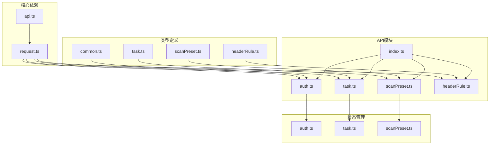

**Diagram sources**
- [index.ts](file://src/frontEnd/src/api/index.ts)
- [task.ts](file://src/frontEnd/src/api/task.ts)
- [scanPreset.ts](file://src/frontEnd/src/api/scanPreset.ts)
- [headerRule.ts](file://src/frontEnd/src/api/headerRule.ts)
- [request.ts](file://src/frontEnd/src/api/request.ts)
- [api.ts](file://src/frontEnd/src/types/api.ts)
- [task.ts](file://src/frontEnd/src/types/task.ts)
- [scanPreset.ts](file://src/frontEnd/src/types/scanPreset.ts)
- [headerRule.ts](file://src/frontEnd/src/types/headerRule.ts)
- [auth.ts](file://src/frontEnd/src/stores/auth.ts)
- [task.ts](file://src/frontEnd/src/stores/task.ts)
- [scanPreset.ts](file://src/frontEnd/src/stores/scanPreset.ts)

## API模块化组织

API服务采用模块化组织方式，每个功能模块独立封装，通过`index.ts`文件统一导出，实现清晰的模块边界和依赖管理。

```mermaid
classDiagram
class ApiService {
<<abstract>>
+request : AxiosInstance
}
class AuthApi {
+login(data : LoginRequest) : Promise~LoginResponse~
+refreshToken() : Promise~{token : string}~
+getVersion() : Promise~{version : string}~
+checkAuthRequired() : Promise~{required : boolean}~
}
class TaskApi {
+getTaskList() : Promise~Task[]~
+addTask(taskData : Partial~Task~) : Promise~{engineid : number; taskid : string}~
+deleteTask(taskId : string) : Promise~void~
+stopTask(taskId : string) : Promise~void~
+findTaskByUrl(urlPath : string) : Promise~Task[]~
+getTaskLogs(taskId : string) : Promise~string[]~
+batchDeleteTasks(taskIds : string[]) : Promise~void~
+batchStopTasks(taskIds : string[]) : Promise~void~
+flushTasks() : Promise~void~
+getScanOptions(taskId : string) : Promise~any~
+getHttpRequestInfo(taskId : string) : Promise~any~
+getPayloadDetail(taskId : string) : Promise~PayloadEntry[]~
}
class ScanPresetApi {
+getAllPresets(includeInactive : boolean) : Promise~ScanPresetListResponse~
+getConfigOptions() : Promise~ConfigOptionsResponse~
+getDefaultPreset() : Promise~ScanPreset | null~
+updateDefaultPreset(options : ScanOptions) : Promise~ScanPreset | null~
+getPresetConfigs() : Promise~ScanPreset[]~
+getHistoryConfigs(limit : number) : Promise~ScanPreset[]~
+getPresetById(presetId : number) : Promise~ScanPreset | null~
+createPreset(data : ScanPresetCreate) : Promise~ScanPreset | null~
+updatePreset(presetId : number, data : ScanPresetUpdate) : Promise~ScanPreset | null~
+deletePreset(presetId : number) : Promise~boolean~
+addToHistory(name : string, options : ScanOptions) : Promise~ScanPreset | null~
+applyPreset(presetId : number, baseOptions? : ScanOptions) : Promise~ScanOptions~
}
class HeaderRuleApi {
+getPersistentRules(activeOnly : boolean) : Promise~any~
+getPersistentRuleById(ruleId : number) : Promise~any~
+createPersistentRule(rule : PersistentHeaderRuleCreate) : Promise~any~
+updatePersistentRule(ruleId : number, rule : PersistentHeaderRuleUpdate) : Promise~any~
+deletePersistentRule(ruleId : number) : Promise~any~
+setSessionHeaders(headers : SessionHeaderBatchCreate) : Promise~any~
+getSessionHeaders() : Promise~any~
+deleteSessionHeader(headerName : string) : Promise~any~
+updateSessionHeader(headerName : string, header : Partial~any~) : Promise~any~
+clearSessionHeaders() : Promise~any~
+previewHeaderProcessing(previewData : HeaderPreviewRequest) : Promise~any~
+getHeaderManagementStats() : Promise~any~
}
ApiService <|-- AuthApi
ApiService <|-- TaskApi
ApiService <|-- ScanPresetApi
ApiService <|-- HeaderRuleApi
```

**Diagram sources**
- [auth.ts](file://src/frontEnd/src/api/auth.ts)
- [task.ts](file://src/frontEnd/src/api/task.ts)
- [scanPreset.ts](file://src/frontEnd/src/api/scanPreset.ts)
- [headerRule.ts](file://src/frontEnd/src/api/headerRule.ts)

### 统一导出机制

API模块通过`index.ts`文件实现统一导出，简化了导入路径，提高了代码的可维护性。

```typescript
/**
 * API统一导出
 */
export * from './auth'
export * from './task'
export * from './headerRule'
export { request } from './request'
```

这种设计模式使得其他模块可以统一从`@/api`路径导入所需的服务，而不需要关心具体的文件位置。

**Section sources**
- [index.ts](file://src/frontEnd/src/api/index.ts)

### 依赖注入模式

API服务与Pinia状态管理Store之间形成了依赖注入模式，API方法被注入到各个Store中，由Store负责调用和状态管理。

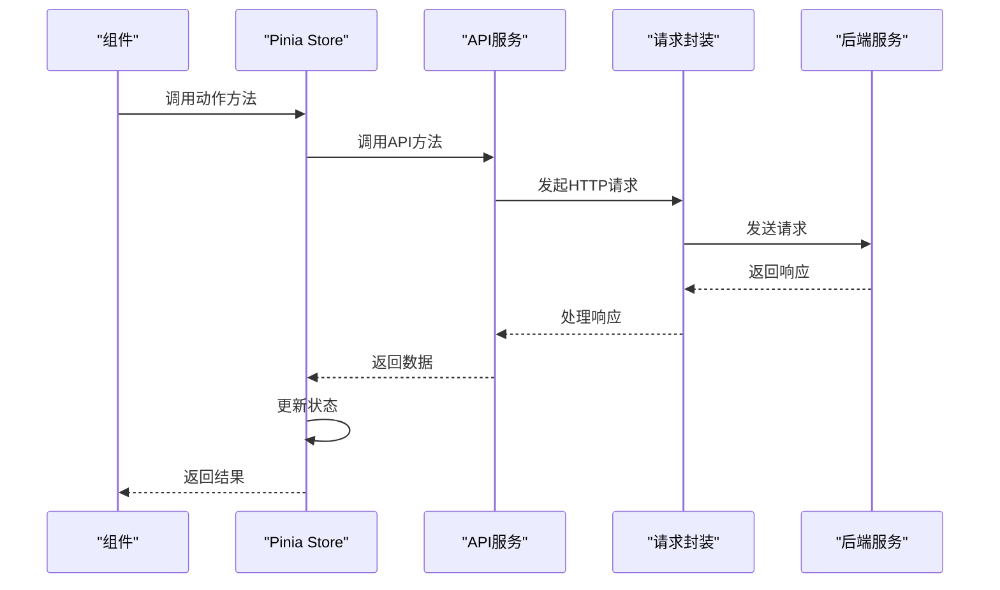

**Diagram sources**
- [task.ts](file://src/frontEnd/src/stores/task.ts)
- [task.ts](file://src/frontEnd/src/api/task.ts)
- [request.ts](file://src/frontEnd/src/api/request.ts)

## 类型安全设计

项目通过TypeScript接口定义确保了API服务的类型安全，从前端到后端的数据交互都有明确的类型约束。

### 任务模块类型定义

任务模块定义了完整的类型体系，包括任务状态枚举、任务接口、筛选条件、统计数据等。

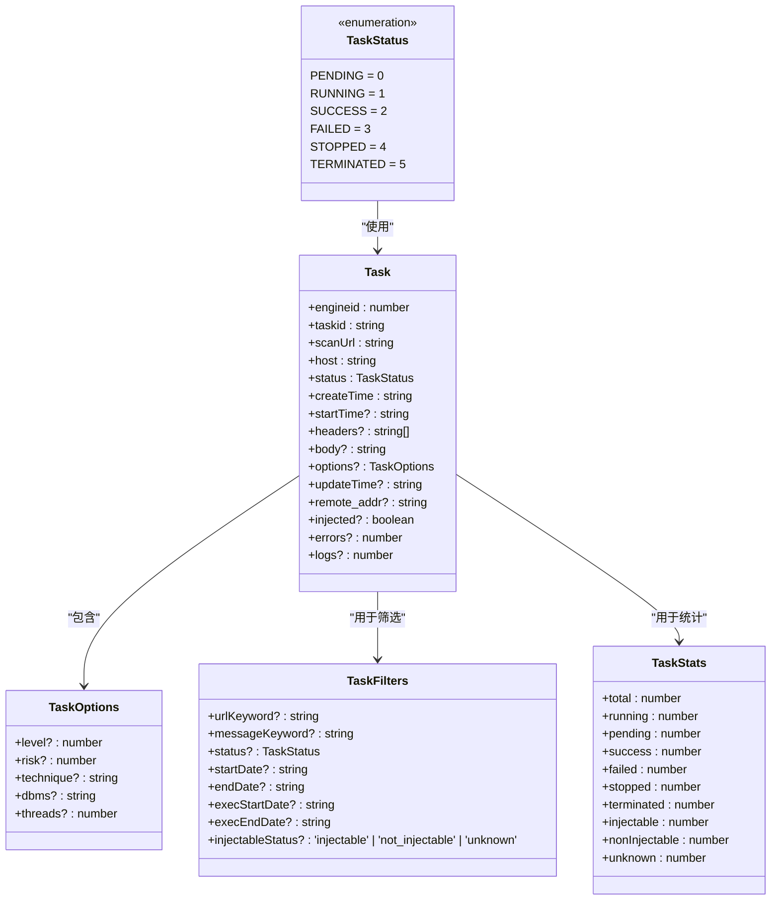

**Diagram sources**
- [task.ts](file://src/frontEnd/src/types/task.ts)

### 扫描预设类型定义

扫描预设模块定义了丰富的类型，包括扫描选项、预设配置、创建/更新请求等。

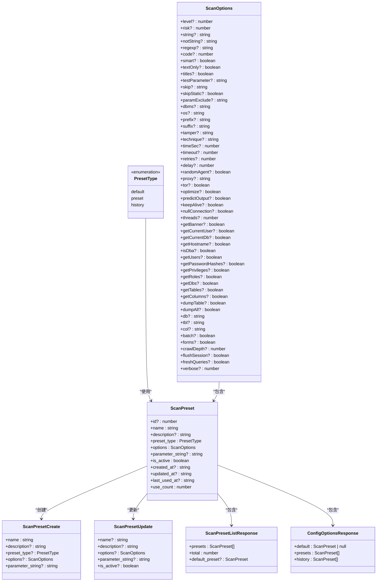

**Diagram sources**
- [scanPreset.ts](file://src/frontEnd/src/types/scanPreset.ts)

### 请求头规则类型定义

请求头规则模块定义了作用域配置、替换策略枚举、持久化规则等类型。

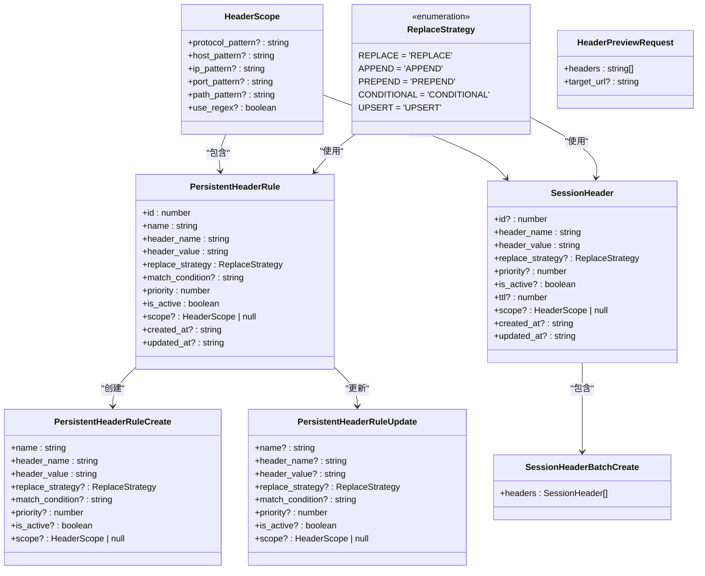

**Diagram sources**
- [headerRule.ts](file://src/frontEnd/src/types/headerRule.ts)

### 基础响应类型

定义了统一的API响应基础结构，确保所有API响应都有统一的格式。

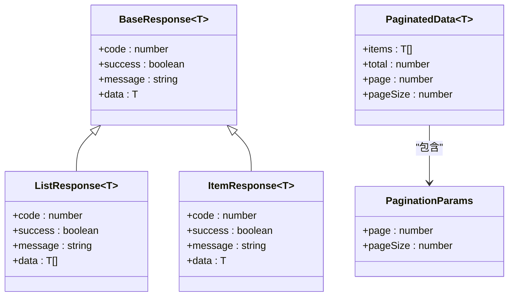

**Diagram sources**
- [api.ts](file://src/frontEnd/src/types/api.ts)

## HTTP方法封装

API服务对HTTP方法进行了封装，提供了简洁的调用接口，同时处理了请求参数和响应数据的转换。

### 请求方法封装

`request.ts`文件封装了Axios实例，提供了GET、POST、PUT、PATCH、DELETE等HTTP方法的封装。

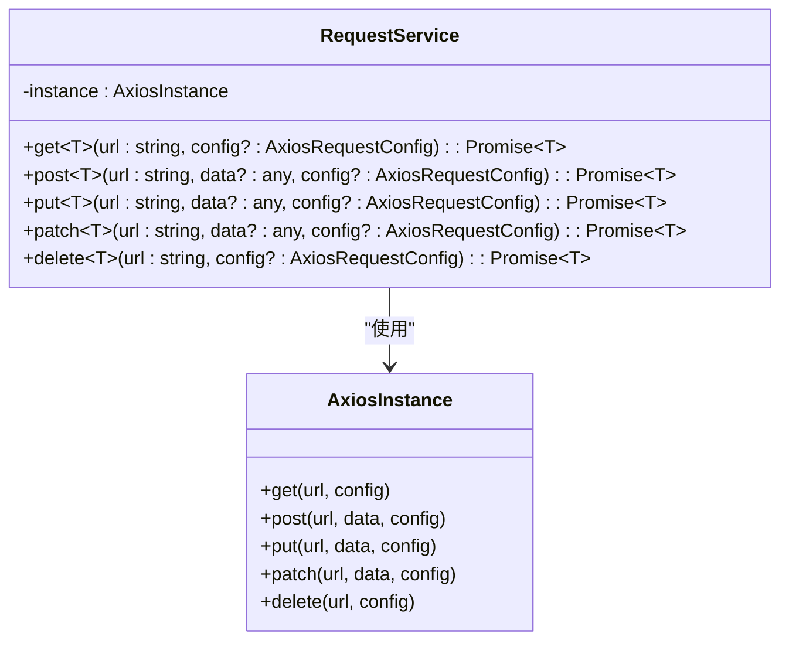

**Diagram sources**
- [request.ts](file://src/frontEnd/src/api/request.ts)

### 认证相关API

认证模块封装了用户登录、刷新令牌、获取系统版本等API方法。

```mermaid
classDiagram
class AuthApi {
+login(data : LoginRequest) : Promise~LoginResponse~
+refreshToken() : Promise~{token : string}~
+getVersion() : Promise~{version : string}~
+checkAuthRequired() : Promise~{required : boolean}~
}
class LoginRequest {
+username : string
+password : string
}
class LoginResponse {
+token : string
+userInfo : UserInfo
}
AuthApi --> LoginRequest : "使用"
AuthApi --> LoginResponse : "返回"
```

**Diagram sources**
- [auth.ts](file://src/frontEnd/src/api/auth.ts)

### 任务相关API

任务模块封装了任务的增删改查、批量操作、获取日志等API方法。

```mermaid
classDiagram
class TaskApi {
+getTaskList() : Promise~Task[]~
+addTask(taskData : Partial~Task~) : Promise~{engineid : number; taskid : string}~
+deleteTask(taskId : string) : Promise~void~
+stopTask(taskId : string) : Promise~void~
+findTaskByUrl(urlPath : string) : Promise~Task[]~
+getTaskLogs(taskId : string) : Promise~string[]~
+batchDeleteTasks(taskIds : string[]) : Promise~void~
+batchStopTasks(taskIds : string[]) : Promise~void~
+flushTasks() : Promise~void~
+getScanOptions(taskId : string) : Promise~any~
+getHttpRequestInfo(taskId : string) : Promise~any~
+getPayloadDetail(taskId : string) : Promise~PayloadEntry[]~
}
TaskApi --> Task : "使用"
TaskApi --> PayloadEntry : "返回"
```

**Diagram sources**
- [task.ts](file://src/frontEnd/src/api/task.ts)

### 扫描预设相关API

扫描预设模块封装了预设配置的增删改查、获取配置选项、应用预设等API方法。

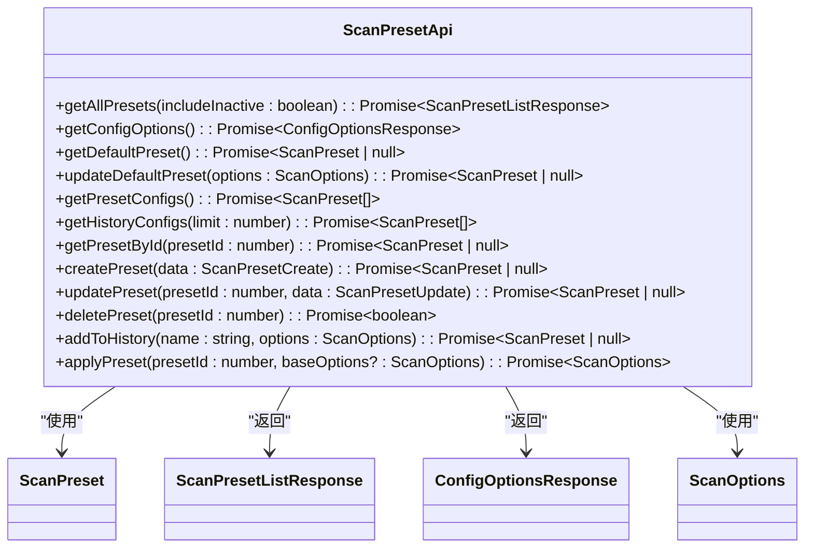

**Diagram sources**
- [scanPreset.ts](file://src/frontEnd/src/api/scanPreset.ts)

### 请求头规则相关API

请求头规则模块封装了持久化规则和会话性请求头的增删改查、预览处理等API方法。

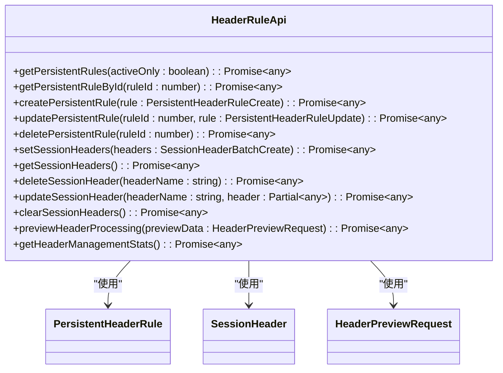

**Diagram sources**
- [headerRule.ts](file://src/frontEnd/src/api/headerRule.ts)

## API与状态管理集成

API服务与Pinia状态管理Store紧密集成，实现了数据流的单向流动和状态的集中管理。

### 认证状态管理

认证Store管理用户认证状态，包括Token、用户信息、访问模式等，并提供登录、登出等操作。

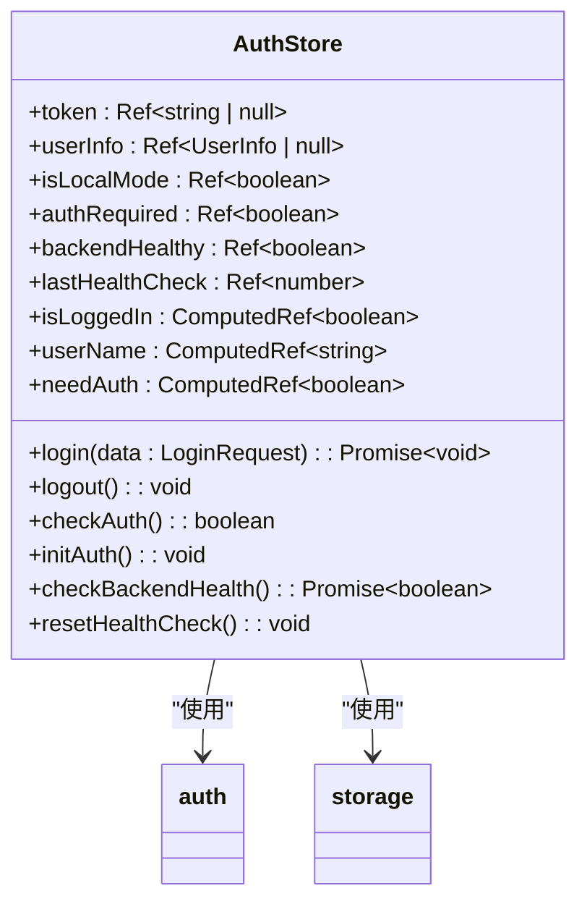

**Diagram sources**
- [auth.ts](file://src/frontEnd/src/stores/auth.ts)

### 任务状态管理

任务Store管理任务列表、当前任务、筛选条件、排序配置等状态，并提供获取任务列表、创建任务、删除任务等操作。

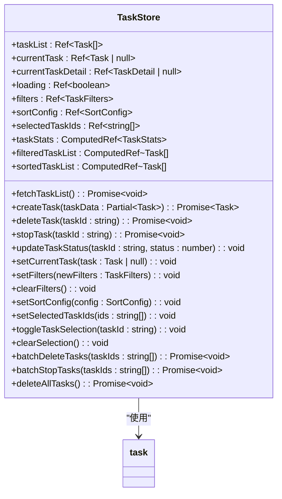

**Diagram sources**
- [task.ts](file://src/frontEnd/src/stores/task.ts)

### 扫描预设状态管理

扫描预设Store管理预设配置列表、当前选项、选中的预设ID等状态，并提供加载配置、选择预设、更新选项等操作。

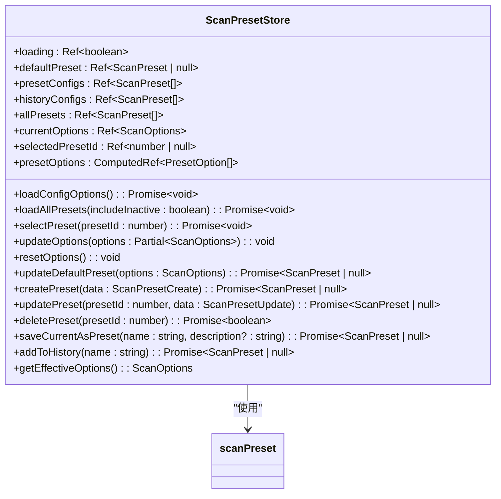

**Diagram sources**
- [scanPreset.ts](file://src/frontEnd/src/stores/scanPreset.ts)

## 错误处理契约

API服务通过请求拦截器和响应拦截器实现了统一的错误处理契约，确保错误信息能够被正确处理和展示。

### 请求拦截器

请求拦截器在发送请求前添加认证Token和通用请求头。

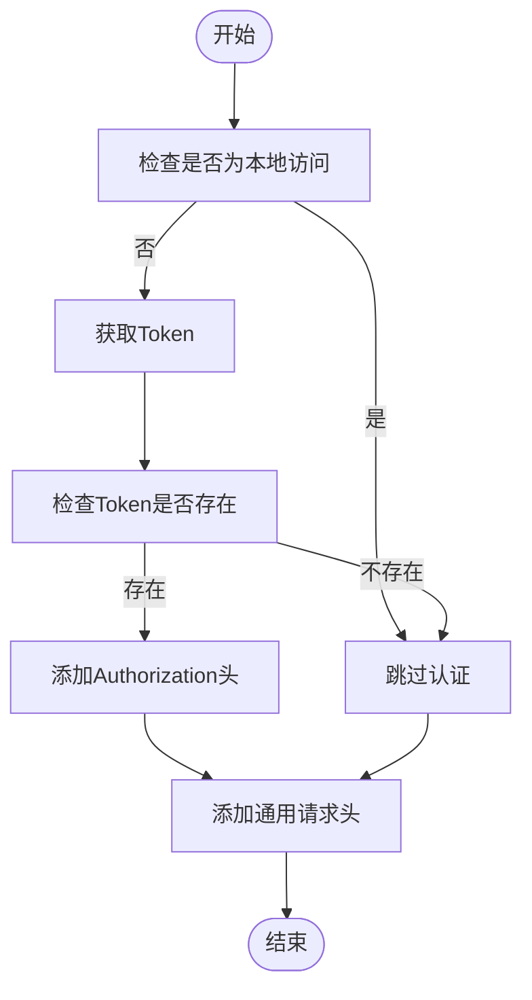

**Diagram sources**
- [request.ts](file://src/frontEnd/src/api/request.ts#L94-L119)

### 响应拦截器

响应拦截器处理响应数据和错误，实现重试机制和错误提示。

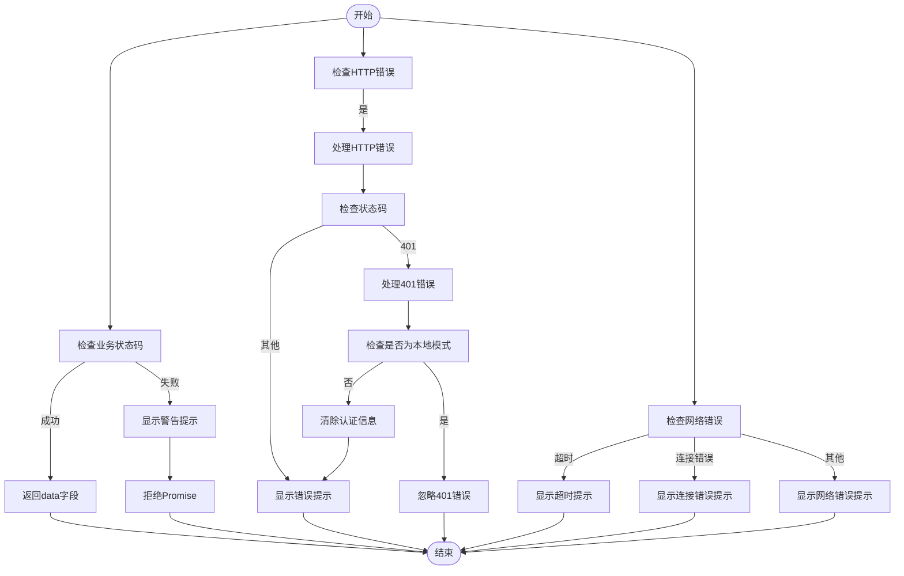

**Diagram sources**
- [request.ts](file://src/frontEnd/src/api/request.ts#L120-L204)

### 重试机制

API服务实现了智能重试机制，针对特定的HTTP状态码和网络错误进行重试。

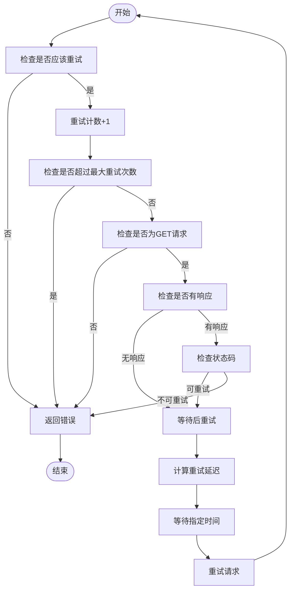

**Diagram sources**
- [request.ts](file://src/frontEnd/src/api/request.ts#L66-L92)

## API版本管理

项目通过环境变量和配置文件实现了API版本管理，确保向前兼容性。

### 环境变量配置

API基础URL通过环境变量配置，支持不同环境的部署。

```typescript
// 创建axios实例
const instance: AxiosInstance = axios.create({
  baseURL: import.meta.env.VITE_API_BASE_URL || '/api',
  timeout: 30000,
  headers: {
    'Content-Type': 'application/json',
  },
})
```

这种设计使得API服务可以在不同环境中使用不同的基础URL，而不需要修改代码。

**Section sources**
- [request.ts](file://src/frontEnd/src/api/request.ts#L48-L55)

### 向后兼容性处理

API服务通过字段映射和数据转换确保了向前兼容性，能够处理后端可能返回的不同格式的数据。

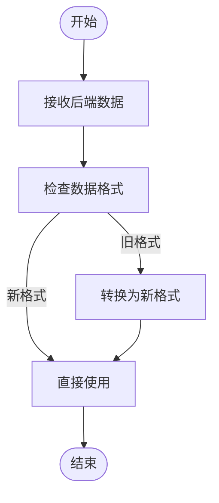

例如，在任务模块中，后端可能返回字符串或数字状态，前端通过`mapBackendStatus`函数将其映射为统一的枚举值：

```typescript
function mapBackendStatus(status: string | number): TaskStatus {
  // 如果已经是数字，直接返回
  if (typeof status === 'number') {
    return status as TaskStatus
  }
  
  // 字符串状态映射
  const statusMap: Record<string, TaskStatus> = {
    'New': TaskStatus.PENDING,
    'Pending': TaskStatus.PENDING,
    'Running': TaskStatus.RUNNING,
    'Runnable': TaskStatus.RUNNING,
    'Blocked': TaskStatus.RUNNING,
    'Terminated': TaskStatus.TERMINATED,
    'Success': TaskStatus.SUCCESS,
    'Completed': TaskStatus.SUCCESS,
    'Failed': TaskStatus.FAILED,
    'Error': TaskStatus.FAILED,
    'Stopped': TaskStatus.STOPPED,
  }
  
  // 大小写不敏感匹配
  const normalizedStatus = Object.keys(statusMap).find(
    key => key.toLowerCase() === status.toLowerCase()
  )
  
  if (normalizedStatus && statusMap[normalizedStatus] !== undefined) {
    return statusMap[normalizedStatus] as TaskStatus
  }
  
  // 默认返回 PENDING
  console.warn(`Unknown task status: ${status}, defaulting to PENDING`)
  return TaskStatus.PENDING
}
```

**Section sources**
- [task.ts](file://src/frontEnd/src/api/task.ts#L68-L101)