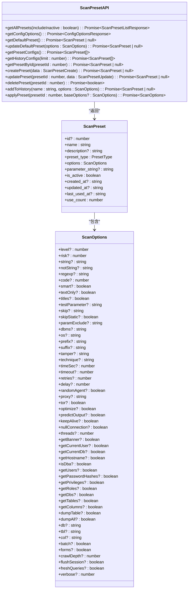
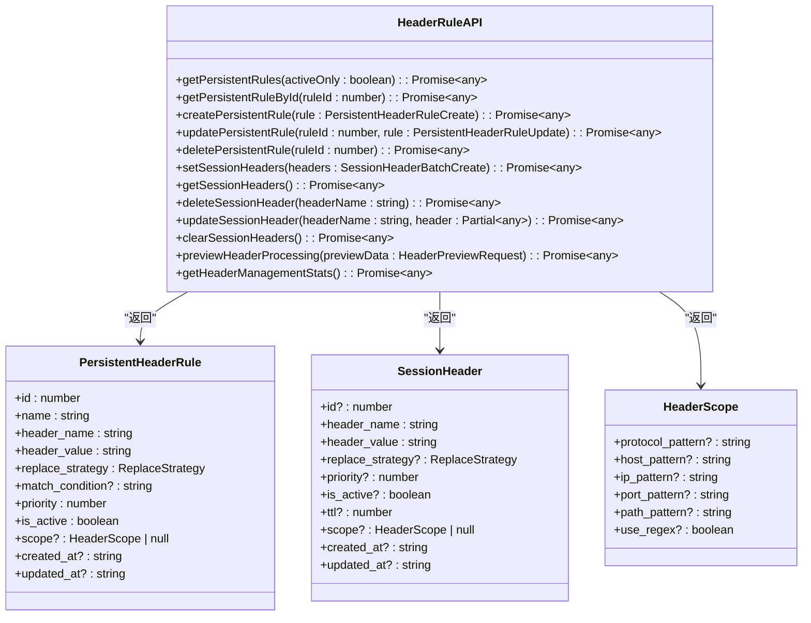
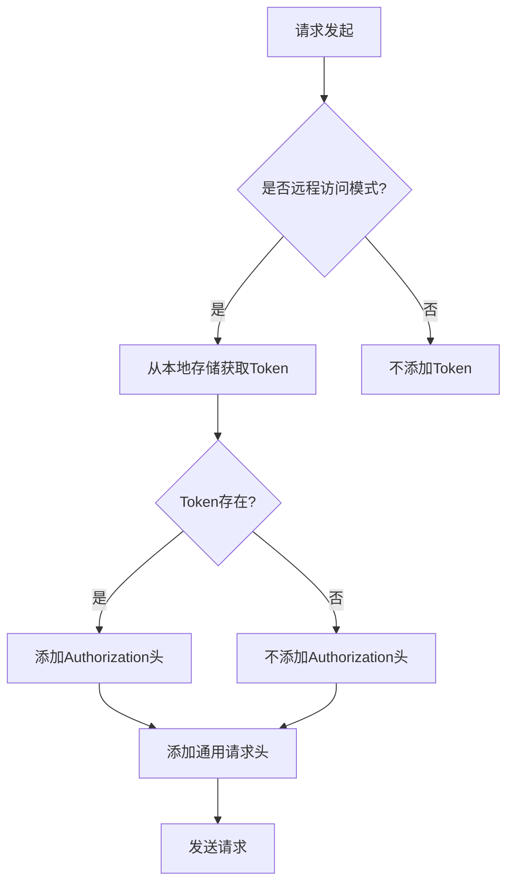
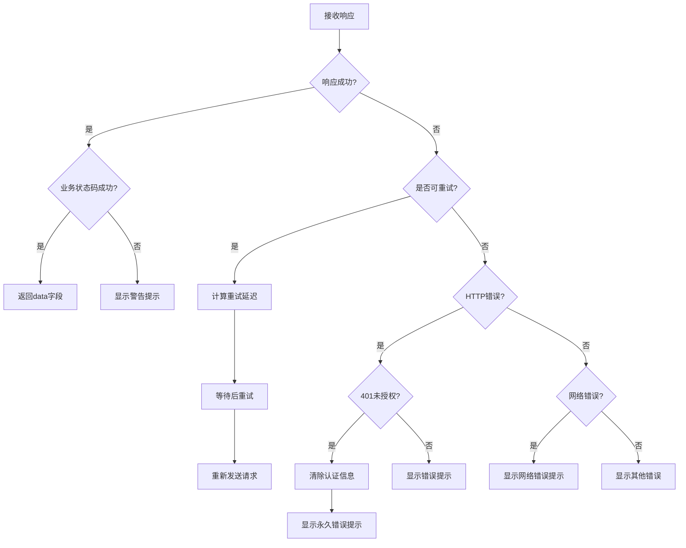
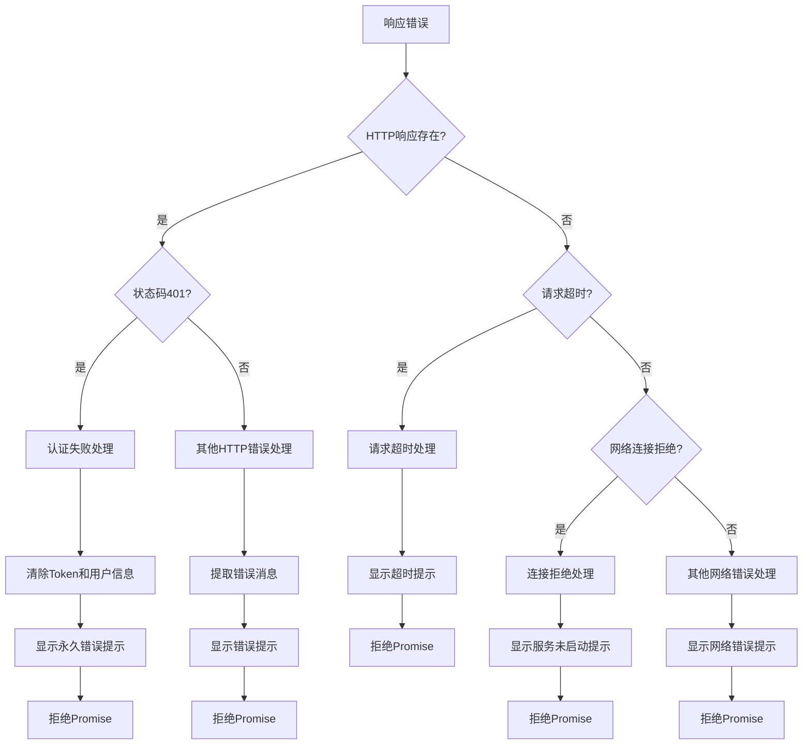
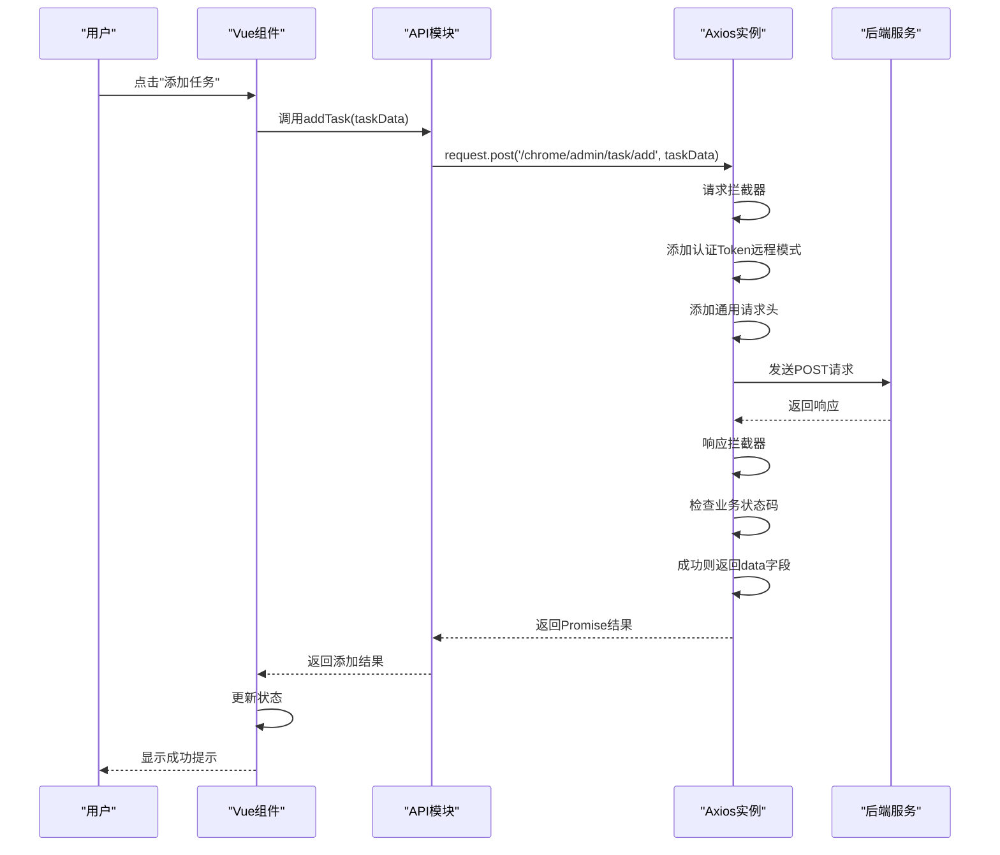

# API调用

<cite>
**本文档引用文件**   
- [request.ts](file://src/frontEnd/src/api/request.ts)
- [task.ts](file://src/frontEnd/src/api/task.ts)
- [scanPreset.ts](file://src/frontEnd/src/api/scanPreset.ts)
- [headerRule.ts](file://src/frontEnd/src/api/headerRule.ts)
- [auth.ts](file://src/frontEnd/src/api/auth.ts)
- [index.ts](file://src/frontEnd/src/api/index.ts)
- [api.ts](file://src/frontEnd/src/types/api.ts)
- [task.ts](file://src/frontEnd/src/types/task.ts)
- [scanPreset.ts](file://src/frontEnd/src/types/scanPreset.ts)
- [headerRule.ts](file://src/frontEnd/src/types/headerRule.ts)
- [authController.py](file://src/backEnd/api/commonApi/authController.py)
- [scanPreset.py](file://src/backEnd/api/commonApi/scanPreset.py)
- [headerController.py](file://src/backEnd/api/commonApi/headerController.py)
- [webTaskController.py](file://src/backEnd/api/commonApi/webTaskController.py)
- [mockData.ts](file://src/frontEnd/src/utils/mockData.ts)
</cite>

## 目录
1. [API集成方案](#api集成方案)
2. [API服务层设计模式](#api服务层设计模式)
3. [Axios实例配置](#axios实例配置)
4. [请求参数序列化与响应解构](#请求参数序列化与响应解构)
5. [错误处理机制](#错误处理机制)
6. [类型安全实现](#类型安全实现)
7. [API调用序列图](#api调用序列图)
8. [代码示例](#代码示例)

## API集成方案

本项目采用前后端分离架构，前端通过RESTful API与后端进行通信。API调用方案基于Axios库实现，通过模块化封装提供统一的API访问接口。前端API模块位于`src/frontEnd/src/api`目录下，包括`task`、`scanPreset`、`headerRule`和`auth`等核心模块，每个模块封装了特定业务功能的API调用。

API调用遵循统一的响应格式，由`BaseResponse`接口定义，包含`code`、`success`、`message`和`data`四个字段。前端通过拦截器自动处理认证、错误提示和数据转换，确保API调用的一致性和可靠性。

**API模块结构**
- `task.ts`: 任务管理相关API
- `scanPreset.ts`: 扫描预设配置相关API
- `headerRule.ts`: 请求头规则管理相关API
- `auth.ts`: 认证相关API
- `request.ts`: Axios实例和拦截器配置
- `index.ts`: API统一导出

**Section sources**
- [index.ts](file://src/frontEnd/src/api/index.ts#L1-L8)
- [api.ts](file://src/frontEnd/src/types/api.ts#L1-L28)

## API服务层设计模式

API服务层采用模块化设计模式，将不同业务功能的API调用封装在独立的模块中。每个API模块遵循一致的设计原则：导出命名函数而非默认导出，使用TypeScript接口定义请求和响应类型，提供清晰的函数文档。

### task模块
`task`模块封装了任务管理的所有API调用，包括获取任务列表、添加任务、删除任务、停止任务等。该模块实现了后端字段名到前端字段名的转换，如将`task_id`转换为`taskid`，`create_datetime`转换为`createTime`。

```mermaid
classDiagram
class TaskAPI {
+getTaskList() : Promise~Task[]~
+addTask(taskData : Partial~Task~) : Promise~{engineid : number, taskid : string}~
+deleteTask(taskId : string) : Promise~void~
+stopTask(taskId : string) : Promise~void~
+findTaskByUrl(urlPath : string) : Promise~Task[]~
+getTaskLogs(taskId : string) : Promise~string[]~
+batchDeleteTasks(taskIds : string[]) : Promise~void~
+batchStopTasks(taskIds : string[]) : Promise~void~
+flushTasks() : Promise~void~
+getScanOptions(taskId : string) : Promise~any~
+getHttpRequestInfo(taskId : string) : Promise~any~
+getPayloadDetail(taskId : string) : Promise~PayloadEntry[]~
}
class Task {
+engineid : number
+taskid : string
+scanUrl : string
+host : string
+status : TaskStatus
+createTime : string
+startTime? : string
+remote_addr? : string
+errors? : number
+logs? : number
+injected? : boolean
}
TaskAPI --> Task : "返回"
```

**Diagram sources **
- [task.ts](file://src/frontEnd/src/api/task.ts#L1-L800)
- [task.ts](file://src/frontEnd/src/types/task.ts#L1-L122)

### scanPreset模块
`scanPreset`模块管理扫描配置预设，支持获取所有预设、创建新预设、更新预设、删除预设等功能。该模块提供了丰富的配置选项，包括检测级别、风险级别、注入技术、数据库类型等。



**Diagram sources **
- [scanPreset.ts](file://src/frontEnd/src/api/scanPreset.ts#L1-L145)
- [scanPreset.ts](file://src/frontEnd/src/types/scanPreset.ts#L1-L199)

### headerRule模块
`headerRule`模块管理请求头规则，包括持久化规则和会话性请求头。该模块支持规则的增删改查、批量操作、预览功能和统计信息获取。



**Diagram sources **
- [headerRule.ts](file://src/frontEnd/src/api/headerRule.ts#L1-L421)
- [headerRule.ts](file://src/frontEnd/src/types/headerRule.ts#L1-L106)

### auth模块
`auth`模块处理认证相关API，包括用户登录、刷新访问令牌、获取系统版本和检查认证需求。

```mermaid
classDiagram
class AuthAPI {
+login(data : LoginRequest) : Promise~LoginResponse~
+refreshToken() : Promise~{token : string}~
+getVersion() : Promise~{version : string}~
+checkAuthRequired() : Promise~{required : boolean}~
}
class LoginRequest {
+username : string
+password : string
}
class LoginResponse {
+token : string
+expires_in : number
+user : dict
}
AuthAPI --> LoginRequest : "接收"
AuthAPI --> LoginResponse : "返回"
```

**Diagram sources **
- [auth.ts](file://src/frontEnd/src/api/auth.ts#L1-L34)
- [authController.py](file://src/backEnd/api/commonApi/authController.py#L1-L150)

## Axios实例配置

Axios实例在`request.ts`文件中创建和配置，包含基础URL、超时设置、请求/响应拦截器等关键配置。

### 基础配置
```typescript
const instance: AxiosInstance = axios.create({
  baseURL: import.meta.env.VITE_API_BASE_URL || '/api',
  timeout: 30000,
  headers: {
    'Content-Type': 'application/json',
  },
})
```

### 请求拦截器
请求拦截器负责添加认证Token和通用请求头。在远程访问模式下，从本地存储获取Token并添加到请求头中；在本地访问模式下，不添加Token。



**Diagram sources **
- [request.ts](file://src/frontEnd/src/api/request.ts#L48-L120)

### 响应拦截器
响应拦截器处理业务状态码、HTTP错误、网络错误和认证失败等场景。对于GET请求的网络错误或特定HTTP状态码，实现指数退避重试机制。



**Diagram sources **
- [request.ts](file://src/frontEnd/src/api/request.ts#L122-L204)

## 请求参数序列化与响应解构

### 请求参数序列化
API调用遵循RESTful规范，使用标准的HTTP方法和参数传递方式：
- GET请求：使用`params`选项传递查询参数
- POST/PUT/PATCH请求：使用`data`参数传递请求体
- DELETE请求：使用`params`选项传递查询参数

```typescript
// GET请求示例
request.get('/chrome/admin/task/logs/getLogsByTaskId', {
  params: { taskId },
})

// POST请求示例
request.post('/chrome/admin/task/add', taskData)

// DELETE请求示例
request.delete('/chrome/admin/task/delete', {
  params: { taskid: taskId },
})
```

### 响应数据解构
响应数据通过拦截器自动解构，将后端响应映射到前端状态。对于列表数据，转换后端字段名为前端字段名；对于单个对象，直接返回data字段。

```typescript
// 后端任务数据转换为前端格式
function transformBackendTask(backendTask: BackendTask): Task {
  return {
    engineid: backendTask.index,
    taskid: backendTask.task_id,
    scanUrl: backendTask.scanUrl,
    host: backendTask.host,
    status: mapBackendStatus(backendTask.status),
    createTime: backendTask.create_datetime || '',
    startTime: backendTask.start_datetime || undefined,
    remote_addr: backendTask.remote_addr,
    errors: backendTask.errors,
    logs: backendTask.logs,
    injected: backendTask.injected,
  }
}
```

**Section sources**
- [task.ts](file://src/frontEnd/src/api/task.ts#L106-L119)
- [request.ts](file://src/frontEnd/src/api/request.ts#L124-L138)

## 错误处理机制

错误处理机制通过响应拦截器实现，涵盖网络错误、认证失败和业务异常等场景。

### 统一错误处理流程


**Diagram sources **
- [request.ts](file://src/frontEnd/src/api/request.ts#L160-L203)

### 重试机制
对于GET请求的网络错误或特定HTTP状态码（408, 500, 502, 503, 504），实现指数退避重试机制。

```typescript
// 重试配置
const RETRY_CONFIG = {
  maxRetries: 3,
  initialDelay: 1000,
  delayMultiplier: 2,
  maxDelay: 10000,
  retryableStatusCodes: [408, 500, 502, 503, 504],
}

// 判断是否应该重试
function shouldRetry(error: AxiosError, retryCount: number): boolean {
  if (retryCount >= RETRY_CONFIG.maxRetries) {
    return false
  }
  
  if (error.config?.method?.toUpperCase() !== 'GET') {
    return false
  }
  
  if (!error.response) {
    return true
  }
  
  const status = error.response.status
  return RETRY_CONFIG.retryableStatusCodes.includes(status)
}
```

**Section sources**
- [request.ts](file://src/frontEnd/src/api/request.ts#L57-L86)

## 类型安全实现

项目通过TypeScript接口确保前后端数据契约的一致性，提供完整的类型定义和类型检查。

### 基础响应类型
```typescript
export interface BaseResponse<T = any> {
  code: number
  success: boolean
  message: string
  data: T
}
```

### 任务类型定义
```typescript
export interface Task {
  engineid: number
  taskid: string
  scanUrl: string
  host: string
  status: TaskStatus
  createTime: string
  startTime?: string
  headers?: string[]
  body?: string
  options?: TaskOptions
  updateTime?: string
  remote_addr?: string
  injected?: boolean
  errors?: number
  logs?: number
}
```

### 扫描选项类型定义
```typescript
export interface ScanOptions {
  level?: number
  risk?: number
  string?: string
  notString?: string
  regexp?: string
  code?: number
  smart?: boolean
  textOnly?: boolean
  titles?: boolean
  // ... 其他选项
}
```

### 请求头规则类型定义
```typescript
export interface PersistentHeaderRule {
  id: number
  name: string
  header_name: string
  header_value: string
  replace_strategy: ReplaceStrategy
  match_condition?: string
  priority: number
  is_active: boolean
  scope?: HeaderScope | null
  created_at?: string
  updated_at?: string
}
```

**Section sources**
- [api.ts](file://src/frontEnd/src/types/api.ts#L1-L28)
- [task.ts](file://src/frontEnd/src/types/task.ts#L1-L122)
- [scanPreset.ts](file://src/frontEnd/src/types/scanPreset.ts#L1-L199)
- [headerRule.ts](file://src/frontEnd/src/types/headerRule.ts#L1-L106)

## API调用序列图

以下序列图展示了从用户操作到API请求再到状态更新的完整流程：



**Diagram sources **
- [task.ts](file://src/frontEnd/src/api/task.ts#L143-L145)
- [request.ts](file://src/frontEnd/src/api/request.ts#L213-L215)
- [webTaskController.py](file://src/backEnd/api/commonApi/webTaskController.py#L19-L91)

## 代码示例

### API定义示例
```typescript
// task.ts
export async function getTaskList(): Promise<Task[]> {
  if (USE_MOCK_DATA) {
    await delay(MOCK_CONFIG.delay)
    return generateMockTasks(MOCK_CONFIG.count, MOCK_CONFIG.mode)
  }
  
  const result = await request.get<{ tasks: BackendTask[]; tasks_num: number }>('/chrome/admin/task/list')
  return (result.tasks || []).map(transformBackendTask)
}
```

### API调用方法示例
```typescript
// 在Vue组件中调用
import { getTaskList } from '@/api/task'

export default {
  async mounted() {
    try {
      const tasks = await getTaskList()
      this.taskList = tasks
    } catch (error) {
      // 错误已被拦截器处理，此处通常不需要额外处理
      console.error('获取任务列表失败:', error)
    }
  }
}
```

### 错误处理示例
```typescript
// 自定义错误处理（可选）
import { getTaskList } from '@/api/task'

export default {
  async loadTasks() {
    try {
      const tasks = await getTaskList()
      this.taskList = tasks
    } catch (error) {
      // 拦截器已处理通用错误，此处可处理特定业务逻辑
      if (error.message.includes('认证失败')) {
        this.$router.push('/login')
      } else {
        this.$message.error('加载任务失败')
      }
    }
  }
}
```

**Section sources**
- [task.ts](file://src/frontEnd/src/api/task.ts#L125-L138)
- [mockData.ts](file://src/frontEnd/src/utils/mockData.ts#L262-L304)
- [request.ts](file://src/frontEnd/src/api/request.ts#L209-L215)