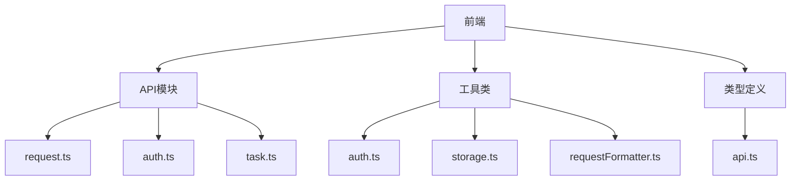
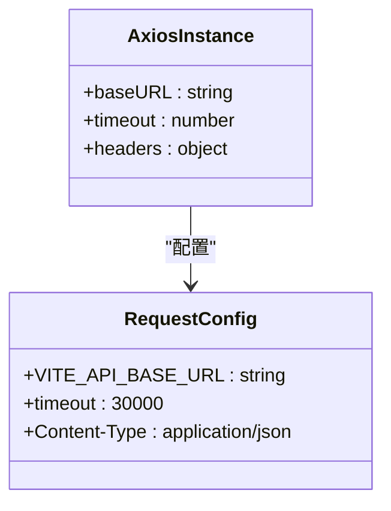
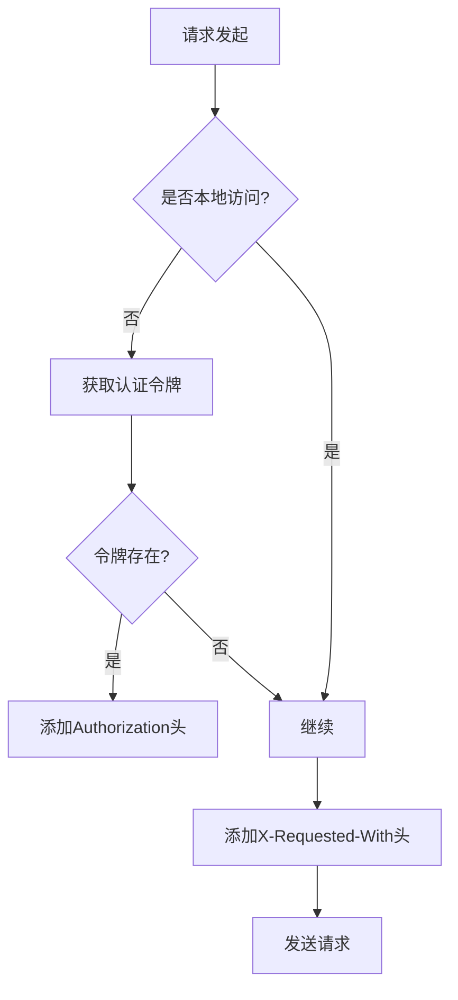
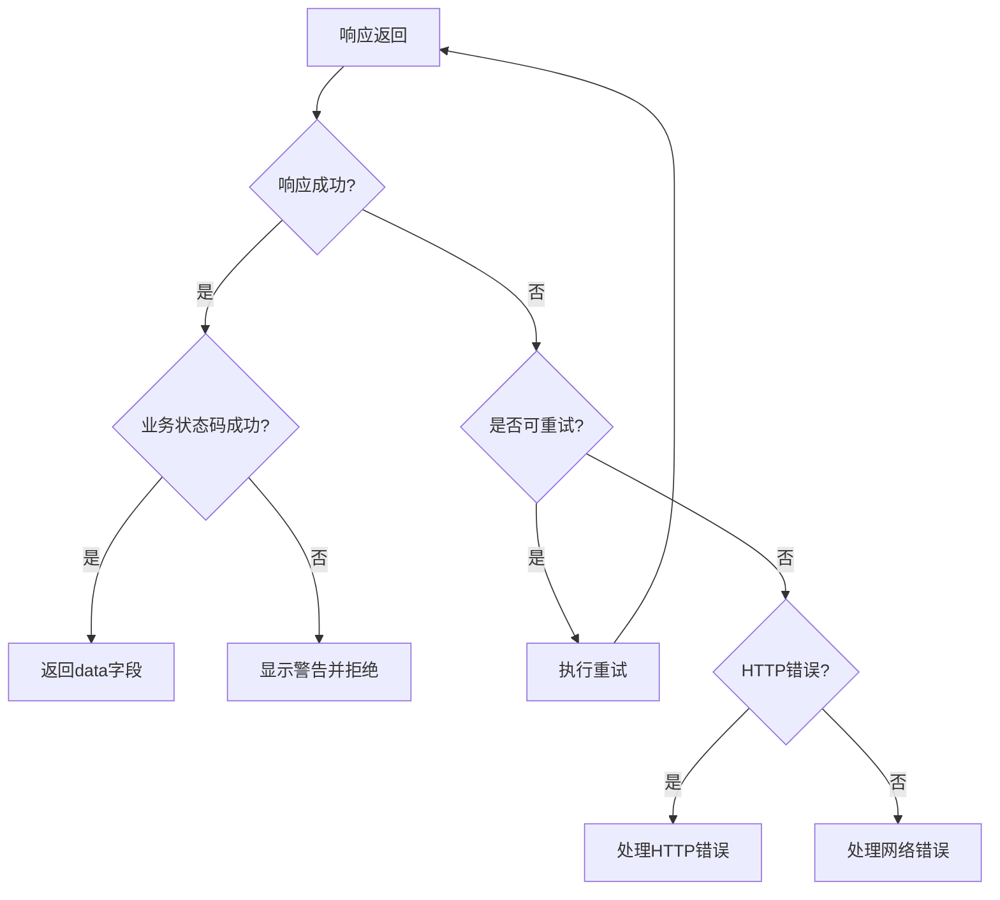
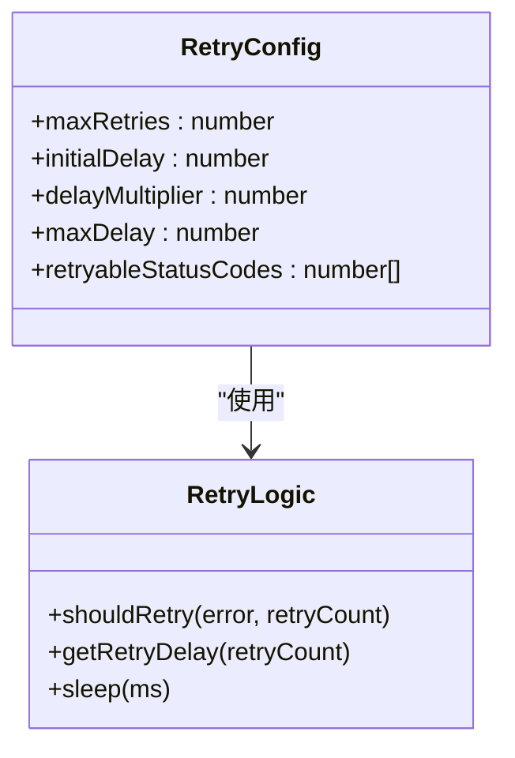
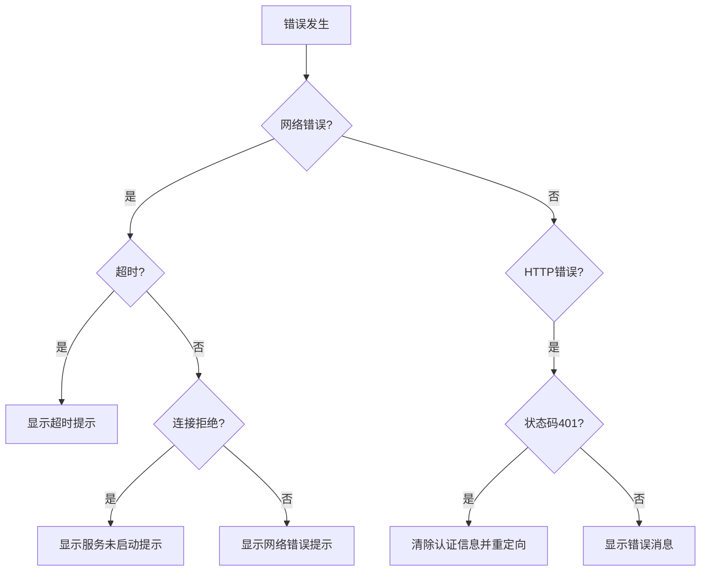
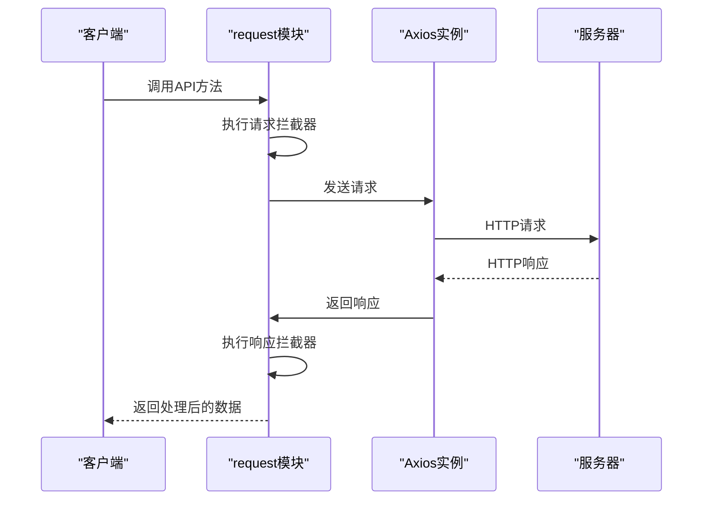
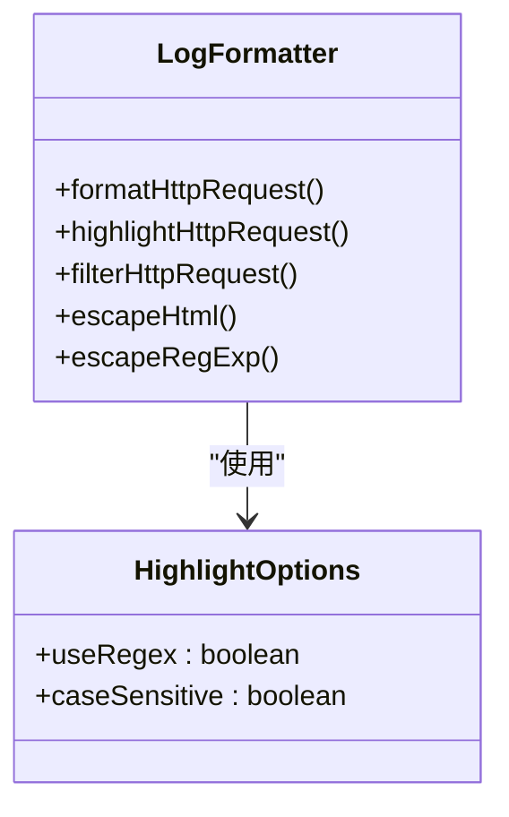
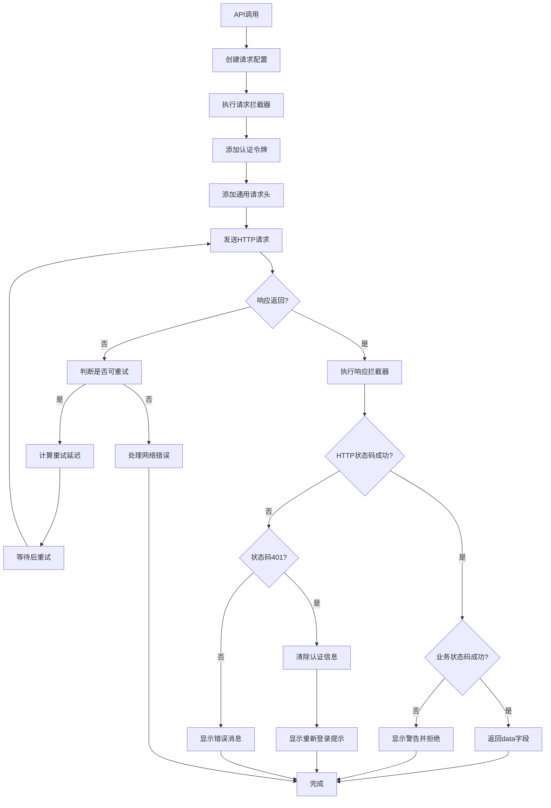

# 请求处理机制

<cite>
**本文档引用的文件**
- [request.ts](file://src/frontEnd/src/api/request.ts)
- [auth.ts](file://src/frontEnd/src/api/auth.ts)
- [task.ts](file://src/frontEnd/src/api/task.ts)
- [api.ts](file://src/frontEnd/src/types/api.ts)
- [auth.ts](file://src/frontEnd/src/utils/auth.ts)
- [storage.ts](file://src/frontEnd/src/utils/storage.ts)
- [requestFormatter.ts](file://src/frontEnd/src/utils/requestFormatter.ts)
</cite>

## 目录
1. [项目结构](#项目结构)
2. [核心组件](#核心组件)
3. [请求实例配置](#请求实例配置)
4. [请求拦截器](#请求拦截器)
5. [响应拦截器](#响应拦截器)
6. [重试策略](#重试策略)
7. [错误处理](#错误处理)
8. [API使用示例](#api使用示例)
9. [请求日志记录](#请求日志记录)
10. [请求处理流程图](#请求处理流程图)

## 项目结构



**图表来源**
- [request.ts](file://src/frontEnd/src/api/request.ts)
- [auth.ts](file://src/frontEnd/src/api/auth.ts)
- [task.ts](file://src/frontEnd/src/api/task.ts)
- [auth.ts](file://src/frontEnd/src/utils/auth.ts)
- [storage.ts](file://src/frontEnd/src/utils/storage.ts)
- [requestFormatter.ts](file://src/frontEnd/src/utils/requestFormatter.ts)
- [api.ts](file://src/frontEnd/src/types/api.ts)

**本节来源**
- [request.ts](file://src/frontEnd/src/api/request.ts)

## 核心组件

前端请求处理机制主要由以下几个核心组件构成：

1. **Axios实例**：封装了HTTP请求的基础配置
2. **请求拦截器**：在请求发送前进行预处理
3. **响应拦截器**：在响应返回后进行统一处理
4. **重试机制**：对失败的请求进行自动重试
5. **错误处理**：统一处理各种类型的错误
6. **认证管理**：处理用户认证相关的逻辑

这些组件共同构成了完整的请求处理流程，确保了前端与后端通信的稳定性和可靠性。

**本节来源**
- [request.ts](file://src/frontEnd/src/api/request.ts)

## 请求实例配置

请求实例通过Axios创建，包含了基础的配置项：



**图表来源**
- [request.ts](file://src/frontEnd/src/api/request.ts#L48-L55)

**本节来源**
- [request.ts](file://src/frontEnd/src/api/request.ts#L48-L55)

## 请求拦截器

请求拦截器在每个请求发送前执行，主要完成以下功能：

1. **认证令牌添加**：根据访问模式决定是否添加认证令牌
2. **通用请求头添加**：添加XMLHttpRequest标识
3. **请求参数预处理**



**图表来源**
- [request.ts](file://src/frontEnd/src/api/request.ts#L99-L119)

**本节来源**
- [request.ts](file://src/frontEnd/src/api/request.ts#L99-L119)

## 响应拦截器

响应拦截器处理所有返回的响应，实现统一的数据解包和错误处理：



**图表来源**
- [request.ts](file://src/frontEnd/src/api/request.ts#L123-L204)

**本节来源**
- [request.ts](file://src/frontEnd/src/api/request.ts#L123-L204)

## 重试策略

系统实现了智能的重试策略，确保在临时性故障时能够自动恢复：



重试策略的具体配置如下：

| 配置项 | 值 | 说明 |
|-------|-----|------|
| 最大重试次数 | 3 | 最多重试3次 |
| 初始延迟 | 1000ms | 第一次重试前等待1秒 |
| 延迟倍数 | 2 | 每次重试延迟时间翻倍 |
| 最大延迟 | 10000ms | 重试延迟不超过10秒 |
| 可重试状态码 | 408,500,502,503,504 | 特定HTTP状态码可重试 |

**图表来源**
- [request.ts](file://src/frontEnd/src/api/request.ts#L57-L64)

**本节来源**
- [request.ts](file://src/frontEnd/src/api/request.ts#L57-L97)

## 错误处理

系统实现了全面的错误处理机制，能够区分不同类型的错误并采取相应措施：



错误处理的主要类型包括：

1. **认证失败(401)**：清除本地存储的认证信息，显示重新登录提示
2. **请求超时**：显示超时提示，建议用户重试
3. **服务不可用**：提示用户检查后端服务是否启动
4. **业务错误**：显示具体的错误消息

**图表来源**
- [request.ts](file://src/frontEnd/src/api/request.ts#L140-L204)

**本节来源**
- [request.ts](file://src/frontEnd/src/api/request.ts#L140-L204)

## API使用示例

系统提供了统一的API调用方式，以下是一些典型的使用示例：



具体的API调用示例如下：

```typescript
// 登录请求
import { login } from '@/api/auth'

const loginData = {
  username: 'admin',
  password: 'password'
}

try {
  const response = await login(loginData)
  // 处理成功响应
} catch (error) {
  // 处理错误
}
```

**图表来源**
- [request.ts](file://src/frontEnd/src/api/request.ts)
- [auth.ts](file://src/frontEnd/src/api/auth.ts)

**本节来源**
- [request.ts](file://src/frontEnd/src/api/request.ts)
- [auth.ts](file://src/frontEnd/src/api/auth.ts)

## 请求日志记录

系统集成了请求日志记录功能，用于调试和监控：



日志记录功能支持：

1. **HTTP请求格式化**：将请求信息格式化为可读的文本
2. **语法高亮**：对请求行、请求头、请求体进行不同颜色的高亮显示
3. **关键词搜索**：支持正则表达式和大小写敏感的关键词搜索
4. **行号显示**：显示每行的行号，便于定位

**图表来源**
- [requestFormatter.ts](file://src/frontEnd/src/utils/requestFormatter.ts)

**本节来源**
- [requestFormatter.ts](file://src/frontEnd/src/utils/requestFormatter.ts)

## 请求处理流程图

完整的请求处理流程如下：



该流程图展示了从API调用到最终响应的完整生命周期，涵盖了请求拦截、响应处理、重试机制和错误处理等关键环节。

**图表来源**
- [request.ts](file://src/frontEnd/src/api/request.ts)

**本节来源**
- [request.ts](file://src/frontEnd/src/api/request.ts)