# 前端架构

<cite>
**本文档引用的文件**  
- [package.json](file://src/frontEnd/package.json)
- [vite.config.ts](file://src/frontEnd/vite.config.ts)
- [main.ts](file://src/frontEnd/src/main.ts)
- [App.vue](file://src/frontEnd/src/App.vue)
- [Layout.vue](file://src/frontEnd/src/views/Layout.vue)
- [router/index.ts](file://src/frontEnd/src/router/index.ts)
- [router/guards.ts](file://src/frontEnd/src/router/guards.ts)
- [stores/index.ts](file://src/frontEnd/src/stores/index.ts)
- [stores/auth.ts](file://src/frontEnd/src/stores/auth.ts)
- [stores/task.ts](file://src/frontEnd/src/stores/task.ts)
- [stores/config.ts](file://src/frontEnd/src/stores/config.ts)
- [api/index.ts](file://src/frontEnd/src/api/index.ts)
- [api/request.ts](file://src/frontEnd/src/api/request.ts)
- [types/common.ts](file://src/frontEnd/src/types/common.ts)
- [types/api.ts](file://src/frontEnd/src/types/api.ts)
- [types/task.ts](file://src/frontEnd/src/types/task.ts)
- [utils/auth.ts](file://src/frontEnd/src/utils/auth.ts)
- [utils/storage.ts](file://src/frontEnd/src/utils/storage.ts)
</cite>

## 目录
1. [项目结构](#项目结构)
2. [技术栈概述](#技术栈概述)
3. [组件化设计模式](#组件化设计模式)
4. [Pinia状态管理](#pinia状态管理)
5. [Vue Router路由配置](#vue-router路由配置)
6. [Vite构建工具优化](#vite构建工具优化)
7. [TypeScript类型系统应用](#typescript类型系统应用)

## 项目结构

根据项目目录结构，前端代码位于`src/frontEnd`目录下，采用典型的Vue 3 + TypeScript项目组织方式。项目结构清晰地划分了不同类型的文件和模块，便于维护和扩展。

```mermaid
graph TB
subgraph "src/frontEnd"
subgraph "src"
subgraph "api"
api["auth.ts<br>task.ts<br>headerRule.ts<br>request.ts"]
end
subgraph "assets"
assets["styles/<br>images/"]
end
subgraph "components"
components["GuidedParamEditor.vue<br>HttpCodeEditor.vue<br>TaskFilter.vue"]
end
subgraph "router"
router["index.ts<br>guards.ts"]
end
subgraph "stores"
stores["auth.ts<br>task.ts<br>config.ts"]
end
subgraph "types"
types["common.ts<br>api.ts<br>task.ts<br>headerRule.ts"]
end
subgraph "utils"
utils["auth.ts<br>storage.ts<br>useSmartPolling.ts"]
end
subgraph "views"
views["Home/index.vue<br>TaskList/index.vue<br>TaskDetail/index.vue<br>Config/index.vue"]
end
main["main.ts"]
App["App.vue"]
end
config["vite.config.ts"]
package["package.json"]
end
```

**图源**  
- [vite.config.ts](file://src/frontEnd/vite.config.ts)
- [package.json](file://src/frontEnd/package.json)

**本节来源**  
- [vite.config.ts](file://src/frontEnd/vite.config.ts)
- [package.json](file://src/frontEnd/package.json)

## 技术栈概述

sqlmapWebUI前端采用Vue 3 + TypeScript技术栈构建，结合了现代前端开发的最佳实践。项目使用Vite作为构建工具，提供了快速的开发服务器和高效的生产构建。状态管理采用Pinia，路由管理使用Vue Router 4，UI组件库采用PrimeVue。

项目依赖的主要技术栈包括：
- **Vue 3**: 使用Composition API和<script setup>语法糖
- **TypeScript**: 提供完整的类型安全和开发体验
- **Vite**: 作为构建工具和开发服务器
- **Pinia**: 状态管理库
- **Vue Router**: 路由管理
- **PrimeVue**: UI组件库
- **Axios**: HTTP客户端
- **Sass**: CSS预处理器

**本节来源**  
- [package.json](file://src/frontEnd/package.json)

## 组件化设计模式

项目采用组件化设计模式，将UI划分为不同类型的组件，包括视图组件、功能组件和UI组件。这种分层设计提高了代码的可维护性和复用性。

### 视图组件

视图组件位于`src/views`目录下，负责页面级别的布局和导航。每个视图组件通常对应一个路由，包含页面的主要结构和业务逻辑。

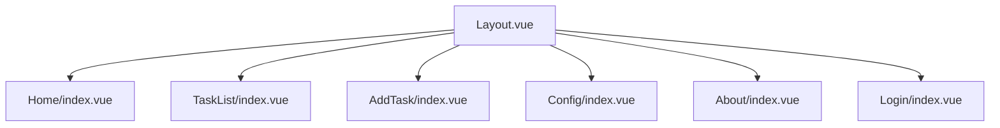

**图源**  
- [Layout.vue](file://src/frontEnd/src/views/Layout.vue)

**本节来源**  
- [Layout.vue](file://src/frontEnd/src/views/Layout.vue)

### 功能组件

功能组件位于`src/components`目录下，提供特定的业务功能。这些组件通常不直接与路由关联，而是被视图组件或其他组件引用。

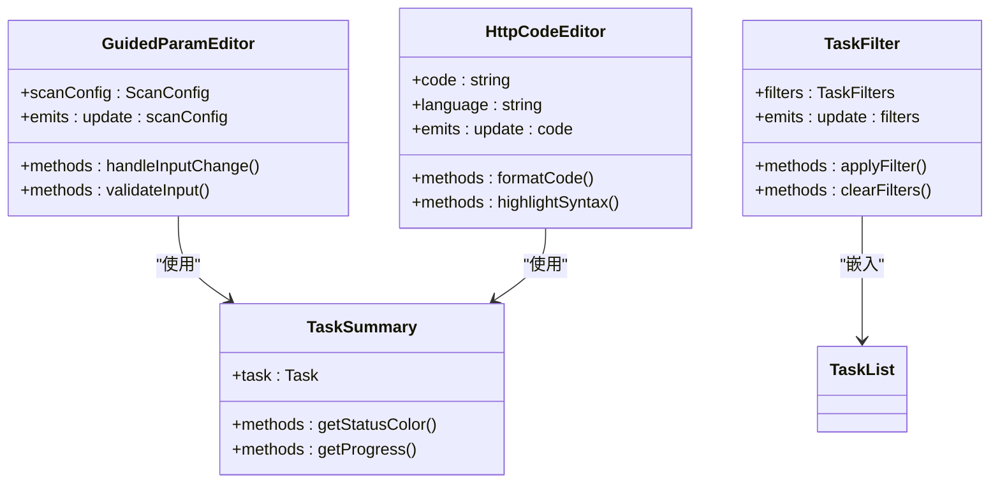

**图源**  
- [components/GuidedParamEditor.vue](file://src/frontEnd/src/components/GuidedParamEditor.vue)
- [components/HttpCodeEditor.vue](file://src/frontEnd/src/components/HttpCodeEditor.vue)
- [components/TaskFilter.vue](file://src/frontEnd/src/components/TaskFilter.vue)
- [components/TaskSummary.vue](file://src/frontEnd/src/components/TaskSummary.vue)

**本节来源**  
- [components/GuidedParamEditor.vue](file://src/frontEnd/src/components/GuidedParamEditor.vue)
- [components/HttpCodeEditor.vue](file://src/frontEnd/src/components/HttpCodeEditor.vue)
- [components/TaskFilter.vue](file://src/frontEnd/src/components/TaskFilter.vue)
- [components/TaskSummary.vue](file://src/frontEnd/src/components/TaskSummary.vue)

### UI组件

UI组件主要来自PrimeVue组件库，项目通过`unplugin-vue-components`插件实现了组件的自动导入，减少了手动导入的繁琐。

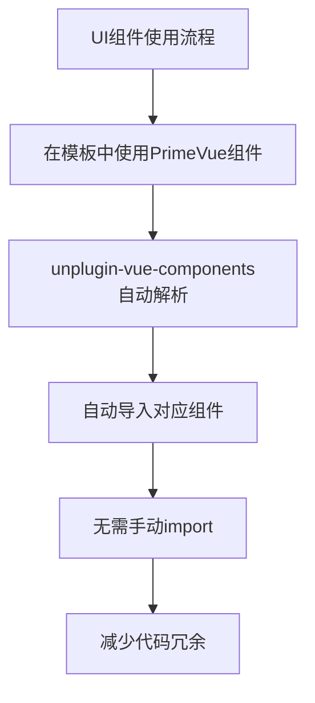

**本节来源**  
- [vite.config.ts](file://src/frontEnd/vite.config.ts)

## Pinia状态管理

项目采用Pinia作为状态管理解决方案，通过模块化的方式管理应用状态。状态被划分为多个独立的store，每个store负责管理特定领域的状态。

### 状态管理架构

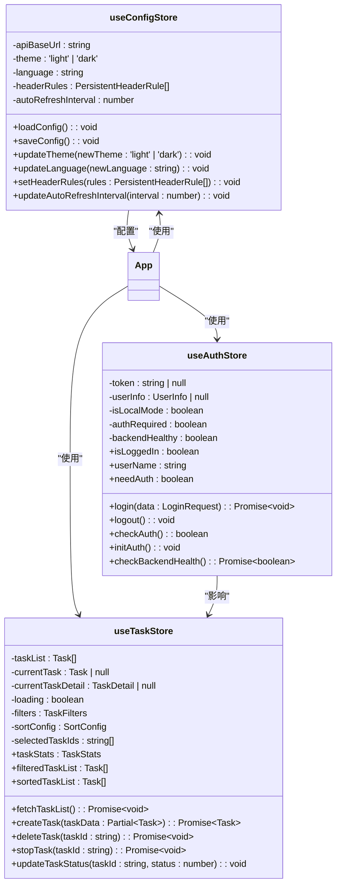

**图源**  
- [stores/auth.ts](file://src/frontEnd/src/stores/auth.ts)
- [stores/task.ts](file://src/frontEnd/src/stores/task.ts)
- [stores/config.ts](file://src/frontEnd/src/stores/config.ts)

**本节来源**  
- [stores/auth.ts](file://src/frontEnd/src/stores/auth.ts)
- [stores/task.ts](file://src/frontEnd/src/stores/task.ts)
- [stores/config.ts](file://src/frontEnd/src/stores/config.ts)

### 认证状态管理

认证状态管理支持本地和远程双模式。在本地访问时（localhost或127.0.0.1），系统自动进入本地模式，无需认证即可使用所有功能。

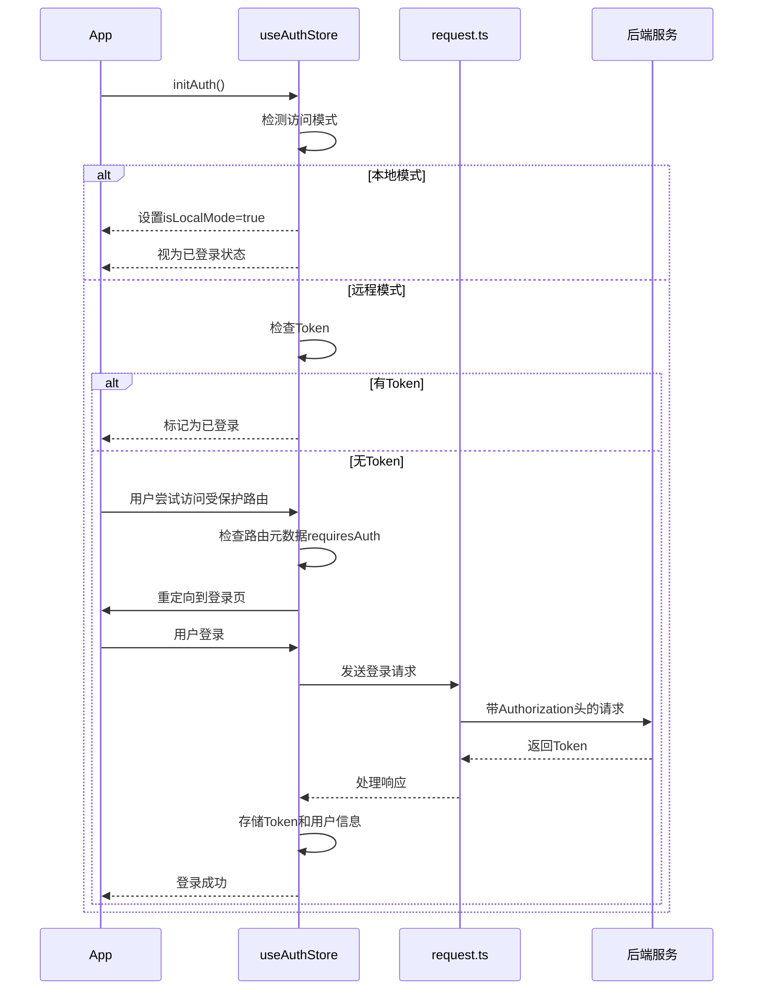

**图源**  
- [stores/auth.ts](file://src/frontEnd/src/stores/auth.ts)
- [api/request.ts](file://src/frontEnd/src/api/request.ts)

**本节来源**  
- [stores/auth.ts](file://src/frontEnd/src/stores/auth.ts)
- [api/request.ts](file://src/frontEnd/src/api/request.ts)

### 任务状态管理

任务状态管理是应用的核心，负责管理所有扫描任务的状态、过滤、排序和统计。

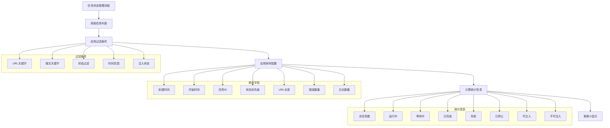

**图源**  
- [stores/task.ts](file://src/frontEnd/src/stores/task.ts)

**本节来源**  
- [stores/task.ts](file://src/frontEnd/src/stores/task.ts)

## Vue Router路由配置

项目使用Vue Router进行路由管理，实现了基于角色的访问控制和导航守卫机制。

### 路由配置

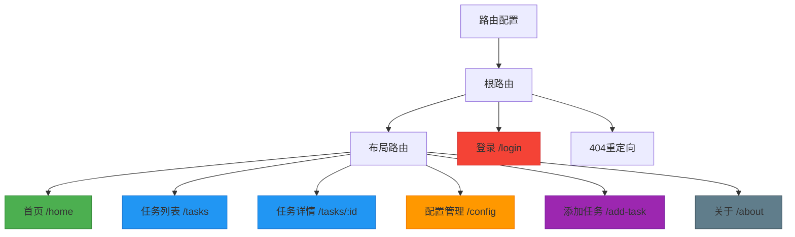

**图源**  
- [router/index.ts](file://src/frontEnd/src/router/index.ts)

**本节来源**  
- [router/index.ts](file://src/frontEnd/src/router/index.ts)

### 导航守卫实现

导航守卫实现了复杂的访问控制逻辑，支持本地和远程双模式。

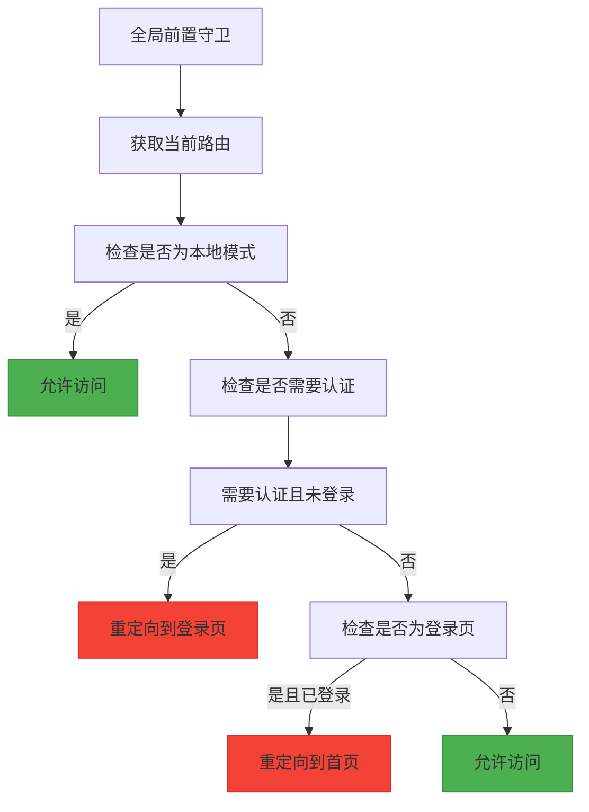

**图源**  
- [router/guards.ts](file://src/frontEnd/src/router/guards.ts)

**本节来源**  
- [router/guards.ts](file://src/frontEnd/src/router/guards.ts)

## Vite构建工具优化

项目使用Vite作为构建工具，在`vite.config.ts`中进行了多项优化配置。

### 构建配置优化

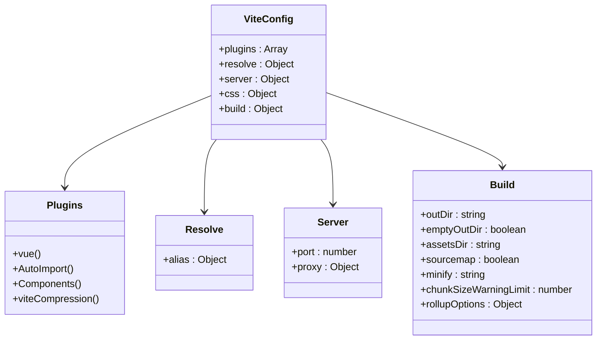

**图源**  
- [vite.config.ts](file://src/frontEnd/vite.config.ts)

**本节来源**  
- [vite.config.ts](file://src/frontEnd/vite.config.ts)

### 代码分割配置

Vite配置中包含了详细的代码分割策略，通过Rollup的manualChunks功能实现。

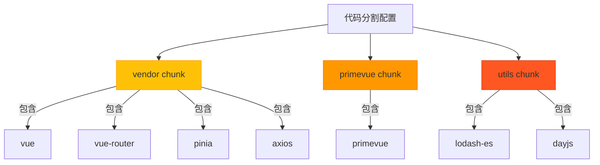

**图源**  
- [vite.config.ts](file://src/frontEnd/vite.config.ts)

**本节来源**  
- [vite.config.ts](file://src/frontEnd/vite.config.ts)

## TypeScript类型系统应用

项目充分利用TypeScript类型系统，定义了完整的类型体系，确保类型安全和开发体验。

### 类型定义架构

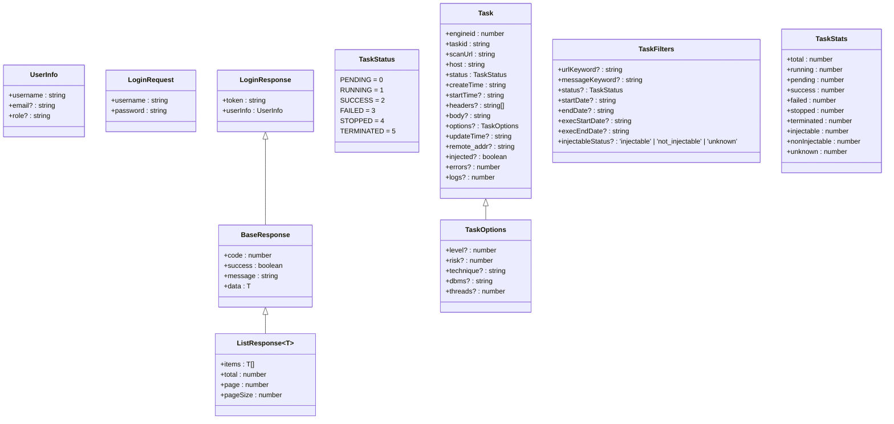

**图源**  
- [types/api.ts](file://src/frontEnd/src/types/api.ts)
- [types/common.ts](file://src/frontEnd/src/types/common.ts)
- [types/task.ts](file://src/frontEnd/src/types/task.ts)

**本节来源**  
- [types/api.ts](file://src/frontEnd/src/types/api.ts)
- [types/common.ts](file://src/frontEnd/src/types/common.ts)
- [types/task.ts](file://src/frontEnd/src/types/task.ts)