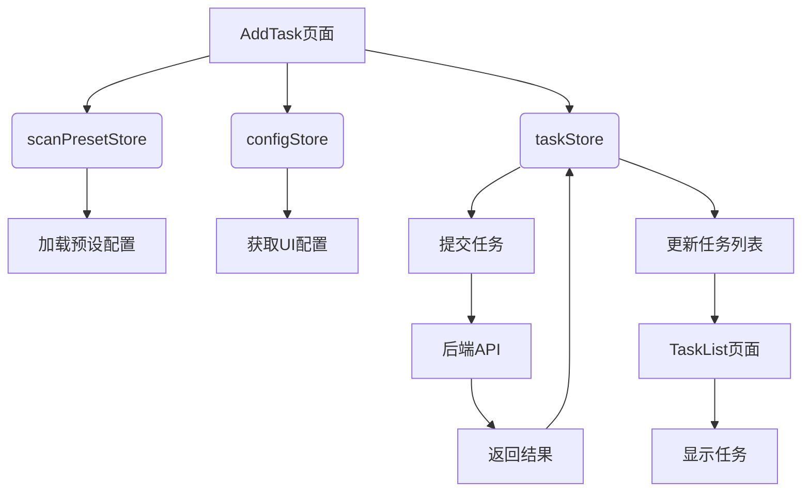

# Store模块设计

<cite>
**本文档引用文件**   
- [task.ts](file://src/frontEnd/src/stores/task.ts)
- [scanPreset.ts](file://src/frontEnd/src/stores/scanPreset.ts)
- [config.ts](file://src/frontEnd/src/stores/config.ts)
- [auth.ts](file://src/frontEnd/src/stores/auth.ts)
- [task.ts](file://src/frontEnd/src/types/task.ts)
- [scanPreset.ts](file://src/frontEnd/src/types/scanPreset.ts)
- [common.ts](file://src/frontEnd/src/types/common.ts)
- [task.ts](file://src/frontEnd/src/api/task.ts)
- [scanPreset.ts](file://src/frontEnd/src/api/scanPreset.ts)
- [auth.ts](file://src/frontEnd/src/api/auth.ts)
- [storage.ts](file://src/frontEnd/src/utils/storage.ts)
- [request.ts](file://src/frontEnd/src/api/request.ts)
- [AddTask\index.vue](file://src/frontEnd/src/views/AddTask/index.vue)
- [TaskList\index.vue](file://src/frontEnd/src/views/TaskList/index.vue)
</cite>

## 目录
1. [引言](#引言)
2. [核心Store职责划分](#核心store职责划分)
3. [任务Store分析](#任务store分析)
4. [扫描预设Store分析](#扫描预设store分析)
5. [配置Store分析](#配置store分析)
6. [认证Store分析](#认证store分析)
7. [Store间协同工作机制](#store间协同工作机制)
8. [结论](#结论)

## 引言
sqlmapWebUI采用Pinia作为状态管理方案，实现了模块化的Store设计。系统通过task、scanPreset、config和auth四个核心Store分别管理任务、扫描配置、应用配置和认证状态，形成了清晰的职责划分和高效的数据流。这种设计不仅提高了代码的可维护性和可测试性，还为用户提供了流畅的交互体验。本文将深入分析这四个核心Store的实现细节和协同工作机制。

## 核心Store职责划分
sqlmapWebUI的Pinia Store设计遵循单一职责原则，每个Store负责特定领域的状态管理：

- **任务Store (task)**：负责管理所有扫描任务的生命周期，包括任务列表、状态监控、过滤和分页
- **扫描预设Store (scanPreset)**：管理常用扫描配置的CRUD操作和预设配置的导入导出
- **配置Store (config)**：维护默认扫描参数和UI配置项，支持动态更新和重置
- **认证Store (auth)**：处理认证状态管理，包括token存储、过期处理和状态同步

这种模块化设计使得各功能模块高度内聚、低耦合，便于独立开发和维护。

## 任务Store分析

### 状态管理
任务Store维护了任务相关的所有状态，包括：
- `taskList`：任务列表数组
- `currentTask`：当前选中的任务
- `currentTaskDetail`：当前任务的详细信息
- `loading`：加载状态标识
- `filters`：任务过滤条件
- `sortConfig`：排序配置
- `selectedTaskIds`：选中的任务ID列表

### 任务状态监控
任务Store通过`TaskStatus`枚举定义了六种任务状态：
```typescript
enum TaskStatus {
  PENDING = 0,    // 等待中
  RUNNING = 1,    // 运行中
  SUCCESS = 2,    // 已完成
  FAILED = 3,     // 失败
  STOPPED = 4,    // 已停止
  TERMINATED = 5  // 已终止
}
```

Store通过`taskStats`计算属性实时统计各状态的任务数量，为用户提供直观的统计信息。

### 任务过滤逻辑
任务Store实现了多维度的过滤机制，支持以下过滤条件：
- URL关键字过滤
- 报文关键字过滤（搜索headers、body和host）
- 状态过滤
- 时间范围过滤（创建时间和执行时间）
- 注入状态过滤

过滤逻辑通过`filteredTaskList`计算属性实现，结合`setFilters`和`clearFilters`方法提供灵活的过滤功能。

### 分页与排序
任务Store通过`sortedTaskList`计算属性实现排序功能，支持按以下字段排序：
- 创建时间
- 开始执行时间
- 任务ID
- 状态（按优先级）
- URL长度
- 错误数
- 日志数

排序配置通过`setSortConfig`方法动态更新，确保用户可以根据需要调整列表顺序。

### 实时更新机制
任务Store通过`fetchTaskList`动作定期从后端获取任务列表，结合`updateTaskStatus`方法实现任务状态的实时更新。在任务列表页面，系统还实现了智能轮询机制，当检测到有运行中的任务时自动启动轮询，任务完成后自动停止，既保证了实时性又避免了不必要的网络请求。

**Section sources**
- [task.ts](file://src/frontEnd/src/stores/task.ts#L1-L389)
- [task.ts](file://src/frontEnd/src/types/task.ts#L1-L122)

## 扫描预设Store分析

### CRUD操作实现
扫描预设Store提供了完整的CRUD操作：
- `createPreset`：创建新预设
- `updatePreset`：更新预设
- `deletePreset`：删除预设
- `loadAllPresets`：加载所有预设

这些操作通过调用后端API实现数据的持久化，确保预设配置在页面刷新后依然存在。

### 预设配置管理
Store通过以下状态管理预设配置：
- `defaultPreset`：默认配置
- `presetConfigs`：常用配置
- `historyConfigs`：历史配置
- `allPresets`：所有预设

这种分层管理方式使得用户可以快速访问最常用的配置，提高操作效率。

### 预设导入导出
扫描预设Store通过`getEffectiveOptions`方法实现预设的导出功能，该方法只返回与默认值不同的选项，生成精简的配置参数。导入功能通过`selectPreset`方法实现，用户选择预设后，Store会自动应用相应的配置选项。

### 计算属性优化
Store通过`presetOptions`计算属性生成下拉菜单选项，将默认配置、常用配置和历史配置分类显示，提升用户体验。该计算属性还包含分隔符和禁用选项，确保菜单结构清晰。

**Section sources**
- [scanPreset.ts](file://src/frontEnd/src/stores/scanPreset.ts#L1-L296)
- [scanPreset.ts](file://src/frontEnd/src/types/scanPreset.ts#L1-L199)
- [scanPreset.ts](file://src/frontEnd/src/api/scanPreset.ts#L1-L145)

## 配置Store分析

### 默认扫描参数维护
配置Store通过`DEFAULT_SCAN_OPTIONS`常量维护默认扫描参数，包括：
- 检测级别（level）
- 风险级别（risk）
- 注入技术（technique）
- 线程数（threads）
- 超时时间（timeout）
- 重试次数（retries）

这些默认值为用户提供了一个合理的起点，减少重复配置的工作量。

### UI配置项管理
Store维护了以下UI配置项：
- `theme`：主题（亮色/暗色）
- `language`：语言
- `autoRefreshInterval`：自动刷新间隔
- `headerRules`：头部规则

这些配置项直接影响用户界面的外观和行为，提升用户体验。

### 动态更新与重置
配置Store通过以下方法支持动态更新：
- `updateTheme`：更新主题
- `updateLanguage`：更新语言
- `updateAutoRefreshInterval`：更新刷新间隔

重置功能通过`saveConfig`和`loadConfig`方法实现，配置变更后自动持久化到localStorage，页面加载时自动恢复。

**Section sources**
- [config.ts](file://src/frontEnd/src/stores/config.ts#L1-L74)
- [storage.ts](file://src/frontEnd/src/utils/storage.ts#L1-L61)

## 认证Store分析

### 认证状态管理
认证Store通过以下状态管理认证信息：
- `token`：认证令牌
- `userInfo`：用户信息
- `isLocalMode`：是否为本地模式
- `authRequired`：是否需要认证
- `backendHealthy`：后端健康状态

### Token存储与过期处理
Store使用localStorage持久化存储token和用户信息，确保页面刷新后用户仍保持登录状态。通过`checkAuth`方法验证认证状态，当检测到token失效时自动清除本地存储并提示用户重新登录。

### 认证状态同步
Store通过`initAuth`方法初始化认证状态，检测访问模式并恢复存储的状态。`checkBackendHealth`方法定期检查后端服务健康状态，确保用户操作的可靠性。计算属性`isLoggedIn`和`userName`提供便捷的认证状态访问接口。

**Section sources**
- [auth.ts](file://src/frontEnd/src/stores/auth.ts#L1-L175)
- [auth.ts](file://src/frontEnd/src/api/auth.ts#L1-L34)
- [request.ts](file://src/frontEnd/src/api/request.ts#L1-L231)

## Store间协同工作机制

### 任务创建流程
任务创建流程展示了多个Store的协同工作：
1. 用户在AddTask页面输入HTTP报文
2. scanPresetStore加载预设配置选项
3. 用户选择或自定义扫描配置
4. taskStore通过API提交任务
5. scanPresetStore将当前配置添加到历史记录
6. configStore的自动刷新配置影响后续任务列表的更新频率

### 数据依赖关系
各Store之间存在明确的数据依赖：
- taskStore依赖scanPresetStore的配置选项
- 所有Store依赖authStore的认证状态
- UI组件依赖configStore的界面配置
- API调用依赖request模块的拦截器

### 调用关系图


**Diagram sources**
- [AddTask\index.vue](file://src/frontEnd/src/views/AddTask/index.vue#L1-L1092)
- [TaskList\index.vue](file://src/frontEnd/src/views/TaskList/index.vue#L1-L1119)

## 结论
sqlmapWebUI的Pinia模块化设计体现了良好的架构思想。通过清晰的职责划分，四个核心Store各司其职，共同构建了稳定可靠的状态管理体系。任务Store实现了复杂的状态监控和过滤逻辑，扫描预设Store提供了灵活的配置管理，配置Store支持个性化的UI设置，认证Store确保了系统的安全性。各Store之间的协同工作流畅高效，为用户提供了优秀的使用体验。这种设计模式值得在类似的前端应用中推广使用。