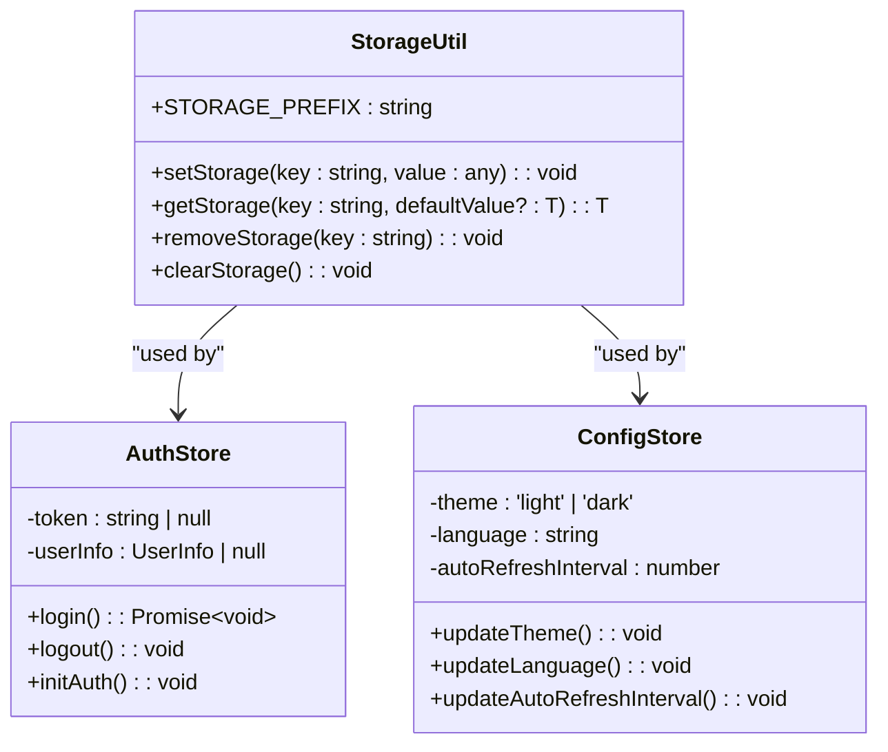
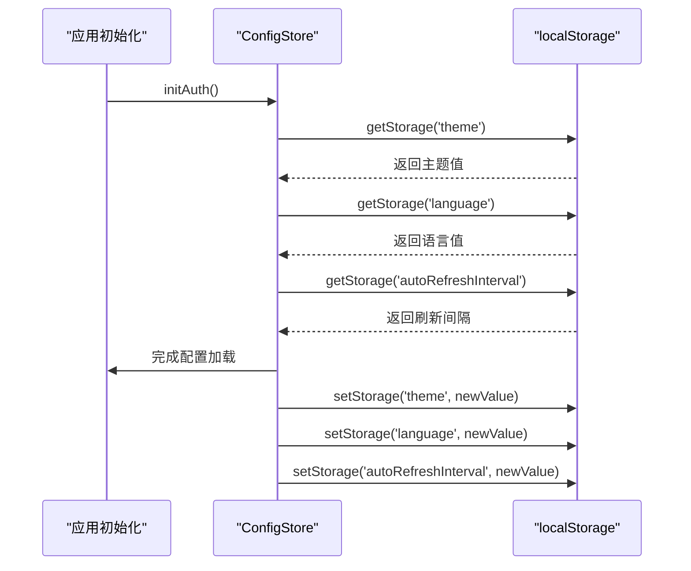
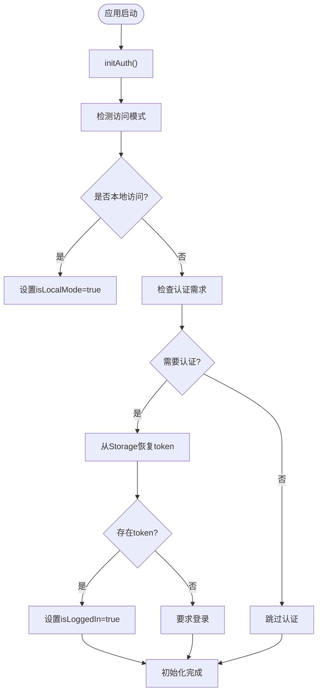
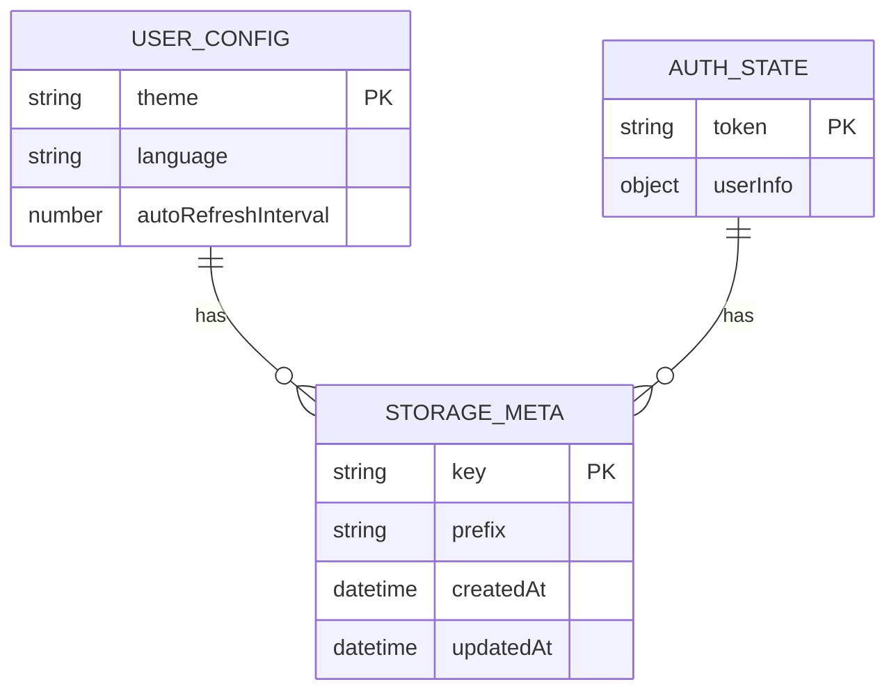
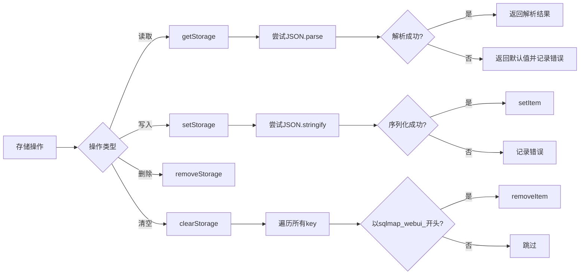
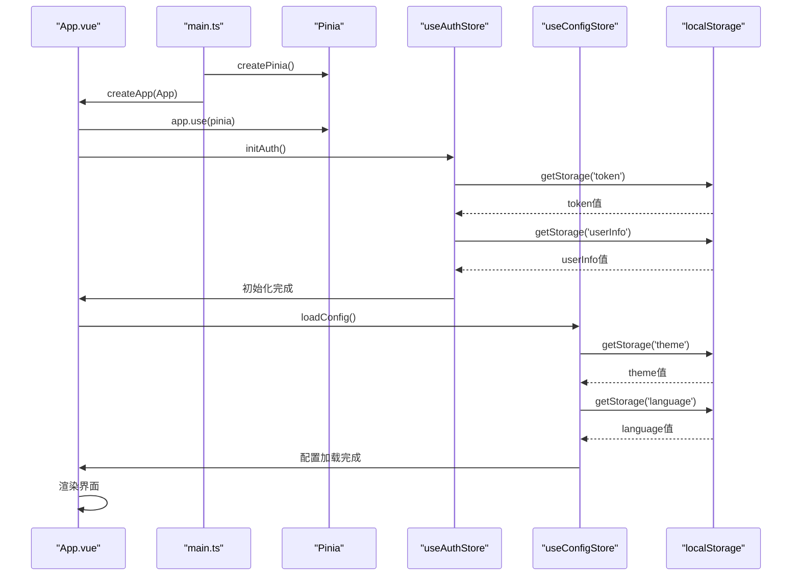

# 状态持久化

<cite>
**本文档引用的文件**
- [storage.ts](file://src/frontEnd/src/utils/storage.ts)
- [auth.ts](file://src/frontEnd/src/stores/auth.ts)
- [config.ts](file://src/frontEnd/src/stores/config.ts)
- [authController.py](file://src/backEnd/api/commonApi/authController.py)
- [configController.py](file://src/backEnd/api/commonApi/configController.py)
- [main.ts](file://src/frontEnd/src/main.ts)
- [App.vue](file://src/frontEnd/src/App.vue)
- [guards.ts](file://src/frontEnd/src/router/guards.ts)
- [auth.ts](file://src/frontEnd/src/utils/auth.ts)
- [common.ts](file://src/frontEnd/src/types/common.ts)
- [scanPreset.ts](file://src/frontEnd/src/stores/scanPreset.ts)
- [task.ts](file://src/frontEnd/src/stores/task.ts)
</cite>

## 目录
1. [引言](#引言)
2. [存储工具模块设计](#存储工具模块设计)
3. [配置状态持久化](#配置状态持久化)
4. [认证状态持久化](#认证状态持久化)
5. [数据版本管理与迁移](#数据版本管理与迁移)
6. [性能优化与存储管理](#性能优化与存储管理)
7. [完整实现示例](#完整实现示例)
8. [结论](#结论)

## 引言

sqlmapWebUI应用通过localStorage实现了关键状态的持久化存储，确保用户自定义的配置和会话信息在页面刷新后能够保持不变。本系统采用前端Pinia状态管理与后端API相结合的方式，构建了一个完整的状态持久化解决方案。核心机制包括使用带前缀的localStorage进行数据存储、通过store模式管理应用状态、实现自动登录功能以及处理配置结构变更时的数据迁移。该持久化方案不仅提升了用户体验，还保证了应用在不同访问模式下的稳定运行。

## 存储工具模块设计

存储工具模块提供了对localStorage的封装，实现了数据的序列化、反序列化和错误处理。该模块通过定义统一的接口，简化了前端各组件对本地存储的访问。

**图示来源**
- [storage.ts](file://src/frontEnd/src/utils/storage.ts#L5-L60)
- [auth.ts](file://src/frontEnd/src/stores/auth.ts#L23-L70)
- [config.ts](file://src/frontEnd/src/stores/config.ts#L12-L28)

**存储工具模块设计**
- [storage.ts](file://src/frontEnd/src/utils/storage.ts#L1-L60)

## 配置状态持久化

配置状态持久化机制通过config store实现了用户自定义扫描参数的保存。系统在初始化时从localStorage恢复配置，并在配置变更时自动更新存储。

**图示来源**
- [config.ts](file://src/frontEnd/src/stores/config.ts#L12-L28)
- [App.vue](file://src/frontEnd/src/App.vue#L16)

**配置状态持久化**
- [config.ts](file://src/frontEnd/src/stores/config.ts#L1-L74)
- [App.vue](file://src/frontEnd/src/App.vue#L16)

## 认证状态持久化

认证状态持久化方案通过auth store实现了token的安全存储和自动登录功能。系统根据访问模式决定是否需要认证，并在本地模式下提供无缝访问体验。

**图示来源**
- [auth.ts](file://src/frontEnd/src/stores/auth.ts#L23-L99)
- [authController.py](file://src/backEnd/api/commonApi/authController.py#L114-L140)
- [guards.ts](file://src/frontEnd/src/router/guards.ts#L19-L28)

**认证状态持久化**
- [auth.ts](file://src/frontEnd/src/stores/auth.ts#L1-L175)
- [authController.py](file://src/backEnd/api/commonApi/authController.py#L114-L150)
- [guards.ts](file://src/frontEnd/src/router/guards.ts#L1-L47)

## 数据版本管理与迁移

系统通过前缀化的存储键名和类型安全的序列化机制实现了数据版本管理。当配置结构发生变更时，系统能够通过默认值机制平滑处理旧数据。

**图示来源**
- [storage.ts](file://src/frontEnd/src/utils/storage.ts#L5)
- [config.ts](file://src/frontEnd/src/stores/config.ts#L12-L16)
- [auth.ts](file://src/frontEnd/src/stores/auth.ts#L23-L24)

**数据版本管理与迁移**
- [storage.ts](file://src/frontEnd/src/utils/storage.ts#L5)
- [config.ts](file://src/frontEnd/src/stores/config.ts#L12-L16)
- [auth.ts](file://src/frontEnd/src/stores/auth.ts#L23-L24)

## 性能优化与存储管理

系统通过合理的数据分片和缓存策略优化了持久化性能。存储空间管理采用前缀过滤的方式，确保只清除应用相关的存储项。

**图示来源**
- [storage.ts](file://src/frontEnd/src/utils/storage.ts#L10-L59)
- [config.ts](file://src/frontEnd/src/stores/config.ts#L26-L28)
- [auth.ts](file://src/frontEnd/src/stores/auth.ts#L68-L69)

**性能优化与存储管理**
- [storage.ts](file://src/frontEnd/src/utils/storage.ts#L10-L59)
- [config.ts](file://src/frontEnd/src/stores/config.ts#L26-L28)
- [auth.ts](file://src/frontEnd/src/stores/auth.ts#L68-L69)

## 完整实现示例

以下是状态持久化逻辑的完整实现示例，展示了从应用初始化到状态管理的全过程。

**图示来源**
- [main.ts](file://src/frontEnd/src/main.ts#L1-L15)
- [App.vue](file://src/frontEnd/src/App.vue#L1-L33)
- [auth.ts](file://src/frontEnd/src/stores/auth.ts#L21-L175)
- [config.ts](file://src/frontEnd/src/stores/config.ts#L1-L74)

**完整实现示例**
- [main.ts](file://src/frontEnd/src/main.ts#L1-L15)
- [App.vue](file://src/frontEnd/src/App.vue#L1-L33)
- [auth.ts](file://src/frontEnd/src/stores/auth.ts#L21-L175)
- [config.ts](file://src/frontEnd/src/stores/config.ts#L1-L74)

## 结论

sqlmapWebUI的状态持久化机制通过localStorage实现了关键状态的可靠存储。系统采用前缀化的存储键名避免命名冲突，通过try-catch块处理序列化和存储异常，确保了数据操作的健壮性。配置store和认证store分别管理应用配置和用户会话，实现了关注点分离。自动初始化机制在应用启动时恢复持久化状态，提供了无缝的用户体验。该方案平衡了功能需求和性能考虑，为Web应用的状态管理提供了可靠的解决方案。