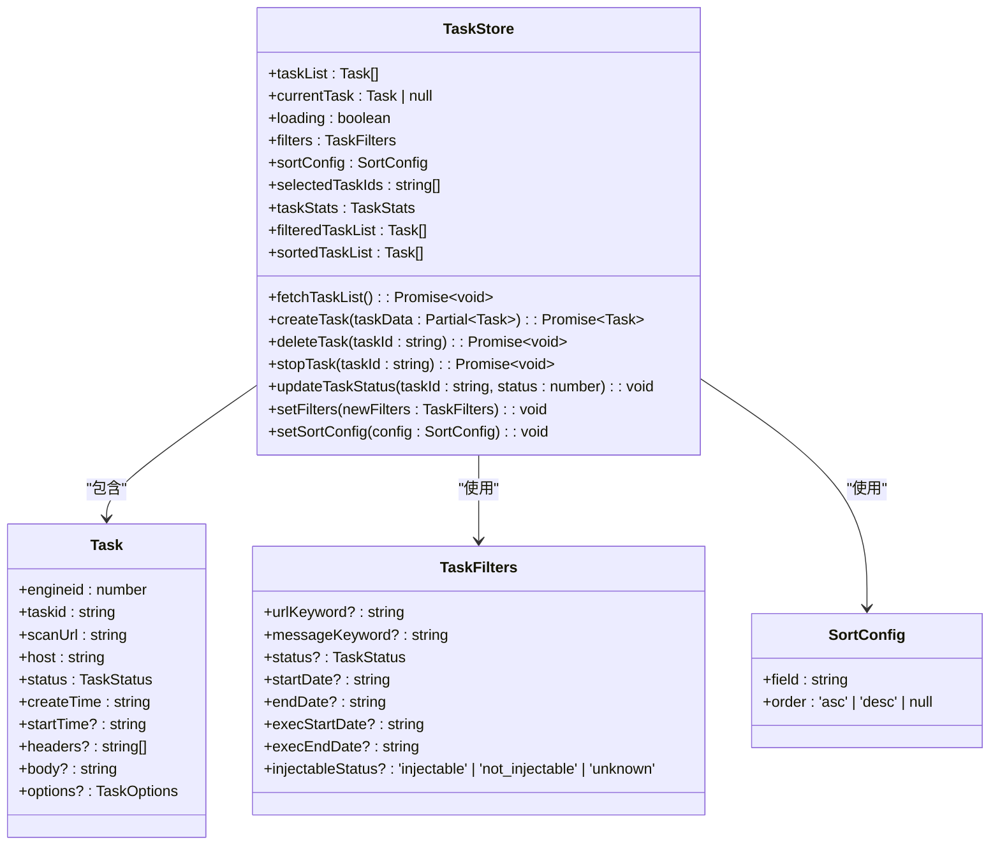
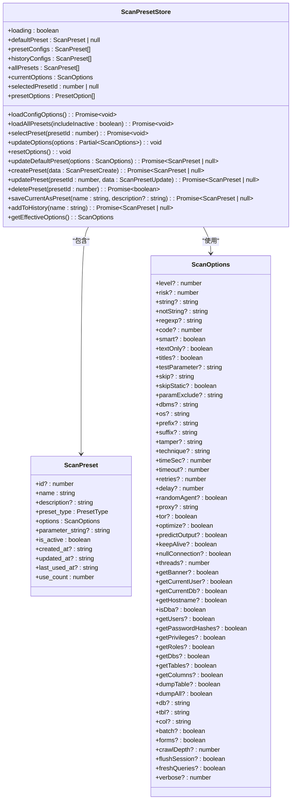
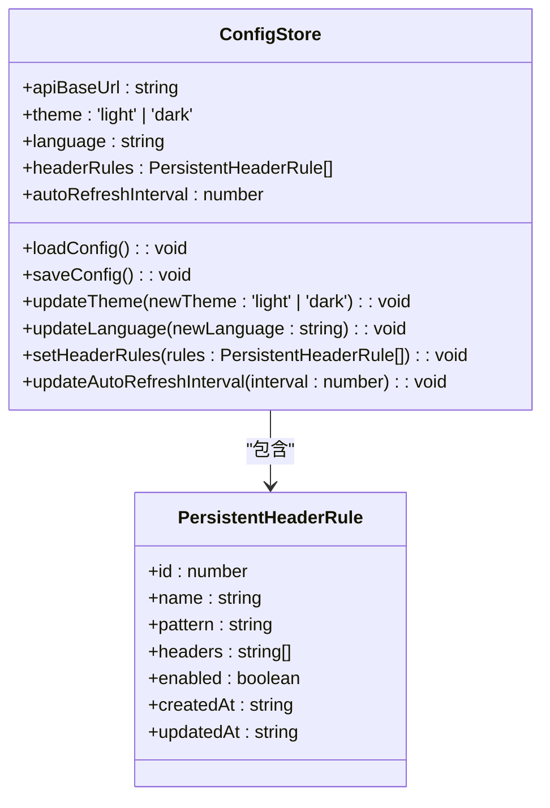
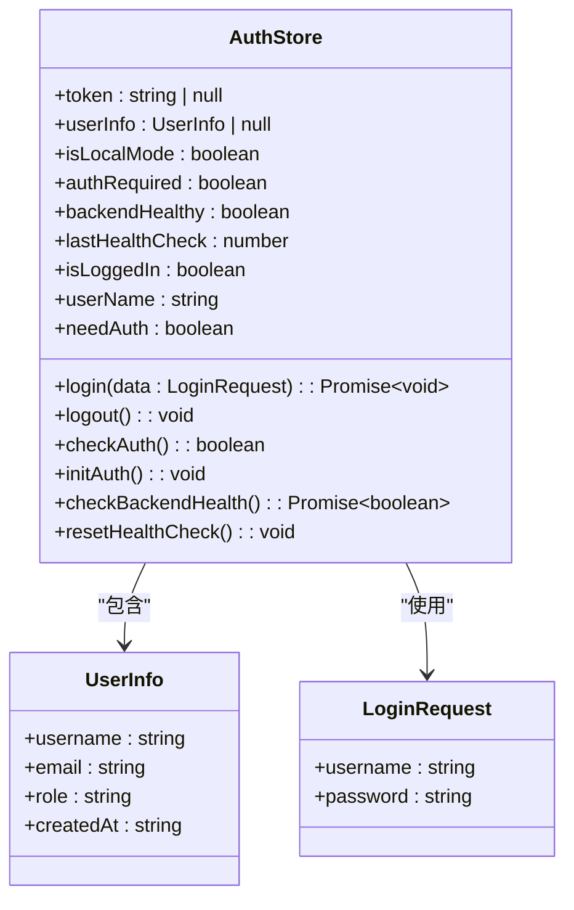
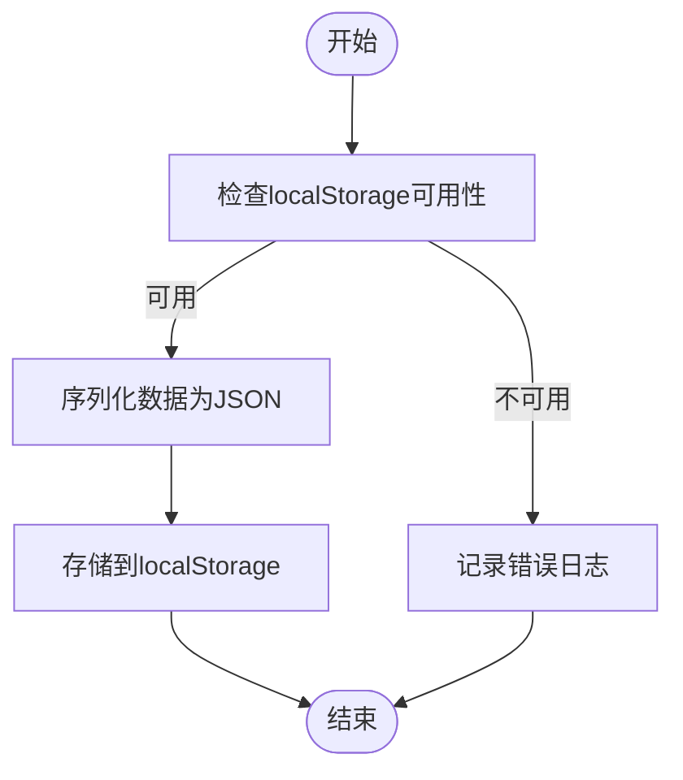
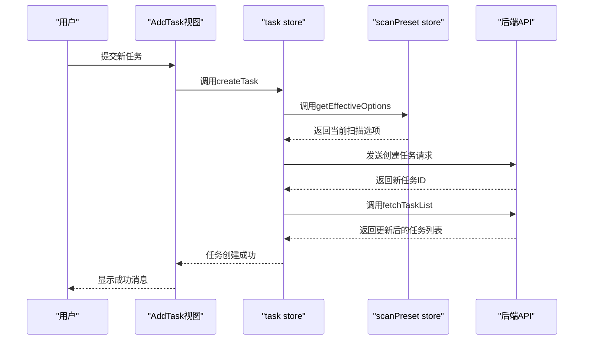
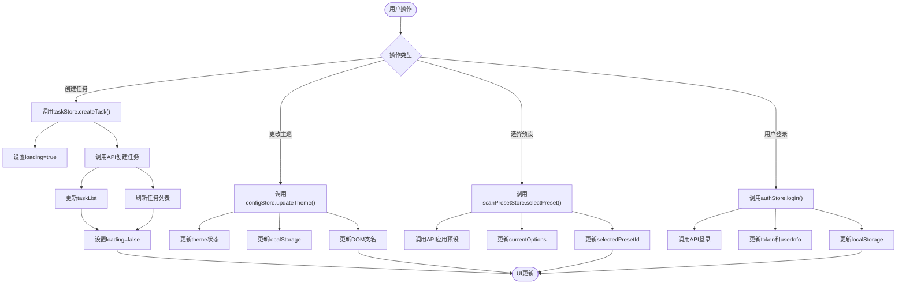

# 状态管理

<cite>
**本文档引用的文件**
- [auth.ts](file://src/frontEnd/src/stores/auth.ts)
- [config.ts](file://src/frontEnd/src/stores/config.ts)
- [task.ts](file://src/frontEnd/src/stores/task.ts)
- [scanPreset.ts](file://src/frontEnd/src/stores/scanPreset.ts)
- [storage.ts](file://src/frontEnd/src/utils/storage.ts)
- [task.ts](file://src/frontEnd/src/types/task.ts)
- [scanPreset.ts](file://src/frontEnd/src/types/scanPreset.ts)
- [auth.ts](file://src/frontEnd/src/api/auth.ts)
- [task.ts](file://src/frontEnd/src/api/task.ts)
- [scanPreset.ts](file://src/frontEnd/src/api/scanPreset.ts)
</cite>

## 目录
1. [引言](#引言)
2. [Pinia Store模块化设计](#pinia-store模块化设计)
3. [状态持久化机制](#状态持久化机制)
4. [Store间依赖关系与数据同步](#store间依赖关系与数据同步)
5. [Actions实现模式](#actions实现模式)
6. [Getters使用场景](#getters使用场景)
7. [状态管理流程图](#状态管理流程图)
8. [代码示例](#代码示例)

## 引言

sqlmapWebUI项目采用Pinia作为前端状态管理解决方案，实现了任务管理、扫描配置、系统配置和用户认证四大核心功能的状态集中管理。通过模块化store设计，将不同业务领域的状态隔离在独立的store中，提高了代码的可维护性和可测试性。本文档详细阐述了Pinia在sqlmapWebUI中的应用，包括store的职责划分、数据结构定义、状态持久化、依赖关系、actions和getters的实现模式，以及完整的状态管理流程。

## Pinia Store模块化设计

sqlmapWebUI的Pinia store采用模块化设计，将应用状态划分为四个核心store：`task`、`scanPreset`、`config`和`auth`。每个store负责管理特定业务领域的状态，通过清晰的职责划分，实现了高内聚低耦合的状态管理架构。

### task Store

`task` store负责管理所有与扫描任务相关的状态，包括任务列表、当前任务、筛选条件、排序配置和选中任务ID等。其核心职责包括：

- **任务列表管理**：维护所有任务的完整列表，支持从后端API获取、创建、删除和停止任务。
- **任务筛选与排序**：提供基于URL关键字、报文关键字、状态、时间范围和注入状态的多维度筛选功能，以及基于创建时间、执行时间、状态等字段的排序功能。
- **任务统计**：通过计算属性实时统计各类任务的数量，如运行中、等待中、成功、失败等任务数。
- **UI状态管理**：管理加载状态、当前任务、筛选条件和排序配置等UI相关状态。



**图源**
- [task.ts](file://src/frontEnd/src/stores/task.ts#L18-L389)
- [task.ts](file://src/frontEnd/src/types/task.ts#L22-L122)

### scanPreset Store

`scanPreset` store负责管理扫描配置预设，支持默认配置、常用配置和历史配置的管理。其核心职责包括：

- **配置预设管理**：维护默认配置、常用配置和历史配置的列表，支持创建、更新、删除和应用预设。
- **配置选项生成**：通过计算属性生成下拉菜单所需的选项，包括默认配置、常用配置和历史配置的分隔符和选项。
- **当前配置管理**：维护当前选中的扫描选项，支持更新、重置和获取有效选项。
- **配置持久化**：通过API与后端交互，实现配置的持久化存储。



**图源**
- [scanPreset.ts](file://src/frontEnd/src/stores/scanPreset.ts#L16-L295)
- [scanPreset.ts](file://src/frontEnd/src/types/scanPreset.ts#L83-L199)

### config Store

`config` store负责管理用户界面配置，包括API基础URL、主题、语言和自定义HTTP头规则等。其核心职责包括：

- **UI配置管理**：维护主题、语言、自动刷新间隔等UI相关配置。
- **配置持久化**：通过localStorage实现配置的持久化存储，确保用户设置在页面刷新后依然有效。
- **主题应用**：根据主题配置动态更新DOM，实现亮色和暗色主题的切换。



**图源**
- [config.ts](file://src/frontEnd/src/stores/config.ts#L9-L73)
- [headerRule.ts](file://src/frontEnd/src/types/headerRule.ts#L1-L20)

### auth Store

`auth` store负责管理用户认证状态，支持本地访问和远程访问两种模式。其核心职责包括：

- **认证状态管理**：维护Token、用户信息、访问模式和认证需求等状态。
- **健康检查**：定期检查后端服务的健康状态，确保服务可用性。
- **认证流程**：提供登录、登出、认证检查和初始化认证状态的功能。
- **状态持久化**：通过localStorage实现Token和用户信息的持久化存储。



**图源**
- [auth.ts](file://src/frontEnd/src/stores/auth.ts#L21-L174)
- [common.ts](file://src/frontEnd/src/types/common.ts#L1-L20)

## 状态持久化机制

sqlmapWebUI通过localStorage实现关键状态的持久化存储，确保用户在页面刷新或重新访问时，其个性化设置和认证状态能够保持不变。持久化机制主要通过`utils/storage.ts`工具函数实现，该工具函数封装了localStorage的读写操作，并添加了错误处理和前缀管理。

### 持久化实现

`storage.ts`文件定义了四个核心函数：`setStorage`、`getStorage`、`removeStorage`和`clearStorage`。这些函数通过`STORAGE_PREFIX`常量为所有存储项添加前缀，避免与其他应用的存储项冲突。`setStorage`函数将JavaScript对象序列化为JSON字符串后存储，`getStorage`函数则将JSON字符串反序列化为JavaScript对象。



**图源**
- [storage.ts](file://src/frontEnd/src/utils/storage.ts#L10-L60)

### 持久化应用

在各个store中，持久化机制被广泛应用于配置和认证状态的管理。例如，在`auth` store中，登录成功后会将Token和用户信息存储到localStorage：

```typescript
async function login(data: LoginRequest): Promise<void> {
  // ... 认证逻辑
  token.value = response.token
  userInfo.value = response.userInfo
  
  // 持久化
  setStorage('token', response.token)
  setStorage('userInfo', response.userInfo)
}
```

在`config` store中，用户更改主题或语言时，会立即更新localStorage中的对应项：

```typescript
function updateTheme(newTheme: 'light' | 'dark'): void {
  theme.value = newTheme
  setStorage('theme', newTheme)
  
  // 应用主题到DOM
  if (newTheme === 'dark') {
    document.documentElement.classList.add('dark-mode')
  } else {
    document.documentElement.classList.remove('dark-mode')
  }
}
```

## Store间依赖关系与数据同步

sqlmapWebUI的store之间存在明确的依赖关系和数据同步策略，确保在复杂业务场景下状态的一致性和正确性。

### 依赖关系

- **auth store**：作为最基础的store，为其他store提供认证状态和后端健康检查功能。其他store在发起API请求前，会依赖`auth` store的`isLoggedIn`和`backendHealthy`状态。
- **config store**：为其他store提供API基础URL和自定义HTTP头规则。`task`和`scanPreset` store在发起API请求时，会使用`config` store的`apiBaseUrl`。
- **scanPreset store**：为`task` store提供扫描配置预设。在创建新任务时，`task` store会依赖`scanPreset` store的`currentOptions`。

### 数据同步策略

在任务创建和配置管理场景下，store间的数据同步通过以下策略实现：

1. **任务创建场景**：当用户在`AddTask`视图中创建新任务时，`task` store的`createTask` action会调用`scanPreset` store的`getEffectiveOptions`方法获取当前有效的扫描选项，然后将这些选项与任务基本信息一起提交到后端。

2. **配置管理场景**：当用户在`Config`视图中更改扫描配置预设时，`scanPreset` store会通过API更新后端配置，并重新加载配置选项。`task` store在需要获取最新配置时，会重新调用`scanPreset` store的`loadConfigOptions`方法。



**图源**
- [task.ts](file://src/frontEnd/src/stores/task.ts#L43-L57)
- [scanPreset.ts](file://src/frontEnd/src/stores/scanPreset.ts#L247-L262)
- [task.ts](file://src/frontEnd/src/api/task.ts#L143-L145)

## Actions实现模式

sqlmapWebUI的store actions采用一致的实现模式，确保异步操作的正确处理、错误捕获和状态更新。

### 异步操作处理

所有涉及API调用的action都使用`async/await`语法处理异步操作。在action执行前，会设置`loading`状态为`true`，在`finally`块中将其重置为`false`，确保UI能够正确反映加载状态。

```typescript
async function fetchTaskList(): Promise<void> {
  loading.value = true
  try {
    const data = await getTaskListApi()
    taskList.value = data
  } catch (error) {
    console.debug('fetchTaskList error:', error)
    throw error
  } finally {
    loading.value = false
  }
}
```

### 错误捕获

action中使用`try/catch`语句捕获异步操作中的错误。捕获到错误后，会记录调试信息并重新抛出错误，由调用方处理。这种模式确保了错误不会在store内部被静默吞掉，同时提供了足够的调试信息。

### 状态更新逻辑

在成功获取数据后，action会直接更新store的状态。对于需要从多个API获取数据的复杂操作，action会按顺序调用多个API，并在最后统一更新状态。

```typescript
async function createTask(taskData: Partial<Task>): Promise<Task> {
  loading.value = true
  try {
    const result = await addTaskApi(taskData)
    // 刷新任务列表
    await fetchTaskList()
    // 返回新创建的任务
    const newTask = taskList.value.find((t) => t.taskid === result.taskid)
    return newTask || ({} as Task)
  } catch (error) {
    console.debug('createTask error:', error)
    throw error
  } finally {
    loading.value = false
  }
}
```

## Getters使用场景

sqlmapWebUI充分利用Pinia的计算属性（getters）优化UI渲染性能，避免在组件中重复计算。

### 任务统计

`task` store的`taskStats` getter通过遍历任务列表，实时统计各类任务的数量。由于这是一个计算属性，只有在任务列表发生变化时才会重新计算，避免了在组件中频繁执行统计逻辑。

```typescript
const taskStats = computed<TaskStats>(() => {
  const stats: TaskStats = {
    total: taskList.value.length,
    running: 0,
    pending: 0,
    success: 0,
    failed: 0,
    stopped: 0,
    terminated: 0,
    injectable: 0,
    nonInjectable: 0,
    unknown: 0,
  }

  taskList.value.forEach((task) => {
    switch (task.status) {
      case TaskStatus.RUNNING:
        stats.running++
        break
      // ... 其他状态
    }
  })

  return stats
})
```

### 过滤和排序

`task` store的`filteredTaskList`和`sortedTaskList` getter实现了任务列表的过滤和排序功能。这些计算属性基于`filters`和`sortConfig`状态，动态生成过滤和排序后的任务列表。组件只需订阅这些计算属性，即可获得处理后的数据。

```typescript
const filteredTaskList = computed<Task[]>(() => {
  let result = [...taskList.value]

  // URL关键字过滤
  if (filters.value.urlKeyword) {
    const keyword = filters.value.urlKeyword.toLowerCase()
    result = result.filter((task) => task.scanUrl.toLowerCase().includes(keyword))
  }
  // ... 其他过滤条件

  return result
})
```

### 预设选项生成

`scanPreset` store的`presetOptions` getter将预设配置转换为下拉菜单所需的选项格式，包括默认配置、常用配置和历史配置的分隔符和选项。这避免了在组件中重复处理数据格式转换逻辑。

```typescript
const presetOptions = computed<PresetOption[]>(() => {
  const options: PresetOption[] = []
  
  // 默认配置
  if (defaultPreset.value) {
    options.push({
      label: `【默认】${defaultPreset.value.name}`,
      value: defaultPreset.value.id || 0,
      preset: defaultPreset.value,
      type: 'default'
    })
  }
  // ... 其他选项

  return options
})
```

## 状态管理流程图

以下流程图展示了用户操作如何触发store变更并更新UI。



**图源**
- [task.ts](file://src/frontEnd/src/stores/task.ts#L43-L57)
- [config.ts](file://src/frontEnd/src/stores/config.ts#L31-L40)
- [scanPreset.ts](file://src/frontEnd/src/stores/scanPreset.ts#L121-L125)
- [auth.ts](file://src/frontEnd/src/stores/auth.ts#L55-L73)

## 代码示例

以下代码示例展示了store定义、状态订阅和变更操作的完整实现。

### Store定义

```typescript
// stores/task.ts
export const useTaskStore = defineStore('task', () => {
  // 状态
  const taskList = ref<Task[]>([])
  const loading = ref<boolean>(false)
  const filters = ref<TaskFilters>({})
  
  // 计算属性
  const filteredTaskList = computed<Task[]>(() => {
    // 过滤逻辑
  })
  
  // actions
  async function fetchTaskList(): Promise<void> {
    loading.value = true
    try {
      const data = await getTaskListApi()
      taskList.value = data
    } catch (error) {
      console.debug('fetchTaskList error:', error)
      throw error
    } finally {
      loading.value = false
    }
  }
  
  return {
    taskList,
    loading,
    filters,
    filteredTaskList,
    fetchTaskList
  }
})
```

### 状态订阅

```vue
<!-- views/TaskList/index.vue -->
<script setup>
import { useTaskStore } from '@/stores/task'
import { storeToRefs } from 'pinia'

const taskStore = useTaskStore()
const { taskList, loading, filteredTaskList } = storeToRefs(taskStore)
const { fetchTaskList } = taskStore

// 组件初始化时获取任务列表
onMounted(() => {
  fetchTaskList()
})
</script>
```

### 状态变更

```vue
<!-- views/AddTask/index.vue -->
<script setup>
import { useTaskStore } from '@/stores/task'
import { useScanPresetStore } from '@/stores/scanPreset'

const taskStore = useTaskStore()
const scanPresetStore = useScanPresetStore()

async function handleSubmit() {
  try {
    // 获取当前有效的扫描选项
    const options = scanPresetStore.getEffectiveOptions()
    // 创建新任务
    await taskStore.createTask({
      scanUrl: form.url,
      options
    })
    // 显示成功消息
    ElMessage.success('任务创建成功')
  } catch (error) {
    ElMessage.error('任务创建失败')
  }
}
</script>
```

**节源**
- [task.ts](file://src/frontEnd/src/stores/task.ts#L18-L389)
- [index.vue](file://src/frontEnd/src/views/TaskList/index.vue#L1-L50)
- [index.vue](file://src/frontEnd/src/views/AddTask/index.vue#L1-L50)