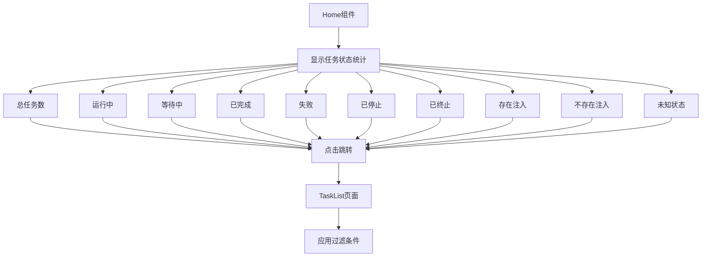
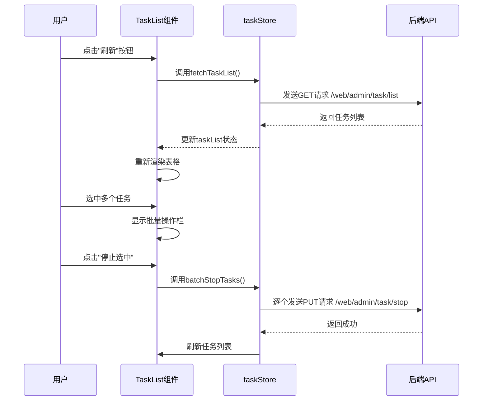
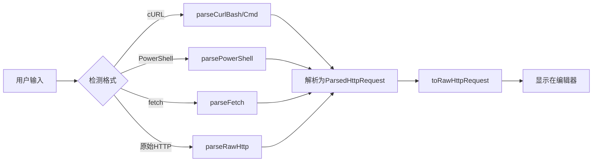
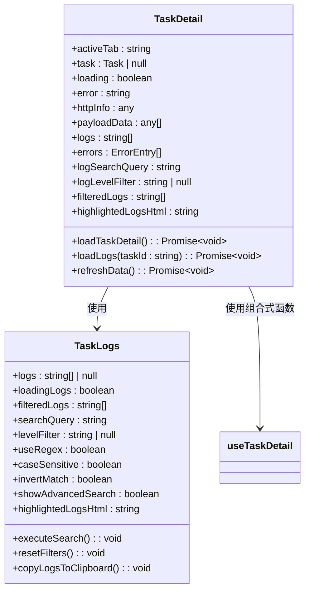
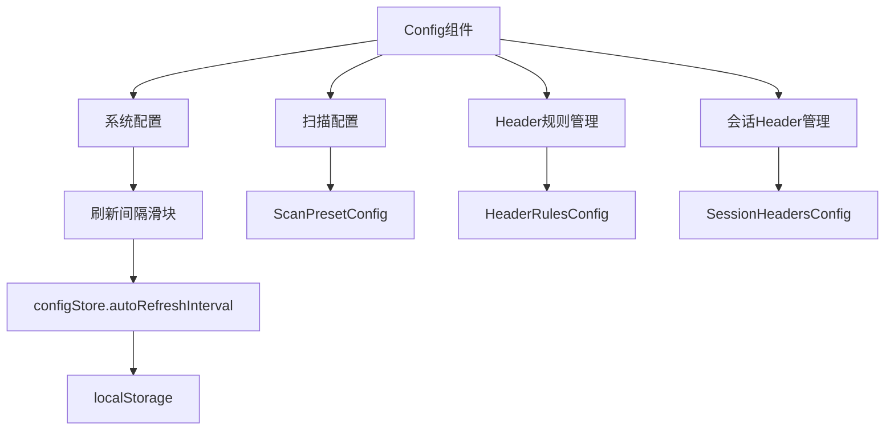
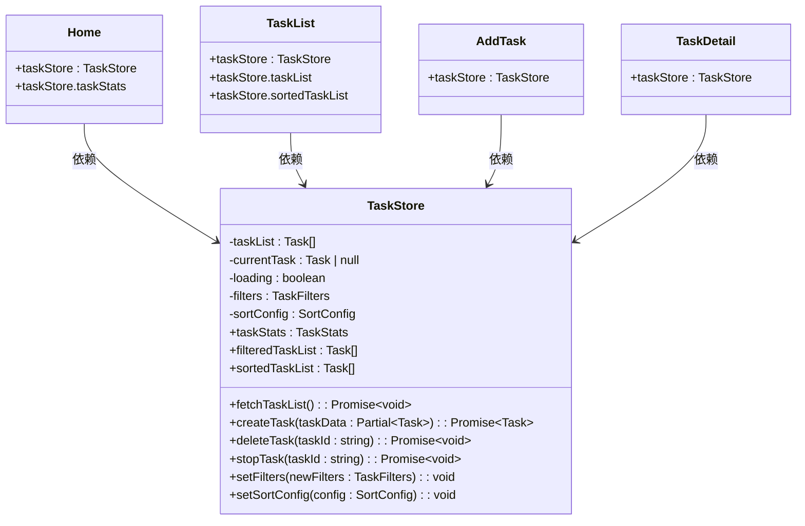

# 视图组件

<cite>
**本文档引用的文件**
- [Home/index.vue](file://src\frontEnd\src\views\Home\index.vue)
- [TaskList/index.vue](file://src\frontEnd\src\views\TaskList\index.vue)
- [AddTask/index.vue](file://src\frontEnd\src\views\AddTask\index.vue)
- [TaskDetail/index.vue](file://src\frontEnd\src\views\TaskDetail\index.vue)
- [Config/index.vue](file://src\frontEnd\src\views\Config\index.vue)
- [index.ts](file://src\frontEnd\src\router\index.ts)
- [task.ts](file://src\frontEnd\src\stores\task.ts)
- [config.ts](file://src\frontEnd\src\stores\config.ts)
- [task.ts](file://src\frontEnd\src\types\task.ts)
- [task.ts](file://src\frontEnd\src\api\task.ts)
- [useTaskDetail.ts](file://src\frontEnd\src\views\TaskDetail\composables\useTaskDetail.ts)
- [index.ts](file://src\frontEnd\src\utils\httpRequestParser\index.ts)
- [TaskLogs.vue](file://src\frontEnd\src\views\TaskDetail\components\TaskLogs.vue)
- [TaskErrors.vue](file://src\frontEnd\src\views\TaskDetail\components\TaskErrors.vue)
</cite>

## 目录
1. [视图组件架构概述](#视图组件架构概述)
2. [Home组件](#home组件)
3. [TaskList组件](#tasklist组件)
4. [AddTask组件](#addtask组件)
5. [TaskDetail组件](#taskdetail组件)
6. [Config组件](#config组件)
7. [路由与导航](#路由与导航)
8. [状态管理集成](#状态管理集成)
9. [API通信机制](#api通信机制)

## 视图组件架构概述

sqlmapWebUI的前端视图组件基于Vue 3框架构建，采用组合式API（Composition API）和TypeScript进行开发，实现了现代化的单页应用（SPA）架构。整个应用的视图层由多个页面级组件构成，这些组件通过Vue Router进行路由管理，并通过Pinia进行全局状态管理。

视图组件主要分为五大核心页面：`Home`作为应用入口，提供任务概览；`TaskList`展示和管理所有扫描任务；`AddTask`用于创建新的扫描任务；`TaskDetail`提供单个任务的详细信息；`Config`用于管理应用配置。这些组件共同构成了一个完整的SQL注入安全测试管理界面。

组件架构遵循清晰的分层模式：
- **模板层 (Template)**：使用Vue的模板语法定义UI结构，结合PrimeVue组件库实现丰富的交互界面。
- **逻辑层 (Script)**：在`<script setup>`中使用Composition API组织逻辑，通过`ref`、`computed`、`watch`等函数管理组件状态和响应式数据。
- **样式层 (Style)**：使用SCSS编写样式，支持模块化和变量复用，确保视觉一致性。

所有组件均通过`defineProps`和`defineEmits`进行明确的属性和事件定义，保证了组件间的松耦合和高内聚。

**Section sources**
- [Home/index.vue](file://src\frontEnd\src\views\Home\index.vue)
- [TaskList/index.vue](file://src\frontEnd\src\views\TaskList\index.vue)
- [AddTask/index.vue](file://src\frontEnd\src\views\AddTask\index.vue)
- [TaskDetail/index.vue](file://src\frontEnd\src\views\TaskDetail\index.vue)
- [Config/index.vue](file://src\frontEnd\src\views\Config\index.vue)

## Home组件

`Home`组件是应用的默认入口页面，其主要功能是提供一个直观的任务状态概览。该组件通过展示一系列统计卡片，让用户能够快速了解当前所有任务的总体情况。

### 布局设计
组件采用响应式网格布局（`display: grid`），在不同屏幕尺寸下自动调整卡片的排列方式。在大屏幕上，状态统计卡片以4列布局，而在小屏幕上则变为单列堆叠，确保了良好的用户体验。

### 导航功能
每个统计卡片都设计为可点击区域，点击后会导航到`TaskList`页面，并根据卡片类型设置相应的过滤条件。例如，点击“运行中”卡片会跳转到任务列表页，并自动筛选出所有状态为“运行中”的任务。这种设计极大地提升了用户操作的效率。

**Diagram sources**
- [Home/index.vue](file://src\frontEnd\src\views\Home\index.vue)

**Section sources**
- [Home/index.vue](file://src\frontEnd\src\views\Home\index.vue)

## TaskList组件

`TaskList`组件是任务管理的核心，负责展示所有扫描任务的列表，并提供丰富的过滤、排序和批量操作功能。

### 任务展示
组件使用`DataTable`组件来展示任务数据，每一行代表一个任务，列出了任务ID、扫描URL、主机、注入状态、状态、创建时间、开始执行时间、错误数和日志数等关键信息。数据来源于`taskStore`中的`sortedTaskList`计算属性，该属性结合了过滤和排序逻辑。

### 过滤交互逻辑
组件集成了`TaskFilter`子组件，允许用户通过多种条件进行过滤：
- **URL关键字**：在扫描URL中搜索指定文本。
- **报文关键字**：在请求头、请求体或主机名中搜索。
- **状态过滤**：按任务状态（如运行中、已完成）筛选。
- **时间范围**：按创建时间或执行时间筛选。
- **注入状态**：按是否存在注入进行筛选。

当用户应用过滤条件时，`handleFilterChange`方法会被调用，它会更新`taskStore`中的`filters`状态，从而触发`filteredTaskList`计算属性的重新计算。

### 批量操作
当用户选中一个或多个任务时，会显示一个批量操作栏，提供“停止选中”、“删除选中”和“删除全部”等操作。这些操作通过`confirm.require`弹出确认对话框，防止误操作。

**Diagram sources**
- [TaskList/index.vue](file://src\frontEnd\src\views\TaskList\index.vue)
- [task.ts](file://src\frontEnd\src\stores\task.ts)
- [task.ts](file://src\frontEnd\src\api\task.ts)

**Section sources**
- [TaskList/index.vue](file://src\frontEnd\src\views\TaskList\index.vue)

## AddTask组件

`AddTask`组件是创建新扫描任务的入口，其核心功能是将用户从浏览器开发者工具复制的HTTP请求报文转换为sqlmap可识别的格式，并提交扫描。

### 表单收集
组件采用两栏布局：
- **左侧**：提供一个`HttpCodeEditor`用于输入原始的HTTP请求报文（支持cURL、PowerShell、fetch等多种格式）。
- **右侧**：提供一个详细的扫描配置表单，用户可以设置检测等级、风险等级、数据库类型、线程数、超时时间等参数。

### 请求解析集成
当用户点击“解析转换”按钮时，`parseInput`方法会被调用。该方法使用`httpRequestParser`工具库中的`parseHttpRequest`函数来解析输入内容。解析成功后，会将原始报文转换为标准的HTTP报文格式，并显示在右侧的编辑器中。

**Diagram sources**
- [AddTask/index.vue](file://src\frontEnd\src\views\AddTask\index.vue)
- [index.ts](file://src\frontEnd\src\utils\httpRequestParser\index.ts)

**Section sources**
- [AddTask/index.vue](file://src\frontEnd\src\views\AddTask\index.vue)

## TaskDetail组件

`TaskDetail`组件用于展示单个任务的详细信息，采用标签页（Tabs）的形式组织内容，实现了多标签页的信息展示和实时日志监控。

### 多标签页信息展示
组件通过`Tabs`组件实现了五个主要标签页：
- **基础信息**：显示任务的基本属性。
- **HTTP请求信息**：显示完整的HTTP请求报文。
- **扫描配置**：显示任务的扫描选项。
- **扫描结果**：显示检测到的注入点和载荷。
- **任务日志**：实时显示任务执行过程中的日志。
- **错误记录**：显示任务执行过程中产生的错误。

### 实时日志监控
`TaskLogs`组件是`TaskDetail`的核心部分，它不仅显示日志，还提供了强大的搜索和过滤功能。用户可以按关键词、日志级别、时间范围等条件进行过滤，并支持正则表达式和区分大小写搜索。

**Diagram sources**
- [TaskDetail/index.vue](file://src\frontEnd\src\views\TaskDetail\index.vue)
- [TaskLogs.vue](file://src\frontEnd\src\views\TaskDetail\components\TaskLogs.vue)
- [useTaskDetail.ts](file://src\frontEnd\src\views\TaskDetail\composables\useTaskDetail.ts)

**Section sources**
- [TaskDetail/index.vue](file://src\frontEnd\src\views\TaskDetail\index.vue)

## Config组件

`Config`组件负责管理应用的全局配置，其界面组织结构清晰，通过标签页将不同类型的配置分组管理。

### 界面组织结构
组件包含四个标签页：
- **系统配置**：管理数据刷新间隔等全局设置。
- **扫描配置**：管理扫描任务的预设配置。
- **Header规则管理**：管理持久化的Header规则。
- **会话Header管理**：管理会话级别的Header。

每个标签页都集成了相应的子组件，如`ScanPresetConfig`、`HeaderRulesConfig`等，实现了功能的模块化。

### 配置管理
以“系统配置”为例，用户可以通过一个带有刻度的滑块来设置自动刷新间隔（5-60分钟）。滑块的值会实时同步到`configStore`中，并通过`updateAutoRefreshInterval`方法保存到本地存储。

**Diagram sources**
- [Config/index.vue](file://src\frontEnd\src\views\Config\index.vue)

**Section sources**
- [Config/index.vue](file://src\frontEnd\src\views\Config\index.vue)

## 路由与导航

应用的路由配置由`router/index.ts`文件定义，所有视图组件都通过Vue Router进行管理。

### 路由配置
路由采用嵌套路由结构，`/`路径作为布局容器，其子路由包括`/home`、`/tasks`、`/tasks/:id`、`/config`、`/add-task`等。每个路由都配置了元信息（meta），如`requiresAuth`用于权限控制，`title`用于动态设置页面标题。

### 导航关系
组件间的导航关系清晰：
- `Home` -> `TaskList`：通过点击统计卡片。
- `TaskList` -> `TaskDetail`：通过点击任务行或操作按钮。
- `TaskList` -> `AddTask`：通过导航菜单。
- `TaskDetail` -> `TaskList`：通过返回按钮。

参数传递主要通过路由查询参数（query）实现，例如在`TaskList`中设置过滤条件后，会将条件作为query参数传递，`TaskDetail`组件则通过`route.query.tab`来确定默认激活的标签页。

**Section sources**
- [index.ts](file://src\frontEnd\src\router\index.ts)

## 状态管理集成

应用使用Pinia进行状态管理，核心视图组件通过`useTaskStore`和`useConfigStore`等Store与全局状态进行集成。

### 与Pinia状态管理的集成方式
每个视图组件在`<script setup>`中通过`useTaskStore()`获取Store实例。组件通过`ref`和`computed`属性与Store中的状态建立响应式连接。例如，`TaskList`组件中的`taskStore.taskList`是一个响应式引用，当Store中的`taskList`发生变化时，组件会自动重新渲染。

**Diagram sources**
- [task.ts](file://src\frontEnd\src\stores\task.ts)
- [Home/index.vue](file://src\frontEnd\src\views\Home\index.vue)
- [TaskList/index.vue](file://src\frontEnd\src\views\TaskList\index.vue)
- [AddTask/index.vue](file://src\frontEnd\src\views\AddTask\index.vue)
- [TaskDetail/index.vue](file://src\frontEnd\src\views\TaskDetail\index.vue)

**Section sources**
- [task.ts](file://src\frontEnd\src\stores\task.ts)

## API通信机制

视图组件通过API模块与后端服务进行通信，实现了数据的获取和操作。

### 通信方式
所有API调用都封装在`src/api`目录下的模块中，如`task.ts`。组件通过导入这些函数来发起请求。例如，`TaskList`组件调用`getTaskList()`来获取任务列表，`AddTask`组件调用`addTask()`来创建新任务。

### 关键API调用
- **获取任务列表**：`GET /web/admin/task/list`
- **添加任务**：`POST /web/admin/task/add`
- **停止任务**：`PUT /web/admin/task/stop`
- **删除任务**：`DELETE /web/admin/task/delete`
- **获取任务日志**：`GET /web/admin/task/logs/getLogsByTaskId`

这些API调用通常在Store的动作（actions）中被调用，确保了状态更新的原子性。

**Section sources**
- [task.ts](file://src\frontEnd\src\api\task.ts)
- [task.ts](file://src\frontEnd\src\stores\task.ts)